# Spec — structurally gate the epic `approved: true` flip against the persistent approval token

## Context

| Input | Path |
|---|---|
| Intake | `docs/intake/harden-epic-approved-flip.md` |
| BRD *(if any)* | *(none)* |
| Scout *(if any)* | `docs/scout/harden-epic-approved-flip.md` |
| Research *(if any)* | `docs/research/harden-epic-approved-flip.md` |

## Goal

A write that transitions `.claude/state/epic/<epic>.json → approved` to `true` is blocked at the Write boundary unless the matching persistent, forge-proof spec-approval token `.claude/state/spec_approvals/<epic>.approval` exists — so an epic-child can never inherit a discovery-skip without a real gate-A `/approve-spec` having occurred for that epic.

## Non-goals

- The `/approve-spec` gate-A flow is unchanged. This spec adds no command, no consent marker, and no second human approval; it consumes the durable token gate A already produces.
- `track_guard`'s **read** side (`es.approved === true`, `track_guard.mjs:51`) is unchanged. Write-side enforcement makes the stored flag trustworthy; read-time re-derivation is explicitly out of scope (it would couple gating to the planned `/epic-close` archival — see research).
- No migration/re-validation of epic state files already on disk; the guard governs writes from here forward.
- No other trusted main-context flips (`harness_state`, `workflow.json → completed`) are brought under enforcement in this change.

## Design

**Chosen approach: Candidate B (research memo).** A new PreToolUse guard validates the epic `approved: true` *write* against the persistent `spec_approvals/<epic>.approval` token. The token is itself unforgeable — it can only be created through the existing `spec_approval_guard` (`spec_approval_guard.mjs:44`), which requires a fresh consent marker written outside Claude's tool boundary by `consent_gate_grant`. Authorization is therefore derived from the same forge-proof root as gate A, with **zero new human steps**.

**The load-bearing decision — B1 vs B2 (RESOLVED 2026-06-10: B1):**
- **B1 (chosen): a dedicated `.claude/hooks/epic_approval_guard.mjs`.** Clean one-hook-one-Article-VIII-row mapping, symmetric with `spec_approval_guard` / `swarm_approval_guard`. Cost: hook count **22 → 23** across ~9 prose sites + the audit set + both mirrors + the manifest rebuild. This is the accepted cost; the clean Article VIII mapping is worth the mechanical lockstep bump.
- **B2 (rejected): fold the check into `track_guard.mjs`** (already owns epic-state semantics, same event). Avoided count churn, but couples track-ordering and consent enforcement in one hook, muddying the Article VIII one-hook-one-concern mapping.

**Two intake ACs are consciously reframed** because the chosen design is token-based, not marker-based (the intake was drafted before research selected B):
- Intake AC3 ("block marker self-write") → under B there is **no new marker**; the equivalent protection is that the *token* the guard relies on is unforgeable via the existing `spec_approval_guard`. Re-expressed as AC-003, not dropped.
- Intake AC5 ("stale marker blocked") → under B the token has **no TTL** (an approved spec stays approved). Re-expressed as AC-005: the guard checks **existence + slug match, not age**. This supersedes the marker-freshness framing and resolves the intake's own "presence vs freshness" open question.

### C4 — System context

Who interacts with the enforcement layer, and the forge-proof root it derives from.

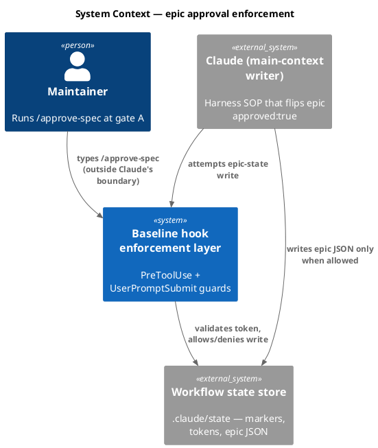

### C4 — Container

Deployable units inside the hook layer and the state files they read/write.

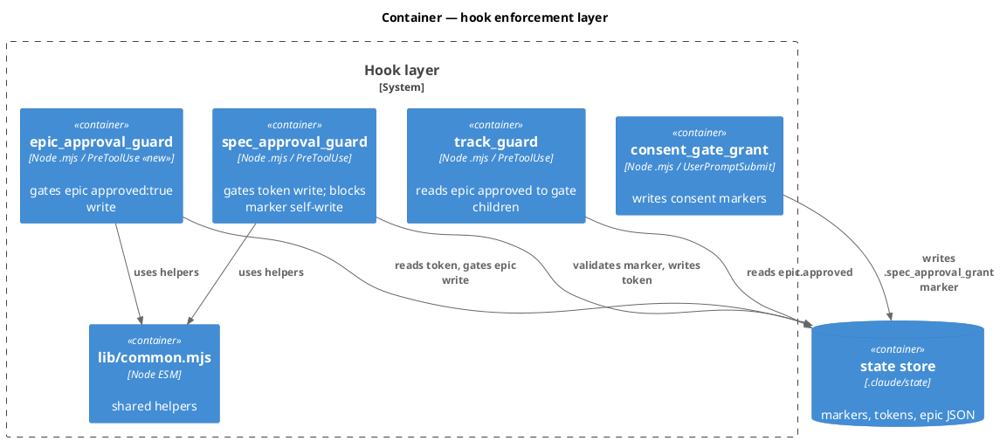

### C4 — Component (changed container only)

Internals of the new `epic_approval_guard` — the only changed unit.

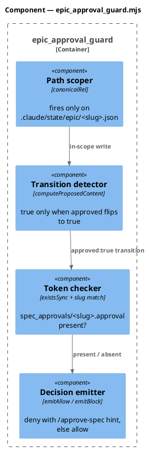

### Data model — class diagram

The only data contract is on-disk state. `epic_approval_guard` is `<<new>>`; `EpicState.approved` becomes a `<<guarded>>` field.

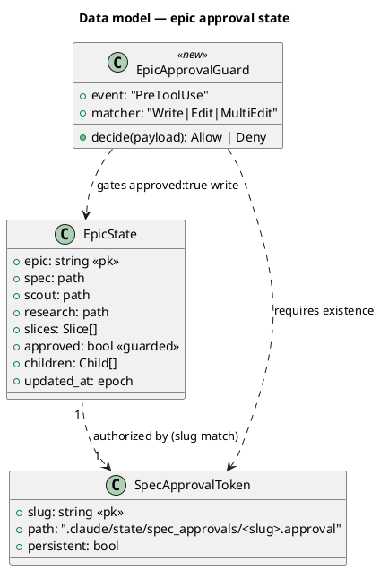

#### Migration DDL

```sql
-- No relational schema. The only data contract is the epic-state JSON file,
-- whose shape is unchanged (the `approved` field already exists). No forward
-- or reverse DDL. State migration of existing epic files is an explicit non-goal.
```

### Behavior — sequence per AC

One sequence per acceptance criterion.

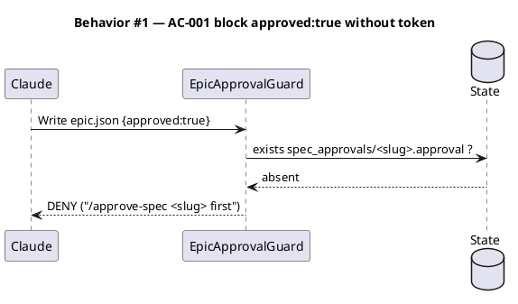

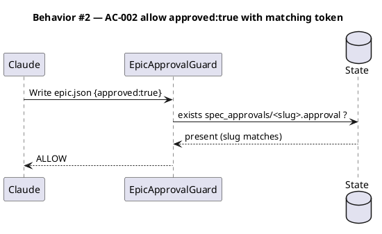

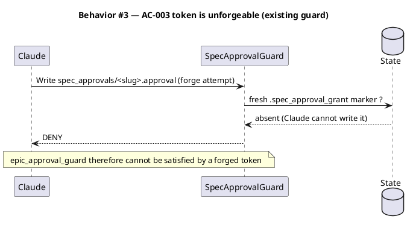

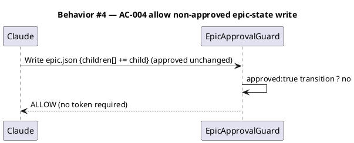

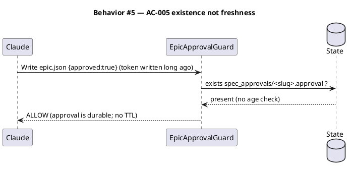

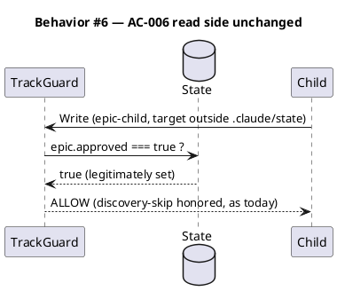

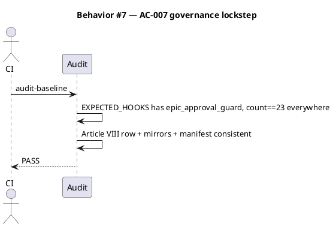

### State — core entity

The epic `approved` flag is a one-way latch, set once post-gate-A. The guard governs the `false → true` edge only.

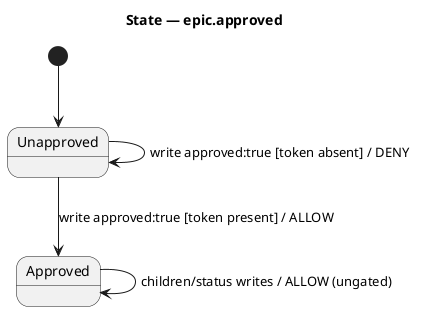

### Dependencies — graph

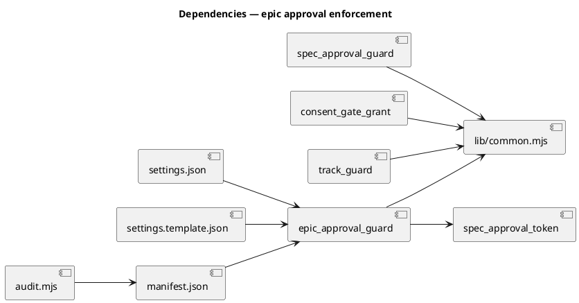

### Contracts

| Kind | Name | Input | Output | Errors | Idempotent |
|---|---|---|---|---|---|
| Hook | `epic_approval_guard` (PreToolUse / `Write\|Edit\|MultiEdit`) | hook payload `{tool_name, tool_input.file_path, tool_input.content/edits}` | `permissionDecision: deny` (with `/approve-spec <slug>` hint) when an `approved:true` transition to `.claude/state/epic/<slug>.json` lacks a matching token; otherwise implicit allow (exit 0, no output) | malformed payload / unreadable file → fail-safe allow only for non-transition writes; a detected `approved:true` transition with indeterminate token state → deny | yes (pure function of payload + on-disk token) |

### Libraries and versions

No third-party library is used — the change is internal Node `.mjs` hooks reusing in-repo helpers. The `context7` MCP is therefore **not applicable** (stated explicitly per the no-recall rule; nothing to verify).

| Library@version | Purpose | Key APIs | Confirmed via context7 |
|---|---|---|---|
| *(none — internal hooks only)* | — | reuses `lib/common.mjs` (`canonicalRel`, `canonicalSlug`, `computeProposedContent`, `emitAllow`, `emitBlock`, `readPayload`, `payloadGet`) | n/a |

### Alternatives considered

| Alt | Summary | Rejected because |
|---|---|---|
| A | New `/approve-epic` command + `CONSENT_MARKER_EPIC_APPROVE` + guard | Adds a redundant second human approval per epic and full hook-count churn for no security gain over B; the spec was already approved at gate A |
| C | Eliminate the stored flag; derive approval from the token at read time in `track_guard` | Cleanest long-term, but changes the contract of a just-shipped feature, needs a migration story, and read-time derivation is fragile against the planned `/epic-close` archival of the token (B checks at flip time, while the token is guaranteed present) |
| B2 | Fold the check into `track_guard` instead of a new hook | Viable; no count churn but couples two concerns in one hook. Kept live as the gate-A reviewer's alternative to B1 |

## Design calls

- *(none)* — the write_set is hooks + governance docs + tests; no UI surface, so no `design-ui` rows.

## Acceptance criteria

| ID | Criterion (given / when / then) | Upstream AC | Sequence |
|---|---|---|---|
| AC-001 | given a Write/Edit transitioning `approved` to `true` on `.claude/state/epic/<slug>.json`, when no `spec_approvals/<slug>.approval` token exists, then the guard denies the write | intake AC1 | §Behavior #1 |
| AC-002 | given the same `approved:true` transition, when the matching `spec_approvals/<slug>.approval` token exists, then the guard allows the write | intake AC2 | §Behavior #2 |
| AC-003 | given Claude attempts to create `spec_approvals/<slug>.approval` itself (to satisfy the gate), then the existing `spec_approval_guard` denies it (no fresh marker) — so the epic gate cannot be forged | intake AC3 (reframed: marker→token unforgeability) | §Behavior #3 |
| AC-004 | given a Write/Edit to an epic-state file that does not transition `approved` to `true` (e.g. `children[]` append, child `status` flip), when no token exists, then the guard allows the write | intake AC4 | §Behavior #4 |
| AC-005 | given a matching token written arbitrarily long ago, when an `approved:true` write is attempted, then the guard allows it — existence + slug match only, no age check (approval is durable) | intake AC5 (reframed: marker-TTL→token-durability) | §Behavior #5 |
| AC-006 | given an epic whose flag was set through the gated path, then `track_guard`'s epic-child discovery-skip behavior is unchanged | intake AC6 | §Behavior #6 |
| AC-007 | given the full constitutional surface, then `audit-baseline` PASSes: `epic_approval_guard` in the Article VIII table + `EXPECTED_HOOKS`, hook count consistent (23) at every assertion site, `seed.md §4.1` + both byte-equal mirrors updated, manifest regenerated | intake AC7 | §Behavior #7 |

## Test plan

| Category | Scenario | Expected | Covers |
|---|---|---|---|
| Golden path | `approved:true` write with matching token present | allow | AC-002 |
| Contract violation | `approved:true` write, no token | deny + `/approve-spec` hint | AC-001 |
| Forgery chain | Claude writes `spec_approvals/<slug>.approval` with no fresh marker | denied by `spec_approval_guard` | AC-003 |
| Input boundary | epic-state write that leaves `approved` false / absent / unchanged | allow (ungated) | AC-004 |
| Input boundary | slug mismatch — token for epic `X`, write to epic `Y` json | deny | AC-001 |
| Durability | token mtime far in the past, `approved:true` write | allow (no TTL) | AC-005 |
| Edit-path | transition expressed via Edit/MultiEdit (not Write) reconstructed by `computeProposedContent` | detected + gated | AC-001, AC-002 |
| Regression trap | non-epic-state writes (other `.claude/state/*`, source files) | guard is a no-op | AC-004 |
| Governance | `audit-baseline` run after the change | PASS, count==23 | AC-007 |
| Read-side regression | `track-guard-epic-child.test.mjs` suite | still green (read side untouched) | AC-006 |

## Observability

| Signal | Name | Shape | Purpose |
|---|---|---|---|
| Log | `epic_approval_guard` hook log line | fields: `decision, slug, token_present` | audit/debug, consistent with existing guards' `logLine` |
| Metric | *(none)* | — | hooks emit no metrics; the audit is the steady-state signal |
| Alarm | `audit-baseline` CI gate | exit 1 on count/table drift | catches a half-applied governance bump |

## Rollout

- **Feature flag**: none — a structural guard cannot be half-on. It ships atomically with its governance updates.
- **Order**: 1) add `epic_approval_guard.mjs` + tests (red→green); 2) wire `settings.json` + `src/settings.template.json`; 3) update `CLAUDE.md` Article VIII + counts + `src/CLAUDE.template.md`; 4) update `seed.md §4.1` + `src/seed.template.md`; 5) add to `audit.mjs EXPECTED_HOOKS`; 6) `npm run build` to regenerate the manifest; 7) `audit-baseline` PASS gate.
- **Canary**: n/a (dev tooling). The `audit-baseline` PASS in `/integrate` is the success signal.

## Rollback

- **Kill-switch**: remove the `epic_approval_guard` line from `settings.json` (and revert the count bump) — the guard is additive and its removal restores prior behavior with no data effect.
- **Signal to roll back**: `epic_approval_guard` denies a *legitimate* post-gate-A flip (false positive) — detected by the harness failing to flip `approved:true` on an epic immediately after a real `/approve-spec`. Within one epic run. Mitigation: the Edit-path/`computeProposedContent` test (AC-002) is the pre-merge guard against this.

## Archive plan

- Defaults *(automatic)*: intake, scout, research, spec, spec-rendered/, spec approval.
- Extras *(list any non-default files)*:
  - *(none)*

## Open questions

- **B1 vs B2** — RESOLVED 2026-06-10: **B1** (dedicated `epic_approval_guard` hook; accept the 22→23 count bump for the clean Article VIII mapping). No longer open.
- **Read-side defense-in-depth** — leave `track_guard`'s `es.approved === true` read as-is (recommended; avoids the archival-coupling fragility) or add a token re-check at read time?
- **Existing on-disk epic states** — govern writes forward only (chosen) vs. re-validate any epic already carrying `approved:true`. Forward-only is moot for reads under B since the flag is still trusted on read.
- **Other trusted flips** (`harness_state`, `workflow.json → completed`) — confirmed out of scope here; note for a future pass.
