# Spec — conditional chore verify + valid vitest reporter

## Context

| Input | Path |
|---|---|
| Intake | `docs/intake/chore-verify-conditional.md` |
| BRD *(if any)* | *(none)* |
| Scout *(if any)* | `docs/scout/chore-verify-conditional.md` |
| Research *(if any)* | `docs/research/chore-verify-conditional.md` |
| Brief | `docs/brief/chore-verify-conditional.md` |

## Goal

After this spec ships, the `chore` track runs `verify` unless the chore's diff is pure-docs/prose AND the repo declares `project.json → test.kind: "behavior"`, and `/init-project`'s recommender emits a vitest command valid on v4 (`--reporter=dot`) plus `test.kind: "behavior"`.

## Non-goals

- Do **not** change the `verify`/`integrate` verdict PASS rule (`exit 0 AND ≥1 test executed AND no failed/errored test`). Only *when* `verify` runs in the chore track changes.
- Do **not** alter `verify` in any other track (`tdd-quickfix`, `spec-entry`, `freeform`, `epic`, `epic-child`).
- Do **not** add a `verify` node to the chore DAG (the 4-node DAG and `tests/byte-equivalent-migration.test.mjs` golden fixture stay byte-stable).
- Do **not** auto-classify "behavior vs structural" heuristically — the signal is the explicit `test.kind` key.
- Do **not** change the shipped default `test.cmd` (the baseline audit).

## Design

Diagrams are the contract. Prose is only for things a diagram cannot say.

The change is governance + config + skill-SOP, not runtime code. The "executors" are the model reading the amended `chore` SKILL.md (Article II) and the consumer's `project.json`. No new runtime helper is introduced — a resolver module exercised only by tests would be dead code under Article VI.4; the default-resolution rule is documented and asserted by content tests instead.

### C4 — System context

Who interacts with the chore-verification decision, and what it depends on.

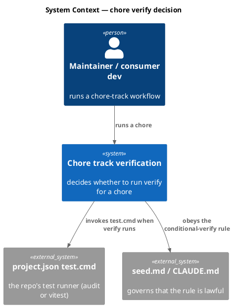

### C4 — Container

Deployable units inside the baseline boundary that this change touches.

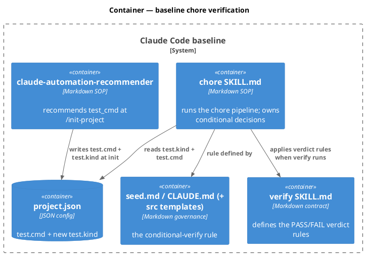

### C4 — Component (changed containers only)

The chore skill internals: the verify step moves from the mandatory block to the conditional block.

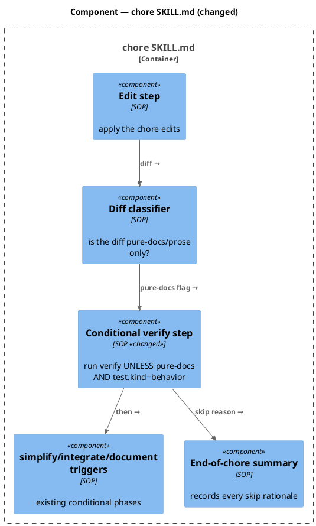

### Data model — class diagram

The `project.json → test` config gains one field.

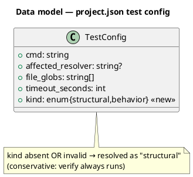

#### Migration (config schema, not SQL)

There is no database. The "migration" is an additive, backward-compatible JSON key.

```text
// forward — add optional key to project.json → test
//   "test": { ..., "kind": "behavior" }      // consumer behavior suite
//   key ABSENT                                // resolves to "structural" (default, baseline + existing installs)
// reverse — delete the "kind" key; behavior reverts to "structural" everywhere
```

### Behavior — sequence per AC

One sequence per acceptance criterion.

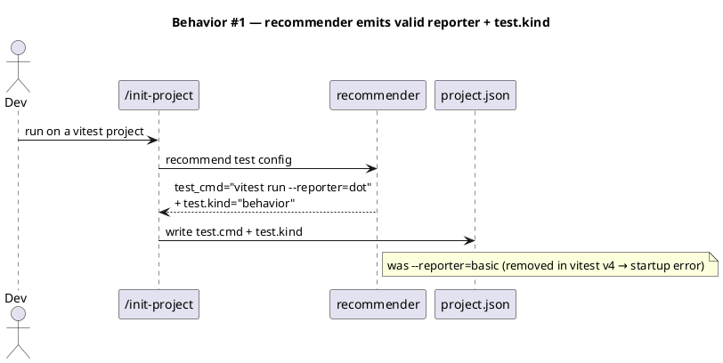

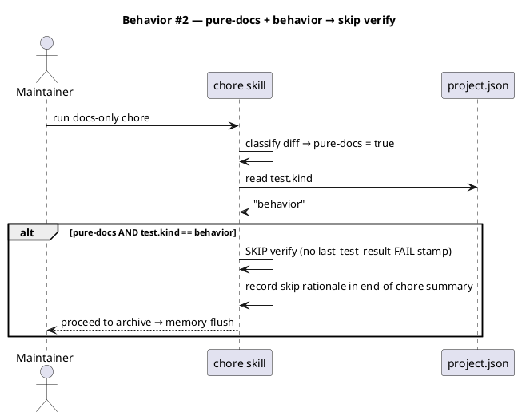

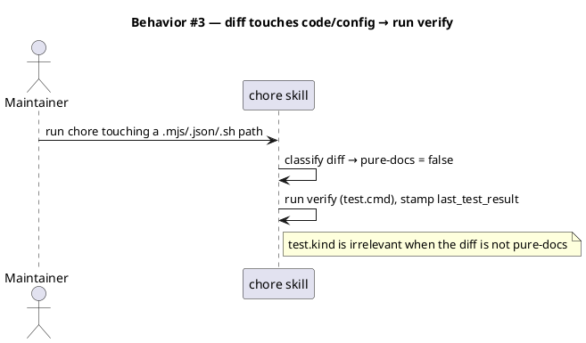

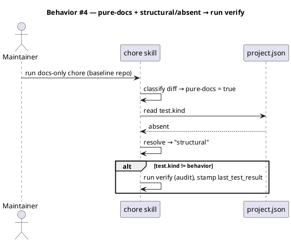

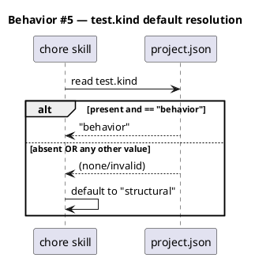

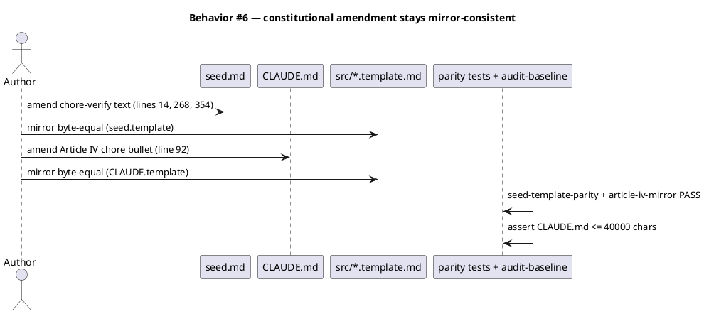

### State — core entity *(only if stateful)*

No non-trivial state machine — the decision is a pure function of (diff classification, test.kind). Heading kept to record the explicit choice.

### Dependencies — graph

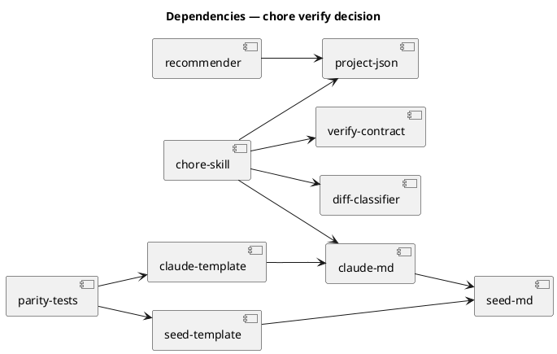

### Contracts

| Kind | Name | Input | Output | Errors | Idempotent |
|---|---|---|---|---|---|
| Config | `project.json → test.kind` | enum string | `"structural"` \| `"behavior"` | absent/invalid → resolved as `"structural"` | yes |
| Skill SOP | chore conditional verify | chore diff + `test.kind` | verify run (verdict stamped) OR documented skip | when run, `FAIL` stamp halts the chore | yes |
| Skill rec | recommender `test_cmd` (vitest) | vitest project | `vitest run --reporter=dot` + `test.kind:"behavior"` | — | yes |

### Libraries and versions

| Library@version | Purpose | Key APIs | Confirmed via context7 |
|---|---|---|---|
| `vitest@4.1.6` | the consumer test runner whose reporter flag is fixed | `--reporter` (valid: `dot`, `default`, `verbose`, `tree`, `tap`, `json`, `junit`; `basic` **removed** in v4) | yes (`/vitest-dev/vitest/v4.1.6`, migration + cli + reporters docs) |

### Alternatives considered

| Alt | Summary | Rejected because |
|---|---|---|
| A2 — verify DAG node + `/triage` exception | add a `verify` node to the chore track that triage excepts | breaks `byte-equivalent-migration` golden fixture; requires triage to predict the write_set before edits exist; contradicts how chore's other conditionals work |
| S2 — `test.covers_docs: bool` | a direct boolean | narrower semantics, awkward double-negative default; less reusable than `test.kind` |
| S3 — `chore.skip_verify_on_docs_only: bool` | a chore-scoped policy flag | encodes policy not the fact about `test.cmd`; couples the knob to one track |

## Design calls

No UI surface — write_set is governance docs, the chore/recommender SKILLs, and `project.json`; it does not intersect `project.json → tdd.ui_globs`.

- *(none)*

## Acceptance criteria

| ID | Criterion (given / when / then) | Upstream AC | Sequence |
|---|---|---|---|
| AC-001 | given the recommender SKILL, when its recommended vitest `test_cmd` is read, then it contains `--reporter=dot` and no `--reporter=basic`, and it also emits `test.kind: "behavior"` | intake AC 1 | §Behavior #1 |
| AC-002 | given a chore whose diff is pure-docs/prose only and `project.json → test.kind == "behavior"`, when the chore skill runs, then verify is skipped (no FAIL stamp) and the skip is recorded in the end-of-chore summary | intake AC 2, AC 5 | §Behavior #2 |
| AC-003 | given a chore whose diff touches any code/config/script path, when the chore skill runs, then verify runs regardless of `test.kind` | intake AC 3 | §Behavior #3 |
| AC-004 | given a chore whose diff is pure-docs but `test.kind` is absent or `"structural"`, when the chore skill runs, then verify runs (baseline behavior preserved) | intake AC 2 | §Behavior #4 |
| AC-005 | given `test.kind` absent or set to any value other than `"behavior"`, when the value is resolved, then it resolves to `"structural"` | intake AC 2 | §Behavior #5 |
| AC-006 | given the amendment, when `audit-baseline` and the parity tests run, then `seed.md`↔`src/seed.template.md` and `CLAUDE.md`↔`src/CLAUDE.template.md` stay byte-consistent and `CLAUDE.md` ≤ 40000 chars | intake AC 4 | §Behavior #6 |

## Test plan

All tests are content/contract assertions over docs + config (the same shape as the existing `seed-template-parity` / `derive-counts` invariant tests) — there is no runtime module to unit-test.

| Category | Scenario | Expected | Covers |
|---|---|---|---|
| Golden path | grep recommender SKILL.md recommended `test_cmd` | contains `--reporter=dot`, no `--reporter=basic`, contains `test.kind`/`"behavior"` | AC-001 |
| Golden path | chore SKILL.md verify trigger text | verify is in the conditional block; trigger names pure-docs AND `test.kind == "behavior"`; summary records the skip | AC-002 |
| Contract violation | chore SKILL.md non-docs path | states verify runs when the diff touches code/config/script regardless of `test.kind` | AC-003 |
| Input boundary | chore SKILL.md docs + structural | states verify runs when `test.kind` absent/`structural` even for pure-docs | AC-004 |
| Input boundary | `test.kind` default-resolution rule | docs (seed.md + chore SKILL) state absent/invalid → `structural` | AC-005 |
| Regression trap | seed↔template + CLAUDE↔template parity, CLAUDE.md ≤ 40000, `byte-equivalent-migration` chore fixture, `derive-counts` | all unchanged / green | AC-006 |
| Regression trap | `obj/template/.claude/project.json` | shipped template default omits `test.kind` (absent → structural) or sets it explicitly to `structural`; `audit-baseline` still PASS with the key present | AC-005, AC-006 |

## Observability

| Signal | Name | Shape | Purpose |
|---|---|---|---|
| Log | end-of-chore summary "verify skipped" line | text: which conditional phases ran/skipped + rationale | auditability of the skip decision (the only runtime signal; mandated by chore SKILL.md) |

## Rollout

- **Feature flag**: `project.json → test.kind` itself — absent default `"structural"` = old behavior (verify always runs). Opt-in to the new skip by setting `"behavior"`.
- **Migration order**: 1 amend `seed.md` (+ mirror) → 2 amend `CLAUDE.md` (+ mirror) → 3 amend `chore` SKILL.md → 4 add `test.kind` doc/default to `project.json` + `obj/template` → 5 fix recommender reporter + `test.kind` emission → 6 add content tests.
- **Canary**: behavior-preserving by default — existing installs and the baseline (audit, structural) see no change until they opt in.

## Rollback

- **Kill-switch**: remove/ignore `test.kind` (absent → structural → verify always runs); or revert the `chore`/`seed`/`CLAUDE` edits.
- **Signal to roll back**: any parity test or `audit-baseline` FAIL in CI, or a docs-only chore on a structural repo skipping verify (it must not) — caught by AC-004 test before merge.

## Archive plan

- Defaults *(automatic)*: intake, scout, research, brief, spec, spec-rendered/, spec approval.
- Extras *(list any non-default files)*:
  - *(none)*

## Open questions

- **Recommender scope (research Open Q1).** This spec includes making the recommender emit `test.kind: "behavior"` alongside the vitest command (AC-001), so a fresh vitest install actually benefits from the trap fix. Confirm at approval that this scope addition is wanted in *this* cycle vs. a follow-up.
- **audit-baseline tolerance.** Confirm `audit-baseline` treats `project.json → test.kind` as an allowed optional key (it audits key presence) — verified by the AC-006 regression row; flag if the audit needs an allowlist update.
