# Spec — gitignore setup: generation skill, init creation, commit-leak guard

## Context

| Input | Path |
|---|---|
| Intake | `docs/intake/gitignore-setup.md` |
| BRD *(if any)* | *(none)* |
| Scout *(if any)* | `docs/scout/gitignore-setup.md` |
| Research *(if any)* | `docs/research/gitignore-setup.md` |
| Brief | `docs/brief/gitignore-setup.md` |

## Decisions

### Decision: A — canonical must-ignore source of truth
**Options considered:** Shipped data file + project.json extras / project.json only / Hardcoded in hooks lib/common.mjs
**Chosen:** Data file (baseline defaults) + project.json extras, with the data file kept in the `.claude/` directory (shipped via the copied tree, not a `src/` overlay). The guard's effective set = baseline data file ∪ consumer extras in `project.json`, read at runtime.
**Engineer rationale (verbatim):**
> We wil use data file + project.json (1) but we will keep the data file in .claude directory

**Dismissed alternatives:**
- project.json only — baseline defaults don't belong in per-project config; a fresh repo may lack it when the guard runs.
- hardcoded in common.mjs — hooks-only; install (`src/cli`) and the markdown skill can't share it → duplication → drift.

### Decision: B — gitignore.io integration + offline fallback
**Options considered:** Skill enriches, install offline-only / install.js fetches with timeout+fallback
**Chosen:** Install/init writes only the vendored baseline (zero network, deterministic). The `gitignore` skill performs gitignore.io enrichment via WebFetch with offline fallback to the baseline data file. The commit guard never touches the network. (Engineer approved the recommendation.)
**Dismissed alternatives:**
- install.js fetches gitignore.io — bakes a network call + flaky path into the most critical install path; violates offline-first install.

### Decision: C — commit-guard leak mechanism
**Options considered:** Block on staged must-ignore path / Hybrid: block staged + warn latent gap / Block when set isn't fully ignored
**Chosen:** Hybrid — hard-block when a STAGED path matches the must-ignore set (offline, via `git diff --cached` + `git check-ignore`), AND emit a non-blocking advisory when a baseline must-ignore path exists in the tree but isn't ignored (latent gap). Fail CLOSED on inspection error for an unambiguous `git commit`. Composes after `git_commit_guard`; both independent denials.
**Engineer rationale (verbatim):**
> Hybrid: block staged + warn latent gap

**Dismissed alternatives:**
- staged-only (C1) — engineer wanted latent-gap visibility too, as an advisory.
- full-set enforcement (C2) — blocks unrelated commits until any `.gitignore` gap is fixed → high friction.

### Decision: D — project.json key shape + guard read path
**Options considered:** gitignore.extra_must_ignore + overlaid data file / single project.json array / Decide during implementation
**Chosen:** The spec fixes only the SEMANTICS (guard set = baseline `.claude/` data file ∪ consumer extras in `project.json`). The exact `project.json` key name and the data file's precise `.claude/` path are decided at `/tdd`.
**Engineer rationale (verbatim):**
> Decide during implementation

## Goal

A baseline-equipped project always has a correct, non-destructively-maintained `.gitignore`, and a `git commit` is hard-blocked before it lands if it stages a path that must be ignored — with no network call at commit or install time.

## Non-goals

- No destructive overwrite/reorder of an existing `.gitignore` (init is add-only).
- No gitignore.io (or any network) at commit time or on the install critical path.
- No change to `verify` or any other workflow track.
- No history rewrite / auto-un-tracking of already-committed files (the guard gates new commits only).
- The secret-vs-state distinction does not change the outcome: a staged leak of either blocks.

## Design

Diagrams are the contract. Prose is only for what a diagram cannot say. The change adds one skill, one hook, one shipped baseline data file, an install/init merge step, and a `project.json` extension — plus the mechanical governance cascade (skill 41→42, hook 23→24).

### C4 — System context

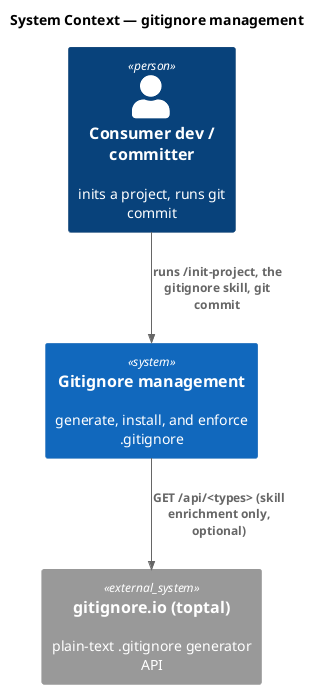

### C4 — Container

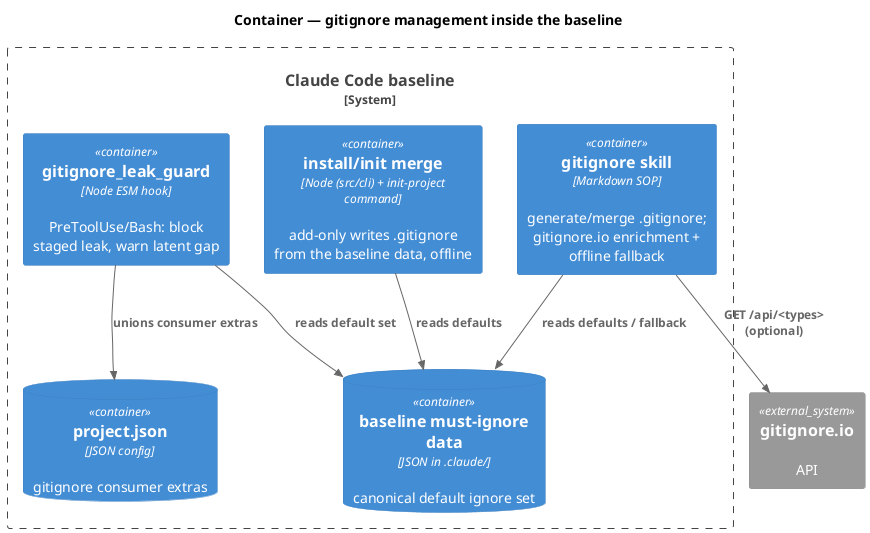

### C4 — Component (the new hook)

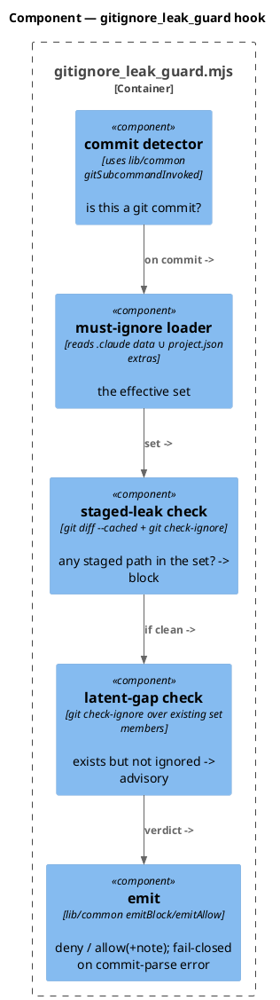

### Data model — class diagram

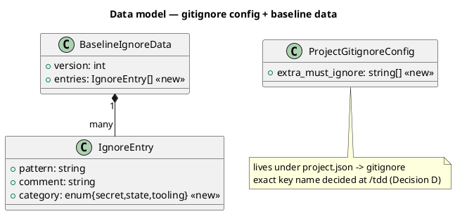

#### Migration (config schema, not SQL)

```text
// forward — additive, backward-compatible:
//   new shipped data file in .claude/ (baseline must-ignore set; exact path @ /tdd)
//   project.json -> gitignore.<extras-key>: string[]   // absent => empty extras
// reverse — delete the data file + the project.json gitignore block; guard no-ops when the data file is absent (fail-open on MISSING data, fail-closed on inspection error).
```

### Behavior — sequence per AC

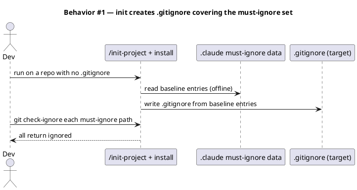

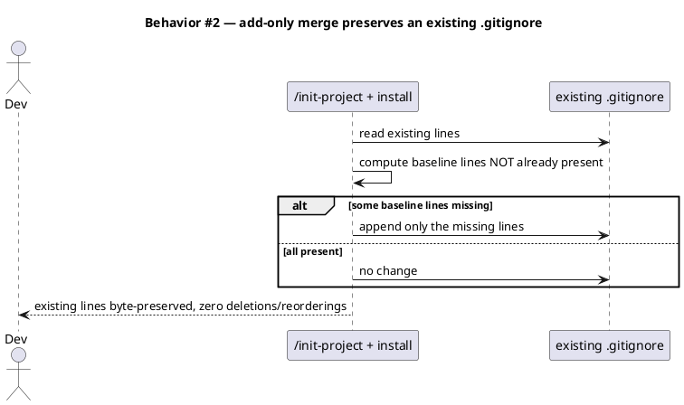

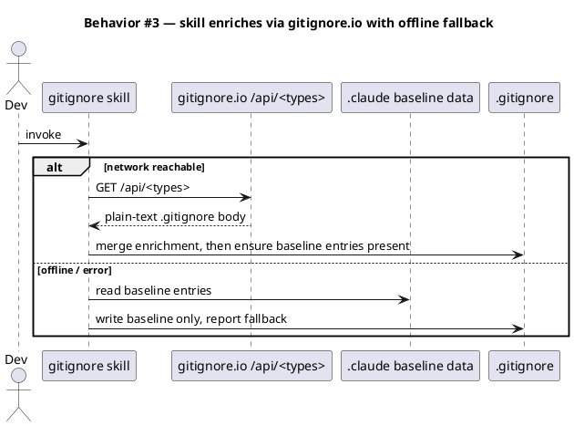

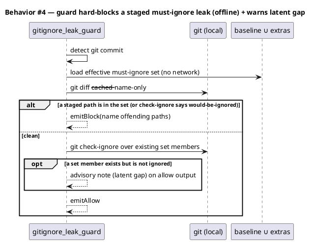

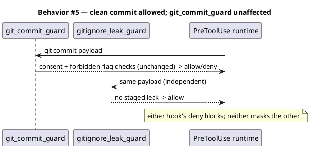

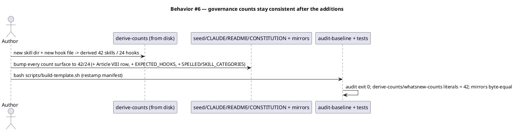

### State — core entity *(only if stateful)*

No non-trivial state machine — the guard verdict is a pure function of (staged paths, effective set, tree state). Heading kept to record the explicit choice.

### Dependencies — graph

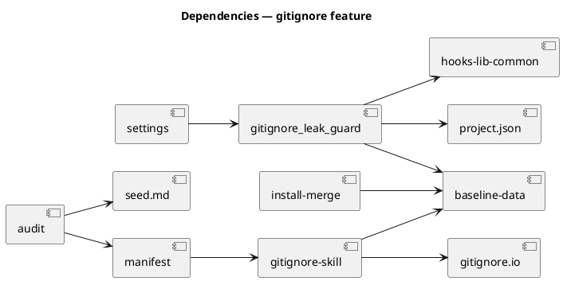

### Contracts

| Kind | Name | Input | Output | Errors | Idempotent |
|---|---|---|---|---|---|
| Hook | `gitignore_leak_guard` (PreToolUse/Bash) | commit payload, effective set | allow / deny(+named paths) / allow+advisory | fail-closed (deny) on inspection error for a clear commit; allow on non-commit/unparseable-non-commit | yes |
| Skill | `gitignore` | optional types, target repo | merged `.gitignore` | gitignore.io unreachable → vendored fallback (no error surfaced) | yes (add-only) |
| Install | `materializeGitignore(target)` (or init Step 6 sub-step) | target repo, baseline data | created/merged `.gitignore` | existing file → add-only merge | yes |
| Config | `project.json → gitignore.<extras-key>` | array of patterns | consumer extras unioned into the guard set | absent → empty | yes |
| Service | `GET https://www.toptal.com/developers/gitignore/api/<types>` | comma-separated type tokens | plain-text `.gitignore` | network/4xx → fallback | yes |

### Libraries and versions

| Library@version | Purpose | Key APIs | Confirmed via |
|---|---|---|---|
| gitignore.io (toptal) — web service, no version pin | optional `.gitignore` enrichment in the skill | `GET /api/<comma,list>` → plain text; `GET /api/list` | WebFetch of `https://www.toptal.com/developers/gitignore/api/list` (2026-06-15); it is a network service, not an npm dependency, so there is no lockfile entry |

### Alternatives considered

| Alt | Summary | Rejected because |
|---|---|---|
| install.js fetches gitignore.io | tailored defaults at init | network on the install critical path; offline-first violation (Decision B) |
| project.json-only source of truth | one read for the guard | defaults don't belong in per-project config (Decision A) |
| staged-only guard | block only actual staged leaks | engineer wanted latent-gap advisory too (Decision C → hybrid) |

## Design calls

No UI surface — write_set is a skill, a hook, a data file, `src/cli`/init, `project.json`, and governance docs; it does not intersect `project.json → tdd.ui_globs`.

- *(none)*

## Acceptance criteria

| ID | Criterion (given / when / then) | Upstream AC | Sequence |
|---|---|---|---|
| AC-001 | given a repo with no `.gitignore`, when init runs, then a `.gitignore` exists and every baseline must-ignore path returns ignored under `git check-ignore` | intake AC 1 | §Behavior #1 |
| AC-002 | given an existing `.gitignore` with project lines, when init runs, then those lines are byte-preserved and only missing baseline lines are appended (zero deletions/reorderings) | intake AC 2 | §Behavior #2 |
| AC-003 | given the `gitignore` skill, when gitignore.io is reachable it produces an enriched file; when unreachable it writes the vendored baseline and reports the fallback (no network error surfaced) | intake AC 3 | §Behavior #3 |
| AC-004 | given a staged path in the must-ignore set, when `git commit` is attempted, then the hook denies and names the path(s), performs no network call, and emits a non-blocking advisory for any latent (existing-but-unignored) set member | intake AC 4 | §Behavior #4 |
| AC-005 | given a clean stage, when `git commit` is attempted, then the hook allows it and `git_commit_guard`'s consent/forbidden-flag checks still apply unchanged | intake AC 5 | §Behavior #5 |
| AC-006 | given the additions, when `audit-baseline` and the suite run, then derived skills=42 and hooks=24 match every count surface (seed §4.1/§4.3 + mirror, CLAUDE.md Article VIII row + counts + mirror, README, CONSTITUTION Appendix A/B, derive-counts SPELLED/SKILL_CATEGORIES, audit EXPECTED_HOOKS, derive-counts.test.mjs + whatsnew-counts.test.mjs), mirrors stay byte-equal, manifest is restamped, and the audit exits 0 | intake AC 6 | §Behavior #6 |

## Test plan

| Category | Scenario | Expected | Covers |
|---|---|---|---|
| Golden path | init in a fixture repo with no `.gitignore` | file created; `git check-ignore` returns ignored for every baseline set member | AC-001 |
| Input boundary | init with an existing `.gitignore` carrying custom lines | custom lines byte-preserved; only missing baseline lines appended | AC-002 |
| Failure mode | skill run with gitignore.io unreachable (offline) | vendored baseline written; fallback reported; no thrown network error | AC-003 |
| Contract violation | hook payload with a staged `.env` / `.claude/state/x` | `emitBlock` naming the path; no network call made | AC-004 |
| Golden path | hook payload with a clean stage | `emitAllow`; `git_commit_guard` behavior unchanged (separate fixture) | AC-005 |
| Input boundary | hook with a latent gap (set member exists, not ignored, not staged) | allow + advisory note (not a block) | AC-004 |
| Regression trap | derive-counts + audit after additions | derived 42/24; all count surfaces agree; `derive-counts.test.mjs`/`whatsnew-counts.test.mjs` literals = 42/24; mirrors byte-equal; audit exit 0 | AC-006 |
| Failure mode | hook inspection throws on an unambiguous `git commit` | fail-closed (`emitBlock`) | AC-004 |

## Observability

| Signal | Name | Shape | Purpose |
|---|---|---|---|
| Log | guard decision via `logLine` | text: commit detected, deny/allow, offending paths or latent-gap note | audit/debug the block |
| Note | skill fallback report | text: "gitignore.io unreachable; wrote vendored baseline" | tells the user enrichment was skipped |

## Rollout

- **Feature flag**: the baseline data file's presence + the wired hook. Absent data file → guard fails open (no-op); the feature is inert until shipped.
- **Migration order**: 1 baseline data file (`.claude/`) → 2 `gitignore` skill → 3 install/init merge step → 4 `gitignore_leak_guard` hook + settings wiring (both `.claude/settings.json` and `src/settings.template.json`) → 5 governance cascade (counts 42/24 across all surfaces + EXPECTED_HOOKS + SPELLED/SKILL_CATEGORIES + tests) → 6 `bash scripts/build-template.sh` restamp → 7 audit.
- **Canary**: behavior-preserving for existing repos (add-only `.gitignore`, guard only blocks genuine staged leaks).

## Rollback

- **Kill-switch**: remove the hook wiring from `settings.json` (guard goes silent) and/or delete the baseline data file (guard fails open). Revert the skill/install/count edits.
- **Signal to roll back**: any parity/audit/count test FAIL in CI, or the guard blocking a commit with no must-ignore path staged (false positive) — caught by the AC-005 clean-commit test before merge.

## Archive plan

- Defaults *(automatic)*: intake, brief, scout, research, spec, spec approval.
- Extras *(list any non-default files)*:
  - *(none)* — the new skill/hook/data files are product code committed on the branch, not workflow artifacts.

## Open questions

- **Decision D deferred to /tdd**: exact `project.json` key name under `gitignore` (e.g. `extra_must_ignore`) and the precise `.claude/` path of the baseline data file (e.g. `.claude/skills/gitignore/baseline-ignores.json` vs `.claude/gitignore-baseline.json`). Semantics are fixed; naming is the implementer's call.
- **Baseline default token set** for the gitignore.io enrichment call (e.g. `node,macos,windows,linux,visualstudiocode`) and the exact vendored baseline entries — finalized at /tdd from this repo's own `.gitignore` as the reference.
- **CONSTITUTION Appendix A is stale at "22 hook scripts"** (disk 23); the cascade fixes it to 24 (a +2 correction), and re-buckets the category line.
