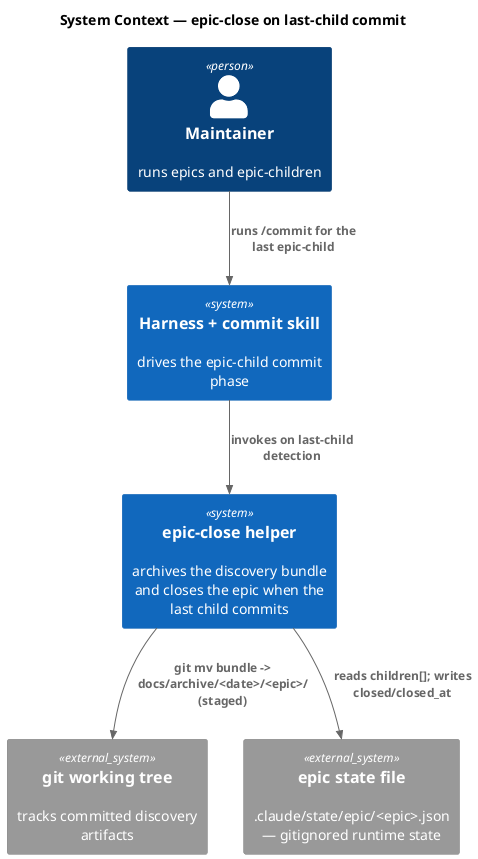
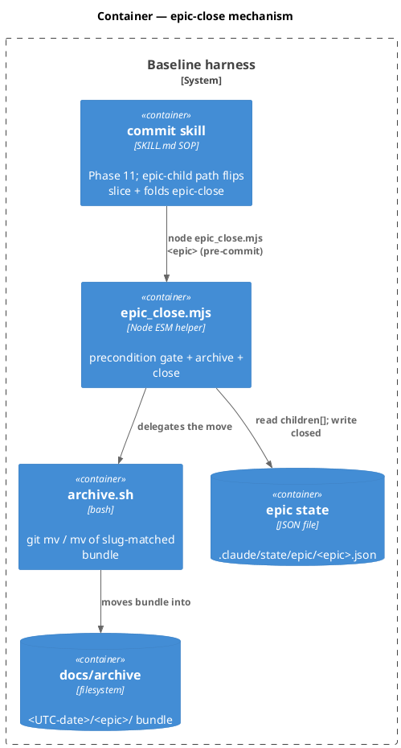
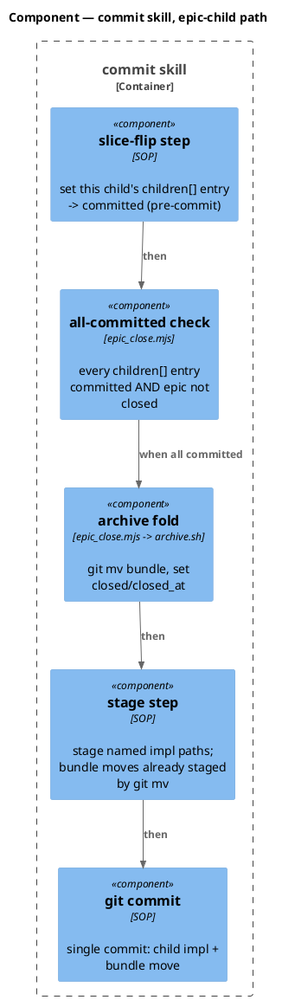
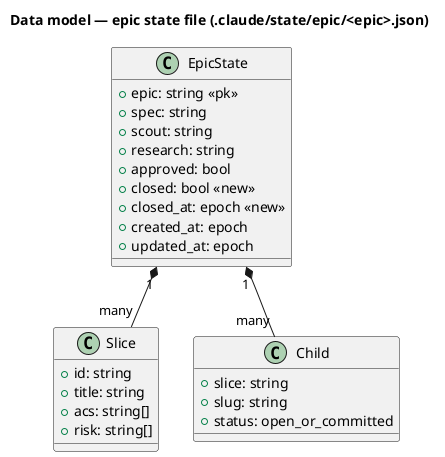
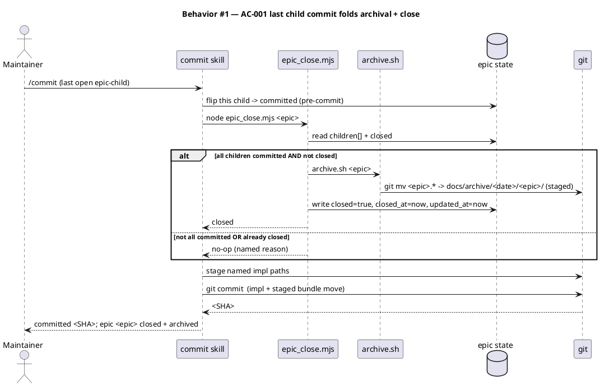
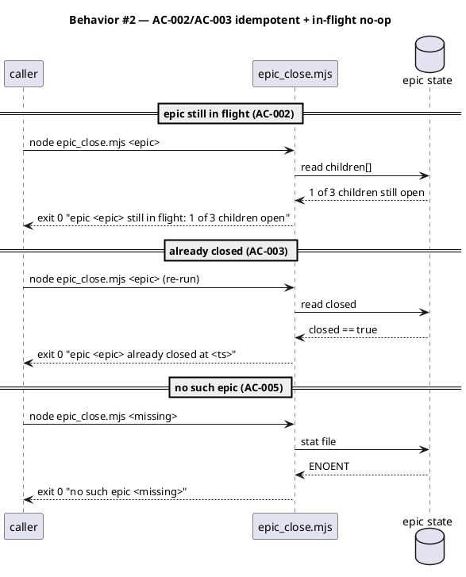
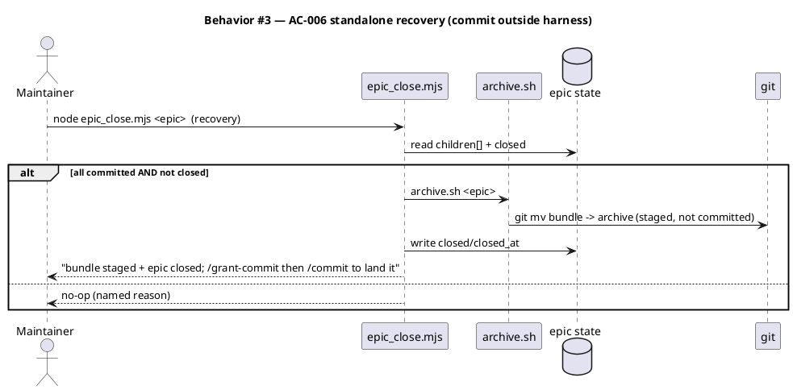
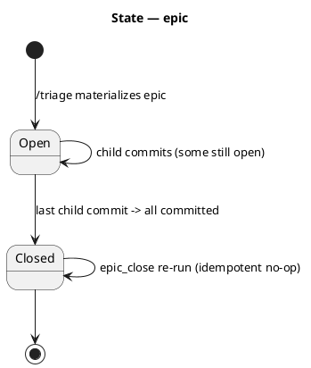
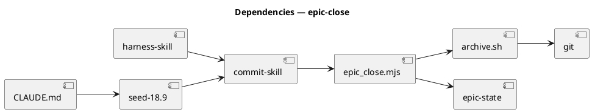

# Spec — epic-close full-bundle archival on last-child commit

## Context

| Input | Path |
|---|---|
| Intake | *(excepted — spec-entry track)* |
| BRD *(if any)* | *(none)* |
| Scout *(if any)* | *(excepted — spec-entry track)* |
| Research *(if any)* | *(excepted — spec-entry track)* |
| Brainstorm brief | `docs/brief/epic-close-bundle-archival.md` |
| Backlog source | `epic-close-full-bundle-archival-when-children-resolve-02a3` |

This spec actuates the deferred `/epic-close` concern named verbatim in `docs/init/seed.md` §18.9: *"archival of the whole bundle is an `/epic-close` concern (deferred; not actuated in this revision — children archive only their own slice artifacts)."*

## Goal

When the last open child of an `epic` finishes committing, the epic's live discovery bundle (`intake`/`brief`/`scout`/`research`/`spec` + rendered diagrams + spec-approval token, all named `<epic>.*`) is moved into `docs/archive/<UTC-date>/<epic>/` as part of that same child commit, and the epic-state file is marked `closed` — so a completed epic leaves the live `docs/` tree exactly like every other finished workflow, with zero new consent gate.

## Non-goals

- **No new skill, command, hook, or workflow track node.** The mechanism is a helper folded into the existing `commit` node — skill count stays 42, hook count stays 24, `.claude/workflows.jsonl` is unchanged.
- **Children's own slice archives are untouched** — each `epic-child` already archived its slice artifacts; epic-close moves only the epic-level discovery bundle.
- **No partial archiving** — an epic with any still-open child is left completely alone.
- **No git-history rewrite** — the move is an ordinary working-tree change captured by the last child's normal commit; nothing retroactive.
- **The epic-state record is retained, not deleted** — `closed: true` + `closed_at` are added in place so the epic's history stays inspectable.
- **`approved` is never written by this path** — only `closed`/`closed_at`/`updated_at` are touched (keeps `epic_approval_guard` out of the picture).

## Design

Diagrams are the contract. Prose is only for things a diagram cannot say.

The load-bearing decision (step vs. hook vs. fold) is settled here: **fold a precondition-gated helper into the `commit` node.** A standalone `/epic-close` skill (Alternative A) and a last-child hook (Alternative B) are both rejected below for cascade cost and for misclassifying orchestration as enforcement.

### C4 — System context

Who interacts with the system, and which external systems it depends on.



### C4 — Container

Deployable units inside the system boundary and how they communicate.



### C4 — Component (changed containers only)

The `commit` skill's epic-child path is the only container whose internals change.



### Data model — class diagram

The "data model" here is the gitignored epic-state file schema. Two fields are added (`<<new>>`); `children[]` and `approved` are unchanged.



#### Migration "DDL" — state-file schema delta

There is **no SQL database**; the epic state file is JSON. The schema change is additive and back-compatible — absent `closed` reads as `false`.

```sql
-- forward (conceptual; applied by epic_close.mjs as a JSON merge)
-- EpicState += { "closed": true, "closed_at": <epoch> }   -- only on a real close
-- reverse
-- EpicState -= { "closed", "closed_at" }                  -- delete keys; epic reverts to open
```

### Behavior — sequence per AC

One sequence per acceptance criterion. The sequence is the contract.







### State — epic lifecycle



### Dependencies — graph



### Contracts

| Kind | Name | Input | Output | Errors | Idempotent |
|---|---|---|---|---|---|
| CLI helper | `node .claude/skills/commit/epic_close.mjs <epic>` | epic slug | exit 0 + one-line status on stdout (`closed` / named no-op) | exit 2 on missing slug arg or unparseable state JSON | yes — already-closed / in-flight / absent all no-op |
| SOP | `commit` skill epic-child path | the child's `workflow.json` (`epic`, `slice`) | single commit containing child impl + staged bundle move | inherits `git_commit_guard` | flip + fold are no-ops on re-entry |
| State write | `EpicState.closed` | — | `closed:true, closed_at:<epoch>` merged into `.claude/state/epic/<epic>.json` | — | re-write of already-closed is a no-op |

### Libraries and versions

No third-party libraries are introduced. The helper uses only the Node.js standard library (`node:fs`, `node:child_process` to invoke the shipped `archive.sh`). No `context7` lookup required.

| Library@version | Purpose | Key APIs | Confirmed via context7 |
|---|---|---|---|
| *(none — Node stdlib only)* | — | `fs.readFileSync`, `fs.writeFileSync`, `execFileSync` | n/a |

### Alternatives considered

| Alt | Summary | Rejected because |
|---|---|---|
| A | Standalone `/epic-close` skill that creates its own consent-gated commit | Bumps skill count 42→43, cascading count edits across CLAUDE.md/seed/README/docs-site/annex + manifest, and adds a new `/grant-commit` gate at the end of every epic. Disproportionate for once-per-epic bookkeeping. |
| B | New last-child Stop/PostToolUse hook that fires on commit | Hooks are the constitution's **enforcement** layer (consent/ordering at tool boundaries), not orchestration; Article II places orchestration in main context/skills. Bumps hook count 24→25 and needs a seed §4.1 amendment. |
| C | Fold into commit but keep the `children[]` flip in the harness (post-commit) | At pre-commit time the last child is still `open`, so the all-committed check would miss and the bundle would not ride the commit — forcing a second consent-gated commit. Resolved by moving the flip pre-commit into the `commit` skill (this spec). |

## Design calls

This spec's write_set touches only `.mjs` / `SKILL.md` / `docs/init/seed.md` / `CLAUDE.md` / `src/CLAUDE.template.md` / tests — none intersect `project.json → tdd.ui_globs`. No UI surface.

- *(none)*

## Acceptance criteria

Numbered, testable, traced. Each AC points to the §Behavior sequence that defines it.

| ID | Criterion (given / when / then) | Upstream | Sequence |
|---|---|---|---|
| AC-001 | given an epic whose every `children[]` entry will be `committed` after this child's commit, when the last `epic-child` runs `/commit`, then the discovery bundle (`<epic>.*` + `_rendered/<epic>/` + `spec_approvals/<epic>.approval`) is `git mv`'d into `docs/archive/<UTC-date>/<epic>/` within that same commit and the epic state gets `closed:true` + `closed_at` | brief desired-state | §Behavior #1 |
| AC-002 | given an epic with ≥1 still-open child, when `epic_close.mjs <epic>` runs, then it exits 0 with `still in flight: <k> of <n> children open` and moves nothing and writes no `closed` flag | brief non-goals (no partial) | §Behavior #2 |
| AC-003 | given an epic already `closed:true`, when `epic_close.mjs <epic>` runs again, then it exits 0 with `already closed` and is a no-op (no double-move, no overwrite) | brief idempotency | §Behavior #2 |
| AC-004 | given a fully-committed epic, when epic-close runs, then `approved` is never modified and the epic state file is retained (not deleted) | brief non-goals | §Behavior #1 |
| AC-005 | given no `.claude/state/epic/<epic>.json`, when `epic_close.mjs <epic>` runs, then it exits 0 with `no such epic`; given malformed JSON, it exits 2 | robustness | §Behavior #2 |
| AC-006 | given a child committed outside the harness leaving all children `committed`, when the maintainer runs `epic_close.mjs <epic>` standalone, then the bundle is staged + state closed and the user is told to `/grant-commit` then `/commit` | brief recovery / open-q | §Behavior #3 |
| AC-007 | given this change ships, when `audit-baseline` runs, then it PASSES with skill count = 42 and hook count = 24 unchanged, and `CLAUDE.md` ↔ `src/CLAUDE.template.md` remain byte-equal | governance integrity | §Behavior #1 |
| AC-008 | given `docs/init/seed.md` §18.9, when this ships, then the "deferred; not actuated" sentence is replaced by the actuated mechanism and the epic-state schema block lists `closed`/`closed_at`; `.claude/workflows.jsonl` is unchanged | Article I precedence (seed→CLAUDE→impl) | §Behavior #1 |

## Test plan

`project.json → test.kind` is `structural`, so `verify` runs. The `scenario` skill turns these into failing tests; main context decides the recipe.

| Category | Scenario | Expected | Covers |
|---|---|---|---|
| Golden path | fully-committed 3-child epic → run helper | bundle under `docs/archive/<date>/<epic>/`; state `closed:true`+`closed_at` | AC-001 |
| Golden path | commit-skill last-child path folds move into one commit | single commit contains impl + moved bundle (no second commit) | AC-001 |
| Input boundary | 1-of-3 / 2-of-3 children committed | no-op exit 0, "still in flight" | AC-002 |
| Idempotency | run helper twice on a closed epic | second run no-op, no overwrite error, archive unchanged | AC-003 |
| Contract violation | missing slug arg / malformed state JSON | exit 2 | AC-005 |
| Failure mode | epic state file absent | exit 0, "no such epic" | AC-005 |
| Failure mode | archive target dir already partially exists | refuse-to-overwrite surfaced (archive.sh exit 1), no `closed` written | AC-003 |
| Concurrency / ordering | flip-then-check ordering: child marked committed before all-committed check | helper sees all committed and folds in same commit | AC-001 |
| Regression trap | `approved` untouched; epic file not deleted | both invariants hold post-close | AC-004 |
| Regression trap | `audit-baseline` skill=42 / hook=24; CLAUDE.md↔template byte-equal | PASS | AC-007 |
| Regression trap | `.claude/workflows.jsonl` byte-unchanged; seed §18.9 deferred sentence gone | both hold | AC-008 |
| Recovery | standalone helper after out-of-harness commit | stages + closes + prompts for commit | AC-006 |

## Observability

| Signal | Name | Shape | Purpose |
|---|---|---|---|
| Log (stdout) | `epic-close: closed <epic>` | `closed <epic>; <n> artifacts archived -> docs/archive/<date>/<epic>/` | confirm close |
| Log (stdout) | `epic-close: no-op` | `still in flight` / `already closed` / `no such epic` + reason | audit why nothing happened |
| Harness log | `.claude/state/harness/<child-slug>.log` line | `epic <epic> closed on last-child commit <SHA>` | cross-session trail |

## Rollout

- **No feature flag.** The change is inert until an epic's last child commits; epics in flight are unaffected and the path is precondition-gated.
- **Order:** 1) seed §18.9 amendment → 2) `CLAUDE.md` + `src/CLAUDE.template.md` mirror → 3) `epic_close.mjs` helper + `commit`/`harness` SKILL.md SOP edits → 4) tests. (Article I precedence: seed governs, then constitution, then implementation.)
- **Canary:** the existing live epic `…-9d4c` (8 children, all currently `open`) is the natural first real exercise; until then, structural tests on synthetic epic-state fixtures cover the behavior.

## Rollback

- **Kill-switch:** revert the `commit`/`harness` SOP edit so the last-child path no longer invokes the helper; the helper then only runs when called explicitly and is itself a no-op on any not-all-committed epic. Full revert = drop `epic_close.mjs` + restore the seed §18.9 "deferred" sentence + CLAUDE.md mirror.
- **Signal to roll back:** any epic commit that archives a bundle while a child is still `open` (would indicate a broken all-committed check) — detected by the AC-002 regression test in CI and by `git status` showing an unexpected `docs/archive/<date>/<epic>/` move; must trip within the same `integrate` run.

## Archive plan

When this spec ships, the `archive` skill (Phase 10.5) moves the slug-matched artifacts into `docs/archive/<ship-date>/epic-close-bundle-archival/`.

- Defaults *(automatic)*: brief, spec, spec-rendered/, spec approval, security report (if any).
- Extras *(list any non-default files)*:
  - *(none)*

## Open questions

- **Commit-skill vs harness ownership of the `children[]` flip.** This spec moves the flip pre-commit into the `commit` skill (Alternative C rationale) and reduces the harness's post-commit flip to an idempotent backstop. The reviewer should ratify that the harness SOP line (`harness/SKILL.md` epic-child commit behavior) is updated to match, so the two skills don't both claim sole ownership.
- **Standalone recovery commit binding.** AC-006's recovery path stages the move and asks the maintainer to `/grant-commit` + `/commit`; confirm at approval whether that should ride a normal workflow commit or warrant a tiny dedicated chore-track commit.
