# Spec — tier-oracle-floor-dial

> v1 piece 2 (`-1a2d`, child of the `-9d4c` thought-compiler epic). Standalone
> `spec-entry` workflow — discovery inherited from `docs/vision/baseline-v1-thought-compiler.md`
> Part 5.4–5.5 and the brief at `docs/brief/tier-oracle-floor-dial.md`.

## Context

The baseline's quality checkers decide "what bar must a result clear" (floor) and
"how hard do we search before stopping" (ceiling) **per run, as LLM judgment**. The
mutation oracle shipped in piece 3 (`scripts/mutation-oracle.mjs`, commit `6c85282`)
is the concrete symptom: it lists surviving mutants but is **floorless** — it reads no
threshold and never compares a score against a bar. Nothing in `project.json` pins
these knobs, so the same checker can apply a different bar on different runs.

The v1 vision (Part 5.4–5.5) calls for a single **threat/value tier dial** in
`project.json` that pins, per checker, a **floor** (quality threshold, denominated in
the checker's adversarial-survival unit — for TDD that is *mutation score*, never line
coverage) and a **ceiling** (effort budget in rounds). One accessor is the single read
path every checker uses. This is the foundational config piece 5's stop-rule depends
on — the stop-rule cannot be specified until the floor and ceiling are pinned config.

This slice stands up the dial, the accessor, and wires the checkers to read it. Per
the brief's user-confirmed scope, **all canonical checkers are wired this slice** (not
just the mutation oracle), but only at the *read/config* layer — see Non-goals for the
hard boundary against enforcement.

## Goal

Pin each checker's floor and ceiling as `project.json` config behind a tier selector,
expose them through one resilient accessor every checker reads, wire the canonical
checker set to that accessor, and make the mutation oracle **read its floor and surface
the score-vs-floor comparison** — without changing any verdict.

## Non-goals

- **Blocking / enforcement.** No checker BLOCKS or fails below its floor. The stop-rule
  (`green-stop` / `red-stop`, ceiling-below-floor → yield) is **piece 5**. This slice
  carries the `mandatory` flag only as resolved *data*; nothing reads it to gate.
- **Changing any existing verdict.** The mutation oracle stays advisory: it never writes
  `.claude/state/last_test_result` and exits 0 regardless of score-vs-floor.
- **The proof-obligation (artifact→block, assertion→advisory) refit** of the review
  checkers — that is **piece 4**. Here, "wired" means the checker resolves its config
  through the accessor and documents that read-path; it does not mean the checker emits
  the block/advisory contract.
- **Reactivity / v2** signal-driven behavior.
- **Per-tier profile authoring beyond the three named tiers** (`internal-tool` /
  `customer-data` / `regulated`). Built-in defaults ship for those three; arbitrary
  custom tiers are YAGNI until a project needs one.

## Design

### Overview

Three shipped/changed units plus a completeness oracle:

1. **`project.json → tier`** — new config block: a `level` selector plus optional
   per-checker `overrides`. Additive; absent block resolves to safe defaults.
2. **`.claude/hooks/lib/tier-dial.mjs`** (NEW, shipped) — the accessor. Holds the
   built-in `DEFAULT_PROFILES` for the three tiers and resolves
   `(checker) → {tier, floor, ceiling, mandatory, source}`. Resilient to a
   missing/invalid `project.json` (returns defaults, never throws) — same contract as
   every other `project.json` reader (`common.mjs → projectGet`).
3. **`scripts/mutation-oracle.mjs`** (CHANGED, dev-only/unshipped) — gains
   `computeScore(report)` and a score-vs-floor surface line; reads its floor via the
   accessor (`checker: "tdd"`). Stays advisory.
4. **Checker read-path wiring + completeness oracle** — each canonical checker's primary
   skill documents its tier-dial read-path with a stable marker; a test
   (`tests/tier-dial-coverage.test.mjs`) mechanically asserts (a) the accessor resolves
   every checker in the canonical set under every built-in tier, and (b) each canonical
   checker's representative skill carries the read-path marker. That test IS the "all
   checkers wired" oracle — a falsifiable claim, not an assertion.

### Canonical checker set

Keyed per vision §5.2. Each checker maps to a representative shipped skill (the read-path
marker home); TDD's live consumer is the mutation-oracle code path, not a SKILL.md.

| checker key | representative skill (marker home) | floor unit |
|---|---|---|
| `brainstorm` | `brainstorm` | — (no oracle; human-seam) |
| `spec` | `spec-lint` | traceability/acyclicity = 1.0 |
| `tdd` | `scripts/mutation-oracle.mjs` (code) | **mutation score** (0..1) |
| `security` | `security` | allowed-findings count (0) |
| `review` | `simplify` | lint/dup = 0 |
| `ac-conformance` | `integrate` | all-AC-green = 1.0 |

### Built-in tier profiles (`DEFAULT_PROFILES`)

Shipped in `tier-dial.mjs`; a project selects one via `tier.level`. Floor units differ
per checker (TDD = mutation-score fraction 0..1; `spec`/`ac-conformance` = 1.0 meaning
100% traced/green; `security`/`review` = max-allowed-findings count). `ceiling` = rounds.
`mandatory` is **inert data this slice** — piece 5 reads it to gate; nothing here does.

| checker | internal-tool | customer-data | regulated |
|---|---|---|---|
| `brainstorm` | `null` / 1 / false | `null` / 1 / false | `null` / 2 / false |
| `spec` | 1.0 / 1 / false | 1.0 / 2 / true | 1.0 / 3 / true |
| `tdd` | 0.0 / 2 / false | 0.70 / 2 / false | **0.85 / 3 / true** |
| `security` | 0 / 1 / false | 0 / 2 / true | 0 / 3 / true |
| `review` | 0 / 1 / false | 0 / 1 / false | 0 / 2 / true |
| `ac-conformance` | 1.0 / 1 / true | 1.0 / 1 / true | 1.0 / 2 / true |

Cells are `floor / ceiling / mandatory`. **This repo self-classifies as `regulated`**
(decision below), so its `project.json → tier.level` is `"regulated"` and the mutation
oracle reads a `tdd` floor of `0.85`. The accessor's *fallback* default (when `tier.level`
is absent in an arbitrary consumer project) stays `internal-tool` — lenient is the safe
non-surprising default for projects that haven't opted in.

### C4 — Context

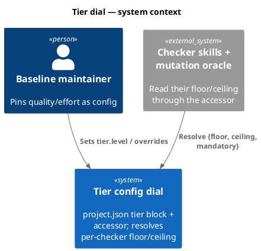

### C4 — Container

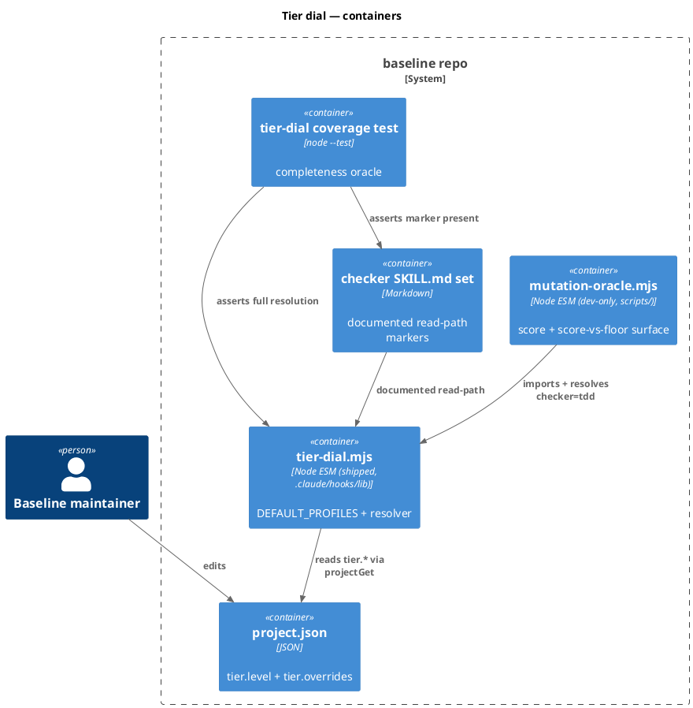

### C4 — Component (tier-dial.mjs)

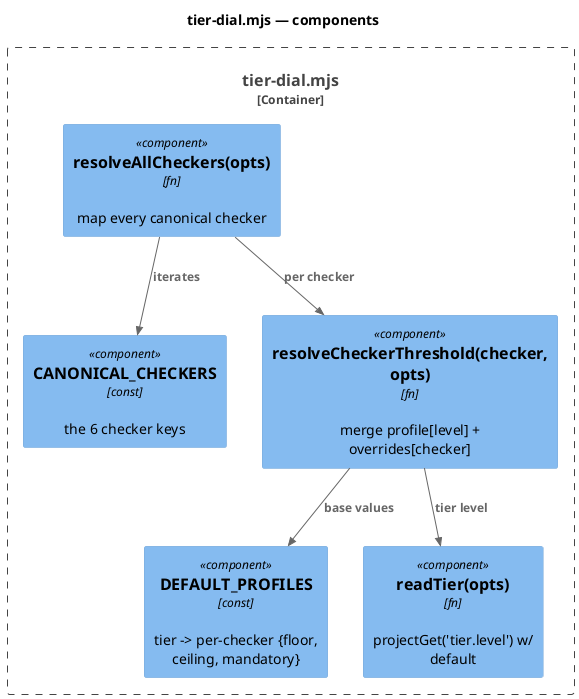

### Class diagram (resolved-threshold shape)

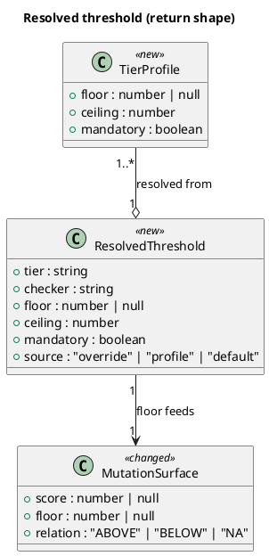

> No DDL — this slice has no database. The `<<new>>`/`<<changed>>` shapes above are
> in-memory return contracts, not persisted columns, so there is no migration to mirror.

### Dependency graph (A --> B = A depends on B)

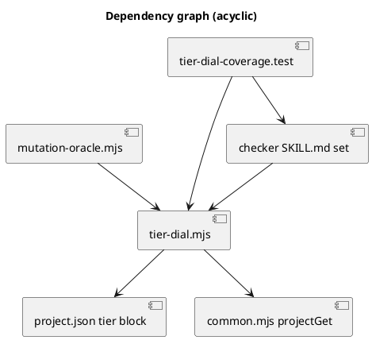

### Accessor contract

```
readTier({projectJson?}) -> string
  // projectGet('tier.level'); absent/invalid -> "internal-tool" (default tier)

resolveCheckerThreshold(checker, {projectJson?}) -> ResolvedThreshold
  // 1. level = readTier()
  // 2. base = DEFAULT_PROFILES[level][checker]  (unknown checker -> DEFAULT_THRESHOLD: floor:null, ceiling:1, mandatory:false)
  // 3. ov = projectGet('tier.overrides')[checker]  (optional)
  // 4. merge per-field: override wins -> source:"override"; else profile -> source:"profile"; unknown -> source:"default"
  // never throws; missing/invalid project.json -> all defaults

resolveAllCheckers({projectJson?}) -> { [checker]: ResolvedThreshold }
  // one entry per CANONICAL_CHECKERS key
```

### Mutation-oracle change

```
computeScore(report) -> number | null
  // total = countMutants(report); killed = total - parseSurvivors(report).length
  // total === 0 -> null ; else killed/total  (0..1)

surfaceComparison(score, floor) -> { score, floor, relation }
  // score === null OR floor === null -> relation "NA"
  // score >= floor -> "ABOVE" ; else "BELOW"
```

The CLI reads `floor` via `resolveCheckerThreshold("tdd")`, prints one extra line
(`mutation score 73% vs floor 0% (internal-tool): ABOVE`), and writes the same triple
into the advisory report. **Exit stays 0; `last_test_result` is never written.**

### File layout / write_set

- `.claude/project.json` — add the `tier` block (`level`, optional `overrides`).
- `.claude/hooks/lib/tier-dial.mjs` — NEW shipped accessor.
- `scripts/mutation-oracle.mjs` — CHANGED (dev-only, unshipped).
- `.claude/skills/{brainstorm,spec-lint,security,simplify,integrate}/SKILL.md` — add the
  read-path marker line.
- `tests/tier-dial.test.mjs`, `tests/mutation-oracle-score.test.mjs`,
  `tests/tier-dial-coverage.test.mjs` — new tests.
- `obj/template/.claude/manifest.json` — regenerated by `scripts/build-template.sh`
  (adds `tier-dial.mjs`); not hand-edited.

## Design calls

N/A — no UI surface. `write_set` does not intersect `project.json → tdd.ui_globs`
(no `site-src/**`, `*.njk`, `*.html`, `*.css`, or component files). No `design-ui` row.

## Acceptance criteria

| AC | Behavior | §Behavior |
|---|---|---|
| AC-001 | Accessor resolves per-checker `{floor, ceiling, mandatory}` from `tier.level` + built-in profile; absent `tier.level` → `internal-tool`; unknown checker → default threshold | §Behavior #1 |
| AC-002 | `tier.overrides.<checker>` overrides built-in profile per field; `source` reflects `override`/`profile`/`default` | §Behavior #2 |
| AC-003 | `resolveAllCheckers` returns an entry for every canonical checker under each of the three built-in tiers (the "all wired" data oracle) | §Behavior #3 |
| AC-004 | Mutation oracle computes score = killed/total, reads `tdd` floor via accessor, and surfaces `{score, floor, relation}` in stdout + advisory report | §Behavior #4 |
| AC-005 | Mutation oracle stays advisory: never writes `last_test_result`, exits 0 regardless of relation (the no-blocking boundary) | §Behavior #5 |
| AC-006 | Accessor is resilient to missing/invalid `project.json` (returns defaults, never throws); each canonical checker's representative skill carries the read-path marker (coverage oracle) | §Behavior #6 |
| AC-007 | Shippability: `tier-dial.mjs` is manifest-tracked (ships); `mutation-oracle.mjs` stays unshipped; no new Python helper | §Behavior #7 |

### Behavior #1 — resolve from tier + profile

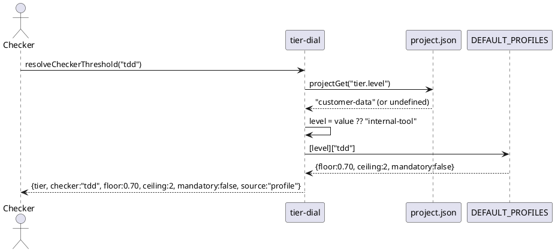

### Behavior #2 — override merge

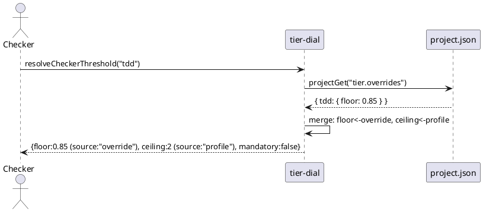

### Behavior #3 — resolveAllCheckers covers the set

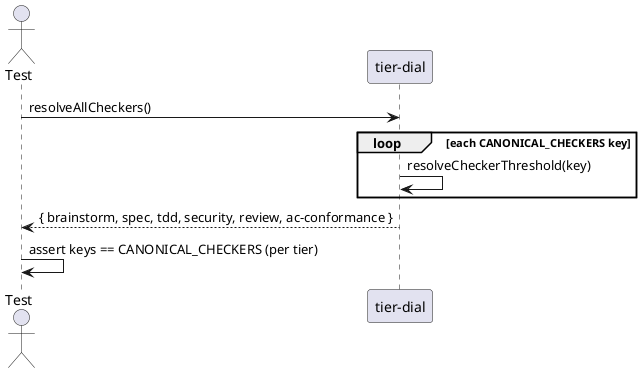

### Behavior #4 — oracle surfaces score-vs-floor

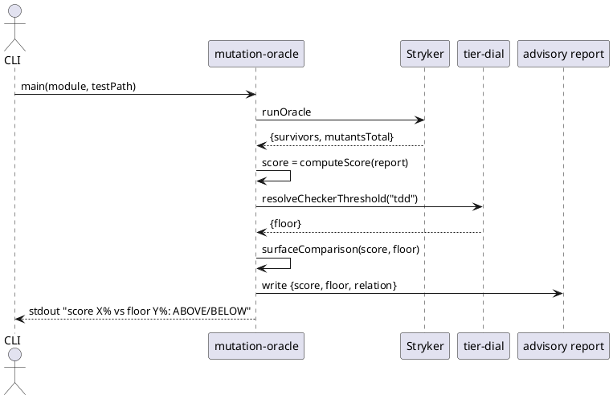

### Behavior #5 — advisory invariant holds

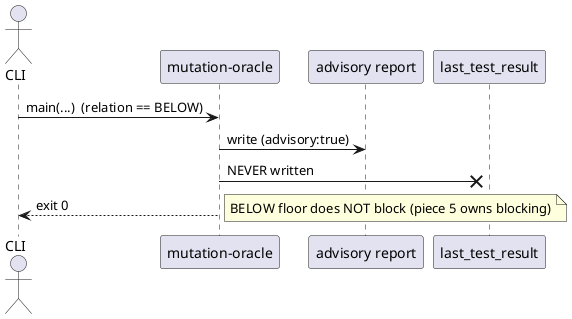

### Behavior #6 — resilience + marker coverage

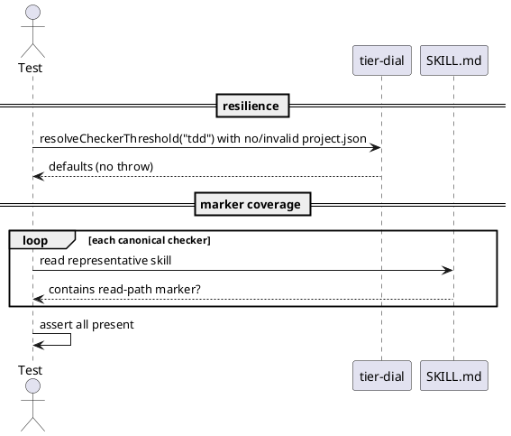

### Behavior #7 — shippability

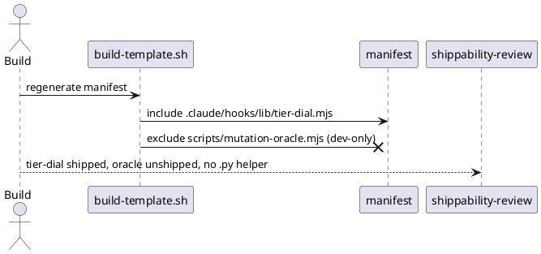

## Test plan

`node --test` (the repo's runner). No internal mocks (Article VI.3); `project.json` is
read from real fixture objects passed via `{projectJson}` injection, not a mocked fs.

- **`tests/tier-dial.test.mjs`** — AC-001/002/006: default tier fallback; profile
  resolution for each tier; unknown-checker default; override per-field merge with
  correct `source`; missing/invalid `projectJson` → defaults without throw.
- **`tests/mutation-oracle-score.test.mjs`** — AC-004/005: `computeScore` (killed/total,
  total=0 → null); `surfaceComparison` (ABOVE/BELOW/NA); advisory report carries the
  triple; assert no `last_test_result` write and exit 0 on a BELOW-floor run.
- **`tests/tier-dial-coverage.test.mjs`** — AC-003/006: `resolveAllCheckers` keys equal
  `CANONICAL_CHECKERS` for all three tiers; each canonical checker's representative
  skill file contains the read-path marker.
- **Shippability (AC-007)** — asserted by `/spec-shippability-review` + the existing
  `audit-baseline` manifest reconciliation after build; no separate runtime test.

## Observability

- Mutation-oracle stdout gains one deterministic line:
  `mutation score <pct> vs floor <pct> (<tier>): <ABOVE|BELOW|NA>`.
- The advisory report JSON gains `{ score, floor, relation }` alongside the existing
  `survivors`/`mutantsTotal`.
- Accessor resolution is pure and deterministic — same `(projectJson, checker)` →
  same `ResolvedThreshold`; no clock, no randomness.

## Rollout

Additive and advisory — no feature flag, no kill-switch needed (nothing blocks).

1. Land `tier-dial.mjs` + the `tier` block (`level: "regulated"`) in `project.json`.
2. Build regenerates the manifest (`scripts/build-template.sh`) so the accessor ships.
3. Mutation oracle surfaces score-vs-floor on the next `npm run test:mutation`.
4. Bad-rollout detection: the `tier-dial-coverage` test fails in CI (audit/`node --test`)
   if a checker is unwired or the accessor table drifts from `CANONICAL_CHECKERS` —
   surfaced within one CI run.

## Rollback

Pure revert — remove the `tier` block from `project.json` and revert the three code
files. The accessor falls back to built-in defaults even with the block absent, so a
partial rollback (config removed, code retained) is safe and non-breaking. No data
migration to unwind.

## Archive plan

Default slug bundle (`tier-oracle-floor-dial.*` across `docs/intake`, `docs/brief`,
`docs/specs`, approvals). Extras: *(none)* — the code/test files live in their normal
tree locations and are not archived.

## Decisions (settled at gate-A review)

- **Floor units across non-numeric checkers — RESOLVED: boundary confirmed.** Only `tdd`
  has a live numeric comparator this slice. For `spec`/`security`/`review`/`ac-conformance`
  the floor is resolved *data* with no comparator until piece 4 gives those checkers a
  mechanical score. "Wired" is defined as **config resolvable through the accessor + the
  read-path marker documented in the checker's representative skill** — not a behavior
  change. The maintainer confirmed this boundary; the slice is NOT narrowed back to
  mutation-oracle-only.
- **Repo self-classification — RESOLVED: `regulated`.** This repo ships its own governance
  code (hooks, consent gates), so it self-classifies at the strictest tier. `project.json
  → tier.level` is `"regulated"`; the mutation oracle reads a `tdd` floor of `0.85` and
  will surface `BELOW` on weakly-tested modules. Nothing blocks (piece 5 owns blocking) —
  the stricter tier only changes what the oracle prints. The accessor's *fallback* default
  for projects that set no tier stays `internal-tool`.

## Open questions

- **`brainstorm` floor is `null`.** Per vision §5.6 the brainstorm checker has no oracle;
  its profile entry carries `floor: null` (relation always `NA`). Whether option (a)
  human-seam or (b) manufactured non-goal oracle is adopted is **out of scope** here
  (deferred per Part 6.2) — this slice only records the `null` floor.
