# Spec — per-phase workflow timing via a deterministic PostToolUse hook

## Context

| Input | Path |
|---|---|
| Intake | `docs/intake/phase-timing-instrumentation.md` |
| Brief | `docs/brief/phase-timing-instrumentation.md` |
| Scout | `docs/scout/phase-timing-instrumentation.md` |
| Research | `docs/research/phase-timing-instrumentation.md` |

Decision recorded at the research gate: **Candidate B** — a deterministic PostToolUse hook stamps phase-completion timestamps when `workflow.json → completed[]` grows; the model-vs-human split is derived at render time from consent-token mtimes. Candidates A (model-driven harness log) and C (helper at ~14 call sites) were considered and rejected (see *Alternatives considered*).

## Goal

After a workflow run, the archive bundle contains a per-phase duration table that splits each phase's wall-clock into model-generation time and human-wait time, stamped deterministically by infrastructure that fires whether the run was driven by `/harness` or by manual phase invocation.

## Non-goals

- Does not change any phase's behavior, ordering, or output (observation-only).
- Does not act on the measurement (no speedup applied this round).
- Does not add a UI or dashboard (the readout is a markdown file in the bundle).
- Does not aggregate across runs (single-run scope; the per-slug JSONL keeps that door open without building it).

## Design

Diagrams are the contract. Prose is only for what a diagram cannot say.

The mechanism has three moving parts: (1) a **hook** `phase_timer.mjs` that observes `workflow.json` edits and appends completion stamps; (2) a **shared library** `lib/timing.mjs` holding the pure stamp + render logic; (3) a **render invocation** from `/archive` that turns the stamp log + consent-token mtimes into `timing.md`. The only durable new state is an append-only JSONL per slug.

### C4 — System context

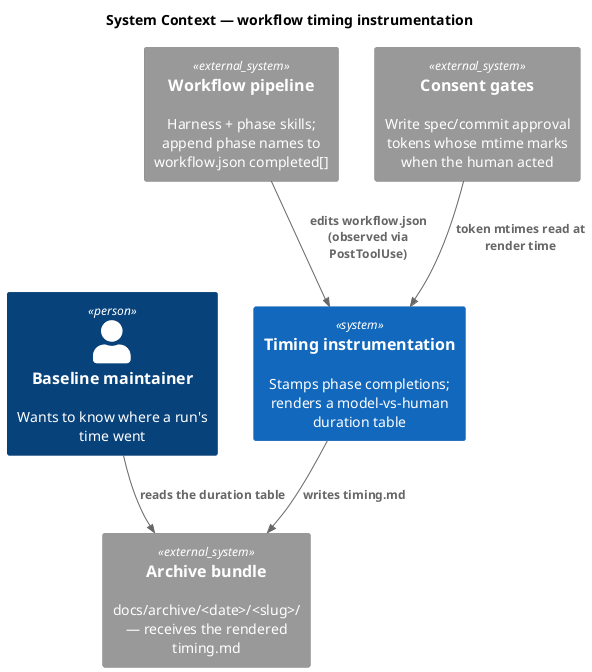

### C4 — Container

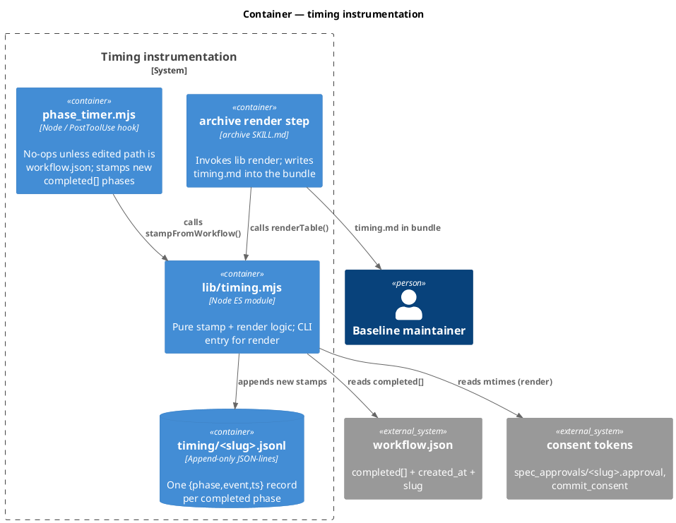

### C4 — Component (changed containers only)

The hook and the shared library are the only new internals. The archive skill changes by one added step.

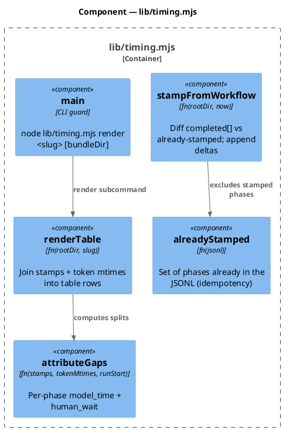

### Data model — class diagram

No database. "Data model" here is the on-disk record shape (append-only JSONL) and the in-memory render row.

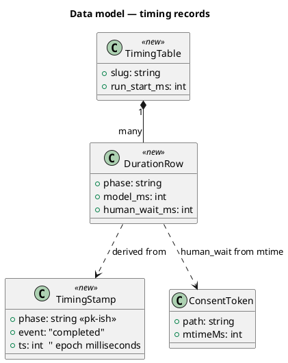

#### Migration DDL

```sql
-- N/A — no database. State is append-only filesystem JSONL at
-- .claude/state/timing/<slug>.jsonl. Each line:
--   {"phase":"<name>","event":"completed","ts":<epoch_ms>}
-- "Forward migration" = the directory is created on first stamp (mkdir -p).
-- "Rollback" = delete .claude/state/timing/ and remove the hook wiring (see Rollback).
```

### Behavior — sequence per AC

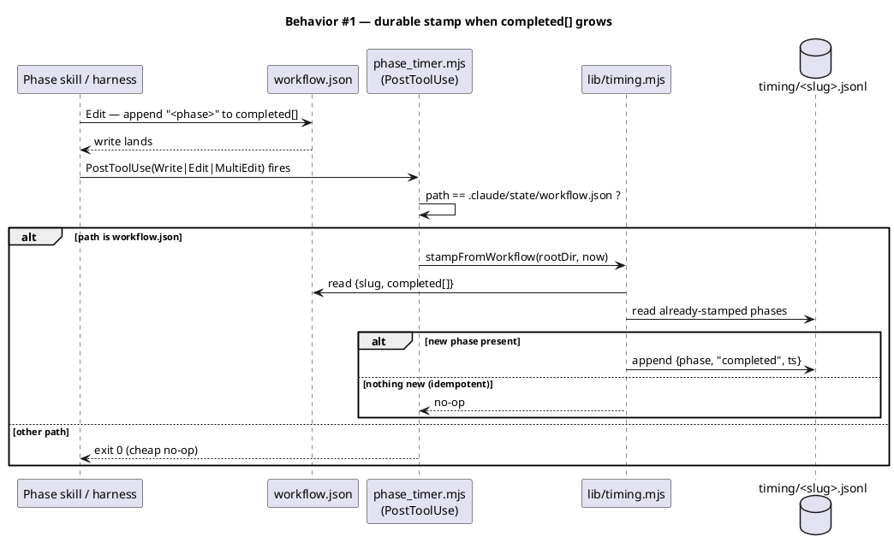

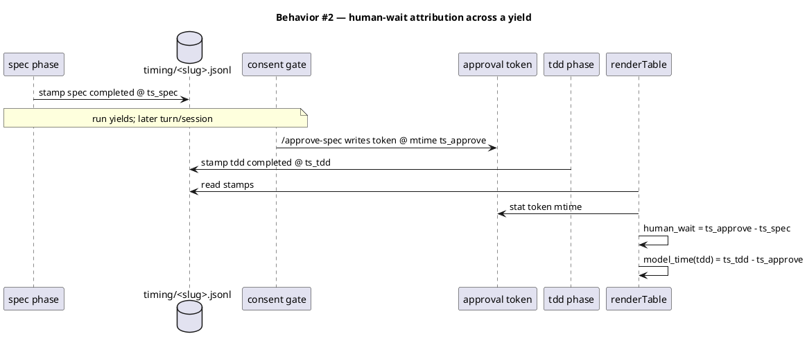

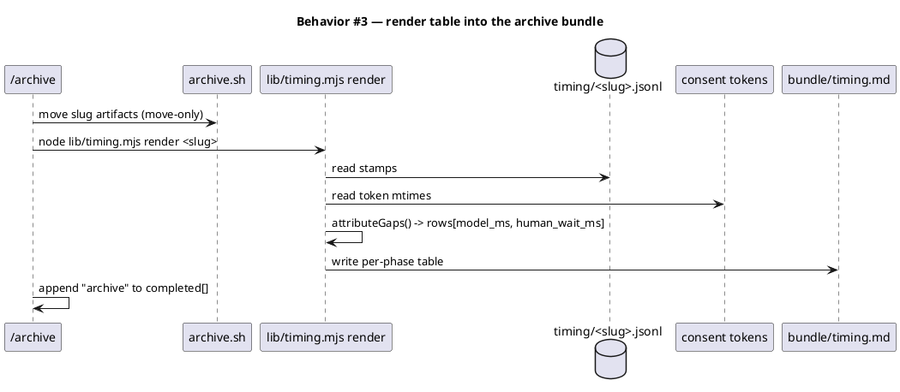

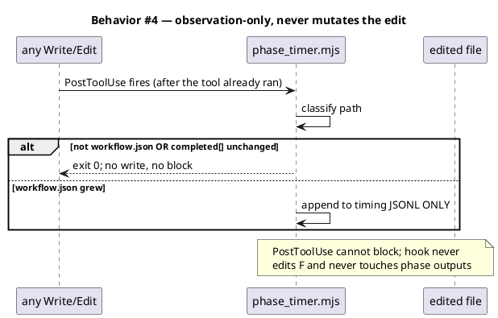

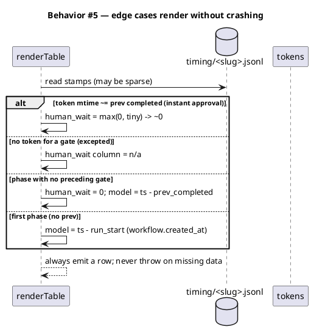

### State — core entity

The timing JSONL is append-only and monotonic; there is no non-trivial state machine. A phase is either un-stamped or stamped-once (idempotency invariant).

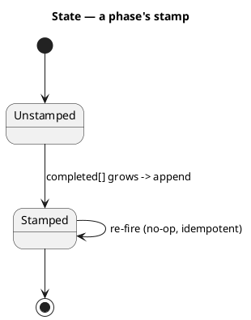

### Dependencies — graph

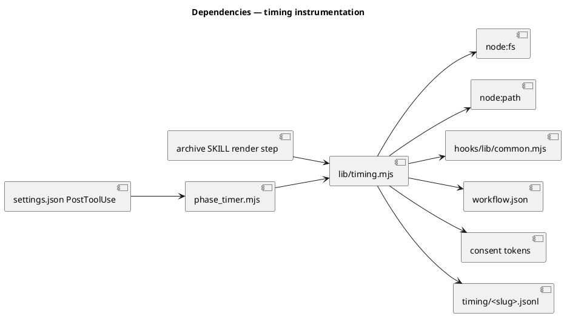

### Contracts

| Kind | Name | Input | Output | Errors | Idempotent |
|---|---|---|---|---|---|
| Hook | `phase_timer.mjs` (PostToolUse) | hook payload `{tool_name, tool_input.file_path}` | exit 0; side effect: append to JSONL | never blocks; on read error → exit 0 silently | yes (re-fire on unchanged `completed[]` = no-op) |
| Fn | `stampFromWorkflow({rootDir, now})` | root path + clock | `{appended: string[]}` | returns `{appended:[]}` if no workflow.json | yes |
| Fn | `renderTable({rootDir, slug})` | slug | markdown string | returns a "no timing data" table if JSONL absent | yes (pure read) |
| CLI | `node lib/timing.mjs render <slug> [bundleDir]` | slug, optional bundle dir | writes `timing.md`; prints path | exit non-zero only on unwritable bundle dir | yes |

### Libraries and versions

| Library@version | Purpose | Key APIs | Confirmed via context7 |
|---|---|---|---|
| Node stdlib (`node:fs`, `node:path`) | file read/append, `statSync().mtimeMs` | `readFileSync`, `appendFileSync`, `mkdirSync`, `statSync` | N/A — stdlib, not a third-party API (context7 does not apply) |
| `.claude/hooks/lib/common.mjs` | payload read, path constants, `emitAllow` | `readPayload`, `payloadGet`, `CLAUDE_PROJECT_ROOT`, `STATE_DIR` | N/A — internal module |

### Alternatives considered

| Alt | Summary | Rejected because |
|---|---|---|
| A | Structured JSONL appended by the model at harness boundaries | Model-driven (not oracle-bound); only covers `/harness` runs, not manual phases |
| C | Deterministic `timing.mjs` helper invoked at each phase's completed-append site | Coverage depends on wiring ~14 call sites; deterministic helper but non-deterministic invocation |
| B *(chosen)* | Deterministic PostToolUse hook + consent-token mtimes | Oracle-bound, covers manual + harness runs, most unit-testable; cost is a 25th hook's governance surface |

## Design calls

This work has no UI surface (write_set does not intersect `tdd.ui_globs`).

- *(none)*

## Acceptance criteria

| ID | Criterion (given / when / then) | Upstream AC | Sequence |
|---|---|---|---|
| AC-001 | given a run that crosses a non-excepted phase boundary, when `completed[]` grows, then a `{phase,event,ts}` record is durably appended to `.claude/state/timing/<slug>.jsonl` and survives across turns/sessions/yields | intake AC 1 | §Behavior #1 |
| AC-002 | given a run that yielded at a consent gate and resumed later, when the table is rendered, then human-wait (`token_mtime − prev_completed_ts`) is reported separately from model-time (`next_completed_ts − token_mtime`) | intake AC 2 | §Behavior #2 |
| AC-003 | given a completed run reaching `/archive`, when the bundle is produced, then it contains `timing.md` with a per-phase table carrying a model-time and a human-wait figure per phase | intake AC 3 | §Behavior #3 |
| AC-004 | given the hook is active, when any phase runs, then phase behavior/ordering/outputs are unchanged and the hook never blocks or mutates the edited file | intake AC 4 | §Behavior #4 |
| AC-005 | given an instant approval, a gate with no token, or a phase with no preceding gate, when the table renders, then human-wait is ~0 / n/a / 0 respectively and rendering never throws on missing data | intake AC 5 | §Behavior #5 |

## Test plan

| Category | Scenario | Expected | Covers |
|---|---|---|---|
| Golden path | workflow.json edit appends one new phase to `completed[]` | one new JSONL line `{phase,event:"completed",ts}` | AC-001 |
| Golden path | stamps for spec + tdd present, spec-approval token mtime between them | `renderTable` rows: spec human-wait≈0, gate human-wait = mtime−spec_ts, tdd model = tdd_ts−mtime | AC-002 |
| Golden path | full stamp set + tokens → `render <slug> <bundleDir>` | `timing.md` written with model + human-wait columns for every phase | AC-003 |
| Input boundary | edited path is NOT workflow.json | hook exits 0, no JSONL write | AC-004 |
| Input boundary | `completed[]` unchanged since last stamp (re-fire) | no new JSONL line (idempotent) | AC-001 |
| Contract violation | workflow.json absent / unparseable | `stampFromWorkflow` returns `{appended:[]}`, hook exits 0, no throw | AC-004 |
| Concurrency / ordering | two new phases appear in `completed[]` between fires | both stamped, in `completed[]` order | AC-001 |
| Failure mode | consent token missing at render | that gate's human-wait column = `n/a`; render still succeeds | AC-005 |
| Failure mode | token mtime earlier than prev completed (clock skew) | human-wait clamped to ≥ 0; no negative cell | AC-005 |
| Regression trap | hook fires on an unrelated Edit (e.g. a source file) | zero side effects; phase output byte-identical | AC-004 |
| Regression trap | first phase has no predecessor | model-time measured from `workflow.created_at`; no crash | AC-005 |

## Observability

| Signal | Name | Shape | Purpose |
|---|---|---|---|
| File | `.claude/state/timing/<slug>.jsonl` | append-only JSON-lines | raw per-phase completion stamps (transient, like `harness/<slug>.log`) |
| File | `<bundle>/timing.md` | markdown table | the durable, committed readout |
| Log | hook stderr | one line on append (`timing: stamped <phase>`) | debug; silent on no-op |

## Rollout

No feature flag — this is dev tooling that ships on. Sequenced co-changes (a 25th hook touches every governance mirror; all must land in the same commit or `audit-baseline`/docs-drift checks fail):

1. **Source files** — `.claude/hooks/phase_timer.mjs`, `.claude/hooks/lib/timing.mjs`; `src/` mirrors if the build sources hooks from `src/`.
2. **Settings wiring** — add `phase_timer.mjs` to `settings.json → hooks.PostToolUse` matcher `Write|Edit|MultiEdit` (beside `lint_runner`/`test_runner`); update any `src/`/template settings mirror.
3. **Archive render step** — `.claude/skills/archive/SKILL.md` Step 2 gains a render invocation (`node .claude/hooks/lib/timing.mjs render <slug>`); `archive.sh` stays move-only.
4. **Constitution** — `CLAUDE.md` Article VIII table gains a `phase_timer` row; bump every "24 hooks" → "25 hooks" (Article III greeting, Article VIII intro, Appendix). Mirror byte-equal in `src/CLAUDE.template.md`.
5. **Genesis** — `docs/init/seed.md` hook list + counts; mirror `src/seed.template.md`.
6. **README** — hook count.
7. **Docs site** — `site-src/hooks.njk` boundary table + per-hook enforcement table gain a `phase_timer` row; `derive-counts.mjs` recomputes `{{ baseline.hooks }}` from disk (no hand-edit of the number).
8. **Manifest** — `obj/template/.claude/manifest.json` regenerates via `scripts/build-template.sh` (build-generated; lists the two new files + hashes). Not hand-edited.
9. **gitignore** — ensure `.claude/state/timing/` is ignored (matches the `.claude/state/` runtime pattern); `gitignore_leak_guard` backstops.
10. **Validation** — `audit-baseline` PASS (hook count + names), docs-site count/prose checks green, full `node --test` green.

- **Canary**: this very workflow (`phase-timing-instrumentation`) is the first dataset — after it commits, the next run renders a real `timing.md`. (Phases already completed before the hook ships are not retroactively covered.)

## Rollback

- **Kill-switch**: remove the `phase_timer.mjs` entry from `settings.json → hooks.PostToolUse` (hook stops firing immediately; no state corruption — the JSONL is inert data).
- **Full revert**: delete the two source files + revert the governance mirror edits in one commit; delete `.claude/state/timing/`.
- **Signal to roll back**: any phase output differs with the hook active vs. removed (AC-004 violated), or `audit-baseline` reports a hook count/name mismatch post-merge. Both are detectable in CI within one run.

## Archive plan

- Defaults *(automatic)*: intake, brief, scout, research, spec, spec-rendered/, spec approval.
- Extras *(list any non-default files)*:
  - `timing.md` — generated into the bundle by the archive render step (it is *born* in the bundle, not moved into it; listed here so the reviewer expects it).

## Open questions

- **(carried from intake Q3) Timing store format & location.** Spec proposes `.claude/state/timing/<slug>.jsonl` (append-only JSON-lines, transient like `harness/<slug>.log`, gitignored), with only the rendered `timing.md` archived into the bundle. Confirm JSONL vs single-JSON, and transient-in-state vs archived-raw. → reviewer decides at `/approve-spec`.
- **(carried from intake Q4) Render target shape.** Spec proposes a standalone `timing.md` born in the bundle via an archive render step. Confirm standalone file vs appending the table into an existing bundle artifact. → reviewer decides at `/approve-spec`.
- **Run-start anchor.** Model-time for the first phase is measured from `workflow.created_at` (triage time), so it includes any triage→intake gap. Acceptable, or should the first phase's model-time be left blank? → minor; reviewer's call.
