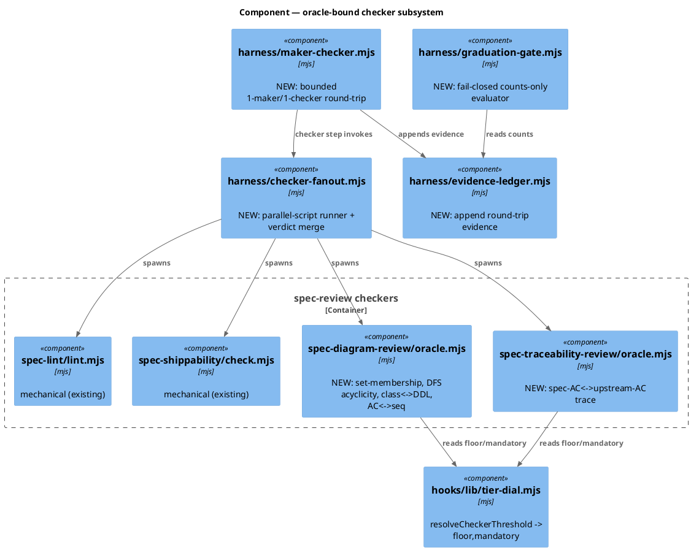
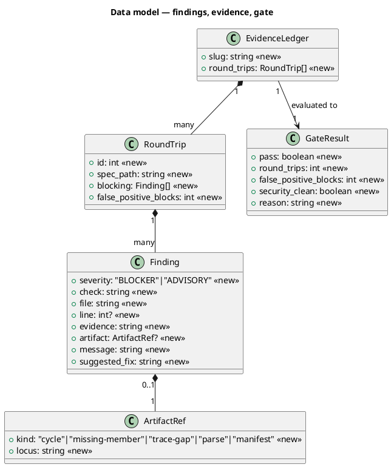
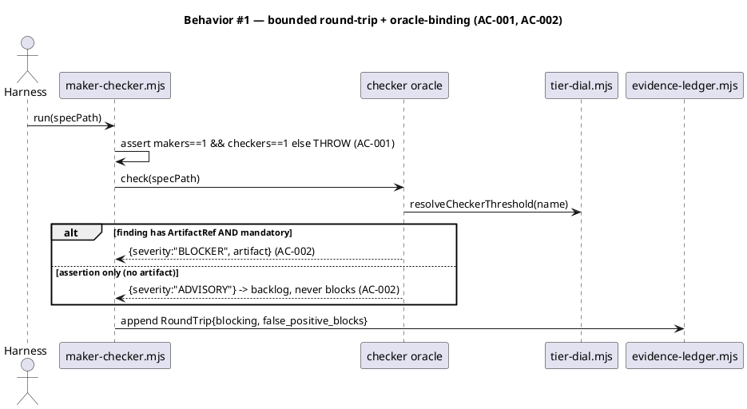
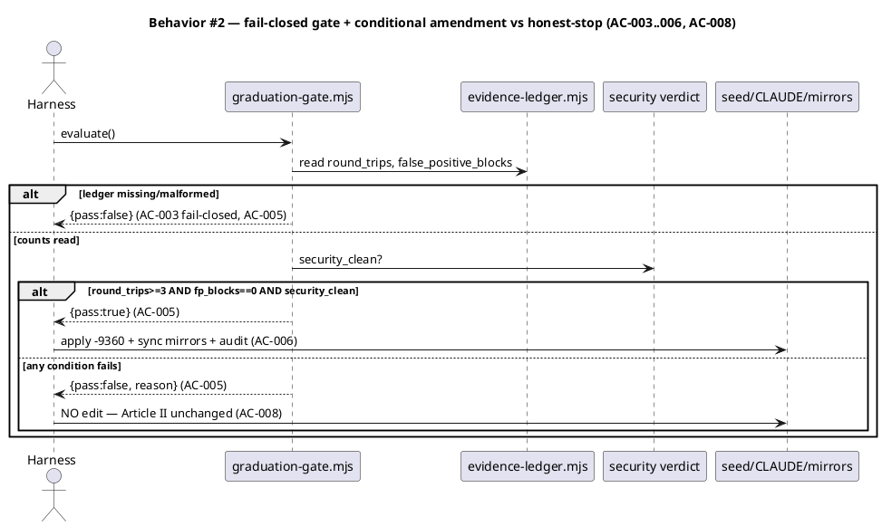
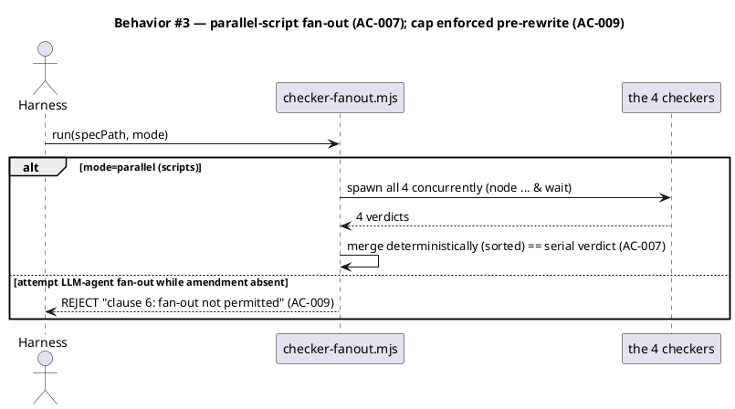
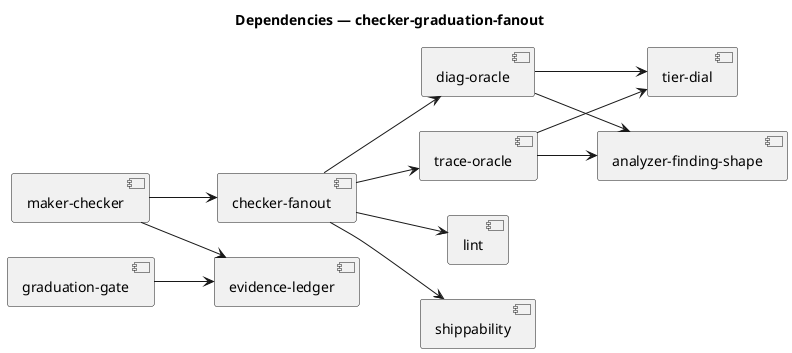

# Spec — Oracle-bound checkers, bounded maker/checker graduation, conditional Article II fan-out

## Context

| Input | Path |
|---|---|
| Intake | `docs/intake/checker-graduation-fanout.md` |
| Scout | `docs/scout/checker-graduation-fanout.md` |
| Research | `docs/research/checker-graduation-fanout.md` |
| Brief | `docs/brief/checker-graduation-fanout.md` |

**Write set**: `.claude/skills/spec-diagram-review/**`, `.claude/skills/spec-traceability-review/**`, `.claude/skills/harness/**`, `docs/init/seed.md`, `CLAUDE.md`, `src/*.template.md`, `.claude/CONSTITUTION.md`, `.claude/project.json`, `tests/**`

Non-architectural surface (no application source, no sensitive globs) → reduced diagram profile.

## Goal

Oracle-bind the four spec-review checkers so blocking findings are mechanically grounded (`-d186`), prove a bounded one-maker/one-checker round-trip against the clause-7 graduation gate (`-4c43`), and — **only if that evidence is clean** — perform the `-9360` Article II amendment permitting oracle-bound checker fan-out; deliver the parallel-checker wall-clock win via mechanized scripts regardless of the amendment.

## Non-goals

- **`-424f` durable plan schema** — prerequisite for the *full* multi-agent RALPH loop, not the bounded round-trip. Out of scope (YAGNI).
- **Multi-LLM-agent fan-out executor** — this cycle delivers the *mechanical-script* fan-out and the *permission* (conditional amendment), not the multi-agent runtime.
- **Rigging the gate.** A false-positive blocking finding honestly fails the gate; the amendment then does not land.
- **Article II's core principle** — judgment stays in main context; only oracle-bound read-only checker recipes gain fan-out permission.

## Decisions

> Captured through the workflow dialogue (codesign off; canonical here).

- **D1 — Substrate split.** Bounded round-trip on the Workflow runtime (§II.A names it; no new declared subagent → `EXPECTED_AGENTS`/seed count-prose unchanged). Checker fan-out as **parallel scripts** (`node a & node b & wait`), already permitted by Article II.
- **D2 — Amendment separable from Lever 1.** An oracle-bound checker is a deterministic script (no amendment needed to parallelize); an un-oracle-bound LLM checker can't safely fan out (circularity). So `-9360` is a v1 multi-agent down-payment, evidence-gated, not a prerequisite for the wall-clock win.
- **D3 — Gate evaluator fail-CLOSED** (inverting `rightsize-gate.mjs`'s fail-open): malformed/missing ledger → `pass:false`.
- **D4 — Evidence is real**: ≥3 round-trips against this spec + two archived specs.
- **D5 — Ratification** (clause 7d) pre-authorized at `approve-spec`, conditional on the evidence ACs.

## Design

Diagrams are the contract. Prose only for what a diagram cannot say.

### C4 — Component (the checker subsystem)



### Data model — class diagram

No SQL DB; the "DDL" block documents the JSON ledger shape mirroring the `<<new>>` fields.



#### Migration DDL

```sql
-- forward: evidence ledger is JSON at .claude/state/checker-graduation-fanout/ledger.json (gitignored).
-- shape mirrors the <<new>> class fields:
--   { slug, round_trips: [ { id, spec_path, blocking: [Finding], false_positive_blocks } ] }
-- reverse: rm -f .claude/state/checker-graduation-fanout/ledger.json
```

### Behavior — sequences







### Dependencies — graph



### Contracts

| Kind | Name | Input | Output | Errors | Idempotent |
|---|---|---|---|---|---|
| CLI | `node spec-diagram-review/oracle.mjs <slug>` | spec path | findings JSON (BLOCKER iff ArtifactRef) | exit 2 blocker, 0 clean | yes |
| CLI | `node spec-traceability-review/oracle.mjs <slug>` | spec + intake/brd | findings JSON (trace gaps) | exit 2 dropped-AC, 0 clean | yes |
| CLI | `node harness/checker-fanout.mjs <slug> [--parallel]` | spec path | merged verdict JSON | exit 2 any blocker | yes (deterministic merge) |
| CLI | `node harness/maker-checker.mjs <slug> <specPath>` | spec to review | RoundTrip appended to ledger | throws if makers!=1 or checkers!=1 | append-only |
| CLI | `node harness/graduation-gate.mjs evaluate <slug>` | ledger + security verdict | GateResult JSON | fail-closed `pass:false` | yes |

### Alternatives considered

| Alt | Summary | Rejected because |
|---|---|---|
| New `checker` declared subagent | fan out via a 2nd subagent | balloons audit surface; script fan-out needs none (D1) |
| Amend Article II first, prototype after | bless then build | violates clause-7 sequencing + I.4; constitution hardest to walk back |
| Leave LLM reviews advisory (skip `-d186`) | no mechanization | un-oracle-bound checkers can't safely fan out (circularity); no real win |

## Design calls

*(none)* — write_set does not intersect `tdd.ui_globs`.

## Acceptance criteria

| ID | Criterion (given/when/then) | Upstream | Sequence | Gated? |
|---|---|---|---|---|
| AC-001 | given the round-trip, when run, then config is exactly 1 maker + 1 checker or it throws | intake AC-1 | §Behavior #1 | no |
| AC-002 | given a checker finding, when classified, then BLOCKER requires an `ArtifactRef` + `mandatory`; assertion-only is ADVISORY, never blocks | intake AC-2 | §Behavior #1 | no |
| AC-003 | given >=3 governed round-trips, when complete, then the ledger records each round-trip's blocking findings + grounding + fp-count, aggregate fp-blocks = 0 | intake AC-3 | §Behavior #2 | no |
| AC-004 | given the oracle artifacts, when `/security` reviews, then no Critical/High | intake AC-4 | §Behavior #2 | no |
| AC-005 | given ledger + security verdict, when the gate evaluates, then pass/fail from counts only, **fail-closed**; an fp-block is FAIL | intake AC-5 | §Behavior #2 | no |
| AC-006 | given gate **pass**, when the amendment applies, then seed.md §II.A clause 6/7 lifted for oracle-bound checkers, CLAUDE.md Article II matches, mirrors byte-equal, `audit-baseline` PASS, CLAUDE.md <= 40000 | intake AC-6 | §Behavior #2 | **YES — gated on AC-003+AC-004+AC-005** |
| AC-007 | given the 4 oracle-bound checkers, when fanned out as parallel scripts, then merged verdict is byte-identical to serial | intake AC-7 | §Behavior #3 | no (no amendment needed) |
| AC-008 | given gate **fail**, when the workflow proceeds, then seed/CLAUDE Article II unchanged on disk AND bounded machinery + ledger still present | intake AC-8 | §Behavior #2 | no |
| AC-009 | given the amendment has NOT landed, when LLM-agent checker fan-out is attempted, then it is rejected (clause-6 enforced) | intake AC-9 | §Behavior #3 | no |

## Test plan

| Category | Scenario | Expected | Covers |
|---|---|---|---|
| Golden path | diag-oracle on a cyclic dependency graph | BLOCKER w/ ArtifactRef{kind:cycle} | AC-002 |
| Golden path | trace-oracle on a spec dropping an intake AC | BLOCKER w/ ArtifactRef{kind:trace-gap} | AC-002 |
| Contract | round-trip configured with 2 checkers | throws | AC-001 |
| Boundary | finding with no ArtifactRef emitted as BLOCKER | coerced ADVISORY | AC-002 |
| Golden path | fan-out parallel vs serial on same spec | byte-identical merged verdict | AC-007 |
| Failure mode | gate eval with missing ledger | `pass:false` (fail-closed) | AC-005 |
| Failure mode | gate eval with one fp-block in ledger | `pass:false` | AC-005, AC-008 |
| Golden path | gate eval with 3 clean round-trips + security clean | `pass:true` | AC-005 |
| Governance | gate fail then seed.md/CLAUDE.md Article II byte-unchanged | unchanged | AC-008 |
| Governance | after gate-pass amendment | `audit-baseline` PASS + mirrors byte-equal + <=40000 | AC-006 |
| Regression | attempt LLM-agent fan-out pre-rewrite | rejected | AC-009 |
| Concurrency | 3 round-trips append to ledger | no lost writes (append-only) | AC-003 |

## Observability

| Signal | Name | Shape | Purpose |
|---|---|---|---|
| Log | `round-trip.appended` | id, spec_path, blocking_count, fp_blocks | audit the evidence window |
| Log | `gate.evaluated` | pass, round_trips, fp_blocks, security_clean, reason | trace the conditional decision |
| Artifact | `timing.md` columns | per-phase | advisory velocity surface |

## Rollout

- **Flags** (`project.json`): `velocity.checker_fanout.enabled` (default off until verified), `graduation.enabled` (default on). Oracle helpers ship inert (advisory) until tier-dial `mandatory` is flipped per checker.
- **Order**: 1 mechanize oracles (advisory) -> 2 round-trip + ledger -> 3 >=3 governed round-trips -> 4 `/security` -> 5 gate eval -> 6 **conditional** amendment -> 7 enable parallel-script fan-out.
- **Manifest/mirror**: after any shipped-file edit run `node scripts/sync-constitution-mirror.mjs --write` then `bash scripts/build-template.sh` then `audit-baseline`.

## Rollback

- **Kill-switch**: `velocity.checker_fanout.enabled=false` (fan-out reverts to serial); tier-dial `mandatory=false` per checker (oracles revert to advisory).
- **Amendment rollback**: if post-amendment `audit-baseline` FAILs or a fan-out regression appears, `git revert` the amendment commit; oracle helpers + ledger remain (they don't depend on the amendment). Signal: `audit-baseline` FAIL or serial != parallel verdict — trips within one CI run.

## Archive plan

- Defaults *(automatic)*: intake, brief, scout, research, spec, spec approval, security report.
- Extras *(non-default)*: *(none)* — evidence ledger lives under `.claude/state/` (gitignored), not archived.

## Open questions

- **Relief valve (scope/time):** if mechanizing all five diagram-review checks overruns ~2h, mechanize the highest-value blocking check per LLM review (diagram **DFS-acyclicity** + traceability **dropped-AC**), leave the rest ADVISORY, defer to follow-up — still run the round-trips and earn the gate. Confirm acceptable at `approve-spec`.
- **`/security` clause-7c target** = the new oracle helpers + `maker-checker.mjs` + `graduation-gate.mjs`. Confirm no other artifact in scope.
- **Approval ratifies the conditional amendment** (D5): approving this spec pre-authorizes the `-9360` rewrite *contingent on AC-003+AC-004+AC-005 passing mechanically*. Approver acknowledges this is also clause-7d ratification.
