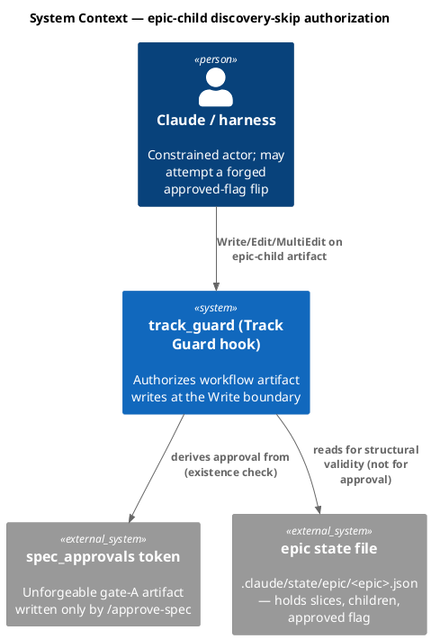
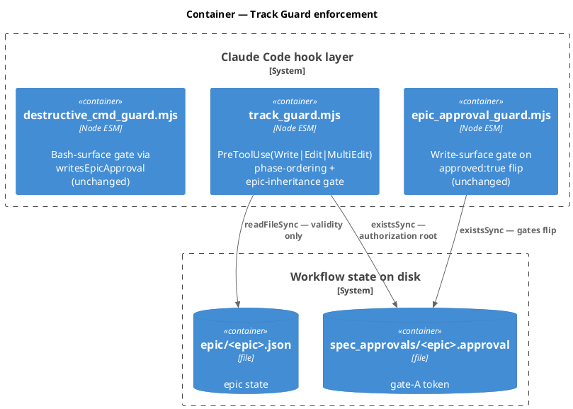
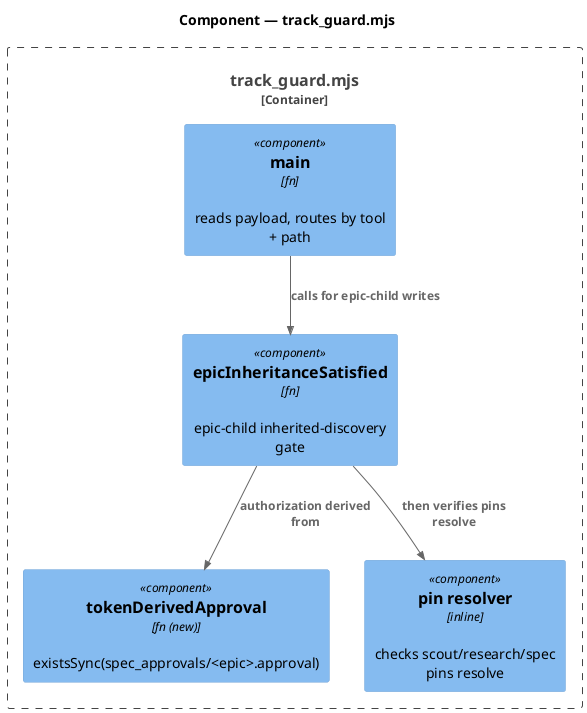
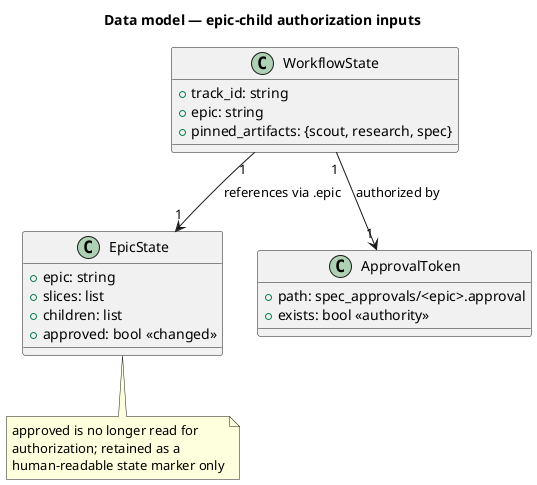
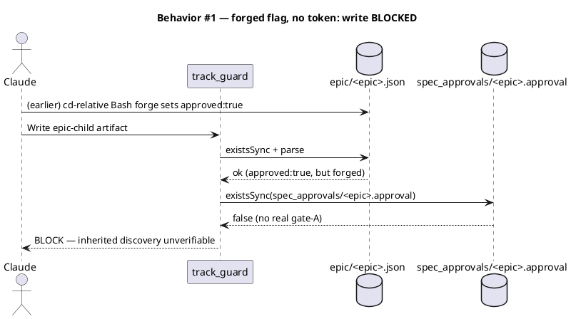
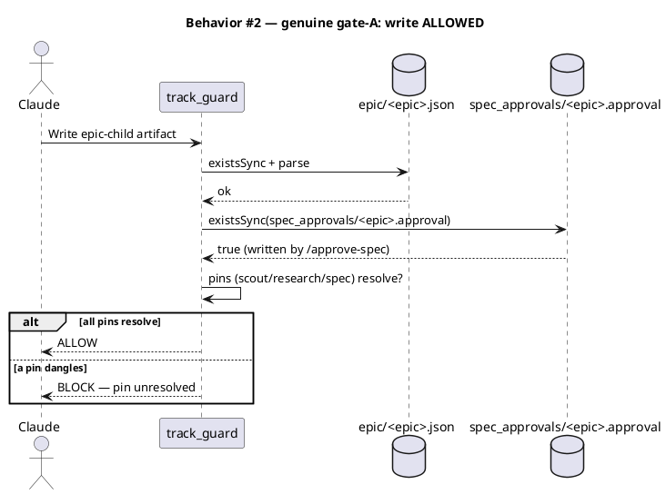
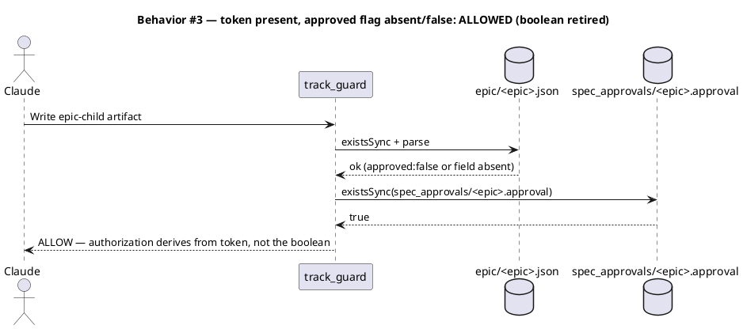
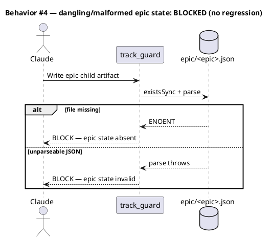
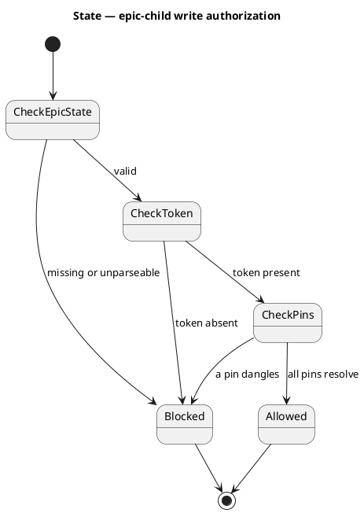
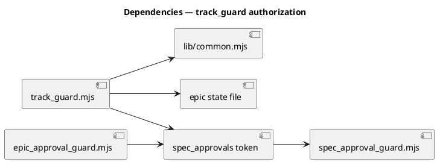

# Spec — Read-time derivation of epic approval (close the cd/pushd write bypass)

## Context

| Input | Path |
|---|---|
| Intake | *(skipped — spec-entry track)* |
| BRD *(if any)* | *(none)* |
| Scout *(if any)* | *(none)* |
| Research *(if any)* | *(none)* |
| Brief | `docs/brief/residual-epic-approval-cd-bypass.md` |
| Prior finding | `docs/archive/2026-06-21/epic-approved-bash-surface/security.md` (MEDIUM, A04/CWE-862) |

This is a security-control change. It closes the residual `cd`/`pushd`-into-dir bypass left open after `-abad`: `cd .claude/state/epic && echo '{"approved":true}' > foo.json` forges the epic `approved` flag undetected, and `track_guard` then *trusts that flag* to let an `epic-child` skip mandatory discovery without a real gate-A approval. The durable fix moves authorization off the forgeable boolean and onto the unforgeable persistent approval token.

## Goal

`track_guard` authorizes an `epic-child`'s discovery-skip by deriving epic approval from the persistent `.claude/state/spec_approvals/<epic>.approval` token at read time, instead of trusting the forgeable `approved: true` boolean in the epic state file.

## Non-goals

- **Keep** the existing write-surface detectors as defense-in-depth: `epic_approval_guard` (Write tool) and `writesEpicApproval` in `common.mjs` (Bash). This work does not remove either — it makes them belt-and-suspenders rather than load-bearing.
- Do **not** touch the consent-gate token-writing flow (`/approve-spec` → `spec_approval_guard` → `spec_approvals/<slug>.approval`). Authorization is *derived from* that token; its production is unchanged.
- Leave the two accepted LOW items from the prior finding out of scope (content-var-assembly of the literal `approved` token; the finite write-verb allowlist).
- Do **not** touch non-epic approval consumption (spec/swarm approval tokens elsewhere are read as they are today).

## Design

Diagrams are the contract. Prose is only for what a diagram cannot say.

The single load-bearing read surface for epic-child authorization is `track_guard.mjs → epicInheritanceSatisfied()`, line 51: `if (es.approved !== true) return false;`. That line trusts a value that a Bash `cd`-relative write can forge. The fix replaces the trusted-boolean check with an existence check on the approval token, which `spec_approval_guard` makes unforgeable. The epic-state file is still read for structural validity (it must exist and parse), but its `approved` field is no longer consulted for authorization.

### C4 — System context



### C4 — Container



### C4 — Component (changed containers only)

Only `track_guard.mjs` changes internals.



### Data model — class diagram

No database. The "data" is the on-disk state the guard reads. The class diagram models the authorization inputs and the changed predicate.



#### Migration DDL

```sql
-- No database. No schema migration.
-- State shape on disk is unchanged: epic/<epic>.json keeps its `approved`
-- field (now advisory); spec_approvals/<epic>.approval is unchanged.
-- forward: (none)
-- reverse: (none)
```

### Behavior — sequence per AC









### State — core entity

The epic `approved` field is no longer a state node in the authorization machine. Authorization is a pure function of token existence.



### Dependencies — graph



### Contracts

| Kind | Name | Input | Output | Errors | Idempotent |
|---|---|---|---|---|---|
| Function | `epicInheritanceSatisfied(state)` | workflow state object | `boolean` (true ⇒ inherited discovery is verifiably real) | none (returns false on any unverifiable condition) | yes (pure read of disk) |

Behavioral contract for `epicInheritanceSatisfied(state)`:
- Returns `false` when `state.epic` is missing/non-string.
- Returns `false` when `.claude/state/epic/<epic>.json` is missing or unparseable.
- Returns `false` when `.claude/state/spec_approvals/<epic>.approval` does **not** exist (the new authorization root).
- Returns `false` when `state.pinned_artifacts` is missing, or any of `scout`/`research`/`spec` pins (fragment stripped) does not resolve on disk.
- Returns `true` only when epic state is valid **and** the token exists **and** all pins resolve. The epic-state `approved` field is not consulted.

### Libraries and versions

| Library@version | Purpose | Key APIs | Confirmed via context7 |
|---|---|---|---|
| Node.js stdlib (`node:fs`, `node:path`) | filesystem existence/parse checks | `existsSync`, `readFileSync`, `join` | n/a (stdlib; no third-party API) |

No third-party library is added or used — context7 confirmation is not applicable.

### Alternatives considered

| Alt | Summary | Rejected because |
|---|---|---|
| Incremental (path b) | Broaden `writesEpicApproval` to flag `cd`/`pushd`/`-C`/`--directory` epic-dir references | Closes only the write surface; leaves `track_guard` trusting a forgeable boolean (the read surface stays load-bearing). Carries over-block risk for reads after a `cd`. |
| Require token **and** `approved===true` | Keep the boolean as a second required condition | Adds no security over token-only (token is the unforgeable root); reintroduces the forgeable boolean as a load-bearing dependency, defeating "retire the trusted boolean." |
| Token-derived (chosen) | Derive authorization from token existence; stop reading `approved` | Closes write **and** read surface in one move; makes every write-surface detector belt-and-suspenders. |

## Design calls

*(none)* — write_set is `.claude/hooks/track_guard.mjs` + tests; no intersection with `tdd.ui_globs`.

## Acceptance criteria

| ID | Criterion (given / when / then) | Upstream AC | Sequence |
|---|---|---|---|
| AC-001 | Given an epic state with a **forged** `approved:true` and **no** `spec_approvals/<epic>.approval` token, when an epic-child attempts a non-`.claude/state/` artifact write, then `epicInheritanceSatisfied` returns `false` and the write is blocked. | brief: desired-state (read surface) | §Behavior #1 |
| AC-002 | Given a genuine epic (token present, pins resolve), when an epic-child writes, then `epicInheritanceSatisfied` returns `true` and the write is allowed. | brief: no-regression | §Behavior #2 |
| AC-003 | Given the token present but the epic-state `approved` field `false` or absent, when an epic-child writes, then `epicInheritanceSatisfied` returns `true` (authorization derives from the token, not the boolean). | brief: desired-state (boolean retired) | §Behavior #3 |
| AC-004 | Given the documented `cd .claude/state/epic && echo '{"approved":true}' > <epic>.json` forge with no token, when an epic-child writes, then authorization is denied regardless of whether the Bash write landed (read surface ignores the forged flag). | finding: residual bypass | §Behavior #1 |
| AC-005 | Given a missing or unparseable epic state file, when an epic-child writes, then `epicInheritanceSatisfied` returns `false` (existing dangling-child block preserved). | regression | §Behavior #4 |

## Test plan

| Category | Scenario | Expected | Covers |
|---|---|---|---|
| Golden path | token present + valid epic + pins resolve | `epicInheritanceSatisfied` → true; write allowed | AC-002 |
| Contract violation | forged `approved:true`, token absent | → false; write blocked | AC-001, AC-004 |
| Boundary | token present, `approved:false` | → true (boolean not consulted) | AC-003 |
| Boundary | token present, `approved` field absent entirely | → true | AC-003 |
| Failure mode | epic state file missing | → false | AC-005 |
| Failure mode | epic state file present but unparseable JSON | → false | AC-005 |
| Failure mode | token present but a pin (e.g. spec) dangles | → false | AC-002 |
| Regression trap | `.claude/state/` recovery write on epic-child track | allowed (existing carve-out unchanged) | — |
| Regression trap | non-epic-child track write | unaffected by this code path | — |

## Observability

| Signal | Name | Shape | Purpose |
|---|---|---|---|
| Log | `track_guard` block line | existing `emitBlock` reason text | audit — surfaces why an epic-child write was denied |

No new metric or alarm — this is a structural in-process hook, not a service.

## Rollout

- **Feature flag**: none — a security guard correction ships directly; gating it would leave the bypass open behind the flag.
- **Migration order**: single edit to `track_guard.mjs` + paired tests land together. No data migration.
- **Canary**: the full serial test suite (`node .claude/skills/audit-baseline/audit.mjs` + the hook test suite) is the gate; the new bypass test must go red before the fix and green after.

## Rollback

- **Kill-switch**: `git revert` of the single commit restores the prior `es.approved !== true` check. The write-surface detectors (unchanged) remain in place meanwhile, so rollback returns to the documented-MEDIUM residual state, not to an all-open state.
- **Signal to roll back**: a legitimate epic-child write is blocked despite a genuine gate-A approval (false-positive). Detected by the failing `/integrate` run or a user report; the token-existence check is simple enough that a false-positive implies a token-path naming mismatch — verify `spec_approvals/<epic>.approval` resolves.

## Archive plan

- Defaults *(automatic)*: brief, spec, spec-rendered/, spec approval, security report.
- Extras *(list any non-default files)*:
  - *(none)*

## Open questions

- *(none — scope, surfaces, and the token-naming convention are all resolved; the chosen approach is the finding's preferred durable fix.)*
