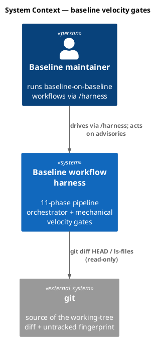
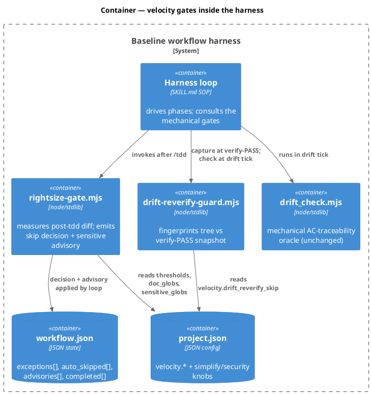
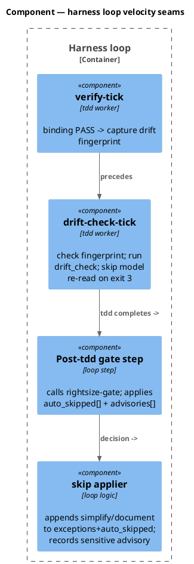
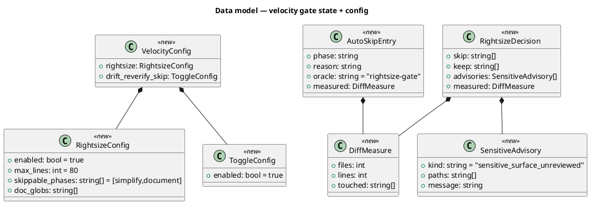
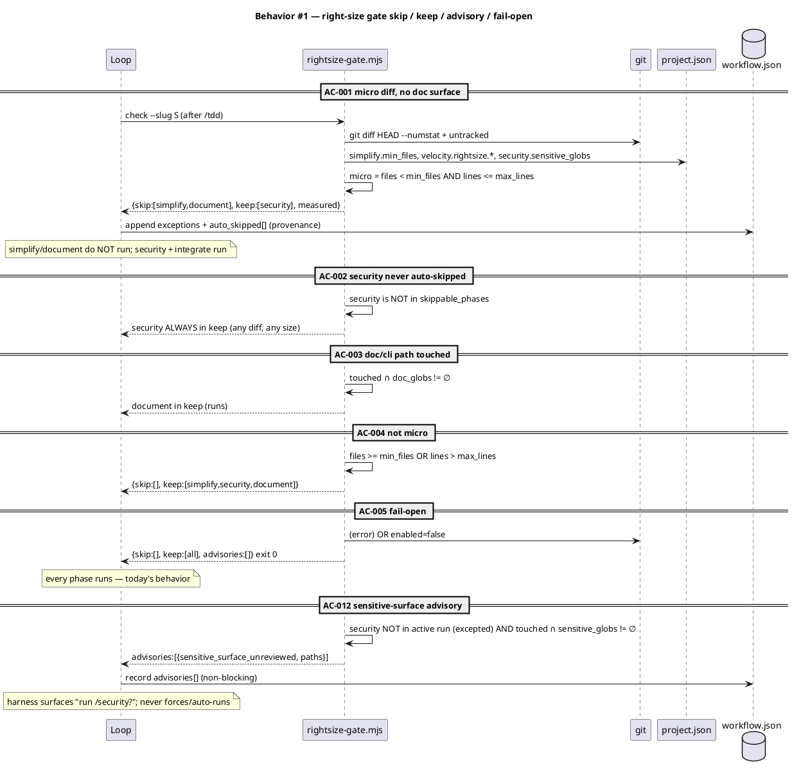
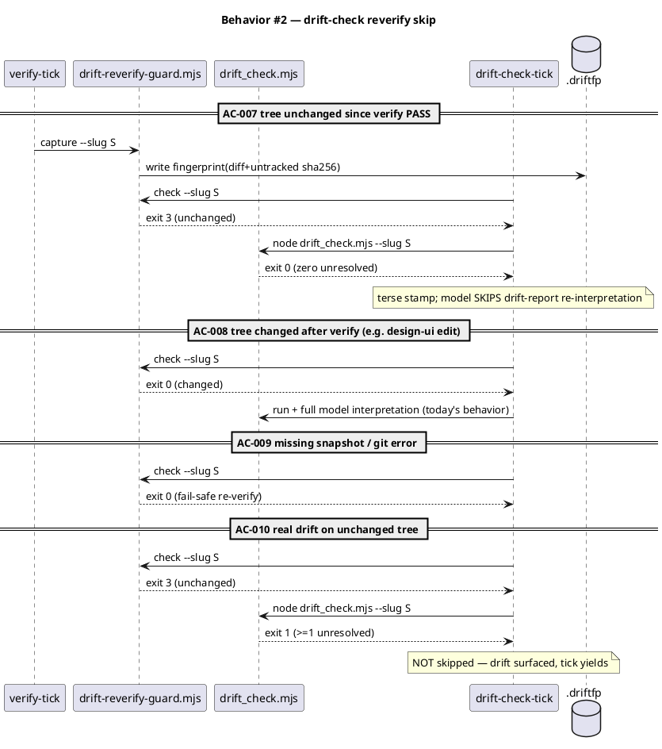
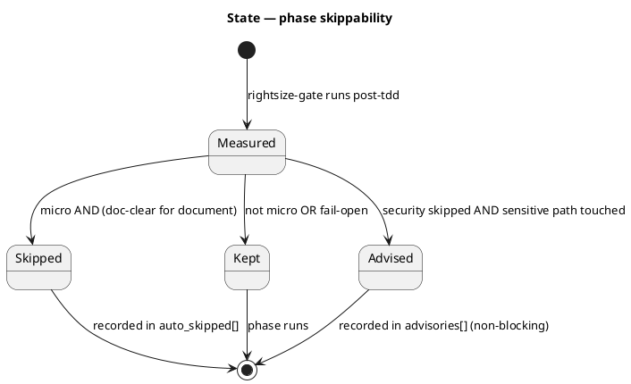
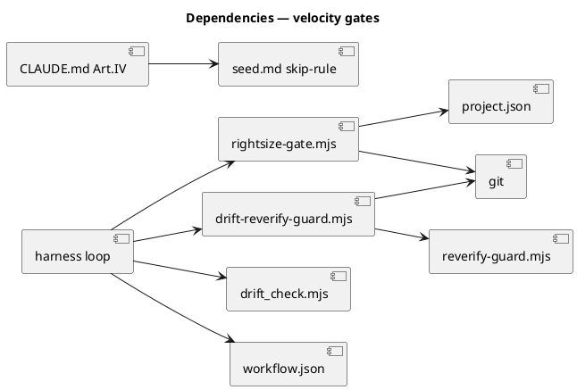

# Spec — right-size phase-skip gate + drift-check reverify skip

## Context

| Input | Path |
|---|---|
| Intake | *(spec-entry track — no intake)* |
| Brief | `docs/brief/rightsize-triage-drift-skip.md` |
| Scout *(if any)* | *(none)* |
| Research *(if any)* | *(none)* |

Source backlog key: `baseline-velocity-levers-after-lever0-timing-v0lv` (DP5/DP6 sub-tick timing). Two folded velocity levers, both baseline self-development (this repo's own `.claude` harness):

- **Component 1 — right-size phase-skip gate (Lever 2).** A mechanical, fail-open gate runs after `/tdd`, measures the real working-tree diff, and records auditable auto-skips for `simplify` / `document` when the diff is provably *micro* and (for `document`) touches no doc surface. **`security` is never auto-skipped** — it stays a human decision (default: runs); the gate's only involvement with security is a mechanical *safety-net advisory* (below). The gate is **purely additive**: it appends auto-skips, never un-skips a phase that `/triage` or `chore` already excepted. Requires an **Article IV amendment** sanctioning a second skip mechanism beside `/triage`'s `exceptions`.
- **Component 2 — drift-check reverify skip.** The tdd `drift-check-tick` skips the model's drift-report re-interpretation when the working tree is provably unchanged since the `verify-tick` binding PASS — mirroring the shipped `simplify-reverify-guard` fingerprint. The mechanical `drift_check.mjs` oracle still runs and still gates on real drift.

## Goal

After `/tdd`, a micro diff skips `simplify` (and `document` when no doc surface changed) via an auditable mechanical gate; `security` is never auto-skipped, but a sensitive-surface advisory fires when security is being skipped while a sensitive path changed; and the tdd `drift-check-tick` skips redundant model re-reasoning when the tree is byte-identical to the verify-time snapshot — all fail-open to today's behavior on any uncertainty.

## Non-goals

- **No LLM-judgment skips.** Every skip is decided by a mechanical oracle (file/line counts, glob set-intersection, sha256 fingerprint). A bare "this looks small" never skips a phase.
- **`security` is never auto-skipped, and never auto-run by the gate.** The decision to run or skip security stays with the human (`/triage` exceptions / chore-conditional). Default: security runs. The gate's `sensitive_globs` use is advisory only — it surfaces a recommendation, it does not force, skip, or autonomously analyze security.
- **`integrate` is never skippable.** It is the binding verdict; the gate's skip allowlist is a hard subset of `{simplify, document}` (and so also excludes `tdd`, `security`, `archive`, `memory-flush`, the consent gates, `commit`).
- **Purely additive.** The gate appends to `exceptions`/`auto_skipped[]`; it never removes an existing exception, so it cannot override or contradict a human/chore decision.
- **No relaxation of the integrate serial-suite determinism trade-off.** Untouched.
- **No consent-gate changes.** Gates A/C are structurally unchanged.
- **No partial/scoped `/security` mode in this workflow.** The advisory may prompt a human to run security, but a scoped-subset security pass (a scope parameter on the security skill) is deferred (YAGNI until wanted).
- **No precise layer-spanning analysis.** "Spans ≤ 1 layer" is approximated by the file-count threshold (a ≤`min_files-1`-file change is the mechanical proxy); no AST layer detection.
- **No UI surface.**

## Design

Diagrams are the contract. Prose is only for what a diagram cannot say.

### C4 — System context



### C4 — Container



### C4 — Component (harness loop internals)



### Data model — class diagram

State and config shapes. File-based state — **no SQL DDL** (no database); the heading is retained to record the explicit choice.



#### State-file schema (no DDL)

```text
.claude/state/tdd/<slug>.driftfp   -- sha256 fingerprint captured at verify-PASS (Component 2)
workflow.json.auto_skipped[]       -- [{phase, reason, oracle:"rightsize-gate", measured:{files,lines}}]
workflow.json.exceptions[]         -- gate appends qualifying skippable phases (provenance in auto_skipped)
workflow.json.advisories[]         -- [{kind:"sensitive_surface_unreviewed", paths[], message}] (non-blocking)
```

### Behavior — sequence per AC





### State — gate decision lifecycle



### Dependencies — graph



`drift-reverify-guard.mjs --> reverify-guard.mjs` is a reuse import of the proven `computeFingerprint` / `collectTreeState` primitives (Article VI.6 reuse-before-create; this is the 2nd use, so no extraction per YAGNI). The graph is acyclic.

### Contracts

| Kind | Name | Input | Output | Errors | Idempotent |
|---|---|---|---|---|---|
| CLI | `rightsize-gate.mjs check --slug S [--project-root P]` | working tree + project.json + workflow.json (to know security's run-state) | stdout JSON `{skip[],keep[],advisories[],measured}`, exit 0 | any → fail-open `{skip:[],advisories:[]}` exit 0 | yes (read-only; pure of tree) |
| CLI | `drift-reverify-guard.mjs capture --slug S` | working tree | writes `.driftfp`, exit 0 | missing slug → exit 0 noop | yes |
| CLI | `drift-reverify-guard.mjs check --slug S` | `.driftfp` + working tree | stdout `{changed,verdict}`, exit 3 unchanged / exit 0 reverify | missing fp / error → exit 0 | yes |

### Libraries and versions

| Library@version | Purpose | Key APIs | Confirmed via context7 |
|---|---|---|---|
| node:crypto (stdlib) | sha256 fingerprint | `createHash` | n/a (Node stdlib, not third-party) |
| node:child_process (stdlib) | git invocation | `execFileSync` / `spawnSync` | n/a |

No third-party libraries — stdlib only, so no context7 lookup applies (the rule binds third-party APIs).

### Alternatives considered

| Alt | Summary | Rejected because |
|---|---|---|
| Right-size at `/triage` (new `tdd-micro` track) | Pick a lighter DAG upfront | No diff exists at triage; scope estimate is LLM judgment → violates the proof-obligation contract (chosen fork: post-tdd mechanical gate) |
| Auto-skip `security` on glob-clear | Bigger time win | Security skipping is a human call (default true); a mechanical oracle cannot soundly certify security-clean (judgment). Gate never auto-skips security; surfaces a sensitive-surface advisory instead |
| Auto-run a "lite" partial `/security` on sensitive surfaces | Safety without full cost | Still a model pass (re-spends saved cost) and edges toward "choosing for them" against an explicit human skip. Advisory + human escalation preferred; scoped-security deferred (YAGNI) |
| Extract a shared `tree-fingerprint.mjs` lib now | Both guards import it | Only the 2nd use; YAGNI says abstract at the 3rd. Reuse via import of the existing exports instead |
| Skip `integrate` for micro diffs | Bigger time win | `integrate` is the binding verdict; skipping it breaks the verify contract (Non-goal) |

## Design calls

- *(none)* — no UI surface; write_set does not intersect `tdd.ui_globs`.

## Acceptance criteria

| ID | Criterion (given / when / then) | Upstream AC | Sequence |
|---|---|---|---|
| AC-001 | given a post-tdd tree with `files < simplify.min_files` AND `lines ≤ velocity.rightsize.max_lines` AND no `doc_globs` path, when the gate runs, then `skip = [simplify,document]` and the loop appends them to `exceptions` + `auto_skipped[]` and they do not run | brief desired-state 1 | §Behavior #1 |
| AC-002 | given any diff, when the gate runs, then `security ∉ skip` (never auto-skipped — `security ∉ skippable_phases`); security's run/skip stays a human decision, default runs | user-instruction (security human-decided) | §Behavior #1 |
| AC-003 | given a diff touching any `velocity.rightsize.doc_globs` path (`docs/**`, `**/*.md`, CLI/bin), when the gate runs, then `document ∉ skip` | brief desired-state 1 | §Behavior #1 |
| AC-004 | given `files ≥ simplify.min_files` OR `lines > max_lines`, when the gate runs, then `skip = []` | brief desired-state 1 | §Behavior #1 |
| AC-005 | given a git error OR unreadable config OR `velocity.rightsize.enabled = false`, when the gate runs, then `skip = []`, `advisories = []`, exit 0 (fail-open: every phase runs) | brief non-goal (fail-safe) | §Behavior #1 |
| AC-006 | given the gate's skip allowlist, then it is a subset of `{simplify,document}` and can never contain `tdd`/`security`/`integrate`/`archive`/`memory-flush`/`grant-commit`/`commit` (mechanical allowlist, enforced in code + test) | user-instruction + brief non-goal | §Behavior #1 |
| AC-007 | given a `verify-tick` PASS then no tree change, when the `drift-check-tick` runs `check`, then it exits 3 and the model skips drift-report interpretation (mechanical `drift_check.mjs` still runs and gates) | brief desired-state 2 | §Behavior #2 |
| AC-008 | given a tree change after `verify` PASS, when `check` runs, then exit 0 (re-verify) and full drift interpretation runs | brief desired-state 2 | §Behavior #2 |
| AC-009 | given a missing snapshot / git error, when `check` runs, then exit 0 (fail-safe re-verify) | brief non-goal (fail-safe) | §Behavior #2 |
| AC-010 | given `drift_check.mjs` exits 1 (unresolved) on an unchanged tree, then the tick still yields — the skip only suppresses model re-reading of a CLEAN mechanical result, never real drift | brief non-goal (oracle) | §Behavior #2 |
| AC-011 | given the Article IV amendment, then CLAUDE.md and `docs/init/seed.md` name the rightsize gate as a sanctioned second skip mechanism (bounded to `{simplify,document}`, fail-open, additive-only); `src/CLAUDE.template.md` stays byte-equal to CLAUDE.md; CLAUDE.md ≤ 40000 chars; Article XI citation intact; `audit-baseline` PASSes | constitutional | §Behavior #1 |
| AC-012 | given `security` will not run in this workflow (excepted/absent from the active phase set) AND `touched ∩ security.sensitive_globs ≠ ∅`, when the gate runs, then it records a `sensitive_surface_unreviewed` advisory listing the paths and the harness surfaces it; the gate never forces, auto-runs, or auto-skips security. Given security WILL run OR no sensitive path is touched, then no advisory | user-instruction (sensitive safety net) | §Behavior #1 |

## Test plan

| Category | Scenario | Expected | Covers |
|---|---|---|---|
| Golden path | micro diff, no doc path | skip=[simplify,document] | AC-001 |
| Regression trap | any diff, any size | security never in skip | AC-002 |
| Contract violation | diff touches `docs/x.md` | document kept | AC-003 |
| Input boundary | exactly `min_files` files; exactly `max_lines+1` lines | skip=[] | AC-004 |
| Failure mode | `git diff` throws / `enabled:false` | skip=[], advisories=[], exit 0 | AC-005 |
| Regression trap | allowlist never includes integrate/tdd/security/commit | subset invariant holds | AC-006 |
| Golden path | capture at verify PASS, no edit, check | exit 3, drift_check still runs | AC-007 |
| Concurrency / ordering | edit a file after capture, then check | exit 0 (re-verify) | AC-008 |
| Failure mode | delete `.driftfp` then check | exit 0 (fail-safe) | AC-009 |
| Contract violation | unchanged tree but drift_check exit 1 | tick yields (not suppressed) | AC-010 |
| Regression trap | `audit-baseline` after amendment | PASS; mirrors byte-equal; ≤40000 | AC-011 |
| Golden path | security excepted + diff touches `.claude/hooks/x.mjs` | advisory recorded, paths listed | AC-012 |
| Contract violation | security excepted + no sensitive path | no advisory | AC-012 |

## Observability

| Signal | Name | Shape | Purpose |
|---|---|---|---|
| Log | `auto_skipped[]` in workflow.json | `{phase,reason,oracle,measured}` | audit which phases the gate skipped + why |
| Log | `advisories[]` in workflow.json | `{kind,paths,message}` | record sensitive-surface advisories (non-blocking) |
| Log | harness `<slug>.log` `rightsize: skip=[...] advise=[...]` | line | trace gate decision per run |
| Metric | `timing.md` phase rows | absent rows for skipped phases | velocity measurement (the lever's own proof) |

## Rollout

- **Feature flags**: `project.json → velocity.rightsize.enabled` (default true) and `velocity.drift_reverify_skip.enabled` (default true). Both fail-open when absent.
- **Migration order**: 1 add config block → 2 ship helpers → 3 wire harness SKILL.md → 4 amend Article IV (seed.md → CLAUDE.md → src mirrors). No data migration.
- **Canary**: this workflow's own bundle is the first measured run; compare its `timing.md` skipped-phase rows against DP5/DP6.

## Rollback

- **Kill-switch**: set `velocity.rightsize.enabled:false` and `velocity.drift_reverify_skip.enabled:false` → both gates fail-open to today's full pipeline. No deploy revert needed.
- **Signal to roll back**: any run where a skipped phase would have caught a real defect — detected by the allowlist/glob tests in CI; trips immediately on a failing `audit-baseline` or a red gate test. (Security is never auto-skipped, so a missed sensitive review is impossible by construction; the advisory is the backstop when a human skips it.)

## Archive plan

- Defaults *(automatic)*: brief, spec, spec-rendered/, spec approval, security reports.
- Extras *(list any non-default files)*:
  - *(none)*

## Open questions

- *(none — the load-bearing fork (post-tdd gate vs triage track vs descope) and the security posture (never auto-skip; sensitive-surface advisory; scoped-security deferred) were settled before/at drafting.)*
