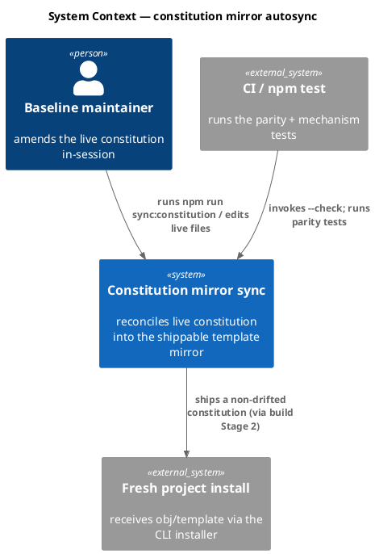
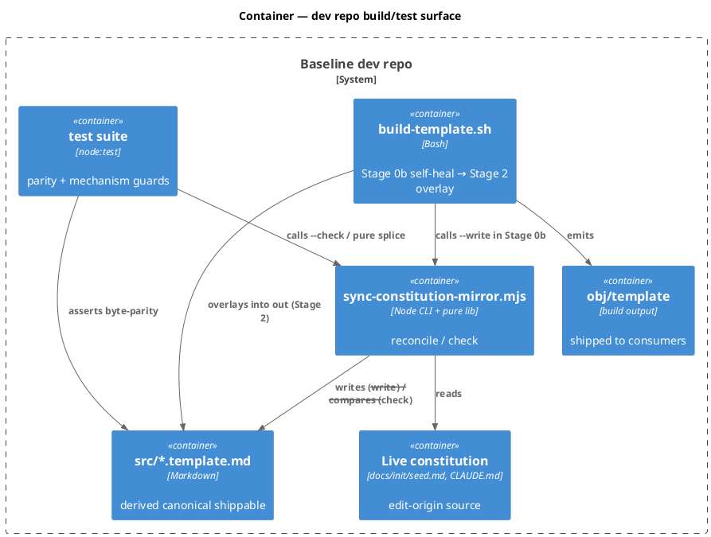
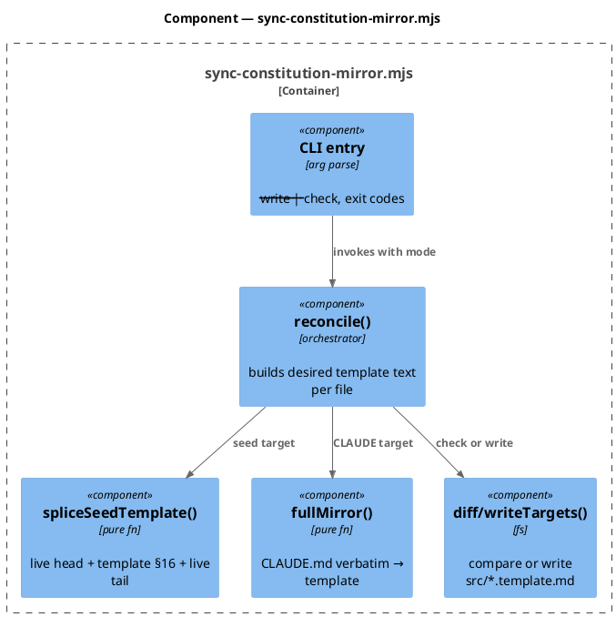
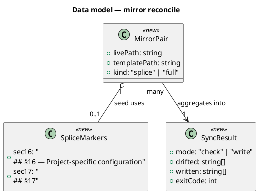
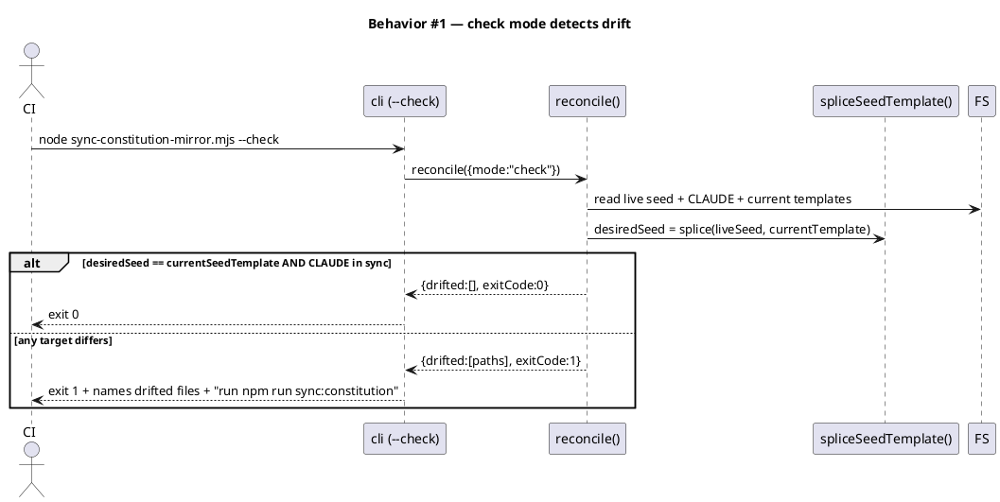
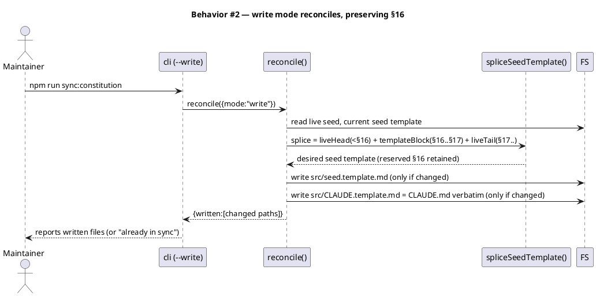
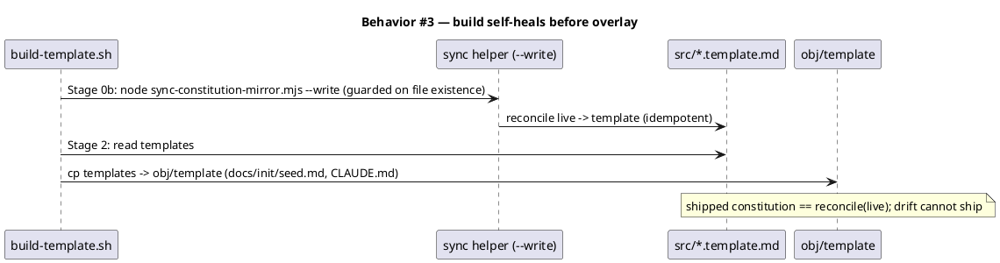
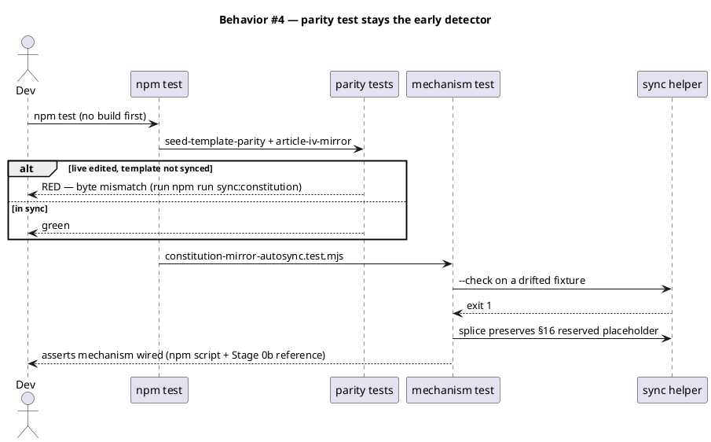
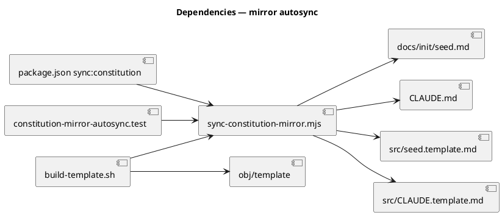

# Spec — constitution↔template mirror autosync

## Context

| Input | Path |
|---|---|
| Brief | `docs/brief/seed-template-mirror-autosync.md` |
| Intake | *(n/a — spec-entry track)* |
| BRD *(if any)* | *(none)* |
| Scout *(if any)* | *(none)* |
| Research *(if any)* | *(none)* |

**Write set:** `scripts/sync-constitution-mirror.mjs`, `scripts/build-template.sh`, `package.json`, `tests/constitution-mirror-autosync.test.mjs`

Runtime outputs (written by the helper, not hand-edited): `src/seed.template.md`, `src/CLAUDE.template.md`.

## Goal

A deterministic helper reconciles the two live constitution files (`docs/init/seed.md`, `CLAUDE.md`) into their `src/*.template.md` mirrors with one command, the build self-heals the mirrors before it ships, and `npm test` flags any residual drift — so the constitution can never ship stale and the maintainer never hand-splices the §16 carve-out.

## Non-goals

- Do not change the ship pipeline's source-of-truth model: `src/*.template.md` stays the canonical shippable that build **Stage 2** overlays into `obj/template`, and `docs/init/seed.md` + `CLAUDE.md` stay this repo's live working copies. No flipping which file is canonical for shipping.
- Do not add new seed carve-outs. §16 (`Project-specific configuration`) stays the *only* sanctioned seed divergence; `CLAUDE.md` stays a full byte-equal mirror.
- Not a git pre-commit hook. "Caught early" is satisfied by the existing parity tests in `npm test` plus the helper's `--check` mode (CI-callable); wiring drift detection into `git_commit_guard` is out of scope.
- No new third-party dependency. The helper is stdlib-only Node.

## Design

Diagrams are the contract. Prose is only for things a diagram cannot say.

**Authoring model (the one load-bearing decision).** Edits originate in the **live** files (`docs/init/seed.md` is amended first per Article I.4, then `CLAUDE.md`). `src/*.template.md` becomes a **derived** artifact: `template == reconcile(live)`. The reconcile is not a plain copy for seed — it splices the live shareable body around the template's reserved §16 block. The invariant `template == reconcile(live)` is asserted by tests, fixed by one command, and self-healed by the build.

### C4 — System context

Who interacts with the system, and which external systems it depends on.



### C4 — Container

Deployable units inside the system boundary and how they communicate.



### C4 — Component (changed containers only)

Internals of the sync helper.



### Data model — class diagram



#### Migration DDL

```sql
-- no schema changes; this feature touches build scripts, a Node helper, and tests only.
```

### Behavior — sequence per AC

One sequence per acceptance criterion. The sequence is the contract.









### State — core entity *(only if stateful)*

No persistent state machine — the reconcile is a pure function of the two live files plus the template's §16 block. Heading retained to record the explicit choice.

### Dependencies — graph



### Contracts

| Kind | Name | Input | Output | Errors | Idempotent |
|---|---|---|---|---|---|
| CLI | `node scripts/sync-constitution-mirror.mjs --check` | repo tree | exit 0 in sync / exit 1 + drifted paths on stderr | exit 2 on missing live/template file | yes |
| CLI | `node scripts/sync-constitution-mirror.mjs --write` | repo tree | writes changed `src/*.template.md`; prints written list | exit 2 on missing source / unparseable §16 markers | yes (re-run on synced tree = no-op) |
| npm | `npm run sync:constitution` | — | delegates to `--write` | inherits | yes |
| Build | `build-template.sh` Stage 0b | `$PKG_ROOT` | `src/*.template.md` reconciled before Stage 2 | skips silently when helper/source absent (fixture builds) | yes |

### Libraries and versions

No third-party libraries. Node stdlib only (`node:fs`, `node:path`, `node:process`).

| Library@version | Purpose | Key APIs | Confirmed via context7 |
|---|---|---|---|
| *(none — stdlib only)* | — | — | n/a |

### Alternatives considered

| Alt | Summary | Rejected because |
|---|---|---|
| A | Build-time self-heal **only** (extend Stage 0b, no helper/test) | `npm test` runs against the raw tree (no pre-build), so the parity test stays red after a live edit; fixes "can't ship" but not the "manual" or "caught early" pains. |
| B | git pre-commit hook that auto-syncs | This repo has no git-hook infra; consent/guard hooks are Claude Code PreToolUse, not git hooks. Higher blast radius, out of the stated need. |
| C | Flip direction: template canonical, generate live from template | Violates the non-goal and Article I.4 (seed.md is amended first); the maintainer edits live in-session. |
| D | Replace the two parity tests with a single generated-from-source assertion | Loses the byte-level diagnostics the existing tests give; higher churn on constitutional tests for no added guarantee. Keep them; add the mechanism test. |

## Design calls

*(none)* — the write set touches no `project.json → tdd.ui_globs` path.

## Acceptance criteria

| ID | Criterion (given / when / then) | Upstream AC | Sequence |
|---|---|---|---|
| AC-001 | given a tree where `docs/init/seed.md` was edited but `src/seed.template.md` was not, when `--check` runs, then it exits non-zero and names `src/seed.template.md` with a "run npm run sync:constitution" hint | brief desired-state | §Behavior #1 |
| AC-002 | given a drifted tree, when `--write` runs, then `src/seed.template.md` becomes `liveHead(<§16) + templateBlock(§16..§17) + liveTail(§17..)` and `src/CLAUDE.template.md` becomes `CLAUDE.md` verbatim | brief desired-state | §Behavior #2 |
| AC-003 | given `--write` reconciles seed, when the result is inspected, then the template's §16 body is the reserved `*Reserved.*` placeholder (NOT this repo's filled-in §16) and carries no `^Generated:` run stamp | brief (§16 carve-out) | §Behavior #2 |
| AC-004 | given an already-in-sync tree, when `--write` (or `--check`) runs, then no file is rewritten and the command reports "already in sync" / exit 0 (idempotent) | brief desired-state | §Behavior #2 |
| AC-005 | given `build-template.sh`, when its text is scanned, then a `# Stage 0b` block references `scripts/sync-constitution-mirror.mjs` and runs before `# Stage 2` | brief (guaranteed-not-to-ship) | §Behavior #3 |
| AC-006 | given `package.json`, when scripts are read, then `sync:constitution` maps to the helper's `--write` mode | brief (no manual step) | §Behavior #2 |
| AC-007 | given a missing live source or unparseable §16 marker, when the helper runs, then it exits 2 with a named error and writes nothing (fail-closed) | brief (guarantee) | §Behavior #1 |

## Test plan

| Category | Scenario | Expected | Covers |
|---|---|---|---|
| Golden path | `--write` on a drifted fixture tree | seed spliced (§16 preserved), CLAUDE copied verbatim | AC-002, AC-003 |
| Golden path | `--check` on an in-sync tree | exit 0, no output of drift | AC-004 |
| Contract violation | `--check` on a live-edited-only tree | exit 1, names `src/seed.template.md`, prints fix hint | AC-001 |
| Input boundary | live §16 filled-in with `Generated:` stamp | template §16 stays `*Reserved.*`, no stamp leaks | AC-003 |
| Idempotency | `--write` twice in a row | second run rewrites nothing, reports already-in-sync | AC-004 |
| Failure mode | missing `docs/init/seed.md` or absent §16 marker | exit 2, named error, no partial write | AC-007 |
| Regression trap (structural) | scan `build-template.sh` for Stage 0b ref before Stage 2 | reference present and ordered | AC-005 |
| Regression trap (structural) | read `package.json` scripts | `sync:constitution` → `--write` | AC-006 |
| Regression trap | existing `seed-template-parity` + `article-iv-mirror` tests | still green on the synced tree | AC-002 |

## Observability

| Signal | Name | Shape | Purpose |
|---|---|---|---|
| Log | helper stderr | `drifted: <paths>` / `wrote: <paths>` / `already in sync` | maintainer + CI feedback |
| Exit code | helper exit | `0` in sync, `1` drift (check), `2` fail-closed error | CI gate / scripting |
| Build log | Stage 0b line | `build: reconciled constitution mirror` | build transparency |

## Rollout

- **Feature flag**: none — a build/test/tooling change, not a runtime path. The helper is additive; existing parity tests keep their current behavior.
- **Order**: 1 add helper (pure lib + CLI) → 2 add failing mechanism test → 3 implement helper to green → 4 wire `package.json` script → 5 wire `build-template.sh` Stage 0b → 6 run `npm run sync:constitution` once to confirm no-op on the current (already in-sync) tree.
- **Canary**: run `npm run build` locally; confirm `src/*.template.md` unchanged (tree already in sync) and `obj/template` constitution intact.

## Rollback

- **Kill-switch**: revert the commit. The helper is additive; removing the Stage 0b line + `package.json` script + helper file restores prior behavior exactly (parity tests unchanged).
- **Signal to roll back**: `npm test` red on `seed-template-parity` / `article-iv-mirror` after the change on an in-sync tree, or `npm run build` mutating `src/*.template.md` on an in-sync tree — either trips within one local build/test cycle (well under 5 minutes).

## Archive plan

- Defaults *(automatic)*: brief, spec, spec-rendered/, spec approval.
- Extras *(list any non-default files)*:
  - *(none)*

## Open questions

- *(none — the authoring-model decision, §16 splice, and three-way wiring are settled in Design + Alternatives.)*
