# Spec — write_set-gated artifact compression for the spec and tdd hand-off

## Context

| Input | Path |
|---|---|
| Intake | `docs/intake/spec-tdd-artifact-compression.md` |
| Brief | `docs/brief/spec-tdd-artifact-compression.md` |
| Scout | `docs/scout/spec-tdd-artifact-compression.md` |
| Research | `docs/research/spec-tdd-artifact-compression.md` |

## Goal

Behind a default-off master flag, `/spec` and `/tdd` emit smaller hand-off artifacts — the tdd state stores spec-section pointers instead of verbatim excerpts, and `spec_diagram_presence_guard` requires a reduced diagram set for non-architectural write_sets — while every downstream consumer stays green and the flag-off path is byte-identical to today.

## Non-goals

- `/integrate`'s serial full-suite run is untouched (the `live-objtemplate-rebuild-races` determinism trade-off stays).
- No blanket diagram removal — the default profile is today's 6 diagrams; reduction only applies to a write_set that provably misses `source_globs`/`ui_globs`/multi-layer scope.
- No rewrite of `artifact_template_guard` required-*section* logic (deferred per research; this spec gates *diagrams*, not required sections).
- Compressing the model's live reasoning is **stretch-only** (AC-006), advisory, default-off — not a hard target.

## Design

Diagrams are the contract. Prose only where a diagram cannot speak.

### C4 — System context

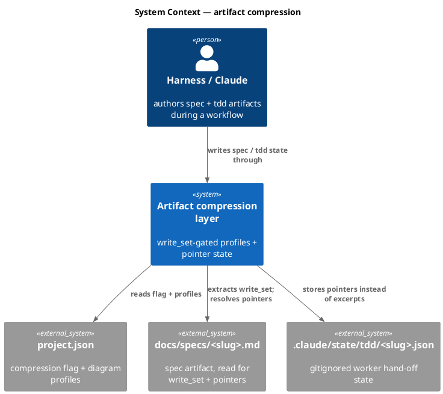

### C4 — Container

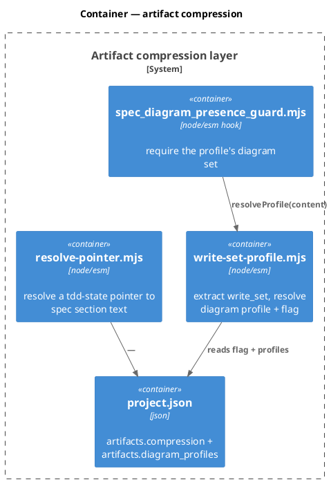

### C4 — Component (changed containers only)

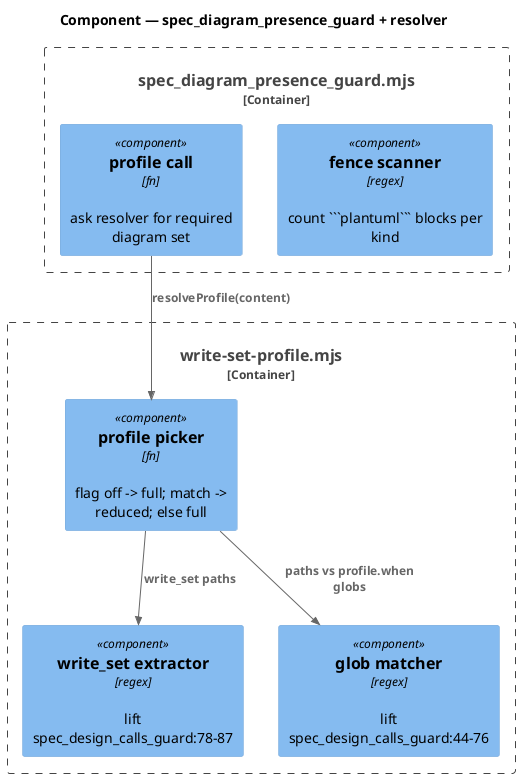

### Data model — class diagram

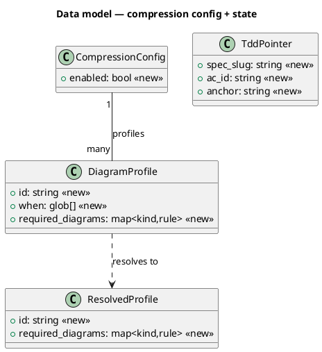

#### Migration (config, not SQL)

```json
// forward — add to project.json → artifacts
"compression": { "enabled": true },   // default ON (maintainer decision at gate-A review)
"diagram_profiles": [
  { "id": "non-architectural",
    "when": [".claude/hooks/**", ".claude/skills/**", "docs/**", "*.md", ".claude/*.json"],
    "required_diagrams": {
      "c4_component":    { "min": 1, "marker": "!include <C4/C4_Component>" },
      "class":           { "min": 1, "any_of": ["^\\s*class\\s+\\w"] },
      "sequence":        { "min": 1, "any_of": ["^\\s*participant\\b", "^\\s*actor\\b"] },
      "dependency_graph":{ "min": 1, "any_of": ["'\\s*@kind\\s+dependency-graph"] }
    } }
]
// reverse — delete both keys; required_diagrams.spec (full set) already governs
```

### Behavior — sequence per AC

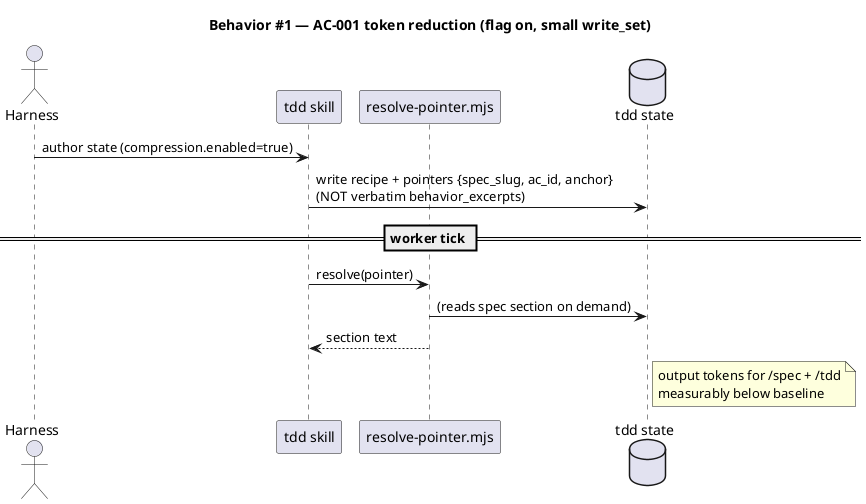

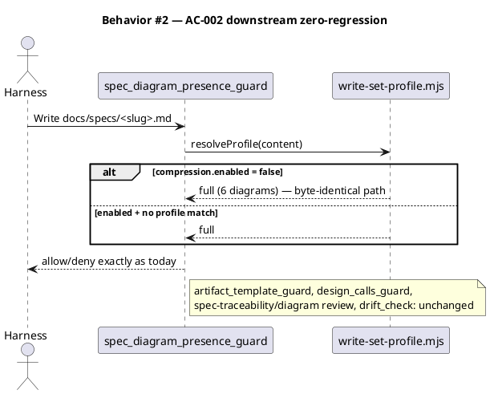

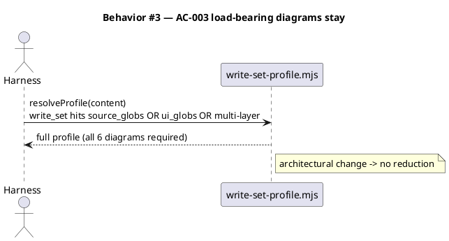

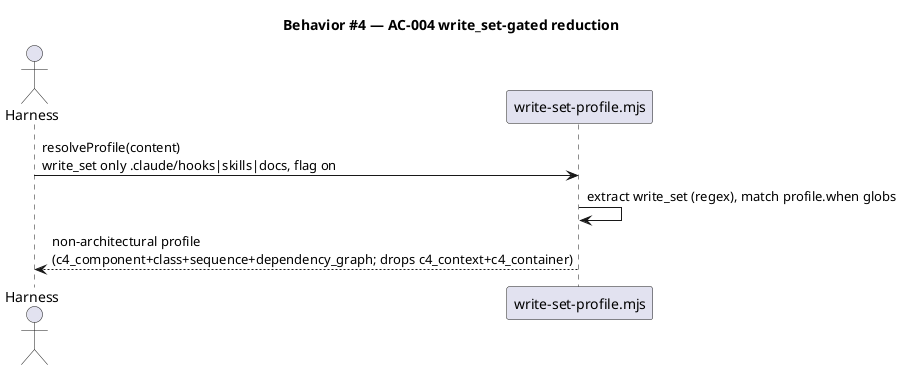

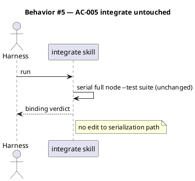

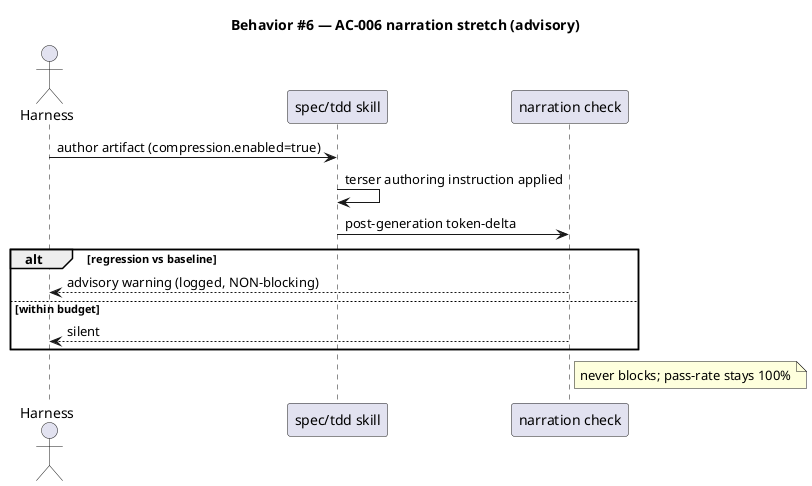

### State — core entity *(only if stateful)*

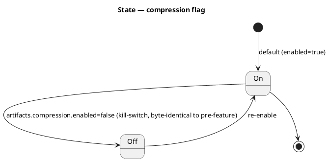

### Dependencies — graph

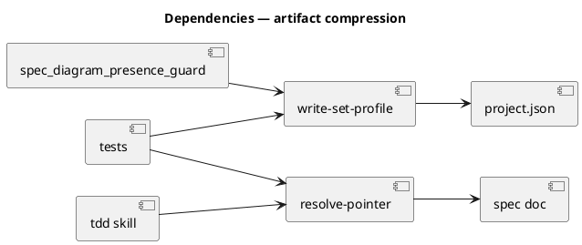

### Contracts

| Kind | Name | Input | Output | Errors | Idempotent |
|---|---|---|---|---|---|
| Module | `resolveProfile(content, projectGet)` | spec markdown text | `{id, required_diagrams}` | returns `full` on any parse/lookup failure (fail-open to today's behavior) | yes |
| Module | `resolvePointer({spec_slug, ac_id, anchor}, rootDir)` | pointer object | spec section text | throws `DanglingPointerError` on missing slug/anchor | yes |
| Config | `artifacts.compression.enabled` | — | bool, **default `true`** | absent ⇒ true | — |
| Config | `artifacts.diagram_profiles[]` | — | profile list | absent/empty ⇒ only `full` | — |

### Libraries and versions

| Library@version | Purpose | Key APIs | Confirmed via context7 |
|---|---|---|---|
| *(none — internal harness tooling; only dep `@clack/prompts@1.4.0` is CLI-only, not in this path)* | — | — | N/A |

### Alternatives considered

| Alt | Summary | Rejected because |
|---|---|---|
| Full Candidate B | rewrite both `artifact_template_guard` + `spec_diagram_presence_guard` for write_set-gated sections AND diagrams | highest blast radius; section payoff < diagram payoff; artifact_template_guard has no existing test — deferred |
| Candidate C alone | authoring-instruction trim only, no structural change | weakest enforcement; no durable guarantee; doesn't move the spec diagram bulk |
| Candidate A alone | tdd-state pointers only | leaves the /spec 97k diagram bulk untouched; misses intake AC-004 |

## Design calls

The write_set is `.claude/hooks/lib/write-set-profile.mjs`, `.claude/hooks/spec_diagram_presence_guard.mjs`, `.claude/skills/tdd/resolve-pointer.mjs`, `.claude/skills/tdd/SKILL.md`, `.claude/skills/spec/SKILL.md`, `.claude/project.json`, `tests/**`, `obj/template/.claude/manifest.json` (build-regenerated). It does **not** intersect `project.json → tdd.ui_globs` — no UI surface.

- *(none)*

## Acceptance criteria

| ID | Criterion (given / when / then) | Upstream AC | Sequence |
|---|---|---|---|
| AC-001 | given `compression.enabled=true` and a small non-UI write_set, when `/spec`+`/tdd` author artifacts, then tdd state stores pointers (no `behavior_excerpts[]` verbatim copy) and measured output tokens fall below the recorded baselines (96,990 / 89,163) on the reference change | intake AC1 | §Behavior #1 |
| AC-002 | given any spec authored under the new scheme, when `artifact_template_guard`, `spec_diagram_presence_guard`, `spec_design_calls_guard`, `spec-traceability-review`, `spec-shippability-review`, and `drift_check` run, then all pass with zero new failures vs pre-change | intake AC2 | §Behavior #2 |
| AC-003 | given a write_set intersecting `source_globs`/`ui_globs`/multi-layer scope, when the diagram guard resolves the profile, then the **full** 6-diagram set is required (no reduction) | intake AC3 | §Behavior #3 |
| AC-004 | given `compression.enabled=true` and a write_set matching only `.claude/hooks|skills` / `docs` / `*.md`, when the diagram guard resolves the profile, then the reduced set (`c4_component`+`class`+`sequence`+`dependency_graph`) is required and `c4_context`+`c4_container` are not | intake AC4 | §Behavior #4 |
| AC-005 | given `/integrate`, when this work ships, then its serialization path is byte-for-byte unchanged | intake AC5 | §Behavior #5 |
| AC-006 | *(stretch)* given `compression.enabled=true` with narration-trim, when `/spec`+`/tdd` generate, then an **advisory** (non-blocking) token-delta check emits and AC-002's pass-rate stays 100% | intake AC6 | §Behavior #6 |

## Test plan

| Category | Scenario | Expected | Covers |
|---|---|---|---|
| Golden path | flag on, non-arch write_set → resolveProfile | reduced profile (4 diagrams) | AC-004 |
| Golden path | flag on, tdd state authored | pointers present, no verbatim excerpt body | AC-001 |
| Golden path | resolvePointer on valid pointer | returns correct spec section text | AC-001 |
| Input boundary | write_set spanning hooks + source_globs | full profile (architectural wins) | AC-003 |
| Input boundary | empty/garbled write_set prose | fail-open to full profile | AC-002 |
| Contract violation | resolvePointer on missing anchor/slug | throws `DanglingPointerError` | AC-001 |
| Verification gate | grep every `/tdd` worker tick for `behavior_excerpts` body reads BEFORE the pointer swap | zero ticks read the excerpt body (else that tick is updated to read the spec section first) | AC-001 |
| Regression trap | **flag OFF** → spec_diagram_presence_guard verdict | byte-identical to pre-feature (all 6 required) | AC-002 |
| Regression trap | flag OFF → tdd state shape | verbatim excerpts as today | AC-002 |
| Regression trap | project.json key-preservation | `compression`+`diagram_profiles` added, all other keys intact | AC-002 |
| Failure mode | narration check over budget | advisory warning logged, write allowed | AC-006 |
| Failure mode | flag on, profile config absent | full profile (no crash) | AC-002 |

## Observability

| Signal | Name | Shape | Purpose |
|---|---|---|---|
| Log | `compression.profile.resolved` | fields: `slug, profile_id, write_set_size` | audit which profile fired |
| Log | `compression.narration.advisory` | fields: `phase, delta_tokens, over_budget` | stretch guardrail trail (non-blocking) |
| Metric | `timing.md` token columns | per-phase output-token delta | AC-001 measurement source |

## Rollout

- **Feature flag**: `project.json → artifacts.compression.enabled` — **default `true`** (maintainer decision at gate-A review; absent ⇒ true). This diverges from the repo's usual default-off feature-flag convention; accepted because the resolver fails open and the kill-switch is instant.
- **Order**: 1 ship resolver+guard+pointer+config with `enabled:true` → 2 `npm run build` regenerates `obj/template/.claude/manifest.json` (lists new helpers; satisfies spec-shippability C3) → 3 measure AC-001 by toggling the flag **off** for the baseline pass then default-**on** for the treatment pass on the reference change → 4 if AC-001 not met or AC-002 not green, flip the default to off (kill-switch) and reassess.
- **Reference change (AC-001)**: re-run a recorded small tdd-quickfix of the `audit-baseline-docsite-drift` shape, flag-off vs flag-on, ≥2 runs/side, compared via `timing.md` token columns.
- **Canary**: ships on by default, so the first real workflow under this version is the canary — watch its `timing.md` + downstream guard verdicts.

## Rollback

- **Kill-switch**: set `artifacts.compression.enabled=false` (or revert the deploy). Flag-off is regression-tested byte-identical, so rollback is instantaneous and total.
- **Signal to roll back**: any downstream guard/review failure attributable to a resolved profile, or a `timing.md` token regression — within one workflow run.

## Archive plan

- Defaults *(automatic)*: intake, brief, scout, research, spec, spec approval.
- Extras *(list any non-default files)*:
  - *(none)*

## Open questions

All five gate-A questions were **resolved at review (2026-06-21)**; recorded here as canonical decisions. No open blockers remain.

- **(Q1) Diagram profile scoping** — **RESOLVED:** `non-architectural` profile drops `c4_context`+`c4_container`, keeps `c4_component`+`class`+`sequence`+`dependency_graph`. (Reviewer accepted the recommendation.)
- **(Q2) AC-001 measurement** — **RESOLVED:** fixed reference change = a recorded small tdd-quickfix of the `audit-baseline-docsite-drift` shape, flag-off vs flag-on, ≥2 runs/side, compared via `timing.md` (see Rollout).
- **(Q3) Pointer-resolution safety** — **RESOLVED: verify, don't assume.** `/tdd` SHALL grep every worker tick for `behavior_excerpts` body reads before the pointer swap; any tick that reads the body is updated to read the spec section first (see Test plan "Verification gate" row).
- **(Q4) Narration guardrail** — **RESOLVED:** advisory-only (non-blocking), per the token-efficiency reference (no proven mechanical oracle for narration).
- **(Q5) Master-flag default** — **RESOLVED: default ON** (`enabled:true`, absent ⇒ true). Diverges from the repo's default-off convention; accepted because the resolver fails open and the kill-switch (`enabled:false`) is instant + regression-tested byte-identical (see Rollout / Rollback).
