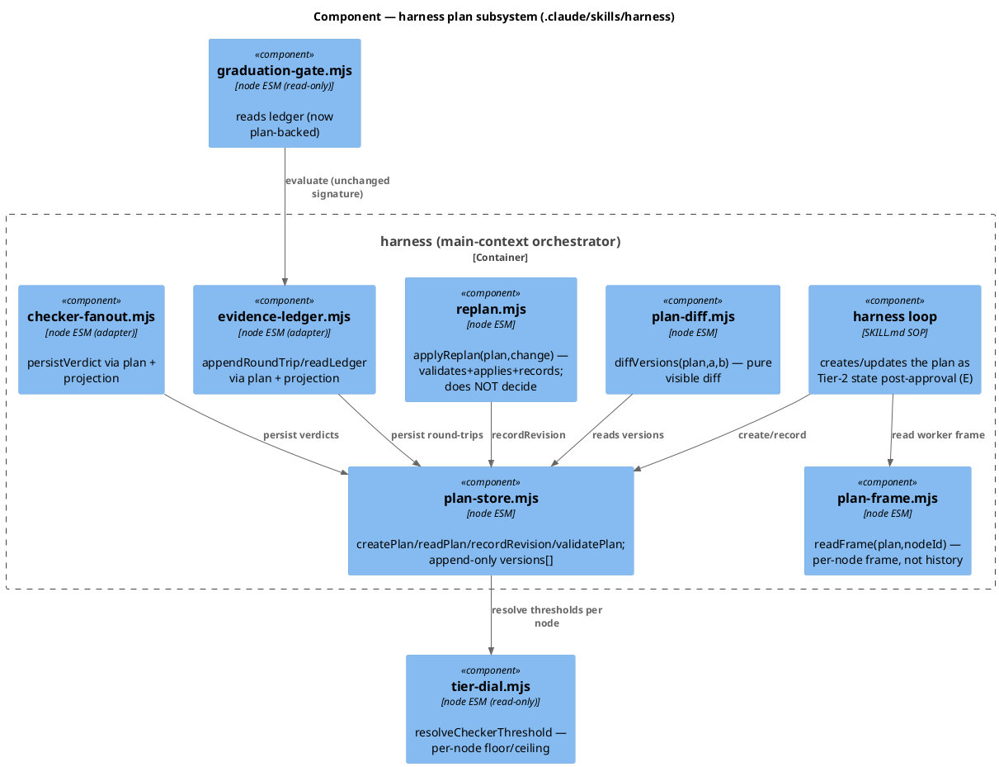
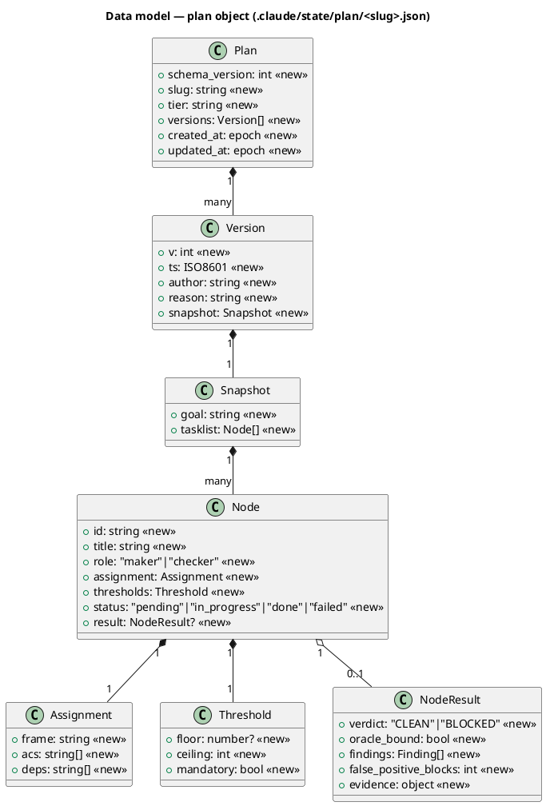
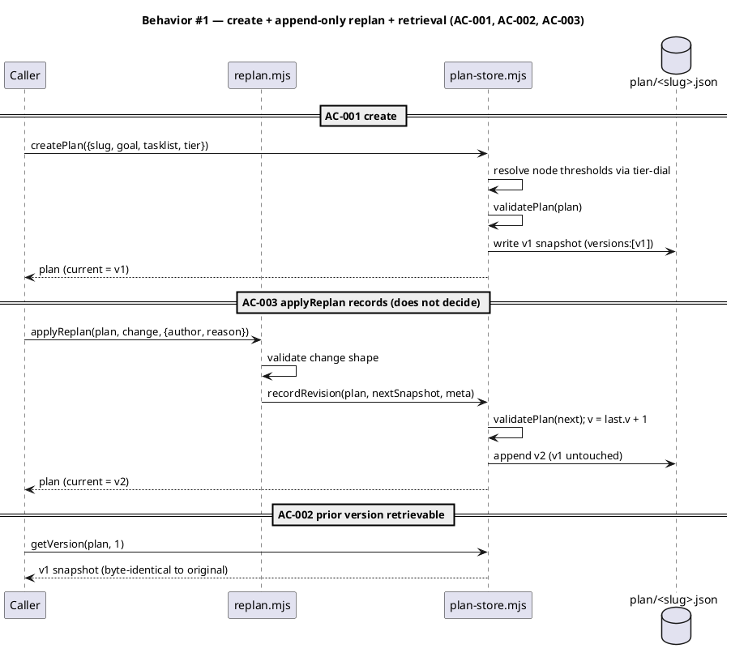
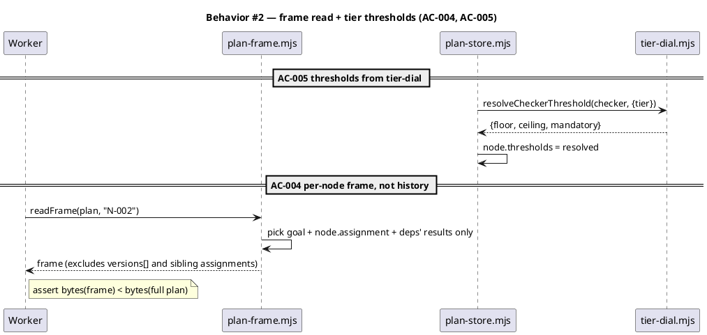
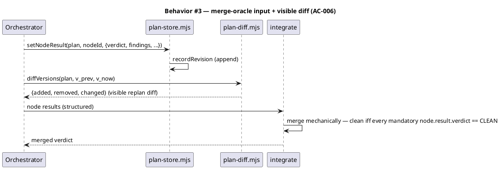
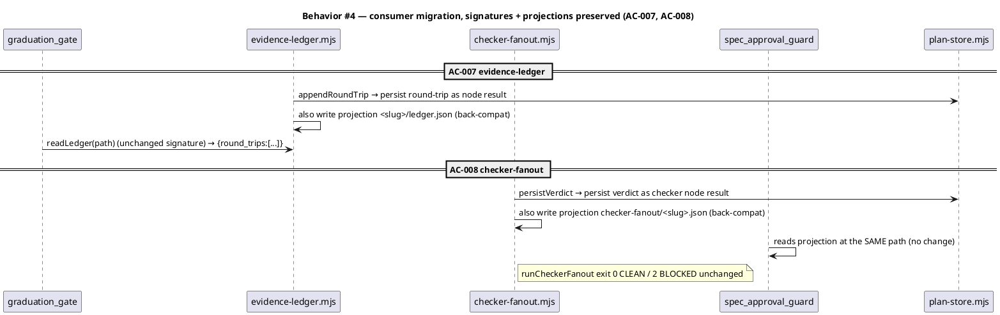
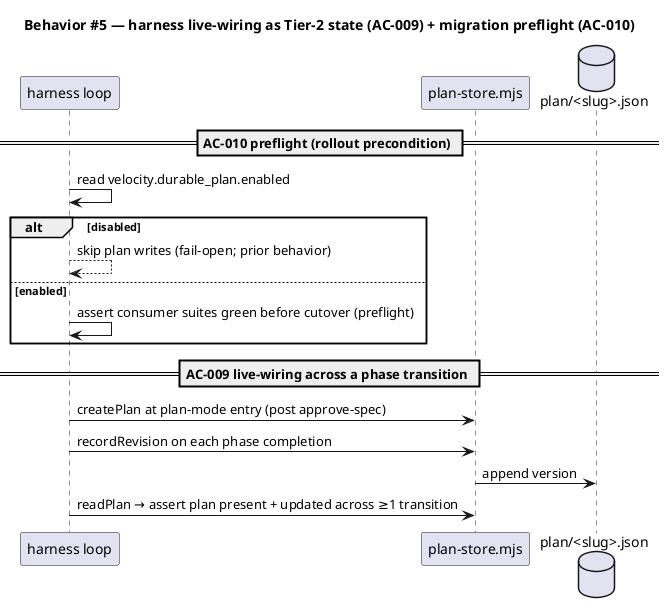
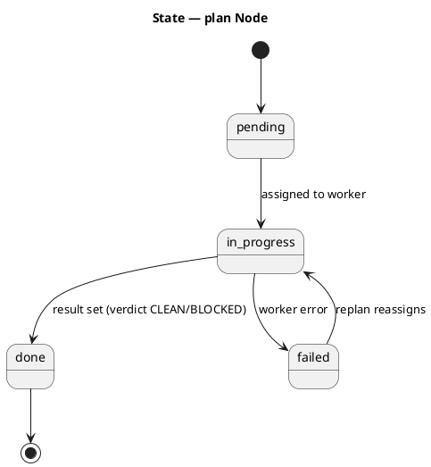
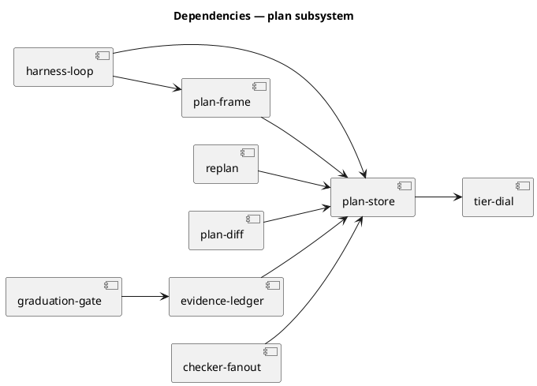

# Spec — durable plan state (`.claude/state/plan/<slug>.json`), -424f

<!--
Diagram profile: NON-ARCHITECTURAL (write_set ⊆ .claude/skills/** , tests/** , docs/**;
none sensitive). Required diagrams: c4_component, class, sequence, dependency_graph.
C4 Context/Container intentionally omitted per the reduced profile.
-->

## Context

| Input | Path |
|---|---|
| Intake | `docs/intake/durable-plan-schema.md` |
| Brief | `docs/brief/durable-plan-schema.md` |
| Scout | `docs/scout/durable-plan-schema.md` |
| Research | `docs/research/durable-plan-schema.md` |

**Write set**: `.claude/skills/harness/plan-store.mjs`, `.claude/skills/harness/plan-frame.mjs`, `.claude/skills/harness/plan-diff.mjs`, `.claude/skills/harness/replan.mjs`, `.claude/skills/harness/evidence-ledger.mjs`, `.claude/skills/harness/checker-fanout.mjs`, `.claude/skills/harness/SKILL.md`, `tests/plan-store.test.mjs`, `tests/plan-frame.test.mjs`, `tests/plan-diff.test.mjs`, `tests/replan.test.mjs`, `tests/plan-consumer-migration.test.mjs`, `docs/**` — non-architectural profile (reduced diagram set).

## Goal

After this ships, an approved workflow has a durable, append-only, versioned plan
object at `.claude/state/plan/<slug>.json` whose every replan is a recorded snapshot
(never an in-place mutation), whose workers read a per-node frame (never the full
history), whose per-node results are the merge oracle's structured input, and into
which the evidence-ledger and checker-fanout consumers persist — wired into the harness
loop as additive Tier-2 orchestration state.

## Non-goals

- The multi-round maker/checker RALPH loop, its stop-rule, oscillation detection, and
  arbitration (`-4c43`). This spec ships the **mechanism** a replan is recorded with;
  not the **policy** that decides when to replan.
- Multi-agent / multi-maker fan-out and the permanent Article II cap-lift (`-9360`).
- Reactivity / signal-driven v2 (`-9008`).
- Changing `integrate`'s merge **logic** — only defining the per-node result shape it consumes.
- A declarative JSON-Schema runtime validator (would add `ajv`; see Decisions D3).

## Decisions

> **D1 — Live-wiring (E) is additive Tier-2 state, NOT a new mandatory phase → no constitutional amendment.**
> The plan object joins `harness_state`, `.harness_active`, and `tdd_ticks[]` as
> orchestration state the harness maintains during the loop — the same class as the
> checker-fanout and rightsize-gate velocity additions, which needed no Article II/IV
> amendment. It is gated by `velocity.durable_plan.enabled` (default true; goes live the
> first workflow AFTER this one, per the introduction-workflow pattern). The heavier
> alternative — making the plan a mandatory post-approval *phase* — WOULD require a
> seed.md §5 / Article IV amendment; it is rejected here and recorded as the gate-A
> open question (OQ-1) for the reviewer to overturn if they want the stronger guarantee.

> **D2 — History is append-only full snapshots (research B3), with an on-demand pure differ.**
> `versions[]` is the append-only log; current state = the last snapshot. Prior versions
> are retrievable verbatim (AC-002 trivially). A pure `diffVersions` renders the visible
> replan diff on demand — no stored JSON-Patch chain, no `rfc6902`/`fast-json-patch` dep,
> no patch-chain corruption risk (token-efficiency.md alias-drift caveat).

> **D3 — Schema is a hand-rolled pure `.mjs` validator (research A1); NO separate `plan.v1.json`.**
> A `.claude/schemas/plan.v1.json` would put a write_set path outside the non-architectural
> profile (forcing the full C4 set) and add no runtime value without `ajv`. The validator
> is the schema; its shape is documented in the class diagram below.

> **D4 — Consumer migration is the adapter form (research D1): signatures + on-disk projection paths preserved.**
> `evidence-ledger`'s and `checker-fanout`'s public functions keep their signatures; their
> bodies persist through the plan object, and they continue to write their existing
> projection files (`<slug>/ledger.json`, `checker-fanout/<slug>.json`) so `graduation-gate`
> and `spec_approval_guard` need NO change — this is why no `.claude/hooks/**` path enters
> the write_set.

## Design

Diagrams are the contract. Prose only for what a diagram cannot say. C4 Context/Container
omitted (reduced profile — this is an internal `.claude/skills/harness` subsystem with no
new deployable unit or external actor beyond the existing harness).

### C4 — Component (harness plan subsystem)



### Data model — class diagram

The plan object's shape. There is no SQL DB — the "DDL" is the JSON file structure;
the validator (`validatePlan`) enforces these fields.



#### "Migration DDL" (JSON structure invariants enforced by validatePlan)

```sql
-- forward (validatePlan asserts):
--   plan.schema_version == 1, plan.slug:string, plan.tier:string,
--   plan.versions: non-empty array, each version.v strictly increasing from 1,
--   version.snapshot.tasklist: array; each node.id unique; node.assignment.deps ⊆ node ids,
--   node.thresholds resolved from tier-dial (floor/ceiling/mandatory present),
--   node.result null OR {verdict ∈ {CLEAN,BLOCKED}, findings: array, false_positive_blocks: int}.
-- reverse (no migration table; deleting .claude/state/plan/<slug>.json fully reverts).
```

### Behavior — sequence per AC











### State — plan node lifecycle



### Dependencies — graph



### Contracts

| Kind | Name | Input | Output | Errors | Idempotent |
|---|---|---|---|---|---|
| CLI/fn | `createPlan({slug, goal, tasklist, tier})` | plan seed | plan (v1) | throws on invalid seed | no (creates) |
| fn | `readPlan(slug, rootDir)` | slug | plan or null (missing) | never throws | yes |
| fn | `recordRevision(plan, nextSnapshot, {author, reason})` | plan + snapshot | plan (v+1) | throws on invalid snapshot | no (appends) |
| fn | `getVersion(plan, v)` | plan + int | snapshot | throws on out-of-range | yes |
| fn | `validatePlan(plan)` | plan | `{ok, errors[]}` | never throws | yes |
| fn | `readFrame(plan, nodeId)` | plan + id | frame object | throws on unknown id | yes |
| fn | `diffVersions(plan, a, b)` | plan + 2 ints | `{added, removed, changed}` | throws on out-of-range | yes |
| fn | `applyReplan(plan, change, meta)` | plan + change | plan (v+1) | throws on invalid change | no (records) |
| fn | `appendRoundTrip(path, rt)` *(adapter, unchanged sig)* | path + round-trip | ledger | never throws | no |
| fn | `runCheckerFanout({...})` *(adapter, unchanged sig)* | ctx | merged verdict | fail-open | no |

### Libraries and versions

| Library@version | Purpose | Key APIs | Confirmed via context7 |
|---|---|---|---|
| Node.js built-ins (≥18.17) | fs, path, `structuredClone` | `readFileSync`/`writeFileSync`/`mkdirSync`, `structuredClone` | n/a — platform, no third-party API |

No third-party library is introduced (zero new deps; the B2 JSON-Patch lib path was rejected — research Axis 2). Nothing to confirm via context7.

### Alternatives considered

| Alt | Summary | Rejected because |
|---|---|---|
| Stored JSON-Patch diffs (RFC 6902) | token-minimal patch chain | new dep + patch-chain corruption + alias drift; history isn't worker-read so the storage win doesn't move η |
| Declarative `plan.v1.json` + ajv | schema-as-data | new dep; path leaves the non-architectural profile; validator already is the schema |
| Rewrite consumer call-sites, delete old modules | clean end-state | breaks in-flight state + live Lever-1 gate; largest blast radius |
| Plan as a mandatory post-approval phase | strongest guarantee | requires seed §5 / Article IV amendment; deferred to OQ-1 / reviewer |

## Design calls

*(none)* — write_set has no UI surface (`.claude/skills/harness/**`, `tests/**`, `docs/**`).

## Acceptance criteria

| ID | Criterion (given / when / then) | Kind | Upstream AC | Sequence |
|---|---|---|---|---|
| AC-001 | given a `{slug, goal, tasklist, tier}` seed, when `createPlan` runs, then `.claude/state/plan/<slug>.json` is written with `versions:[v1]` and `validatePlan` accepts it (and rejects a malformed plan) | behavior | intake AC-1 | §Behavior #1 |
| AC-002 | given a plan at version V, when a revision is recorded, then current = V+1, version V's snapshot is still byte-retrievable, and no version is overwritten in place | behavior | intake AC-2 | §Behavior #1 |
| AC-003 | given orchestrator/sibling input changing an assignment, when `applyReplan` runs, then it emits a new recorded revision and never mutates silently nor decides whether to replan | behavior | intake AC-3 | §Behavior #1 |
| AC-004 | given a multi-node plan, when a worker calls `readFrame(plan, nodeId)`, then it receives only that node's frame and `bytes(frame) < bytes(full plan)` | behavior | intake AC-4 | §Behavior #2 |
| AC-005 | given `project.json → tier.level`, when node thresholds resolve, then floor/ceiling/mandatory equal `tier-dial.resolveCheckerThreshold` output (no hard-coded values) | behavior | intake AC-5 | §Behavior #2 |
| AC-006 | given completed per-node results, when shaped for the merge oracle, then the per-node result schema round-trips into the integrate-input shape losslessly | behavior | intake AC-6 | §Behavior #3 |
| AC-007 | after cutover, `evidence-ledger` persists through the plan object, writes its projection, and `readLedger`/`graduation-gate` behave identically (existing suite 0 new failures + payload round-trip) | behavior | intake AC-7 | §Behavior #4 |
| AC-008 | after cutover, `checker-fanout` persists verdicts through the plan object, writes its projection at the same path, and `runCheckerFanout` CLEAN/BLOCKED exit + merged verdict are unchanged | behavior | intake AC-8 | §Behavior #4 |
| AC-009 | given `velocity.durable_plan.enabled`, when the harness runs post-approval, then the plan is created at plan-mode entry and updated across ≥1 phase transition | behavior | intake AC-9 | §Behavior #5 |
| AC-010 | given a migration cutover, when the harness is about to write plan state, then it is gated by `velocity.durable_plan.enabled` (fail-open when disabled) and the existing consumer suites are green before cutover | preflight | intake AC-7, AC-8 | §Behavior #5 |

## Test plan

| Category | Scenario | Expected | Covers |
|---|---|---|---|
| Golden path | createPlan → recordRevision → getVersion(1) | v2 current, v1 byte-identical | AC-001, AC-002 |
| Input boundary | validatePlan on missing slug / non-increasing v / dangling dep | `{ok:false, errors:[…]}` | AC-001 |
| Contract violation | applyReplan with malformed change | throws; plan unchanged | AC-003 |
| Golden path | readFrame returns node frame | frame excludes versions[]+siblings; bytes(frame) < bytes(plan) | AC-004 |
| Golden path | thresholds resolved under tier=regulated | equal tier-dial output | AC-005 |
| Golden path | node result → integrate-input round-trip | lossless structured fields | AC-006 |
| Regression trap | existing evidence-ledger suite after migration | unchanged (0 new failures) | AC-007 |
| Regression trap | existing checker-fanout + live-wiring suites after migration | unchanged; exit codes preserved | AC-008 |
| Failure mode | velocity.durable_plan.enabled = false | harness skips plan writes (fail-open) | AC-010 |
| Concurrency / ordering | two recordRevision calls | versions strictly increasing, no lost write (append-only) | AC-002 |
| Golden path | harness creates plan post-approval, updates across a transition | plan present + updated | AC-009 |

## Observability

| Signal | Name | Shape | Purpose |
|---|---|---|---|
| Log | `plan.revision.recorded` | fields: `slug, v, author, reason` | audit the replan trail (vision §2.5 explanation trace) |
| Log | `plan.migration.projection_written` | fields: `slug, consumer, path` | confirm back-compat projection during cutover |
| Metric | `plan.versions.count` | gauge per slug | detect replan oscillation (input to `-4c43` later) |

## Rollout

### Prerequisites

| # | Prerequisite | enforced-by |
|---|---|---|
| 1 | `velocity.durable_plan.enabled` flag exists, defaults documented, and the existing evidence-ledger + checker-fanout suites are green before plan writes activate | AC-010 |

- **Feature flag**: `velocity.durable_plan.enabled` — default `true`, but goes live the
  first workflow AFTER this one introduces it (introduction-workflow pattern; this run
  edits SKILL.md but does not retroactively drive itself through the new wiring).
- **Migration order**: 1 ship plan-store + helpers (inert) → 2 migrate evidence-ledger
  (adapter + projection) → 3 migrate checker-fanout (adapter + projection) → 4 wire harness
  loop (E) behind the flag → 5 next workflow exercises it end-to-end.
- **Canary**: the first post-introduction workflow's `timing.md` + the consumer suites are
  the success signal; no external traffic.

## Rollback

- **Kill-switch**: set `velocity.durable_plan.enabled: false` — the harness skips all plan
  writes (fail-open to today's behavior); the adapters still write the projection files the
  consumers already read, so disabling the flag is non-destructive.
- **Signal to roll back**: any new failure in the evidence-ledger / checker-fanout / live
  fan-out suites, or a `checker-fanout run` exit-code change — trips within one workflow run.
- **Full revert**: deleting `.claude/state/plan/<slug>.json` and reverting the adapter
  bodies restores the pre-spec state (no schema/DB migration to unwind).

## Archive plan

- Defaults *(automatic)*: intake, brief, scout, research, spec, spec-rendered/, spec approval.
- Extras *(list any non-default files)*:
  - *(none)*

## Open questions

- **OQ-1 (gate A, load-bearing): additive Tier-2 wiring vs mandatory phase.** D1 wires the
  plan as additive Tier-2 state needing no amendment. If the reviewer wants the plan to be a
  *mandatory* post-approval artifact (a stronger durability guarantee), that is a seed.md §5 /
  Article IV change and must be approved as such. Default = additive (no amendment).
- **OQ-2: the `-424f` ↔ `-4c43` seam.** Confirm `applyReplan(plan, change)` /
  `recordRevision` are the full extent of `-424f`'s replan surface, and that
  oscillation/dry-round/ceiling logic is explicitly `-4c43`. The spec builds the mechanism only.
- **OQ-3: projection-file lifetime (D4).** Keep `<slug>/ledger.json` +
  `checker-fanout/<slug>.json` projections indefinitely, or deprecate after `graduation-gate`
  and `spec_approval_guard` are themselves migrated to read the plan directly (a later piece)?
