# Spec — Rollout-prerequisite enforceability checker (oracle-bound)

<!--
Technical spec. Produced by the `spec` skill.
Approval is a token written by /approve-spec — never add "Status: Approved".
-->

## Context

| Input | Path |
|---|---|
| Intake | `docs/intake/spec-rollout-enforceability-review.md` |
| Scout | `docs/scout/spec-rollout-enforceability-review.md` |
| Research | `docs/research/spec-rollout-enforceability-review.md` |
| Brief | `docs/brief/spec-rollout-enforceability-review.md` |

**Write set**: `.claude/skills/spec-rollout-enforceability-review/**`, `.claude/hooks/lib/tier-dial.mjs`, `src/hooks/lib/tier-dial.mjs`, `.claude/hooks/spec_approval_guard.mjs`, `.claude/skills/harness/checker-fanout.mjs`, `.claude/skills/spec/template.md`, `.claude/project.json`, `src/project.template.json`, `.github/workflows/release.yml` — touches `.claude/hooks/**` (a `security.sensitive_globs` path), so the **full** C4 diagram set is required.

## Goal

A spec's Rollout prerequisites become a structured, machine-checkable block; an oracle-bound checker verifies each prerequisite is bound to an enforcement-type acceptance criterion and hard-blocks `/approve-spec` when a binding is missing, dangling, or points at a non-enforcing AC.

## Non-goals

- No retroactive sweep of already-approved/archived specs — the checker binds new specs going forward only.
- No LLM-judgment blocking — a prerequisite left in free prose is ADVISORY, never a BLOCKER. Only the structured `enforced-by` artifact may block.
- Not part of the v1 thought-compiler epic — standalone checker the epic may later absorb by reference.
- No promotion of `spec-diagram`/`spec-traceability` to mandatory — they stay advisory; this spec only generalizes the block *channel*, it does not change their tier.

## Design

Diagrams are the contract. Prose is only for what a diagram cannot say.

### C4 — System context

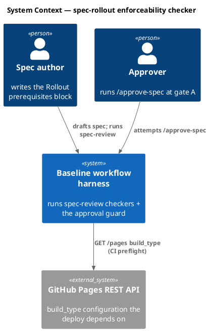

### C4 — Container

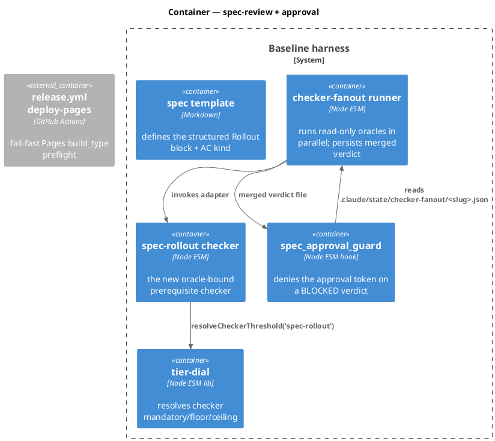

### C4 — Component (changed containers only)

The internals of the new `spec-rollout` checker.

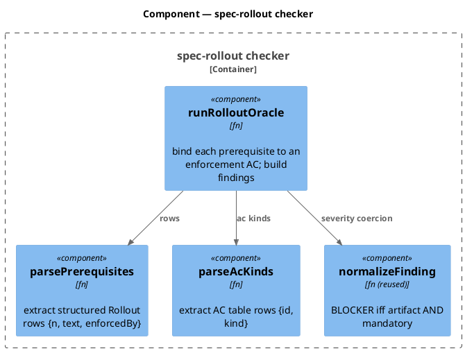

### Data model — class diagram

The shapes are in-memory artifacts (no database). `<<new>>` marks fields this spec introduces to the spec-format grammar.

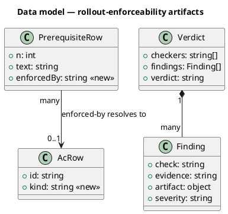

#### Migration DDL

No database migration. The structural change is to the spec-format grammar:

```text
-- forward (spec template grammar)
ADD  Rollout section: "Prerequisites" table with columns (number, Prerequisite, enforced-by)
ADD  Acceptance-criteria table: column "Kind" with enum {preflight, smoke, error-mapping, behavior}
-- reverse
DROP the Prerequisites table and the Kind column (free-prose Rollout still parses -> ADVISORY)
```

### Behavior — sequence per AC

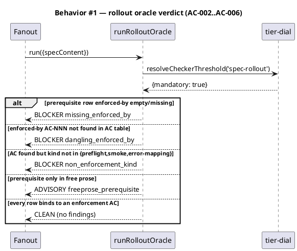

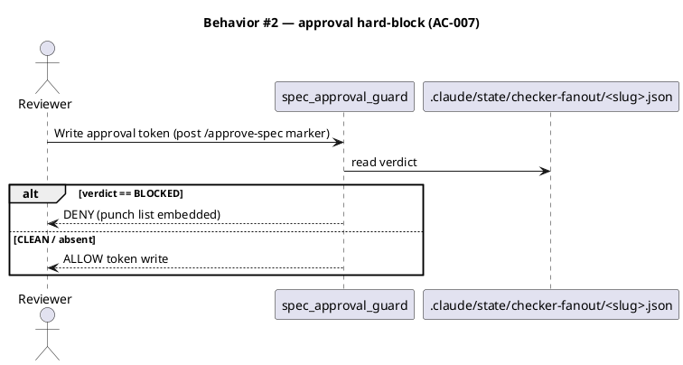

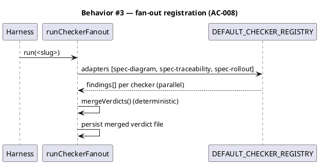

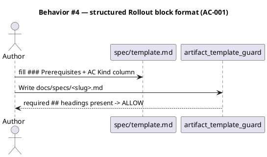

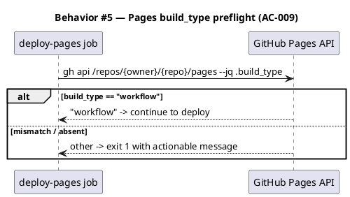

### State — checker verdict *(not a stateful entity)*

The checker is a pure function; no persistent state machine. Heading kept to record the explicit choice.

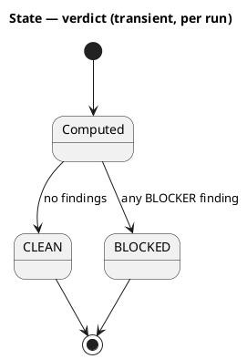

### Dependencies — graph

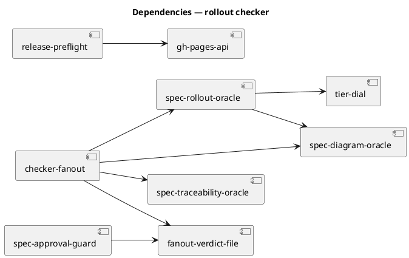

`[spec-rollout-oracle] --> [spec-diagram-oracle]` is the `normalizeFinding` import (reuse, not duplication). Graph is acyclic.

### Contracts

| Kind | Name | Input | Output | Errors | Idempotent |
|---|---|---|---|---|---|
| Fn | `runRolloutOracle({specContent}, deps?)` | spec markdown | `{findings:[]}` | none (pure; tolerates absent sections) | yes |
| Fn | `parsePrerequisites(specContent)` | spec markdown | `[{n,text,enforcedBy}]` | none | yes |
| Fn | `parseAcKinds(specContent)` | spec markdown | `Map<acId,kind>` | none | yes |
| CLI | `checker-fanout.mjs run <slug>` | slug | exit 0 CLEAN / 2 BLOCKED + persisted verdict | fail-open on error | yes |
| Hook | `spec_approval_guard` (fanout branch) | approval-token Write | ALLOW / DENY | fail-safe (absent verdict → ALLOW) | yes |
| CI | `gh api /repos/{owner}/{repo}/pages` | repo | `build_type` string | non-`workflow` → exit 1 | yes |

### Libraries and versions

| Library@version | Purpose | Key APIs | Confirmed via context7 |
|---|---|---|---|
| GitHub REST API (Pages) | AC-009 preflight | `GET/PUT /repos/{owner}/{repo}/pages`, body `build_type: legacy\|workflow` | docs.github.com/en/rest/pages/pages (verified 2026-06-22; no context7 entry — official docs fallback) |

No third-party npm dependency — all internal modules are stdlib-only Node ESM.

### Alternatives considered

| Alt | Summary | Rejected because |
|---|---|---|
| 1C — block on artifact, bypass tier dial | Oracle sets BLOCKER directly without `mandatory` gate | Diverges from the established `normalizeFinding` pattern; loses tier tunability. **Live at gate A** — chosen lead is 1A (register in tier dial) but flips here if editing the `tier-dial` Foundation module is judged too costly. |
| 1B — reuse `ac-conformance` key | Resolve threshold under the existing mandatory key | Semantic overloading; a project tuning `ac-conformance` silently retunes rollout. |
| 2C — dedicated rollout verdict file | Guard gains a third bespoke read branch | Doesn't generalize; N files / N guard edits where 2A is one. |
| 3A-ii / 3B — kind on the prerequisite row / prose scan | Author asserts kind, or grep AC prose | 3A-ii lets the binding lie; 3B is the forbidden LLM-judgment blocking path. |
| 4B-only — `bootstrap-pages.mjs` setter, no preflight | Fix the config, no CI gate | No fail-fast; a setup script drifts. **Live at gate A** — is the setter in scope (4C) or preflight-only (4A)? |

## Design calls

*(none)* — the write_set does not intersect `project.json → tdd.ui_globs`; no UI surface.

## Acceptance criteria

| ID | Criterion (given / when / then) | Kind | Upstream AC | Sequence |
|---|---|---|---|---|
| AC-001 | given the spec template, then `## Rollout` defines a structured `### Prerequisites` table (one row per prerequisite, each with an `enforced-by` cell) distinct from free-prose rollback/sequencing | behavior | intake AC 1 | §Behavior #4 |
| AC-002 | given a prerequisite row with empty/missing `enforced-by`, when the checker runs, then it emits a BLOCKER naming that row | behavior | intake AC 2 | §Behavior #1 |
| AC-003 | given `enforced-by: AC-NNN` naming an AC absent from the spec, when the checker runs, then BLOCKER (dangling pointer) | behavior | intake AC 3 | §Behavior #1 |
| AC-004 | given `enforced-by: AC-NNN` resolving to an existing AC whose `Kind` is not in {preflight, smoke, error-mapping}, when the checker runs, then BLOCKER (non-enforcement kind) | behavior | intake AC 4 | §Behavior #1 |
| AC-005 | given a precondition only in free prose (not in the table), when the checker runs, then ADVISORY, never BLOCKER | behavior | intake AC 5 | §Behavior #1 |
| AC-006 | given every prerequisite row binds to a real enforcement-type AC, when the checker runs, then CLEAN (no findings) | behavior | intake AC 6 | §Behavior #1 |
| AC-007 | given a checker BLOCKER, when `/approve-spec` is attempted, then approval is hard-blocked through `spec_approval_guard` reading the merged fan-out verdict (no bespoke gate) | behavior | intake AC 7 | §Behavior #2 |
| AC-008 | given the fan-out enabled, when it runs, then `spec-rollout` executes as a registered `DEFAULT_CHECKER_REGISTRY` adapter and its verdict merges deterministically | behavior | intake AC 8 | §Behavior #3 |
| AC-009 | given the GitHub Pages `build_type=workflow` precondition, when `deploy-pages` runs, then a preflight asserts it via `gh api` and fails fast when absent | preflight | intake AC 9 | §Behavior #5 |

## Test plan

| Category | Scenario | Expected | Covers |
|---|---|---|---|
| Golden path | spec with one prerequisite bound to a `kind: preflight` AC | CLEAN | AC-006 |
| Contract violation | prerequisite row, `enforced-by` empty | BLOCKER missing_enforced_by | AC-002 |
| Contract violation | `enforced-by: AC-099` not in AC table | BLOCKER dangling_enforced_by | AC-003 |
| Contract violation | `enforced-by: AC-001` whose Kind is `behavior` | BLOCKER non_enforcement_kind | AC-004 |
| Input boundary | precondition only in free-prose bullet | ADVISORY only | AC-005 |
| Golden path | format: template renders `### Prerequisites` + Kind column; artifact_template_guard accepts | required headings present | AC-001 |
| Integration | fan-out registry includes `spec-rollout`; merged verdict persisted to `.claude/state/checker-fanout/<slug>.json` | adapter runs, file written | AC-008 |
| Integration | `spec_approval_guard` denies token write when fan-out verdict BLOCKED; allows when absent/CLEAN | DENY / ALLOW | AC-007 |
| Failure mode | verdict file absent / unparseable | guard ALLOWs (fail-safe) | AC-007 |
| Failure mode | `gh api` returns `legacy` | preflight exit 1 with message | AC-009 |
| Regression trap | spec with no `## Rollout` prerequisites table at all | no findings (free-prose path) — does not block | AC-005 |
| Tier dial | `resolveCheckerThreshold('spec-rollout')` → mandatory:true in every profile | mandatory true | AC-002 |

## Observability

| Signal | Name | Shape | Purpose |
|---|---|---|---|
| Log | `checker_fanout_verdict` | fields: slug, verdict, blocker_count | audit which checker blocked |
| Log | `spec_approval_guard` (existing) | fields: slug, reason | record the deny |
| CI annotation | pages-preflight failure | message + the `gh api PUT` fix command | actionable fail-fast |

## Rollout

### Prerequisites

| # | Prerequisite | enforced-by |
|---|---|---|
| 1 | GitHub Pages `build_type` for this repo must equal `workflow` for `deploy-pages` to publish correctly | AC-009 |
| 2 | Baseline-owned shipped files changed here must be re-stamped into the manifest (`scripts/build-template.sh`) before `audit-baseline` passes | AC-008 |

*(This section dogfoods the new format AC-001 defines: each prerequisite binds to an enforcement-type AC. AC-009 is `kind: preflight`; AC-008's integration test is the enforcing check for prerequisite 2.)*

- **Feature flag**: `project.json → velocity.checker_fanout.checkers` — `spec-rollout` is appended; the fan-out already gates on `velocity.checker_fanout.enabled`. Goes live the first spec-track workflow after this lands (introduction-workflow pattern; this spec's own run predates the registration).
- **Migration order**: 1 template format → 2 oracle + tests → 3 tier-dial registration → 4 fan-out adapter + verdict persistence → 5 guard read-path → 6 release.yml preflight.
- **Canary**: none — internal dev tooling; the first post-merge spec-track run exercises it.

## Rollback

- **Kill-switch**: remove `spec-rollout` from `velocity.checker_fanout.checkers` (checker stops running); or set `velocity.checker_fanout.enabled=false` (whole fan-out reverts to per-skill review). Guard read-path is fail-safe (absent verdict → ALLOW), so disabling cannot wedge approval.
- **Signal to roll back**: a CLEAN spec is wrongly BLOCKED at `/approve-spec` (false-positive block) — the proof-obligation invariant is violated; revert the registration within the same session.

## Archive plan

- Defaults *(automatic)*: intake, scout, research, brief, spec, spec-rendered/, spec approval, security report.
- Extras *(list any non-default files)*:
  - *(none)*

## Open questions

- **Decision 1 (1A vs 1C)** — register `spec-rollout` in the `tier-dial` Foundation module with `mandatory:true` (lead), or block directly on the structured artifact without the tier gate (self-contained, no Foundation edit)? Editing `tier-dial.mjs` ripples to its `src/` mirror and every `resolveAllCheckers` consumer. **Settle at gate A.**
- **Decision 4 scope (4A vs 4C)** — is the Pages *setter* `scripts/bootstrap-pages.mjs` in scope for this workflow, or is the fail-fast `release.yml` preflight (4A) sufficient and the setter deferred? Intake AC-9 says "and/or". **Settle at gate A.**
- **Checker name** — `spec-rollout` is used throughout; confirm it (vs `spec-rollout-enforceability`) since it appears in the registry, the tier dial, and `project.json`.
- **AC `Kind` column reach** — does the new `Kind` column belong only to this checker, or is it a broader AC-format change other checkers (`ac-conformance`) would consume? Scope kept to `-419d` for now.
