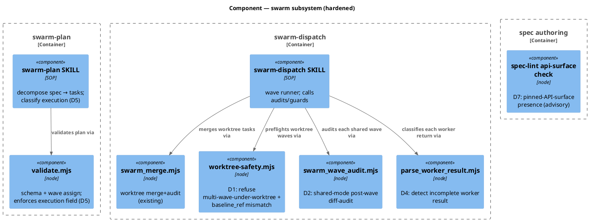
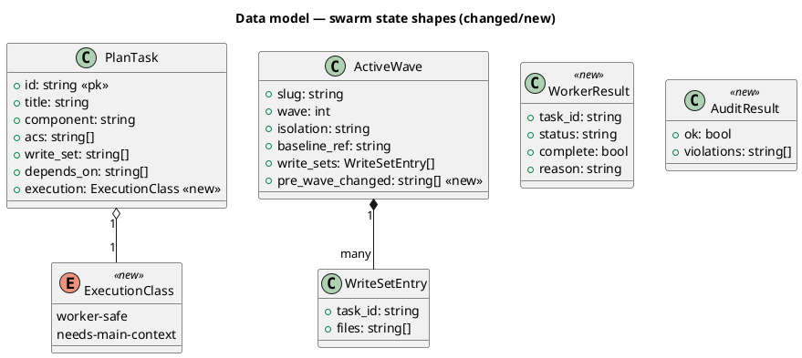
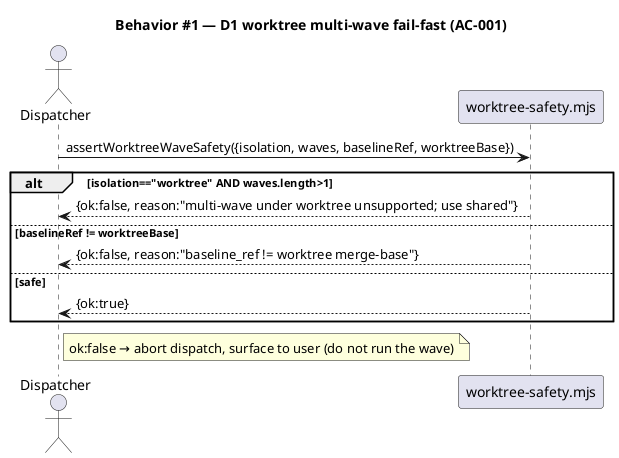
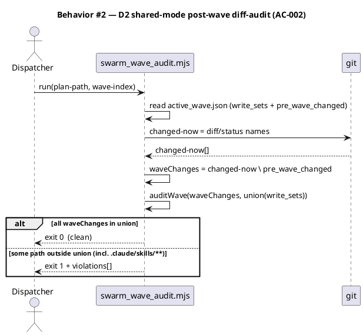
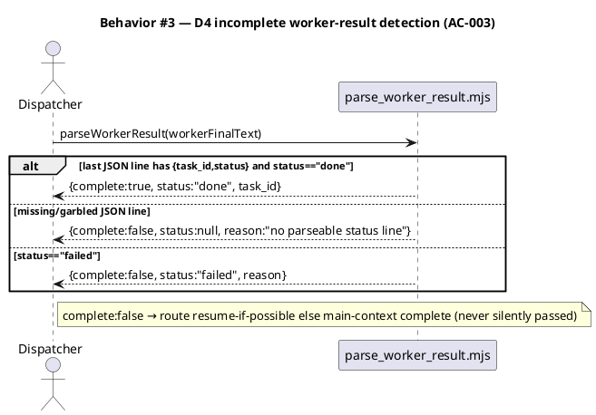
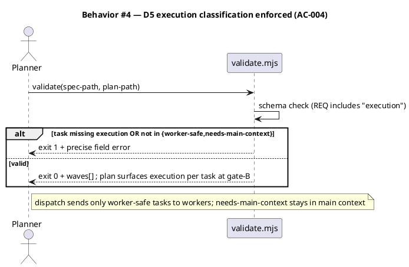
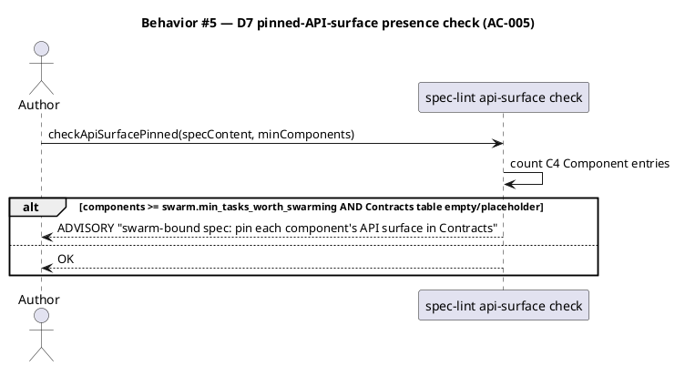
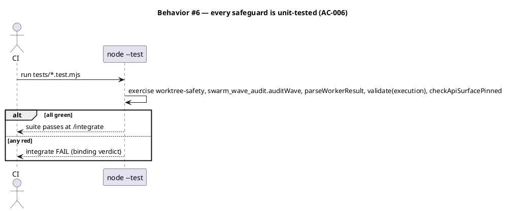
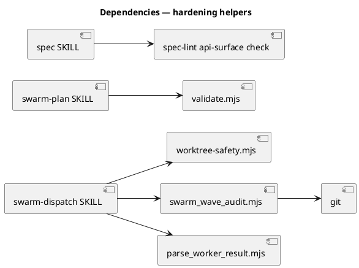

# Spec — swarm-mode first-run hardening (D1, D2, D4, D5, D7)

<!--
Technical spec. Reduced diagram profile (non-architectural write_set):
c4_component, class, sequence, dependency_graph. C4 Context/Container omitted
deliberately (this is internal tooling, no deployable containers).
-->

## Context

| Input | Path |
|---|---|
| Intake | `docs/intake/swarm-first-run-hardening.md` |
| Brief | `docs/brief/swarm-first-run-hardening.md` |
| Scout | `docs/scout/swarm-first-run-hardening.md` |
| Research | `docs/research/swarm-first-run-hardening.md` |

**Write set**: `.claude/skills/swarm-dispatch/**`, `.claude/skills/swarm-plan/**`, `.claude/skills/spec/**`, `.claude/skills/spec-lint/**`, `tests/**`, `obj/template/.claude/manifest.json` — non-architectural → reduced diagram profile.

## Goal

Swarm dispatch and planning carry mechanical, unit-tested safeguards for the five `-e3f2` first-run defects (D1, D2, D4, D5, D7), so a future swarm run does not need ad-hoc main-context rescue.

## Non-goals

- D3 and D6 — already shipped (`swarm-d3d6-hardening`).
- Making multi-wave worktree mode *work* (D1's root cause is an Agent-tool constraint, not baseline-controllable — see Design §D1). This spec documents + guards the boundary, it does not lift it.
- Real-time guard rewrite of `swarm_boundary_guard` (D2 ships a post-wave audit, not a hook change — no Article VIII amendment).
- Live swarm validation as a gating criterion (tracked future run per the intake).
- Touching `.claude/agents/swarm-worker.md` (D4 is dispatch-side only; the worker contract was hardened by D3/D6).

## Design

Diagrams are the contract. Prose only for what a diagram cannot say.

The five fixes are independent and additive. Four land under `.claude/skills/swarm-dispatch/` and `.claude/skills/swarm-plan/`; D7 lands under `.claude/skills/spec/` + `.claude/skills/spec-lint/`. Each new behavior is split into a **pure, exported, unit-tested core** + a thin CLI/SOP wrapper, matching the existing `swarm_merge.mjs` / `validate.mjs` idiom (single-file ESM, `main(process.argv.slice(2))` tail, exit 0/1/2).

### C4 — Component (swarm subsystem after this spec)



### Data model — class diagram



#### Migration DDL

No database. State shapes are JSON files under `.claude/state/swarm/`. The `<<new>>` fields are additive and backward-compatible:

```sql
-- forward  (conceptual — JSON, not SQL)
-- PlanTask.execution: required on new plans; validate.mjs rejects a plan task missing it.
-- ActiveWave.pre_wave_changed: written by swarm-dispatch at wave start; absent → swarm_wave_audit treats baseline as empty (fail-open to "all current changes are this wave's").
-- reverse
-- Drop execution from REQ; drop pre_wave_changed snapshot. No data migration (transient runtime state).
```

### Behavior — sequence per AC













### State — core entity *(only if stateful)*

No non-trivial state machine. The plan/wave files are passive data; transitions (`planned → running → done/failed`) are unchanged by this spec.

### Dependencies — graph



### Contracts

Every new/changed API surface, pinned (D7 applied to this spec itself — complete pre-`/tdd`).

| Kind | Name | Input | Output | Errors | Idempotent |
|---|---|---|---|---|---|
| fn (export) | `worktree-safety.mjs → assertWorktreeWaveSafety({isolation, waves, baselineRef, worktreeBase})` | object | `{ok:boolean, reason:string}` | returns `ok:false` (never throws on policy) | yes |
| fn (export) | `swarm_wave_audit.mjs → auditWave(changedPaths, unionWriteSet)` | `string[]`, `string[]` | `{ok:boolean, violations:string[]}` | — (pure) | yes |
| CLI | `swarm_wave_audit.mjs <plan-path> <wave-index>` | argv | stdout report; exit 0 clean / 1 violation / 2 bad-invocation | exit 2 on missing inputs | yes |
| fn (export) | `parse_worker_result.mjs → parseWorkerResult(text)` | string | `{complete:boolean, status:string\|null, task_id:string\|null, reason:string}` | — (pure; never throws) | yes |
| CLI | `parse_worker_result.mjs <result-file>` | argv | exit 0 complete / 1 incomplete / 2 bad-invocation | exit 2 on missing file | yes |
| fn (changed) | `validate.mjs` `REQ` + `validateSchema` | plan JSON | adds `execution` to required fields; rejects value ∉ `{worker-safe, needs-main-context}` | exit 1 on schema violation | yes |
| fn (export) | `spec-lint → checkApiSurfacePinned(specContent, minComponents)` | string, int | `{ok:boolean, reason:string}` (ADVISORY) | — (pure) | yes |

### Libraries and versions

*(none — git CLI + Node `node:fs`/`node:child_process`/`node:path` stdlib only; no third-party libraries, so no context7 lookups apply.)*

### Alternatives considered

| Alt | Summary | Rejected because |
|---|---|---|
| D1-A2 | Make multi-wave worktree work (commit between waves + merge-base baseline_ref) | Worktree base is Agent-tool-owned (observed forking from a 17-behind ref); committing between waves can't fix what baseline doesn't control, and collides with Art. VII. |
| D2-B2 | Teach `swarm_boundary_guard` to enforce `.claude/` when a write_set claims it | Live-hook behavior change → Art. VIII amendment + higher false-positive risk. Deferred as a possible complement. |
| D4-C2 | Inline regex in the SOP, no helper | Not mechanical / not unit-testable (AC-003/AC-006 require a tested safeguard). |
| D5-D2 | Free-text `note` convention for execution class | Not machine-checkable; gate-B + dispatch can't branch on it. |
| D7-E2 | Guidance-only, no check | AC-005 asks for checkability; advisory check chosen over silent guidance. |

## Design calls

*(none)* — the write_set has no UI files (`tdd.ui_globs` not intersected).

## Acceptance criteria

| ID | Criterion (given / when / then) | Kind | Upstream AC | Sequence |
|---|---|---|---|---|
| AC-001 | given a plan with `waves.length>1` under `isolation:"worktree"` (or `baselineRef≠worktreeBase`), when `assertWorktreeWaveSafety` runs, then it returns `ok:false` with a reason and dispatch aborts; the "worktree = single-wave only" constraint is documented in `swarm-dispatch` SKILL.md | behavior | intake AC-1 | §Behavior #1 |
| AC-002 | given a shared-mode wave whose changes include a path outside the union of its tasks' write_sets (including under `.claude/skills/**`), when `swarm_wave_audit` runs post-wave, then it reports the violation and exits non-zero | behavior | intake AC-2 | §Behavior #2 |
| AC-003 | given a worker final message missing a parseable `{task_id,status}` JSON line, when `parseWorkerResult` runs, then it returns `complete:false` (never silently complete); a `status:"failed"` line also yields `complete:false` | behavior | intake AC-3 | §Behavior #3 |
| AC-004 | given a plan task missing `execution` or with a value outside `{worker-safe, needs-main-context}`, when `validate.mjs` runs, then it fails schema with a precise field error; a valid plan surfaces each task's `execution` for gate-B | behavior | intake AC-4 | §Behavior #4 |
| AC-005 | given a swarm-bound spec (C4 Component count ≥ `swarm.min_tasks_worth_swarming`) with an empty/placeholder Contracts table, when `checkApiSurfacePinned` runs in spec-lint, then it surfaces an ADVISORY to pin each component's API surface | behavior | intake AC-5 | §Behavior #5 |
| AC-006 | given the five safeguards above, when `node --test` runs the suite at `/integrate`, then every safeguard has at least one passing unit test and the suite is green | behavior | intake AC-6 | §Behavior #6 |

## Test plan

| Category | Scenario | Expected | Covers |
|---|---|---|---|
| Golden path | `assertWorktreeWaveSafety` single-wave worktree, matching base | `ok:true` | AC-001 |
| Failure mode | multi-wave under worktree | `ok:false`, reason names multi-wave | AC-001 |
| Failure mode | `baselineRef≠worktreeBase` | `ok:false`, reason names mismatch | AC-001 |
| Golden path | `auditWave` all changes in union | `ok:true`, no violations | AC-002 |
| Contract violation | change under `.claude/skills/x` outside union | `ok:false`, violation lists the path | AC-002 |
| Input boundary | empty changed set | `ok:true` (vacuous) | AC-002 |
| Golden path | `parseWorkerResult` valid trailing `status:"done"` | `complete:true` | AC-003 |
| Contract violation | no JSON line at all | `complete:false`, reason set | AC-003 |
| Input boundary | malformed JSON / prose after the JSON line / `status:"failed"` | `complete:false` | AC-003 |
| Contract violation | `validate.mjs` task missing `execution` | exit 1, names the field | AC-004 |
| Contract violation | `execution:"banana"` | exit 1, names the enum | AC-004 |
| Golden path | `validate.mjs` valid execution values | exit 0, waves assigned | AC-004 |
| Golden path | `checkApiSurfacePinned` swarm-bound + empty Contracts | ADVISORY returned | AC-005 |
| Regression trap | non-swarm spec (components < min) empty Contracts | OK (no false advisory) | AC-005 |
| Regression trap | existing `validate.mjs` plans gain `execution`; wave-assignment output unchanged otherwise | waves identical to pre-change for equivalent input | AC-004 |

## Observability

| Signal | Name | Shape | Purpose |
|---|---|---|---|
| Log (stdout) | `swarm_wave_audit: AUDIT FAIL` | violation paths + union write_set | dispatch surfaces the out-of-union drift |
| Log (stdout) | `parse_worker_result: INCOMPLETE` | task_id + reason | dispatch routes resume / main-context |
| Log (stderr) | `validate: ...` | precise field error | planner fixes the plan |

No metrics/alarms — these are dev-time CLI helpers, not a running service.

## Rollout

### Prerequisites

- *(none)* — these are mechanical helpers that ship with the commit and go live on the next swarm-mode workflow; no feature flag, no migration, no canary. (Defense-in-depth: every new helper is fail-open/fail-safe per its Contracts row, so shipping them inert until first use carries no risk.)

- **Feature flag**: none (YAGNI — no behavior toggles a flag would gate).
- **Migration order**: n/a (additive JSON fields, backward-compatible).
- **Canary**: n/a.

## Rollback

- **Kill-switch**: revert the commit. Each helper is independent; a single bad helper can be reverted file-wise without affecting the others.
- **Signal to roll back**: any of the new unit tests red at `/integrate`, or `audit-baseline` FAIL from the manifest rebuild — caught pre-commit, so a bad rollout never lands.

## Archive plan

- Defaults *(automatic)*: intake, brief, scout, research, spec, spec-rendered/, spec approval, security report.
- Extras *(list any non-default files)*:
  - *(none)*

## Open questions

- *(none — D1's root-cause open question was resolved in research: Agent-tool constraint → document-single-wave-only + fail-fast guard, recorded in Design §D1 and AC-001. The four research open questions all resolved to the recommended option and are reflected in the AC table.)*
