# Spec — Companion channel pool (push-dispatch + auto-join, bounded)

## Context

| Input | Path |
|---|---|
| Intake | `docs/intake/companion-channel-pool.md` |
| Brief | `docs/brief/companion-channel-pool.md` |
| Scout | `docs/scout/companion-channel-pool.md` |
| Research | `docs/research/companion-channel-pool.md` |

**Write set**: `.claude/mcp/sprint-pool/**`, `.claude/skills/companion/**`, `tests/sprint-pool-*.test.mjs` — a new **project-local** channel module plus the companion skill; no baseline-owned file is edited (resolves Open-Q1 below). Touches `.claude/mcp/**`, so the full diagram set is drawn.

## Goal

A pool of human-launched Claude Code peer sessions that auto-register on launch, receive fully-specified work by push and claim it through the existing race-safe handlers, and escalate un-decidable forks to the lead by push — while staying bounded recipe-executors that never decide.

## Non-goals

- Auto-spawning peer sessions — a human/launch script still starts each terminal.
- Expanding peer autonomy — the bounded-executor (yield-everything) contract stays binding.
- Shipping to consumers — this is project-local prototype scaffolding (no `owner: baseline`, excluded from `audit-baseline`/manifest, no `obj/template/` mirror).
- Editing the baseline-owned `sprint-channel` server/handlers — the pool module imports its `lib/*` read-only.
- Cross-machine / networked peers — single machine, shared on-disk channel only.

## Design

Diagrams are the contract.

The design keeps the existing file-locked `sprint-channel` store as the single coordination **truth**, and adds one **project-local channel server** (`sprint-pool`) that each session spawns as an MCP stdio subprocess. That subprocess (a) registers its peer on startup by writing the channel store directly, (b) watches the shared channel dir and **pushes** a `notifications/claude/channel` event into its session when relevant state changes, and (c) exposes two new tools — `enqueue_task` (lead pushes work) and `leave_peer` (deregister). Claiming, signalling done, and yielding still go through the **existing** baseline `sprint-channel` MCP tools — unchanged, race-safe.

### C4 — System context

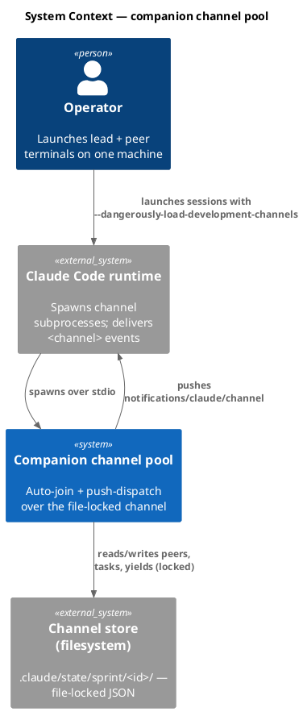

### C4 — Container

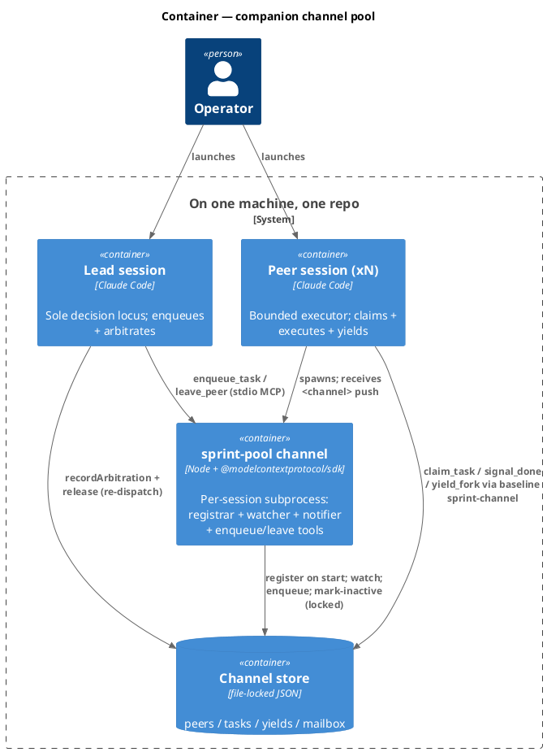

### C4 — Component (sprint-pool channel)

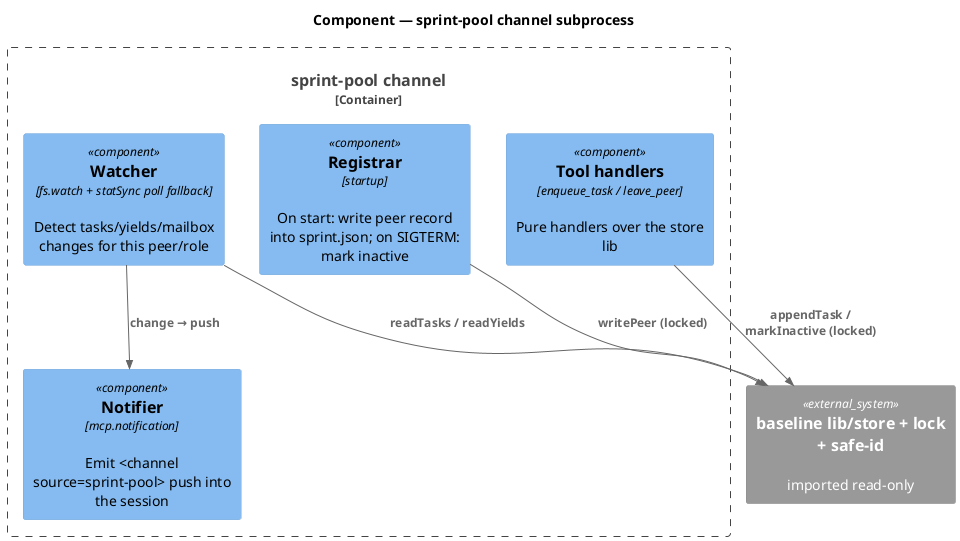

### Data model — class diagram

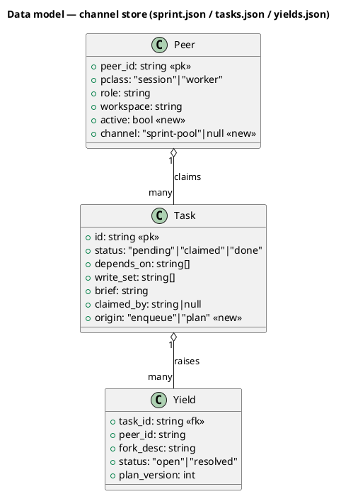

#### Migration DDL

No SQL store. The added fields are JSON keys, additive and back-compatible (absent ⇒ legacy default):

```sql
-- forward (conceptual; applied as JSON-key additions in lib/store helpers)
-- Peer.active   : absent => treated as true  (legacy peers stay active)
-- Peer.channel  : absent => null             (registered by a non-pool path)
-- Task.origin   : absent => "plan"           (pre-enqueue tasks)
-- reverse: drop the three keys; readers already tolerate their absence
```

### Behavior — sequence per AC

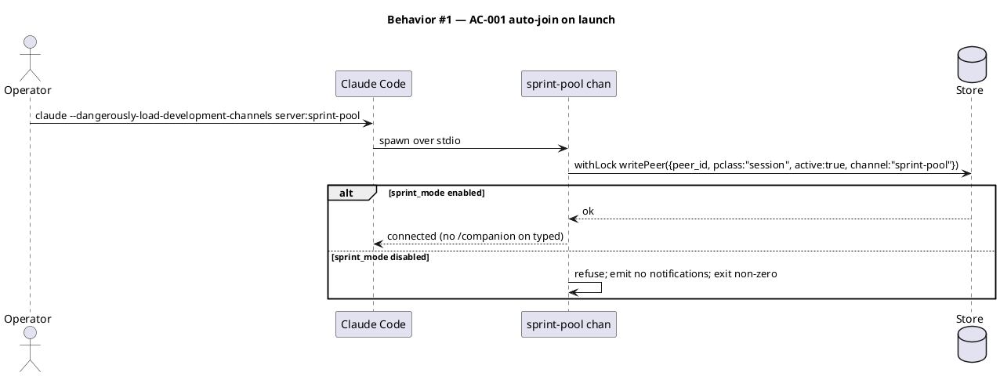

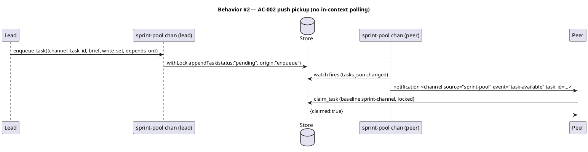

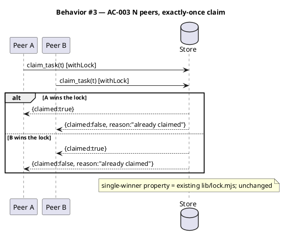

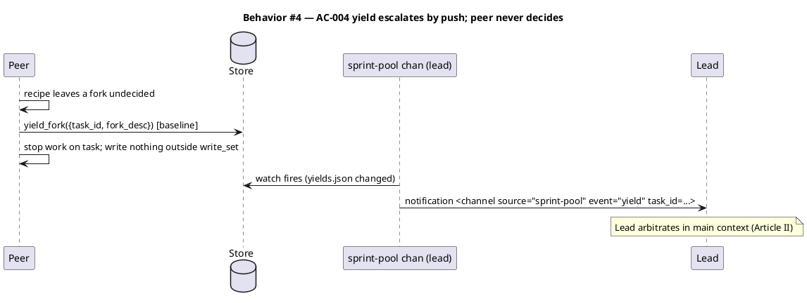

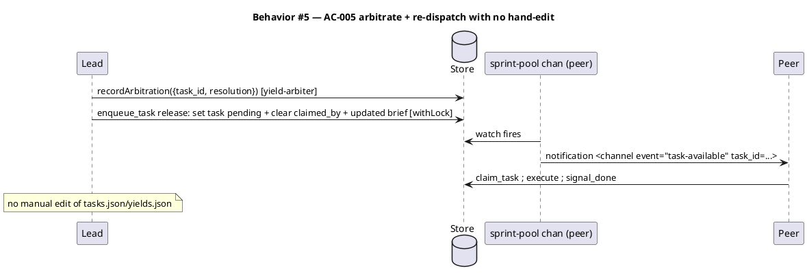

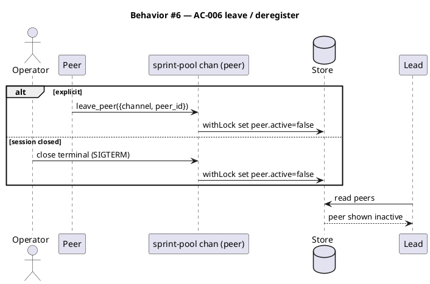

### State — Task lifecycle

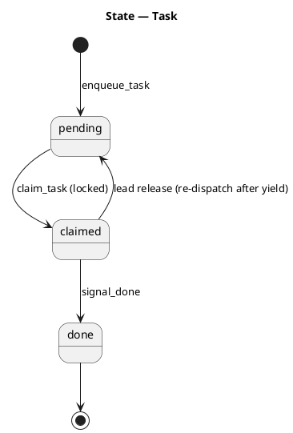

### Dependencies — graph

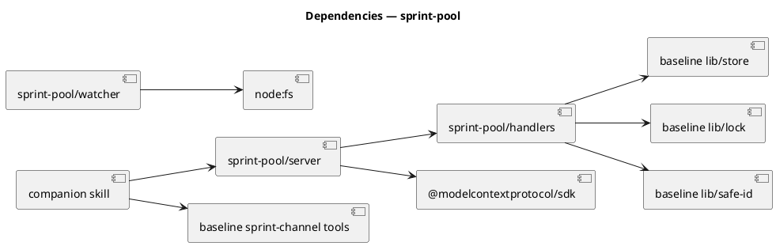

### Contracts

| Kind | Name | Input | Output | Errors | Idempotent |
|---|---|---|---|---|---|
| MCP tool | `enqueue_task` | `{sprint_id, task_id, brief, write_set[], depends_on[]}` | `{enqueued: true, task_id}` | `invalid id`; `duplicate task_id` | yes (dup id ⇒ `{enqueued:false, reason:"duplicate"}`, no second insert) |
| MCP tool | `leave_peer` | `{sprint_id, peer_id}` | `{ok: true, active: false}` | `invalid id`; `unknown peer` | yes (already-inactive ⇒ `{ok:true}`) |
| Notification | `notifications/claude/channel` | `params.content`, `params.meta{event,task_id}` | — (fire-and-forget) | dropped silently if session not listening | consumer (peer) re-claims idempotently |
| Startup write | registrar | peer record | `sprint.json` peer upsert | sprint_mode off ⇒ refuse | yes (re-register is upsert, per baseline `registerPeer`) |

### Libraries and versions

| Library@version | Purpose | Key APIs | Confirmed via context7 |
|---|---|---|---|
| `@modelcontextprotocol/sdk@1.29.0` | channel server + push | `Server`, `experimental['claude/channel']`, `mcp.notification('notifications/claude/channel')`, `StdioServerTransport` | no — confirmed via official channels-reference (context7 lacks the `claude/channel` extension); version pinned from `package.json`/`node_modules` |
| `node:fs@>=18.17` | watch + locked writes | `watch`, `statSync`, reused `lib/lock.mjs` | n/a (stdlib) |

### Alternatives considered

| Alt | Summary | Rejected because |
|---|---|---|
| B | localhost HTTP port per peer (channels-reference webhook pattern) | needs peer→port discovery/registry + N bound ports; the shared dir already provides addressing (YAGNI) |
| C | auto-join + faster in-context polling, no channel | fails AC-002 (push); the in-context poll loop is the scale problem |

## Design calls

*(none)* — the write_set does not intersect `tdd.ui_globs`; no UI surface.

## Acceptance criteria

| ID | Criterion (given / when / then) | Kind | Upstream AC | Sequence |
|---|---|---|---|---|
| AC-001 | given a peer launched with the pool channel, when the subprocess starts and sprint_mode is on, then a `session` peer record is written with no `/companion on` typed | behavior | intake AC-1 | §Behavior #1 |
| AC-002 | given an idle pooled peer, when the lead `enqueue_task`s a unit of work, then the peer receives a `task-available` push (not by polling) and claims it via the baseline `claim_task` | behavior | intake AC-2 | §Behavior #2 |
| AC-003 | given N peers and a pending task, when two race to claim, then exactly one wins and the other gets `{claimed:false}` | behavior | intake AC-3 | §Behavior #3 |
| AC-004 | given a peer at an un-decidable fork, when it `yield_fork`s, then the lead receives a `yield` push and the peer writes nothing outside its `write_set` | behavior | intake AC-4 | §Behavior #4 |
| AC-005 | given a yielded fork, when the lead `recordArbitration`s and releases the task with an updated brief, then the peer is re-pushed and executes — with no manual edit of `tasks.json`/`yields.json` | behavior | intake AC-5 | §Behavior #5 |
| AC-006 | given a peer leaves (explicit `leave_peer` or session close), when the lead reads peers, then that peer is `active:false` | behavior | intake AC-6 | §Behavior #6 |
| AC-007 | given sprint_mode disabled, when a peer pool-channel starts, then it refuses to register and emits zero notifications | preflight | intake constraint | §Behavior #1 |

## Test plan

| Category | Scenario | Expected | Covers |
|---|---|---|---|
| Golden path | `enqueue_task` then watcher detects change | task pending + `task-available` push emitted | AC-002 |
| Golden path | registrar startup with sprint_mode on | peer record `active:true, channel:"sprint-pool"` | AC-001 |
| Input boundary | `enqueue_task` with `../evil` id / empty id | rejected via `isSafeId`, no write | AC-002 |
| Contract violation | `enqueue_task` duplicate `task_id` | `{enqueued:false, reason:"duplicate"}`, single task | AC-002 |
| Concurrency / ordering | two `claim_task` on the released task | exactly one `{claimed:true}` | AC-003, AC-005 |
| Failure mode | sprint_mode disabled at startup | registrar refuses; notifier silent | AC-007 |
| Failure mode | `leave_peer` on already-inactive / unknown peer | `{ok:true}` / `{ok:false, error}` no crash | AC-006 |
| Regression trap | baseline `claim_task`/`signal_done`/`yield_fork` behavior | unchanged (13 existing tests stay green) | — |

## Observability

| Signal | Name | Shape | Purpose |
|---|---|---|---|
| Log | `sprint-pool.register` | fields: `peer_id, sprint_id, sprint_mode` | confirm auto-join |
| Log | `sprint-pool.push` | fields: `event, task_id, peer_id` | trace push dispatch/escalation |
| Log | `sprint-pool.refuse` | fields: `reason` | sprint_mode-off / invalid-id refusals |

## Rollout

### Prerequisites

| # | Prerequisite | enforced-by |
|---|---|---|
| 1 | `velocity.sprint_mode.enabled` is true before any pool channel registers or pushes | AC-007 |

- **Feature flag**: `velocity.sprint_mode.enabled` — already the master gate; pool channel is inert when off.
- **Launch**: peers/lead start with `claude --dangerously-load-development-channels server:sprint-pool` (custom channel, not on Anthropic allowlist).
- **Migration order**: additive JSON keys only; no backfill.

## Rollback

- **Kill-switch**: set `velocity.sprint_mode.enabled` false (channel registrar refuses, notifier silent) and/or restart sessions without `--dangerously-load-development-channels`.
- **Signal to roll back**: any `sprint-pool.push` emitting events while `sprint_mode` is off, or a peer writing outside `write_set` (bounded-contract breach) — either trips immediate kill within one session restart.

## Archive plan

- Defaults *(automatic)*: intake, brief, scout, research, spec, spec-rendered/, spec approval.
- Extras *(list any non-default files)*:
  - *(none)*

## Open questions

- **OQ-1 (resolved in this draft, confirm):** pool channel + `enqueue_task`/`leave_peer` live in a **new project-local `.claude/mcp/sprint-pool/`** module importing baseline `lib/*` read-only — no edit to baseline-owned `sprint-channel` files, no `obj/template/` mirror. Confirm this boundary holds.
- **OQ-2 (security decision — needs you):** peers run **attended** (normal permission prompts apply; permission relay deferred), NOT `--dangerously-skip-permissions`. Confirm, or decide whether unattended peers + permission relay are in scope — this is the main trust-surface call for `/security`.
- **OQ-3:** auto-join writes the peer record **directly from the channel subprocess on startup** (zero command) vs. the peer session calling `register_peer` as its first turn. Draft picks direct-write; confirm.
- **OQ-4:** pool uses a fixed `lobby` channel id by default (sprint work may still use its own id). Confirm `lobby` as the standing pool, or name it.
- **OQ-5:** `fs.watch` reliability — accept the `statSync` poll fallback inside the subprocess (model never polls), or require a specific watch strategy?
