# Org-team charter — multi-session coordinated workflows (new Article X)

## Context

| Input | Path |
|---|---|
| Intake | *(spec-entry track — none)* |
| BRD *(if any)* | *(none)* |
| Scout *(if any)* | *(none)* |
| Research *(if any)* | *(none)* |
| Brainstorm brief | `docs/brief/org-team-charter.md` |
| Codesign state | `.claude/state/codesign/org-team-charter.json` |

**Write set**: `.claude/skills/org-dispatch/**`, `.claude/skills/sprint-dispatch/**`, `.claude/mcp/sprint-pool/**`, `.claude/mcp/sprint-broker/**`, `.claude/workflows.jsonl`, `docs/init/seed.md`, `CLAUDE.md`, `src/seed.template.md`, `src/CLAUDE.template.md`, `.claude/CONSTITUTION.md`, `.claude/hooks/lib/derive-counts.mjs`, `tests/**` — touches `.claude/mcp/**` (outside the non-architectural profile), so the full C4 diagram set applies.

This spec graduates the sprint-mode prototype (`mvp-sprint-parallel-cycles` Slice C) into a permanent, constitutionally-sanctioned **org-team** model and **supersedes that epic's bounded Slice E** (which reserved a §II.B charter "NOT a §4.2 rewrite"). Per the canonical engineer decision (D4), this is **not** a §II.B / Article II change at all — it is a new, additive constitutional article on a different axis.

## Goal

The baseline gains a selectable **`org`** workflow track in which a flat pod of up to four peer Claude Code sessions coordinates over the MCP broker to implement an approved spec — each peer making its own in-lane implementation decisions in its own (Article-II-governed) main context, escalating only un-decidable or cross-lane forks peer→lead→human — governed by a new additive **Article X "Multi-session coordinated workflows,"** with `org-dispatch` superseding the retired `sprint-dispatch` prototype.

## Non-goals

- **Article II is not amended.** Intra-session delegation rules (decisions in a session's main context, never its subagents) are byte-unchanged. Multi-session coordination is a distinct axis (D4).
- **§II.A maker/checker charter is not reopened.**
- **Subagent count stays 1.** Peers are full sessions, not subagents; `swarm-worker` remains the only declared subagent. Each peer session may itself run its own subagents — that is a per-session property, orthogonal to this charter.
- **The default 11-phase solo/swarm pipeline is unchanged.** `org` is an added selectable track only (D6, hard constraint).
- **Consent gates + human-as-final-authority are not weakened.** No peer or lead path may bypass or self-satisfy a gate (hard constraint).
- **Out of scope:** the worktree-merge mechanics of `mvp-sprint-parallel-cycles` Slice D; cross-machine peer authentication / multi-host coordination (single-machine lead-spawned trust model retained).

## Decisions

### Decision: Lead topology

**Options considered:** Lead is one of the four peers / Dedicated 5th orchestrator
**Chosen:** Lead is one of the four peers — flat for claiming work; one peer additionally wears the lead hat (arbitration + human-escalation relay).

### Decision: Disposition of the sprint-dispatch prototype

**Options considered:** Graduate sprint-dispatch → org-dispatch and retire sprint mode / Keep both sprint-dispatch and org-dispatch
**Chosen:** Graduate sprint-dispatch into org-dispatch; retire the sprint-mode prototype (it was always the throwaway sandbox that gated this charter).

### Decision: Peer→lead→human escalation transport

**Options considered:** Build a dedicated free-form broker message op / Reuse the task-bound yield_fork for all escalations
**Chosen:** Build a dedicated free-form peer→lead→human message op on the broker (folds in backlog sprint-broker-free-form-peer-lead-query-channel); yield_fork stays task-bound for un-decidable forks.

### Decision: Constitutional axis and peer model (canonical engineer override)

**Options considered:** Generalize Article II so decisions may live in any peer / Add a new peer subagent type (count 1→2) / Leave Article II untouched; add a new dedicated Article for multi-session coordinated workflows
**Chosen:** Leave Article II untouched. Each peer is a full Claude Code session (a complete baseline instance with its own subagents/parallel agents). Subagent count stays 1 and is a per-session property, orthogonal to this charter. Multi-session coordination is a distinct axis governed by a NEW dedicated Article.
**Engineer rationale (verbatim):**
> each peer is a claude-code session with all capabilities of running a sub-agents, parallel agents, and what-not with added advantage of connected via mcp for coordination, cross communication, and lead escalation. Subagent count = 1 sits orthogonal; ideally Art 2 doesn't even apply here. We may carve this out and maybe define a new Art 3 for multi session coordinated workflows

### Decision: New article placement and numbering

**Options considered:** New high article + pointer from II (no renumber) / Insert as Article III, renumber III–XI / New core article between IX and X
**Chosen:** New core Article X "Multi-session coordinated workflows" inserted between current IX and X; renumber current X (project-specific rules) → XI and current XI (skill provenance) → XII, updating every cross-reference, both seed/CLAUDE mirrors, the annex, and audit checks.

### Decision: Default workflow preservation (hard constraint)

**Options considered:** org is an added selectable track only / reshape the default 11-phase pipeline
**Chosen:** org is an added selectable track only; the default 11-phase solo/swarm pipeline is unchanged. Locked as a hard constraint. Consent gates + human-as-final-authority remain structural and un-forgeable.

## Design

Diagrams are the contract. Prose is only for what a diagram cannot say.

### C4 — System context

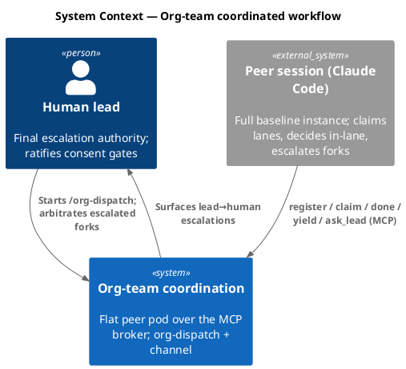

### C4 — Container

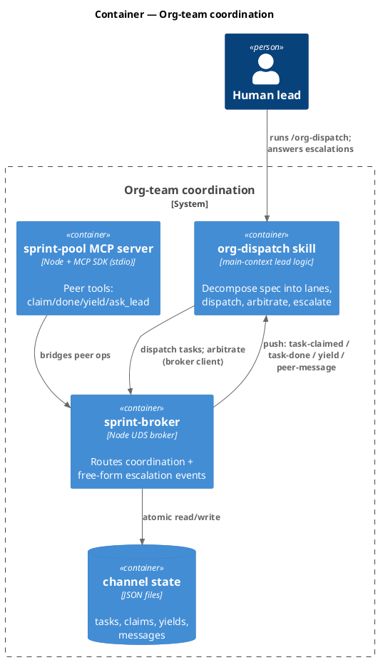

### C4 — Component (changed containers — broker + pool)

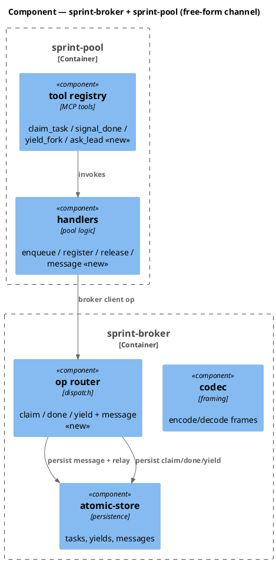

### Data model — class diagram

Channel state is JSON files (no RDBMS). New/changed fields marked `<<new>>` / `<<changed>>`.

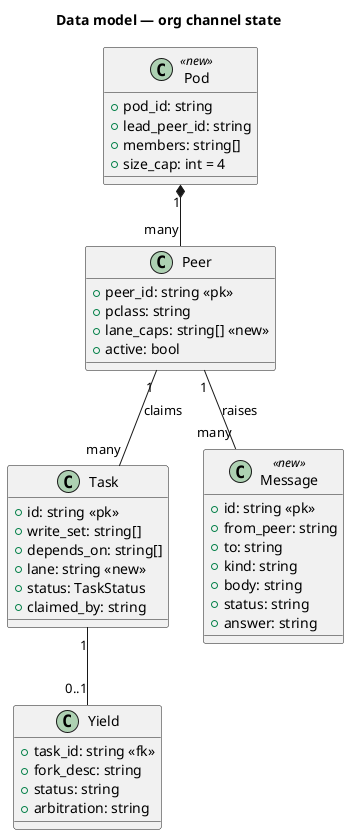

#### Migration (state-shape, additive — no RDBMS)

```sql
-- forward (JSON state additions; expressed as pseudo-DDL to mirror the class diagram)
-- tasks.json:     ADD field  lane        string  DEFAULT ''
-- peers.json:     ADD field  lane_caps   string[] DEFAULT []
-- NEW file:       messages.json  [{ id, from_peer, to, kind, body, status, answer }]
-- NEW file:       pod.json       { pod_id, lead_peer_id, members[], size_cap=4 }
-- reverse: drop lane / lane_caps; delete messages.json + pod.json (sprint state stays back-compatible)
```

### Behavior — sequence per AC

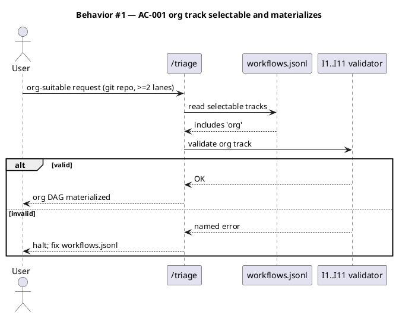

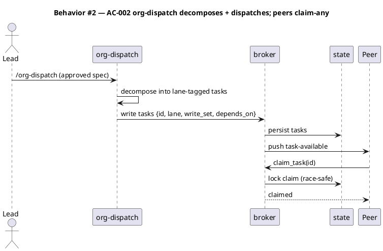

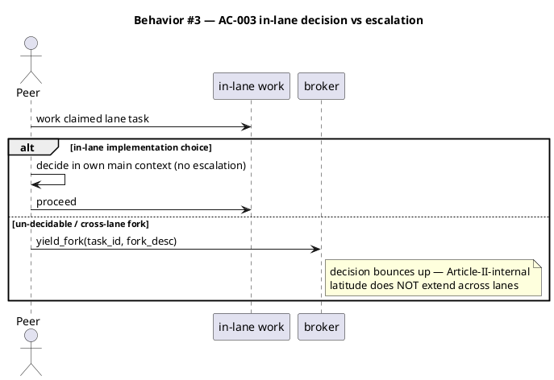

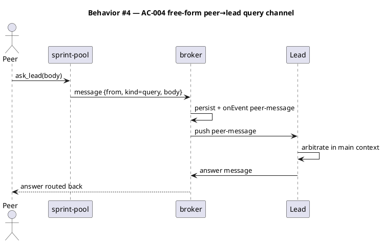

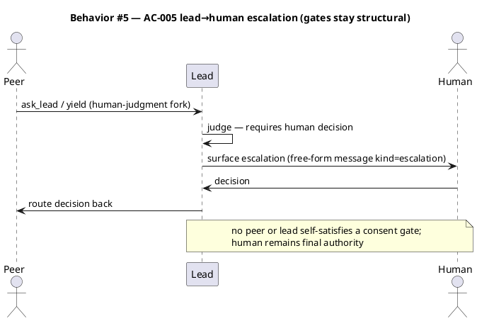

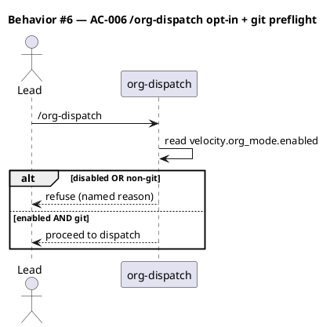

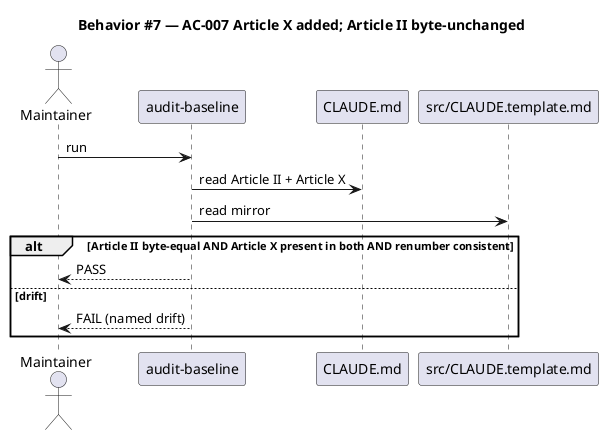

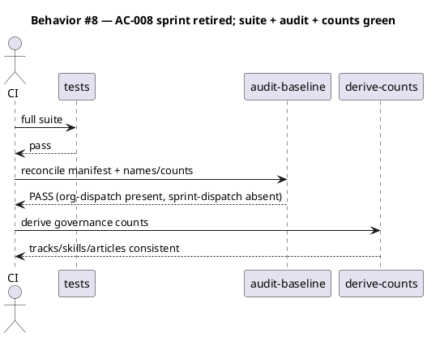

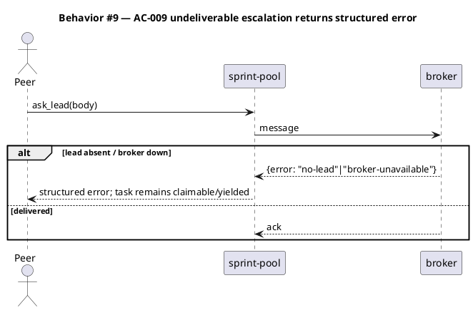

### State — task + message lifecycle

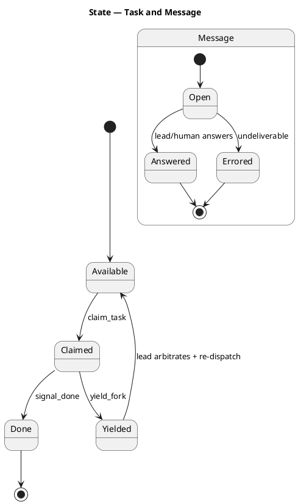

### Dependencies — graph

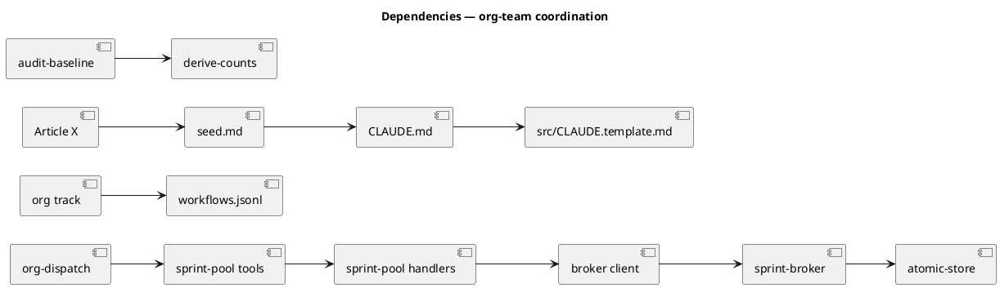

### Contracts

New/changed surfaces pinned (peers decompose from these).

| Kind | Name | Input | Output | Errors | Idempotent |
|---|---|---|---|---|---|
| MCP tool | `ask_lead` *(new, sprint-pool)* | `{ body: string, kind?: "query"\|"escalation" }` | `{ message_id }` | `no-lead`, `broker-unavailable` | no |
| Broker op | `message` *(new, sprint-broker)* | `{ from_peer, to, kind, body }` | `{ ok, message_id }` / `{ error }` | `no-lead`, `broker-unavailable` | no |
| Broker event | `peer-message` *(new, onEvent push)* | `{ from_peer, kind, body, message_id }` | — | — | lead de-dupes by `message_id` |
| Broker op | `answer` *(new)* | `{ message_id, answer }` | `{ ok }` | `unknown-message` | yes (last write wins) |
| Skill | `/org-dispatch` *(new; graduates sprint-dispatch)* | approved spec slug | dispatched lanes | refuses when `org_mode` off or non-git | — |
| Track | `org` *(new, workflows.jsonl)* | triage classification | materialized org DAG | I1..I11 violation halts | — |
| Config | `velocity.org_mode.enabled` *(new, project.json)* | bool, default `false` | gates `/org-dispatch` | — | — |

### Libraries and versions

| Library@version | Purpose | Key APIs | Confirmed via context7 |
|---|---|---|---|
| `@modelcontextprotocol/sdk@1.29.0` | sprint-pool MCP server (host the new `ask_lead` tool) | `Server`, `setRequestHandler(ListToolsRequestSchema, CallToolRequestSchema)`, `StdioServerTransport` (low-level API, matching the existing pool server) | yes |
| Node `node:net` (stdlib) | UDS broker transport (unchanged) | `createServer`, `connect` | n/a (stdlib) |

### Alternatives considered

| Alt | Summary | Rejected because |
|---|---|---|
| A | Generalize Article II to "decisions in any peer" | Weakens Article II's anti-subagent-judgment spine; wrong axis (D4) |
| B | Add a peer subagent type (count 1→2) | Reopens the exact thing Article II forbids; peers are sessions (D4) |
| C | Keep sprint-dispatch beside org-dispatch | Two near-identical parallel-execution paths; drift risk (D2) |
| D | Reuse yield_fork for all escalations | Couples free-form queries to a task; surfaced as awkward in dogfood (D3) |

## Design calls

This spec's write_set has no UI surface (no intersection with `tdd.ui_globs`).

- *(none)*

## Acceptance criteria

| ID | Criterion (given / when / then) | Kind | Upstream AC | Sequence |
|---|---|---|---|---|
| AC-001 | given a git repo with ≥2 independent lanes, when `/triage` classifies an org-suitable request, then `org` is a selectable candidate and materializes a valid (I1–I11) DAG | behavior | brief desired_state | §Behavior #1 |
| AC-002 | given an approved spec + org mode on, when the lead runs `/org-dispatch`, then it decomposes into lane-tagged tasks, writes channel state, and peers claim-any unblocked task race-safely | behavior | brief desired_state | §Behavior #2 |
| AC-003 | given a peer on a claimed lane task, when it meets an in-lane implementation choice it decides without escalating; when it meets an un-decidable/cross-lane fork it escalates instead of deciding | behavior | brief desired_state | §Behavior #3 |
| AC-004 | given a peer with a free-form question, when it calls `ask_lead`, then the broker persists + pushes `peer-message` to the lead, who arbitrates in main context and routes an answer back | behavior | D3 | §Behavior #4 |
| AC-005 | given a fork the lead judges to need human judgment, when it escalates, then the human decides and the decision routes lead→peer; no peer/lead self-satisfies a consent gate | behavior | brief non_goal (gates structural) | §Behavior #5 |
| AC-006 | given org mode disabled OR a non-git tree, when `/org-dispatch` runs, then it refuses with a named reason | preflight | D6 | §Behavior #6 |
| AC-007 | given the new Article X, when `audit-baseline` runs, then Article II is byte-unchanged, Article X is present in CLAUDE.md and its byte-equal `src` mirror, and old X→XI / XI→XII renumbering + cross-references resolve | behavior | D4, D5 | §Behavior #7 |
| AC-008 | given sprint-dispatch retired, when the full suite + audit + count-derivation run, then all pass with `org-dispatch` present and no dangling `sprint-dispatch` references | smoke | D2 | §Behavior #8 |
| AC-009 | given the lead absent or broker down, when a peer calls `ask_lead`, then it returns a structured error and the task remains claimable/yielded (no silent loss) | error-mapping | D3 | §Behavior #9 |

## Test plan

| Category | Scenario | Expected | Covers |
|---|---|---|---|
| Golden path | org-dispatch decomposes a 2-lane spec; two peers claim-any and signal_done | both lanes complete; dependents unblock | AC-002 |
| Golden path | peer calls `ask_lead`; lead receives `peer-message`, answers; peer reads answer | round-trip query resolved off-task | AC-004 |
| Golden path | lead escalates a human-judgment fork; human decision routes back to peer | escalation chain peer→lead→human→peer | AC-005 |
| Input boundary | 5th peer attempts to join a pod at size_cap=4 | rejected; pod stays ≤4 | AC-002 |
| Contract violation | `/org-dispatch` with `org_mode` off / on a non-git tree | refused with named reason | AC-006 |
| Concurrency / ordering | two peers race to claim the same task | exactly one wins; lock atomic | AC-002 |
| Failure mode | `ask_lead` when lead absent / broker down | structured error; task not lost | AC-009 |
| Governance | workflows.jsonl validates I1–I11 with `org` added | all tracks valid; org materializes | AC-001 |
| Governance | audit-baseline after edits | Article II byte-unchanged; Article X in both mirrors; counts consistent; no sprint-dispatch refs | AC-007, AC-008 |
| Regression trap | Article II text + §II.A charter | byte-unchanged | AC-007 |
| Regression trap | default solo/swarm 11-phase track | unchanged behavior | AC-007 |

## Observability

| Signal | Name | Shape | Purpose |
|---|---|---|---|
| Log | `org.dispatch.start` | fields: `slug, pod_size, lanes` | audit a run |
| Log | `org.peer.message` | fields: `from_peer, kind, message_id` | trace escalations |
| Log | `org.escalation.human` | fields: `message_id, fork_desc` | human-decision audit trail |
| Metric | `org.task.claimed` | counter, labels: `lane, peer` | throughput |
| Metric | `org.message.errored` | counter, labels: `reason` | undeliverable-escalation rate |

## Rollout

### Prerequisites

| # | Prerequisite | enforced-by |
|---|---|---|
| 1 | `velocity.org_mode.enabled` defaults off; `/org-dispatch` refuses when disabled or on a non-git tree | AC-006 |
| 2 | Full test suite + `audit-baseline` + count-derivation green (org-dispatch present, sprint-dispatch absent) before org mode is enabled anywhere | AC-008 |
| 3 | Undeliverable escalation returns a structured error and never loses a task | AC-009 |

- **Feature flag**: `velocity.org_mode.enabled` — default off (opt-in, mirrors `sprint_mode`).
- **Migration order**: 1 add Article X + renumber + mirrors → 2 add `org` track + counts → 3 build `org-dispatch` + escalation channel → 4 retire `sprint-dispatch` → 5 dogfood behind the flag.
- **Canary**: enable for a single 2-lane dogfood run; success signal = escalation chain completes + `audit-baseline` PASS.

## Rollback

- **Kill-switch**: `velocity.org_mode.enabled = false` — `/org-dispatch` refuses; default tracks unaffected.
- **Signal to roll back**: `org.message.errored` rate > 0 on undeliverable escalations that lose tasks, or any `audit-baseline` FAIL — trips within one dogfood run (< 5 min).

## Archive plan

- Defaults *(automatic)*: spec, brief, codesign state, spec-rendered/, spec approval, security report.
- Extras *(non-default files)*:
  - *(none)*

## Open questions

- *(none — the load-bearing forks were resolved in `## Decisions` D1–D6; exact governance count deltas (tracks 9→10, skill sprint-dispatch→org-dispatch, article XI→XII) are mechanical and verified by AC-007/AC-008 at integrate.)*
