# Spec — sprint-pool broker transport (event-driven coordination over a Unix-domain socket)

## Context

| Input    | Path                                            |
| -------- | ----------------------------------------------- |
| Brief    | `docs/brief/sprint-pool-broker-transport.md`    |
| Intake   | `docs/intake/sprint-pool-broker-transport.md`   |
| Scout    | `docs/scout/sprint-pool-broker-transport.md`    |
| Research | `docs/research/sprint-pool-broker-transport.md` |

**Write set**: `.claude/mcp/sprint-broker/*.mjs` (new), `.claude/mcp/sprint-pool/server.mjs`, `.claude/mcp/sprint-pool/handlers.mjs`, `.claude/mcp/sprint-pool/watcher.mjs` (deleted), `.claude/skills/companion/launch.sh`, `tests/sprint-broker.test.mjs`, `tests/sprint-pool-*.test.mjs`

**Frozen — reused READ-ONLY, never edited** (baseline-owned, in `obj/template/.claude/manifest.json`): `.claude/mcp/sprint-channel/handlers.mjs` (`registerPeer`, `claimTask`, `signalDone`, `yieldFork`), `.claude/mcp/sprint-channel/lib/store.mjs`, `.claude/mcp/sprint-channel/lib/safe-id.mjs`. The broker _imports_ these and calls them against its own single `channelRoot`.

## Goal

Sprint-mode coordination works across separate repo clones on one machine via an in-process broker that pushes events over a Unix-domain socket, replacing the per-session shared-file poll-watch loop.

## Non-goals

- Cross-machine / network (TCP) transport — UDS is single-machine; TCP is the documented later successor.
- Peer authentication beyond filesystem socket permissions.
- Editing any baseline-owned `sprint-channel` file.
- The `fs.watch`-vs-poll micro-optimization — the entire watch loop is removed, not tuned.
- New runtime dependencies — `node:net`/`node:fs`/`node:os` stdlib only.

## Decisions

### Decision: Wire-contract freeze (swarm-ability)

**Options considered:** Pin schema now (enables parallel wave) / Let it emerge in implementation
**Chosen:** Let the wire schema emerge during implementation (NOT pinned up front)
**Engineer rationale (verbatim):**

> Let it emerge in implementation.

**Dismissed alternatives:**

- Pin schema now — Engineer chose emergence over up-front freeze; **accepts that Phase 6 routes solo** (the component graph is a chain without a frozen wire contract). The Contracts table below pins component _function_ signatures but deliberately leaves the broker↔client _message_ schema as an implementation-emergent shape.

### Decision: Durability for crash-restart recovery (AC-3)

**Options considered:** write-temp-then-rename / plain writeFileSync
**Chosen:** write-temp-then-rename atomic wrapper at the broker layer (project-local `atomic-store.mjs`, no baseline edit)

### Decision: Socket rendezvous default (AC-6)

**Options considered:** Documented fallback default / Require \$SPRINT_BROKER_SOCK always
**Chosen:** Documented fallback: `${XDG_RUNTIME_DIR:-${TMPDIR:-/tmp}}/sprint-broker-<channel>.sock` when `$SPRINT_BROKER_SOCK` is unset (override still honored).

## Design

Diagrams are the contract. Prose only for what a diagram cannot say.

The lead's pool MCP server hosts the **broker** in-process: it binds a UDS, owns coordination state (tasks/yields/peers) as the **sole writer**, and persists through the reused baseline `store.mjs` wrapped by an atomic `write-temp-then-rename`. Peer pool servers run a **client adapter**: they connect to the broker socket, forward tool calls (`register`/`claim`/`signal_done`/`yield`), and on a pushed event emit `notifications/claude/channel` into their own Claude session. The **codec** frames messages as NDJSON over the stream. **Lifecycle/discovery** resolves the socket path, unlinks a stale socket before listen, detects disconnect, and supports reconnect. The 750ms watch loop and the monotonic `seen` dedup are deleted — delivery is event-native, so the re-notify-suppression bug class cannot occur.

### C4 — System context

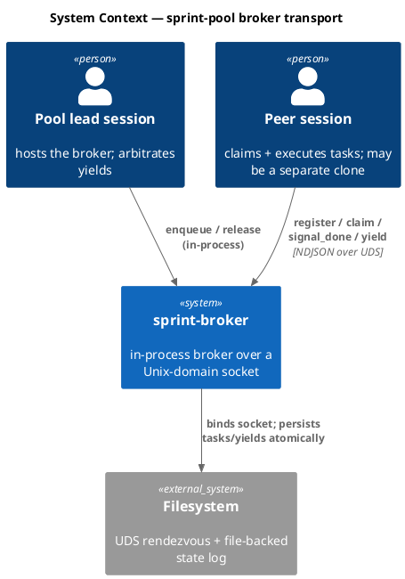

### C4 — Container

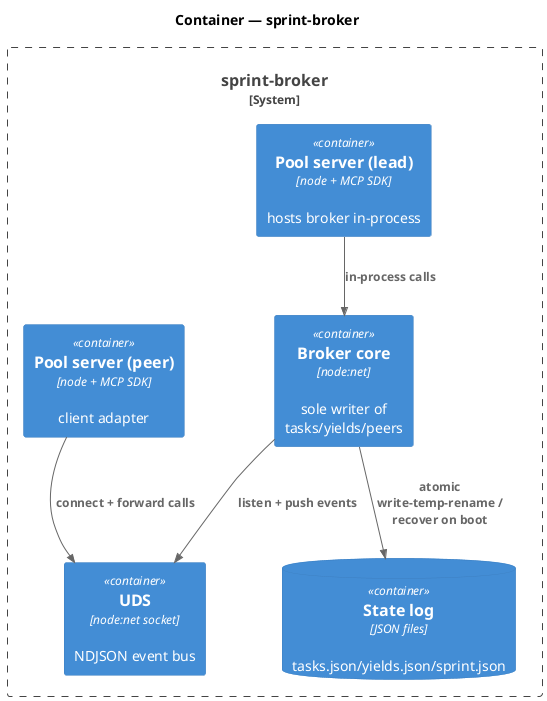

### C4 — Component (changed containers only)

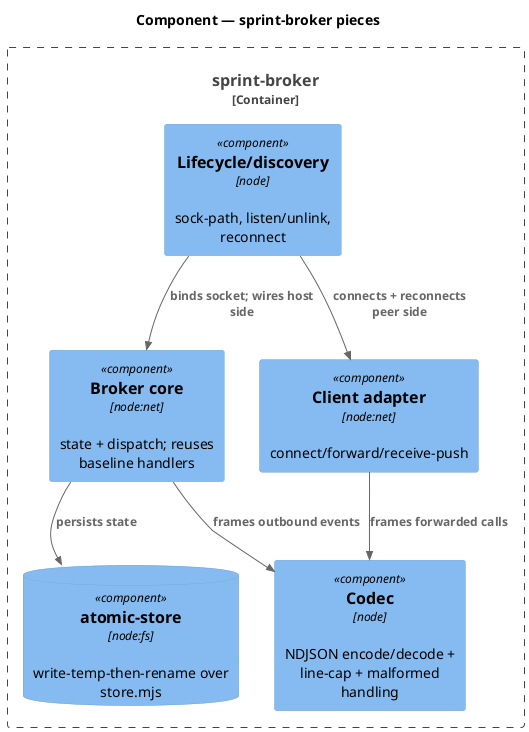

### Data model — class diagram

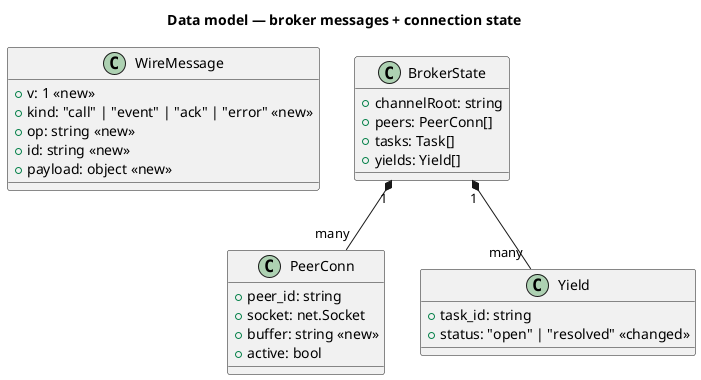

#### Migration DDL

_(none — coordination state is JSON files, not a relational schema. `WireMessage` and `PeerConn.buffer` are new in-memory/on-wire shapes, not persisted columns. `Yield.status` `<<changed>>` is a value-domain change only: the broker now writes the previously-unused `"resolved"` value on release.)_

### Behavior — sequence per AC

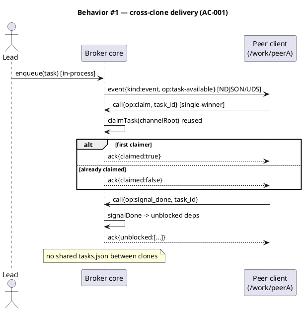

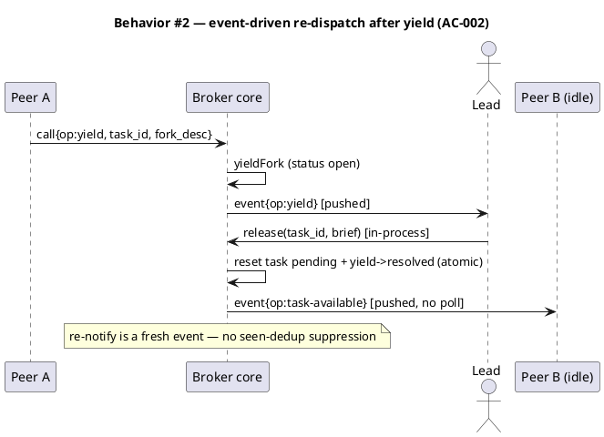

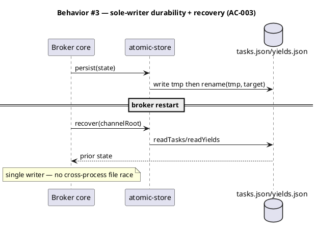

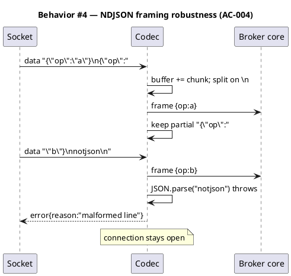

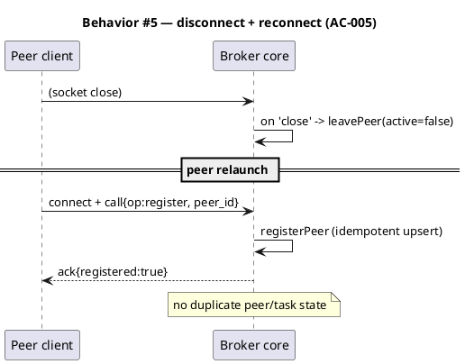

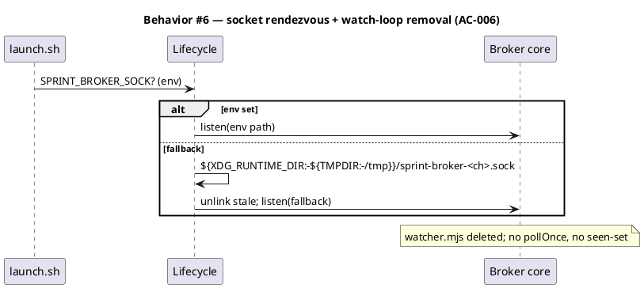

### State — peer connection

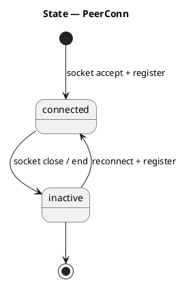

### Dependencies — graph

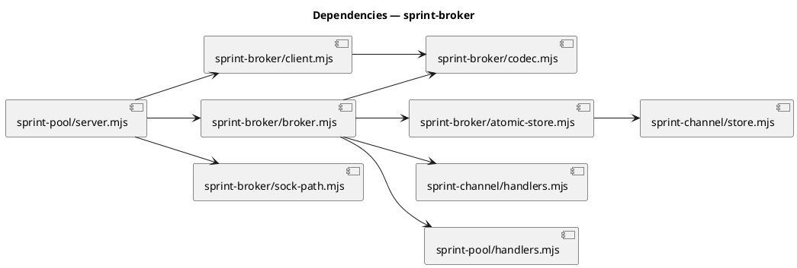

### Contracts

Component function signatures are pinned. The broker↔client **message** schema is intentionally **not** frozen here (Decision 1 — emergent in implementation); the `WireMessage` class above is the indicative shape, refined during `/tdd`.

| Kind | Name                                                     | Input                | Output                       | Errors                                    | Idempotent                     |
| ---- | -------------------------------------------------------- | -------------------- | ---------------------------- | ----------------------------------------- | ------------------------------ |
| fn   | `encodeFrame(msg)`                                       | object               | string `JSON+"\n"`           | throws on circular                        | yes                            |
| fn   | `createDecoder({onFrame, onError, maxLineLen})`          | callbacks + cap      | `{push(chunk)}` accumulator  | rejects line > cap; `onError` on bad JSON | yes (stable buffer)            |
| fn   | `resolveSockPath({env, channel})`                        | env map, channel id  | absolute socket path         | throws if computed path > 100 bytes       | yes                            |
| fn   | `atomicPersist(channelRoot, {tasks?, yields?, sprint?})` | channelRoot + slices | void                         | fs errors propagate                       | yes (rename is atomic)         |
| fn   | `createBroker({channelRoot, sockPath})`                  | paths                | `{listen(), close(), state}` | EADDRINUSE → unlink+retry once            | listen idempotent after unlink |
| fn   | `createClient({sockPath, onEvent})`                      | path + push cb       | `{call(op,args), close()}`   | ECONNREFUSED → surfaced "broker down"     | reconnect re-attaches          |

### Libraries and versions

| Library@version                | Purpose                          | Key APIs                                                                                                                    | Confirmed via context7             |
| ------------------------------ | -------------------------------- | --------------------------------------------------------------------------------------------------------------------------- | ---------------------------------- |
| `node:net` (stdlib, Node ≥18)  | UDS server/client                | `createServer`, `server.listen(path)`, `createConnection({path})`, `Socket` `data`/`end`/`close`/`error`, `write()`+`drain` | n/a — Node stdlib, not third-party |
| `node:fs` / `node:os` (stdlib) | atomic persist + tmp/runtime dir | `writeFileSync`, `renameSync`, `unlinkSync`, `os.tmpdir`                                                                    | n/a                                |

### Alternatives considered

| Alt                      | Summary                     | Rejected because                                                                                                      |
| ------------------------ | --------------------------- | --------------------------------------------------------------------------------------------------------------------- |
| TCP on localhost         | `net` over `127.0.0.1:port` | Needs port discovery + has no filesystem-perm gate; only justified by cross-machine (non-goal). Documented successor. |
| `child_process` IPC      | `fork`+`process.send`       | Structurally impossible — lead and peers are independent sessions, no parent/child link.                              |
| Length-prefixed framing  | 4-byte len + bytes          | Binary state machine for a JSON-only channel; NDJSON has no delimiter-in-data risk (JSON escapes `\n`). YAGNI.        |
| Pin wire schema up front | frozen Contracts table      | Engineer chose emergence (Decision 1); accepted solo Phase 6.                                                         |

## Design calls

_(none)_ — internal coordination machinery, no UI surface. Write_set does not intersect `tdd.ui_globs`.

## Acceptance criteria

| ID     | Criterion (given / when / then)                                                                                                                                                                                                          | Kind          | Upstream AC | Sequence     |
| ------ | ---------------------------------------------------------------------------------------------------------------------------------------------------------------------------------------------------------------------------------------- | ------------- | ----------- | ------------ |
| AC-001 | given two sessions on one `$SPRINT_BROKER_SOCK` from different working dirs, when the lead enqueues, then a peer client receives it, claims single-winner, and `signal_done` unblocks dependents — no shared `tasks.json` between clones | behavior      | intake AC1  | §Behavior #1 |
| AC-002 | given a peer yields, when the lead releases, then an idle peer receives the re-dispatch event-driven (no poll) and the re-notify-suppression bug does not occur                                                                          | behavior      | intake AC2  | §Behavior #2 |
| AC-003 | given the broker is sole writer, when it restarts, then it recovers tasks/yields from the file-backed log (atomic write-temp-rename) with no cross-process race                                                                          | behavior      | intake AC3  | §Behavior #3 |
| AC-004 | given NDJSON framing, when a chunk holds a partial line or multiple messages, then the codec reassembles correctly; a malformed line is rejected without closing the connection                                                          | error-mapping | intake AC4  | §Behavior #4 |
| AC-005 | given a peer disconnects, when the broker sees the close, then the peer is marked inactive; on reconnect it re-attaches without duplicating state                                                                                        | behavior      | intake AC5  | §Behavior #5 |
| AC-006 | given the socket path resolves from `$SPRINT_BROKER_SOCK` (else the documented fallback, outside any clone), when the transport ships, then the poll-watch loop and edge-trigger dedup are removed from the sprint-\* servers            | preflight     | intake AC6  | §Behavior #6 |

## Test plan

| Category           | Scenario                                                                                 | Expected                                                   | Covers |
| ------------------ | ---------------------------------------------------------------------------------------- | ---------------------------------------------------------- | ------ |
| Golden path        | real UDS pair, two channelRoots (different cwd), lead enqueue → peer claim → signal_done | task delivered cross-"clone", single claim, deps unblocked | AC-001 |
| Concurrency        | two clients race a claim on one broker                                                   | exactly one `claimed:true`                                 | AC-001 |
| Event re-dispatch  | yield → release → idle client                                                            | one pushed task-available, no duplicate, no suppression    | AC-002 |
| Durability         | persist, recreate broker on same channelRoot                                             | state recovered; tmp file renamed, never partial           | AC-003 |
| Input boundary     | decoder fed split chunk / multi-frame chunk / over-cap line                              | frames reassembled; over-cap rejected                      | AC-004 |
| Contract violation | decoder fed `notjson\n`                                                                  | `onError` fires, connection stays open                     | AC-004 |
| Failure mode       | client connects, socket closed mid-session                                               | peer marked inactive; reconnect upserts, no dup            | AC-005 |
| Config             | `resolveSockPath` with env set / unset / over-length                                     | env wins; fallback computed; over-length throws            | AC-006 |
| Regression trap    | `tests/sprint-channel.test.mjs` (baseline handlers)                                      | unchanged green                                            | —      |
| Regression trap    | `watcher.mjs` removed; no import of `pollOnce` remains                                   | grep clean                                                 | AC-006 |

## Observability

| Signal       | Name                                          | Shape           | Purpose                     |
| ------------ | --------------------------------------------- | --------------- | --------------------------- |
| Log (stderr) | `sprint-broker listen <path>`                 | path string     | confirms rendezvous on boot |
| Log (stderr) | `sprint-broker peer <id> <connect\|inactive>` | peer id + state | connection lifecycle audit  |
| Log (stderr) | `sprint-broker malformed-line drop`           | byte count      | AC-004 reject visibility    |

No metrics/alarms — project-local dogfood, not a production service. The observable contract is the pushed `notifications/claude/channel` event + the file-backed state log.

## Rollout

### Prerequisites

| #   | Prerequisite                                                                                          | enforced-by |
| --- | ----------------------------------------------------------------------------------------------------- | ----------- |
| 1   | The socket path resolves outside any repo clone and within the UDS length cap before the broker binds | AC-006      |
| 2   | NDJSON decoder rejects a malformed line without tearing the connection                                | AC-004      |

- **Feature flag**: `velocity.sprint_mode.enabled` (already gates the whole prototype; currently on for the dogfood). No new flag.
- **Migration order**: 1 land broker + client + codec + atomic-store → 2 switch pool server host/client branch → 3 delete watcher.mjs → 4 wire `$SPRINT_BROKER_SOCK` in launch.sh.
- **Canary**: re-run the slice-C dogfood with lead + one companion peer from two different directories; confirm enqueue→claim→done and yield→release→re-dispatch over the socket.

## Rollback

- **Kill-switch**: `git revert` the commit — restores the file+watch transport. No state migration to unwind (JSON shape unchanged; a `resolved` yield is inert to old code).
- **Signal to roll back**: the dogfood loop regresses (no cross-clone delivery, or the broker throws on bind) — observable within one launch.

## Archive plan

- Defaults _(automatic)_: brief, intake, scout, research, spec, spec-rendered/, spec approval, security report.
- Extras _(list any non-default files)_:
  - _(none)_

## Open questions

- _(none blocking — the three load-bearing decisions are settled in `## Decisions`; the wire message schema is intentionally emergent per Decision 1, which routes Phase 6 to solo `/tdd`.)_
