# Spec — sprint-pool re-dispatch re-notify + yield resolution

## Context

| Input | Path |
|---|---|
| Brief | `docs/brief/sprint-pool-redispatch-fix.md` |
| Intake | *(excepted — bugfix, precisely characterized)* |
| Scout | *(excepted)* |
| Research | *(excepted)* |

**Write set**: `.claude/mcp/sprint-pool/watcher.mjs`, `.claude/mcp/sprint-pool/handlers.mjs`, `tests/sprint-pool-watcher.test.mjs`, `tests/sprint-pool-handlers.test.mjs`

These files are **project-local** to the sprint-mode dogfood — NOT baseline-owned (no `owner:` frontmatter; `.mjs` under `.claude/mcp/sprint-pool/`), NOT shipped to consumer installs. No manifest/build implications. The Foundation primitives (`store.mjs`, `lock.mjs`, `safe-id.mjs`) live under the baseline-owned `.claude/mcp/sprint-channel/lib/` and are imported **read-only** — this spec edits no baseline file.

## Goal

A task re-dispatched after a yield re-notifies an idle peer exactly once, and `releaseTask` atomically marks the arbitrated yield resolved so it never re-fires to the lead.

## Non-goals

- The `fs.watch`-instead-of-750ms-polling upgrade (separate, larger change).
- Cross-machine coordination or peer authentication.
- Any edit to baseline-owned `sprint-channel` files (`store`/`lock`/`safe-id` are consumed read-only).
- New abstractions or config knobs — this is a surgical two-function fix (YAGNI).

## Design

Diagrams are the contract. Prose is only for what a diagram cannot say.

The root cause is a **level-vs-edge** mismatch. `pollOnce` notifies on the *level* of a task being claimable but dedups with a *monotonic* `seen` Set keyed on identity (`task:<id>` / `yield:<id>`). A key, once added, is never removed — so when a task leaves the claimable set (claimed) and later re-enters it (released), the stale key suppresses the re-notification forever. The fix makes the dedup **edge-triggered**: each poll prunes `seen` keys whose underlying task is no longer claimable / whose yield is no longer open, so re-entering the active set is a fresh rising edge that emits exactly once. The second defect is that `releaseTask` never closes the yield it re-dispatches; the fix flips the matching open yield to `resolved` inside the same `withLock` as the task reset, so the two writes are atomic.

### C4 — System context

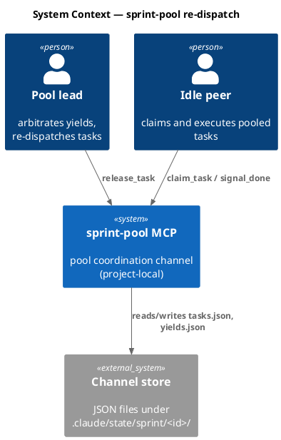

### C4 — Container

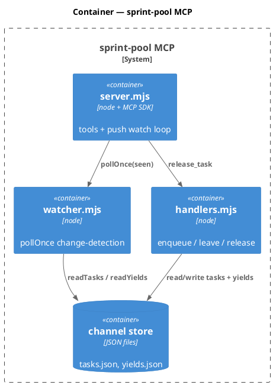

### C4 — Component (changed containers only)

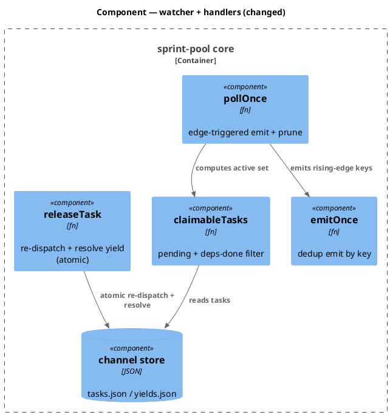

### Data model — class diagram

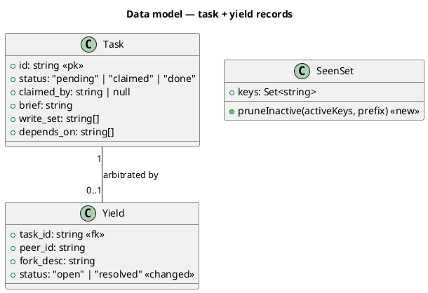

#### Migration DDL

*(none — channel state is plain JSON files, not a relational schema. The `<<changed>>` on `Yield.status` is a value-domain change only: the field already exists; `releaseTask` now writes the previously-unused `"resolved"` value. The `<<new>>` `SeenSet.pruneInactive` is an in-memory poll-time operation, not persisted state.)*

### Behavior — sequence per AC

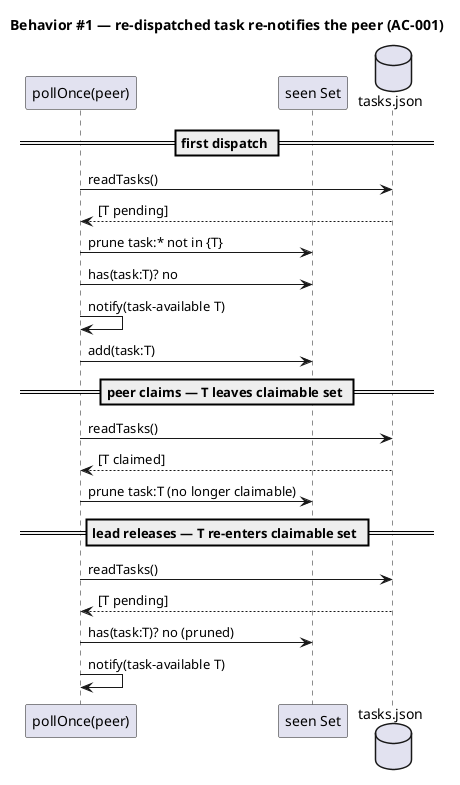

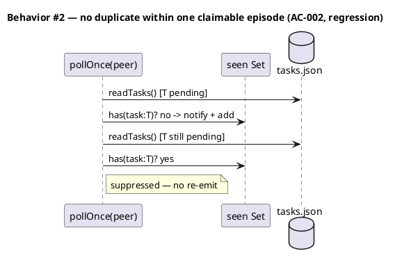

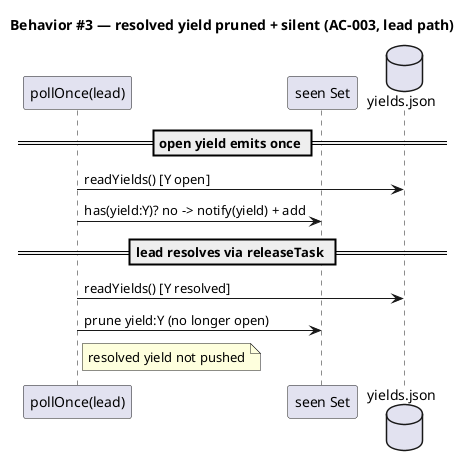

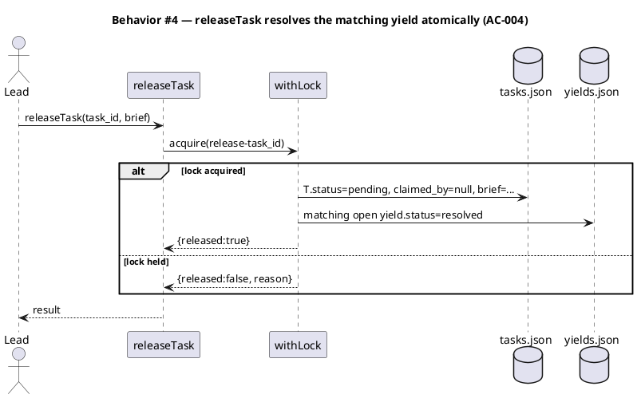

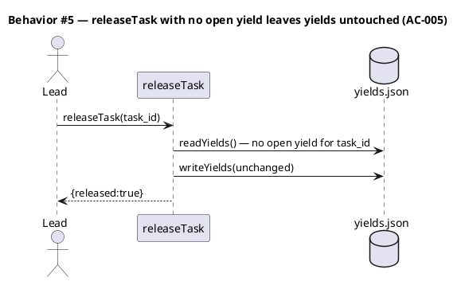

### State — Yield record

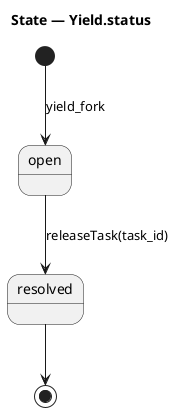

### Dependencies — graph

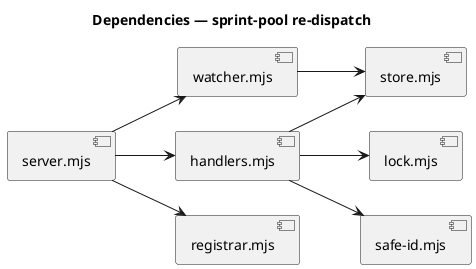

### Contracts

| Kind | Name | Input | Output | Errors | Idempotent |
|---|---|---|---|---|---|
| fn | `pollOnce({channelRoot, role, notify, seen})` | role `peer`\|`lead`, mutable `seen` Set | side-effect: `notify(event)` per rising-edge change; mutates `seen` | none (pure over fs reads) | yes — stable `seen` ⇒ no re-emit within an episode |
| fn | `releaseTask({channelRoot, task_id, brief?})` | task id, optional brief | `{released:true}` \| `{released:false, reason\|error}` | invalid id, unknown task, lock held | yes — re-running on a pending task + resolved yield is a no-op-equivalent |

### Libraries and versions

| Library@version | Purpose | Key APIs | Confirmed via context7 |
|---|---|---|---|
| *(none — node stdlib only)* | `watcher.mjs` and `handlers.mjs` import only project Foundation primitives (`store`/`lock`/`safe-id`), which use `node:fs`. No third-party API in scope. | — | n/a |

### Alternatives considered

| Alt | Summary | Rejected because |
|---|---|---|
| A | Have `release_task` (lead process) evict `task:<id>` from the peer's `seen` set | Cross-process: the lead's `releaseTask` runs in the lead's process; the peer's `seen` lives in a different process. No shared handle — impossible without the filesystem-as-bus. |
| B | Drop dedup entirely; re-emit every poll for every claimable task | Spams `task-available` every 750ms; breaks `test_when_watcher_polls_twice_then_no_duplicate_push`. Edge-trigger keeps once-per-episode semantics. |
| C | Add a per-task `generation` counter incremented on release; key `seen` on `task:<id>:<gen>` | Requires a schema field + writer changes across enqueue/claim/release; pruning inactive keys achieves the same with no persisted-state change (YAGNI). |

## Design calls

*(none)* — internal coordination machinery, no UI surface. The write_set does not intersect `tdd.ui_globs`.

## Acceptance criteria

| ID | Criterion (given / when / then) | Kind | Upstream AC | Sequence |
|---|---|---|---|---|
| AC-001 | given a task emitted once then claimed (left the claimable set) then released back to pending, when `pollOnce(peer)` runs, then `task-available` re-emits exactly once for that task | behavior | brief desired (a) | §Behavior #1 |
| AC-002 | given a still-pending (claimable) task already emitted this episode, when `pollOnce(peer)` runs again with the same `seen`, then it is NOT re-emitted | behavior | brief desired (a) | §Behavior #2 |
| AC-003 | given an open yield emitted once then resolved, when `pollOnce(lead)` runs, then the yield is not pushed and its `seen` key is pruned (a later re-open would re-emit) | behavior | brief desired (a) | §Behavior #3 |
| AC-004 | given a claimed task with a matching open yield, when `releaseTask` runs, then the task resets to pending AND the matching yield flips to `status:"resolved"`, both within one `withLock` | behavior | brief desired (b) | §Behavior #4 |
| AC-005 | given a task with no matching open yield, when `releaseTask` runs, then it returns `released:true` and the yields ledger is unchanged | behavior | brief desired (b) | §Behavior #5 |

## Test plan

| Category | Scenario | Expected | Covers |
|---|---|---|---|
| Golden path | task pending→claimed→pending across three polls, one `seen` | exactly 2 `task-available` emits (one per claimable episode) | AC-001 |
| Regression trap | two polls, task stays pending | exactly 1 emit (existing `test_when_watcher_polls_twice...` stays green) | AC-002 |
| Lead path | yield open→resolved across two polls | 1 `yield` emit then silence; `seen` no longer holds `yield:Y` | AC-003 |
| Concurrency / atomicity | `releaseTask` on claimed task + open yield | tasks.json shows pending+null+brief AND yields.json shows resolved, in the same lock | AC-004 |
| Input boundary | `releaseTask` with no open yield for the id | `released:true`, yields.json byte-identical | AC-005 |
| Contract violation | `releaseTask` invalid/traversal task_id | `{released:false, error:/invalid/}`, no write | AC-005 (guard parity) |
| Failure mode | `releaseTask` lock held by concurrent call | `{released:false, reason:/lock/}`, no partial write | AC-004 |

## Observability

| Signal | Name | Shape | Purpose |
|---|---|---|---|
| Log (stderr) | `sprint-pool watch error` | existing `server.mjs` catch — message string | surfaces a poll exception without killing the loop |

No new metrics/alarms — this is a project-local dogfood prototype, not a production service. The observable contract is the `<channel>` push event itself (re-fires correctly) plus the on-disk `yields.json` ledger (reflects resolution).

## Rollout

### Prerequisites

- *(none)*

- **Feature flag**: none — the fix is a behavior correction inside an off-by-default prototype (`velocity.sprint_mode.enabled`). No flag gates the fix itself.
- **Migration order**: n/a — no persisted-schema change.
- **Canary**: re-run the slice-C dogfood loop (yield → release → re-claim) and confirm the peer re-claims without a manual nudge.

## Rollback

- **Kill-switch**: `git revert` the commit; the two files return to their prior behavior. No state migration to unwind (JSON shape unchanged; a stray `status:"resolved"` yield is harmless to the old code, which only reads `status:"open"`).
- **Signal to roll back**: the dogfood loop regresses (re-dispatched task fails to re-notify, or `releaseTask` throws) — observable within one poll cycle (≤ 750 ms) of a manual re-dispatch.

## Archive plan

- Defaults *(automatic)*: brief, spec, spec-rendered/, spec approval, security report.
- Extras *(list any non-default files)*:
  - *(none)*

## Open questions

- *(none — root causes confirmed against the live state and existing tests; the fix is fully specified.)*
