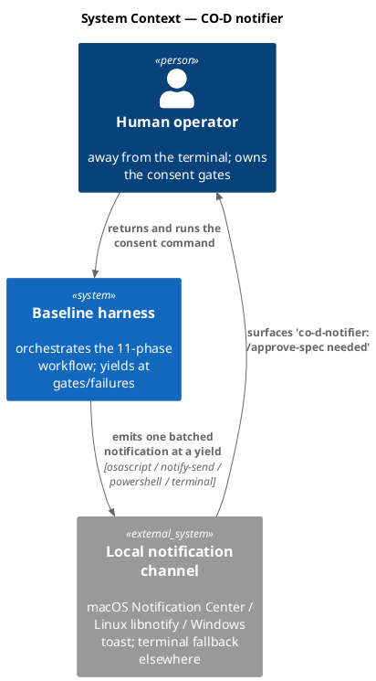
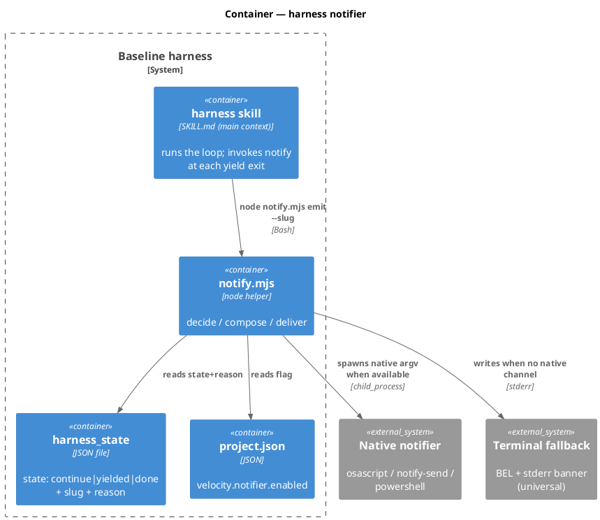
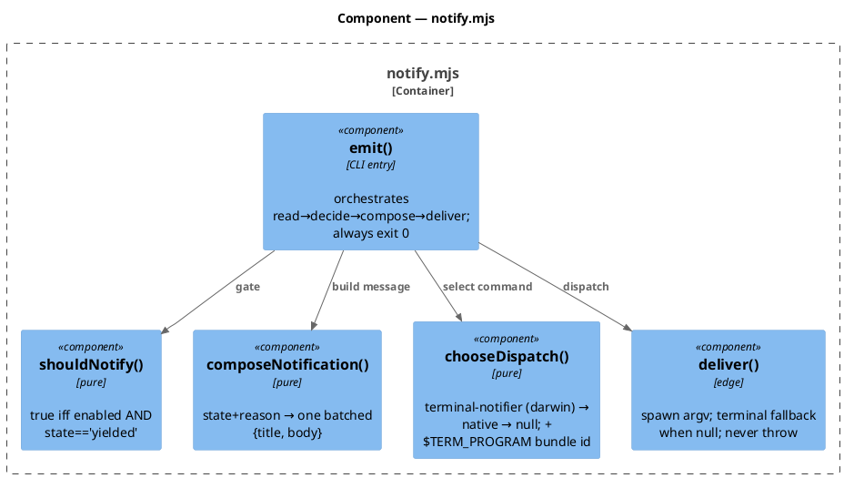
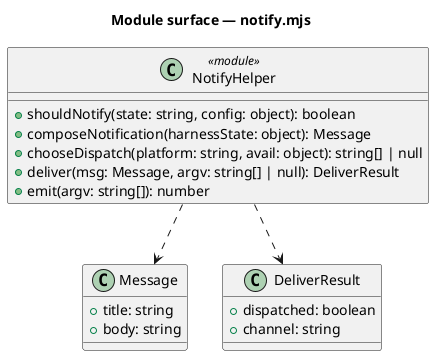
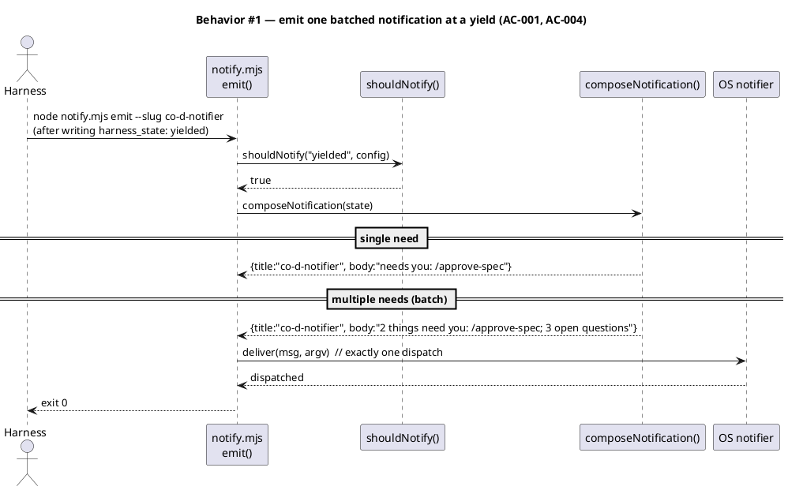
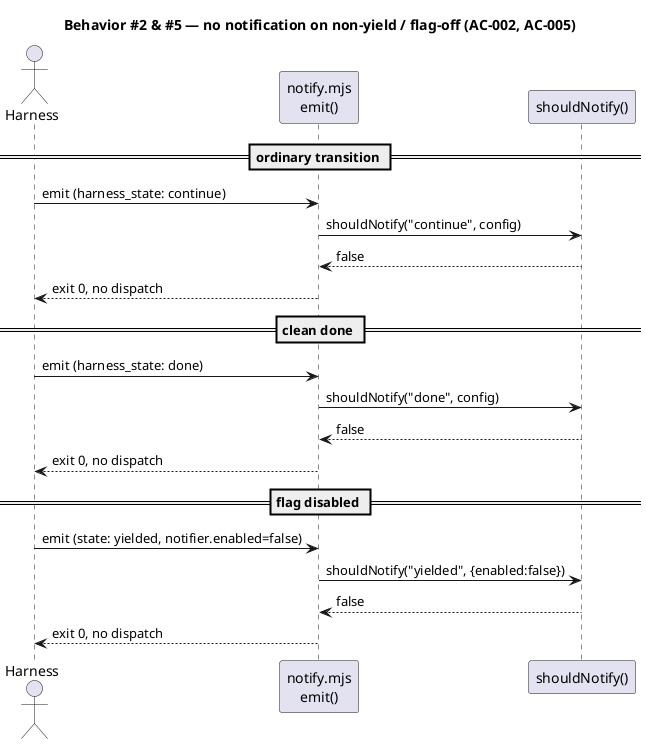
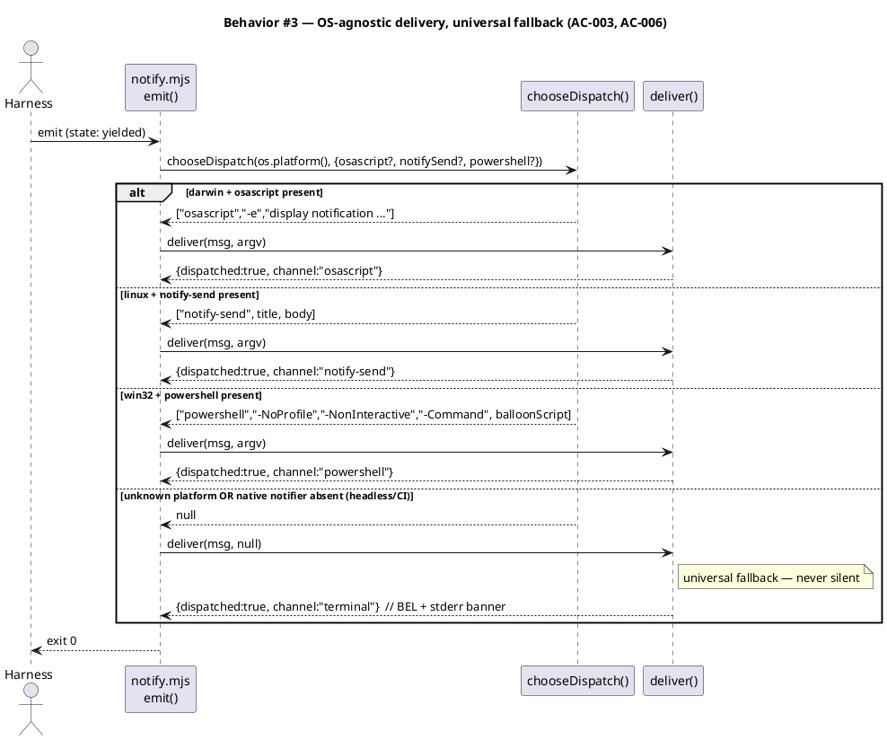
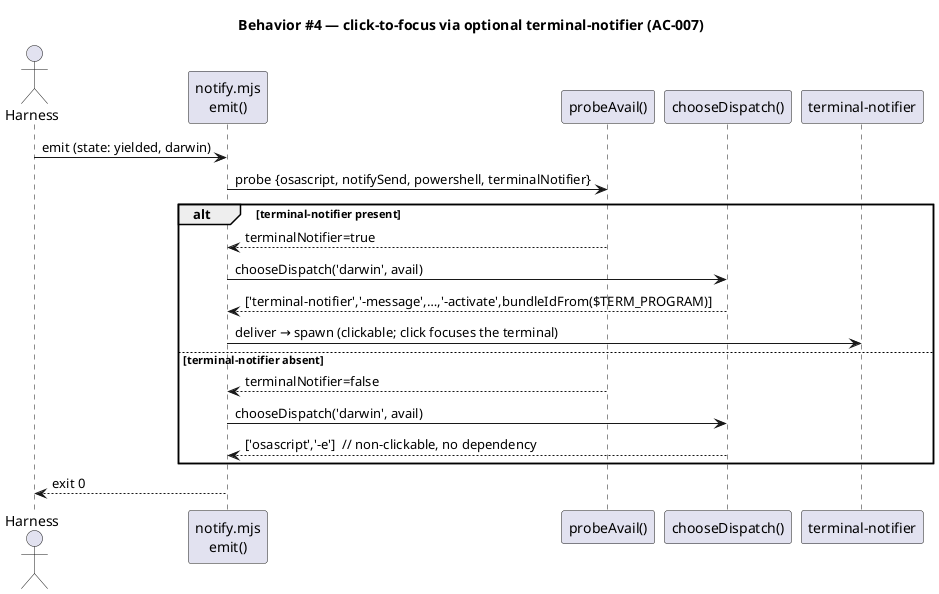
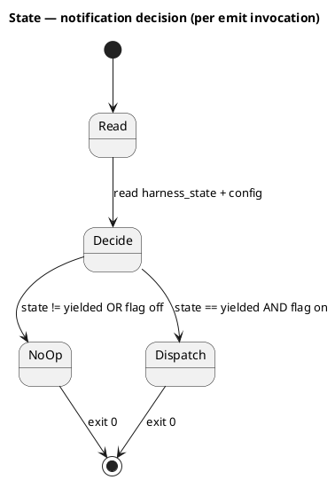
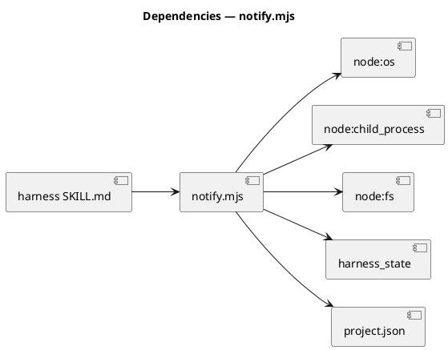

# CO-D Notifier — ping the human when attention is actually needed

## Context

| Input | Path |
|---|---|
| Intake | *(excepted — spec-entry track)* |
| Change-order brief | `docs/handoff/velocity-notifier-and-gate-collapse.md` §CO-D |
| Roadmap | `docs/handoff/baseline-system-redesign-roadmap.md` §CO-D |

**Write set**: `.claude/skills/harness/notify.mjs`, `.claude/skills/harness/SKILL.md`, `.claude/project.json`, `src/project.template.json`, `tests/harness-notify.test.mjs` — non-architectural (harness skill helper + config + tests; no app source, no `security.sensitive_globs`). Full C4 set drawn defensively because `src/project.template.json` falls outside the `non-architectural` profile globs.

## Decisions

> **Delivery mechanism — B (harness-yield-path emission via a testable OS-notifier helper), not A (a new Stop hook).** owner: engineer.
>
> Two mechanisms were on the table. (A) a deterministic Stop hook that fires an OS notification whenever it observes `harness_state.state == "yielded"`; (B) the harness skill invokes a small notifier helper at each of its yield exits. I chose **B**, for four reasons. **Reliability is equivalent for the cases that matter:** a real consent/failure yield *is* the model executing the harness yield-exit path (it writes `harness_state: yielded` there) — so a helper invoked at that same exit fires exactly when the yield happens. The only case B misses is a mid-loop interruption that leaves `state: continue`, which is the safety-net case, not a consent yield, and has nothing to notify about. **Blast radius:** A would add hook #27, forcing the 26→27 roster cascade across `CLAUDE.md`, `seed.md`, both `src/*.template.md` mirrors, the CONSTITUTION annex, the README, and the docsite `hooks.njk` — plus a `seed.md §4.1` hook-table amendment. That is the opposite of CO-D's "cheapest win on the board" mandate. B adds one skill helper and one SOP step: no new hook, no roster change, no `seed.md` amendment. **Roadmap intent:** the CO-D brief names the Stop hook as the *prototype* form and "the baseline harness yield path" as the *graduated* form — B is the graduated end-state. **Article II:** B keeps the decision-and-emit in main context (the harness skill), where the batch context (which gate, how many open questions) is already in hand. The deterministic-hook backstop (A) is deferred (see Alternatives) — build it only if we observe real missed notifications; adding it speculatively is the roster-cascade cost for no demonstrated need.

> **No constitutional amendment required.** owner: engineer. The notifier adds an *additive harness-skill behavior* gated by a `velocity.notifier.enabled` flag — it changes no phase, no consent gate, and no hook roster. This is the same velocity class as `checker_fanout` / `rightsize` / `drift_reverify_skip`, which shipped as harness SOP + a `velocity.*` flag without an Article II/IV amendment. Recorded here so gate-A review can confirm the no-amendment call rather than discover it.

> **OS-agnostic delivery — native-per-platform with a universal fallback, not macOS/Linux-or-silence.** owner: engineer. A notifier that only fires on macOS and Linux fails its own purpose on Windows and unknown/headless hosts — silence is the exact failure mode it exists to prevent. Delivery is therefore a degradation chain, all stdlib + OS-native (U6, no third-party dependency): (1) the platform's native notifier when present — `osascript` (darwin), `notify-send` (linux), a dependency-free PowerShell `NotifyIcon` balloon (win32); (2) a **universal terminal fallback** (a BEL char + one-line stderr banner) on any other platform, or when the native notifier is absent (headless/CI). `deliver` never silently drops on a yield when the flag is on — the terminal fallback is the guaranteed floor. The client-native `PushNotification` tool remains an optional richer cross-platform channel the harness may also invoke, but the AC-bound, testable path is this helper. Platform selection is a pure function (`chooseDispatch`) so every branch is unit-tested without spawning a real notifier.

> **Click-to-focus — an OPTIONAL top rung (`terminal-notifier`), never a required dependency; U6 preserved.** owner: engineer. The simple native notifiers do not support click-to-activate dependency-light: macOS `display notification` banners are not app-activating, Linux `notify-send` needs a persistent D-Bus action listener, and Windows toast activation needs an AUMID app registration. Rather than take a hard dependency (which would violate U6) or auto-`activate` the terminal on every yield (which would *steal* the user's focus unprompted — the opposite of the intent), click-to-focus is a **best-effort enhancement layered as a probed top rung of the delivery chain**: on macOS, if `terminal-notifier` is on `PATH`, deliver through it with `-activate <bundle-id>` so a click focuses the terminal running Claude Code — the bundle id is derived from `$TERM_PROGRAM` (`Apple_Terminal`→`com.apple.Terminal`, `iTerm.app`→`com.googlecode.iterm2`, `vscode`→`com.microsoft.VSCode`; unknown → omit `-activate`, still a clean notification). If `terminal-notifier` is **absent**, delivery degrades to `osascript` (non-clickable), then the terminal fallback — exactly the existing chain. `terminal-notifier` is **probed, never required** (same treatment as `osascript`/`notify-send`), so **no `package.json` dependency is added and U6 holds** — the notifier works identically without it, just without the click affordance. Linux/Windows click-to-focus (D-Bus listener / AUMID) is explicitly deferred to a follow-up (Alternatives); this cut delivers click-to-focus on macOS where it is achievable dependency-light, and a plain notification everywhere else.

> **Message verbiage — human and action-first.** owner: engineer. `composeNotification` produces reader-facing copy, not a state dump: a clean title (`Claude Code`) and an action-first body that names the workflow and the one thing to do (`co-d-notifier is ready for your review — run /approve-spec`), while still preserving the whole `reason` so a multi-need yield lists every need in the one message (AC-004). The body keeps the literal action token (`/approve-spec`, `/grant-commit`, …) so it stays greppable and testable.

## Goal

At every harness yield that needs a human (consent gate or failure), the harness emits exactly one batched OS notification naming the workflow and what is needed; ordinary phase transitions and clean completion emit nothing.

## Non-goals

- **A new hook.** The notifier is a harness-skill helper, not hook #27 (see Decisions).
- **Notifying on clean `done`.** Completion needs no human action; the brief scopes notification to attention-*needed* yields. A completion ping is out of scope (Alternatives).
- **Reaching a remote device / phone.** Delivery is a *local* notification on the machine running the harness (cross-platform — see Decisions). A push-to-device channel (e.g. the `PushNotification` tool reaching a phone) is an optional richer channel the harness may additionally invoke, not the AC-bound path.
- **Rich formatting, sound, action buttons.** One title + one body line.

## Design

Diagrams are the contract. Prose is only for what a diagram cannot say.

The notifier is a single stateless helper, `.claude/skills/harness/notify.mjs`, with a pure decision/compose core and a thin delivery edge. The harness skill invokes `node .claude/skills/harness/notify.mjs emit --slug <slug>` at each of its three yield exits (consent-gate yield, phase-failure yield, integrate-needs-spec-change yield), immediately after writing `harness_state`. The helper reads `harness_state` + `project.json`, decides whether to notify, composes one batched message, and dispatches it through an **OS-agnostic delivery chain**: on macOS the optional `terminal-notifier` (clickable, focuses the terminal on click) when it is on `PATH`, then the platform's native notifier (macOS `osascript`, Linux `notify-send`, Windows PowerShell balloon), and a **universal terminal fallback** (BEL + a one-line stderr banner) on any other platform or when nothing native is available — so no platform is ever left silent. `terminal-notifier` is probed like every other channel and never required (U6).

### C4 — System context



### C4 — Container



### C4 — Component (notify.mjs internals)



### Data model — class diagram

No database and no migration — the notifier is a stateless code helper. The "data model" is the helper's function surface.



#### Migration DDL

```sql
-- No migration. The notifier stores no state and owns no table.
-- forward:  (none)
-- reverse:  (none)
```

### Behavior — sequence per AC









### State — core entity

The notifier is stateless — it reads `harness_state` but keeps none of its own. The only state machine is the harness's, already specified in `harness/SKILL.md`; the notifier fires on entry to that machine's `yielded` states. No new state model.



### Dependencies — graph



### Contracts

| Kind | Name | Input | Output | Errors | Idempotent |
|---|---|---|---|---|---|
| CLI | `node notify.mjs emit --slug <slug>` | reads `harness_state`, `project.json` | exit 0 always; dispatches ≤1 notification | never throws; unreadable state/config → no-op exit 0 | yes (one call → ≤1 dispatch) |
| Fn | `shouldNotify(state, config)` | `state:string`, `config:object` | `boolean` | pure | yes |
| Fn | `composeNotification(harnessState)` | `{state, slug, reason, ...}` | `{title, body}` (one batched message) | pure | yes |
| Fn | `chooseDispatch(platform, avail, env)` | `platform`, `avail:{osascript,notifySend,powershell,terminalNotifier}`, `env:{termProgram}` | native/terminal-notifier `string[]` argv, or `null` (→ terminal fallback) | pure | yes |
| Fn | `bundleIdFor(termProgram)` | `$TERM_PROGRAM` string | macOS bundle id or `null` | pure | yes |
| Fn | `deliver(msg, argv)` | `Message`, native-argv-or-null | `{dispatched, channel}`; `null` argv → `{dispatched:true, channel:'terminal'}` | spawn failure caught → terminal fallback | yes |

### Libraries and versions

| Library@version | Purpose | Key APIs | Confirmed against current docs |
|---|---|---|---|
| `node:os` (Node ≥ 18, stdlib) | platform detection | `os.platform()` | yes (Node stdlib) |
| `node:child_process` (stdlib) | spawn the native notifier; probe availability | `spawnSync` | yes (Node stdlib) |
| `node:fs` (stdlib) | read `harness_state` / `project.json` | `readFileSync`, `existsSync` | yes (Node stdlib) |

| `terminal-notifier` (optional, macOS) | clickable notification that focuses the terminal on click | `-message`, `-title`, `-activate <bundle-id>` | probed at runtime; used only if present |

No third-party dependency (U6) — stdlib + OS-native `osascript` (darwin), `notify-send` (linux), `powershell` `NotifyIcon` balloon (win32), each optional; a universal BEL + stderr terminal banner is the guaranteed fallback on any other platform. `terminal-notifier` is an **optional, probed** channel (macOS click-to-focus) — never installed or required, so it adds no `package.json` dependency and the notifier is fully functional without it.

### Alternatives considered

| Alt | Summary | Rejected because |
|---|---|---|
| A — Stop hook | A deterministic Stop hook fires the notification on observing `state==yielded` | Adds hook #27 → the 26→27 roster cascade + `seed.md §4.1` amendment; heavy Class-A blast radius for an advisory feature. Reliability gain is only over the mid-loop-interruption case, which is not a consent yield. Deferred as a possible backstop if real misses are observed. |
| B+A hybrid | Ship B now + the hook backstop | YAGNI for this CO — build the backstop only on demonstrated need; the hybrid pays the roster-cascade cost up front for no measured benefit. |
| Model `PushNotification` tool | Harness calls the `PushNotification` tool at yield | Not unit-testable (model tool call), not guaranteed available in every environment; kept as an *optional* richer channel the harness MAY additionally invoke, but the AC-bound delivery is the testable OS-notifier helper. |
| Notify on `done` too | Also ping on clean completion | Out of scope per the brief (attention-*needed* only); easy additive follow-up. |
| Linux/Windows click-to-focus | notify-send `--action` + D-Bus listener; Windows toast + AUMID app registration | Neither is dependency-light or stateless — a D-Bus action listener is a persistent process, AUMID needs app registration. Deferred; macOS gets click-to-focus via optional `terminal-notifier` this cut, other platforms notify without it. |
| Require `terminal-notifier` | Take it as a hard dependency for uniform click-to-focus | Violates U6 (irreplaceable third-party dep). Kept optional/probed instead. |
| Auto-`activate` terminal on yield | osascript `tell app … to activate` | Steals the user's focus unprompted — the opposite of the intent. Click-to-focus must be *user-initiated* (a click), not automatic. |

## Design calls

*(none)* — the write_set does not intersect `tdd.ui_globs`; no UI surface.

## Acceptance criteria

| ID | Criterion (given / when / then) | Kind | Upstream AC | Sequence |
|---|---|---|---|---|
| AC-001 | given `harness_state.state == "yielded"` (a consent-gate or failure yield) and `velocity.notifier.enabled` not false, when `notify.mjs emit` runs, then exactly one OS notification is dispatched whose body names the workflow slug and what the human must do | behavior | brief AC-1 | §Behavior #1 |
| AC-002 | given `harness_state.state` is `continue` (ordinary transition) or `done` (clean completion), when `emit` runs, then no notification is dispatched | behavior | brief AC-2 | §Behavior #2 |
| AC-003 | given `emit` runs at a yield on any platform, when delivering, then it dispatches through the best available native channel (`osascript`/`notify-send`/PowerShell balloon) and, when no native channel exists (unknown platform / headless), falls back to a universal terminal banner (BEL + stderr) — it never throws, always exits 0, dispatch is never silently dropped, and no third-party dependency is introduced (stdlib + OS-native only) | behavior | brief AC-3 | §Behavior #3 |
| AC-004 | given a yield with multiple pending needs (e.g. a consent gate plus N open questions), when composing, then a single batched notification lists all needs (not one notification per need) | behavior | brief "batch" | §Behavior #1 |
| AC-005 | given `velocity.notifier.enabled == false`, when a yield occurs, then no notification is dispatched (opt-out for CI/headless) | behavior | brief (dependency-light/opt-out) | §Behavior #2 |
| AC-006 | given `os.platform()` is `darwin`, `linux`, or `win32` with that platform's notifier available, when `chooseDispatch` runs, then it returns that platform's correct native argv; for any other platform, or when the notifier is absent, it returns `null` so `deliver` uses the universal terminal fallback (OS-agnostic coverage) | behavior | brief AC-3 (os-agnostic) | §Behavior #3 |
| AC-007 | given `os.platform()` is `darwin` and `terminal-notifier` is available, when `chooseDispatch` runs, then it returns a `terminal-notifier` argv carrying `-activate <bundle-id>` derived from `$TERM_PROGRAM` (so a click focuses the terminal); when `terminal-notifier` is absent, `chooseDispatch` falls through to `osascript` (non-clickable) — click-to-focus is a probed, optional enhancement that adds no dependency | behavior | user-directed (click-to-focus) | §Behavior #4 |
| AC-008 | given a yielded state, when `composeNotification` runs, then the title is `Claude Code` and the body is action-first (names the slug + the literal action token, e.g. `/approve-spec`), preserving the full `reason` so a multi-need yield lists every need in the one message | behavior | user-directed (verbiage) | §Behavior #1 |

## Test plan

| Category | Scenario | Expected | Covers |
|---|---|---|---|
| Golden path | `shouldNotify("yielded", {})` | `true` (default-on) | AC-001 |
| Golden path | `composeNotification({state:"yielded", slug:"co-d-notifier", reason:"yielded at /approve-spec"})` | one `{title, body}`; body names slug + `/approve-spec` | AC-001 |
| Golden path | `emit` on a yielded state with a fake-present notifier | exactly one `deliver` dispatch; exit 0 | AC-001 |
| Batch | `composeNotification` on a reason naming a gate + open-questions count | one message listing both needs | AC-004 |
| Input boundary | `shouldNotify("continue", {})` / `shouldNotify("done", {})` | `false` for both | AC-002 |
| Contract violation | `shouldNotify("yielded", {velocity:{notifier:{enabled:false}}})` | `false` | AC-005 |
| Failure mode | `chooseDispatch("linux", {notifySend:false})` → `null`; `deliver(msg, null)` | `{dispatched:true, channel:"terminal"}` (BEL+stderr), no throw, exit 0 | AC-003 |
| Failure mode | `emit` with unreadable/absent `harness_state` | no-op, exit 0, never throws | AC-002/003 |
| Platform | `chooseDispatch("darwin", {osascript:true})` | `["osascript","-e", …]` | AC-006 |
| Platform | `chooseDispatch("linux", {notifySend:true})` | `["notify-send", …]` | AC-006 |
| Platform | `chooseDispatch("win32", {powershell:true})` | PowerShell balloon argv | AC-006 |
| Platform | `chooseDispatch("freebsd", {…})` (unsupported OS) | `null` → terminal fallback | AC-003/006 |
| Click-to-focus | `chooseDispatch("darwin", {terminalNotifier:true, ...}, {termProgram:"iTerm.app"})` | `terminal-notifier` argv with `-activate com.googlecode.iterm2` | AC-007 |
| Click-to-focus | `chooseDispatch("darwin", {terminalNotifier:false, osascript:true})` | falls through to `osascript` argv (no dep) | AC-007 |
| Bundle map | `bundleIdFor("Apple_Terminal")` / `"vscode"` / `"unknown"` | `com.apple.Terminal` / `com.microsoft.VSCode` / `null` (omit -activate) | AC-007 |
| Verbiage | `composeNotification({state:"yielded", slug, reason:"yielded at /grant-commit"})` | title `Claude Code`; body action-first, contains slug + `/grant-commit` | AC-008 |
| Failure mode | `deliver` when the native spawn itself errors | falls back to terminal, no throw | AC-003 |
| Regression trap | no new entry in `package.json` dependencies | dependency set unchanged | AC-003 |

## Observability

| Signal | Name | Shape | Purpose |
|---|---|---|---|
| Log | `notify emit` | appended to `.claude/state/harness/<slug>.log`: `notified <channel> at <yield-reason>` or `notify skipped <reason>` | audit which yields pinged and why one was skipped |

## Rollout

### Prerequisites

- *(none)* — additive helper gated by a default-on flag; no migration, no ordering.

- **Feature flag**: `velocity.notifier.enabled` — default **true** (velocity levers default on); absent flag resolves on. Set false to silence (CI/headless).
- **Manifest**: `notify.mjs` is a new baseline-owned skill file → run `bash scripts/build-template.sh` to record its hash and mirror `project.template.json`; `audit-baseline` must PASS.
- **No hook roster change** — the roster stays at 26 (no `seed.md`/CLAUDE.md hook-table edit).

## Rollback

- **Kill-switch**: set `velocity.notifier.enabled: false` (immediate silence, no code change) — or revert the harness SKILL.md yield-exit step.
- **Signal to roll back**: spurious notifications on non-yield transitions, or `emit` throwing / non-zero exit stalling the harness loop — either trips within the first workflow run after ship.

## Archive plan

- Defaults *(automatic)*: spec, spec-rendered/, spec approval, security report.
- Extras *(non-default files)*:
  - *(none)*

## Open questions

- *(none)* — the one load-bearing fork (delivery mechanism) is resolved in `## Decisions`; the `PushNotification`-tool richer channel and the `done`-ping are captured as non-blocking Alternatives for a future CO.
