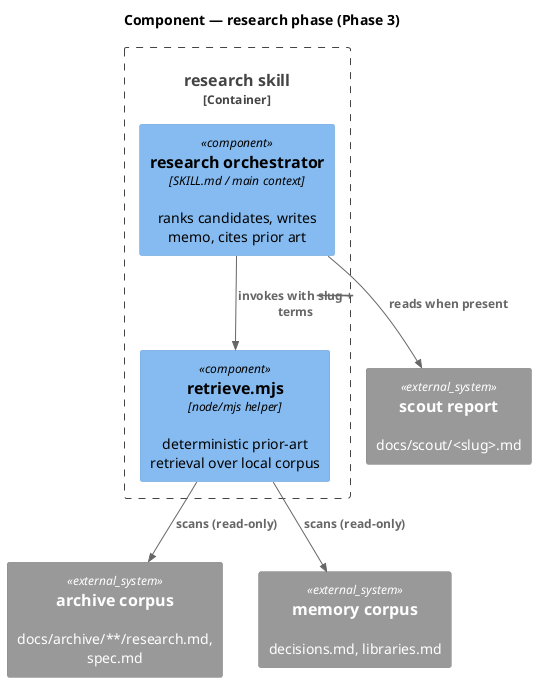
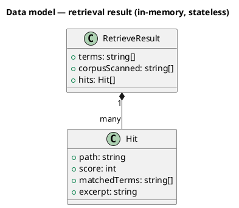
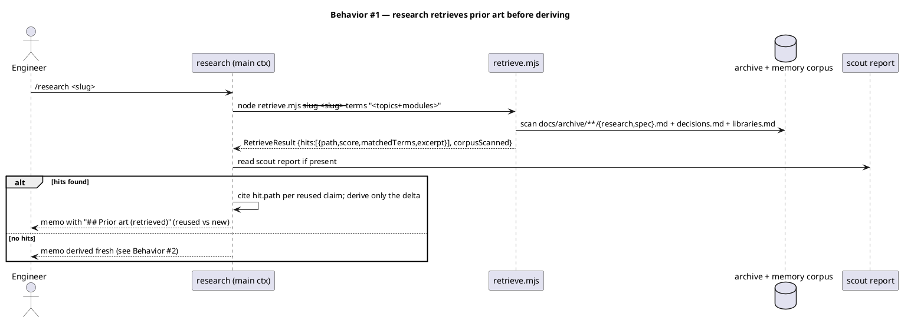
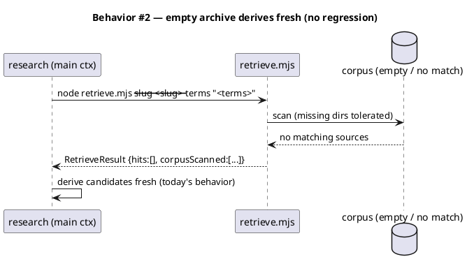
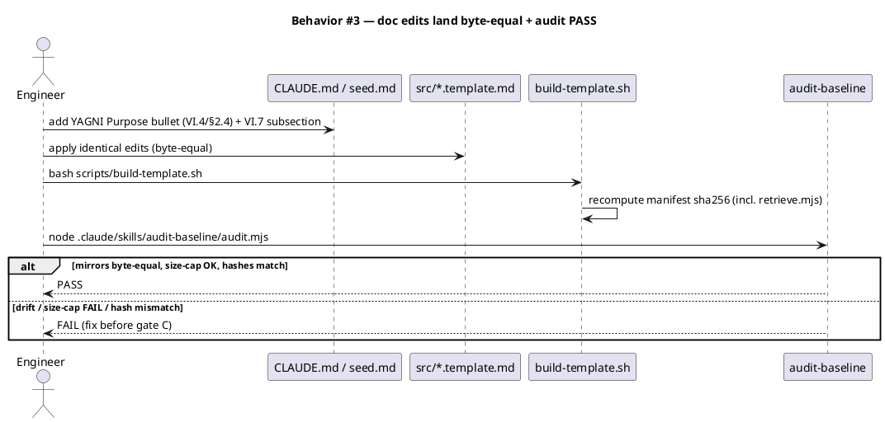
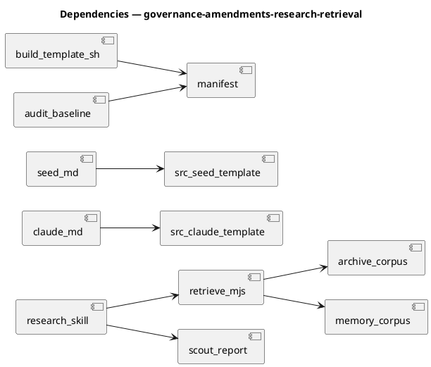

# Spec — Governance amendments (YAGNI purpose, read-before-overwrite) + research retrieve-first

## Context

| Input | Path |
|---|---|
| Intake | *(none — spec-entry track; sourced from captured change-order briefs)* |
| BRD *(if any)* | *(none)* |
| Scout *(if any)* | *(none)* |
| Research *(if any)* | *(none)* |
| Brief — YAGNI reframe | `docs/handoff/yagni-purpose-reframe.md` |
| Brief — read-before-overwrite | `docs/handoff/read-before-overwrite-convention.md` |
| Brief — research retrieve-first | `docs/handoff/research-retrieve-first.md` |
| Roadmap ledger | `docs/handoff/baseline-system-redesign-roadmap.md` |

**Write set**: `CLAUDE.md`, `docs/init/seed.md`, `src/CLAUDE.template.md`, `src/seed.template.md`, `.claude/skills/research/SKILL.md`, `.claude/skills/research/retrieve.mjs`, `tests/research-retrieve.test.mjs`, `tests/governance-amendments.test.mjs` — a non-architectural write_set (`.claude/skills/**`, `docs/**`, `src/*.template.md`, `tests/**`), so the reduced diagram profile applies (c4_component, class, sequence, dependency_graph). No `security.sensitive_globs` path is touched.

## Goal

The constitution states YAGNI's positive purpose (prevent over-engineering / premature refactoring / premature stubs, never gate feature delivery) and carries a read-before-overwrite convention; the Phase-3 `research` skill retrieves prior research/ADRs/decisions from the archive and memory corpus — with citations — before deriving new approaches, so it reworks only the genuine delta.

## Non-goals

- No change to YAGNI's existing *negative* guard (two-sided faithful scope / `spec-traceability-review` deferral BLOCKER) — the reframe is purely additive positive-purpose prose.
- No new hard gate for read-before-overwrite — the Write tool already enforces it mechanically; VI.7 is an advisory convention that travels to consumers via the template.
- No third-party vector-DB / embedding dependency for retrieval (U6) — retrieval is a local, inspectable, stdlib-only scan.
- No change to the current-docs (context7) grounding rule — archive retrieval covers *prior internal reasoning*; the context7 check covers *external API truth*. They stay distinct.

## Design

Diagrams are the contract. Prose is only for what a diagram cannot say.

Three separable components land under one spec:

- **Component 1 — YAGNI purpose reframe** (doc-only): a positive-purpose lead bullet + a no-preemptive-refactor bullet + a no-premature-stub bullet, added to `CLAUDE.md §VI.4` and `docs/init/seed.md §2.4`, byte-mirrored into `src/CLAUDE.template.md` / `src/seed.template.md`.
- **Component 2 — read-before-overwrite VI.7** (doc-only): a new `### VI.7 Read before overwrite` subsection in `CLAUDE.md` Article VI, byte-mirrored into `src/CLAUDE.template.md`.
- **Component 3 — research retrieve-first** (tooling): a new deterministic retriever `retrieve.mjs` plus a `research/SKILL.md` "retrieve before derive" step and a `## Prior art (retrieved)` memo section.

### C4 — Component (changed containers only)

The only container whose internals change is the `research` phase.



### Data model — class diagram

The retriever's result shape is in-memory and stateless — no persistence, no DDL.



#### Migration DDL

```sql
-- none — retrieval is stateless over files; no database, no schema change.
```

### Behavior — sequence per AC

#### §Behavior #1 — retrieve-first, derive-delta (AC-006 · AC-007 · AC-008 · AC-010)



#### §Behavior #2 — empty / novel corpus, no regression (AC-009)



#### §Behavior #3 — governance edits, mirror sync, manifest regen, audit (AC-001..005 · AC-011 · AC-012)



### State — core entity *(only if stateful)*

No non-trivial state machine — the retriever is a pure function of the corpus + terms; the governance edits are static prose. Omitted deliberately.

### Dependencies — graph



### Contracts

| Kind | Name | Input | Output | Errors | Idempotent |
|---|---|---|---|---|---|
| CLI | `node .claude/skills/research/retrieve.mjs --slug <slug> [--terms "<space/comma-separated>"]` | slug + optional terms | JSON `RetrieveResult` on stdout (`{terms, corpusScanned, hits}`), exit 0 | missing corpus dir → tolerated (empty hits, exit 0); bad slug → exit 0 with empty hits | yes (pure over corpus+terms; same input → byte-identical output) |

### Libraries and versions

| Library@version | Purpose | Key APIs | Confirmed against current docs |
|---|---|---|---|
| node:fs (stdlib) | read corpus files, walk archive dirs | `readdirSync({recursive})`, `readFileSync`, `existsSync` | n/a (Node stdlib, pinned by runtime) |
| node:path (stdlib) | join/normalize corpus paths | `join`, `relative` | n/a (Node stdlib) |

No third-party library — U6 (no irreplaceable dependency) is satisfied by a local stdlib-only scan.

### Alternatives considered

| Alt | Summary | Rejected because |
|---|---|---|
| A | Embedding / vector-DB retrieval over the archive | Introduces an irreplaceable third-party dependency (violates U6); non-deterministic ranking is not inspectable (AC-010). |
| B | Have the model grep the archive ad-hoc each run (no helper) | Not deterministic/inspectable; no stable citation surface; the whole point is a reviewable "why was this pulled" (matchedTerms). |
| C | A persistent local index rebuilt on each archive write | YAGNI — a stateless scan over the archive is fast enough at baseline corpus size; an index adds cache-invalidation surface with no current demand. |

## Design calls

*(none)* — the write_set touches no `project.json → tdd.ui_globs` path (no UI surface).

## Acceptance criteria

| ID | Criterion (given / when / then) | Kind | Upstream AC | Sequence |
|---|---|---|---|---|
| AC-001 | given `CLAUDE.md §VI.4`, when the reframe lands, then VI.4 leads with a `**Purpose.**` bullet stating YAGNI targets over-engineering / premature refactoring / premature stubs and never gates spec-committed delivery | behavior | brief: yagni-purpose-reframe | §Behavior #3 |
| AC-002 | given `CLAUDE.md §VI.4` and `seed.md §2.4`, when the reframe lands, then both carry the no-preemptive-refactor bullet and the no-premature-stub (YAGNI face of no-stubs) bullet | behavior | brief: yagni-purpose-reframe | §Behavior #3 |
| AC-003 | given the YAGNI edits, when applied, then `src/CLAUDE.template.md` and `src/seed.template.md` are byte-equal mirrors of `CLAUDE.md` / `seed.md` (Article XII) | behavior | brief: yagni-purpose-reframe | §Behavior #3 |
| AC-004 | given `CLAUDE.md` Article VI, when the convention lands, then it carries a `### VI.7 Read before overwrite` subsection with the SHALL-Read-before-overwrite rule | behavior | brief: read-before-overwrite | §Behavior #3 |
| AC-005 | given the VI.7 edit, when applied, then `src/CLAUDE.template.md` mirrors it byte-equal | behavior | brief: read-before-overwrite | §Behavior #3 |
| AC-006 | given a slug with prior art in the corpus, when `research` runs, then `retrieve.mjs` surfaces the relevant archive/ADR/decision sources — each with its source path — before candidates are derived | behavior | brief: research-retrieve-first AC1 | §Behavior #1 |
| AC-007 | given retrieved hits, when the memo is written, then it carries a `## Prior art (retrieved)` section distinguishing reused (cited to source path) from newly-derived content | behavior | brief: research-retrieve-first AC2 | §Behavior #1 |
| AC-008 | given a scout report on disk, when `research` runs, then the retrieval/derivation consumes it so candidates are grounded in the actual codebase | behavior | brief: research-retrieve-first AC3 | §Behavior #1 |
| AC-009 | given an empty / no-match corpus, when `retrieve.mjs` runs, then it returns `hits: []` (exit 0, missing dirs tolerated) and `research` derives fresh — no regression | behavior | brief: research-retrieve-first AC4 | §Behavior #2 |
| AC-010 | given identical `--slug` + `--terms`, when `retrieve.mjs` runs twice, then output is byte-identical and every hit carries `matchedTerms` (inspectable why-pulled) with a stable sort | behavior | brief: research-retrieve-first AC5 | §Behavior #1 |
| AC-011 | given all edits + `retrieve.mjs`, when `bash scripts/build-template.sh` then `node .claude/skills/audit-baseline/audit.mjs` run, then audit returns PASS (no hash mismatch, no mirror drift, no size-cap FAIL) | smoke | cross-cutting | §Behavior #3 |
| AC-012 | given the doc additions, when measured, then `CLAUDE.md` stays under the 40,000-char Article I.6 cap | preflight | cross-cutting | §Behavior #3 |

## Test plan

Structural test kind (baseline self-dev) — tests assert file content (grep/byte-equality/char-count + audit exit code) and the retriever's behavior.

| Category | Scenario | Expected | Covers |
|---|---|---|---|
| Golden path | `retrieve.mjs` over a corpus with 2 sources matching terms | ranks the higher-overlap source first; each hit has `path` + `matchedTerms` | AC-006, AC-010 |
| Golden path | grep `CLAUDE.md §VI.4` after edit | `**Purpose.**` lead bullet present; no-refactor + no-stub bullets present | AC-001, AC-002 |
| Golden path | grep `CLAUDE.md` Article VI after edit | `### VI.7 Read before overwrite` subsection present | AC-004 |
| Contract violation | `retrieve.mjs` with a missing archive dir | exit 0, `hits: []`, no throw | AC-009 |
| Input boundary | `retrieve.mjs` with empty `--terms` | exit 0, `hits: []` (nothing to match), deterministic | AC-009, AC-010 |
| Golden path | memo written by a retrieve-first run | contains `## Prior art (retrieved)` with reused-vs-new split | AC-007 |
| Golden path | scout report present during research | derivation references scout findings | AC-008 |
| Regression trap | byte-equality of `src/CLAUDE.template.md` vs `CLAUDE.md` (and seed mirror) | equal | AC-003, AC-005 |
| Regression trap | `audit-baseline` after `build-template.sh` | PASS (exit 0) | AC-011 |
| Input boundary | `wc -c CLAUDE.md` after edits | < 40000 | AC-012 |
| Concurrency / ordering | `retrieve.mjs` run twice, same args | byte-identical stdout | AC-010 |
| Failure mode | `retrieve.mjs` given a corpus file it cannot read | skips that file, continues, exit 0 | AC-009 |

## Observability

| Signal | Name | Shape | Purpose |
|---|---|---|---|
| Log | retrieve stderr note | one line: `retrieve: scanned <N> sources, <M> hits` (stderr, non-JSON) | inspectability — the reviewer sees the scan size without parsing stdout |

No metric/alarm — this is a dev-time helper, not a runtime service.

## Rollout

### Prerequisites

| # | Prerequisite | enforced-by |
|---|---|---|
| 1 | Manifest regenerated + `audit-baseline` PASS before the closing commit | AC-011 |
| 2 | `CLAUDE.md` under the 40,000-char cap after the doc additions | AC-012 |

- **Feature flag**: *(none)* — governance prose is always-on; `retrieve.mjs` is invoked by the `research` skill, which is itself gated by the workflow phase. No runtime flag needed.
- **Migration order**: not applicable (no data migration).
- **Canary**: not applicable (dev-time tooling + governance docs).

## Rollback

- **Kill-switch**: `git revert` the landing commit — the governance prose and the `retrieve.mjs` helper revert together; `research` falls back to its prior derive-fresh behavior (which AC-009 already exercises, so the fallback path is tested).
- **Signal to roll back**: `audit-baseline` FAIL in CI, or a `research` run erroring on `retrieve.mjs` — either trips within one workflow run.

## Archive plan

- Defaults *(automatic)*: spec, spec-rendered/, spec approval, security report.
- Extras *(list any non-default files)*:
  - *(none)* — the three handoff briefs stay in `docs/handoff/` and are flipped in the roadmap ledger by `/roadmap-sync`, not archived with this bundle.

## Open questions

- *(none — the three briefs carry complete framing; the two governance edits are turnkey and the retriever design is settled at Alternatives A–C above.)*
