# Spec — Harden the debt the power-track-completion workflow surfaced

## Context

| Input | Path |
|---|---|
| Intake | *(none — `power` track; entry phase is `spec`)* |
| Tickets | `.claude/state/workflow.json → tickets[]` (T1–T3; T4 deferred, see below) |

**Write set**: `.claude/commands/approve-spec.md`, `.claude/hooks/spec_approval_guard.mjs`, `.claude/skills/harness/SKILL.md`, `.claude/hooks/lib/spec-content-hash.mjs`, `.claude/skills/tdd/drift-reverify-guard.mjs`, `tests/docsite-predicate-table-completeness.test.mjs`, `tests/spec-content-hash.test.mjs`, `tests/gate-a-content-reyield.test.mjs`, `tests/drift-reverify-arg-parity.test.mjs`, `tests/harden-batch-audit-green.test.mjs`, `site-src/workflows.njk`

Profile resolves to `full` via `write-set-profile.mjs` (.claude/hooks/ is an architectural surface).

This is a **power batch-sprint** of three tickets — loose ends the `power-track-completion` workflow (66a11f4) exposed. They share the theme "debt this repo's own process surfaced." Each ticket is an independent AC group; `security` reviews each per-ticket, and `commit` splits the batch.

**T4 (generators stamp a DERIVED header) is deferred** (`deferred: human-directed`, 2026-07-10). Its header approach works cleanly for the vendored JS mirrors but collides with the byte-equality contracts on the `CLAUDE.md` / `seed.md` constitution mirrors (full-copy and parity-enforced; the live files are the sources and cannot honestly carry a "DO NOT EDIT" header). Resolving that needs a design pass against `audit-baseline` and `seed-template-parity`, so T4 becomes its own later ticket rather than bloating this batch.

## Goal

Gate A detects a post-approval spec amendment for untracked specs; the drift-reverify guard accepts both documented invocation forms; and the docsite predicate table is test-pinned to `V1_PREDICATES`.

## Non-goals

- Changing gate A's structural consent mechanism (the forge-proof marker handshake is untouched; T1 adds a content check *on top*).
- Any consumer-facing behavior change; every edit is baseline-internal tooling.
- Fixing `drift_check.mjs` (a different tool from `drift-reverify-guard.mjs`); T2 touches only the reverify guard.
- "Full suite green" as an acceptance criterion. That is a universal invariant enforced by `integrate` on every workflow, not an AC of *this* change; it was removed from the AC table (a process-outcome AC no diff line can reference wedges `drift_check` — the AC-007-class lesson) and lives as the Rollback signal instead.
- **T4 — generators stamping a DERIVED header** (`deferred: human-directed`). Out of scope this batch; deferred to its own ticket per the write-set note above.

## Decisions

| # | Decision | Rationale | Owner |
|---|---|---|---|
| D1 | T1 adds a spec **content hash** (sha256 of the spec bytes) as a new token line, computed by a shared pure helper `.claude/hooks/lib/spec-content-hash.mjs`. It supplements, not replaces, the git SHA line. | The git SHA is `N/A` for untracked (first-time) specs, which is every spec at first approval. A content hash is meaningful regardless of git-tracking state. A shared helper keeps the `approve-spec` writer and the harness resume reader on one algorithm. | engineer |
| D2 | The harness resume path (harness/SKILL.md) compares the token's content hash to the live spec on every resume, and re-yields at gate A on mismatch. It does NOT auto-revoke silently. | This mechanizes what was manual discipline in power-track-completion (four hand-revocations). Re-yield (not auto-proceed, not auto-revoke) keeps the human in the loop. | engineer |
| D3 | T2 aligns the guard's arg parser to its docs (accept `--slug <v>`) while keeping positional back-compat, rather than changing the two SKILL.md files to the positional form. | Flags are self-documenting and the docs already promise `--slug`; aligning code to docs is the lower-surprise fix. Back-compat means no in-flight caller breaks. | engineer |
| D6 | The `velocity.power_mode.enabled: true` flip (already on disk) and the freeze-exception decision ride this batch; the flag lands in the config commit group, the decision is canonicalized at memory-flush. | The flip is the precondition that made this power run selectable; committing it makes the baseline dogfood power permanently. | engineer |
| D7 | T4 (generator DERIVED headers) is deferred (`human-directed`), not descoped silently. Its header collides with the byte-equality contracts on the `CLAUDE.md`/`seed.md` full-copy mirrors; resolving that needs a design pass. | Two-sided faithful scope (VI.4): dropping committed scope requires a reason from the closed list; `human-directed` applies (the engineer chose it at the tdd decision point). T4 becomes its own backlog ticket. | engineer |

## Design

Diagrams are the contract; prose covers only what a diagram cannot.

### C4 — System context

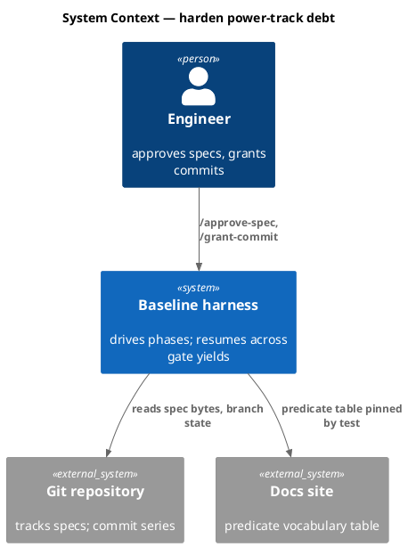

### C4 — Container

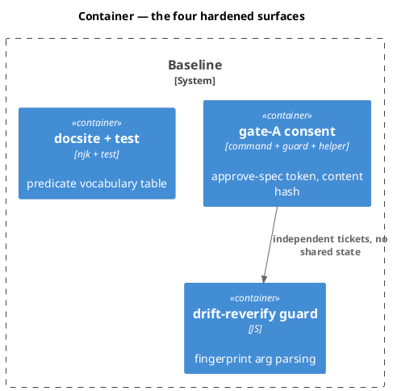

### C4 — Component (changed containers only)

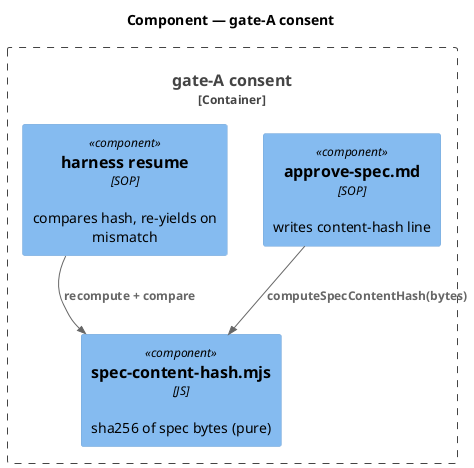

### Data model — class diagram

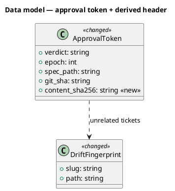

#### Migration DDL

```sql
-- No relational store. The approval token is a plaintext file; the drift
-- fingerprint is a small state file. forward: none. reverse: none.
```

### Behavior — sequence per AC

#### §Behavior #1 — AC-001: token carries a content hash for an untracked spec

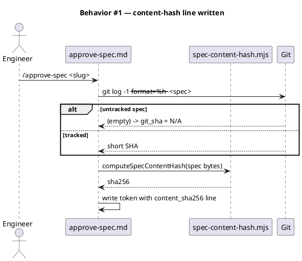

#### §Behavior #2 — AC-002: harness resume re-yields on a post-approval amendment

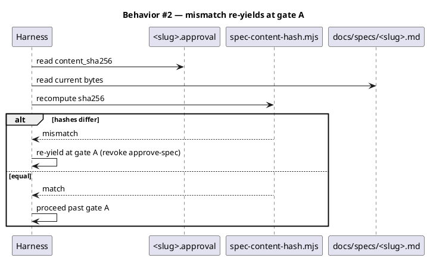

#### §Behavior #3 — AC-003: an unchanged spec proceeds

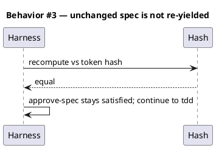

#### §Behavior #4 — AC-004/AC-005: drift-reverify accepts both arg forms

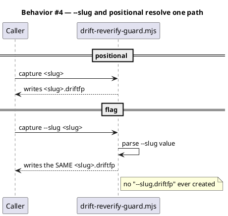

#### §Behavior #5 — AC-006/AC-007: docsite table pinned to V1_PREDICATES

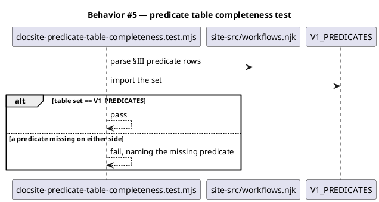

#### §Behavior #8 — AC-011/AC-012: full gates green

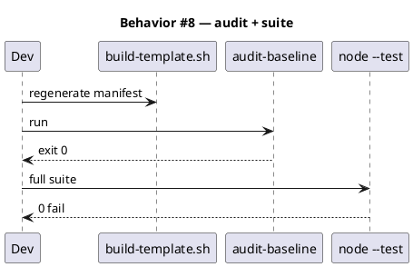

### State — core entity *(only if stateful)*

No state machine is introduced. The approval token gains a field; the derived header is static text. Heading retained to mark the explicit choice.

### Dependencies — graph

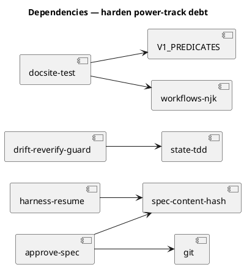

### Contracts

| Kind | Name | Input | Output | Errors | Idempotent |
|---|---|---|---|---|---|
| JS | `computeSpecContentHash(bytes)` | spec file bytes / string | sha256 hex | throws on non-string/buffer | yes (pure) |
| SOP | harness resume hash-check | token + live spec | proceed \| re-yield | missing token → re-yield | yes |
| JS | `drift-reverify-guard main(argv)` | `[sub, slug]` OR `[sub, "--slug", slug]` | fingerprint path | no slug → REVERIFY | yes |
| Test | docsite predicate completeness | njk table + V1_PREDICATES | pass/fail | — | yes |

### Libraries and versions

| Library@version | Purpose | Key APIs | Confirmed against current docs |
|---|---|---|---|
| node:crypto (stdlib) | sha256 of spec bytes | `createHash('sha256')` | yes — Node stdlib, no third-party dep |

### Alternatives considered

| Alt | Summary | Rejected because |
|---|---|---|
| A | Make the token's git-SHA line meaningful by `git add -N` the spec at approval | Mutates the index as a side effect of approval; a content hash is inert and works for any file. |
| B | Change the two SKILL.md docs to the positional form (T2) | The docs promised `--slug`; aligning code to the promise is lower-surprise and self-documenting. |

## Design calls

The write set does not intersect `project.json → tdd.ui_globs` (site-src/workflows.njk is `.njk`, matched by `**/*.njk` — see note). Re-checking: `**/*.njk` IS in ui_globs, so the njk edit could trip the design-calls guard. But T3 only adds a *test* against the existing table; it makes no visual/design change to the page. No design call is warranted.

- *(none — T3 adds a completeness test, not a design change; the njk table content is unchanged)*

## Acceptance criteria

| ID | Criterion (given / when / then) | Kind | Upstream AC | Sequence |
|---|---|---|---|---|
| AC-001 | given an untracked spec, when `/approve-spec` runs, then the token carries a `content_sha256` line even though the git SHA is `N/A` | behavior | T1 | §Behavior #1 |
| AC-002 | given an approved spec later amended, when the harness resumes, then it re-yields at gate A rather than proceeding | behavior | T1 | §Behavior #2 |
| AC-003 | given an approved spec unchanged since approval, when the harness resumes, then it proceeds past gate A | behavior | T1 | §Behavior #3 |
| AC-004 | given `capture <slug>` and `capture --slug <slug>`, when each runs, then both resolve the identical fingerprint path | behavior | T2 | §Behavior #4 |
| AC-005 | given the `--slug` form, when it runs, then no file named `--slug.driftfp` is ever created | error-mapping | T2 | §Behavior #4 |
| AC-006 | given a predicate present in `V1_PREDICATES` but absent from the njk table, when the completeness test runs, then it fails naming the predicate | behavior | T3 | §Behavior #5 |
| AC-007 | given the current corrected 7-row table, when the test runs, then it passes | behavior | T3 | §Behavior #5 |
| AC-011 | given the finished batch, when `audit-baseline` runs, then it exits 0 (asserted by `tests/harden-batch-audit-green.test.mjs`) | preflight | n/a | §Behavior #8 |

## Test plan

| Category | Scenario | Expected | Covers |
|---|---|---|---|
| Golden path | approve an untracked-spec fixture | token has content_sha256 | AC-001 |
| Golden path | resume after amending an approved spec fixture | re-yield signalled | AC-002 |
| Golden path | resume with unchanged spec | proceed | AC-003 |
| Golden path | `capture <slug>` vs `capture --slug <slug>` | identical path | AC-004 |
| Failure mode | the `--slug` form | no `--slug.driftfp` on disk | AC-005 |
| Contract violation | njk table missing a V1 predicate (synthetic) | test fails naming it | AC-006 |
| Golden path | live njk table | test passes | AC-007 |
| Input boundary | `computeSpecContentHash` on empty / large / unicode spec | stable hex, no throw | AC-001 |
| Regression trap | positional slug still works unchanged | back-compat green | AC-004 |
| Preflight | audit-baseline | exit 0 | AC-011 |
| Regression trap | full suite | 0 fail | AC-012 |

## Observability

| Signal | Name | Shape | Purpose |
|---|---|---|---|
| Log | `harness.gate_a_rehash` | fields: `slug`, `match` | proves the resume hash-check ran (AC-002/003) |
| Log | `approve.content_hash` | fields: `slug`, `git_tracked` | shows the hash was written even when untracked (AC-001) |

## Rollout

### Prerequisites

| # | Prerequisite | enforced-by |
|---|---|---|
| 1 | The content hash is written on every approval, tracked or not (verified by the content-hash unit test + the audit gate) | AC-011 |
| 2 | A post-approval amendment re-yields, not silently proceeds (verified by the resume-mismatch unit test + the audit gate) | AC-011 |
| 3 | The `--slug` form never creates a `--slug.driftfp` | AC-005 |
| 5 | The manifest is regenerated and audit-baseline exits 0 | AC-011 |

- **Feature flag**: none. `velocity.power_mode.enabled: true` is a track selector, flipped pre-triage and committed with this batch (not a gate on these changes).
- **Migration order**: T1/T2/T3 are independent and land in any order → `build-template.sh` (manifest rehash for the new `.claude/hooks/lib/` helper) → audit.
- **Canary**: this repo. T1's re-yield behavior goes live the NEXT workflow (introduction-workflow pattern — this batch's own gate A still uses the old path-only token).

## Rollback

- **Kill-switch**: T1 is additive (a new token line + a resume check) — reverting the harness resume comparison restores prior behavior with no data migration. T2/T3 are self-contained.
- **Signal to roll back**: `audit-baseline` non-zero, or a spurious gate-A re-yield on an unchanged spec (AC-003 regression). Either is detectable in one suite run, which is in CI.

## Archive plan

- Defaults *(automatic)*: spec, spec approval, per-ticket security reports (concatenated), timing.
- Extras *(list any non-default files)*:
  - *(none)*

## Open questions

- *(none — the four tickets are settled backlog items with recorded verbatim; the design above resolves each.)*
