# Spec — Power track completion and the `requires_config_flag` precondition

## Context

| Input | Path |
|---|---|
| Intake | *(none — `spec-entry` track; entry phase is `spec`)* |
| BRD *(if any)* | *(none)* |
| Scout *(if any)* | *(none)* |
| Research *(if any)* | *(none)* |

Prior art, for context only: `../erp/docs/adr/0034-power-workflow-track.md` (Accepted 2026-07-04) and its archived bundle. Its *wiring approach* is adopted; its project-specific concepts are not (see **Non-goals**).

**Write set**: `docs/init/seed.md`, `CLAUDE.md`, `.claude/schemas/workflow-track.v1.json`, `src/cli/workflows-validator-predicates.js`, `src/cli/workflows-validator-invariants.js`, `.claude/workflows.jsonl`, `.claude/skills/triage/SKILL.md`, `.claude/skills/security/SKILL.md`, `.claude/skills/commit/SKILL.md`, `src/project.template.json`, `tests/**`

**Derived — never hand-edited** (they appear in the diff, produced by the two `## Rollout` commands): `src/seed.template.md`, `src/CLAUDE.template.md` (via `sync-constitution-mirror.mjs`, **D8**); `.claude/skills/triage/workflows-validator-predicates.js`, `.claude/skills/triage/workflows-validator-invariants.js` (via `build-template.sh` Stage 0b, **D9**); `obj/template/**` including the manifest.

Resolved via `.claude/hooks/lib/write-set-profile.mjs → resolveProfile`: profile `full`. `.claude/schemas/*.json`, `.claude/workflows.jsonl`, and `src/project.template.json` fall outside every `artifacts.diagram_profiles[].when` glob, and a single uncovered path forces the full C4 set.

## Goal

A workflow track can declare a `project.json` feature flag as a **structural precondition**, and the `power` batch-sprint track's two defining behaviours — per-ticket `security` and the ordered commit split — execute from the skills the harness actually invokes.

## Non-goals

- Shipping the `org` **track** to `src/.claude/workflows.template.jsonl`. `org` gains the precondition (proving the predicate generalises); its release is separate work.
- A bespoke code-level precondition evaluator. The predicate is honoured by `/triage` exactly as its six siblings are (see **Decisions → D1**).
- Registering `spec-diagram` / `spec-traceability` in the tier dial's `CANONICAL_CHECKERS` (see **Open questions**).
- `CLAUDE.md` VI.7 read-before-overwrite; `docs/handoff/*` brief corrections.
- Any concept specific to a downstream consumer project: no `governance-review` phase (this baseline ships no such skill), no build-tool or architecture-test citations, no external ADR numbering, no rule-of-N.
- Changing the behaviour of any existing track.

## Decisions

Recorded per CLAUDE.md Article XI.12 — routine engineering forks are decided in main context and reviewed at gate A, not asked.

| # | Decision | Rationale | Owner |
|---|---|---|---|
| D1 | The predicate is evaluated by `/triage` reading `project.json`; invariant I11 mechanically validates only the **name**. No bespoke code evaluator. | This is exactly the strength of all six sibling predicates (`requires_git` is evaluated the same way). A code evaluator for one predicate would be inconsistent, and no AC requires it. The fence's honesty comes from I11 + the schema, not from a second execution path. | engineer |
| D7 | Registering a predicate is a **three-place** constitutional change: `seed.md §18.4` (the table), `src/cli/workflows-validator-predicates.js` (`V1_PREDICATES`), and `CLAUDE.md` Article IV. The JSON Schema's `Predicate.name` enum is a fourth, declarative gate. | The predicates module states this contract in its own header. `workflows-validator-invariants.js` holds no name list — I11 delegates to `isKnownPredicate`. Omitting the module makes AC-001 unimplementable. | engineer |
| D9 | The five `workflows.jsonl`-driven JS modules are **canonical under `src/cli/`**; the `.claude/skills/{triage,harness}/*.js` copies are build-time mirrors. Edit `src/cli/`; never the mirror. | `scripts/build-template.sh` Stage 0b runs a plain `cp "$src" "$dst"`, so an edit to the `.claude/` copy is **silently clobbered** by the very build this spec's rollout mandates. `tests/vendored-mirror-bytes.test.mjs` enforces byte-equality across each pair, and `tests/byte-equivalent-migration.test.mjs` imports from `src/cli/`. Same class as D8 — a derived artifact was mistaken for a source. | engineer |
| D11 | The commit-ordering invariant (formerly AC-007) lives in `## Rollout`, not the AC table. The AC table now runs AC-001…AC-006 and AC-008…AC-011; the ids are **not renumbered**. | `drift_check.mjs` marks an AC resolved only when its literal id appears in an ADDED line of the working-tree diff. A process invariant about the commit series has no code and no diff line, so it can never resolve and the drift-check tick would yield forever; the tool has no exemption mechanism. Renumbering would silently invalidate the AC ids already annotated in the tests and cited in this spec's sequences. | engineer |
| D10 | The JSON Schema is **not enforced at runtime**. `workflows-validator.js` only checks `$schema` membership in `SUPPORTED_SCHEMAS` and hand-rolls field checks; no schema engine is installed. Predicate **param** well-formedness is therefore validated in JS by a new `validatePredicateParams(pred)`, called from I11. | Without this the Test-plan row *"`path` present, `equals` missing → rejected"* is unsatisfiable. The schema edit remains the declared, manifest-hashed contract. Does not weaken D1: `resolveConfigFlag` is a pure primitive, precedented by `requires_commit_consent`, which already resolves through `isAutonomousFeatureLanding()`. | engineer |
| D8 | `src/seed.template.md` and `src/CLAUDE.template.md` are **derived**, never hand-edited. Amend the live files, then run `node scripts/sync-constitution-mirror.mjs --write`. | The mirror contract is not whole-file byte equality: `seed` is spliced (live head + the template's reserved `§16` placeholder + live tail), and only `CLAUDE` is a full byte copy (`tests/seed-template-parity.test.mjs`). Hand-editing the seed template would overwrite the `§16` carve-out. | engineer |
| D2 | Introducing a generic predicate rather than a one-off `requires_power_mode`. | Three concrete consumers exist **today**: `velocity.power_mode`, `velocity.org_mode`, `velocity.sprint_mode`. This clears VI.4's "abstract at the third concrete use case". It is not speculative generality. | engineer |
| D3 | Commit consent resolves through this repo's `.claude/hooks/lib/consent-decision.mjs` (workflow-slug-scoped **with** a time-window fallback), not the fail-closed prior-art variant. | Fail-closed-on-no-workflow forbids every ad-hoc commit on a repo that protects all branches — which this one does (`git.protected_branches: null`). Ours is a strict generalisation. | engineer |
| D4 | Per-ticket `security` is **built**, not deferred. | It is spec-committed scope in the prior art and was never implemented there. VI.4 two-sided faithful scope: deferring committed scope requires a `deferred:` tag from `dependency\|risk\|cost\|human-directed`; none applies. YAGNI gates speculation beyond a spec, never committed scope. | engineer |
| D5 | Per-ticket iteration lives **inside** the `security` phase skill (static DAG, in-skill loop), not as runtime node fan-out. | The TaskList materializer cannot expand a runtime-sized list. In-skill iteration adds no node, no subagent, and no consent path — Article II is untouched. | engineer |
| D6 | This change ships on the `spec-entry` track, not `power`. | `power` cannot exercise itself: its behaviours are the thing being built. This repo's established introduction-workflow pattern (`rightsize-gate`, `drift-reverify-skip`, `checker-fanout`) is that new machinery goes live on the **next** workflow. | engineer |

## Design

Diagrams are the contract. Prose is only for things a diagram cannot say.

### C4 — System context

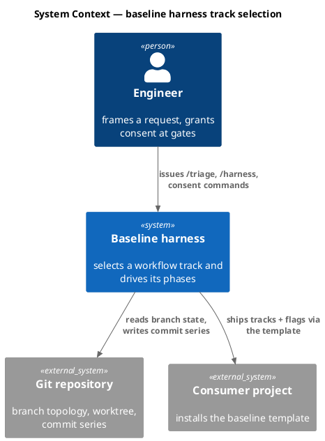

### C4 — Container

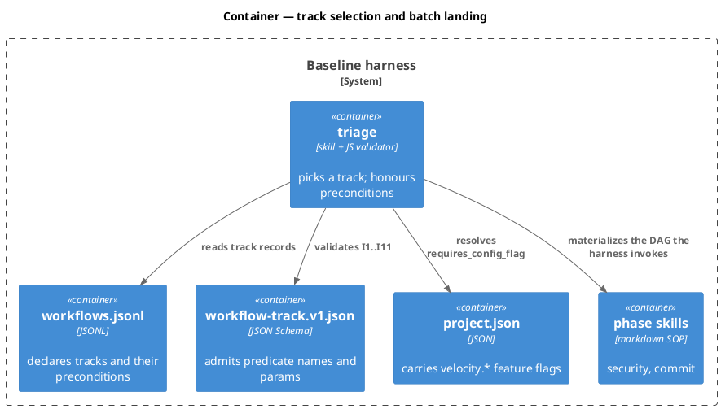

### C4 — Component (changed containers only)

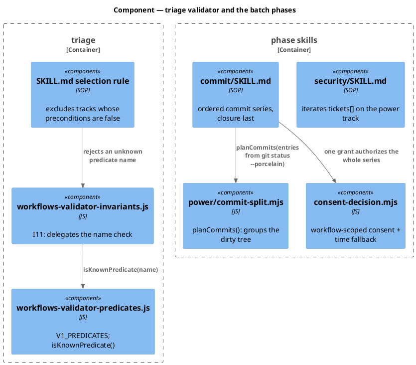

### Data model — class diagram

The change introduces no relational entity. The structures below are JSON documents on disk; the class diagram is their shape contract.

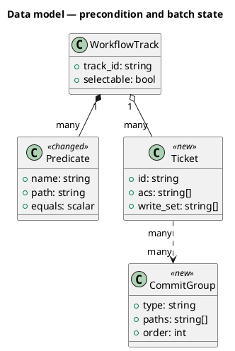

#### Migration DDL

```sql
-- No relational store participates in this change.
-- `Predicate`, `Ticket`, and `CommitGroup` are JSON documents
-- (.claude/workflows.jsonl and .claude/state/workflow.json).
-- forward: none
-- reverse: none
```

### Behavior — sequence per AC

#### §Behavior #1 — AC-001: the predicate name resolves under I11

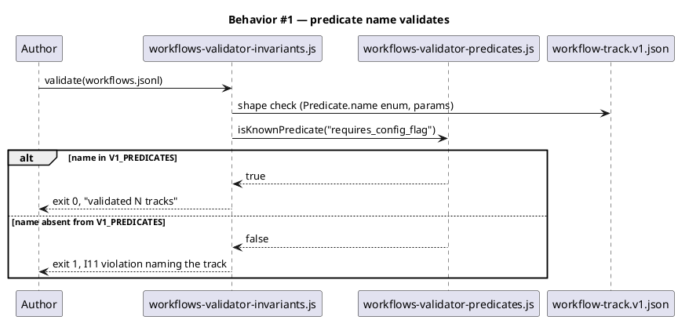

I11 holds no name list of its own: `workflows-validator-invariants.js` imports `isKnownPredicate` from `workflows-validator-predicates.js`, whose frozen `V1_PREDICATES` set is the single source of truth. Both modules are canonical under **`src/cli/`** (**D9**); the `.claude/skills/triage/` copies are Stage-0b mirrors. Registering `requires_config_flag` therefore requires editing `src/cli/workflows-validator-predicates.js`, the `seed.md §18.4` table, `CLAUDE.md` Article IV, and the schema's `Predicate.name` enum (**D7**). Param well-formedness is checked by `validatePredicateParams`, called from I11 (**D10**), because the schema is not enforced at runtime.

#### §Behavior #2 — AC-002: a false flag excludes the track before ranking

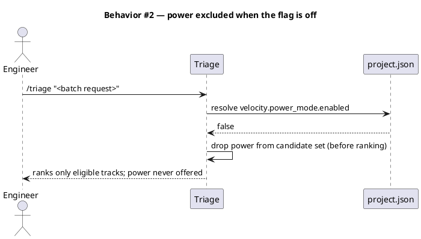

#### §Behavior #3 — AC-003: an enabled flag makes the track selectable

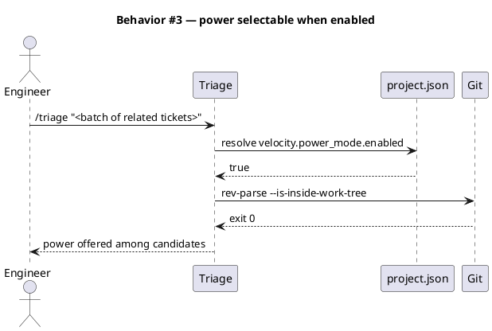

#### §Behavior #4 — AC-004: security iterates every ticket

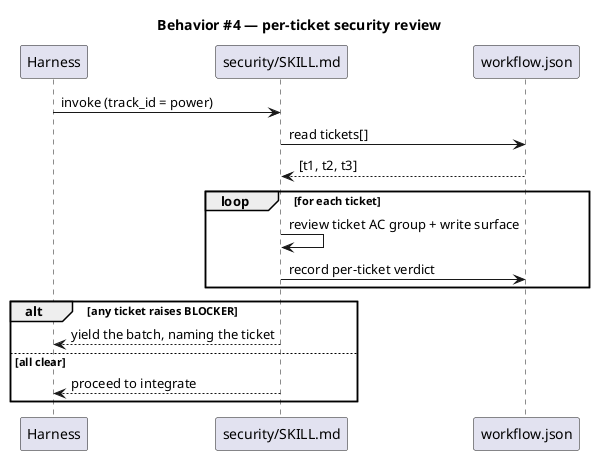

#### §Behavior #5 — AC-005: ordered commit series under one consent

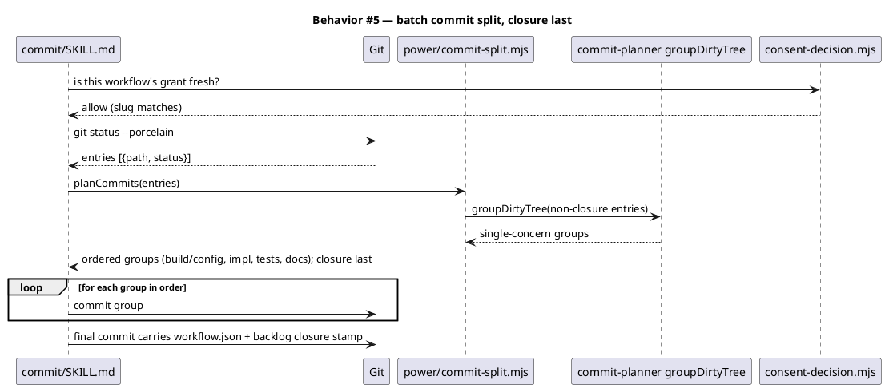

`commit-planner/inventory.mjs` exposes **no CLI entrypoint** — it exports `groupDirtyTree` only, and `planCommits` imports it directly. The commit skill therefore parses `git status --porcelain` itself and calls `planCommits(entries)`; it SHALL NOT shell out to `inventory.mjs`.

#### §Behavior #6 — AC-006: the template ships both flags

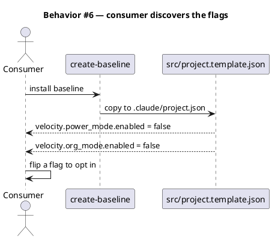

#### §Behavior #7 — AC-007: the commit series proves precedence order

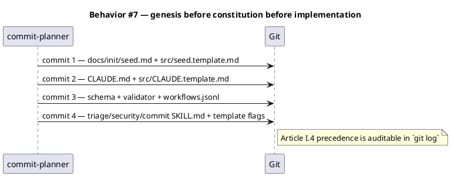

#### §Behavior #8 — AC-008: canonical tracks are byte-unchanged

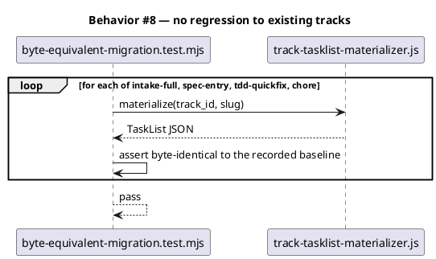

#### §Behavior #9 — AC-009 / AC-010: audit and constitution invariants

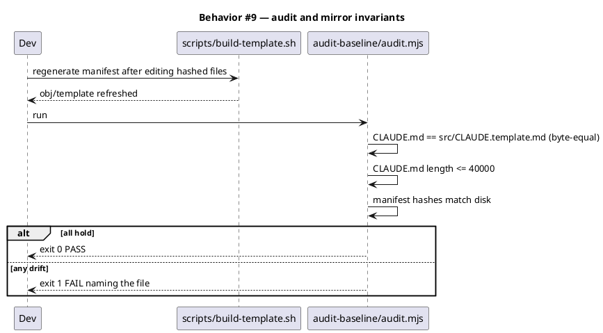

#### §Behavior #10 — AC-011: an absent flag fails safe

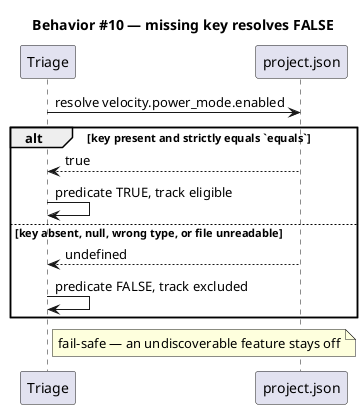

### State — core entity *(only if stateful)*

The predicate is a pure function of `project.json`; the track has no lifecycle of its own. No state machine is introduced. Heading retained so the choice is explicit.

### Dependencies — graph

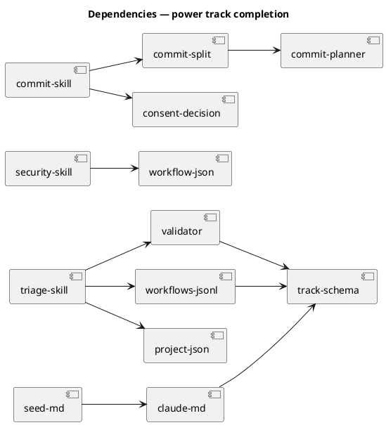

### Contracts

| Kind | Name | Input | Output | Errors | Idempotent |
|---|---|---|---|---|---|
| Predicate | `requires_config_flag` | `{path: string, equals: scalar}` | `boolean` | unresolvable path → `false` | yes (pure) |
| JS | `isKnownPredicate(name)` | `string` | `boolean` — membership in frozen `V1_PREDICATES` | none; unknown name → `false` | yes (pure) |
| JS | `planCommits(entries)` | `[{path, status}]` parsed from `git status --porcelain` | ordered `CommitGroup[]`, closure last | non-array → `[]`; no CLI on `inventory.mjs` | yes (pure) |
| SOP | `security` on `track_id == "power"` | `workflow.json → tickets[]` | one verdict per ticket | any BLOCKER → yield batch | yes |
| SOP | `commit` on `track_id == "power"` | dirty tree + one grant | ordered commit series | closure split → guard blocks | no |

### Libraries and versions

| Library@version | Purpose | Key APIs | Confirmed against current docs |
|---|---|---|---|
| *(none)* | This change introduces no third-party dependency. Node stdlib and existing in-repo modules only. | — | n/a — VI.5 current-docs rule does not apply |

### Alternatives considered

| Alt | Summary | Rejected because |
|---|---|---|
| A | A one-off `requires_power_mode` predicate | Solves one of three identical live defects; `org_mode` and `sprint_mode` would each need their own. Generic predicate is the same work. |
| B | Keep the fence as prose in `triage/SKILL.md` (prior-art approach) | Leaves the schema unable to express "off", so I11 cannot validate it and a track stays `selectable: true` while disabled. That is the defect being fixed. |
| C | Add a `power` node to the track DAG so `power/SKILL.md` is invoked | Introduces a node that is not a workflow phase, and the amortized phases still would not know about tickets. Wiring the behaviours into the phases that already run is smaller and matches how every other skill reaches the model. |
| D | Build a code-level precondition evaluator | Inconsistent with all six sibling predicates, none of which have one. No AC requires it. See D1. |

## Design calls

The write set does not intersect `project.json → tdd.ui_globs` — this change touches no UI surface.

- *(none)*

## Acceptance criteria

| ID | Criterion (given / when / then) | Kind | Upstream AC | Sequence |
|---|---|---|---|---|
| AC-001 | given a track declaring `requires_config_flag`, when `seed-tasklist.mjs --validate-only` runs, then it exits 0 and I11 resolves the name | preflight | n/a | §Behavior #1 |
| AC-002 | given `velocity.power_mode.enabled: false`, when `/triage` builds its candidate set, then `power` is excluded **before** ranking | behavior | n/a | §Behavior #2 |
| AC-003 | given `velocity.power_mode.enabled: true` and a git repo, when `/triage` builds its candidate set, then `power` is selectable | behavior | n/a | §Behavior #3 |
| AC-004 | given a power workflow over N tickets, when `security` runs, then it reviews each ticket exactly once, records a per-ticket verdict, and yields the batch on any BLOCKER; no ticket is silently skipped | behavior | n/a | §Behavior #4 |
| AC-005 | given a finished power batch, when `commit` runs, then it emits ordered Conventional Commits with the closure stamp on the final commit, all under one workflow-scoped consent | behavior | n/a | §Behavior #5 |
| AC-006 | given a fresh install, when the template is copied, then `.claude/project.json` carries `velocity.power_mode.enabled` and `velocity.org_mode.enabled`, both `false` | preflight | n/a | §Behavior #6 |
| AC-008 | given the four canonical selectable tracks, when their TaskLists are materialized, then they are byte-unchanged | smoke | n/a | §Behavior #8 |
| AC-009 | given the finished change, when `node .claude/skills/audit-baseline/audit.mjs` runs, then it exits 0 | preflight | n/a | §Behavior #9 |
| AC-010 | given the finished change, when the audit runs, then `CLAUDE.md` and `src/CLAUDE.template.md` are byte-equal and `CLAUDE.md` is under 40,000 characters | preflight | n/a | §Behavior #9 |
| AC-011 | given `velocity.power_mode.enabled` is absent, null, or a non-matching type, when the predicate is resolved, then it is `false` and the track is excluded | error-mapping | n/a | §Behavior #10 |

## Test plan

| Category | Scenario | Expected | Covers |
|---|---|---|---|
| Golden path | `workflows.jsonl` declares `requires_config_flag` on power + org | `--validate-only` exits 0 | AC-001 |
| Golden path | flag `true` + git repo | power in candidate set | AC-003 |
| Golden path | power batch of 3 tickets reaches `security` | 3 verdicts recorded | AC-004 |
| Golden path | power batch reaches `commit` | ordered groups, closure on final commit | AC-005 |
| Input boundary | `equals: false` matched against `false` | predicate TRUE (strict equality, not truthiness) | AC-011 |
| Input boundary | `path` with a single segment; deep dot-path; empty string | resolves or fails safe, never throws | AC-011 |
| Contract violation | predicate name misspelled (`requires_config_flags`) | I11 fails, names the offending track | AC-001 |
| Contract violation | `path` present, `equals` missing | schema rejects the track record | AC-001 |
| Failure mode | `project.json` unreadable / malformed JSON | predicate FALSE; triage excludes; never throws | AC-011 |
| Failure mode | `velocity.power_mode.enabled` absent entirely | predicate FALSE; power excluded | AC-002, AC-011 |
| Failure mode | power workflow with empty `tickets[]` | `security` yields rather than reviewing zero tickets | AC-004 |
| Concurrency / ordering | commit groups emitted while the consent TTL expires mid-series | remaining commits blocked by `git_commit_guard`; no partial closure stamp | AC-005 |
| Regression trap | four canonical tracks' materialized TaskLists | byte-identical | AC-008 |
| Regression trap | a track with `preconditions: []` | unchanged selection behaviour | AC-008 |
| Regression trap | `CLAUDE.md` ↔ `src/CLAUDE.template.md` | byte-equal, under cap | AC-010 |
| Regression trap | manifest hashes after `build-template.sh` | audit exits 0 | AC-009 |

## Observability

| Signal | Name | Shape | Purpose |
|---|---|---|---|
| Log | `triage.track_excluded` | fields: `track_id`, `predicate`, `path`, `resolved` | explains why a track was not offered |
| Log | `security.ticket_verdict` | fields: `slug`, `ticket_id`, `verdict` | proves no ticket was silently skipped (AC-004) |
| Log | `commit.batch_group` | fields: `slug`, `group_type`, `order`, `sha` | audits the ordered series (AC-005, AC-007) |
| Metric | `audit_baseline_exit` | counter, labels: `result` | drift detection in CI |

## Rollout

### Prerequisites

| # | Prerequisite | enforced-by |
|---|---|---|
| 1 | The predicate name resolves under I11 before any track declares it | AC-001 |
| 2 | An absent or malformed flag resolves the predicate FALSE (feature stays off) | AC-011 |
| 3 | The four canonical selectable tracks are unaffected | AC-008 |
| 4 | The manifest is regenerated and `audit-baseline` exits 0 | AC-009 |
| 5 | The constitution mirror stays byte-equal and under the size cap | AC-010 |
| 6 | The template ships both flags default-off before either track can be enabled | AC-006 |

- **Feature flag**: `velocity.power_mode.enabled` — default off; `velocity.org_mode.enabled` — default off.
- **Migration order**: 1 `seed.md` §18.4 → 2 `CLAUDE.md` Article IV → 3 schema enum + `src/cli/workflows-validator-predicates.js` + `src/cli/workflows-validator-invariants.js` + `workflows.jsonl` → 4 phase skills + `src/project.template.json` → 5 `node scripts/sync-constitution-mirror.mjs --write` (derives both template mirrors — D8) → 6 `bash scripts/build-template.sh` (syncs the vendored JS mirrors via Stage 0b — D9 — and regenerates `obj/template` + the manifest). Steps 5 and 6 produce every derived artifact; **never hand-edit one**.
- **Commit-series invariant (Article I.4 precedence).** The commit series SHALL prove `seed.md` landed before `CLAUDE.md` before the implementation, matching the migration order above. This is a **sequencing invariant, not an acceptance criterion**: it constrains the shape of the commit series, which does not exist while the working tree is being checked. It is audited in `git log` and enforced by the `commit` phase's ordering, and it is deliberately absent from the AC table — `drift_check.mjs` resolves an AC only when its id appears in an added diff line, so a process-only AC can never resolve and would wedge the drift gate forever (**D11**). §Behavior #7 diagrams the intended series.
- **Canary**: this repo is the canary. `power_mode` stays `false` here after landing; the first real power run is a later, deliberate workflow (introduction-workflow pattern, D6).

## Rollback

- **Kill-switch**: set `velocity.power_mode.enabled: false` (already the default). The predicate resolves FALSE and `/triage` excludes the track. No revert required to disable the feature.
- **Signal to roll back**: `audit-baseline` exits non-zero, **or** `seed-tasklist.mjs --validate-only` exits non-zero, **or** `/triage` offers `power` while the flag is `false`. Any of these is detectable in under 5 minutes by running the two commands; both are in CI.

## Archive plan

- Defaults *(automatic)*: spec, spec-rendered/, spec approval, security report, timing.
- Extras *(list any non-default files)*:
  - *(none)*

## Open questions

- **Review-integrity caveat for this gate.** `velocity.checker_fanout.checkers` names `spec-diagram`, `spec-traceability`, and `spec-rollout`, but only `spec-rollout` appears in the tier dial's `CANONICAL_CHECKERS`. `resolveCheckerThreshold` returns `DEFAULT_THRESHOLD` (`mandatory: false`) for an unregistered checker — and returns it *before* consulting `tier.overrides` — so the diagram and traceability oracles cannot emit a BLOCKER in any tier. Their findings on **this** spec will therefore surface as ADVISORY only. This is a pre-existing defect, out of scope here (**Non-goals**), and is called out so the approver knows the strength of the review backing this gate. Fixing it is proposed as the immediately following workflow.
