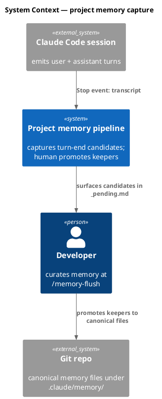
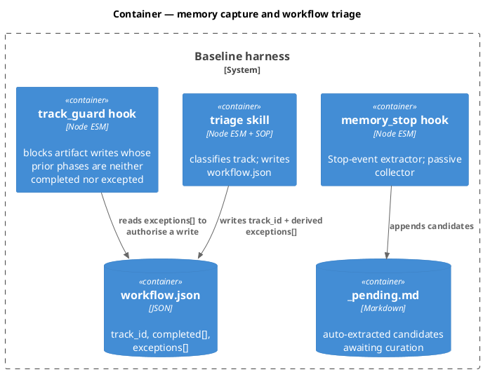
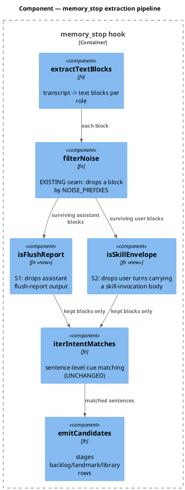
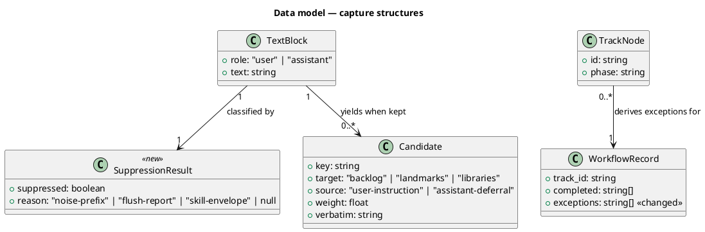
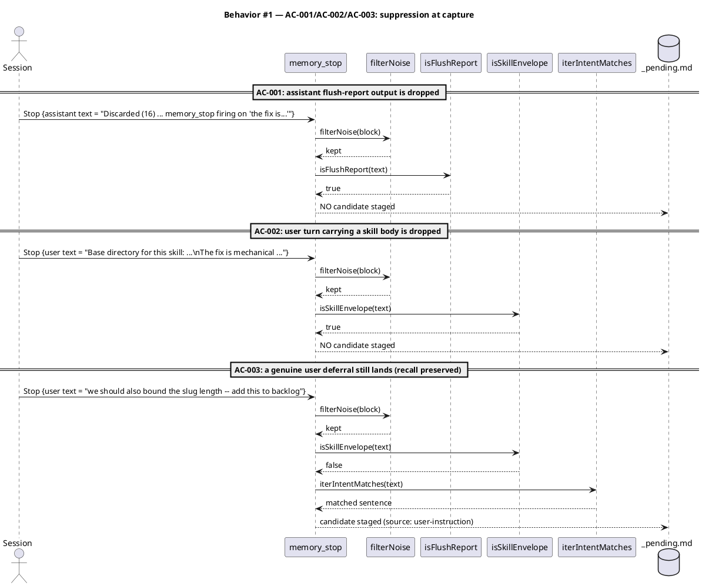
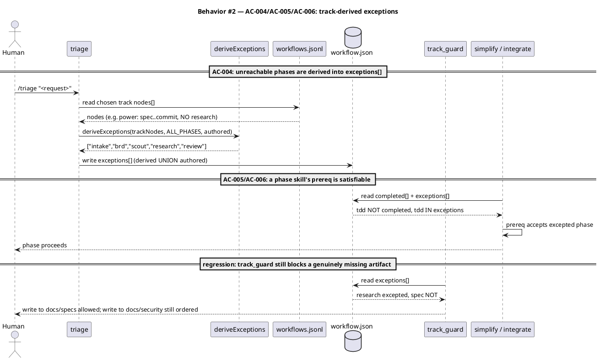
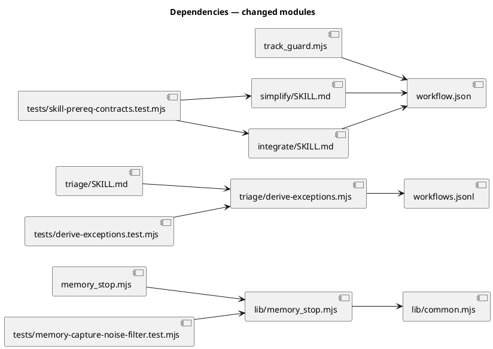

# Extractor noise filter + track-derived phase exceptions

## Context

| Input | Path |
|---|---|
| Intake | *(none — power batch derived from committed evidence)* |
| BRD *(if any)* | *(none)* |
| Scout *(if any)* | *(none)* |
| Research *(if any)* | *(none)* |
| Evidence T1 | `.claude/memory/landmines.md → memory-stop-extractor-recursive-noise-loop-on-the-fix-is-prose` (committed `1414f27`) |
| Evidence T2 | `.claude/memory/landmines.md → chore-track-integrate-and-simplify-prereqs-are-structurally-unsatisfiable` (committed `1414f27`) |

**Write set**: `.claude/hooks/lib/memory_stop.mjs`, `.claude/hooks/lib/common.mjs`, `.claude/skills/triage/derive-exceptions.mjs`, `.claude/skills/triage/SKILL.md`, `.claude/skills/triage/workflows-validator.js`, `.claude/skills/integrate/SKILL.md`, `.claude/skills/simplify/SKILL.md`, `.claude/skills/chore/SKILL.md`, `.claude/skills/chore/sensitive-surface.mjs`, `.claude/workflows.jsonl`, `tests/memory-capture-noise-filter.test.mjs`, `tests/derive-exceptions.test.mjs`, `tests/skill-prereq-contracts.test.mjs`, `tests/chore-sensitive-security.test.mjs`

> **Write-set amendment (2026-07-13, found at `/tdd` contract time — re-approval required).** `.claude/skills/triage/workflows-validator.js` was ADDED. T3 puts `internal_phases[]` on the chore track, but that validator enforces a **closed** `KNOWN_TRACK_FIELDS` set (`workflows-validator.js:92`) and rejects any unknown track field outright — so T3 is unimplementable without extending it. The omission was a spec defect, not a scope creep; widening the write_set silently would have been exactly the sort of unauthorised expansion the write_set exists to prevent. Note `.claude/hooks/lib/write-set-profile.mjs` is deliberately NOT added: `common.mjs` already exports `matchAnyGlob` (line 473), which `sensitive-surface.mjs` reuses (Art. VI.4 — no third glob implementation).

The write set touches `.claude/hooks/**`, a `security.sensitive_globs` path, so the **full** C4 diagram profile applies (`resolveProfile` forces it — documentation is never thinned for a sensitive surface).

## Goal

`memory_stop` stops staging its own output and contract prose as memory candidates, and `/triage` derives a track's unreachable phases into `exceptions[]` so no phase skill declares a prereq its own track cannot satisfy.

## Non-goals

- Redesigning the memory system. That is backlog `-7f3a` and needs its own cycle; this spec fixes the *capture* precision defect only.
- Changing what `memory_stop` extracts. The `seed.md §4.1` contract ("user/assistant text-block intent lines → backlog") is unchanged; only precision rises. This is why no `seed.md` amendment is required (Art. VIII; precedent `97b3e6d`).
- Semantic classification of candidates. The filter is lexical and deterministic. The model remains the semantic backstop at `/memory-flush`.
- Adding a `security` node to the chore DAG (see `## Decisions`, rejected alternative B).

## Decisions

| # | Decision | Owner | Rationale |
|---|---|---|---|
| D1 | Filter by **source shape**, not by weakening `DECISION_CUE_RE`. | engineer | The cue `the (fix\|plan\|approach) is` has real recall — a user genuinely saying "the fix is to bound the quantifier" IS a decision worth capturing. The defect is not the cue; it is that report output and contract prose are fed to it. Neutering the regex would trade a false-positive problem for a false-negative one. Suppress the *text blocks* that must never be mined; leave the cue intact. |
| D2 | Two new suppressions: (S1) assistant text matching the `/memory-flush` **report shape**; (S2) user text carrying the **skill-invocation envelope**. | engineer | S1 kills the recursion directly (a flush report can no longer become next session's candidates). S2 fixes the mis-attribution: SKILL.md and CLAUDE.md contract prose reaches the model as `role: user` messages, so instructional text was being tagged `source: user-instruction`. Both are lexical, cheap, and deterministic. |
| D3 | `/triage` **derives** `exceptions[]` from the chosen track's DAG: any pipeline phase with no node in the track is unreachable and is auto-excepted. Union with any hand-authored exceptions. | engineer | This is the ROOT CAUSE of T2, not the prose. Proven during this very workflow: the `power` DAG has no `research` node, `exceptions` was written empty, and `track_guard` blocked the spec write — the identical defect one workflow after documenting it on `chore`. A prose-only fix would have repaired `chore` and left `power` broken. Deriving from the DAG fixes chore (`security`, `tdd` auto-excepted), fixes power (`research`), and immunises every future track. It is also mechanically testable, which prose is not. |
| D4 | Rejected alternative B: give `chore` an explicit `security` node + conditional trigger. | engineer | It fixes exactly one track, enlarges the chore DAG that `/triage` chose for being lean, and leaves the same trap armed for `power`, `epic`, and every track added later. D3 subsumes it. |
| D5 | `simplify` / `integrate` prereqs additionally accept a phase present in `exceptions` (not only in `completed`). | engineer | D3 makes the sets correct, but `simplify`'s prereq text reads `tdd` **in completed** and would still fail on a chore where `tdd` is excepted-not-completed. One clause each, and the two skills then agree with the DAG rather than contradicting it. |
| D6 | Fail-safe direction on the filter is **drop**, never keep. | engineer | A missed real candidate is cheap — the human re-raises it, and `BACKLOG_MARKER_RE`'s high-precision phrasings ("add this to backlog") stay live to catch explicit routing. A false candidate costs curation time at *every* flush, forever. The asymmetry is not close. |
| D7 | `deriveExceptions` carries a hard **deny-list**: it SHALL NEVER except a consent gate (`approve-spec`, `approve-swarm`, `grant-commit`) or `commit`, even when the track's DAG has no such node. Fail-closed. | engineer | Found while reviewing this spec. Invariant `I-commits` requires a `grant-commit` node on any commits-track, but **nothing requires an `approve-spec` node**. So a track carrying a `spec` node and no `approve-spec` node would have gate A auto-excepted — and `track_guard` would then permit `tdd` artifact writes with no approval token on disk. That is a consent-gate bypass introduced by the very mechanism meant to fix a prereq bug. The deny-list closes it: a missing gate node is a malformed track (a validator problem), never something the derivation silently launders into an exception. |
| D8 | The `allPhases` universe is **derived**, not hardcoded: it is the union of `metadata.phase` across every track in `.claude/workflows.jsonl` (22 phases today). | engineer | A hardcoded roster is a second source of truth that rots the moment a track adds a phase — the exact drift class this whole ticket exists to kill. Deriving the universe from the same file the tracks live in makes the roster structurally incapable of disagreeing with them. |
| D9 | **(resolves Q1)** T1 suppression is `isFlushReport(block) OR isSelfReferential(sentence)`. The first drops the `/memory-flush` report block by shape; the second drops any *sentence* that is about **candidate-extraction machinery** ("candidate(s)", "extractor", "staged", "_pending"). | human | Report-shape alone would have caught roughly 3 of the 9 observed candidates — the rest were prose *about* the flush. A whole-topic filter (anything naming `memory_stop`) would have caught all 9 **and also suppressed the T1 deferral that created this ticket** — a filter that eats its own bug report. The self-referential cue targets the recursion specifically: it drops "4 candidates were memory_stop firing on…" while sparing "memory_stop is in a recursive noise loop", which is a claim about the hook, not about extraction. Sentence-scoped, so one self-referential sentence does not suppress a whole block. |
| D10 | **(resolves Q2)** Envelope suppression is **section-level**: drop everything up to the `ARGUMENTS:` marker; keep mining below it. | human | A skill invocation is ONE `role: user` message carrying both the SKILL.md contract body (which is what smuggles CLAUDE.md's "The fix is mechanical" decision tree into `source: user-instruction`) and an `ARGUMENTS:` section. When the human types `/triage "…we should also bound the slug length later"`, that deferral lands in ARGUMENTS. Block-level suppression would silently lose it — a NEW false negative introduced by the fix. Section-level costs a boundary split and preserves recall. |
| D12 | **Root cause of the envelope leak is a MIS-ANCHORED existing check, not a missing one.** The fix re-anchors `isBoilerplate`; it does not introduce a new concept. | engineer | Found at `/tdd` contract time by reading the code rather than trusting the spec. `common.mjs:870` ALREADY defines `SKILL_SOP_MARKER = 'Base directory for this skill:'` and `isBoilerplate()` ALREADY tests for it — but `common.mjs:876` only inspects `text.slice(0, 64)`, **the head**. A re-invoked skill body begins with `"(Re-invocation of /harness — the skill instructions were previously loaded; …)"`, which pushes the marker past the 64-char window. The guard therefore misses every re-invocation and mines the whole SOP body. This is the precise mechanism behind `the-fix-is-mechanical-implementation-mismatch-edge-case-65e6` being staged as `source: user-instruction` in two separate sessions. **Consequence for the implementation:** `stripSkillEnvelope` must detect the marker ANYWHERE in the block (not head-anchored), and `isBoilerplate`'s head-only window is itself the bug — a head-anchored check is defeated by any preamble the runtime chooses to prepend. Cheaper and more surgical than the spec originally implied. |
| D13 | **`internal_phases[]` DECLARES; the chore skill RESOLVES at runtime.** Each internal phase is resolved into exactly ONE of `completed` (its trigger fired and it ran) or `exceptions` (its trigger did not fire), with provenance recorded in `workflow.json → auto_skipped[]`. | human | Found by the `/scenario` phase before a line of implementation. D11 as first written **broke the very defect T2 exists to fix**: AC-011 forbids excepting an internal phase, so on a chore whose diff touches no sensitive glob, `security` never runs and lands in NEITHER `completed` nor `exceptions` — and `integrate`'s prereq (which needs it in one of them) still fails. Worse, it fails only on the COMMON case; a chore that *does* touch `.claude/hooks/**` runs security, lands it in `completed`, and passes. Runtime resolution fixes it at the root: `exceptions` stops being a derivation-time guess and becomes a recorded fact, asserted only after the decision is actually made. `integrate`'s prereq then works **unchanged**. Same pattern the `rightsize-gate` already uses (additive-only, `auto_skipped[]` provenance). |
| D14 | **This is RECORDING a sanctioned decision, not creating a new bypass power.** No Article IV amendment. | engineer | Article IV permits a phase bypass only via `/triage`'s exceptions array or the post-tdd right-size gate — so a third writer to `exceptions` deserves scrutiny. It survives it: the authority to skip a chore conditional **already** comes from the chore track's definition, which Article IV itself sanctions ("conditionally routes through `verify` / `simplify` / `integrate` / `document` by what the diff touches"). The chore skill is not gaining the power to skip; it already had it. What changes is that the skip stops living only in a prose end-of-chore summary and becomes an auditable entry with provenance. Strictly more transparent than today. If a future reader disagrees, the remedy is an Article IV amendment naming the chore skill as a third mechanism — not a silent revert. |
| D16 | **(found by the security RE-REVIEW of D15a — the remediation had a hole)** `stripSkillEnvelope` honours the `ARGUMENTS:` marker **only when it follows the SOP marker**. No AC changes; the Contracts row is tightened to state the resolution order exactly. | engineer | D15a's first cut used `text.indexOf(ARGUMENTS_MARKER)` — *any* occurrence. An `ARGUMENTS:` line planted BEFORE the SOP marker therefore made `argsAt = 0`, so `slice(0)` returned the **whole block, contract prose included** — re-opening the exact leak this module exists to close. **The fix's own tests passed and the full 1618-test suite passed; only the adversarial security re-review caught it**, because it asked "did the remediation introduce a new hole?" rather than "are the tests green?". This is the concrete argument for re-running `security` against its own fixes instead of trusting a verdict issued before them. Fix: `text.indexOf(ARGUMENTS_MARKER, sopAt)`. Pinned by a regression test; AC-002 and AC-016 both still hold unchanged. |
| D15 | **(security remediation — amends D9 and D10)** All three MEDIUM findings from `/security` are fixed IN THIS WORKFLOW, not backlogged. Human directive: a control does not ship with a known hole. | human | `docs/security/extractor-noise-and-prereq-drift-2026-07-13.md` — every finding reproduced by execution. Two of the three fixes contradict spec-committed decisions, so the spec is amended rather than the code being quietly changed underneath it. The three fixes: **(a)** `stripSkillEnvelope` becomes surgical (AC-016) — today it returns `''` for an envelope with no `ARGUMENTS:`, which discards the WHOLE block; a genuine deferral was reproducibly LOST because the user pasted a doc containing the SOP marker beside it. **(b)** `staged?` leaves the self-referential vocabulary (AC-017) — it matches ordinary English (`"stage the rollout"`, `"the migration is staged"`), silently dropping real deferrals that even carry the explicit `add this to backlog` marker. D6's fail-safe-to-drop assumed the drop was RARE; `stage`/`staged` is not rare. **(c)** the chore porcelain parser stops parsing human-readable output (AC-015) — `line.slice(3)` misses renames and quoted paths, so a chore that MOVES a file into `.claude/hooks/**` (i.e. adds a hook) reports `sensitive: false` and skips security review. That is exactly the gap T3 exists to close, defeated by a routine git operation. |
| D11 | **(resolves Q3 — adds ticket T3)** `chore` gains a **conditional `security` phase** that is REQUIRED when the diff intersects `project.json → security.sensitive_globs`. To keep D3 coherent with it, `.claude/workflows.jsonl` gains a per-track **`internal_phases[]`** declaration, and `deriveExceptions` subtracts it: `exceptions = allPhases − trackNodePhases − internalPhases − denyList`. | human | Without `internal_phases`, D3 would except `security` on chore (no security node in its DAG) while the chore skill was being told to run it — `exceptions` saying "skipped" while the phase executes. The same latent incoherence already exists for `verify`/`simplify`/`integrate`/`document`, which are chore-internal conditionals with no DAG node. Nothing on disk declares what a track may run internally, so the `/triage` SOP and `chore/SKILL.md` each guess and contradict each other — which is T2's root cause one level down. Declaring `internal_phases` makes the chore conditional set machine-readable for the first time and kills the contradiction at its source rather than papering over it. The `rightsize-gate` already refuses to skip `security`; chore now matches that principle instead of quietly violating it. |

## Design

### C4 — System context



### C4 — Container



### C4 — Component (changed containers only)



### Data model — class diagram

No database and no DDL — this change is entirely in-process. The class diagram models the code structures the filter operates on.



#### Migration DDL

```sql
-- No database. No schema change. Nothing to migrate or reverse.
-- forward:  (none)
-- reverse:  (none)
```

### Behavior — sequence per AC





### State — core entity *(only if stateful)*

No non-trivial state machine. A text block is classified once, kept or dropped, and never revisited. Recorded explicitly so the reviewer sees the choice rather than a missing section.

### Dependencies — graph



### Contracts

| Kind | Name | Input | Output | Errors | Idempotent |
|---|---|---|---|---|---|
| fn | `isFlushReport(text)` | `string` | `boolean` — true when the block is `/memory-flush` report output (shape: a `memory-flush — <ISO date>` header, or a `Promoted (N):` / `Discarded (N):` / `Closed (N):` / `Deferred (N)` row) | none (pure; non-string → `false`) | yes |
| fn | `isSelfReferential(sentence)` | `string` | `boolean` — true when the SENTENCE is about candidate-extraction machinery. Vocabulary: `candidate(s)`, `extractor(s)`, `_pending`. **`staged` is NOT in the vocabulary** (D15b — it matches ordinary English and dropped real deferrals). Sentence-scoped by design: one such sentence does not suppress its whole block | none (pure; non-string → `false`) | yes |
| fn | `stripSkillEnvelope(text)` | `string` | `string` — **surgical, never all-or-nothing** (D15a). Resolution order is load-bearing: (1) no envelope → the input **unchanged**; (2) boilerplate with no SOP marker (a wrapper tag) → `''`; (3) an `ARGUMENTS:` marker **that follows the SOP marker** → the portion at or below it; (4) otherwise → the text **preceding** the SOP marker (the human's own words), which is `''` only when the marker sits at the head. **The `ARGUMENTS:` marker is honoured only when it FOLLOWS the SOP body** (D16) — accepting any occurrence lets one planted *before* the marker return the whole block, contract prose included | none (pure; non-string → `''`) | yes |
| fn | `deriveExceptions(trackNodes, allPhases, internalPhases, authored)` | `Node[]`, `string[]`, `string[]`, `string[]` | `string[]` — sorted `(authored ∪ (allPhases − trackNodePhases − internalPhases)) − CONSENT_DENY_LIST` | throws a named error on a non-array `trackNodes` | yes |
| fn | `touchesSensitiveSurface(changedPaths, sensitiveGlobs)` | `string[]`, `string[]` | `boolean` — true when any changed path matches any sensitive glob | none (pure; empty/invalid input → `false`) | yes |
| CLI | `node .claude/skills/chore/sensitive-surface.mjs` | — (reads `git status --porcelain` + `project.json → security.sensitive_globs`) | JSON `{sensitive: boolean, matched: string[]}`; exit 0 | exit 0 with `{sensitive: false}` on any git error — advisory, never blocks | yes |
| CLI | `node .claude/skills/triage/derive-exceptions.mjs <track_id>` | track id | JSON `string[]` on stdout; exit 0 | exit 1 + named error on unknown track | yes |
| config | `.claude/workflows.jsonl → <track>.internal_phases[]` | — | `string[]` — phases a track's skill may run internally without a DAG node (chore: `verify`, `simplify`, `security`, `integrate`, `document`) | absent → `[]` (back-compat: every existing track keeps today's behaviour) | — |

### Libraries and versions

No third-party library is added, removed, or upgraded. Every module is in-repo and depends only on the Node standard library (`node:fs`, `node:path`, `node:test`), which is already pinned by the project's Node version. There is no third-party API surface to confirm against current docs.

| Library@version | Purpose | Key APIs | Confirmed against current docs |
|---|---|---|---|
| *(none — Node stdlib only)* | — | — | n/a |

### Alternatives considered

| Alt | Summary | Rejected because |
|---|---|---|
| A | Weaken or delete `DECISION_CUE_RE`'s `the (fix\|plan\|approach) is` alternation. | Trades false positives for false negatives. The cue has genuine recall on real user decisions; the defect is the *input* being mined, not the pattern. See D1. |
| B | Add a `security` node + conditional trigger to the `chore` DAG. | Fixes exactly one track, fattens the DAG chore was chosen for being lean, and leaves the same trap armed for `power` / `epic` / future tracks. Subsumed by D3. See D4. |
| C | Have `/memory-flush` discard report-shaped candidates at curation time. | Moves the cost instead of removing it: the candidates are still written to `_pending.md` every turn, still cost tokens at session start, and still have to be re-read and re-discarded at every flush. Suppress at capture. |
| D | Semantic (LLM) classification of each candidate at capture. | A Stop hook must be fast, deterministic, and never block. An LLM call at every turn end is none of those. The model already serves as the semantic backstop at `/memory-flush`. |

## Design calls

The write set does not intersect `project.json → tdd.ui_globs` (no `site-src/**`, no `tsx/jsx/vue/svelte`, no `html/css/scss/njk`). No UI surface.

- *(none)*

## Acceptance criteria

Every AC binds to a concrete, diff-referenceable surface. T2's ACs are prose-contract changes, so each is bound to a **structural test** asserting on the shipped file's content — that is what makes them resolvable by `drift_check`'s literal-id matcher (landmine: an outcome AC with no diff line wedges the drift tick; it has bitten twice).

| ID | Criterion (given / when / then) | Kind | Upstream AC | Sequence |
|---|---|---|---|---|
| AC-001 | given an assistant text block that is `/memory-flush` report output, when `memory_stop` extracts, then `isFlushReport` returns true and zero candidates are staged from that block | behavior | T1 landmine | §Behavior #1 |
| AC-002 | given a user text block carrying a skill-invocation envelope, when `memory_stop` extracts, then `stripSkillEnvelope` discards everything above the `ARGUMENTS:` marker — so the SKILL.md contract body (including CLAUDE.md's "The fix is mechanical" decision tree) stages zero candidates — while text at or below `ARGUMENTS:` is still mined | behavior | T1 landmine (D10) | §Behavior #1 |
| AC-003 | given a genuine user deferral ("we should also X", "add this to backlog") in an ordinary user turn **or inside a slash command's `ARGUMENTS:` section**, when `memory_stop` extracts, then a candidate IS staged with `source: user-instruction` — recall is preserved and the suppression does not over-reach | behavior | T1 landmine (fail-safe D6, D10) | §Behavior #1 |
| AC-009 | given a sentence about candidate-extraction machinery ("4 candidates were the extractor firing on…"), when `memory_stop` extracts, then `isSelfReferential` returns true and that SENTENCE stages no candidate; **and** given a sentence that is a claim about the hook itself ("memory_stop is in a recursive noise loop"), then it returns false and the deferral IS staged — the filter does not eat its own bug report | behavior | T1 landmine (D9) | §Behavior #1 |
| AC-010 | given a `chore` workflow whose diff intersects `project.json → security.sensitive_globs` (e.g. a path under `.claude/hooks/**`), when the chore skill evaluates its conditional triggers, then `security` is REQUIRED and runs; and given a diff that touches no sensitive glob, then `security` is skipped and the skip is recorded in the end-of-chore summary | behavior | T3 (D11) | §Behavior #2 |
| AC-011 | **(narrowed to DERIVATION time — D13)** given a track declaring `internal_phases[]`, when `deriveExceptions` runs at triage time, then no phase in `internal_phases` appears in the returned exceptions. Derivation must not pre-judge a conditional it cannot yet evaluate: at triage time the diff does not exist. Runtime resolution by the chore skill (AC-014) is the ONLY writer that may place an internal phase into `exceptions`. | behavior | T3 (D11, narrowed by D13) | §Behavior #2 |
| AC-014 | given a `chore` workflow, when the chore skill finishes, then EVERY phase in the track's `internal_phases[]` has been resolved into exactly one of `completed` (trigger fired, phase ran) or `exceptions` (trigger did not fire), and each runtime-skipped phase carries an `auto_skipped[]` provenance row (`{phase, reason, oracle:"chore-conditional"}`). No internal phase may be left unresolved in neither set — that limbo is what broke `integrate`'s prereq. | behavior | T3 (D13) | §Behavior #2 |
| AC-012 | given a user block whose head is a **re-invocation preamble** (`(Re-invocation of /harness — the skill instructions were previously loaded…)`) followed by a `Base directory for this skill:` line **beyond the first 64 characters**, when `memory_stop` extracts, then the SOP body is still suppressed — the envelope check is NOT head-anchored, and CLAUDE.md's "The fix is mechanical" decision tree stages zero candidates | behavior | T1 (D12 — the mis-anchored existing check) | §Behavior #1 |
| AC-013 | given `.claude/workflows.jsonl` with `internal_phases[]` on the chore track, when the workflows validator runs, then `internal_phases` is an ACCEPTED track field (added to `KNOWN_TRACK_FIELDS`) and validation passes — a track carrying it is not rejected as an unknown field | behavior | T3 (write-set amendment) | §Behavior #2 |
| AC-015 | **(security D15c)** given a chore diff that RENAMES or MOVES a file into a sensitive glob (`R  docs/a.md -> .claude/hooks/injected.mjs`), or one whose path git quotes because it contains spaces/non-ASCII (`" M \".claude/hooks/my file.mjs\""`), when `changedPathsFromGit()` collects the paths, then the sensitive path IS detected and `security` is REQUIRED. The parser SHALL NOT parse human-readable porcelain: `line.slice(3)` yields `"docs/a.md -> .claude/hooks/injected.mjs"` as one string and matches no glob, so a chore that ADDS A HOOK by moving a file skips security review entirely | behavior | security T3 MEDIUM | §Behavior #2 |
| AC-016 | **(security D15a)** given a block containing BOTH a genuine deferral AND a pasted line carrying the SOP marker (`"we should also bound the slug length — add this to backlog.\n\nHere is a doc:\n  Base directory for this skill: /x"`), when `stripSkillEnvelope` runs, then the deferral SURVIVES — the function returns the text preceding the SOP marker rather than `''`. Today the whole block is discarded and the deferral is silently lost, with no error and no audit trail | behavior | security T1 MEDIUM | §Behavior #1 |
| AC-017 | **(security D15b)** given an ordinary deferral containing the word `stage` or `staged` (`"we should also stage the rollout behind a flag — add this to backlog"`, `"the migration is staged; add this to backlog"`), when `isSelfReferential` runs, then it returns FALSE and the candidate IS staged. `staged?` is removed from the vocabulary; the remaining terms (`candidate(s)`, `extractor(s)`, `_pending`) already carry the recursion signal and are domain-specific. AC-009's paired assertions SHALL still hold | behavior | security T1 MEDIUM | §Behavior #1 |
| AC-004 | given a track whose DAG has no node for a pipeline phase, when `deriveExceptions(trackNodes, allPhases, authored)` runs, then that phase appears in the returned array; and given `power`, then `research` is returned | behavior | T2 landmine | §Behavior #2 |
| AC-005 | given `.claude/skills/simplify/SKILL.md`, when its Prereq clause is read, then it accepts `tdd` present in `exceptions` and not only in `completed` | behavior | T2 landmine | §Behavior #2 |
| AC-006 | **(restated — the original was a no-op)** given a `chore` workflow whose diff touches NO sensitive glob, when the chore skill resolves its internal phases and `integrate` then checks its prereq, then the prereq is SATISFIED — because `security` was resolved into `exceptions` at runtime (D13). `integrate`'s prereq text is UNCHANGED: it already accepted `security` in `exceptions`; the defect was never the prose, it was that nothing ever put `security` into either set. | behavior | T2 landmine (D13) | §Behavior #2 |
| AC-007 | given the shipped `obj/template/.claude/manifest.json`, when `audit-baseline` runs after the hook and skill edits, then it exits 0 with no hash-drift FAIL | preflight | landmine `baseline-skill-edit-needs-manifest-rebuild` | §Behavior #2 |
| AC-008 | given a track whose DAG has no `approve-spec` (or `approve-swarm` / `grant-commit` / `commit`) node, when `deriveExceptions` runs, then that phase is **NOT** returned — the consent-gate deny-list holds and `track_guard` keeps enforcing the gate | behavior | D7 (found in spec review) | §Behavior #2 |

## Test plan

| Category | Scenario | Expected | Covers |
|---|---|---|---|
| Golden path | assistant block = a real `/memory-flush` report (fixture taken verbatim from this session's flush output) | zero candidates staged | AC-001 |
| Golden path | user block = a real skill envelope (fixture: the `/harness` SKILL.md body, which contains CLAUDE.md's integrate decision tree and the literal "The fix is mechanical") with NO `ARGUMENTS:` section | zero candidates staged | AC-002 |
| Regression trap | **skill envelope WITH arguments**: the `/triage` SKILL.md body followed by `ARGUMENTS:` and a real user deferral ("…we should also bound the slug length later") | the contract body stages nothing; the ARGUMENTS deferral IS staged as `source: user-instruction` | AC-002, AC-003 |
| Regression trap | ordinary user turn: "we should also bound the slug length — add this to backlog" | one candidate, `source: user-instruction`, verbatim preserved | AC-003 |
| Regression trap | ordinary assistant turn containing a genuine deferral ("Follow-up chore: hoist a single slug validator") | one candidate, `source: assistant-deferral` | AC-003 |
| Golden path | assistant sentence: "4 candidates were memory_stop firing on the literal phrase 'the fix is'" | `isSelfReferential` true; zero candidates from that sentence | AC-009 |
| Regression trap | **the filter must not eat its own bug report**: assistant sentence "memory_stop is in a recursive noise loop and re-ingests its own flush reports" | `isSelfReferential` FALSE; the deferral IS staged (this exact sentence created ticket T1) | AC-009 |
| Input boundary | empty string, non-string, whitespace-only, a 5000-char block | `false` from every predicate; `stripSkillEnvelope` returns `''`; no throw | AC-001, AC-002, AC-009 |
| Input boundary | a user block whose FIRST line is prose but which contains `ARGUMENTS:` mid-body | everything above the marker stripped; text below it mined | AC-002 |
| Regression trap | **the exact shape that defeated the existing guard**: a block headed by `(Re-invocation of /harness — the skill instructions were previously loaded; …)` with the `Base directory for this skill:` marker at char ~90, well past `isBoilerplate`'s 64-char head window, and CLAUDE.md's "The fix is mechanical (implementation mismatch, edge case missed, off-by-one)" in the body | zero candidates staged — the check is not head-anchored | AC-012 |
| Contract violation | `.claude/workflows.jsonl` chore track carrying `internal_phases: [...]` run through the workflows validator | validation PASSES (`internal_phases` in `KNOWN_TRACK_FIELDS`); before the fix it fails with `unknown field 'internal_phases' (strict schema; v1 fields only)` | AC-013 |
| Golden path | `touchesSensitiveSurface(['.claude/hooks/lib/memory_stop.mjs'], sensitiveGlobs)` | `true` → chore REQUIRES security | AC-010 |
| Regression trap | `touchesSensitiveSurface(['docs/roadmap-execution-plan.md'], sensitiveGlobs)` | `false` → chore skips security, records the skip | AC-010 |
| Contract violation | `deriveExceptions(choreNodes, ALL_PHASES, choreInternalPhases, [])` | `security`, `verify`, `simplify`, `integrate`, `document` are all ABSENT from the result — derivation must not pre-judge a conditional it cannot evaluate (at triage time the diff does not exist) | AC-011 |
| Golden path | a chore whose diff touches NO sensitive glob, run to the integrate boundary | `security` was resolved into `exceptions` with an `auto_skipped[]` provenance row; `integrate`'s prereq is SATISFIED with its text unchanged | AC-006, AC-014 |
| Golden path | a chore whose diff touches `.claude/hooks/**`, run to the integrate boundary | `security` RAN and is in `completed`, NOT in `exceptions`; `integrate`'s prereq is satisfied by the completed branch | AC-010, AC-014 |
| Regression trap | **the limbo case that D11 originally created**: after the chore skill finishes, assert NO phase in `internal_phases` is absent from BOTH `completed` and `exceptions` | every internal phase resolved; none left in limbo — this is the exact state that made integrate's prereq unsatisfiable on the common (non-sensitive) chore | AC-014 |
| Contract violation | `deriveExceptions(null, …)` | throws a named error, does not return a partial array | AC-004 |
| Golden path | `deriveExceptions(powerNodes, ALL_PHASES, [])` | includes `research`, `intake`, `scout`, `brd`, `review`; excludes `spec`, `tdd`, `commit` | AC-004 |
| Golden path | `deriveExceptions(choreNodes, ALL_PHASES, [])` | includes `security` and `tdd` — which makes `integrate`'s prereq satisfiable on chore | AC-004 |
| Regression trap | `deriveExceptions` union: an authored exception not implied by the DAG is preserved | authored entry present in the result | AC-004 |
| Contract violation | `simplify` SKILL.md prereq text | matches an `exceptions`-accepting clause | AC-005 |
| Contract violation | `integrate` SKILL.md prereq text | matches an `exceptions`-accepting clause | AC-006 |
| Regression trap | spawn `node .claude/skills/audit-baseline/audit.mjs` from a test (annotated `// AC-007`) and assert exit 0 | exit 0; no manifest hash drift | AC-007 |
| Contract violation | `deriveExceptions` is asked to except a consent gate (a track with no `approve-spec` node) | `approve-spec` is NOT in the returned array — the deny-list holds and gate A stays enforced | AC-008 |
| Failure mode | ReDoS: the new predicates run against a pathological 100KB block | completes well under the hook's budget; no super-linear backtracking (predicates are anchored/bounded, never unbounded-alternation-with-global-strip) | AC-001, AC-002 |
| Regression trap | **security D15c**: porcelain shapes — `R  docs/a.md -> .claude/hooks/injected.mjs` (rename INTO a sensitive glob) and `" M \".claude/hooks/my file.mjs\""` (git-quoted path) | BOTH detected as sensitive; `security` REQUIRED. A rename that adds a hook must not slip past the trigger | AC-015 |
| Regression trap | **security D15a**: a block holding a genuine deferral AND a pasted line carrying the SOP marker | the deferral survives (`stripSkillEnvelope` returns the text before the marker, not `''`) | AC-016 |
| Regression trap | **security D15a**: an envelope whose SOP marker sits at the head, no `ARGUMENTS:` | still returns `''` — nothing precedes the marker, so the surgical rule and the old rule agree here (AC-002 unchanged) | AC-016, AC-002 |
| Regression trap | **security D15b**: `"we should also stage the rollout behind a flag — add this to backlog"` and `"the migration is staged; add this to backlog"` | `isSelfReferential` FALSE; both candidates staged. Ordinary English must not be swallowed | AC-017 |
| Regression trap | **security D15b**: AC-009's paired assertions after `staged?` is removed | still hold — `"4 candidates were memory_stop firing…"` TRUE, `"memory_stop is in a recursive noise loop…"` FALSE | AC-009, AC-017 |

## Observability

| Signal | Name | Shape | Purpose |
|---|---|---|---|
| Log | `memory_stop suppression` | stderr, fields: `reason` (`flush-report` \| `skill-envelope`), `role` | debug a suppression that over-reaches; the hook is passive and must never emit a stdout decision |
| Metric | `_pending.md` candidate count at `/memory-flush` | integer, observed per flush | the live regression signal — a healthy run trends toward near-zero self-referential candidates |

## Rollout

### Prerequisites

| # | Prerequisite | enforced-by |
|---|---|---|
| 1 | The manifest is rebuilt (`npm run build`) after the hook + skill edits, or `audit-baseline` FAILs hash-drift and blocks every subsequent Edit via the `test_runner` PostToolUse hook | AC-007 |

- **Feature flag**: none. This is a precision fix inside an existing passive hook; a flag would leave the broken path reachable and add a config surface for no benefit.
- **Migration order**: no data migration. Edit order matters only for the manifest: (1) hook + lib edits, (2) `npm run build`, (3) skill prose edits, (4) `npm run build`, (5) full suite.
- **Canary**: not applicable (local dev harness, single repo).

**Invariants (stated here rather than as AC rows — they have no resolvable diff line and would wedge `drift_check`):**

- The `seed.md §4.1` contract for `memory_stop` is unchanged: it still extracts user/assistant text-block intent lines into backlog candidates. Precision rises; the contract does not move. No `seed.md` amendment (Art. VIII; precedent `97b3e6d` — a hook bugfix inside its described contract — versus `8e75e6c`, which amended because it changed the enforced rule set).
- `memory_stop` remains a **passive collector**: no stdout decision, never blocks a turn, always exits 0. `harness_continuation` keeps the sole Stop-event block.
- `/triage` remains the only authority that writes `exceptions[]` (Art. IV). D3 changes *how* triage computes the array, not *who* may write it.

## Rollback

- **Kill-switch**: `git revert` of the two commits this batch produces. There is no flag and no persisted state to unwind — the filter is pure and in-process, and `exceptions[]` is recomputed per workflow at triage time.
- **Signal to roll back**: `/memory-flush` reports a *drop* in genuine candidates (an expected user deferral is missing from `_pending.md`), or `track_guard` blocks a write on a phase that the track genuinely does produce. Either is visible within one workflow — well inside the 5-minute detection bar, since both surface at the next phase boundary rather than in production traffic.

## Archive plan

- Defaults *(automatic)*: spec, spec-rendered/, spec approval, security reports (concatenated — one per ticket on the power track), timing.md.
- Extras *(list any non-default files)*:
  - *(none)*

## Open questions

- *(none)* — all three review questions were resolved by the human on 2026-07-13. Each is recorded in full (question, resolution, and rationale) in the `## Decisions` table: **D9** (Q1 → narrow report-shape + self-referential cue), **D10** (Q2 → section-level envelope, keep `ARGUMENTS:`), **D11** (Q3 → chore gains a sensitive-glob `security` trigger; adds ticket **T3**). The question text is NOT duplicated here: the gate-A consolidator scrapes bullets under this heading, so a retained copy would report resolved questions as open.