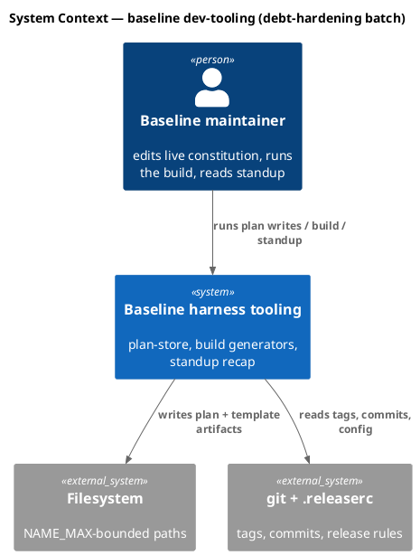
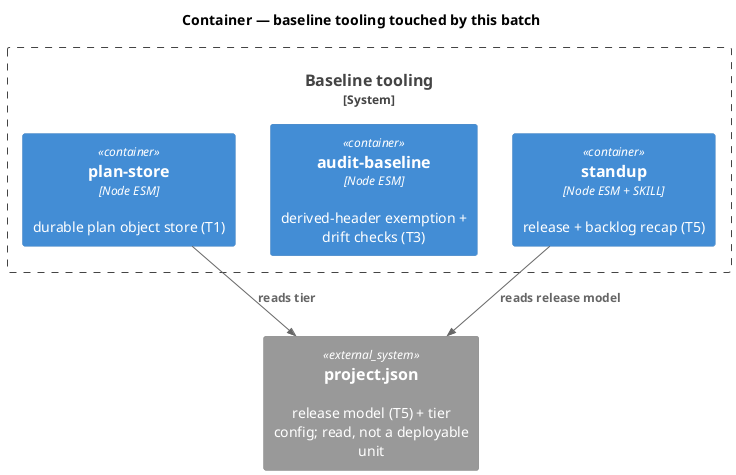
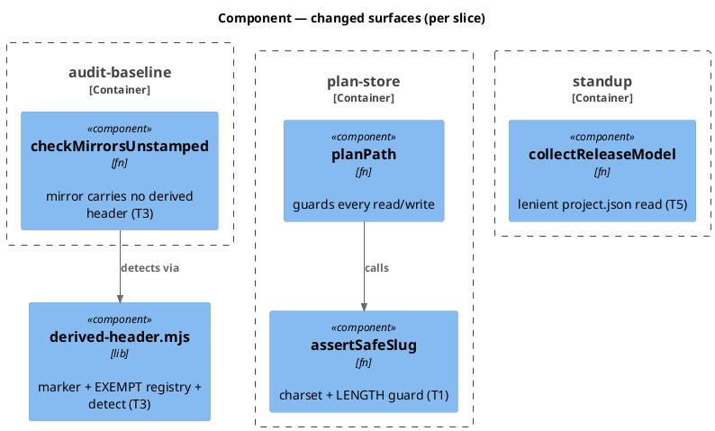
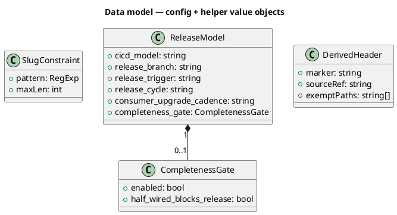
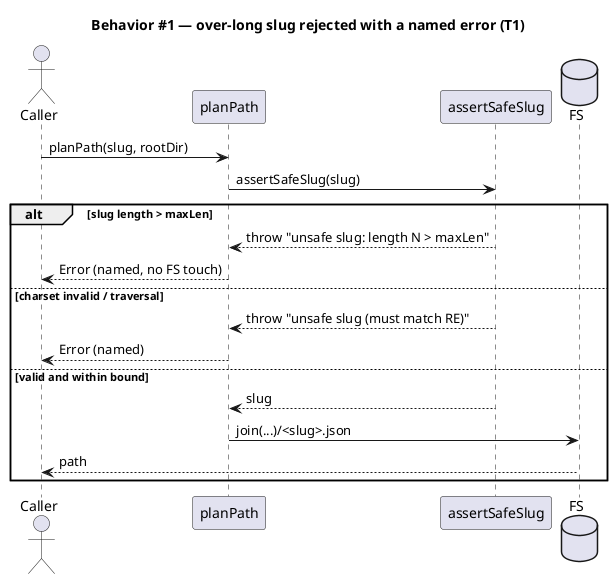
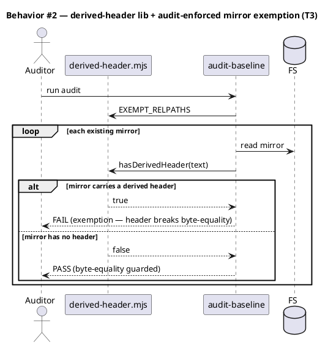
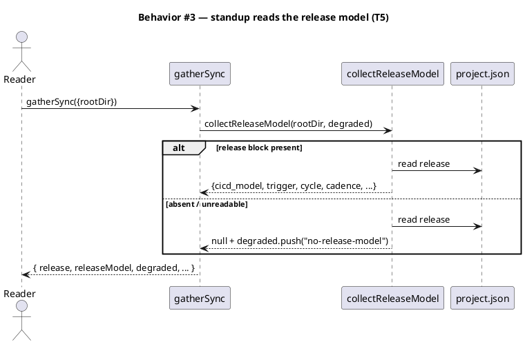
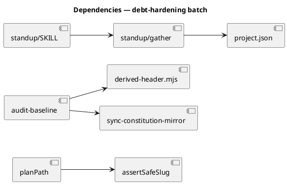

# Debt-hardening batch — slug length bound, derived generator header, release model

Power-track batch spec landing three Epic 6 (Debt and hardening) tickets in one cycle. Each slice is a
self-contained contract an implementer can build in isolation; the batch shares the mechanical phases and
splits into one Conventional Commit per slice at landing.

## Context

| Input | Path |
|---|---|
| Intake | *(excepted — power track enters at spec)* |
| BRD *(if any)* | *(none)* |
| Scout *(if any)* | *(none)* |
| Research *(if any)* | *(none)* |
| Tickets | `.claude/state/workflow.json → tickets[]` (T1, T3, T5) |
| Proposal | `.claude/state/sprint/debt-hardening-batch/proposal.json` |

**Write set**: `.claude/skills/harness/plan-store.mjs`, `.claude/hooks/lib/derived-header.mjs`, `.claude/skills/audit-baseline/audit.mjs`, `project.json`, `src/project.template.json`, `.claude/skills/standup/gather.mjs`, `.claude/skills/standup/SKILL.md`, `tests/**` — full diagram set authored.

## Goal

`plan-store` refuses an over-long slug with a named error instead of crashing at write; generated artifacts
carry a machine-verifiable derived-from header (with the constitution mirrors explicitly exempt so their
byte-equality contract holds); and `project.json` declares a `release` model that `standup` reads to make
its recommendation release-regime-aware.

## Non-goals

- **T2** (hoist a single slug validator) — deferred: waits for a third concrete caller (VI.4). `deferred: dependency`.
- **T4** (memory-system redesign) — deferred: needs its own intake-to-approve cycle. `deferred: human-directed`.
- Changing the `release` *recommendation* logic beyond making it model-aware — the judgment stays in main context (Article II); this spec only surfaces the config.
- Stamping a header on any file under a byte-equality-to-a-human-edited-source contract (the mirrors) — see Slice T3.

## Design

Diagrams are the contract. Prose is only for what a diagram cannot say.

### C4 — System context



### C4 — Container



### C4 — Component (changed containers)



### Data model — class diagram

Configuration and helper value-objects introduced by this batch. These are config/value shapes, **not**
relational entities — there is no database and no migration (see Migration DDL).



#### Migration DDL

```sql
-- No relational migration. All three slices touch config/JSON and code only.
-- ReleaseModel / CompletenessGate are project.json keys, not DB tables.
-- Forward: add `release` object to project.json + src/project.template.json.
-- Reverse: delete the `release` object; standup degrades to today's behavior.
```

### Behavior — sequence per AC







### State — core entity

No non-trivial state machine — all three slices are stateless config/validation/generation. Heading kept so
the omission is explicit.

### Dependencies — graph



### Contracts

| Kind | Name | Input | Output | Errors | Idempotent |
|---|---|---|---|---|---|
| Fn | `assertSafeSlug(slug)` | `string` | `slug` | throws named Error on bad charset OR length > `maxLen` | yes |
| Fn | `hasDerivedHeader(text)` | `string` | `bool` | false on non-string | yes |
| Fn | `isExempt(relPath)` | `string` | `bool` | — | yes |
| Fn | `stampText(text, sourceRef)` | text, ref | headed text | — | yes (idempotent) |
| Fn | `collectReleaseModel(rootDir, degraded)` | rootDir, degraded[] | `ReleaseModel \| null` | never throws (pushes `no-release-model`) | yes |
| Config | `project.json → release` | — | object | — | — |

### Libraries and versions

No third-party libraries. All three slices are Node standard-library only (`node:fs`, `node:path`) plus bash.

| Library@version | Purpose | Key APIs | Confirmed against current docs |
|---|---|---|---|
| Node stdlib (project engine) | fs / path | `readFileSync`, `writeFileSync`, `join` | n/a (stdlib, no external API) |

### Alternatives considered

| Alt | Summary | Rejected because |
|---|---|---|
| A (T1) | Truncate/normalize an over-long slug | Masks a caller bug and violates REJECT-never-normalize (CWE-22 rationale in plan-store); a silent truncation writes to a different path. |
| B (T3) | Stamp the header on the constitution mirrors too | Breaks `template == reconcile(live)` byte-equality; the live source is human-edited and cannot honestly carry a do-not-edit banner. |
| C (T3) | Detect mirror hand-edits with a header instead of byte-equality | Redundant — `sync-constitution-mirror --check` already fails on any drift; a header would only add a false divergence. |
| D (T5) | Derive the whole release model from `.releaserc.json` | `.releaserc` is release *mechanism*, not *policy*; it cannot express cadence/regime the recommendation needs. The `release` block complements it. |

## Design calls

*(none)* — no UI surface; `write_set` does not intersect `tdd.ui_globs`.

## Acceptance criteria

| ID | Criterion (given / when / then) | Kind | Upstream AC | Sequence |
|---|---|---|---|---|
| AC-101 | given a slug longer than `maxLen`, when `assertSafeSlug`/`planPath` runs, then it throws a named length error before any filesystem path is constructed (never surfaces `ENAMETOOLONG`) | error-mapping | T1 / `-8b21` | §Behavior #1 |
| AC-102 | given a slug at exactly `maxLen`, when validated, then it is accepted | behavior | T1 / `-8b21` | §Behavior #1 |
| AC-103 | given a slug with invalid charset or a traversal (`../`, leading `-`, empty), when validated, then it is rejected as today (REJECT, never normalize) | behavior | T1 / `-8b21` | §Behavior #1 |
| AC-201 | given the derived-header lib, when a file is stamped or checked, then it exposes the marker, exempt registry, stamp, and detect primitives and recognizes the constitution mirrors as exempt | behavior | T3 / `-e9c1` | §Behavior #2 |
| AC-202 | given the constitution mirrors (`src/CLAUDE.template.md`, `src/seed.template.md`), then they carry NO derived header and remain byte-equal to their reconciled live source | behavior | T3 / `-e9c1` | §Behavior #2 |
| AC-203 | given a constitution mirror carrying a derived-header banner, when `audit-baseline` runs, then it FAILs with an exemption message (the header would break byte-equality) | smoke | T3 / `-e9c1` | §Behavior #2 |
| AC-204 | given the batch landed, when `audit-baseline` runs, then the mirror byte-equality check still PASSes | smoke | T3 / `-e9c1` | §Behavior #2 |
| AC-301 | given `project.json` declares a `release` block, when `standup`'s `gatherSync` runs, then the block is surfaced in the recap output | behavior | T5 / `-a4f2` | §Behavior #3 |
| AC-302 | given no `release` block (or unreadable config), when `gatherSync` runs, then it returns `null` for the model, pushes `no-release-model` to `degraded`, and never throws | error-mapping | T5 / `-a4f2` | §Behavior #3 |
| AC-303 | given the release model is surfaced, when `/standup` composes its recommendation, then the recommendation is release-regime-aware (documented in SKILL.md; judgment stays in main context) | behavior | T5 / `-a4f2` | §Behavior #3 |

## Test plan

| Category | Scenario | Expected | Covers |
|---|---|---|---|
| Golden path | slug of normal length | accepted, path built | AC-102 |
| Input boundary | slug at `maxLen`; slug at `maxLen + 1` | accepted; named length error, no FS touch | AC-101, AC-102 |
| Contract violation | slug with `../`, leading `-`, empty string | rejected (existing charset error) | AC-103 |
| Golden path | build stamps eligible file | header present + well-formed | AC-201 |
| Regression trap | mirrors after build | no header; byte-equal to live | AC-202, AC-204 |
| Failure mode | eligible file header stripped/edited | audit FAILs with drift message | AC-203 |
| Golden path | project.json with `release` block | surfaced in gather output | AC-301 |
| Failure mode | project.json without `release` (or malformed) | `null` + `no-release-model`; no throw | AC-302 |
| Regression trap | existing gather outputs (release/backlog/roadmap) | unchanged shape | AC-301 |

## Observability

| Signal | Name | Shape | Purpose |
|---|---|---|---|
| Error | `plan-store: refusing to build a path from an unsafe slug (length …)` | thrown Error message | names the length bound at the crash site |
| Audit | `derived-header: <file>` | audit line `PASS`/`FAIL` | surfaces header drift in `audit-baseline` |
| Recap | `degraded: ["no-release-model"]` | standup JSON field | tells the reader the release policy is undeclared |

## Rollout

### Prerequisites

- *(none)* — all three slices are additive, flag-free, and self-guarding (absent `release` block degrades; header exemption is explicit; slug bound only tightens an existing validator).

- **Feature flag**: none. The `release` block's absence IS its off-state (graceful degradation).
- **Migration order**: n/a (no data migration).
- **Canary**: n/a (dev-tooling; verified by the test suite + `audit-baseline`).

## Rollback

- **Kill-switch**: `git revert` the offending slice's commit — the batch splits into one commit per slice, so any slice rolls back independently.
- **Signal to roll back**: `audit-baseline` FAIL on `main`, or a green-suite regression in `plan-store` / `standup` / build — must trip in CI within one run.

## Archive plan

- Defaults *(automatic)*: spec, spec approval, security reports (concatenated), workflow state.
- Extras *(list any non-default files)*:
  - `.claude/state/sprint/debt-hardening-batch/proposal.json` — the sprint-planner proposal that seeded the batch.

## Open questions

- *(none)* — the T3 design call (mirror exemption via byte-equality, not a header) is resolved in Slice T3; `maxLen` is set to 200 in Slice T1 (NAME_MAX headroom). Both are recorded as decisions, not open items.

---

## Slice T1 — bound the slug quantifier in plan-store

**Behavior.** `assertSafeSlug` gains an explicit length bound. An over-long slug (charset-valid but longer
than `maxLen`) is refused with a named error *before* `planPath` constructs any filesystem path, so callers
never see a raw `ENAMETOOLONG` from `writeFileSync`. `maxLen = 200` — the plan filename is `<slug>.json`
under `.claude/state/plan/`, and NAME_MAX is 255 on the common filesystems, so 200 leaves headroom for the
`.json` suffix and any future prefix while staying a sane workflow-slug length. The existing charset regex
(`/^[a-z0-9][a-z0-9-]*$/`) and its REJECT-never-normalize contract (CWE-22) are unchanged — the length
check is additive and throws a distinct, length-naming message.

**Write surface.** `.claude/skills/harness/plan-store.mjs` (+ its `obj/template/` mirror is regenerated by
the build, not hand-edited), `tests/`.

**ACs.** AC-101, AC-102, AC-103.

**Decision (owner: engineer).** `maxLen = 200`, enforced as an explicit length check with its own message
rather than only a bounded regex quantifier — a length-specific error ("length N > 200") is clearer at the
crash site than a generic "must match RE". Rationale: satisfies the AC's "clean named error" precisely.

## Slice T3 — derived-header lib + audit-enforced mirror exemption

**Behavior.** A new `derived-header.mjs` lib defines the header marker, the explicit `EXEMPT_RELPATHS`
registry, and the `isExempt` / `hasDerivedHeader` / `stampText` primitives. `audit-baseline` uses the
detection half to **enforce the exemption**: every existing constitution mirror MUST carry NO derived
header (a header would break its `template == reconcile(live)` byte-equality with a human-edited source,
and the live source cannot honestly carry a do-not-edit banner). A mirror that carries the banner FAILs the
audit with a clear exemption message.

**Design call resolution (discovered during implementation).** The mirror's drift guard is byte-equality,
not a header — the header and byte-equality are two distinct strategies that must not collide. The build
stamp was scoped out: every derived file in this repo is either an exempt byte-equality mirror **or**
`obj/template/**`, which is gitignored build output regenerated on every build — a do-not-edit header there
prevents nothing (nobody hand-edits a file that is `rm -rf`'d each build). So there is no valuable committed
file to stamp today (YAGNI, VI.4). T3 therefore ships the reusable lib + the explicit exemption + the audit
check that enforces it; `stampText` is the ready mechanism for a future genuine target, and the audit
consumes the detection half now. The exempt set is a single named registry shared by the lib and the audit.

**Write surface.** `.claude/hooks/lib/derived-header.mjs` (new, stdlib-free), `.claude/skills/audit-baseline/audit.mjs`,
`tests/`. **Not touched**: `src/CLAUDE.template.md`, `src/seed.template.md` (exempt by design); `scripts/build-template.sh`
(no stamp wired — no valuable target).

**ACs.** AC-201, AC-202, AC-203, AC-204.

**Decision (owner: engineer).** Build-stamp deferred: no committed derived file qualifies (mirrors are
exempt; `obj/template/**` is ephemeral). The valuable, non-redundant deliverable is the audit enforcing that
a mirror never accidentally carries the banner — a clearer, more-specific guard than a raw byte-diff.
`verifyStamped` (the eligible-set audit half) was dropped with the build-stamp to avoid dead code.

## Slice T5 — declare a release model + teach standup to read it

**Behavior.** `project.json` (and the shipped `src/project.template.json`) gain a `release` object with the
five user-named knobs — `cicd_model`, `release_branch`, `release_trigger`, `release_cycle`,
`consumer_upgrade_cadence` — plus an optional `completeness_gate: {enabled, half_wired_blocks_release}`
sub-block. `standup`'s `gather.mjs` gains `collectReleaseModel(rootDir, degraded)`, a lenient project.json
reader (mirroring the existing `roadmapPathFor` pattern) that surfaces the block or returns `null` and
pushes `no-release-model` to `degraded` — never throwing. The recommendation *judgment* stays in main
context per Article II; `SKILL.md` documents how the regime (`continuous`/`on-push`/`frequent` vs
`on-tag`/`sprint-based`/`rare`) drives the "can this unreleased pile ship?" recommendation. `gatherSync`'s
return shape gains a `releaseModel` field; existing fields are unchanged.

**Write surface.** `project.json`, `src/project.template.json`, `.claude/skills/standup/gather.mjs`,
`.claude/skills/standup/SKILL.md`, `tests/`.

**ACs.** AC-301, AC-302, AC-303.

**Decision (owner: engineer).** Surface the model as a distinct `releaseModel` field on `gatherSync` rather
than folding it into the existing `release` object (which is release *mechanism* from `.releaserc`) — policy
and mechanism stay separated so the two cannot silently disagree.
