# Spec — Enforcement oracle framework (C2 + C3 + C4)

<!--
Technical spec. Source: docs/intake + docs/scout + docs/research (enforcement-oracle-framework).
Roadmap: Epic 3 → C2, C3, C4, landed as one monolith.
-->

## Context

| Input | Path |
|---|---|
| Intake | `docs/intake/enforcement-oracle-framework.md` |
| Scout | `docs/scout/enforcement-oracle-framework.md` |
| Research | `docs/research/enforcement-oracle-framework.md` |

**Write set**: `.claude/skills/harness/checker-fanout.mjs`, `.claude/skills/harness/maker-checker.mjs`, `.claude/skills/harness/ralph-loop.mjs`, `.claude/skills/security/oracle.mjs`, `.claude/skills/simplify/oracle.mjs`, `.claude/skills/code-structure/oracle.mjs`, `.claude/skills/spec-diagram-review/oracle.mjs`, `.claude/skills/harness/design-judge.mjs`, `.claude/hooks/lib/tier-dial.mjs`, `.claude/project.json`, `tests/**` — touches `.claude/hooks/**` (a `security.sensitive_globs` path), so the full C4 diagram set and a mandatory `/security` review both apply.

## Goal

The pipeline gains one phase-tagged oracle-checker interface on which review checkers (C2), a bounded multi-round maker/checker RALPH loop with a mechanical stop rule and grounding-based arbitration (C3), and a Playwright design-judge that fails `verify` on a below-threshold render (C4) all run — able to fail a build for a quality reason, never a silent advisory downgrade.

## Non-goals

- Not a second subagent; checkers stay mechanical `.mjs` oracles run via `Promise.all` (§II.A clause 6). No LLM checker fan-out until clause 7 graduation.
- Not auto-remediation — the framework scores and yields; fixes route to `/tdd` or a human.
- Not a general visual-regression bank — the judge scores the spec's declared Quality criteria + Reference target only.
- Not making `code-structure` a BLOCKER oracle — it is advisory-only (D6).
- Not the gate-taxonomy (C6) or any autonomy layer.

## Decisions

Engineering decisions recorded per Article XI.12 (owner: engineer, from the research recommendations). The human confirms or overrides these at gate A via the Open questions below.

- **D1 — Design-judge is hybrid.** The BLOCKING score is mechanical (scored against the B1 `Quality criteria` cell via the accessibility snapshot `boxes` + computed styles). The LLM-vision read against the `Reference target` is ADVISORY only, mirroring integrate's cross-engine smoke. Rationale: keeps `verify` deterministic + reproducible + §II.A-clean; B1 forces measurable quality criteria precisely so C4 can score them mechanically.
- **D2 — Design-judge threshold lives in the tier dial** as a new `design-judge` entry in `CANONICAL_CHECKERS`; a `velocity.design_judge` key holds only the enable/SKIP-on-no-browser toggle.
- **D3 — The RALPH round budget is the per-checker tier-dial `ceiling`.** Stop conditions: converged (checker CLEAN → PASS), dry-round (no maker change AND no new finding), oscillation (a finding toggles across rounds), ceiling-hit-below-floor → RED.
- **D4 — Arbitration is mechanical grounding, not a vote.** Only findings with `artifact != null` (the existing `normalizeFinding` gate) may BLOCK; an ungrounded checker finding degrades to ADVISORY. No third LLM voter (NeurIPS: multi-agent debate without verification reduces performance). **Exception: `code-structure` (D6)** — its ungrounded readability findings escalate to the human reviewer, they do not degrade to advisory.
- **D5 — The checker interface is extended, not generalized.** `ctx` gains `{diffContent, changedFiles}` and each checker a `phase` tag (`spec-review` | `code-review`). The spec-review subset runs before `approve-spec` (unchanged gate-A projection); the **code-review subset runs ONCE at the `integrate` boundary (Phase 9)** — see D8a for why not `verify` and not both.
- **D6 — `code-structure` is a GATING checker (human-reviewer arbitrated), not advisory** [engineer recommendation → human override]. It governs code readability, which is a human-reviewer concern. Its mechanically-decidable Detection Rules (file > 80 substantive lines; orchestration-file-contains-a-raw-primitive) emit **groundable findings that can BLOCK**. Its judgment-dependent readability findings do NOT degrade to advisory under D4 — they **escalate to the human reviewer at the consent gate** as a required-acknowledgement punch-list. `code-structure` is the one checker where ungrounded ≠ advisory-pass; ungrounded = human-review gate.
- **D7 — `security` and `simplify` oracles read their existing artifacts** (the `docs/security/<slug>-*.md` report; the simplify verdict table) rather than re-deriving. Read-only preserved.
- **D8 — checkers are BLOCKING by default (opt-out)** [human decision]. Each new checker ships `mandatory=true` in its tier-dial profile; a project opts a checker OUT via `tier.overrides.<checker>.mandatory=false`. This reverses the earlier staged advisory rollout. Risk (accepted): a new checker's false BLOCKER can wedge the next workflow — the introduction-workflow pattern plus the false-BLOCKER rollback signal (see Rollback) bound the blast radius.
- **D8a — code-review fan-out fires at `integrate` (Phase 9), once** [engineer decision, given the "better reasons" invitation]. Not `verify` (Phase 6): the three code-review checkers' inputs do not exist yet there — the `security` oracle reads the `docs/security/` report produced by Phase 8, the `simplify` oracle reads the Phase 7 verdict table, and `code-structure` is invoked inside Phase 7. Reviewing at `verify` would also score a diff that `simplify` is about to restructure. Not both: the verify-time result is stale by `integrate`, so a second run adds cost, not signal. `integrate` is the only point where all three inputs exist AND the diff is final — and it is the last gate before commit, exactly where a "can this land?" quality gate belongs.

## Design

Diagrams are the contract.

### C4 — System context

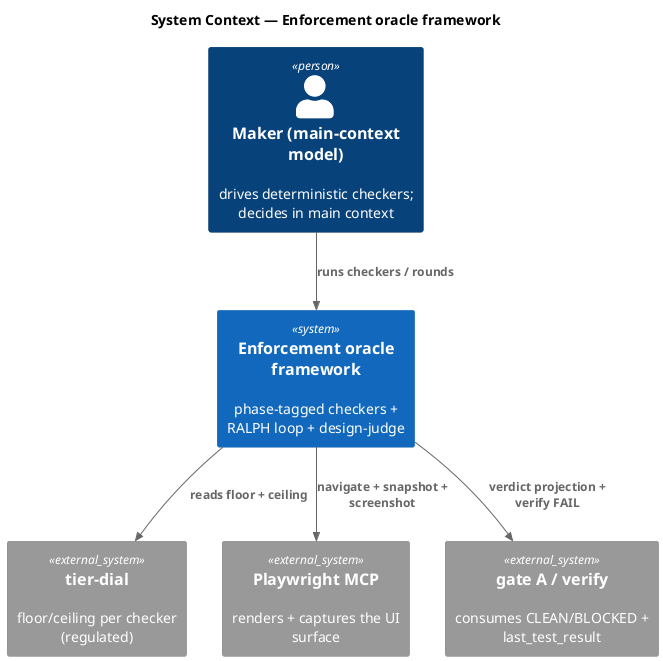

### C4 — Container

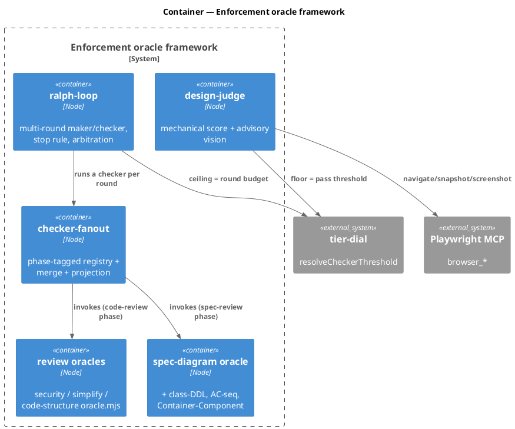

### C4 — Component (ralph-loop internals)

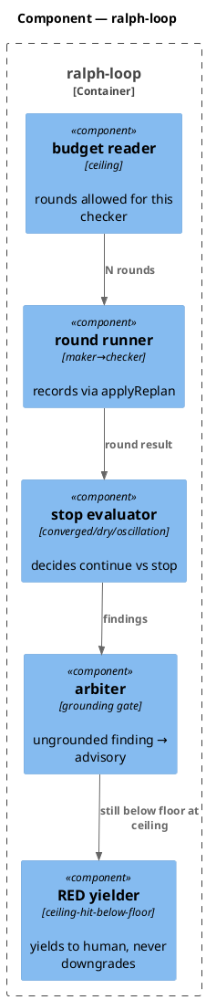

### Data model — class diagram

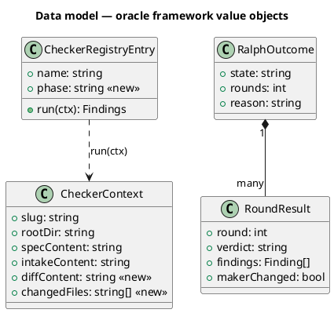

#### Migration DDL

```sql
-- No datastore. The "schema" changes are: CheckerContext gains diffContent +
-- changedFiles; CheckerRegistryEntry gains a `phase` tag; RoundResult and
-- RalphOutcome are new in-memory value objects produced by ralph-loop.mjs.
-- Persisted projections stay JSON under .claude/state/ (no ALTER).
```

### Behavior — sequence per AC

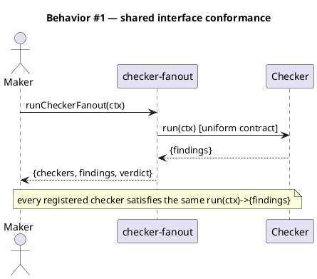

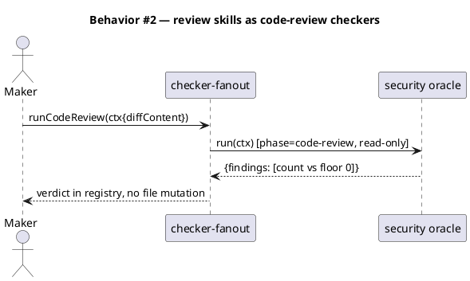

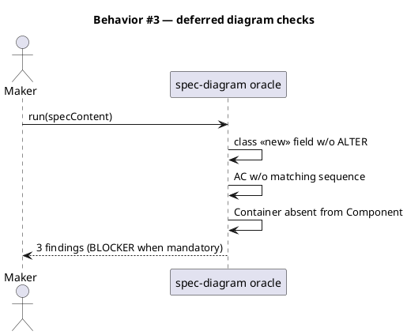

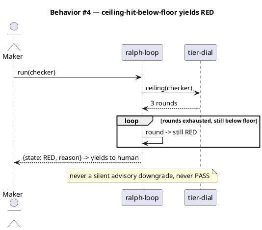

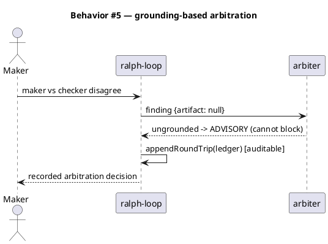

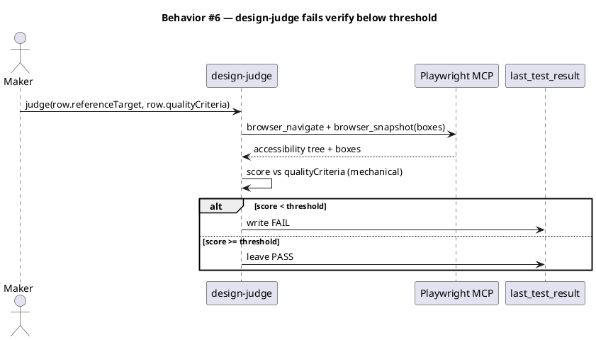

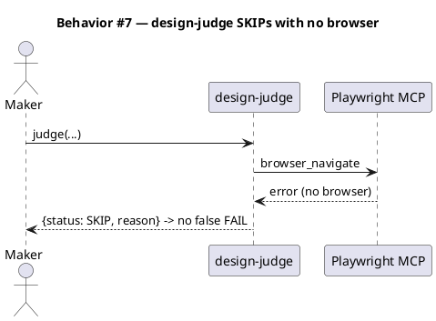

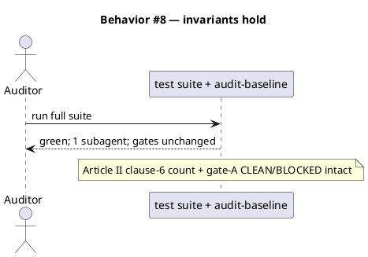

### State — RALPH round machine

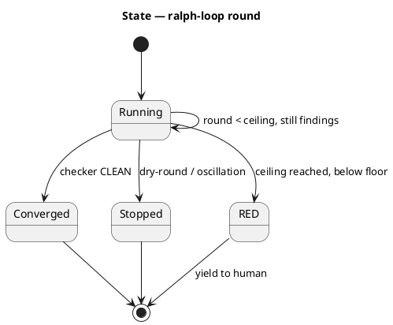

### Dependencies — graph

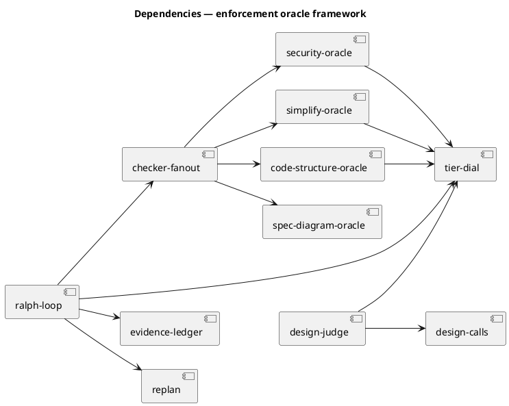

### Contracts

| Kind | Name | Input | Output | Errors | Idempotent |
|---|---|---|---|---|---|
| Function | `runCheckerFanout(ctx)` (extended) | `ctx{slug,rootDir,specContent,intakeContent,diffContent,changedFiles}` + `phase` filter | `{checkers, findings, verdict}` | fail-open on disabled | yes |
| Function | `runSecurityOracle(ctx)` | ctx (diffContent + security report) | `{findings}` (read-only) | never throws | yes |
| Function | `runSimplifyOracle(ctx)` | ctx (verdict table) | `{findings}` | never throws | yes |
| Function | `runCodeStructureOracle(ctx)` | ctx (changedFiles) | `{findings}` (all `artifact:null`, advisory) | never throws | yes |
| Function | `runDiagramOracle(spec)` (extended) | specContent | `{findings}` incl. class-DDL, AC-seq, Container-Component | never throws | yes |
| Function | `runRalph({checker, ctx, deps})` | checker name + ctx | `{state:'CONVERGED'|'STOPPED'|'RED', rounds, reason}` | fail-closed (missing → RED) | yes |
| Function | `runDesignJudge({row, deps})` | Design calls row + Playwright | `{status:'PASS'|'FAIL'|'SKIP', score, reason}` | no-browser → SKIP | yes |
| CLI | `design-judge.mjs <slug>` | slug | writes verify FAIL on below-threshold | SKIP on no browser | yes |

### Libraries and versions

| Library@version | Purpose | Key APIs | Confirmed against current docs |
|---|---|---|---|
| `@playwright/mcp@latest` | render + capture the UI | `mcp__playwright__browser_navigate({url})`, `browser_snapshot({boxes})`, `browser_take_screenshot({type,scale})` | yes — verified live via MCP tool schemas this session |
| Node stdlib | fs/path/regex/child_process | — | n/a stdlib |

### Alternatives considered

| Alt | Summary | Rejected because |
|---|---|---|
| A | LLM-vision judge gates verify (Q1-B) | Non-deterministic verify; a flaky judge fails good UI (AC-006 nightmare). Vision stays advisory (D1). |
| B | Fixed round cap, ignore tier ceiling (Q2-B) | Discards the per-checker/per-tier `ceiling` built for exactly this. Read the dial (D3). |
| C | A third LLM voter for arbitration | NeurIPS: multi-agent debate without verification reduces performance. Arbitration is mechanical grounding (D4). |
| D | Separate code-review fan-out module (Q3-B) | Two runners drift (the guard↔lint divergence B1 just fixed). One phase-tagged interface (D5). |
| E | `code-structure` as a BLOCKER oracle | Structural analysis of arbitrary code isn't mechanically sound; advisory-only (D6). |

## Design calls

Write set has no UI files (`.claude/skills/**`, `.claude/hooks/**`, `tests/**`, `.claude/project.json` — none match `tdd.ui_globs`), so this section is intentionally empty. C4 *operates on* UI surfaces but this framework's own write_set is not UI.

- *(none)*

## Acceptance criteria

| ID | Criterion (given / when / then) | Kind | Upstream AC | Sequence |
|---|---|---|---|---|
| AC-001 | given a registered checker, when the fan-out runs it, then it satisfies the uniform `run(ctx) → {findings}` contract, verified by a conformance test every checker passes | behavior | intake AC 1 | §Behavior #1 |
| AC-002 | given `security`/`simplify`/`code-structure`, when run at the code-review phase, then each emits a typed verdict on the shared interface (read-only, no file mutation) and appears in the registry | behavior | intake AC 2 | §Behavior #2 |
| AC-003 | given a spec with a class diagram, AC table, and Container+Component diagrams, when the diagram oracle runs, then class-to-DDL mismatch, an AC with no sequence, and a Container absent from the Component diagram are each reported | behavior | intake AC 3 | §Behavior #3 |
| AC-004 | given a checker still below its floor after `ceiling` rounds, when the stop rule fires, then the outcome is RED that yields to a human — never a silent downgrade, never PASS | error-mapping | intake AC 4 | §Behavior #4 |
| AC-005 | given a maker/checker disagreement, when arbitration runs, then only `artifact`-grounded findings block; ungrounded degrade to advisory, and the decision is appended to the evidence ledger | behavior | intake AC 5 | §Behavior #5 |
| AC-006 | given a rendered surface and its B1 Reference target, when the design-judge runs, then Playwright captures the screen, it scores against the Quality criteria, and a below-threshold score writes FAIL to `last_test_result` | smoke | intake AC 6 | §Behavior #6 |
| AC-007 | given a host where Playwright cannot launch, when the design-judge runs, then it SKIPs with a recorded reason and emits no false FAIL | preflight | intake AC 7 | §Behavior #7 |
| AC-008 | given the whole framework, when the full suite + audit-baseline run, then both are green and the one-subagent count and all consent gates are unchanged | behavior | intake AC 8 | §Behavior #8 |

## Test plan

| Category | Scenario | Expected | Covers |
|---|---|---|---|
| Golden path | every checker run through the conformance harness | uniform `{findings}` | AC-001 |
| Contract violation | security oracle on a diff with a Critical finding | BLOCKER when mandatory, read-only | AC-002 |
| Golden path | diagram oracle on a spec missing DDL / sequence / Component | 3 findings | AC-003 |
| Failure mode | checker RED across `ceiling` rounds | RalphOutcome RED, yields | AC-004 |
| Contract violation | ungrounded checker finding (`artifact:null`) | degraded to advisory, cannot block | AC-005 |
| Golden path | design-judge, render below Quality-criteria threshold | last_test_result FAIL | AC-006 |
| Failure mode | design-judge, no browser | SKIP, no FAIL | AC-007 |
| Regression trap | gate-A CLEAN/BLOCKED projection + subagent count | unchanged | AC-008 |
| Input boundary | tier-dial ceiling read for each checker under regulated | 2–3 rounds | AC-004 |

## Observability

| Signal | Name | Shape | Purpose |
|---|---|---|---|
| Log | RALPH round trail | `.claude/state/<slug>/ledger.json` append | audit each round + arbitration |
| Log | design-judge verdict | `{status, score, reason}` | why a render passed/failed/skipped |
| Log | code-review projection | `.claude/state/checker-fanout-code/<slug>.json` | the parallel verdict at verify |

## Rollout

### Prerequisites

| # | Prerequisite | enforced-by |
|---|---|---|
| 1 | A ceiling-hit-below-floor RALPH outcome MUST yield RED (never advisory downgrade, never PASS) | AC-004 |
| 2 | The design-judge below-threshold path MUST write a real `last_test_result` FAIL | AC-006 |
| 3 | Playwright-absent MUST SKIP, never a false FAIL | AC-007 |

- **Feature flags**: `velocity.design_judge.enabled` (default off until validated); the RALPH loop is gated by the existing checker/tier config. Checkers are **mandatory (blocking) by default** per D8; a project opts a checker OUT via `tier.overrides.<checker>.mandatory=false`.
- **Migration order**: 1 extend checker-fanout ctx + phase → 2 add the 3 review oracles (incl. `code-structure` gating) + diagram checks → 3 ralph-loop → 4 design-judge → 5 wire tier-dial `design-judge` entry + set the new checkers `mandatory=true` in the profiles + project.json → 6 wire the code-review fan-out into `integrate` (Phase 9).
- **Canary**: introduction-workflow pattern — the framework governs the first workflow *after* this one lands (same as B1, drift-check, checker-fanout).

## Rollback

- **Kill-switch**: `velocity.design_judge.enabled:false` disables C4; reverting the review-oracle registry entries drops C2 back to the 3 spec-review checkers; ralph-loop is additive (removing it restores the one-round maker/checker). No persisted state to unwind.
- **Signal to roll back**: a legitimate render fails the judge (false FAIL), or a valid spec is BLOCKED by a new checker's false BLOCKER. Detect within one workflow.

## Archive plan

- Defaults *(automatic)*: intake, scout, research, spec, spec-rendered/, spec approval, security report.
- Extras *(none)*.

## Open questions

Resolved at gate-A review (human decisions folded into Decisions above):
- `code-structure` is a **gating** checker, human-reviewer arbitrated (D6) — not advisory.
- code-review fan-out fires **once at `integrate`** (D8a) — not `verify`, not both.
- `design-judge` gets its **own tier-dial `CANONICAL_CHECKERS` entry** (D2).
- Checkers are **blocking by default, opt-out** (D8) — not opt-in.

- **Visual fidelity is ADVISORY** (D1, confirmed at gate-A review) — the mechanical Quality-criteria score is the only teeth that fail `verify`; the vision read against the Reference target is surfaced, never auto-fails. `verify` stays deterministic.

All gate-A forks are resolved; no open questions remain.
