# Spec — Governance Class: the input half (Epic 2, A1–A5)

## Context

| Input | Path |
|---|---|
| Intake | *(power track — intake excepted)* |
| BRD *(if any)* | *(none)* |
| Scout *(if any)* | *(power track — scout excepted)* |
| Research *(if any)* | *(power track — research excepted)* |
| Proposal + done-criteria | `.claude/state/sprint/input-half-governance-class/proposal.json` |
| Roadmap source | `docs/roadmap-execution-plan.md:48-53` (Epic 2, A1–A5) |

**Write set**: `.claude/hooks/lib/tier-dial.mjs`, `.claude/skills/spec/evidence-ladder.mjs`, `.claude/skills/spec/approval-provenance.mjs`, `.claude/skills/brainstorm/discipline.mjs`, `.claude/skills/triage/flag-parser.mjs`, `.claude/hooks/spec_approval_guard.mjs`, `.claude/skills/harness/evidence-ledger.mjs`, `.claude/skills/triage/governance-class.mjs`, `tests/**` — spans `.claude/hooks/**` (outside the non-architectural profile), so the full C4 diagram set is required.

## Goal

After this ships, every workflow carries a mechanically-derived **Governance Class** (`D`/`C`/`B`/`A`) whose floor rises with a change's blast radius, and that Class drives three enforcement seams: the evidence *shape* a spec must carry, whether brainstorm may be skipped, and — bound to a provenance-anchored ledger entry — what the `/approve-spec` token attests.

## Non-goals

- **No gate collapse.** Folding the three human gates into two (roadmap D3) depends on this work but is not in it.
- **No new consent gate and no weakening of an existing one.** A4 strengthens gate A; it never removes the human consent marker.
- **No parallel classifier.** A1 extends the shipped tier dial; it does not introduce a second threat/value axis.
- **No change to `/grant-commit` or `/approve-swarm`.** A4 is scoped to the `/approve-spec` gate only.
- **No duration/word-count/authorship gating.** Evidence rigor is measured by *shape*, never by length or who authored it (D3).

## Decisions

> **D-1 — Governance Class is an ordinal `{D,C,B,A}`, raise-only above a mechanical floor.** The floor is derived deterministically from blast-radius signals combined with the existing `tier.level`. Claude may raise the class with evidence but can never assert a class below the floor. Rationale: the floor is the non-negotiable rigor the blast radius demands; discretion only ratchets up. `owner: engineer`.

> **D-2 — A1 extends `hooks/lib/tier-dial.mjs`; it does not add a parallel classifier.** Ledger #0002 D8: "the tier dial IS this floor." The classifier reuses `readTier`/`tierBlock` so there is exactly one threat/value read path. `owner: engineer`.

> **D-3 — Class A/B forbids skipping brainstorm as a hard floor, overriding even an explicit `--no-brainstorm`.** A convenience flag lowering the rigor of a top-class change is exactly the "lower below floor" move D-1 forbids. Recorded as an intentional override of the flag's precedence. `owner: engineer`.

> **D-4 — A4 adds the provenance anchor on top of the consent marker, never in place of it.** The human `/approve-spec` marker remains the sole consent source (written outside Claude's tool boundary by `consent_gate_grant`). A4 additionally requires the approval token to resolve to an append-only evidence-ledger entry. Strictly stronger; fail-safe (missing/dangling anchor → block). `owner: engineer`.

> **D-5 — The feature goes live the first workflow AFTER this one (introduction-workflow pattern).** This workflow's own triage predates the classifier, so `governance_class` is absent here; consumers fail-open to today's behavior when it is absent. `owner: engineer`.

## Design

Diagrams are the contract. Prose is only for what a diagram cannot say.

### C4 — System context

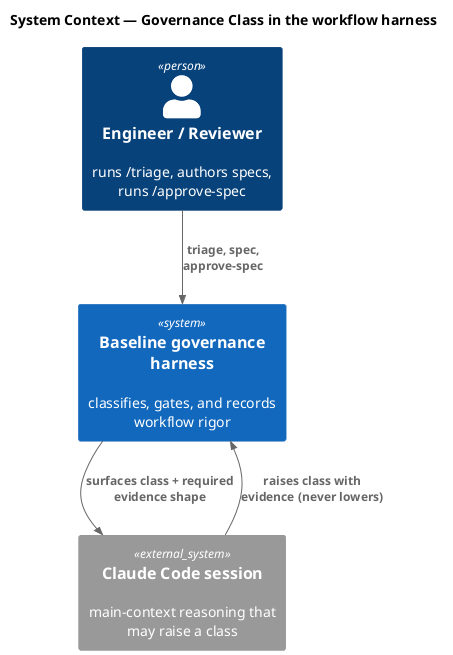

### C4 — Container

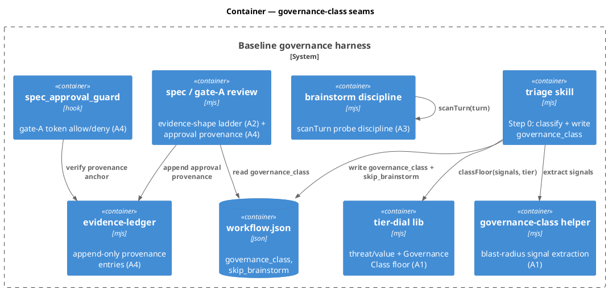

### C4 — Component (changed containers only)

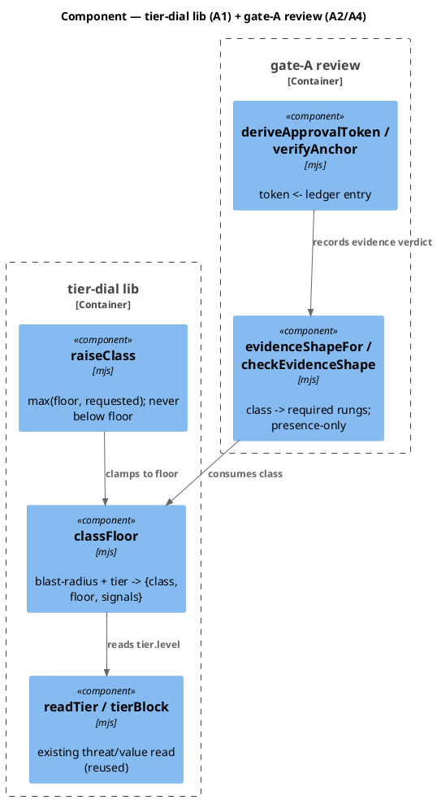

### Data model — class diagram

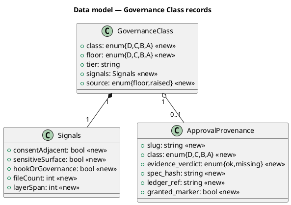

#### Migration DDL

No relational store — the "DDL" is the JSON shape written to state files.

```sql
-- forward: workflow.json gains (written by /triage Step 0)
--   "governance_class": {
--     "class": "D|C|B|A", "floor": "D|C|B|A", "tier": "<level>",
--     "signals": { "consentAdjacent": bool, "sensitiveSurface": bool,
--                  "hookOrGovernance": bool, "fileCount": int, "layerSpan": int },
--     "source": "floor|raised"
--   }
-- forward: evidence-ledger round_trips[] gains a provenance-kind entry
--   { "kind": "approval-provenance", "slug": "<slug>", "class": "...",
--     "evidence_verdict": "ok|missing", "spec_hash": "<sha>", "at": <epoch> }
-- forward: spec_approvals/<slug>.approval line 6 gains "ledger_ref: <entry-id>"
-- reverse: drop governance_class from workflow.json; ignore ledger provenance
--   entries; guard falls back to today's marker-only allow (flags off).
```

### Behavior — sequence per slice

Each slice's sequence is the contract; the AC table anchors to these `§Behavior` sections.

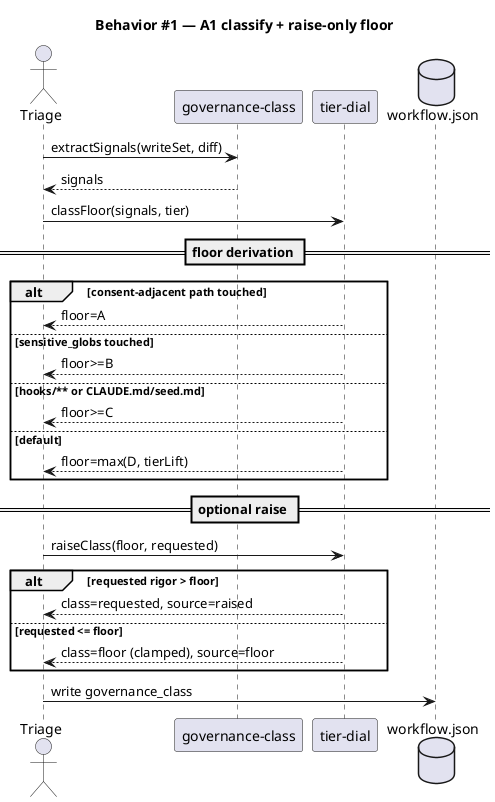

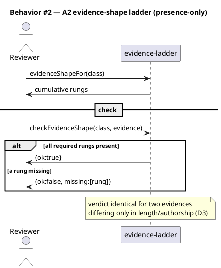

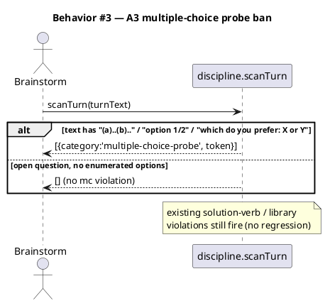

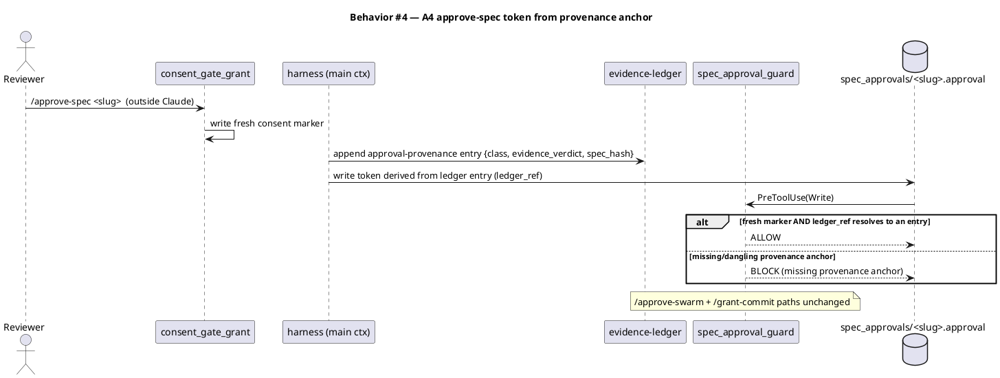

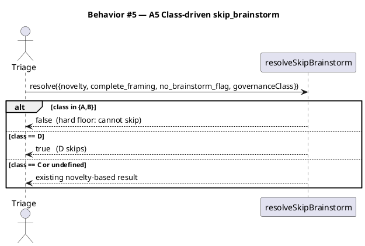

### State — Governance Class lifecycle

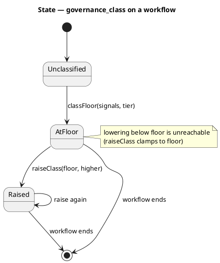

### Dependencies — graph

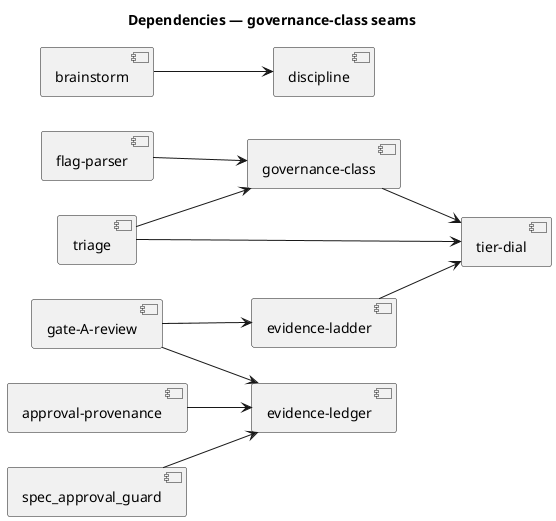

### Contracts

| Kind | Name | Input | Output | Errors | Idempotent |
|---|---|---|---|---|---|
| fn | `tier-dial.classFloor(signals, opts)` | `{consentAdjacent,sensitiveSurface,hookOrGovernance,fileCount,layerSpan}`, opts | `{class,floor,tier,signals,source:'floor'}` | none (returns tier-fallback on bad config) | yes |
| fn | `tier-dial.raiseClass(floor, requested)` | two class enums | higher-rigor class; never `< floor` | none | yes |
| fn | `governance-class.extractSignals({writeSet, diffPaths, project})` | arrays + project | `Signals` | none (empty → all-false) | yes |
| fn | `evidence-ladder.evidenceShapeFor(class)` | class enum | `{class, rungs:[...]}` | none | yes |
| fn | `evidence-ladder.checkEvidenceShape(class, evidence)` | class + evidence obj | `{ok, missing:[...]}` | none | yes |
| fn | `discipline.scanTurn(text)` | string | `[{category, token}]` (adds `multiple-choice-probe`) | none | yes |
| fn | `flag-parser.resolveSkipBrainstorm(args)` | `{novelty,complete_framing,no_brainstorm_flag,governanceClass}` | bool | none | yes |
| fn | `approval-provenance.deriveApprovalToken({slug, ledgerEntry, specHash})` | obj | token string w/ `ledger_ref` | throws on unsafe slug | yes |
| hook | `spec_approval_guard` (extended) | PreToolUse Write | ALLOW / BLOCK | BLOCK on missing anchor | n/a |

### Libraries and versions

| Library@version | Purpose | Key APIs | Confirmed against current docs |
|---|---|---|---|
| Node.js stdlib (`node:fs`, `node:path`) | file + path IO | `readFileSync`, `writeFileSync`, `existsSync`, `join`, `basename` | yes — in-repo usage, no external API |
| node:test / node:assert | test runner | `test`, `assert` | yes — existing suite convention |

No third-party libraries introduced.

### Alternatives considered

| Alt | Summary | Rejected because |
|---|---|---|
| A | Standalone governance classifier module, separate from the tier dial | Two threat/value read paths drift; Ledger #0002 D8 mandates the tier dial IS the floor (D-2) |
| B | Gate the class as a numeric score (0–100) rather than ordinal `{D,C,B,A}` | The evidence ladder and roadmap speak in named classes; an ordinal maps cleanly to cumulative rungs and to raise-only |
| C | A4 replaces the consent marker with the ledger entry | Would let provenance stand in for human consent — forbidden; A4 must be additive (D-4) |
| D | Let `--no-brainstorm` override Class A/B | A convenience flag lowering a top-class change's rigor is the exact "below floor" move D-1 forbids (D-3) |

## Design calls

*(none)* — no `write_set` path intersects `project.json → tdd.ui_globs`; this is governance tooling, not UI.

## Acceptance criteria

Numbered, testable, traced. `Kind` tags enforcement ACs (`preflight`/`smoke`/`error-mapping`) that Rollout prerequisites bind to.

| ID | Criterion (given / when / then) | Kind | Upstream | Sequence |
|---|---|---|---|---|
| AC-101 | given blast-radius signals + a project tier, when `classFloor` runs, then it returns a deterministic `{class,floor}` per the floor rules (consent→A, sensitive→≥B, hook/gov→≥C, tier-lift); identical input → identical output | behavior | A1 | §Behavior #1 |
| AC-102 | given floor `F` and requested `R`, when `raiseClass(F,R)` runs, then it returns the higher rigor of the two and never a class below `F` | behavior | A1 | §Behavior #1 |
| AC-103 | given a missing/invalid `project.json`, when `classFloor` runs, then it returns the tier-fallback floor without throwing | error-mapping | A1 | §Behavior #1 |
| AC-201 | given a Class, when `evidenceShapeFor` runs, then it returns the cumulative rung set (D authorize; C +understanding; B +reasoning; A +alternatives,tradeoffs,confidence) | behavior | A2 | §Behavior #2 |
| AC-202 | given evidence with the required rungs present (missing one), when `checkEvidenceShape` runs, then `ok:true` (resp. `ok:false` naming the missing rung) | behavior | A2 | §Behavior #2 |
| AC-203 | given two evidences for one Class differing only in length/authorship/duration, when `checkEvidenceShape` runs, then the verdict is identical (D3 invariance) | behavior | A2 | §Behavior #2 |
| AC-301 | given a turn with multiple-choice framing, when `scanTurn` runs, then a `multiple-choice-probe` violation is returned | behavior | A3 | §Behavior #3 |
| AC-302 | given a turn with an open question and no enumerated options, when `scanTurn` runs, then no `multiple-choice-probe` violation | behavior | A3 | §Behavior #3 |
| AC-303 | given the existing solution-verb/library inputs, when `scanTurn` runs, then those violations still fire | behavior | A3 | §Behavior #3 |
| AC-401 | given a fresh consent marker AND a resolvable provenance-anchored ledger entry, when the approval token is written, then `spec_approval_guard` ALLOWs and the token carries the anchor | behavior | A4 | §Behavior #4 |
| AC-402 | given a fresh marker but no anchoring ledger entry, when the token write is attempted, then `spec_approval_guard` BLOCKs (missing provenance anchor) | error-mapping | A4 | §Behavior #4 |
| AC-403 | given `/approve-swarm` and `/grant-commit` token paths, when their tokens are written, then they are unchanged by A4 | behavior | A4 | §Behavior #4 |
| AC-501 | given `governanceClass:'D'`, when `resolveSkipBrainstorm` runs, then `true` | behavior | A5 | §Behavior #5 |
| AC-502 | given `governanceClass` in `{A,B}`, when `resolveSkipBrainstorm` runs, then `false` regardless of novelty or `--no-brainstorm` | behavior | A5 | §Behavior #5 |
| AC-503 | given `governanceClass` undefined or `'C'`, when `resolveSkipBrainstorm` runs, then the existing novelty-based result is unchanged | behavior | A5 | §Behavior #5 |

## Slice A1 — Governance Class classifier {#slice-A1}

**Behavior:** extend `tier-dial.mjs` with `classFloor` + `raiseClass` and add `governance-class.mjs` for blast-radius signal extraction; `/triage` Step 0 calls them and writes `workflow.json → governance_class`. **ACs:** AC-101, AC-102, AC-103. **Write surface:** `.claude/hooks/lib/tier-dial.mjs`, `.claude/skills/triage/governance-class.mjs`, `.claude/skills/triage/SKILL.md` (Step 0 wiring), `tests/**`. Sole producer of the Class; builds first.

## Slice A2 — Evidence-shape ladder {#slice-A2}

**Behavior:** new `evidence-ladder.mjs` maps Class → cumulative evidence rungs and checks presence only (never length/authorship). **ACs:** AC-201, AC-202, AC-203. **Write surface:** `.claude/skills/spec/evidence-ladder.mjs`, gate-A review wiring, `tests/**`. Consumes A1's Class.

## Slice A3 — discipline.mjs probe ban {#slice-A3}

**Behavior:** extend `scanTurn` to flag multiple-choice framing on probes as `multiple-choice-probe`, preserving existing violations. **ACs:** AC-301, AC-302, AC-303. **Write surface:** `.claude/skills/brainstorm/discipline.mjs`, `tests/**`. Independent of A1.

## Slice A4 — approve-spec from provenance anchor {#slice-A4}

**Behavior:** `approval-provenance.mjs` derives the `/approve-spec` token from an append-only evidence-ledger entry; `spec_approval_guard` additionally verifies the anchor. **ACs:** AC-401, AC-402, AC-403. **Write surface:** `.claude/skills/spec/approval-provenance.mjs`, `.claude/skills/harness/evidence-ledger.mjs`, `.claude/hooks/spec_approval_guard.mjs`, `tests/**`. Consumes A1's Class + the ledger.

## Slice A5 — Class-driven skip_brainstorm {#slice-A5}

**Behavior:** extend `resolveSkipBrainstorm` to honor the Class — D skips, A/B cannot, C/undefined unchanged. **ACs:** AC-501, AC-502, AC-503. **Write surface:** `.claude/skills/triage/flag-parser.mjs`, `tests/**`. Consumes A1's Class.

## Test plan

| Category | Scenario | Expected | Covers |
|---|---|---|---|
| Golden path | classFloor on a hook-touching change, internal-tool tier | class≥C, deterministic | AC-101 |
| Golden path | raiseClass(C, A) | A (raised) | AC-102 |
| Input boundary | raiseClass(A, D) | A (clamped to floor, never D) | AC-102 |
| Failure mode | classFloor with unreadable project.json | tier-fallback floor, no throw | AC-103 |
| Golden path | evidenceShapeFor('A') | rungs = authorize+understanding+reasoning+alternatives+tradeoffs+confidence | AC-201 |
| Contract violation | checkEvidenceShape('B', evidence missing reasoning) | ok:false, missing:['reasoning'] | AC-202 |
| Regression trap | checkEvidenceShape same class, one 5 words / one 500 words, same rungs | identical verdict | AC-203 |
| Golden path | scanTurn("we can do (a) X or (b) Y") | multiple-choice-probe violation | AC-301 |
| Input boundary | scanTurn("what constraint makes this hard?") | no mc violation | AC-302 |
| Regression trap | scanTurn("let's implement Redis") | solution-verb + library violations still fire | AC-303 |
| Golden path | token write w/ fresh marker + resolvable ledger_ref | ALLOW | AC-401 |
| Contract violation | token write w/ marker but ledger_ref dangling | BLOCK: missing provenance anchor | AC-402 |
| Regression trap | swarm/commit consent token writes | unchanged (no anchor required) | AC-403 |
| Golden path | resolveSkipBrainstorm({governanceClass:'D'}) | true | AC-501 |
| Contract violation | resolveSkipBrainstorm({governanceClass:'A', no_brainstorm_flag:true}) | false (floor wins) | AC-502 |
| Regression trap | resolveSkipBrainstorm({novelty:'spec-derived'}) (no class) | true (unchanged) | AC-503 |

## Observability

| Signal | Name | Shape | Purpose |
|---|---|---|---|
| Log | `governance_class.classified` | fields: `slug, class, floor, source` | audit which class a workflow got |
| Log | `spec_approval_guard.provenance` | fields: `slug, verdict, ledger_ref` | audit gate-A anchor decisions |
| State | `workflow.json → governance_class` | object | downstream consumer input |

## Rollout

### Prerequisites

| # | Prerequisite | enforced-by |
|---|---|---|
| 1 | A1 `classFloor` degrades to the tier-fallback floor on a missing/invalid `project.json` before any consumer reads `governance_class` | AC-103 |
| 2 | An `/approve-spec` token with no resolvable provenance anchor is refused at gate A | AC-402 |

- **Feature flag**: `governance.class.enabled` (default `false` at introduction; gates A1 classify + A2 evidence-shape + A5 Class-skip). Fail-open: disabled → today's behavior (`governance_class` absent, `resolveSkipBrainstorm` ignores the class param).
- **Feature flag**: `governance.approval_provenance.enabled` (default `false` at introduction; gates A4's gate-A anchor check). Fail-safe: disabled → gate A behaves as today (marker-only allow).
- **Migration order**: 1 land A1–A5 behind flags off → 2 first workflow after landing writes `governance_class` → 3 flip `governance.class.enabled` on → 4 flip `governance.approval_provenance.enabled` on once ledger entries are observed.
- **Canary**: the introduction-workflow pattern — the very next workflow after this one exercises the classifier with flags on in this repo before consumer ship.

## Rollback

- **Kill-switch**: set `governance.class.enabled` and `governance.approval_provenance.enabled` to `false` — all five consumers fall back to pre-feature behavior with no data migration.
- **Signal to roll back**: any gate-A `spec_approval_guard.provenance` BLOCK on a workflow that carries a fresh human consent marker AND a well-formed ledger entry (a false-block) — trips within one approval cycle; flip `approval_provenance.enabled` off.

## Archive plan

- Defaults *(automatic)*: spec, spec-rendered/, spec approval, proposal.json, workflow.json.
- Extras *(list any non-default files)*:
  - *(none)*

## Open questions

- *(none — all five slices' contracts are fully specified above)*
