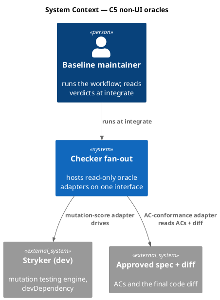
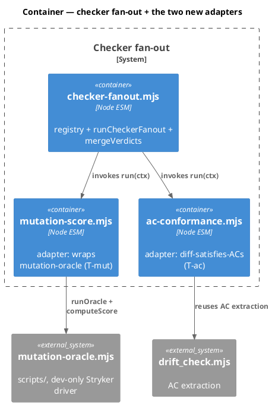
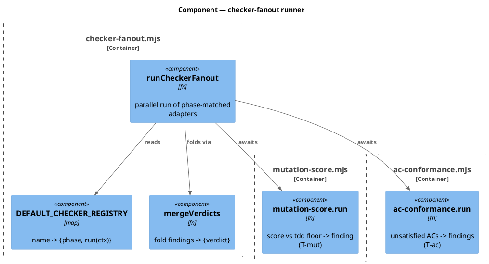
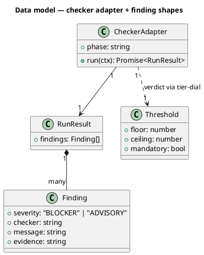
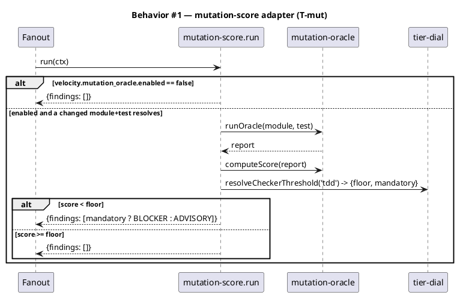
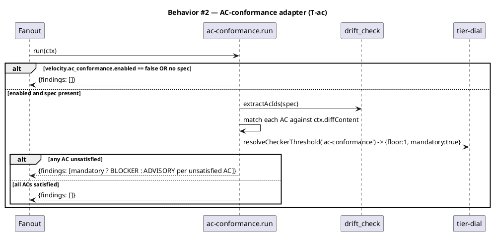
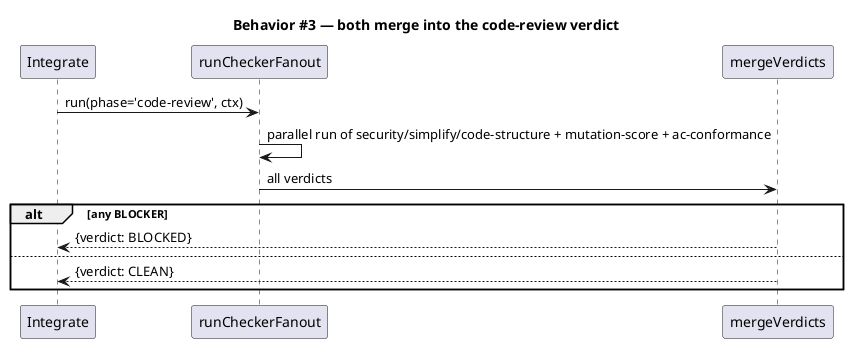
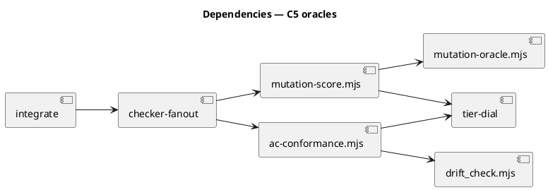

# C5 — prove the oracle framework general: mutation-score + AC-conformance checkers

Roadmap Epic 3 C5. Two non-UI oracles ride the existing checker interface
(`{phase, run(ctx) → {findings}}` + `mergeVerdicts`), proving the framework generalizes beyond the
UI design-judge and the spec-review checkers — it hosts mechanical, non-LLM, non-UI oracles too.

## Context

| Input | Path |
|---|---|
| Intake | *(excepted — spec-entry)* |
| Scout / Research | *(excepted — mapped inline in main context, Article II)* |
| Roadmap item | `docs/roadmap-execution-plan.md` Epic 3 C5 (line 65) |
| Existing machinery | `.claude/skills/harness/checker-fanout.mjs` (registry + `mergeVerdicts` + `runCheckerFanout`), `scripts/mutation-oracle.mjs` (advisory mutation oracle), `.claude/skills/tdd/drift_check.mjs` (AC extraction), `.claude/hooks/lib/tier-dial.mjs` (`resolveCheckerThreshold`) |

**Write set**: `.claude/skills/harness/checkers/mutation-score.mjs`, `.claude/skills/harness/checkers/ac-conformance.mjs`, `.claude/skills/harness/checker-fanout.mjs`, `.claude/skills/integrate/SKILL.md`, `project.json`, `src/project.template.json`, `tests/**` — full diagram set authored.

## Goal

The code-review checker fan-out gains two registrable non-UI oracles — a **mutation-score** checker (test-suite
strength, graduating the advisory `mutation-oracle.mjs`) and an **AC-conformance** checker (does the diff satisfy
the approved spec's ACs) — both on the same `{phase, run(ctx) → {findings}}` interface, gated off by default.

## Non-goals

- Making either oracle blocking by default — both ship **opt-in, off** (mutation is slow + dev-only; AC-conformance is new). Verdict severity is tier-dial-driven when enabled.
- Replacing `drift_check.mjs` — AC-conformance reuses its AC-extraction but is a checker-interface adapter, not a tdd-tick.
- Shipping Stryker to consumers — `mutation-oracle.mjs` stays dev-only (`scripts/`, devDependency); the mutation adapter is a no-op when the tool/flag is absent.
- The maker/checker *replan* loop (`-4c43`) — this wires oracles onto the checker interface; it does not decide when to replan.

## Decisions

> **Which non-UI oracle(s) to ride** — engineer chose **Both** (mutation-score AND AC-conformance) over the recommended mutation-score-only. Owner: engineer (codesign). Rationale: land the maximal generality proof now — two oracles of genuinely different kinds (mechanical mutation testing vs spec-AC satisfaction) on one interface is a stronger "not a one-off" demonstration than a single adapter, and both build on existing machinery (`mutation-oracle.mjs`, `drift_check.mjs` AC-extraction, the `tier-dial` `tdd`/`ac-conformance` slots), bounding the extra cost.

- **Phase = code-review** (integrate, Phase 9): both oracles need the final code diff, so they join the code-review fan-out (`security`/`simplify`/`code-structure`), not the spec-review fan-out.
- **Gating**: `velocity.mutation_oracle.enabled` and `velocity.ac_conformance.enabled`, both default `false`. Off → the adapter's `run(ctx)` returns `{findings: []}` (fail-open skip), so the fan-out is byte-unchanged when both are off.
- **Verdict severity** is tier-dial-driven and **binary on the floor** — `ceiling` is a *rounds* count, not a score band, so there is no floor..ceiling ADVISORY band. The rule: `score < floor` → a finding whose severity is **BLOCKER when the threshold is `mandatory`, else ADVISORY**; `score >= floor` → no finding. `resolveCheckerThreshold('tdd')` = `{floor:0, mandatory:false}` (advisory, floorless until a project raises it); `resolveCheckerThreshold('ac-conformance')` = `{floor:1, mandatory:true}` (every AC must be satisfied → BLOCKER on any miss).

## Design

### C4 — System context



### C4 — Container



### C4 — Component (the fan-out runner)



### Data model — class diagram



#### Migration DDL

```sql
-- No relational migration. Adapters are code; gates are project.json keys
-- (velocity.mutation_oracle.enabled, velocity.ac_conformance.enabled).
-- Forward: register two adapters + add two flags (default false).
-- Reverse: unregister the adapters + delete the flags; fan-out returns to today.
```

### Behavior — sequence per AC







### State — core entity

No state machine — adapters are pure `run(ctx) → {findings}`; the gate flags are static config. Heading kept
so the omission is explicit.

### Dependencies — graph



### Contracts

| Kind | Name | Input | Output | Errors | Idempotent |
|---|---|---|---|---|---|
| Adapter | `mutationScore` | `{phase:'code-review', run(ctx)}` | `{findings}` | fail-open `{findings:[]}` when disabled / tool absent / no module+test | yes |
| Adapter | `acConformance` | `{phase:'code-review', run(ctx)}` | `{findings}` | fail-open `{findings:[]}` when disabled / no spec | yes |
| Fn | `resolveMutationTarget(ctx)` | changedFiles | `{module, test} \| null` | null when unresolvable | yes |
| Fn | `extractAcs(specText)` | spec text | `AC[]` | `[]` on no spec | yes |
| Config | `velocity.mutation_oracle.enabled` | — | bool (default false) | — | — |
| Config | `velocity.ac_conformance.enabled` | — | bool (default false) | — | — |

### Libraries and versions

| Library@version | Purpose | Key APIs | Confirmed against current docs |
|---|---|---|---|
| `@stryker-mutator/core@9.6.1` | mutation testing (dev-only, existing) | driven via `mutation-oracle.runOracle` | yes (already pinned; used by shipped `mutation-oracle.mjs`) |
| Node stdlib | fs / path | `readFileSync`, `join` | n/a |

### Alternatives considered

| Alt | Summary | Rejected because |
|---|---|---|
| A | Mutation-score only (the recommendation) | Engineer chose Both for the maximal generality proof (see Decisions). |
| B | AC-conformance as a tdd-tick, not a checker | The point is to prove the CHECKER interface generalizes; a tdd-tick would not exercise the registry + mergeVerdicts. |
| C | Ship mutation blocking by default | Stryker is slow + dev-only; a per-integrate mutation run would tax every workflow. Opt-in, off. |

## Design calls

*(none)* — no UI surface; `write_set` does not intersect `tdd.ui_globs`.

## Acceptance criteria

| ID | Criterion (given / when / then) | Kind | Upstream AC | Sequence |
|---|---|---|---|---|
| AC-001 | given `velocity.mutation_oracle.enabled=false`, when the mutation-score adapter's `run(ctx)` executes, then it returns `{findings: []}` without invoking Stryker | behavior | C5 | §Behavior #1 |
| AC-002 | given the flag on and a changed module+test resolve, when the adapter runs, then it computes the mutation score and emits a finding when `score < floor` (BLOCKER if the `tdd` threshold is `mandatory`, else ADVISORY) and no finding when `score >= floor` | behavior | C5 | §Behavior #1 |
| AC-003 | given `velocity.ac_conformance.enabled=false` or no approved spec, when the AC-conformance adapter runs, then it returns `{findings: []}` | behavior | C5 | §Behavior #2 |
| AC-004 | given the flag on and an approved spec, when the adapter runs, then it extracts the spec ACs (via drift_check's extractor) and emits a finding for each AC unsatisfied by the diff — BLOCKER since the `ac-conformance` threshold is `mandatory` (floor=1); no finding when every AC is satisfied | behavior | C5 | §Behavior #2 |
| AC-005 | given both adapters registered, when the code-review fan-out runs at integrate, then both are invoked in parallel and their findings merge into the single code-review verdict (any BLOCKER → BLOCKED) | behavior | C5 | §Behavior #3 |
| AC-006 | given both flags off, when the code-review fan-out runs, then the merged verdict is byte-identical to today's (fail-open, no regression) | behavior | C5 | §Behavior #3 |

## Test plan

| Category | Scenario | Expected | Covers |
|---|---|---|---|
| Golden path | mutation adapter, flag off | `{findings: []}`, Stryker not spawned | AC-001 |
| Contract | mutation adapter, score below a mandatory floor | one BLOCKER finding | AC-002 |
| Input boundary | score below a non-mandatory floor; score == floor | ADVISORY finding; no finding | AC-002 |
| Golden path | AC-conformance, flag off / no spec | `{findings: []}` | AC-003 |
| Contract | AC-conformance, spec with one AC absent from the diff | one finding for that AC | AC-004 |
| Concurrency | both registered, fan-out at code-review | both invoked, verdicts merged | AC-005 |
| Regression trap | both flags off, code-review fan-out | verdict unchanged vs baseline | AC-006 |

## Observability

| Signal | Name | Shape | Purpose |
|---|---|---|---|
| Finding | `mutation-score` | `{severity, message: "score X < floor Y"}` | surfaced at integrate |
| Finding | `ac-conformance` | `{severity, message: "AC-NNN unsatisfied"}` | surfaced at integrate |
| Projection | `.claude/state/checker-fanout-code/<slug>.json` | merged verdict | the code-review verdict record (existing path) |

## Rollout

### Prerequisites

- *(none)* — additive adapters behind two default-off flags; the fan-out is unchanged when both are off (AC-006 defends this).

- **Feature flags**: `velocity.mutation_oracle.enabled`, `velocity.ac_conformance.enabled` — both default off.
- **Migration order**: n/a.
- **Canary**: enable on this repo's own workflows first (dogfood); consumers stay off.

## Rollback

- **Kill-switch**: set both flags false (or `git revert` the registry entries) — the fan-out returns to today's three code-review checkers.
- **Signal to roll back**: a mutation/AC adapter throwing (should be impossible — fail-open by contract) or inflating integrate time unacceptably; the suite + `audit-baseline` gate CI.

## Archive plan

- Defaults *(automatic)*: spec, spec approval, security, workflow state.
- Extras *(none)*.

## Open questions

- *(none)* — the oracle choice (Both) is resolved in Decisions; phase (code-review), gating (two default-off flags), and verdict source (tier-dial `tdd` / `ac-conformance`) are all pinned.
