# Spec — Spec quality floor (roadmap B1)

<!--
Technical spec. Produced by the `spec` skill.
Upstream: docs/roadmap-execution-plan.md → Epic 2 → B1 (head of the critical path).
-->

## Context

| Input | Path |
|---|---|
| Intake | *(none — spec-entry track; roadmap is the upstream source)* |
| BRD *(if any)* | *(none)* |
| Scout *(if any)* | *(none)* |
| Research *(if any)* | *(none)* |
| Roadmap | `docs/roadmap-execution-plan.md` → Epic 2 → B1 |

**Write set**: `.claude/hooks/spec_design_calls_guard.mjs`, `.claude/hooks/lib/design-calls.mjs`, `.claude/skills/spec-lint/lint.mjs`, `.claude/skills/spec/template.md`, `tests/spec-lint-design-calls.test.mjs`, `tests/design-calls-quality-floor.test.mjs` — touches `.claude/hooks/**` (a `security.sensitive_globs` path, outside the non-architectural diagram profile), so the full C4 diagram set and a security review both apply.

## Goal

Any spec whose `write_set` intersects `project.json → tdd.ui_globs` must declare, for every design-call row, a concrete **reference target** and at least one measurable **quality criterion** — not merely a non-empty `## Design calls` row — enforced identically by the `spec_design_calls_guard` write-boundary hook and the `/spec-lint` checker.

## Non-goals

- Building the C4 design-judge (the downstream consumer of the reference target). B1 defines the contract; C4 consumes it.
- Promoting quality criteria to typed rows in the spec's Acceptance-criteria table (a new AC `Kind: design-quality`). Quality criteria stay inline in the Design calls row for B1; typing them is deferred to C4.
- Changing when the guard *fires* (still exactly: `write_set ∩ ui_globs ≠ ∅`). B1 changes only what a fired guard *requires*.
- Rendering or scoring any UI. No Playwright, no pixel capture in this slice.
- Migrating already-archived specs. The guard acts only on new writes.

## Design

Diagrams are the contract. Prose is only for things a diagram cannot say.

### C4 — System context

Who sets the quality bar and which systems consume it.

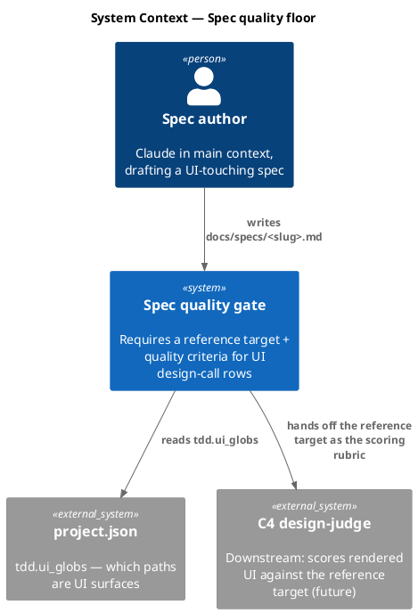

### C4 — Container

Deployable units inside the gate boundary and how they communicate.

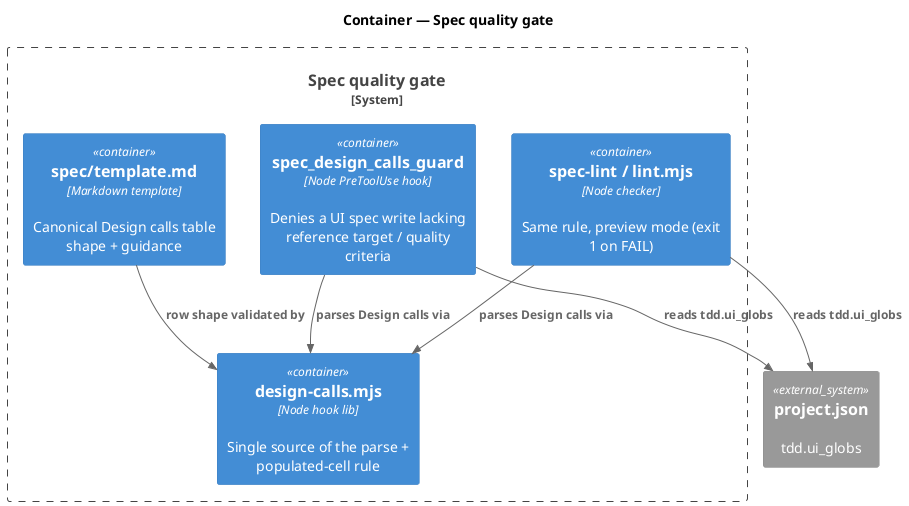

### C4 — Component (changed containers only)

The guard's internals — the only container whose control flow materially changes.

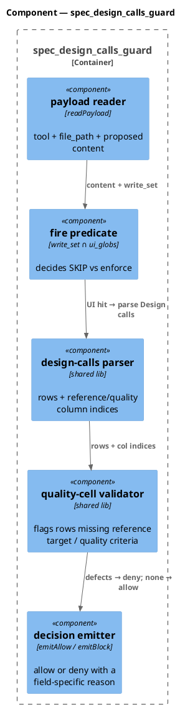

### Data model — class diagram

No datastore. The "schema" is the `## Design calls` markdown table contract; these are the in-memory value objects the shared lib produces. `<<new>>` marks the two fields B1 adds to the row contract.

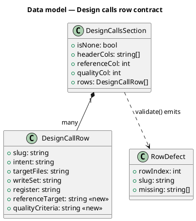

#### Migration DDL

```sql
-- No datastore. The "migration" is a documentation-contract change:
-- spec/template.md's `## Design calls` table gains two required columns —
-- Reference target, Quality criteria — and the guard + lint enforce them.
-- No ALTER: the row contract lives in markdown, validated by design-calls.mjs.
```

### Behavior — sequence per AC

One sequence per acceptance criterion. The sequence is the contract.

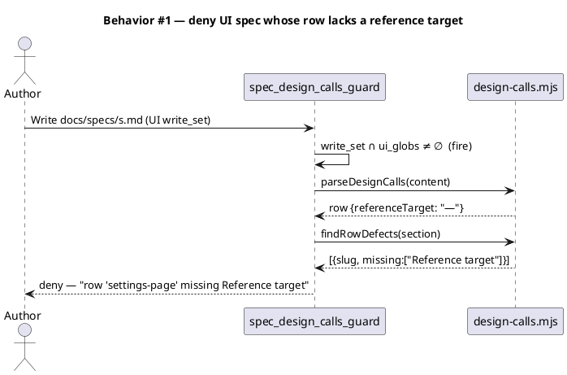

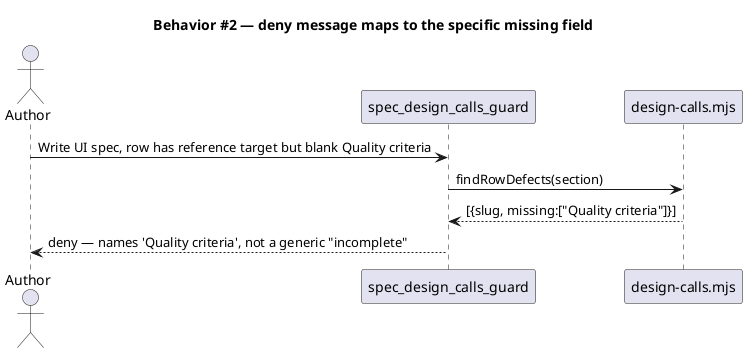

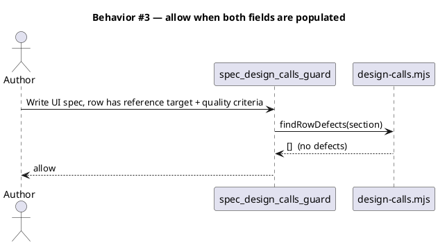

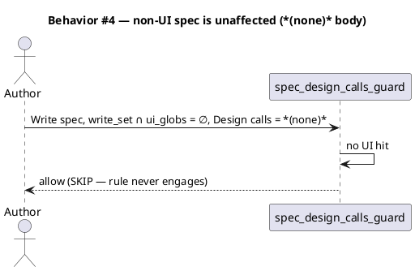

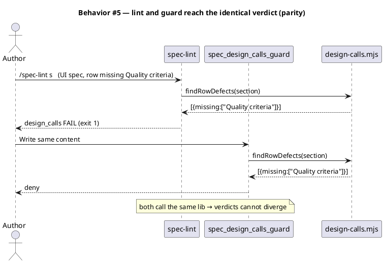

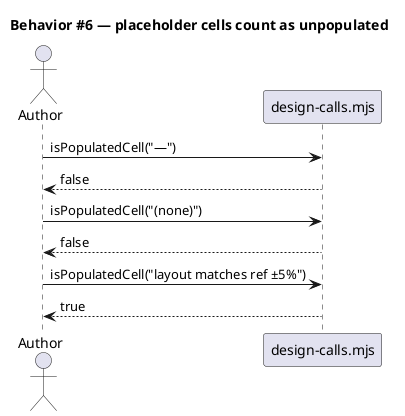

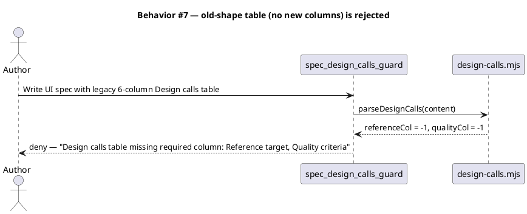

### State — core entity *(only if stateful)*

No non-trivial state machine — the guard is a pure per-write predicate. Heading kept so the omission is explicit.

### Dependencies — graph

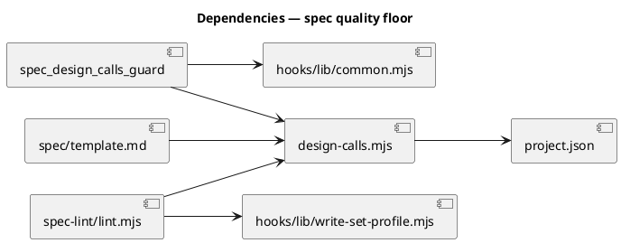

### Contracts

One row per exported surface. The shared lib is the pinned API both consumers bind to.

| Kind | Name | Input | Output | Errors | Idempotent |
|---|---|---|---|---|---|
| Function | `parseDesignCalls(specContent)` | spec markdown (string) | `DesignCallsSection {isNone, headerCols, referenceCol, qualityCol, rows[]}` | never throws; malformed → `{isNone:false, rows:[], referenceCol:-1, qualityCol:-1}` | yes (pure) |
| Function | `isPopulatedCell(text)` | cell text (string) | bool — false for empty, `—`, `-`, `(none)`, `tbd`, `n/a` (case-insensitive) | never throws | yes (pure) |
| Function | `findRowDefects(section)` | `DesignCallsSection` | `RowDefect[]` — one per row missing reference target and/or quality criteria; a missing column marks every row defective | never throws | yes (pure) |
| CLI | `lint.mjs <slug>` → `design_calls` row | saved spec | `PASS` / `FAIL` / `SKIP` + detail; exit 1 on any FAIL | exit 2 on missing spec | yes |
| Hook | `spec_design_calls_guard` (PreToolUse) | Write/Edit/MultiEdit payload | `emitAllow()` or `emitBlock(reason)` | fails open on unreadable config (allow) | yes |

### Libraries and versions

No third-party libraries. Node.js stdlib only (`node:fs`, `node:path`, `node:url`, `node:child_process`) — same surface the existing guard and lint already use. No `context7` lookup required (no external API).

| Library@version | Purpose | Key APIs | Confirmed against current docs |
|---|---|---|---|
| Node stdlib (runtime pinned) | file read, path, regex | `readFileSync`, `basename`, `relative` | n/a — stdlib, no external recall |

### Alternatives considered

| Alt | Summary | Rejected because |
|---|---|---|
| A | Add a separate `## Reference targets` section instead of extending the Design calls table | Splits one UI surface's contract across two sections; the row already binds slug→surface, so the reference belongs on the row. More heading surface for the template guard, no gain. |
| B | Make quality criteria real Acceptance-criteria rows (new `Kind: design-quality`) | Forces a 4th component (AC-table schema + traceability-check exemption for sequence-less design ACs); out of B1's scope. Deferred to C4. |
| C | Duplicate the populated-cell rule inline in both guard and lint | This is the exact guard↔lint divergence lint.mjs already warns against ("so spec-lint and the write-boundary guard never disagree"). A shared lib makes divergence structurally impossible. |
| D | Repurpose the existing advisory `References` column as the reference target | `References` is optional inspiration links; silently making it load-bearing would pass old specs that meant it loosely. A distinct required `Reference target` column fails old-shape tables loudly (Behavior #7). |

## Design calls

Write set has no UI files (`.claude/hooks/**`, `.claude/skills/**`, `tests/**`, `*.md` — none match `tdd.ui_globs`), so this section is intentionally empty.

- *(none)*

## Acceptance criteria

Numbered, testable, traced. `Kind` tags enforcement ACs that Rollout prerequisites bind to.

| ID | Criterion (given / when / then) | Kind | Upstream AC | Sequence |
|---|---|---|---|---|
| AC-001 | given a spec whose `write_set` intersects `tdd.ui_globs`, when a Design calls data row's `Reference target` cell is empty or a placeholder, then the guard denies the write | behavior | roadmap B1 | §Behavior #1 |
| AC-002 | given the same, when a row's `Quality criteria` cell is empty or a placeholder, then the guard denies AND the reason names `Quality criteria` specifically (not a generic "incomplete") | error-mapping | roadmap B1 | §Behavior #2 |
| AC-003 | given a UI spec whose every Design calls row has both a populated `Reference target` and ≥1 `Quality criteria`, when written, then the guard allows | behavior | roadmap B1 | §Behavior #3 |
| AC-004 | given a spec whose `write_set` does not intersect `tdd.ui_globs` (Design calls `*(none)*`), when written, then the guard allows unchanged (rule never engages) | behavior | roadmap B1 | §Behavior #4 |
| AC-005 | given identical spec content, when both `/spec-lint` and the guard evaluate it, then they reach the same verdict on the design-calls rule (parity via the shared lib) | smoke | roadmap B1 | §Behavior #5 |
| AC-006 | given a cell value, when passed to `isPopulatedCell`, then `—`, `-`, `(none)`, `tbd`, `n/a`, and empty return false and any real criterion returns true | behavior | roadmap B1 | §Behavior #6 |
| AC-007 | given a UI spec whose Design calls table lacks the `Reference target` or `Quality criteria` column header entirely (legacy 6-column shape), when written, then the guard denies naming the missing column, AND `spec/template.md`'s table carries both columns with a populated example | behavior | roadmap B1 | §Behavior #7 |

## Test plan

Scenarios by category. `tests/design-calls-quality-floor.test.mjs` is new; `tests/spec-lint-design-calls.test.mjs`'s `specBody` fixture is updated to the 8-column shape so its existing allow/PASS cases stay green under the new contract.

| Category | Scenario | Expected | Covers |
|---|---|---|---|
| Golden path | UI spec, row has reference target + quality criteria | guard allow / lint `design_calls PASS` | AC-003, AC-005 |
| Contract violation | UI spec, row with blank `Reference target` | guard deny / lint FAIL | AC-001 |
| Contract violation | UI spec, row with blank `Quality criteria` | guard deny, reason names `Quality criteria` | AC-002 |
| Input boundary | cells: `—`, `-`, `(none)`, `tbd`, `n/a`, ``, `real text` | first six unpopulated, last populated | AC-006 |
| Contract violation | UI spec, legacy 6-column Design calls table (no new headers) | guard deny naming missing column | AC-007 |
| Regression trap | non-UI spec with `*(none)*` body | guard allow / lint SKIP (unchanged) | AC-004 |
| Regression trap | existing `spec-lint-design-calls.test.mjs` allow/deny cases | still green under 8-column fixture | AC-003, AC-004 |
| Concurrency / ordering | — | — | — |
| Failure mode | unreadable `project.json` | guard fails open (allow) | AC-004 |

## Observability

The guard and lint are synchronous dev-time tools; their "signal" is the deny reason and the lint report row, not runtime telemetry.

| Signal | Name | Shape | Purpose |
|---|---|---|---|
| Log | guard deny reason | stderr JSON `permissionDecision: deny` + field-specific reason string | tells the author which row/column failed |
| Log | `design_calls` lint row | stdout table row: `design_calls  FAIL  <detail>` | preview the same verdict before save |

## Rollout

### Prerequisites

| # | Prerequisite | enforced-by |
|---|---|---|
| 1 | The guard and `/spec-lint` MUST evaluate the design-calls rule through the one shared `design-calls.mjs` lib, so their verdicts cannot diverge | AC-005 |
| 2 | A deny/FAIL MUST name the specific missing field (`Reference target` / `Quality criteria` / missing column), not a generic message | AC-002 |

- **Feature flag**: none — this is a governance-gate tightening, not a runtime feature. The behavior change is gated only by `tdd.ui_globs` being non-empty (already the guard's fire condition).
- **Migration order**: 1 add shared lib → 2 rewire guard + lint to it → 3 update template → 4 update existing test fixture. No data migration.
- **Canary**: the introduction-workflow pattern — the tightened rule governs the first UI-touching spec written *after* this lands; this spec itself is non-UI so it is unaffected.

## Rollback

- **Kill-switch**: revert the four source files to their pre-B1 state (the shared lib is additive; guard/lint fall back to the populated-row-only check). No persisted state to unwind.
- **Signal to roll back**: a legitimate UI spec is denied despite carrying a real reference target + quality criteria (false positive in `findRowDefects` / column detection). Detect within one workflow: the author hits the guard on a well-formed Design calls table.

## Archive plan

- Defaults *(automatic)*: spec, spec-rendered/, spec approval, security reports.
- Extras *(list any non-default files)*:
  - *(none)*

## Open questions

- **Column header canonical spelling.** The spec standardizes on `Reference target` and `Quality criteria`. The parser matches case-insensitively via `/reference\s+target/` and `/quality/` so the legacy plural `References` column does not accidentally satisfy the reference requirement (Alt D). If a reviewer prefers different header words, they change here before approval — the parser regex is the single point of truth. *(Non-blocking: a concrete default is chosen; this flags it for review.)*
