# Spec — Gate-collapse: approve-direction (intake) + approve-landing (commit)

## Context

| Input | Path |
|---|---|
| Intake | `docs/intake/gate-collapse.md` |
| BRD *(if any)* | — |
| Scout *(if any)* | `docs/scout/gate-collapse.md` |
| Research *(if any)* | `docs/research/gate-collapse.md` |
| Brief | `docs/brief/gate-collapse.md` |

**Write set**: `.claude/hooks/direction_approval_guard.mjs`, `.claude/hooks/consent_gate_grant.mjs`, `.claude/hooks/lib/common.mjs`, `.claude/commands/approve-direction.md`, `.claude/skills/spec/approval-provenance.mjs`, `.claude/skills/harness/SKILL.md`, `.claude/skills/harness/*.mjs`, `.claude/workflows.jsonl`, `.claude/skills/triage/*.mjs`, `.claude/settings.json`, `CLAUDE.md`, `src/CLAUDE.template.md`, `docs/init/seed.md`, `src/seed.template.md`, `.claude/CONSTITUTION.md`, `obj/template/.claude/manifest.json`, `tests/**` — touches `.claude/hooks/**`, so the full C4 diagram set is required.

## Decisions

> These are engineering decisions made in main context (Article II) from the research open-questions. `owner: engineer`; the human ratifies them at the current gate A (`/approve-spec`) for this workflow. Verbatim rationale is canonical where it overrides a Claude default.

- **D-1 — Realize research Candidate A: a dedicated direction gate, not a repurposed spec gate.** `owner: engineer`. The `spec_approval_guard` hook is **renamed** to `direction_approval_guard` with an expanded role (allow the direction-approval token write on a fresh direction marker + keep the `docs/specs/*.md` self-approval scan). Renaming (not adding) keeps the hook count at **26** — a rename cascade (settings.json + manifest + audit expected-name list), never a count cascade. Rejected Candidate B (overload `spec_approval_guard` semantics) and Candidate C (machine auto-writes the token — fails forge-proof).
- **D-2 — The direction token reuses the existing `.claude/state/spec_approvals/<slug>.approval` path.** `owner: engineer`. `epic_approval_guard` and `track_guard.epicInheritanceSatisfied` derive their forge-proof root from that path (`decisions.md:168`). Reusing it means zero change to the epic chain in this slice. The cleaner `direction_approvals/<slug>.approval` rename is deferred to a follow-up that re-anchors both epic consumers in lockstep (Open Question 1).
- **D-3 — Token shape stays conditional on `governance.approval_provenance.enabled` (unchanged from A4).** `owner: engineer`. On → 6-line token with `ledger_ref` (anchored to the CO-A evidence-ledger entry); off → 5-line plain token. This change moves *when* the token is written (intake, not spec) and *which command* writes it, not its shape contract.
- **D-4 — No new content-hash module; feed intake bytes to the existing content-agnostic hasher.** `owner: engineer`. `computeSpecContentHash(bytes)` is sha256 over bytes and does not care whether the bytes are a spec or an intake. The harness resume re-check reads `docs/intake/<slug>.md` bytes for the direction gate instead of `docs/specs/<slug>.md`. `compareSpecHash` is reused as-is.
- **D-5 — The 3→2 base collapse ships ON by default; only the 2→1 further collapse is flag-gated.** `owner: engineer`. With `governance.class.enabled` off (today's default), every workflow presents the two gates (direction + landing). The single-authorization further collapse activates only when `governance.class.enabled === true` AND the workflow's Class is low (`D`/`C`). Off-flag behavior is the two-gate flow — never three, never one.
- **D-6 — The machine spec-review BLOCKED checks relocate from token-write to implementation-entry.** `owner: engineer`. Today `spec_approval_guard` blocks the token write when `spec-shippability` or `checker-fanout` verdict is `BLOCKED`. With the token written at intake (before those verdicts exist), the harness instead checks those verdicts at the `spec-shippability-review → implementation` boundary and **yields to the human as a failure** (spec defect to fix) when `BLOCKED`. No human consent gate; a blocked spec still cannot reach code.
- **D-7 — Gate placement: `approve-direction` fires immediately after `intake`, before scout.** `owner: engineer`. Honors the brainstorm verbatim ("lock direction the moment the request is framed, before spec work"). The human authorizes from the intake ACs + brainstorm brief + CO-A evidence; scout/research/spec/implementation flow mechanically after under that authorization. Residual risk (human approves before scout surfaces landmines) is bounded by the harness failure-yield: a blocking scout/spec finding still stops-and-surfaces. The alternative (post-research placement, more evidence, less latency win) is Open Question 4.

## Goal

A standard solo workflow presents exactly two human consent gates — `approve-direction` at intake and `approve-landing` (`/grant-commit`) at commit — with the forge-proof, provenance-anchored consent property intact and the human `/approve-spec` gate replaced by a mechanical spec-review oracle stack.

## Non-goals

- No consent gate becomes Claude-satisfiable; the `consent_gate_grant` UserPromptSubmit marker remains the sole, out-of-tool-boundary consent source.
- Not enabling `governance.class.enabled`; the collapse degrades cleanly to two gates when it is off.
- Not changing `/approve-swarm` (gate B, swarm path) or `/grant-push` (Bash-time push consent) behavior.
- Not renaming the `spec_approvals/` token directory in this slice (deferred, Open Question 1).

## Design

Diagrams are the contract. Prose is only for what a diagram cannot say.

### C4 — System context

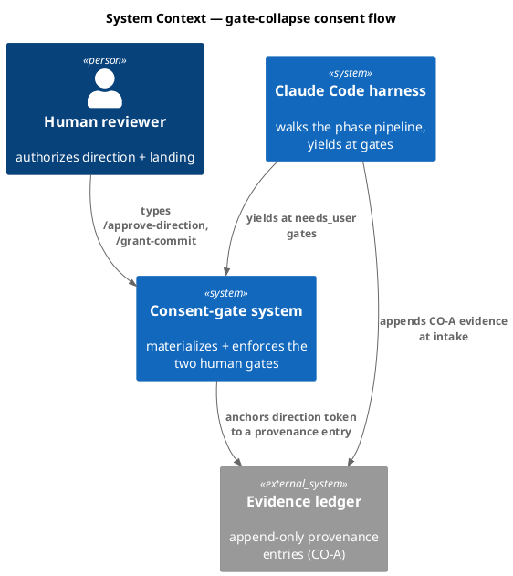

### C4 — Container

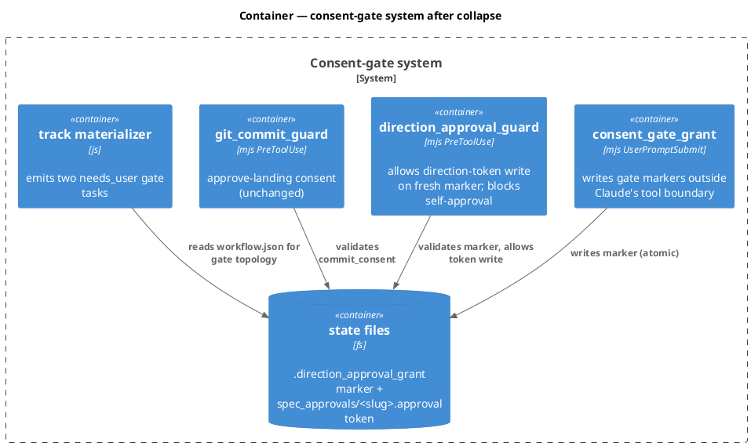

### C4 — Component (changed containers only)

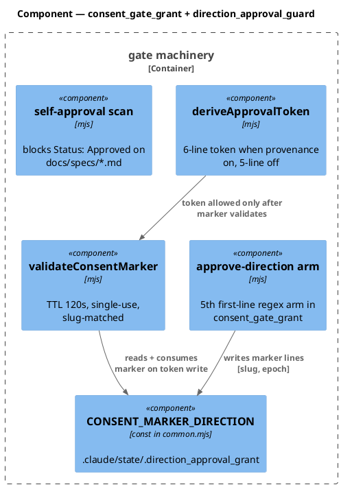

### Data model — class diagram

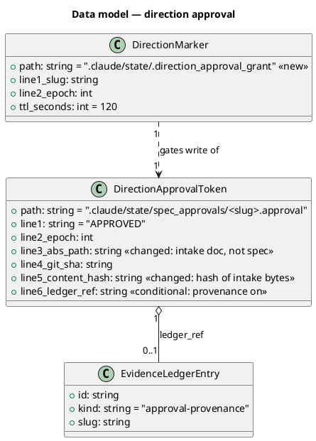

#### Migration DDL

No database. State-file migration (forward/reverse) expressed as file operations:

```sql
-- forward (file operations, not SQL):
--  1. add CONSENT_MARKER_DIRECTION const to .claude/hooks/lib/common.mjs
--  2. rename .claude/hooks/spec_approval_guard.mjs -> direction_approval_guard.mjs (expand role)
--  3. add /approve-direction arm to consent_gate_grant.mjs; retire /approve-spec arm
--  4. rename .claude/commands/approve-spec.md -> approve-direction.md
--  5. move approve-spec DAG node -> approve-direction (after intake) in workflows.jsonl
--  6. amend seed.md §5/§6 + CLAUDE.md Art IV + both mirrors + annex
--  7. regenerate obj/template/.claude/manifest.json
-- reverse:
--  restore spec_approval_guard.mjs, approve-spec.md, the approve-spec DAG node,
--  the pre-amendment constitution files, and the prior manifest (git revert of the landing commit)
```

### Behavior — sequence per AC

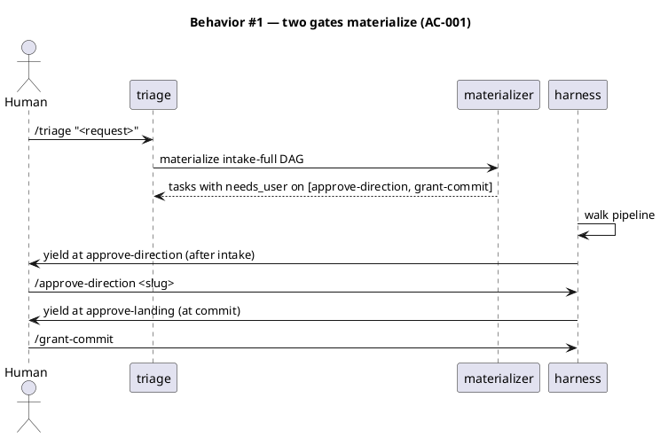

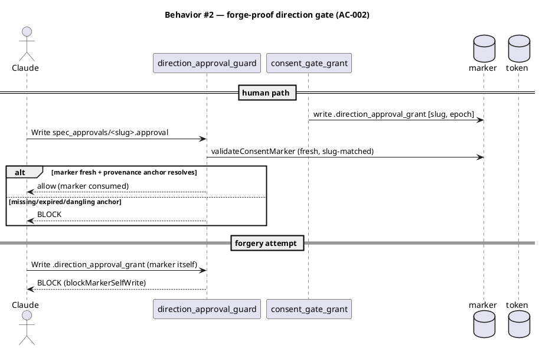

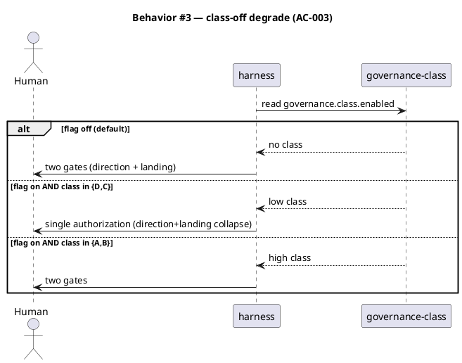

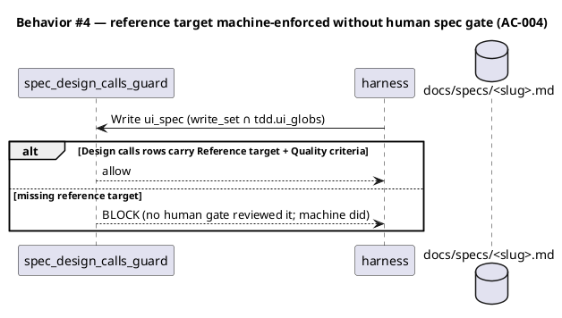

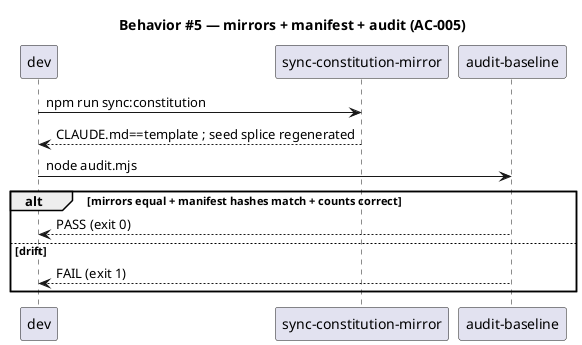

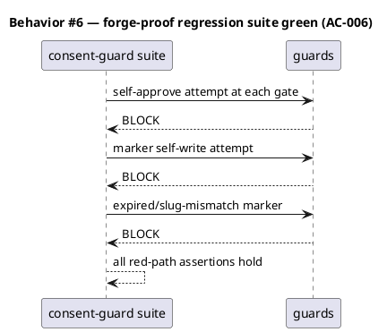

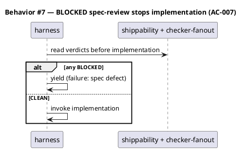

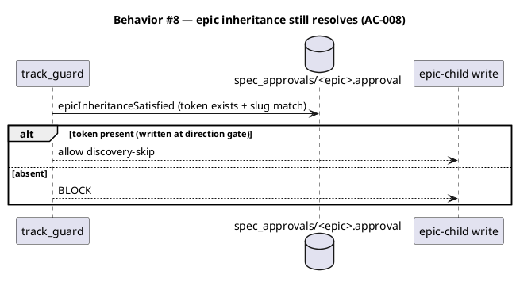

### State — direction gate lifecycle

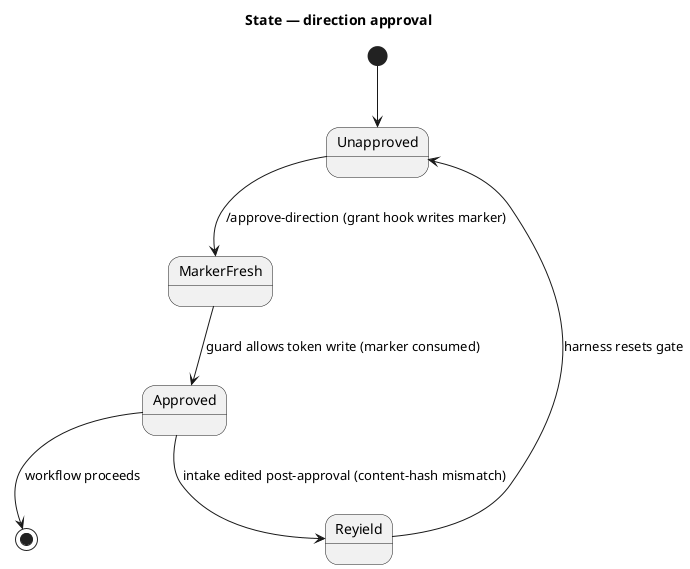

### Dependencies — graph

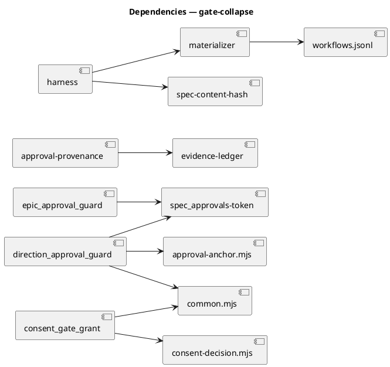

### Contracts

| Kind | Name | Input | Output | Errors | Idempotent |
|---|---|---|---|---|---|
| Command | `/approve-direction <slug>` | slug arg (first line) | `.direction_approval_grant` marker `[slug, epoch]` | silent exit 0 on parse fail (UserPromptSubmit) | yes (marker overwrite) |
| Hook | `direction_approval_guard(payload)` | Write to `spec_approvals/<slug>.approval` or marker | allow / BLOCK | BLOCK on stale/mismatch marker, dangling anchor, marker self-write | n/a |
| Const | `CONSENT_MARKER_DIRECTION` | — | `.claude/state/.direction_approval_grant` | — | n/a |
| Fn | `deriveApprovalToken({slug, ledgerEntry, contentHash, epoch, absPath, gitSha})` | intake path + hash | 5/6-line token lines | throws on unsafe slug | yes |
| Harness | pre-implementation verdict check | shippability + checker-fanout JSON | proceed / yield | yield on BLOCKED | yes |

### Libraries and versions

No third-party libraries. All machinery is in-repo Node ESM (Node ≥ 18, project runtime). Nothing to confirm against context7.

| Library@version | Purpose | Key APIs | Confirmed against current docs |
|---|---|---|---|
| *(none — internal only)* | — | — | n/a |

### Alternatives considered

| Alt | Summary | Rejected because |
|---|---|---|
| B | Retarget existing `spec_approval_guard` (rename command + move node, no new guard) | Drags "spec approval" semantics + spec-time BLOCKED cross-checks onto an intake-time gate; higher subtle-bug risk on a security-critical path |
| C | Machine auto-writes the token at spec time on all-green | Reintroduces a Claude-reachable path to the consent token — fails forge-proof |
| — | Add a new guard AND keep `spec_approval_guard` | Hook count 26→27, governance count cascade for no benefit; rename is count-neutral |

## Design calls

*(none)* — write_set does not intersect `project.json → tdd.ui_globs` (hooks/commands/governance files only; no `site-src/**`, `app/**`, `*.html`, `*.css`).

## Acceptance criteria

| ID | Criterion (given / when / then) | Kind | Upstream AC | Sequence |
|---|---|---|---|---|
| AC-001 | given a solo `intake-full` workflow, when the DAG materializes, then exactly two `needs_user` gates exist — `approve-direction` (after intake) and `grant-commit` (at commit) | behavior | intake AC 1 | §Behavior #1 |
| AC-002 | given the direction gate, when the human approves, then the token write is allowed only on a fresh slug-matched marker AND (when provenance on) a resolvable ledger anchor; when Claude writes the marker or a `Status: Approved` spec line, then it is BLOCKED | error-mapping | intake AC 2 | §Behavior #2 |
| AC-003 | given `governance.class.enabled` off, when any workflow runs, then two gates (never single-auth); given on AND class in {D,C}, then direction+landing collapse to one authorization | behavior | intake AC 3 | §Behavior #3 |
| AC-004 | given a spec whose write_set ∩ `tdd.ui_globs`, when it lacks a reference target, then `spec_design_calls_guard` BLOCKs it even with no human `/approve-spec` gate | error-mapping | intake AC 4 | §Behavior #4 |
| AC-005 | given the change lands, when `audit-baseline` runs, then seed §5/§6 + Article IV amendments present, mirrors byte-equal, manifest regenerated, audit exits 0 | preflight | intake AC 5 | §Behavior #5 |
| AC-006 | given the consent-guard regression suite, when it runs after the change, then no forge-proof regression (self-approval + marker-write BLOCKED at every gate) | smoke | intake AC 6 | §Behavior #6 |
| AC-007 | given a spec with a BLOCKED shippability/checker-fanout verdict, when the harness reaches the implementation boundary, then it yields as a spec defect instead of proceeding | behavior | intake AC 2 (machine substitute) | §Behavior #7 |
| AC-008 | given an epic whose direction token exists at `spec_approvals/<epic>.approval`, when a child writes, then `track_guard.epicInheritanceSatisfied` still resolves | behavior | intake non-goal (epic) | §Behavior #8 |

## Test plan

| Category | Scenario | Expected | Covers |
|---|---|---|---|
| Golden path | materialize intake-full DAG | two needs_user nodes: approve-direction, grant-commit | AC-001 |
| Golden path | human /approve-direction then guard allows token write | token at spec_approvals/<slug>.approval | AC-002 |
| Contract violation | Claude writes .direction_approval_grant marker | BLOCK (blockMarkerSelfWrite) | AC-002 |
| Contract violation | Claude writes `Status: Approved` in docs/specs/<slug>.md | BLOCK (self-approval scan) | AC-002 |
| Input boundary | expired marker (>120s) / slug mismatch | BLOCK | AC-002 |
| Contract violation | provenance on, no ledger entry | BLOCK (dangling anchor) | AC-002 |
| Golden path | class flag off | two gates rendered | AC-003 |
| Golden path | class flag on, class D | single authorization | AC-003 |
| Contract violation | UI spec missing reference target | BLOCK (design-calls) | AC-004 |
| Failure mode | shippability verdict BLOCKED at impl boundary | harness yields (spec defect) | AC-007 |
| Regression trap | epic child inherits on token at spec_approvals path | allowed | AC-008 |
| Regression trap | audit-baseline after change | PASS (mirrors equal, hooks count 26, manifest matches) | AC-005 |
| Regression trap | full consent-guard suite | all red-path assertions hold | AC-006 |

## Observability

| Signal | Name | Shape | Purpose |
|---|---|---|---|
| Log | harness `<slug>.log` | `yielded at /approve-direction` / `/grant-commit` | audit gate sequence |
| Log | evidence-ledger entry | `kind:approval-provenance` | provenance trail |
| Metric | gate count per workflow | derived from materialized tasklist | verify collapse (2 not 3) |

## Rollout

### Prerequisites

| # | Prerequisite | enforced-by |
|---|---|---|
| 1 | Constitution mirrors regenerated + manifest re-hashed before commit; `audit-baseline` exits 0 | AC-005 |
| 2 | Consent-guard regression suite green (forge-proof preserved) | AC-006 |
| 3 | UI reference-target enforcement still fires with no human spec gate | AC-004 |

- **Feature flag**: the 3→2 base collapse ships ON (no flag — it is the new default). The 2→1 further collapse reads `governance.class.enabled` (default off). Emergency revert = git revert of the landing commit.
- **Migration order**: 1 common.mjs const → 2 rename hook + guard logic → 3 grant-hook arm → 4 command rename → 5 DAG node move → 6 constitution amendments → 7 mirror regen → 8 manifest regen.
- **Canary**: run one full `intake-full` workflow end-to-end (this repo, dogfood) and confirm exactly two human yields before landing.

## Rollback

- **Kill-switch**: `git revert` the landing commit — restores `spec_approval_guard`, `approve-spec` command + node, pre-amendment constitution, prior manifest. No data migration to unwind (state files are transient/gitignored).
- **Signal to roll back**: `audit-baseline` FAIL, or a consent-guard regression, or a workflow that yields at a self-satisfiable gate — any within the first dogfood run.

## Archive plan

- Defaults *(automatic)*: intake, scout, research, brief, spec, spec-rendered/, spec approval, security reports.
- Extras *(list any non-default files)*:
  - *(none)*

## Open questions

1. **Token path rename (deferred).** Reuse `spec_approvals/<slug>.approval` now (chosen, D-2) or rename to `direction_approvals/<slug>.approval` and re-anchor `epic_approval_guard` + `track_guard.epicInheritanceSatisfied` + the annex in lockstep? Recommend the follow-up; confirm the deferral is acceptable.
2. **`/approve-spec` alias.** Rename with no alias (chosen, command count stays 6) or keep `/approve-spec` as a deprecated alias for one release? An alias eases consumer muscle-memory but adds a 7th command + a deprecation path.
3. **Epic direction gate.** On the `epic` track the direction gate also fires at intake and produces the token every child inherits — confirm this is the intended epic behavior (it is consistent, but epics currently approve after the sliced spec).
4. **Gate placement (D-7).** `approve-direction` immediately post-intake (chosen — max latency win, human approves before scout) vs post-research (more evidence, smaller win). Confirm the post-intake placement at gate A.
5. **Non-git / autonomous-landing interaction.** The gate-C carve-out (`requires_commit_consent`) is unchanged; confirm the direction gate has no analogous auto-omit path (it should always fire — direction is never machine-authorized).
