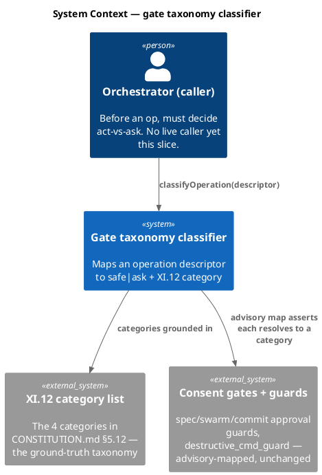
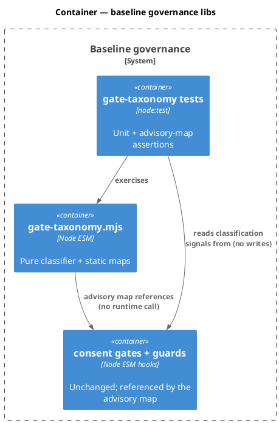
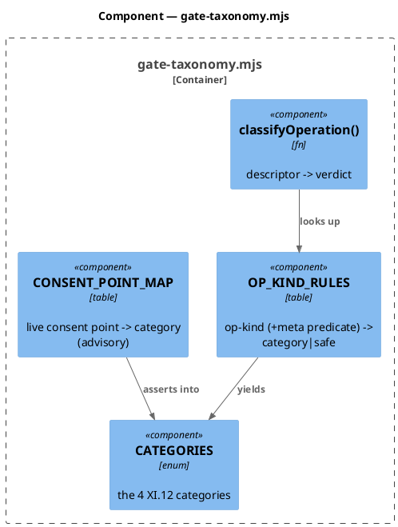
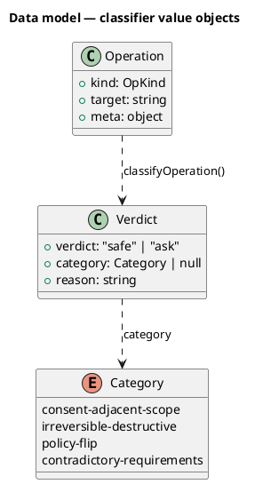
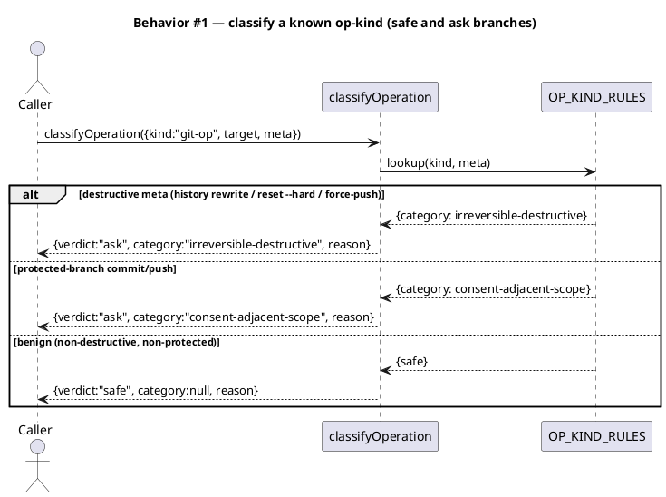
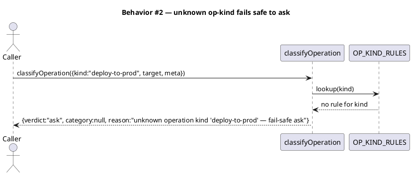
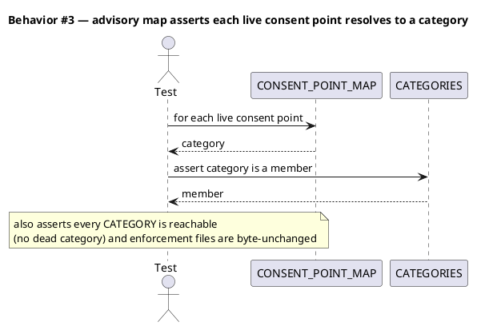
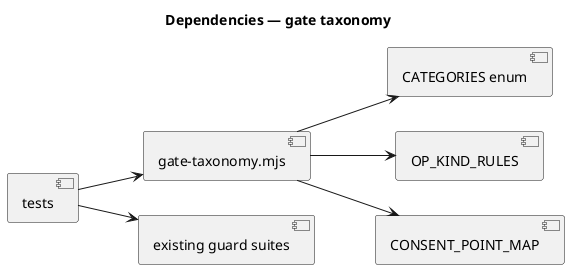

# Spec — Gate taxonomy (C6): a deliberately-coarse safe-vs-ask classifier

## Context

| Input | Path |
|---|---|
| Intake | `docs/intake/gate-taxonomy.md` |
| BRD *(if any)* | — |
| Scout *(if any)* | `docs/scout/gate-taxonomy.md` |
| Research *(if any)* | `docs/research/gate-taxonomy.md` |
| Brief | `docs/brief/gate-taxonomy.md` |

**Write set**: `.claude/hooks/lib/gate-taxonomy.mjs`, `tests/gate-taxonomy.test.mjs`, `tests/gate-taxonomy-advisory-map.test.mjs` — touches `.claude/hooks/**`, a `security.sensitive_globs` path, so the **full C4 diagram set** is required (the reducer never thins docs for a sensitive surface, CWE-693).

## Goal

Ship one pure, deliberately-coarse classifier that maps an operation descriptor to `{ verdict: safe|ask, category, reason }` grounded in the four Article XI.12 categories, plus a test-asserted advisory map proving each live consent point resolves to a category — changing **no** enforcement.

## Non-goals

- Not building autonomy; nothing live calls the classifier this slice.
- Not altering any consent gate or guard — advisory-only (existing guard suites pass unchanged).
- Not parsing raw commands — the caller supplies `kind` and pre-classified `meta` flags (avoids re-implementing guard regexes, the drift landmine).
- Not the AI-native debugging skill; not v2 signal actions; not fine-grained per-op policy.

## Design

Diagrams are the contract. The classifier is a pure ESM module returning a plain-object verdict, mirroring `hooks/lib/consent-decision.mjs`'s `{allow,mode,reason}` shape.

### C4 — System context



### C4 — Container



### C4 — Component (changed container: gate-taxonomy.mjs)



### Data model — class diagram

No persistence — pure in-memory value objects.



#### Migration DDL

```sql
-- No schema change: gate-taxonomy.mjs is a pure in-memory module. No DDL.
```

### Behavior — sequence per AC







### State — core entity *(only if stateful)*

Stateless. The classifier is a pure function with no state machine; the heading is kept so the choice is explicit.

### Dependencies — graph



### Contracts

| Kind | Name | Input | Output | Errors | Idempotent |
|---|---|---|---|---|---|
| Function | `classifyOperation(op)` | `{ kind: string, target?: string, meta?: object }` | `{ verdict: "safe"\|"ask", category: Category\|null, reason: string }` | none — total function; malformed input → `ask` fail-safe | yes (pure) |
| Data | `CATEGORIES` | — | frozen array of the 4 XI.12 category ids | — | yes |
| Data | `CONSENT_POINT_MAP` | — | frozen `{ consentPointId: Category }` | — | yes |

### Libraries and versions

| Library@version | Purpose | Key APIs | Confirmed against current docs |
|---|---|---|---|
| *(none — Node.js standard library only, ESM)* | — | — | n/a |

### Alternatives considered

| Alt | Summary | Rejected because |
|---|---|---|
| B (research) | Harness checker under `skills/harness/checkers/` | Overfits the spec-review checker interface; no phase to run at; premature (YAGNI) |
| C (research) | Classifier parses raw commands, reusing guard regexes | Largest surface, highest drift risk, needs a guard refactor for an advisory-only slice with no caller |

## Design calls

- *(none — no UI surface; write_set does not intersect `tdd.ui_globs`)*

## Acceptance criteria

| ID | Criterion (given / when / then) | Kind | Upstream AC | Sequence |
|---|---|---|---|---|
| AC-001 | given an op from the closed set, when `classifyOperation` runs, then it returns `{verdict, category, reason}` with `verdict ∈ {safe, ask}` and, on `ask`, `category` is exactly one XI.12 category | behavior | intake AC 1 | §Behavior #1 |
| AC-002 | given an op `kind` not in the closed set, when classified, then `verdict` is `ask` with `category: null` and a reason naming the unknown kind | behavior | intake AC 2 | §Behavior #2 |
| AC-003 | given a `safe` verdict, then `category` is `null` (safe ⇔ none of the four apply) | behavior | intake AC 3 | §Behavior #1 |
| AC-004 | given the four XI.12 categories, then each is reachable by at least one closed-set operation (no dead category) | behavior | intake AC 4 | §Behavior #3 |
| AC-005 | given each live consent point (`spec_approval_guard`, `swarm_approval_guard`, `git_commit_guard` commit/push consent + `FORBIDDEN_RE` hard-blocks, `destructive_cmd_guard` hard-block/ask, `epic_approval_guard`, `gitignore_leak_guard`, `branch_guard`), then `CONSENT_POINT_MAP` resolves it to exactly one category, proven by a test | behavior | intake AC 5 | §Behavior #3 |
| AC-006 | given the classifier and map land, then every existing consent-gate and guard test passes byte-unchanged (zero enforcement drift) | smoke | intake AC 6 | §Behavior #3 |

## Test plan

| Category | Scenario | Expected | Covers |
|---|---|---|---|
| Golden path | `git-op` benign; `git-op` destructive; `consent-token-write`; `phase-skip`; `spec-widen`; `config-flip`; `requirement-conflict` | correct `{verdict,category}` per the OP_KIND_RULES table | AC-001, AC-003 |
| Input boundary | empty `{}`; missing `kind`; `meta` absent; unknown `kind` | `ask` + null category + fail-safe reason | AC-002 |
| Coverage | iterate `CATEGORIES` | each category produced by ≥1 op input | AC-004 |
| Contract | each live consent point id | maps to exactly one member of `CATEGORIES` | AC-005 |
| Regression trap | run the existing guard suites unchanged | all pass; no enforcement file edited | AC-006 |
| Purity | call `classifyOperation` twice with the same input | identical output; no side effects | AC-001 |

## Observability

| Signal | Name | Shape | Purpose |
|---|---|---|---|
| *(none)* | — | pure library, no runtime caller this slice — nothing to instrument | — |

## Rollout

### Prerequisites

| # | Prerequisite | enforced-by |
|---|---|---|
| 1 | Advisory-only: no existing consent-gate or guard enforcement behavior changes when the module lands | AC-006 |

- **Feature flag**: none — the module is inert (no live caller imports it this slice), so there is nothing to gate at runtime. A gating flag arrives with the first real consumer (deferred: dependency — needs a caller that does not exist yet).
- **Migration order**: n/a (no schema, no data).
- **Canary**: n/a (no runtime path).

## Rollback

- **Kill-switch**: delete/revert `gate-taxonomy.mjs` — nothing imports it, so removal is a no-op on all live behavior.
- **Signal to roll back**: any existing guard/gate test regressing (AC-006) — the module must never change enforcement.

## Archive plan

- Defaults *(automatic)*: intake, scout, research, brief, spec, spec-rendered/, spec approval, security report.
- Extras *(list any non-default files)*:
  - *(none)*

## Decisions

> owner: engineer — recorded per XI.12 (routine engineering forks are recorded and reviewed at gate A, not asked).

**D1 — Category→verdict mapping (the OP_KIND_RULES table).** The v1 closed operation set maps to XI.12 categories as:

| op-kind | condition (from caller-supplied `meta`) | verdict | category |
|---|---|---|---|
| `git-op` | `meta.destructive` (history rewrite / `reset --hard` / force-push / `clean -f`) | ask | irreversible-destructive |
| `git-op` | `meta.onProtectedBranch` (ordinary commit/push) | ask | consent-adjacent-scope |
| `git-op` | benign (non-destructive, non-protected) | safe | null |
| `destructive-bash` | `meta.matchedPattern` (hard-block or ask pattern) | ask | irreversible-destructive |
| `destructive-bash` | benign (no pattern) | safe | null |
| `consent-token-write` | any | ask | consent-adjacent-scope |
| `phase-skip` | any | ask | consent-adjacent-scope |
| `spec-widen` | any | ask | consent-adjacent-scope |
| `config-flip` | any (editing a constitution/`project.json`-declared default) | ask | policy-flip |
| `requirement-conflict` | any (proceeding past a detected contradiction) | ask | contradictory-requirements |
| *(unrecognized)* | — | ask | null (fail-safe) |

Rationale: the classifier consumes caller-supplied `meta` flags (`destructive`, `onProtectedBranch`, `matchedPattern`) that the caller derives by reusing the existing guards — the classifier never re-parses commands, so there is no regex drift with `destructive_cmd_guard` (scout landmine). `safe` is reachable only via explicitly-benign `git-op`/`destructive-bash`; every ambiguous or unknown case resolves `ask` (fail-safe).

**D2 — Closed set expanded from 5 to 7 kinds to cover all four categories.** The brainstorm's illustrative closed set (git-op, destructive-bash, consent-token-write, phase-skip, spec-widen) naturally exercises only two categories (consent-adjacent-scope, irreversible-destructive). To honor intake AC-4 ("no dead category") and the goal ("generalize the XI.12 category list"), two kinds are added: `config-flip` → policy-flip, and `requirement-conflict` → contradictory-requirements. This is still deliberately coarse (7 kinds, near-binary verdict). **See Open questions — this is the one load-bearing scope choice for the gate-A reviewer.**

**D3 — Advisory map is test-only.** `CONSENT_POINT_MAP` is exported but consumed only by the advisory-map test this slice (no runtime consumer). Exporting it (rather than inlining in the test) lets a future caller reuse it without a second source of truth. YAGNI-clean: no speculative runtime wiring.

## Open questions

- **[Gate-A decision] Closed-set breadth (D2).** v1 expands the brainstorm's illustrative 5-kind set to **7** so all four XI.12 categories are reachable (intake AC-4). If the reviewer prefers the strict 5-kind set, categories `policy-flip` and `contradictory-requirements` become enum-present-but-operation-unreachable and AC-4 must narrow to "every category reachable by an operation kind (2 of 4) is exercised." Decide at `/approve-spec`: **7-kind (full taxonomy coverage, recommended)** vs **5-kind (strict brief, narrower AC-4)**.
