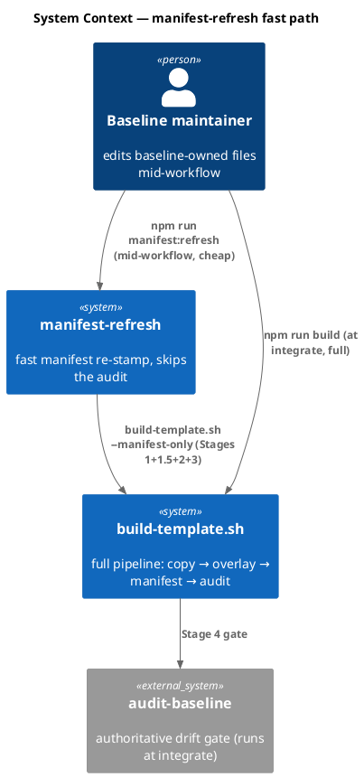
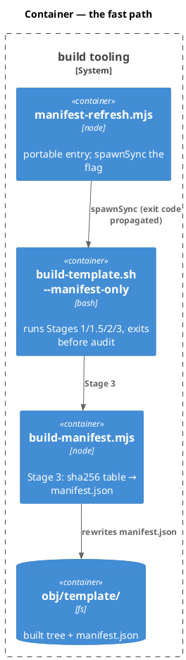
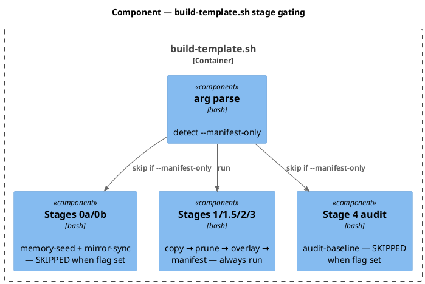
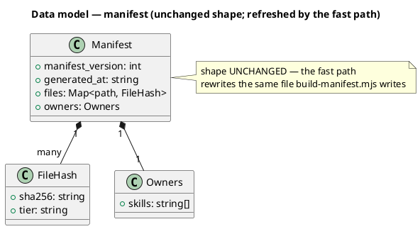
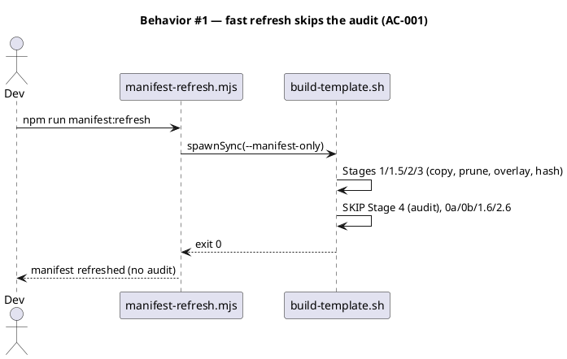
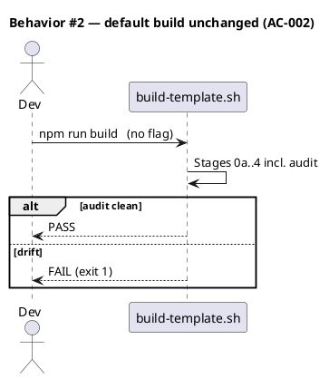
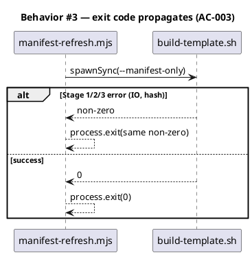
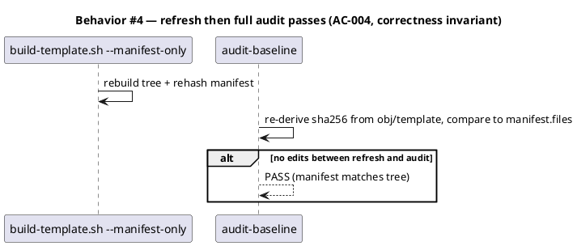
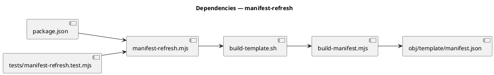

# Spec — Velocity lever ranking (D2) + the rebuild-tax lever

## Context

| Input | Path |
|---|---|
| Intake | `docs/intake/velocity-lever-ranking.md` |
| Scout | `docs/scout/velocity-lever-ranking.md` |
| Research | `docs/research/velocity-lever-ranking.md` |
| Brief | `docs/brief/velocity-lever-ranking.md` |

**Write set**: `scripts/manifest-refresh.mjs`, `scripts/build-template.sh`, `package.json`, `tests/manifest-refresh.test.mjs` — touches `scripts/` (dev-only build tooling, outside the non-architectural profile), so the full C4 diagram set is required.

## Decisions

> Engineering decisions from the deferred brainstorm/research fork. `owner: engineer`; ratified at gate A (already approved as direction) — the build/no-build call was made this phase with the ranking in hand.

- **D-1 — D2 BUILDS the rebuild-tax lever (research Candidate B), not analysis-only.** `owner: engineer`. Rationale: the cheap high-leverage levers (1/2/4/4b, and Lever 5 via D3 gate-collapse) have landed; Lever 3 (model-tiering) is Article-II-blocked; the rebuild-tax lever is the only cheaply-buildable remaining one, and the engineer wants the maintainer-inner-loop speedup landed now. D2 delivers BOTH the ranking (the research memo IS the ranking, archived; + a `decisions.md` entry at memory-flush) AND the lever code.
- **D-2 — The fast path lives in `build-template.sh --manifest-only`; `manifest-refresh.mjs` is the portable entry that invokes it.** `owner: engineer`. The intake framed `manifest-refresh.mjs` as primary with the flag delegating to it, but reimplementing the tested rsync+overlay copy logic in JS would risk divergence from `build-template.sh`. Instead the flag holds the stage-skipping logic (reusing every tested bash stage) and `manifest-refresh.mjs` is a thin `spawnSync` wrapper (so `npm run manifest:refresh` works and the entry name matches the mental model). Functionally identical to the intake's mechanism; only the delegation direction inverts.
- **D-3 — `--manifest-only` runs Stages 1+1.5+2+3, skips 0a/0b/1.6/2.6/4.** `owner: engineer`. It rebuilds the template tree (copy → prune → overlay) and re-hashes the manifest (Stage 3), so the manifest is self-consistent with the tree. It SKIPS: memory-seed (0a, one-time), mirror-sync + constitution self-heal (0b — the model's responsibility via `sync:constitution`), the shipped-skill prose scan (1.6, advisory), CI-posture artifacts (2.6), and **the full `audit-baseline` (Stage 4)** — the deferrable cost. The authoritative full `build-template.sh` (all stages incl. audit) still runs once at integrate as the real gate.
- **D-4 — Correctness invariant: a `--manifest-only` refresh must produce a manifest that the subsequent full audit accepts.** `owner: engineer`. Because Stage 3 re-hashes the same tree the audit later re-derives from, a fresh `--manifest-only` run followed immediately by a full audit (no further edits) MUST pass. This is the testable safety property (AC-004).

## Goal

Give the baseline maintainer a fast `build-template.sh --manifest-only` path (surfaced as `manifest-refresh.mjs` / `npm run manifest:refresh`) that re-stamps the manifest without the full audit pipeline, so mid-workflow "keep the manifest in sync" checks stop forcing the multi-second build+audit after every baseline-owned edit — while the authoritative full build+audit still gates at integrate.

## Non-goals

- Not changing the full `build-template.sh` default behavior (all stages still run without the flag).
- Not removing or weakening the audit gate — it still runs authoritatively at integrate; `--manifest-only` only *defers* it, never *replaces* it.
- Not an incremental/per-file re-hash (rebuild the tree + hash all; correct-by-construction over clever-but-fragile change tracking — YAGNI until profiling shows the full re-hash is the bottleneck).
- Not a consent-flow or constitutional change — no Article amendment.

## Design

### C4 — System context



### C4 — Container



### C4 — Component (changed containers only)



### Data model — class diagram



#### Migration DDL

No database. No schema change — `manifest.json` shape is unchanged.

```sql
-- forward (file/flag operations, not SQL):
--  1. add manifest-refresh.mjs (spawnSync build-template.sh --manifest-only)
--  2. add --manifest-only arg parse to build-template.sh; gate Stages 0a/0b/1.6/2.6/4 behind "not manifest-only"
--  3. add "manifest:refresh" npm script -> node scripts/manifest-refresh.mjs
-- reverse: git revert; the flag is additive, default behavior unchanged
```

### Behavior — sequence per AC









### Dependencies — graph



### Contracts

| Kind | Name | Input | Output | Errors | Idempotent |
|---|---|---|---|---|---|
| CLI | `build-template.sh --manifest-only` | flag | rebuilt tree + fresh `manifest.json`; exits before Stage 4 | non-zero on copy/overlay/hash failure | yes (re-run → same manifest) |
| CLI | `node scripts/manifest-refresh.mjs` | — | spawns the flag; propagates its exit code | non-zero from the child | yes |
| npm | `npm run manifest:refresh` | — | → `manifest-refresh.mjs` | — | yes |

### Libraries and versions

No third-party libraries. Node ESM + Bash, project runtime. Nothing to confirm against context7.

| Library@version | Purpose | Key APIs | Confirmed against current docs |
|---|---|---|---|
| *(none — internal only)* | — | — | n/a |

### Alternatives considered

| Alt | Summary | Rejected because |
|---|---|---|
| Incremental per-file re-hash | Track changed files, re-hash only those | Fragile (stale-tree risk if obj/template not synced); rebuild+full-hash is correct-by-construction and already fast enough |
| `manifest-refresh.mjs` reimplements copy+hash in JS | Pure-node fast path, no bash | Would diverge from `build-template.sh`'s tested rsync/overlay; D-2 keeps one copy path |
| Skip the manifest entirely mid-workflow | Don't refresh at all until integrate | The model can't tell if it broke the manifest until integrate — loses the fast feedback the lever is for |

## Design calls

*(none)* — write_set does not intersect `project.json → tdd.ui_globs` (build tooling + tests only).

## Acceptance criteria

| ID | Criterion (given / when / then) | Kind | Upstream AC | Sequence |
|---|---|---|---|---|
| AC-001 | given baseline-owned edits, when `build-template.sh --manifest-only` runs, then it rebuilds the tree + re-stamps `manifest.json` and does NOT run Stage 4 audit (nor 0a/0b/1.6/2.6) | behavior | intake AC 5 (build elected) | §Behavior #1 |
| AC-002 | given no flag, when `build-template.sh` runs, then all stages incl. audit run and PASS — default behavior byte-unchanged | smoke | intake AC 5 | §Behavior #2 |
| AC-003 | given a Stage 1/2/3 failure under `--manifest-only`, when `manifest-refresh.mjs` wraps it, then the child's non-zero exit is propagated (never swallowed) | error-mapping | intake AC 5 | §Behavior #3 |
| AC-004 | given a `--manifest-only` refresh with no subsequent edits, when the full `audit-baseline` then runs, then it PASSES (manifest matches the tree) | smoke | intake AC 5 (correctness) | §Behavior #4 |
| AC-005 | given the ranking, when D2 lands, then the cross-track ranking is recorded (research memo archived + a `decisions.md` entry) and the `-v0lv` umbrella notes the lever built | behavior | intake AC 1,2,4,5 | §Behavior #1 |

## Test plan

| Category | Scenario | Expected | Covers |
|---|---|---|---|
| Golden path | run `build-template.sh --manifest-only` on a clean tree | manifest.json rewritten; no audit output; exit 0 | AC-001 |
| Golden path | `--manifest-only` does not emit Stage-4/audit markers | audit not invoked (assert on absence of audit stdout markers) | AC-001 |
| Regression trap | `build-template.sh` (no flag) | full run incl. audit still PASS | AC-002 |
| Contract violation | manifest-refresh.mjs when child exits non-zero (simulated) | wrapper exits same non-zero | AC-003 |
| Correctness | `--manifest-only` then full audit, no edits between | audit PASS | AC-004 |
| Golden path | `npm run manifest:refresh` resolves + runs | exit 0 | AC-001 |

## Observability

| Signal | Name | Shape | Purpose |
|---|---|---|---|
| Log | manifest-refresh stderr banner | `manifest-only: skipped audit (deferred to integrate)` | make the deferral visible, not silent |
| Metric | refresh wall-time | (informal, via `timing.md` when run in a phase) | verify the lever actually saves time |

## Rollout

### Prerequisites

| # | Prerequisite | enforced-by |
|---|---|---|
| 1 | The full authoritative audit still gates at integrate (deferral, not removal) | AC-004 |
| 2 | Default `build-template.sh` behavior unchanged (flag is additive) | AC-002 |

- **Feature flag**: none — additive CLI flag, default path unchanged. No behavior change unless `--manifest-only` is passed.
- **Migration order**: 1 flag parse in build-template.sh → 2 manifest-refresh.mjs wrapper → 3 npm script.
- **Canary**: run `--manifest-only` then a full audit on this very repo; confirm PASS (AC-004) before relying on it.

## Rollback

- **Kill-switch**: `git revert` — the flag is additive; removing it restores the single always-full-build path.
- **Signal to roll back**: a `--manifest-only` refresh followed by a clean full audit FAILS (would mean the fast path produces an audit-inconsistent manifest) — must trip on the AC-004 test before landing.

## Archive plan

- Defaults *(automatic)*: intake, scout, research, brief, spec, spec-rendered/, spec approval, security.
- Extras *(list any non-default files)*:
  - *(none)*

## Open questions

- **Ranking recording location.** The research memo (archived as `research.md`) IS the ranking; a `decisions.md` entry at memory-flush records the conclusion + lever built. Confirm this is sufficient, or does the ranking also want a durable `docs/references/` home outside the archive? (Recommend: archive + decisions.md is sufficient; the ranking is a point-in-time synthesis, not a living reference.)
- **Magnitude honesty.** The lever's real saving is skipping Stage 4 (audit ~2-3s + docsite checks) + the prose scan + memory-seed — modest per-invocation but compounds across a many-edit workflow (gate-collapse ran the full build ~6×). The `decisions.md` entry should state the honest magnitude, not oversell.
