# Spec — graph-indexed, one-fact-per-file memory with decision-point surfacing

## Context

| Input | Path |
|---|---|
| Intake | `docs/intake/memory-decision-point-redesign.md` |
| Brief | `docs/brief/memory-decision-point-redesign.md` |
| Scout | `docs/scout/memory-decision-point-redesign.md` |
| Research | `docs/research/memory-decision-point-redesign.md` |

**Write set**: `.claude/memory/**`, `.claude/hooks/process_lifecycle_guard.mjs`, `.claude/hooks/lib/**`, `.claude/skills/memory-index/**`, `.claude/skills/memory-flush/**`, `.claude/skills/audit-baseline/**`, `.claude/settings.json`, `src/memory/**`, `src/CLAUDE.template.md`, `src/seed.template.md`, `CLAUDE.md`, `docs/init/seed.md`, `tests/**` — touches `.claude/hooks/**` (a `security.sensitive_globs` path) → full C4 diagram set + mandatory `security` phase.

## Goal

Project memory stores each fact in its own file under a category directory, injects a compact graph index (not entry bodies) at session start, and surfaces the fact files scoped to a phase — verbatim — before that phase's decision-point write, so a captured lesson is an active constraint rather than a passive archive.

## Non-goals

- Claude Code session-level user memory (the `MEMORY.md` store outside `.claude/memory/`) — untouched.
- Rewriting lesson content — migration is a lossless mechanical explode, not an edit.
- Any runtime dependency or external graph database — store and index stay plain files, generated by zero-dep `.mjs` (Node builtins only).
- Restructuring the continuity trails (`_resume`, `_thread`, `_pending`) into per-fact files — they are inherently single-purpose rolling trails, not multi-entry stores (design decision D3 below); they are re-documented in the new model, not re-sharded.

## Design

Diagrams are the contract. Design decisions:

- **D1 — Category directories.** The seven canonical *files* become seven canonical *directories*; each entry becomes `<category>/<key>.md`. The taxonomy (and its seven skill-owners) survives, minimizing the Article IX / audit reword (research Candidate A).
- **D2 — In-memory index, driftless.** `memory_session_start` builds the graph index in memory from per-fact frontmatter and injects it; no committed generated file (no drift surface). Human vault navigation (AC-8) is served by the per-fact files + native `[[wikilink]]` resolution, not a generated index file.
- **D3 — Continuity trails unchanged in shape.** `_resume`/`_thread`/`_pending` stay single-file trails (re-documented, not re-sharded) — a rolling snapshot is not a set of facts.
- **D4 — Injection generalizes the existing guard, roster stays 26.** `process_lifecycle_guard` gains a second event (Write/Edit on phase artifacts) delegating to a new `scoped-memory.mjs` lib; no new hook file, so the "26 hooks" invariant holds.

### C4 — System context

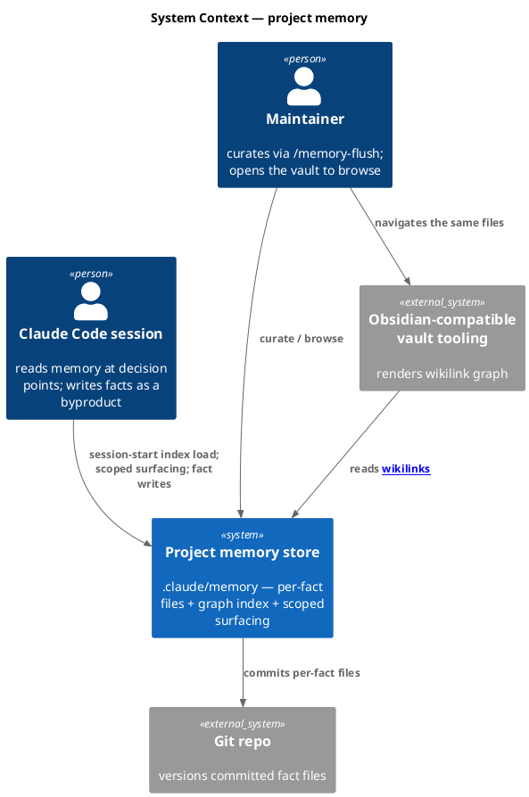

### C4 — Container

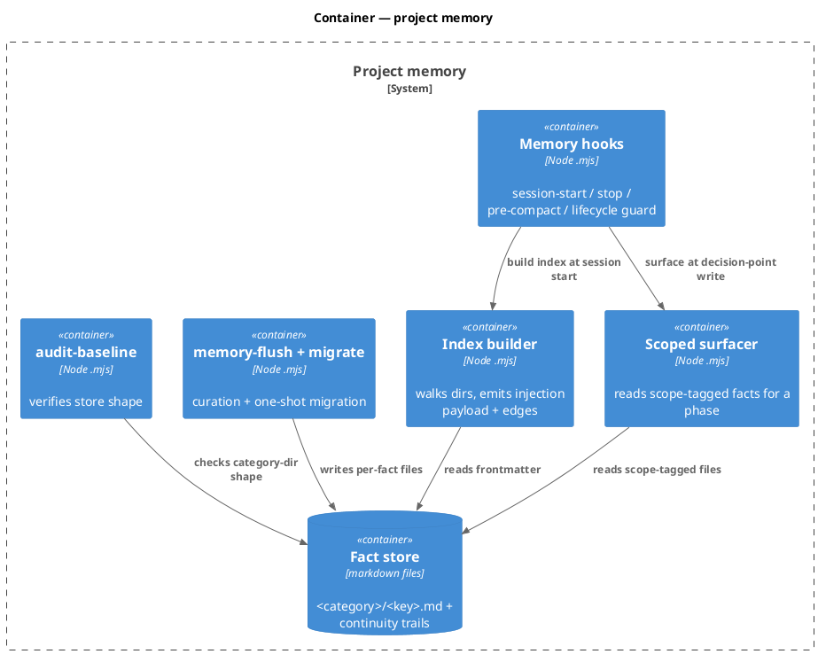

### C4 — Component (changed containers)

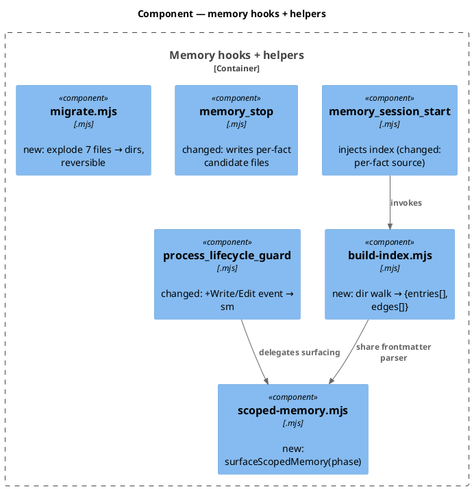

### Data model — class diagram

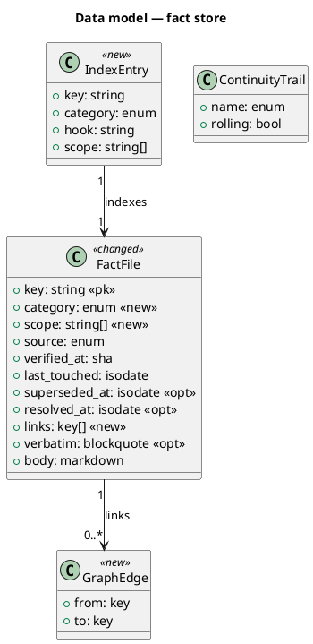

#### Migration (filesystem, reversible)

```text
-- forward (flag memory.sharded_store.enabled: false -> true)
for each canonical file F in {landmarks,libraries,decisions,landmines,conventions,pending-questions,backlog}:
  mkdir .claude/memory/<F>/
  split F on /^## / into blocks; for each block:
    key   := slug from the block heading (existing stable-key rule, README:59-67)
    write .claude/memory/<F>/<key>.md  (frontmatter carried verbatim: source, verified-at, last-touched, verbatim blockquote)
  assert count(files in <F>/) == count(## blocks in F)   # AC-5 fidelity gate
  remove F  (after the assert passes)
-- reverse (true -> false): concatenate <F>/*.md (sorted by key) back into F with the frontmatter preamble; rmdir <F>/
```

### Behavior — sequence per AC

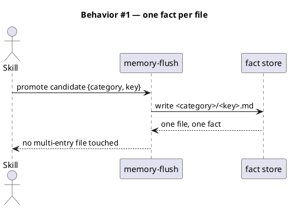

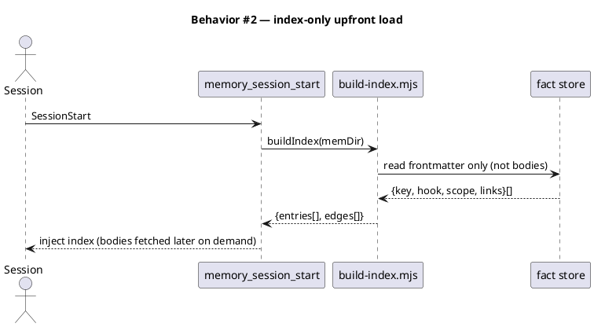

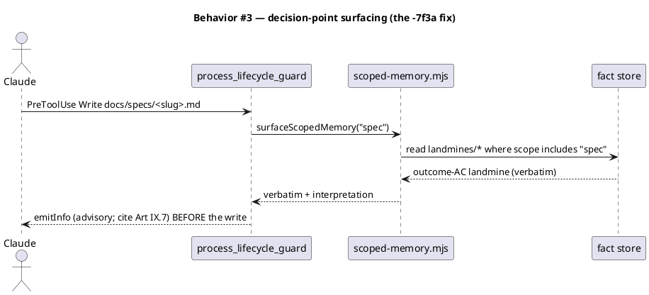

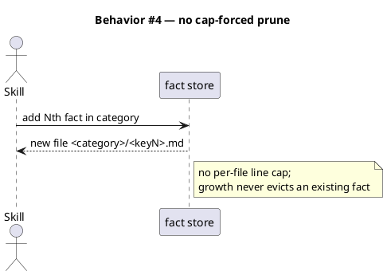

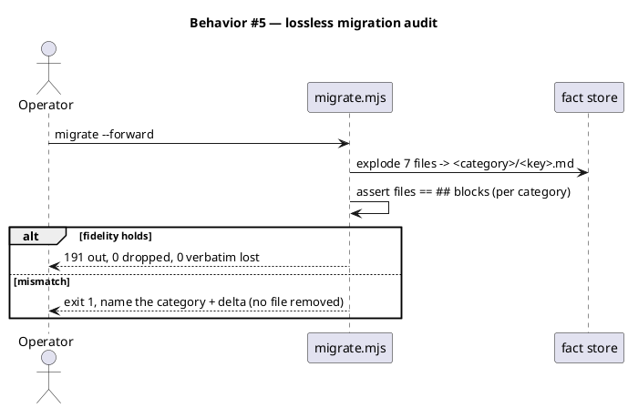

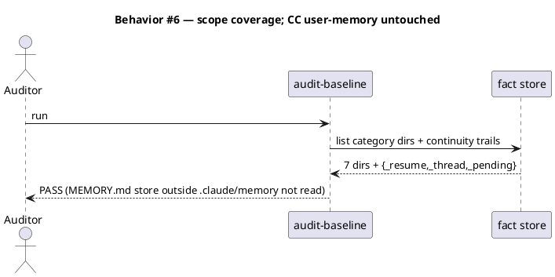

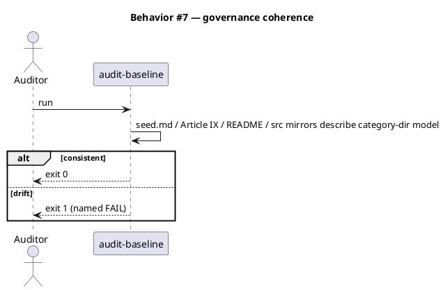

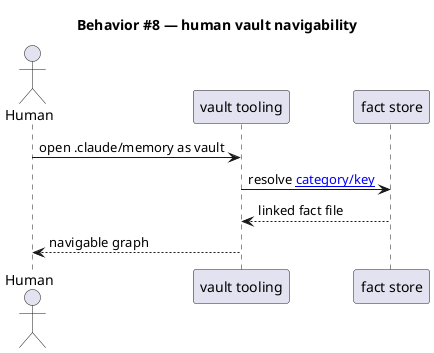

### State — store model flag

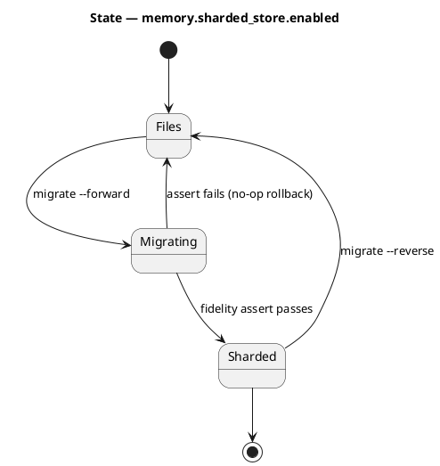

### Dependencies — graph

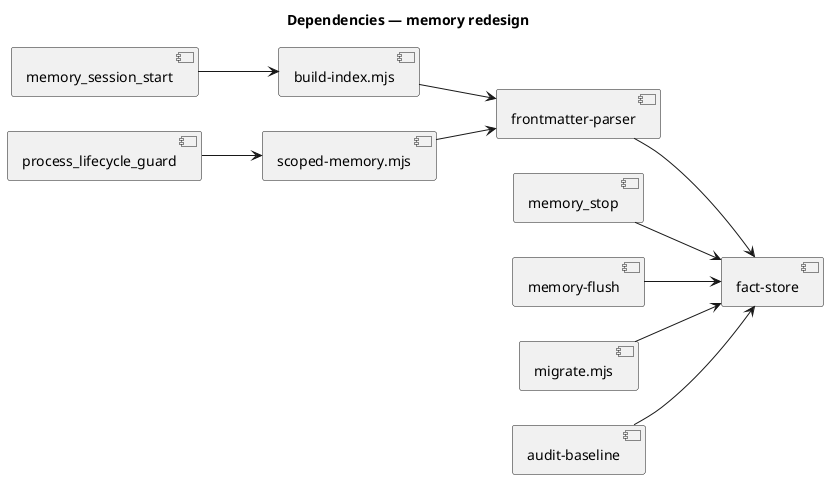

### Contracts

| Kind | Name | Input | Output | Errors | Idempotent |
|---|---|---|---|---|---|
| CLI | `build-index.mjs --root <dir>` | memory dir | JSON `{entries[], edges[]}` on stdout | exit 1 on unreadable dir | yes |
| API | `surfaceScopedMemory(phase, {rootDir})` | phase string | `{key, verbatim, interpretation}[]` | `[]` when none; never throws | yes |
| CLI | `migrate.mjs --forward\|--reverse` | flag | fidelity report; exit 0/1 | exit 1 on count mismatch (no removal) | yes (re-run detects done) |
| Hook | `process_lifecycle_guard` (PreToolUse Bash + Write\|Edit) | tool payload | `emitInfo` advisory | never blocks | yes |
| Config | `memory.sharded_store.enabled` | bool | store model selector | absent → false (files) | — |
| Config | `memory.scope_globs` | `{phase: glob}` map | injection routing | absent → no surfacing | — |

### Libraries and versions

| Library@version | Purpose | Key APIs | Confirmed against current docs |
|---|---|---|---|
| Node stdlib (`node:fs`, `node:path`) | file walk, read, write | `readdirSync`, `readFileSync`, `writeFileSync`, `mkdirSync` | yes — Node 20+ builtins, no third-party API |

No third-party library — `context7` not invoked (nothing external to verify).

### Alternatives considered

| Alt | Summary | Rejected because |
|---|---|---|
| B (flat typed vault + graph.json) | seven categories collapse to `type:`; committed `graph.json` | highest governance/audit rewrite; big-bang migration risk; machine-only JSON in a markdown store (research) |
| C (derived index over existing files) | keep 7 files, add read-layer index | leaves the 500-cap / huge-file problem intact — fails AC-1 + AC-4 (research) |
| New 27th hook for injection | dedicated PreToolUse/Write hook | breaks the "26 hooks" invariant → wider count cascade than extending `process_lifecycle_guard` (D4) |

## Design calls

*(none)* — no `tdd.ui_globs` intersection; this work has no UI surface.

## Acceptance criteria

| ID | Criterion (given / when / then) | Kind | Upstream AC | Sequence |
|---|---|---|---|---|
| AC-001 | given a promoted fact, when written, then it is one file `<category>/<key>.md` with no multi-entry file touched | behavior | intake AC-1 | §Behavior #1 |
| AC-002 | given SessionStart, when memory loads, then the injected payload is the frontmatter-derived index (entries+edges), not entry bodies | behavior | intake AC-2 | §Behavior #2 |
| AC-003 | given a Write to a phase artifact (spec), when the guard fires, then fact files with matching `scope:` are surfaced verbatim before the write — reproducing the outcome-AC `-7f3a` case | behavior | intake AC-3 | §Behavior #3 |
| AC-004 | given category growth to arbitrary N, when a fact is added, then no existing fact is evicted and no file exceeds its one-fact size | behavior | intake AC-4 | §Behavior #4 |
| AC-005 | given the ~191 entries, when `migrate.mjs --forward` runs, then per-category file-count equals `##`-block count and 0 verbatim lost, else exit 1 with no file removed | preflight | intake AC-5 | §Behavior #5 |
| AC-006 | given the store post-migration, when audited, then 7 category dirs + 3 continuity trails exist and the CC `MEMORY.md` store is unread/unchanged | behavior | intake AC-6 | §Behavior #6 |
| AC-007 | given the model change, when `audit-baseline` runs, then seed.md/Article IX/README/src-mirrors are consistent and it exits 0 | smoke | intake AC-7 | §Behavior #7 |
| AC-008 | given the vault opened in Obsidian-compatible tooling, when a `[[category/key]]` link is followed, then it resolves to the fact file | behavior | intake AC-8 | §Behavior #8 |

## Test plan

| Category | Scenario | Expected | Covers |
|---|---|---|---|
| Golden path | promote one fact via memory-flush | single `<category>/<key>.md` written | AC-001 |
| Golden path | session-start on a sharded store | index payload lists keys+scope, no bodies | AC-002 |
| Golden path | Write to `docs/specs/x.md` with a `scope: spec` landmine present | guard emits the verbatim before the write | AC-003 |
| Input boundary | key with unicode / max length / traversal `../` | rejected or safely slugged; no path escape | AC-001 |
| Contract violation | migrate with a category whose block-count ≠ file-count | exit 1, category+delta named, no file removed | AC-005 |
| Concurrency / ordering | two facts same key in one category | last-write replaces (stable-key dedup), no dup file | AC-001 |
| Failure mode | build-index on unreadable dir | exit 1, no partial index injected | AC-002 |
| Regression trap | closure fields (`superseded-at`/`resolved-at`) still auto-close a per-fact file | unchanged behavior | AC-006 |
| Regression trap | audit-baseline on migrated store | exit 0; hook count still 26 | AC-007 |
| Golden path | reverse migration | dirs concatenate back to 7 files byte-faithfully | AC-005 |

## Observability

| Signal | Name | Shape | Purpose |
|---|---|---|---|
| Log | `memory.migrate.result` | fields: `direction, per_category_counts, dropped` | audit the migration |
| Log | `memory.surface.hit` | fields: `phase, keys[]` | confirm decision-point surfacing fired |
| Metric | `memory.index.entries` | gauge | index size trend (cheap-upfront target) |

## Rollout

### Prerequisites

| # | Prerequisite | enforced-by |
|---|---|---|
| 1 | Migration fidelity proven (files == blocks, 0 verbatim lost) before old files removed | AC-005 |
| 2 | `audit-baseline` green on the migrated store + governance mirrors | AC-007 |

- **Feature flag**: `memory.sharded_store.enabled` — default off (`files`). Flip to `true` only after AC-005 passes.
- **Migration order**: 1 explode dirs → 2 dual-read (hooks read dir-or-file per category) → 3 fidelity assert → 4 remove old files → 5 flip flag → 6 governance-doc amendment lands same commit.
- **Canary**: run one full workflow session on the migrated store; success = session-start index injects and one scoped surface fires.

## Rollback

- **Kill-switch**: `memory.sharded_store.enabled: false` + `migrate.mjs --reverse` (concatenates dirs back to the seven files; reversible by construction).
- **Signal to roll back**: `audit-baseline` FAIL, or session-start index empty on a non-empty store — trips within one session start (< 5 min).

## Archive plan

- Defaults *(automatic)*: intake, brief, scout, research, spec, spec-rendered/, spec approval, security reports.
- Extras *(list any non-default files)*:
  - `.claude/skills/memory-index/migrate.mjs` output report (if kept for reference).

## Open questions

- **Scope-tag backfill** — the 191 migrated facts have no `scope:` yet; do they default to their category's owning phase (landmines→security/scout, decisions→spec) or `scope: any`? Drives AC-003 coverage. *(resolve before the surfacing slice implements)*
- **Recurrence auto-graduation** (`-7f3a` direction b) — deferred: `deferred: human-directed` — the intake made surfacing (AC-3) the first-class requirement; hit-count-driven auto-graduation is a follow-on the user did not commit to this cycle.
