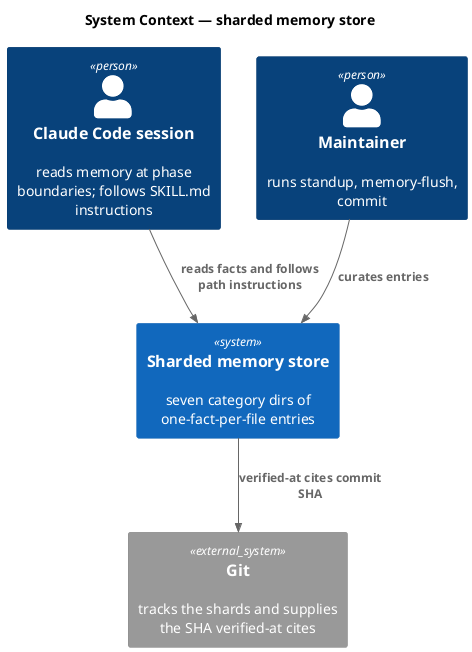
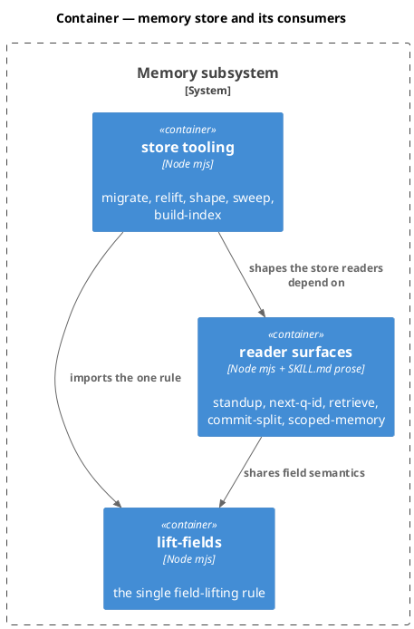
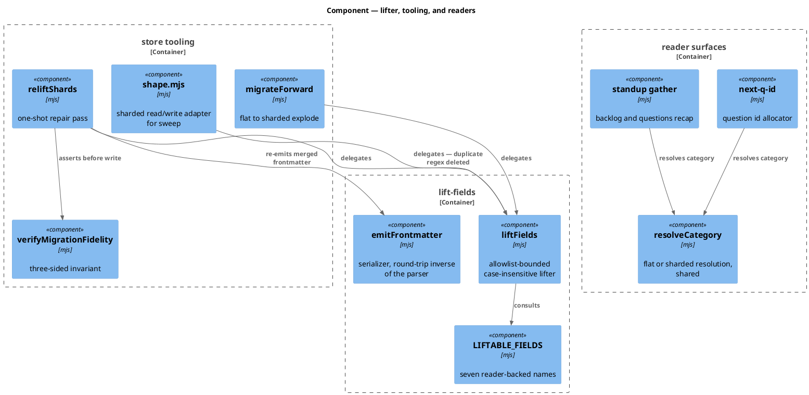
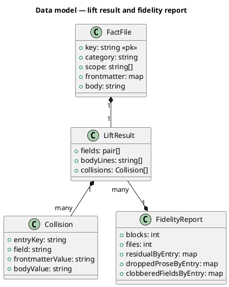
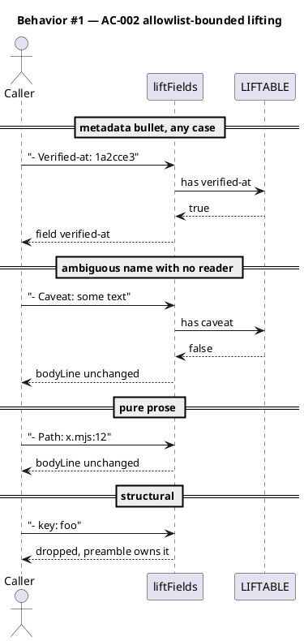
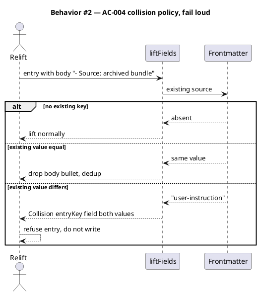
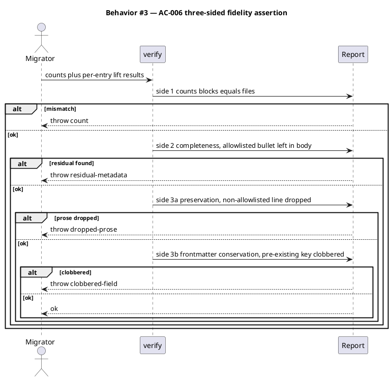
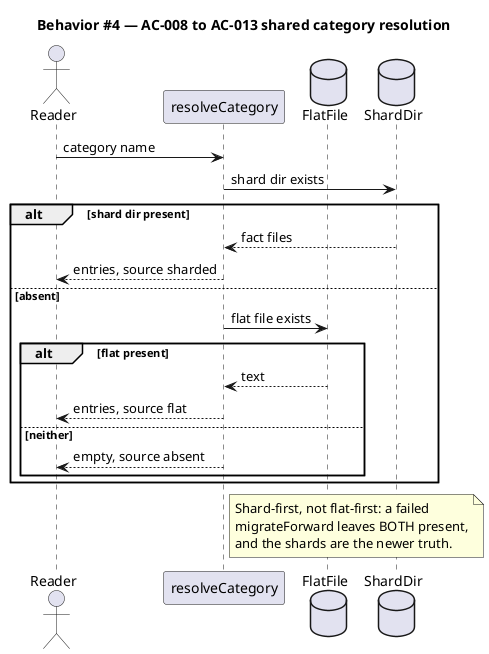
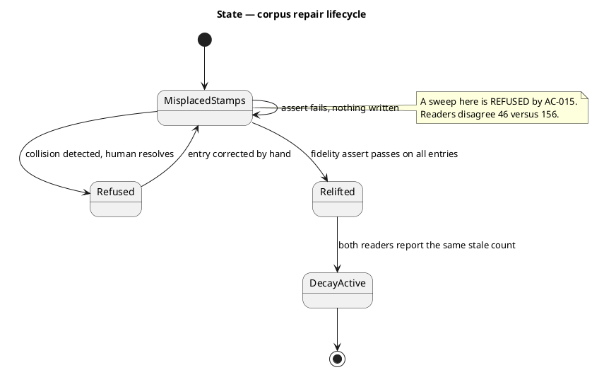
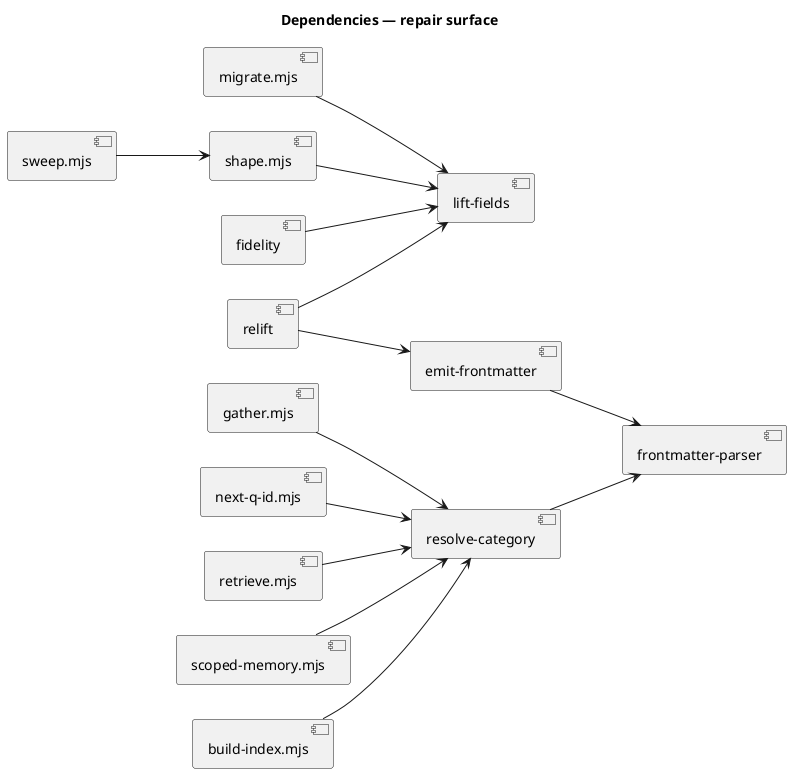

# Shard-migration repair — one lifter, honest fidelity, and no stale readers

## Context

| Input | Path |
|---|---|
| Intake | *(excepted — spec-entry track)* |
| BRD *(if any)* | *(none)* |
| Scout *(if any)* | *(excepted — reader inventory performed in this spec, §Reader inventory)* |
| Research *(if any)* | *(excepted)* |
| Source backlog | `.claude/memory/backlog/repair-shard-migration-field-lifting-and-stale-readers-b4e1.md` |
| Supporting landmine | `.claude/memory/landmines/shard-migration-dropped-capitalized-field-bullets-staleness-blind.md` |
| Adversarial review | two read-only reviewer passes, 2026-07-20 (§Review findings) |

**Write set**: `.claude/skills/memory-index/migrate.mjs`, `.claude/skills/memory-index/lift-fields.mjs` *(new)*, `.claude/skills/memory-flush/shape.mjs`, `.claude/skills/memory-flush/sweep.mjs`, `.claude/skills/standup/gather.mjs`, `.claude/skills/memory-flush/next-q-id.mjs`, `.claude/skills/research/retrieve.mjs`, `.claude/skills/power/commit-split.mjs`, `.claude/hooks/lib/scoped-memory.mjs`, `.claude/skills/memory-index/build-index.mjs`, `.claude/skills/commit/SKILL.md`, `.claude/skills/retrospective/SKILL.md`, `.claude/skills/memory-flush/SKILL.md`, `.claude/skills/standup/SKILL.md`, `.claude/skills/research/SKILL.md`, `.claude/memory/README.md`, `.claude/memory/**`, `docs/handoff/baseline-system-redesign-roadmap.md`, `tests/**`.

## Goal

Exactly one field-lifting implementation exists in the repo, it moves only reader-backed metadata and refuses ambiguous collisions rather than silently resolving them, and no consumer of the memory store — code or prose — still addresses a flat file that no longer exists.

## Non-goals

- **Running a stale sweep or curating entries.** Forbidden until the re-lift lands (AC-015). Curation is separate work.
- **Normalizing cosmetic frontmatter drift.** 25 entries carry `caveat:` in frontmatter and 59 carry `- Caveat:` in the body. Nothing reads either. Leaving both alone is deliberate (VI.4).
- **Reverting `landmarks.md`'s `size-cap: 700`.** Tracked separately as `Q-002`.
- **Resolving the two colliding `source:` entries automatically.** They are surfaced for a human (AC-004); this spec does not guess which meaning wins.

## Review findings that reshaped this spec

An earlier draft of this spec would have shipped a corrupting build. Two adversarial review passes found the following; each is now covered by an AC. Recorded because the *reason* a design was rejected is the most perishable part of a spec.

| # | Finding | Verified evidence | Now covered by |
|---|---|---|---|
| R1 | Lifting a body `- Source:` over an existing frontmatter `source:` overwrites it (last-key-wins), destroying the `user-instruction` provenance that makes a `verbatim:` blockquote mandatory (Art. IX.6) | 2 live entries: `decisions/pm-mode-engineer-mode-paired-helpers-2026-05-29.md`, `decisions/tier-dial-oracle-floors-2026-06-16.md` | AC-004, AC-006 |
| R2 | A **second copy** of the defective regex sits on a write path: `shape.mjs:40` is byte-identical to `migrate.mjs:81`, and `sweep.mjs:88` round-trips shards through it on every `stamp-closure` / `auto-close` / stale sweep — so the next `/commit` re-strands what the repair fixed | `shape.mjs:40`, `sweep.mjs:25,77,88` | AC-003 |
| R3 | Body-side-only fidelity is blind to R1: a collision leaves the body correct and drops nothing, so both original assertion sides pass, and run two then reports `relifted: 0` "clean" | design analysis | AC-006 |
| R4 | Two more blind code readers missed by the first inventory | `research/retrieve.mjs:46` (flat `decisions.md`/`libraries.md` behind `.filter(existsSync)` → silent empty retrieval); `power/commit-split.mjs:22` (`endsWith('backlog.md')` never matches `backlog/<slug>.md` → closure loses last-position ordering, guard blocks the batch) | AC-011, AC-012 |
| R5 | An entire consumer class was never considered: **prose readers**. SKILL.md files instruct Claude to read paths that no longer exist | `commit/SKILL.md:20` says `git add .claude/memory/backlog.md`; also `retrospective`, `memory-flush`, `standup`, `research` SKILL.md, and `memory/README.md` (the schema authority Art. IX cites) | AC-014 |
| R6 | Two allowlist members failed the spec's own reader-derived rule | `estimated-effort` and `raised-in-context`: zero mechanical readers outside tests. `links` has a reader but zero corpus entries | AC-001 |
| R7 | Stranded-bullet count was mis-summed (omitted the `source` row) | measured 275, not 254 | AC-007 |
| R8 | `scoped-memory.mjs` and `build-index.mjs` are shard-**only**, not dual-mode; `build-template.sh:237` ships consumers a **flat** store, so both features are silently inert on a fresh install | `scoped-memory.mjs:64`, `build-index.mjs:30`, `build-template.sh:237` | AC-013 |
| R9 | `AC-008` (forbid a pre-relift sweep) had no implementable home — `sweep.mjs` was outside the write set, and two sweep modes fire automatically from `/commit` and `/memory-flush` | dangling `enforced-by` | AC-015 (now implementable — `sweep.mjs` is in the write set) |

Holes hunted and **not** substantiated, recorded so they are not re-litigated: multi-line continuation bullets, indented sub-bullets, values containing `#`/URLs/markdown links, empty-valued liftable keys. All are latent-only — zero corpus instances today.

## Design

Diagrams are the contract. Prose is only for what a diagram cannot say.

### The defect, and why the prescribed fix is wrong

The source backlog entry prescribes "make the `migrate.mjs:81` regex case-insensitive". **Implementing that as written would corrupt the corpus.** The regex `/^-\s+([a-z][a-z-]*):\s+(.+)$/` lifts body bullets into frontmatter; its lowercase anchor was a *heuristic* separating metadata (`- verified-at:`) from prose labels (`- Path:`). Removing the anchor hoists both:

| Body bullet | Count | Nature |
|---|---:|---|
| `- Verified-at:`, `- Last-touched:` | 254 | metadata — SHOULD lift |
| `- Source:` | 19 | metadata — SHOULD lift (capitalized) |
| `- Role:`, `- Caveat:`, `- Path:`, `- Companion:`, `- Trap:`, `- Mitigation:` and others | ~420 | **prose — MUST NOT lift** |

Capitalization does not separate the classes: `- Source:` is capitalized metadata, `- Path:` is capitalized prose. The correct discriminator is **the field name**, bounded by a closed allowlist matched case-insensitively.

#### Why the allowlist is reader-derived

Several names appear in **both** roles, so "has anyone written this as a field?" cannot decide membership:

| Name | In frontmatter | Stranded in bodies | Verdict |
|---|---:|---:|---|
| `verified-at`, `last-touched` | 160 | 254 | liftable — decay predicate reads them |
| `source` | 46 | 19 | liftable — Art. IX.6 verbatim gate reads it |
| `status`, `superseded-at`, `raised-on` | 64 | 2 | liftable — closure + decay read them |
| `caveat` | 25 | 59 | **not liftable** — no reader |
| `why` | 13 | 8 | **not liftable** — no reader |
| `decision`, `convention`, `reference` | 17 | 31 | **not liftable** — no reader |
| `role`, `path`, `companion`, `trap`, `mitigation` | 0 | 282 | not liftable — pure prose |

Membership rule: **a name is liftable iff a named mechanical consumer reads it.** Nothing reads `caveat:` or `why:`, so both stay in the body *including the 25 entries that already placed `caveat:` in frontmatter*.

Review finding R6 applied this rule to the list itself and removed three members that failed it — `estimated-effort` and `raised-in-context` (no mechanical reader anywhere) and `links` (a reader exists, but zero corpus entries and no lifting need). A field with no reader stays in the body; that is what keeps the list closed rather than accreting every label an entry author invents.

#### `LIFTABLE_FIELDS` (pinned — seven names)

| Field | Mechanical reader | Purpose |
|---|---|---|
| `verified-at` | `memory_session_start.mjs` → `isStale()`; `sweep.mjs` | Art. IX.5 decay — **the bug** |
| `last-touched` | `memory_session_start.mjs` → `isStale()`; `sweep.mjs` | decay, non-git fallback |
| `status` | `closure-check.mjs`; `sweep.mjs` | backlog closure state |
| `superseded-at` | `closure-check.mjs`; `sweep.mjs` | closure stamp, six categories |
| `resolved-at` | `sweep.mjs` | closure stamp, `pending-questions` only |
| `source` | `/memory-flush` verbatim gate (Art. IX.6) | provenance |
| `raised-on` | `sweep.mjs:385` → `modeBacklogDecay` | backlog decay |

`key`, `category`, `scope` are **structural** — owned by the emitted preamble, so a body bullet of that name is dropped rather than lifted (existing behavior).

**Extension rule.** Adding a name requires naming the mechanical consumer that reads it, in the same commit. `estimated-effort`, `raised-in-context`, and `links` were removed under this rule and are the worked example.

### One lifter, not two (R2)

The single most important structural change: `liftFields` moves to a new shared foundation module `memory-index/lift-fields.mjs`, imported by **both** `migrate.mjs` and `shape.mjs`. The duplicate regex is deleted, not fixed in parallel. Two copies of a rule drift; that drift is this entire workflow.

### Collision policy — fail loud, never guess (R1)

When a body bullet's name is liftable **and** the entry's frontmatter already carries that key:

- **values equal** → drop the body bullet (harmless dedup).
- **values differ** → **refuse**. Do not write the entry; report it with both values for a human to resolve.

The two live instances have genuinely different meanings — frontmatter `source: user-instruction` is the provenance *category*, body `- Source: archived bundle at docs/archive/...` is a *pointer*. They are two different fields sharing a name. No mechanical rule can pick correctly, so the pass refuses and names them. This mirrors the `assertSafeSlug` doctrine already load-bearing in this repo: REJECT, never normalize.

### C4 — System context



### C4 — Container



### C4 — Component



### Data model — class diagram



#### Migration DDL

The store is a directory of Markdown fact files, so there is no relational schema. The equivalent file-level transform, forward and reverse:

```sql
-- forward: lift ONLY allowlisted metadata bullets into frontmatter;
-- refuse the entry when a lift would overwrite a differing existing key.
UPDATE fact_file
   SET frontmatter = merge_refusing_conflicts(frontmatter, liftable_bullets(body)),
       body        = body_without(liftable_bullets(body))
 WHERE NOT has_conflicting_key(frontmatter, liftable_bullets(body));

-- reverse: migrateReverse re-emits every frontmatter field as a body bullet.
UPDATE fact_file
   SET body        = body || emit_bullets(frontmatter),
       frontmatter = structural_fields_only(frontmatter);
```

### Behavior — sequence per AC









### State — corpus repair lifecycle



### Dependencies — graph



### Reader inventory (complete — rebuilt after review R4, R5, R8)

**Code consumers of canonical categories:**

| Consumer | State | Action |
|---|---|---|
| `standup/gather.mjs:117,152` | BLIND — flat only | AC-008, AC-009 |
| `memory-flush/next-q-id.mjs:22` | BLIND — flat only, returns `Q-001` while `Q-002` exists | AC-010 |
| `research/retrieve.mjs:46` | BLIND — flat only behind `.filter(existsSync)`, silent empty retrieval | AC-011 |
| `power/commit-split.mjs:22` | BLIND — `endsWith('backlog.md')` misses shards | AC-012 |
| `memory-flush/shape.mjs:40` | **duplicate defective regex on a write path** | AC-003 |
| `memory-flush/sweep.mjs` | shard-aware, but hosts the pre-relift guard | AC-015 |
| `hooks/lib/scoped-memory.mjs:64` | shard-ONLY — inert on a flat consumer install | AC-013 |
| `memory-index/build-index.mjs:30` | shard-ONLY — inert on a flat consumer install | AC-013 |
| `hooks/lib/closure-check.mjs` | dual-mode, correct | leave |
| `commit/closure-precommit-check.mjs:62` | dual-mode, correct | leave |
| `audit-baseline/checks/memory.mjs` | dual-mode, correct | leave |
| `audit-baseline/memory-shape.mjs` | sharded, correct | leave |
| `audit-baseline/derive-counts.mjs:117` | dual-mode, correct | leave |
| `hooks/lib/memory_session_start.mjs` | sharded, frontmatter-only by design | leave |
| `hooks/lib/memory_stop.mjs`, `resume_writer.mjs`, `memory_pre_compact.mjs` | `_pending` / `_resume` only — not sharded | out of scope |
| `git_commit_guard.mjs` | delegates to `closure-check` | leave |
| `scripts/build-manifest.mjs`, `src/cli/install.js` | hashing / template copy | out of scope |

**Prose consumers (R5 — a class the first inventory missed entirely):**

| Surface | Stale instruction | Action |
|---|---|---|
| `commit/SKILL.md:18,20,32,34,35` | `git add .claude/memory/backlog.md` — path does not exist; `git add` errors and the closure never stages | AC-014 |
| `retrospective/SKILL.md:18,30,31,53,64` | reads/writes `landmines.md`, `decisions.md`, `backlog.md` | AC-014 |
| `memory-flush/SKILL.md:31,49,51,84,115,117,195` | "the seven canonical files at `.claude/memory/<name>.md`" | AC-014 |
| `standup/SKILL.md:16` | "Open questions — `pending-questions.md`" | AC-014 |
| `research/SKILL.md:31` | "the decision corpus (`decisions.md`, `libraries.md`)" | AC-014 |
| `.claude/memory/README.md:9-15,61-67,97-98,112,125` | the schema authority Art. IX cites still presents all seven categories as flat files, and documents `status:` as a **body** field | AC-014 |

### Contracts

| Kind | Name | Input | Output | Errors | Idempotent |
|---|---|---|---|---|---|
| Const | `LIFTABLE_FIELDS` | — | `Set` = `{verified-at, last-touched, status, superseded-at, resolved-at, source, raised-on}` | — | yes |
| Const | `STRUCTURAL_FIELDS` | — | `Set` = `{key, category, scope}` — dropped, not lifted | — | yes |
| Function | `liftFields(blockBody, existingFrontmatter)` | body text + current frontmatter map | `{fields, bodyLines, collisions}` | — | yes |
| Function | `emitFrontmatter(map)` | frontmatter map | preamble text; exact round-trip inverse of `parseFrontmatter` for every value shape in the corpus | throws on a value it cannot round-trip | yes |
| Function | `reliftShards(memRoot)` | memory root | `{scanned, relifted, unchanged, refused}` | `MigrationFidelityError`; non-zero `refused` exits 1 | yes — second run reports `relifted: 0` |
| Function | `verifyMigrationFidelity(perCategory, perEntry)` | counts + lift results | `void` | `MigrationFidelityError` naming category, entry key, and side (`count`, `residual-metadata`, `dropped-prose`, `clobbered-field`) | yes |
| Function | `resolveCategory(memRoot, category)` | root + category | `{entries, source: "sharded"\|"flat"\|"absent"}` — **shard-first** | — | yes |
| Function | `assertRelifted(memRoot)` | memory root | `void` | throws named precondition error when any allowlisted bullet remains stranded | yes |
| CLI | `migrate.mjs --relift` | `--root <dir>` | JSON report on stdout | exit 1 on fidelity error or refusal | yes |

### Libraries and versions

No third-party libraries are added or used. Every import is a Node.js built-in (`node:fs`, `node:path`, `node:util`, `node:url`) plus in-repo modules. The current-docs rule (VI.5) is not engaged — no external API is recalled.

| Library@version | Purpose | Key APIs | Confirmed against current docs |
|---|---|---|---|
| *(none — Node built-ins only)* | — | — | n/a |

### Alternatives considered

| Alt | Summary | Rejected because |
|---|---|---|
| A | Case-insensitive regex exactly as the backlog entry prescribes | Hoists ~420 prose bullets into frontmatter, corrupting nearly every landmark and landmine body. The prescription predates the census. |
| B | Value-shape heuristic — lift if the value looks like a SHA or ISO date | `- Source: incident` is metadata with a prose value; `- Path: x.mjs:12` is prose with a code-shaped value. Guessing reintroduces the bug class. |
| C | Lift everything field-shaped, then blocklist known prose labels | Open-ended — every new label a future entry invents silently becomes frontmatter. An allowlist fails safe. |
| D | Assert field-set uniformity across a category | Fails on valid data; `resolved-at` is pending-questions-only. Per-entry conservation is the invariant, not uniformity. |
| E | On collision, prefer frontmatter and drop the body bullet | Silently discards a real value. The two live instances hold genuinely different meanings under one name; only a human can pick. |
| F | Fix `shape.mjs`'s regex in parallel with `migrate.mjs` | Two copies of one rule is what produced this workflow. One shared module, or the drift recurs. |
| G | Abandon the re-lift; teach the session-start reader to parse bodies | No corpus mutation, lower risk — but leaves the store in two shapes indefinitely and contradicts the README's frontmatter-only design. Considered seriously; rejected because it converts a one-shot repair into permanent dual-shape complexity. |

## Design calls

*(none)* — the write set touches no file under `project.json → tdd.ui_globs`.

## Acceptance criteria

| ID | Criterion (given / when / then) | Kind | Upstream AC | Sequence |
|---|---|---|---|---|
| AC-001 | given `LIFTABLE_FIELDS`, when inspected, then it contains exactly the seven names pinned in §Contracts; `estimated-effort`, `raised-in-context`, and `links` are absent, each having no mechanical reader or no corpus instance | behavior | review R6 | §Behavior #1 |
| AC-002 | given a body with `- Verified-at: <sha>`, `- Source: incident`, `- Caveat: <text>`, `- Path: x.mjs:12`, when `liftFields` runs, then the first two lift to frontmatter and the last two remain byte-identical in the body | behavior | backlog `-b4e1` part 1 | §Behavior #1 |
| AC-003 | given the repo after this change, when every source file is searched for the field-lifting regex, then exactly one definition exists (`lift-fields.mjs`), and both `migrate.mjs` and `shape.mjs` import it — `shape.mjs:40`'s copy is deleted | behavior | review R2 | §Behavior #1 |
| AC-004 | given an entry whose frontmatter has `source: user-instruction` and whose body has `- Source: archived bundle at ...`, when the re-lift runs, then the entry is NOT written, a `Collision` naming the key, field, and both values is reported, and the run exits non-zero | preflight | review R1 | §Behavior #2 |
| AC-005 | given any frontmatter map parsed from a corpus entry, when `emitFrontmatter` re-emits it and `parseFrontmatter` re-parses, then the result equals the original map; a value that cannot round-trip raises rather than being silently coerced | behavior | review R5 | §Behavior #3 |
| AC-006 | given a lift result that leaves an allowlisted bullet in a body, drops a non-allowlisted line, or overwrites a pre-existing frontmatter key, when `verifyMigrationFidelity` runs, then it throws naming the category, entry key, and the violated side (`residual-metadata`, `dropped-prose`, `clobbered-field`) | behavior | review R3 | §Behavior #3 |
| AC-007 | given the corpus with 275 stranded allowlisted bullets, when `migrate.mjs --relift` runs and no collision is present, then every one moves to its entry's frontmatter, no non-allowlisted body line changes, and a second run reports `relifted: 0` | behavior | backlog `-b4e1` part 1, review R7 | §Behavior #1 |
| AC-008 | given 16 `backlog/*.md` shards and no flat `backlog.md`, when `gather.mjs` collects the backlog, then it returns all 16 entries with `parent` nesting preserved, and `degraded[]` does NOT contain `no-backlog` | behavior | backlog `-b4e1` part 3 | §Behavior #4 |
| AC-009 | given 1 `pending-questions/*.md` shard and no flat file, when `gather.mjs` collects questions, then it returns that question and `degraded[]` does NOT contain `no-pending-questions` | behavior | backlog `-b4e1` part 3 | §Behavior #4 |
| AC-010 | given a sharded store whose highest question key is `Q-002`, when `next-q-id.mjs` runs, then it prints `Q-003`, reading the id from frontmatter `key:` (not the lowercase filename) | behavior | reader inventory | §Behavior #4 |
| AC-011 | given a sharded store, when `retrieve.mjs` builds its corpus, then `decisions` and `libraries` entries are included; the silent-empty path behind `.filter(existsSync)` is gone | behavior | review R4 | §Behavior #4 |
| AC-012 | given a dirty tree containing `.claude/memory/backlog/<slug>.md`, when `commit-split.mjs` plans commits, then that path is classified as closure and ordered last | behavior | review R4 | §Behavior #4 |
| AC-013 | given a FLAT store (fresh consumer install per `build-template.sh:237`), when `scoped-memory.mjs` and `build-index.mjs` run, then they return the flat entries rather than empty | behavior | review R8 | §Behavior #4 |
| AC-014 | given the six prose surfaces in §Reader inventory, when each is read, then no instruction names a flat canonical path that does not exist; specifically `commit/SKILL.md` directs staging of the sharded entry path, and `README.md` documents the sharded shape including `status:` as a frontmatter field | behavior | review R5 | §Behavior #4 |
| AC-015 | given a corpus with any allowlisted bullet still stranded, when any `sweep.mjs` mode runs (including `stamp-closure` fired automatically by `/commit` and `auto-close` by `/memory-flush`), then it refuses with a named precondition error citing the reader disagreement | preflight | backlog `-b4e1` sequencing, review R9 | §Behavior #3 |
| AC-016 | given `docs/handoff/baseline-system-redesign-roadmap.md` §5 and §6 marking CO-E unshipped, when the correction lands, then both mark it shipped citing `d0166c3` and `c3e1e3e`, and §6 records that the shipped shape revises CO-E's own AC2 | behavior | folded-in scope | §Behavior #4 |
| AC-017 | given a project that has NOT migrated (flat files present, no shard dirs), when every reader in §Reader inventory runs, then behavior is unchanged from today | behavior | back-compat | §Behavior #4 |

## Test plan

| Category | Scenario | Expected | Covers |
|---|---|---|---|
| Golden path | mixed metadata and prose bullets through `liftFields` | metadata lifted, prose byte-identical | AC-002 |
| Golden path | `--relift` over a fixture corpus of stranded stamps | all lifted, counts match | AC-007 |
| Golden path | `gather.mjs` against a sharded fixture | 16 entries, parent nesting intact, no `no-backlog` | AC-008 |
| Golden path | `next-q-id.mjs` against a sharded fixture with `Q-002` | prints `Q-003` | AC-010 |
| Golden path | `retrieve.mjs` against a sharded fixture | decisions and libraries entries present in the corpus | AC-011 |
| Structural | repo-wide search for the lifting regex | exactly one definition; `shape.mjs` imports it | AC-003 |
| Structural | `LIFTABLE_FIELDS` membership | exactly the seven pinned names | AC-001 |
| Idempotence | `--relift` twice | second run `relifted: 0`, corpus byte-identical | AC-007 |
| Input boundary | `- LAST-TOUCHED:` (case variant) | lifted as `last-touched` | AC-002 |
| Input boundary | `- Sparkle:` (unknown name) | stays in body | AC-002 |
| Input boundary | `- Caveat:` (ambiguous, reader-less) | stays in body despite 25 frontmatter instances | AC-002 |
| Input boundary | `- verbatim:` value-less bullet | stays in body | AC-002 |
| Contract violation | body `- Source:` differing from frontmatter `source:` | entry refused, `Collision` reported, exit non-zero | AC-004 |
| Contract violation | body `- Source:` equal to frontmatter `source:` | body bullet dropped, no refusal | AC-004 |
| Contract violation | lift result with residual allowlisted bullet | throws `residual-metadata` | AC-006 |
| Contract violation | lift result dropping a prose line | throws `dropped-prose` | AC-006 |
| Contract violation | lift result overwriting an existing frontmatter key | throws `clobbered-field` | AC-006 |
| Contract violation | `sweep.mjs --mode stamp-closure` pre-relift | refused with the named precondition error | AC-015 |
| Round-trip | `emitFrontmatter` ∘ `parseFrontmatter` over every real corpus entry | identity for all 206 entries | AC-005 |
| Round-trip | `migrateReverse` after relift | flat file reproduces every field as a body bullet | AC-007 |
| Failure mode | shard dir present, one file malformed frontmatter | that entry in `degraded[]`, others returned | AC-008 |
| Failure mode | BOTH flat file and shard dir present (failed `migrateForward`) | shard-first resolution wins | AC-008, AC-017 |
| Failure mode | neither flat nor shard dir | `degraded[]` carries `no-backlog` honestly | AC-008, AC-017 |
| Failure mode | `commit-split.mjs` with a sharded closure path in a mixed dirty tree | closure group ordered last | AC-012 |
| Regression trap | flat-store project through every reader | unchanged from today | AC-013, AC-017 |
| Regression trap | corpus-wide prose-bullet census before vs after relift | ~420 non-allowlisted bullets unchanged in count and content | AC-006, AC-007 |
| Regression trap | grep every SKILL.md and README for flat canonical paths | zero matches | AC-014 |

## Observability

| Signal | Name | Shape | Purpose |
|---|---|---|---|
| Log | `relift.report` | stdout JSON `{scanned, relifted, unchanged, refused}` | audit the one-shot pass |
| Log | `relift.collision` | stderr: entry key, field, both values | name what a human must resolve |
| Log | `fidelity.violation` | stderr: category, entry key, side | name the exact failing entry, not a count |
| Metric | stale-count agreement | session-start hook count vs `sweep.mjs` count | convergence is the proof AC-007 worked |

## Rollout

### Prerequisites

| # | Prerequisite | enforced-by |
|---|---|---|
| 1 | No sweep or curation mode runs while any allowlisted bullet is still stranded | AC-015 |
| 2 | Every colliding entry is human-resolved before the re-lift is trusted | AC-004 |

- **Feature flag**: none. A one-shot data repair plus reader fixes; a flag would leave the corpus in the state being repaired out of.
- **Migration order**: 1 `lift-fields.mjs` + allowlist (AC-001, AC-002) → 2 `shape.mjs` imports it, duplicate deleted (AC-003) → 3 serializer + three-sided fidelity (AC-005, AC-006) → 4 collision policy (AC-004) → 5 `--relift` pass, gated by 3 and 4 (AC-007) → 6 code readers (AC-008…AC-013) → 7 prose readers (AC-014) → 8 sweep guard (AC-015) → 9 doc correction (AC-016).
- **Verification before trust**: the pass touches ~127 files, so it is never trusted on inspection. It is gated by the three-sided assertion running *before* any write, the full-corpus serializer round-trip (AC-005), the prose-bullet census regression, and stale-count convergence.

## Rollback

- **Kill-switch**: `git checkout -- .claude/memory/` — shards are git-tracked, so the re-lift is fully reversible. Code and prose changes revert with a branch reset.
- **Signal to roll back**: the prose-bullet census changes, `migrateReverse` stops round-tripping, or `refused > 0` goes unresolved. All are checked in the same run that performs the pass, so detection is immediate rather than within a five-minute window.

## Archive plan

- Defaults *(automatic)*: spec, spec-rendered/, spec approval, security report, timing.
- Extras *(list any non-default files)*:
  - *(none)*

## Open questions

- *(none — the allowlist membership rule, the collision policy, and the fidelity sides are all pinned in §Design and §Contracts. The two live collisions are surfaced by AC-004 for human resolution during implementation rather than left as a spec-blocking question.)*
