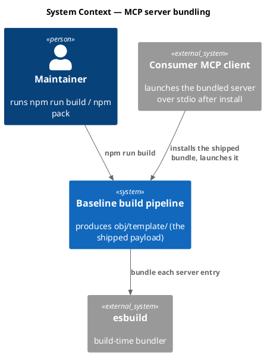
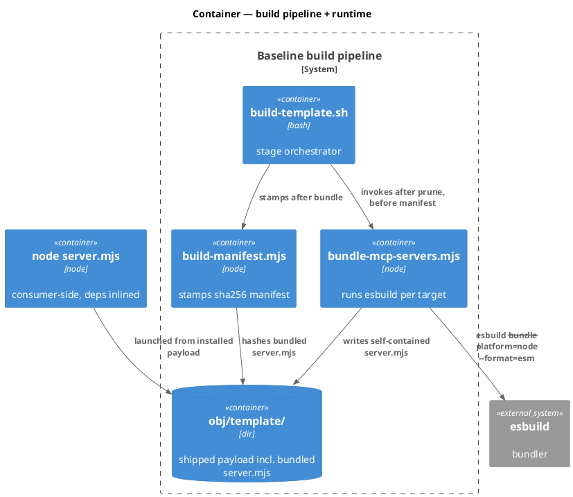
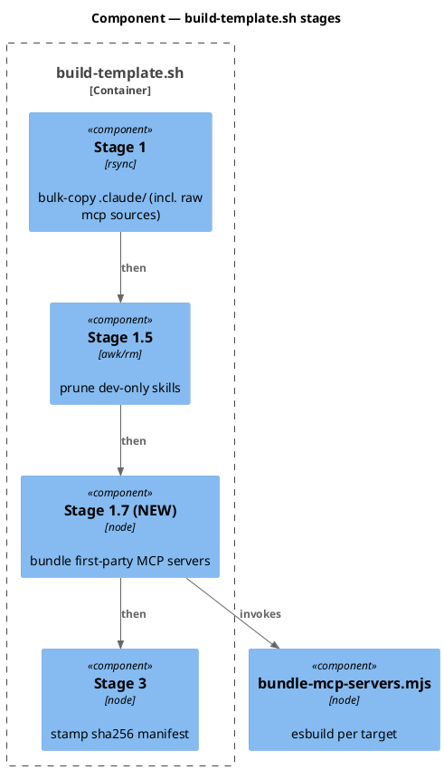
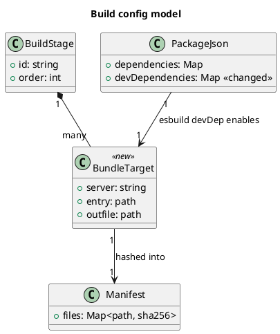
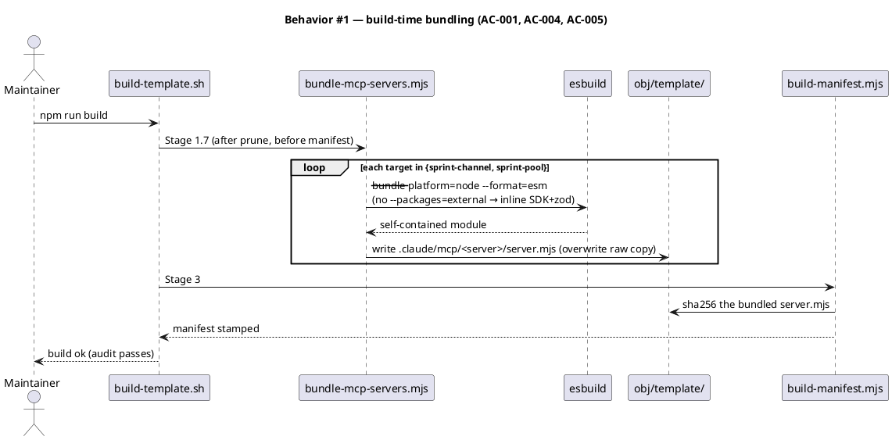
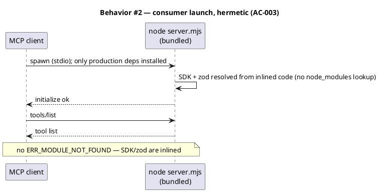
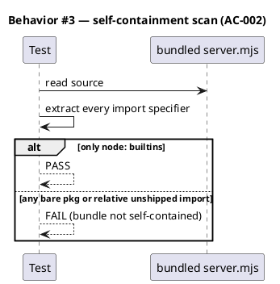
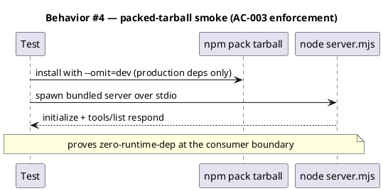
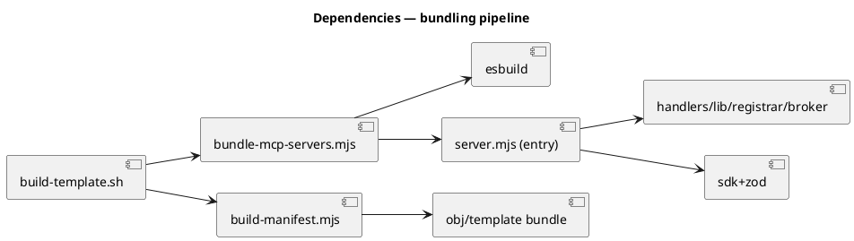

# Spec — Bundle first-party MCP servers into self-contained single-file artifacts (esbuild)

## Context

| Input | Path |
|---|---|
| Intake | *(none — spec-entry track; framing decided in-session)* |
| BRD *(if any)* | *(none)* |
| Scout *(if any)* | *(none)* |
| Research *(if any)* | *(none — esbuild-vs-own-package-vs-npx compared in-session; captured under Decisions)* |

**Write set**: `scripts/build-template.sh`, `scripts/bundle-mcp-servers.mjs`, `package.json`, `tests/**`, `docs/specs/bundle-mcp-servers-esbuild.md` — touches build tooling (`scripts/**`) and root `package.json`, outside the `non-architectural` profile → full C4 diagram set.

This work delivers backlog `sprint-channel-own-package-sdk-delivery-ac005-slice-c` (roadmap Epic 5, S2). The recorded S2 plan was to publish `sprint-channel` as its own npm package so `.mcp.json` could `npx` it. This spec **supersedes that approach** with a build-time esbuild bundle. The rationale is in **Decisions**.

## Goal

`npm run build` emits a self-contained single-file `server.mjs` for each first-party MCP server (`sprint-channel`, `sprint-pool`) into `obj/template/`, with `@modelcontextprotocol/sdk` and `zod` inlined so a consumer install runs the server with only production dependencies present.

## Non-goals

- **Tracked `.mcp.json` registration and the MCP-server count cascade.** Registering the bundled servers in the shipped `.mcp.json` / `src/.mcp.template.json` drags in the 3→5 "MCP servers" count bump across governance surfaces (CLAUDE.md, seed.md, README, CONSTITUTION + mirrors, `derive-counts.mjs` SPELLED). That is S4 (`sprint-mode-dogfood-config-mcp-register-and-flag-flip`), not this workflow. See Decisions D-4.
- **Flag flip and companion dogfood** (`velocity.org_mode`/`sprint_mode`) — S4.
- **Pruning the now-inlined SDK-free source files** (`handlers.mjs`, `lib/**`, `registrar.mjs`, the `sprint-broker/*` sources) from the shipped tree. They are already SDK-free, so they ship harmlessly; removing them is an optional cleanup that risks an untraced import and is deferred. See Decisions D-3.
- **Own-package / `npx` publish path** — explicitly superseded (Decisions D-1).
- **Bundling any third-party MCP server** (`context7`, `plantuml`, `playwright`) — those are not first-party and remain `npx`-launched.

## Decisions

Engineering decisions recorded for gate-A (`/approve-direction`) review. `owner: engineer`.

| # | Decision | Rationale |
|---|---|---|
| D-1 | **esbuild single-file bundle**, superseding S2's own-package/`npx` plan. | `sprint-channel`/`sprint-pool` are first-party source in this repo — they can be compiled. Bundling keeps the baseline zero-*runtime*-dep more literally than `npx` (the SDK never becomes a consumer-installed dependency), runs hermetically/offline with a deterministic pinned SDK, and deletes the monorepo-publish cost the S2 entry itself named as "the real cost". The `npx`-to-a-published-package precedent (`context7`/`plantuml`) applies only to servers we do **not** own. |
| D-2 | **Bundle overwrites the shipped `server.mjs` in place** (same path, in `obj/template/`), leaving the dev-tree `server.mjs` readable and unbundled. | Same output path means `.mcp.json` and the manifest need no path special-casing; the dev tree keeps a debuggable source. The bundle is generated into `obj/template/` at build time — never committed to `src/` — so it cannot collide with the T3 derived-header byte-equality contract on the `src/*.template.*` mirrors. |
| D-3 | **esbuild is a build-time `devDependency` only** (pinned `esbuild@0.28.1`); runtime `dependencies` stays `{@clack/prompts}`. | Bundling happens at build time; the consumer never installs esbuild. Zero-runtime-dep preserved. |
| D-4 | **Scope stops at "bundle capability".** This workflow does NOT register the servers in the tracked `.mcp.json`. | Registration is a distinct concern (S4) that also owns the count cascade + flag-flip + companion dogfood. Keeping it out keeps this a single-concern build-pipeline change and avoids editing governance count surfaces. The ready-to-use entry shape is documented in Contracts for S4 to apply. **Reviewer may flip to include registration at gate A — see Open questions Q-1.** |

## Design

Diagrams are the contract. Prose is only for things a diagram cannot say.

### C4 — System context



### C4 — Container



### C4 — Component (changed container: build-template.sh)



### Data model — class diagram

The "data model" here is the build config. `BundleTarget` and the new stage are `<<new>>`.



#### Migration DDL

No database. The "migration" is the config/pipeline change, expressed forward/reverse.

```sql
-- forward
-- package.json: devDependencies += "esbuild": "0.28.1"   (runtime dependencies unchanged)
-- build-template.sh: INSERT Stage 1.7 (bundle) BETWEEN Stage 1.5 (prune) AND Stage 3 (manifest)
-- bundle targets: {sprint-channel, sprint-pool} -> obj/template/.claude/mcp/<server>/server.mjs (self-contained)

-- reverse
-- build-template.sh: DROP Stage 1.7   (obj/template ships the raw rsync-copied server.mjs again)
-- package.json: devDependencies -= "esbuild"
```

### Behavior — sequence per AC









### State — core entity

Omitted — the build stage and the bundled server have no non-trivial state machine.

### Dependencies — graph



### Contracts

| Kind | Name | Input | Output | Errors | Idempotent |
|---|---|---|---|---|---|
| CLI (build-time) | `esbuild <entry> --bundle --platform=node --format=esm --outfile=<out>` | server entry `.mjs` | self-contained `.mjs` (node builtins external; SDK+zod inlined) | non-zero on bundle failure → build aborts | yes |
| Node helper | `bundle-mcp-servers.mjs <template-dir>` | `obj/template` path | writes one bundle per target; exit 0/non-zero | bad target path, esbuild error | yes |
| Data | bundle-target registry | — | `[{server:"sprint-channel", entry:".claude/mcp/sprint-channel/server.mjs", out:"<tmpl>/.claude/mcp/sprint-channel/server.mjs"}, {server:"sprint-pool", ...}]` | — | — |
| Config (documented for S4, not applied here) | `.mcp.json` entry shape | — | `"sprint-channel": {"command":"node","args":[".claude/mcp/sprint-channel/server.mjs"]}` (repo-relative) | — | — |

### Libraries and versions

| Library@version | Purpose | Key APIs | Confirmed against current docs |
|---|---|---|---|
| `esbuild@0.28.1` | build-time bundler | `--bundle`, `--platform=node`, `--format=esm`, `--outfile`; **omit** `--packages=external` to inline npm deps | yes (context7 `/evanw/esbuild`; `--platform=node` auto-externalizes `node:` builtins) |
| `@modelcontextprotocol/sdk@1.29.0` | bundled input (already a devDep) | `McpServer`, `Server`, `StdioServerTransport`, request schemas | yes (existing pin, unchanged) |
| `zod@<transitive>` | bundled input (schema) | `z` | yes (existing usage, unchanged) |

### Alternatives considered

| Alt | Summary | Rejected because |
|---|---|---|
| A | Own npm package + `npx` (recorded S2 plan) | Monorepo publish wiring (workspaces + changesets + CI publish) is real cost for a first-party server; adds network + version-resolution at consumer cold start; a second package to version/maintain. |
| B | Add `@modelcontextprotocol/sdk` to runtime `dependencies` | Breaks the zero-runtime-dep invariant; ships a heavy transitive tree to every consumer whether or not they enable the server. |
| C | Ship raw `server.mjs` + vendor `node_modules/@modelcontextprotocol/sdk` into the payload | Fragile, unhashed vendored tree; larger and harder to audit than one bundled file. |

## Design calls

*(none)* — no UI surface.

## Acceptance criteria

| ID | Criterion (given / when / then) | Kind | Upstream AC | Sequence |
|---|---|---|---|---|
| AC-001 | given the two first-party server entries, when `npm run build` runs, then `obj/template/.claude/mcp/<server>/server.mjs` exists as a self-contained bundle for each of `sprint-channel` and `sprint-pool` | behavior | S2 | §Behavior #1 |
| AC-002 | given a shipped bundle, when its import specifiers are scanned, then every import is a `node:` builtin — no bare package specifier and no relative import to an unshipped module | behavior | S2 | §Behavior #3 |
| AC-003 | given the packed tarball installed with production deps only, when the MCP client launches the bundled server, then it completes `initialize` and `tools/list` without a missing-module error | smoke | S2 | §Behavior #4 |
| AC-004 | given Stage 3, when the manifest is stamped, then each bundled `server.mjs` is hashed in `manifest.json` and `audit-baseline` passes | behavior | S2 | §Behavior #1 |
| AC-005 | given `package.json`, when built, then `esbuild@0.28.1` is in `devDependencies` and runtime `dependencies` remains exactly `{@clack/prompts}` | behavior | S2 | §Behavior #1 |
| AC-006 | given the dev tree, when the build runs, then the dev-tree `.claude/mcp/<server>/server.mjs` remains the readable, unbundled source (only `obj/template/`'s copy is bundled) | behavior | D-2 | §Behavior #1 |

## Test plan

| Category | Scenario | Expected | Covers |
|---|---|---|---|
| Golden path | run bundle helper against a temp template dir | one self-contained `server.mjs` per target written | AC-001 |
| Golden path | scan each bundled output's imports | only `node:` builtins present | AC-002 |
| Contract violation | bundle output contains a bare `@modelcontextprotocol/sdk` import | test FAILS (bundle not self-contained) | AC-002 |
| Failure mode | esbuild missing / entry path wrong | helper exits non-zero, build aborts, no partial manifest | AC-004 |
| Smoke | install packed tarball with `--omit=dev`, launch bundled server, `initialize` + `tools/list` | both respond, no `ERR_MODULE_NOT_FOUND` | AC-003 |
| Regression trap | runtime `dependencies` in `package.json` | remains `{@clack/prompts}` (esbuild is devDep only) | AC-005 |
| Regression trap | dev-tree `server.mjs` bytes after build | unchanged (still imports the SDK; readable) | AC-006 |
| Regression trap | `audit-baseline` after build | PASS with bundled server hashed in manifest | AC-004 |

## Observability

| Signal | Name | Shape | Purpose |
|---|---|---|---|
| Log | `build: bundled <server> (<bytes>)` | stderr line per target | build-time visibility of each bundle + size |
| Log | `build: bundle failed <server>: <err>` | stderr | surface an esbuild failure that aborts the build |

## Rollout

### Prerequisites

| # | Prerequisite | enforced-by |
|---|---|---|
| 1 | The packed tarball launches each bundled server with production deps only (no dev/SDK install) | AC-003 |

- **Feature flag**: none — this changes only build output; no consumer registration lands here (Non-goals), so nothing activates until S4 registers the servers.
- **Migration order**: 1 add esbuild devDep → 2 add Stage 1.7 + helper → 3 rebuild → 4 audit + smoke.
- **Canary**: not applicable (build artifact; verified by the tarball smoke test in CI).

## Rollback

- **Kill-switch**: revert Stage 1.7 (the `reverse` migration above). `obj/template` reverts to shipping the raw rsync-copied `server.mjs`; the dev tree is untouched.
- **Signal to roll back**: `npm run build` non-zero, `audit-baseline` FAIL, or the tarball smoke test failing in CI — any within the build itself, well under 5 minutes.

## Archive plan

- Defaults *(automatic)*: spec, spec-rendered/, spec approval, security reports.
- Extras *(list any non-default files)*:
  - *(none)*

## Open questions

- **Q-1 (scope, for gate A):** Confirm D-4 — this workflow stops at the bundle capability and defers the tracked `.mcp.json` registration + the 3→5 MCP-server count cascade + flag-flip to S4. Approve to proceed bundle-only, or direct that registration be folded in (which expands the write_set to the governance count surfaces and `derive-counts.mjs`).
