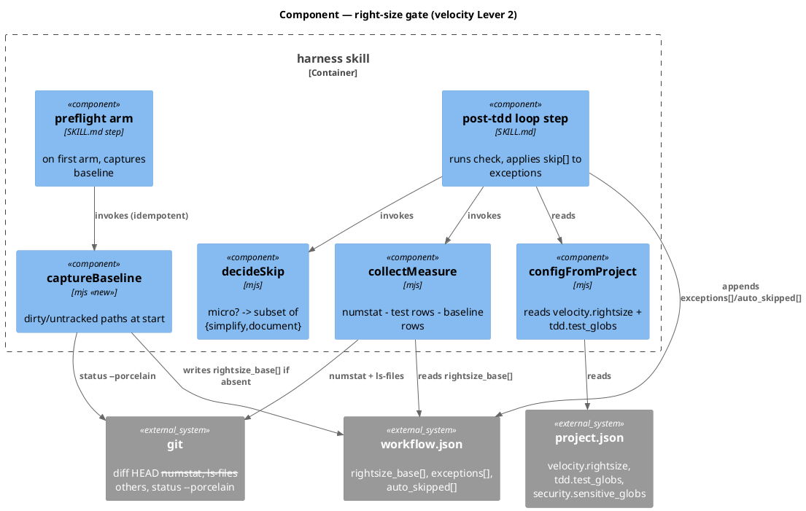
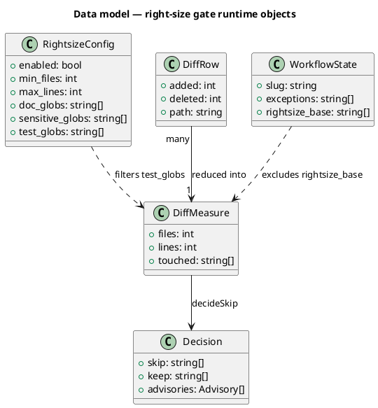
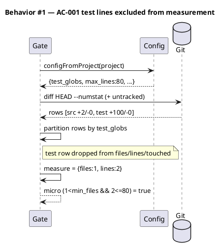
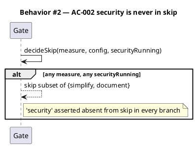
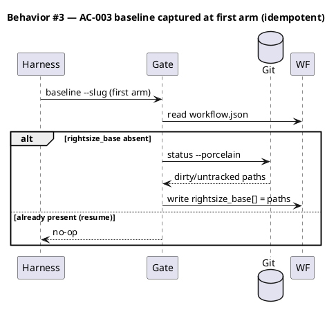
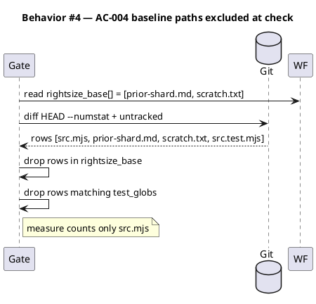
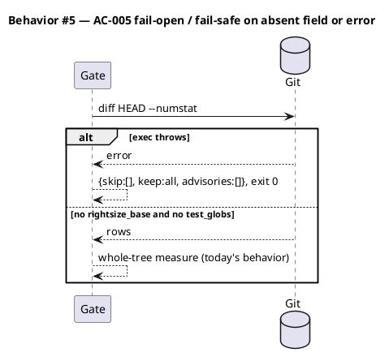
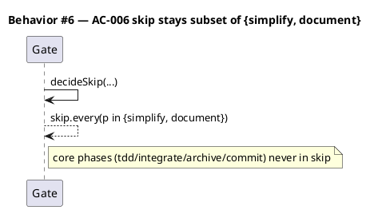
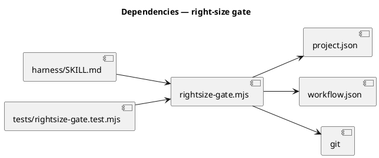

# Spec — Make the right-size gate able to fire

## Context

| Input | Path |
|---|---|
| Intake | *(triage → spec; no intake — backlog-derived)* |
| BRD *(if any)* | — |
| Scout *(if any)* | *(backlog entry serves as scout)* |
| Research *(if any)* | — |

Source backlog: `rightsize-gate-counts-test-lines-and-never-fires-4b7e` (+ detail landmine `rightsize-gate-measures-whole-dirty-tree-not-workflow-diff`).

**Write set**: `.claude/skills/harness/rightsize-gate.mjs`, `.claude/skills/harness/SKILL.md`, `tests/rightsize-gate.test.mjs` — non-architectural profile (reduced diagram set).

The post-`tdd` right-size gate (velocity Lever 2, `.claude/skills/harness/rightsize-gate.mjs`) is the only mechanism besides `/triage` exceptions that can trim ceremony — it may auto-skip a hard subset of `{simplify, document}` on a *micro* diff. It has **never fired** since it shipped: a sweep of every `workflow.json` under `docs/archive/**` records zero `rightsize-gate` rows in `auto_skipped[]`. Two independent defects, both required, keep it inert.

## Goal

The right-size gate measures the diff *this workflow* produced, counting only non-test lines, so a genuinely micro change classifies as micro and its `{simplify, document}` skip authority becomes reachable — while every existing bound (additive-only, never skip `security`, fail-open) holds unchanged.

## Non-goals

- **Widening the skip allowlist.** The skip set stays a hard subset of `{simplify, document}`; `security` and all core phases are never auto-skipped. This fix makes existing authority *reachable*, not larger.
- **No constitutional change.** The gate's sanctioned authority (Article IV, seed.md §5) is unchanged, so `CLAUDE.md` / `seed.md` / `src/*.template.md` are untouched.
- **No new config surface.** Defect 1 reuses the existing `project.json → tdd.test_globs`; defect 2 adds one optional runtime field to `workflow.json`, not a `project.json` knob.
- **Not changing the threshold** (`velocity.rightsize.max_lines`, default 80) or the `micro` predicate shape.

## Decisions

Two load-bearing engineering decisions. Recorded here (owner: engineer) per CLAUDE.md Article XI.12 — routine engineering choices are decided in main context and captured in the spec, reviewed at gate A, not asked.

### D1 — Test lines are excluded by partitioning diff rows on `tdd.test_globs`

The threshold gauges change *risk*. Under TDD discipline every change ships with a test, so counting test/fixture lines makes a thorough test push the change over threshold — self-defeating. The gate already carries a glob matcher (`matchesAnyGlob`); `project.json → tdd.test_globs` already classifies test paths.

> **Decision:** partition the measured diff rows into *test* and *non-test* by `tdd.test_globs` match, and derive `files` / `lines` / `touched` from the **non-test** rows only. Test rows are dropped from all three (so a pure-test change also cannot trip the `doc_globs` / `sensitive_globs` checks, which is correct — a test file is neither a doc surface nor a sensitive surface). A change touching only test files measures `files: 0, lines: 0` → `micro` → skips `simplify` + `document`; `security` still never skips.

### D2 — "The workflow's own diff" = the tree diff minus paths already dirty when the harness began

There is **no git base commit** that separates workflow-work from pre-existing dirt: the harness holds all work **uncommitted** from `spec` through Phase 11, so `git diff HEAD` conflates the workflow's changes with any file left dirty before it started. A recorded `base_sha` cannot help — it equals `HEAD`, which is unchanged all workflow. The named inflators in the landmine are concrete: untracked memory shards from a prior `/memory-flush`, stray scratch files, a doc from an earlier session — all **already dirty when this workflow began**, none of them its work.

> **Decision:** the base ref is a **start-of-workflow dirty-path snapshot**, not a commit. At the harness's **first arm** for a slug (idempotent — captured only when the field is absent), record the set of paths already dirty-or-untracked into `workflow.json → rightsize_base[]`. At `check` time the gate excludes any measured row whose path is in that set. Capturing at first-arm is exact for the harness's reality: the workflow's own source/test files are created *later* by `/tdd`, so they are never in the snapshot and are always measured; the workflow's own scaffolding (`workflow.json`, `.claude/state/**`, the spec doc) and all unrelated prior cruft are dirty at arm-time, so both are excluded — neither is production-code risk.
>
> **Fail-safe:** an absent `rightsize_base` (any pre-feature workflow, including this introduction workflow) excludes nothing → today's whole-tree measurement, preserving fail-open. The one residual under-count — a workflow that *edits a file which was already dirty at arm-time* — is rare and already discouraged (the landmine's standing advice is to start from a clean tree), and it only shifts the gate one notch less conservative; `security` and core phases remain unskippable regardless.

## Design

Diagrams are the contract. Prose only for what a diagram cannot say.

### C4 — Component (changed container: the harness)



### Data model — class diagram

Runtime objects only. No database: the sole persisted-state change is one additive optional field on the runtime file `workflow.json`.



#### Migration DDL

```sql
-- No database. The only persisted-state change is an additive, optional field on
-- the runtime file .claude/state/workflow.json:
--   forward:  workflow.json.rightsize_base = string[]   (absent => today's behavior)
--   reverse:  delete workflow.json.rightsize_base        (gate falls back to whole-tree)
-- Back-compatible: every reader treats an absent field as "exclude nothing".
```

### Behavior — sequence per AC













### Dependencies — graph



### Contracts

| Kind | Name | Input | Output | Errors | Idempotent |
|---|---|---|---|---|---|
| CLI | `rightsize-gate.mjs check --slug <s>` | git tree, `project.json`, `workflow.json` | stdout JSON `{skip,keep,advisories,measured}` | any → fail-open `{skip:[],keep:all}` exit 0 | yes (read-only measure) |
| CLI | `rightsize-gate.mjs baseline --slug <s>` | git `status --porcelain`, `workflow.json` | writes `workflow.json.rightsize_base[]` if absent | any → no-op exit 0 | yes (writes only when field absent) |
| Fn | `configFromProject(project)` | project object | `{...,test_globs}` | missing key → `[]` default | yes |
| Fn | `captureBaseline({rootDir,exec})` | root, exec | `string[]` dirty/untracked paths | exec throws → `[]` | yes |

### Libraries and versions

| Library@version | Purpose | Key APIs | Confirmed against current docs |
|---|---|---|---|
| Node.js stdlib (runtime) | child process + fs | `node:child_process execFileSync`, `node:fs readFileSync/writeFileSync` | yes — stdlib, no third-party API |

### Alternatives considered

| Alt | Summary | Rejected because |
|---|---|---|
| A | Record `base_sha = HEAD` at start, measure `git diff base_sha` | Work is uncommitted all workflow; `base_sha == HEAD`, so the diff is identical to today's — separates nothing |
| B | `git stash create` snapshot, diff worktree against it | Excludes untracked files from the base tree, so the workflow's own *new* untracked files would go unmeasured — the opposite error |
| C | Scope to the spec's `write_set` | Not universal — `chore`/`tdd` tracks reach the gate without a spec write_set |

## Design calls

*(none)* — the write_set has no UI files (does not intersect `tdd.ui_globs`).

## Acceptance criteria

| ID | Criterion (given / when / then) | Kind | Upstream AC | Sequence |
|---|---|---|---|---|
| AC-001 | given a diff of a 2-line source change plus a 100-line test file, when the gate measures, then test-glob paths are excluded from `files`/`lines`/`touched` and the measure is `{files:1, lines:2}` → micro | behavior | backlog defect 1 | §Behavior #1 |
| AC-002 | given any measure and any `securityRunning`, when `decideSkip` runs, then `security` is never in `skip` | behavior | invariant (regression) | §Behavior #2 |
| AC-003 | given the harness's first arm for a slug with a dirty/untracked tree, when `baseline` runs, then `workflow.json.rightsize_base[]` records those paths; a second run (resume, field present) is a no-op | behavior | backlog defect 2 | §Behavior #3 |
| AC-004 | given `rightsize_base` lists prior untracked cruft, when `check` measures, then rows whose path is in `rightsize_base` are excluded so they do not inflate `files`/`lines` | behavior | backlog defect 2 | §Behavior #4 |
| AC-005 | given no `rightsize_base` field and no `test_globs`, when `check` runs, then the measure is the whole-tree measurement (today's behavior); given `exec` throws, then output is `{skip:[],keep:all,advisories:[]}` exit 0 | behavior | fail-open (regression) | §Behavior #5 |
| AC-006 | given any measure, when `decideSkip` runs, then every phase in `skip` is one of `{simplify, document}` and no core phase (`tdd`/`integrate`/`archive`/`memory-flush`/`grant-commit`/`commit`) is in `skip` | behavior | invariant (regression) | §Behavior #6 |

## Test plan

| Category | Scenario | Expected | Covers |
|---|---|---|---|
| Golden path | numstat: `2/0 src.mjs` + `100/0 tests/x.test.mjs`, measure via new test-glob-aware path | `{files:1,lines:2}`, micro true | AC-001 |
| Golden path | `captureBaseline` on a tree with `status --porcelain` output `?? a.md`, `M b.mjs` | returns `['a.md','b.mjs']` | AC-003 |
| Golden path | `baseline` subcommand writes `rightsize_base` when absent | field written; second call no-op | AC-003 |
| Golden path | check with `rightsize_base:['old.md']` + rows `src.mjs`,`old.md` | measure counts only `src.mjs` | AC-004 |
| Input boundary | diff is test-files-only (`files:0,lines:0` after exclusion) | micro true → skip `simplify`+`document` | AC-001 |
| Input boundary | test glob path also under a doc glob — dropped before doc check | no `document` kept spuriously | AC-001 |
| Contract violation | `configFromProject` with `tdd.test_globs` absent | `test_globs: []`, whole-tree behavior | AC-005 |
| Failure mode | `captureBaseline` exec throws | returns `[]` (no baseline written) | AC-003, AC-005 |
| Failure mode | `check` exec throws | `{skip:[],keep:all}` exit 0 | AC-005 |
| Regression trap | `security` never in skip across the existing measure matrix | unchanged | AC-002 |
| Regression trap | `skip ⊆ {simplify,document}`, no core phase, across matrix | unchanged | AC-006 |
| Regression trap | disabled config → empty skip + empty advisories | unchanged | AC-005 |

## Observability

| Signal | Name | Shape | Purpose |
|---|---|---|---|
| Log | `auto_skipped[]` row in `workflow.json` | `{phase, reason, oracle:"rightsize-gate", measured}` | proves the gate fired + why (the field that was empty for every prior workflow) |
| Log | gate stdout | `{skip,keep,advisories,measured}` | harness reads `measured` to surface the decision |

## Rollout

### Prerequisites

- *(none)* — flag-gated, additive, no migration or ordering constraint.

- **Feature flag**: `velocity.rightsize.enabled` (existing) — default on; set false to disable the whole gate (fail-open to no-skip).
- **Introduction-workflow pattern**: the fixed gate goes live the first full workflow *after* the one that lands it (this workflow's own run predates the fix on disk, same as the drift-check-tick / checker-fanout introductions).

## Rollback

- **Kill-switch**: set `velocity.rightsize.enabled: false` in `project.json` → the gate returns an empty skip (today's full pipeline). Or revert the commit.
- **Signal to roll back**: a `rightsize-gate` row in `auto_skipped[]` skipping a phase on a diff that turns out non-micro (a `simplify`/`document` gap noticed in review). Because the skip set excludes `security` and every core phase, the worst case is wasted-review-avoided-wrongly, never a broken build — detectable at the next `/simplify`-absent review with no time bound needed.

## Archive plan

- Defaults *(automatic)*: spec, spec-rendered/, spec approval, security report.
- Extras *(list any non-default files)*:
  - *(none)*

## Open questions

- *(none)* — both defects and the base-ref definition are pinned in `## Decisions`.
