# Slug-guard hoist + workflow-scoped consent expiry

## Context

| Input | Path |
|---|---|
| Intake | *(excepted — `/triage` routed this at `spec-entry`)* |
| BRD *(if any)* | *(none)* |
| Scout *(if any)* | *(excepted)* |
| Research *(if any)* | *(excepted)* |

Upstream source of record (roadmap + memory, re-verified on disk at `ea618e9`):

| Source | Key | Claim |
|---|---|---|
| Roadmap T2 | `docs/roadmap-execution-plan.md:104` | Hoist a single slug validator once a third caller appears |
| Roadmap T9 | `docs/roadmap-execution-plan.md:111` | Consent expiry on a landing longer than the TTL |
| Backlog | `hoist-single-slug-validator-at-third-use-9f4f` | REJECT, never normalize; the design call is the work |
| Backlog | `timing-path-builders-lack-assert-safe-slug-a8d2` | `timing.mjs:50-51` build paths from `wf.slug` unguarded |
| Backlog | `commit-consent-expiry-long-landing-7af6` | `/commit` archives `workflow.json` before committing |

**Write set**: `.claude/hooks/lib/slug.mjs`, `.claude/hooks/lib/consent-decision.mjs`, `.claude/hooks/lib/timing.mjs`, `.claude/hooks/git_commit_guard.mjs`, `.claude/skills/harness/plan-store.mjs`, `.claude/skills/harness/consolidate-open-questions.mjs`, `.claude/skills/harness/checkers/ac-conformance.mjs`, `.claude/skills/triage/seed-tasklist.mjs`, `.claude/skills/whatsnew/fragment-writer.mjs`, `.claude/project.json`, `src/project.template.json`, `tests/**` — touches `.claude/hooks/**`, which no `diagram_profiles` entry covers, so the **full C4 set** applies.

## Goal

One shared slug predicate guards every path built from a slug, and a workflow-scoped `/grant-commit` survives a landing longer than the ad-hoc time window without weakening the ad-hoc guarantee.

## Non-goals

- **Not** normalizing slugs anywhere. `canonicalSlug` stays a normalizer for its existing display/marker callers and never becomes the validator.
- **Not** raising the ad-hoc `consent.commit_ttl_seconds`. The 900s window on a no-workflow commit is unchanged.
- **Not** touching `/approve-direction` or `/approve-swarm` consent. Gate C only.
- **Not** re-curating memory `scope:` tags (roadmap T8) — separate work, no code overlap.

## Design

Diagrams are the contract. Prose is only for things a diagram cannot say.

### C4 — System context

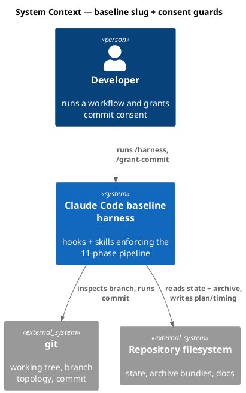

### C4 — Container

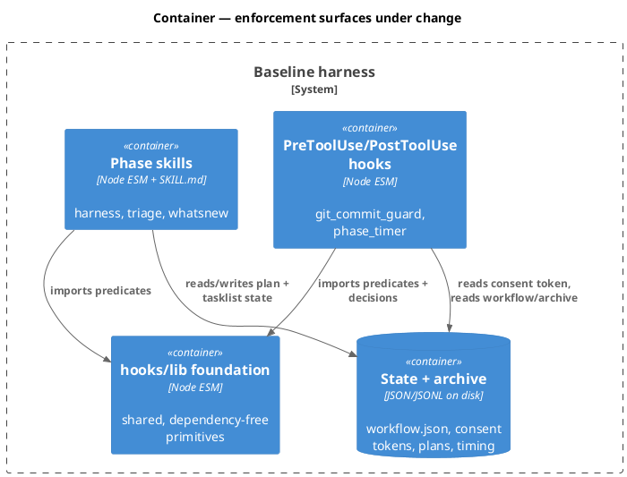

### C4 — Component (changed containers only)

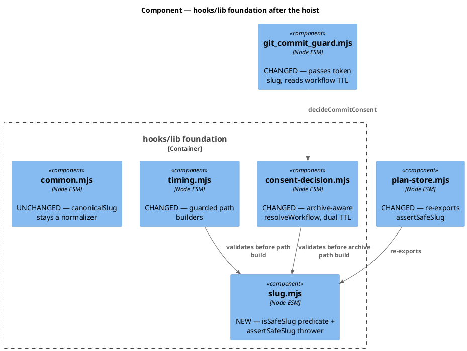

### Data model — class diagram

No database. The entities are the module surfaces and the on-disk consent token shape.

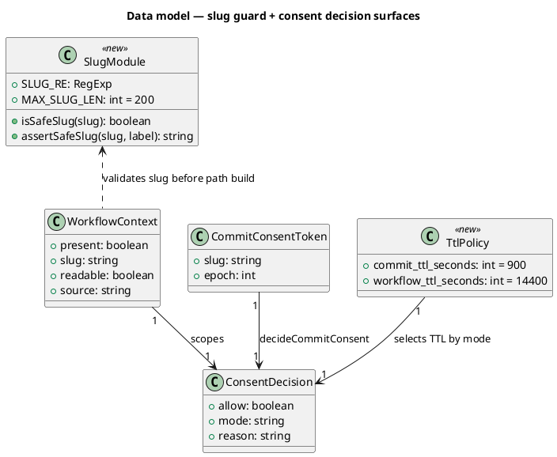

#### Migration DDL

No database and no schema migration. The only persisted-shape change is additive config:

```sql
-- forward: additive keys in .claude/project.json -> consent
--   consent.workflow_ttl_seconds = 14400   (absent => read-time default 14400)
-- reverse: delete the key; slug-mode TTL falls back to the same read-time default.
-- No stored rows exist, so neither direction rewrites data.
```

`WorkflowContext.source` is an in-memory field only — it is never serialized to a state file.

### Behavior — sequence per AC

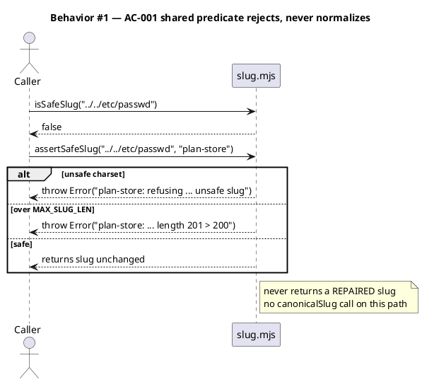

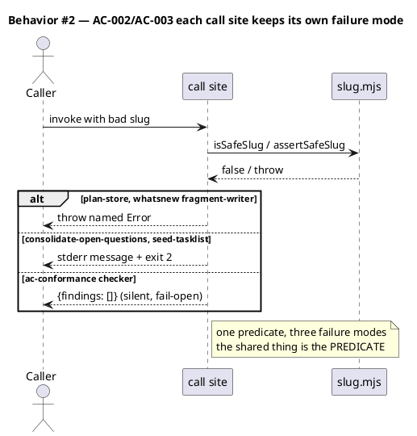

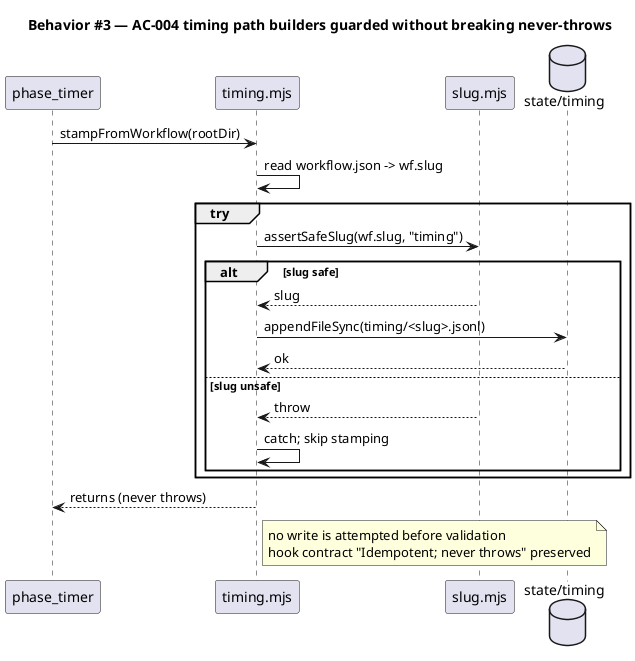

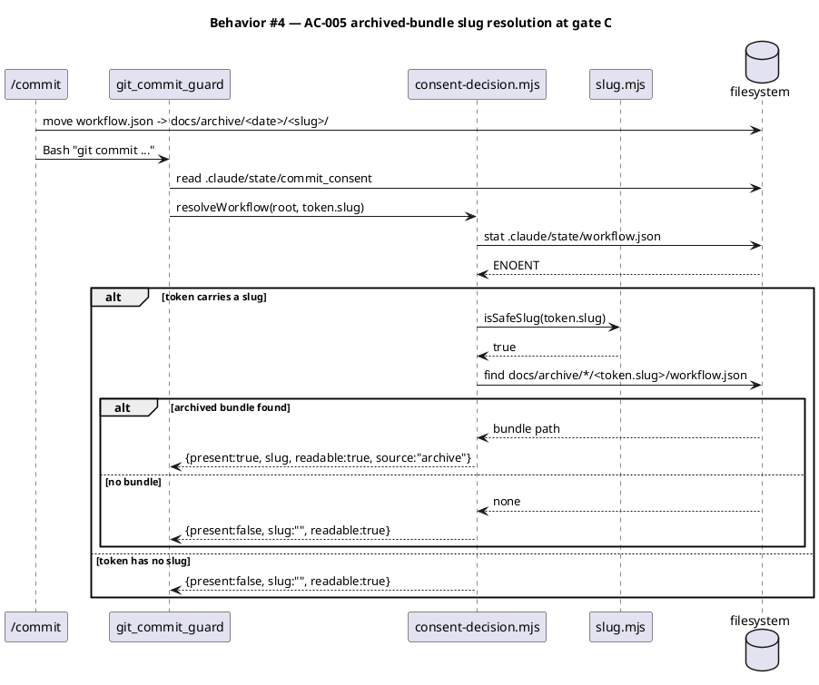

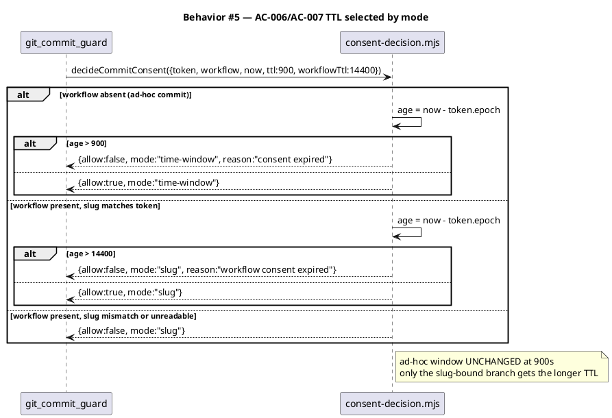

### State — core entity

The consent token's effective authority is a small state machine.

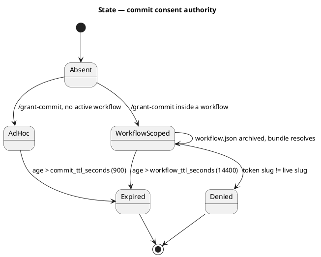

### Dependencies — graph

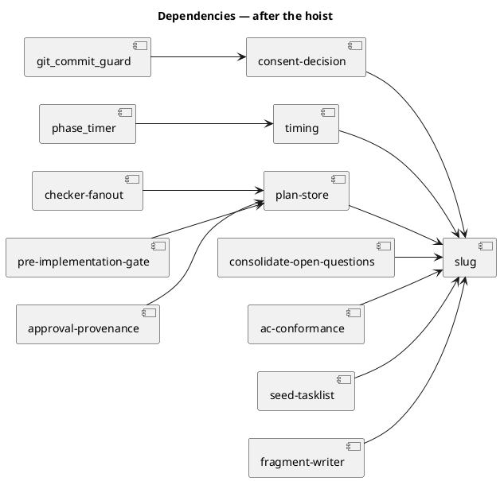

Acyclic: `slug.mjs` is a leaf and imports nothing from the repo. The three existing `plan-store` consumers keep importing `assertSafeSlug` from `plan-store`, which re-exports — so no consumer edge is rewired.

### Contracts

| Kind | Name | Input | Output | Errors | Idempotent |
|---|---|---|---|---|---|
| Function | `isSafeSlug(slug)` | `unknown` | `boolean` | never throws | yes (pure) |
| Function | `assertSafeSlug(slug, label?)` | `unknown`, `string` (default `"slug"`) | the slug unchanged | `Error` on non-string, charset miss, or `length > 200` | yes (pure) |
| Const | `SLUG_RE` | — | `/^[a-z0-9][a-z0-9-]*$/` | — | — |
| Const | `MAX_SLUG_LEN` | — | `200` | — | — |
| Function | `plan-store.assertSafeSlug(slug)` | `unknown` | slug | `Error` prefixed `plan-store:` | yes (re-export, label-bound) |
| Function | `resolveWorkflow(rootDir, tokenSlug?)` | `string`, `string?` | `{present, slug, readable, source}` | never throws | yes |
| Function | `decideCommitConsent({token, workflow, now, ttl, workflowTtl})` | object | `{allow, mode, reason}` | never throws | yes (pure) |
| Config | `consent.workflow_ttl_seconds` | int seconds | — | absent/invalid → `14400` | — |

`resolveWorkflow`'s second parameter is optional; called with one argument it behaves exactly as today (no archive lookup), so any caller not yet updated is unaffected.

### Libraries and versions

| Library@version | Purpose | Key APIs | Confirmed against current docs |
|---|---|---|---|
| Node.js built-in `node:fs` | state + archive reads | `readFileSync`, `existsSync`, `readdirSync`, `statSync` | yes — Node LTS built-in, already used repo-wide; no third-party surface |
| Node.js built-in `node:path` | path composition | `join` | yes — same |

No third-party dependency is added. The baseline's zero-runtime-dep posture is unchanged, so the Article VI.5 current-docs mandate is satisfied by the Node built-in docs rather than a `context7` lookup.

### Alternatives considered

| Alt | Summary | Rejected because |
|---|---|---|
| A | Route every slug site through `canonicalSlug` to consolidate | It is a **normalizer**. It would silently redirect a traversing slug to a different path and mask the bug repo-wide — the exact failure `-9f4f` warns against |
| B | One `assertSafeSlug` for all five sites, everyone throws | Erases three deliberate failure modes: the CLI sites owe a clean stderr + exit 2, and `ac-conformance` is a fail-open checker that must not crash the fan-out |
| C | Put `slug.mjs` under `.claude/skills/harness/` | Inverts layering. `hooks/lib` is the lower layer (skills already import `hooks/lib/tier-dial.mjs`); a hook importing from skills would be a new upward edge |
| D | Raise `consent.commit_ttl_seconds` globally (backlog option b) | Weakens the ad-hoc guarantee for every no-workflow commit to buy a fix only workflow landings need |
| E | Archive lookup alone (backlog options a/c, unmodified) | **Insufficient.** The TTL check fires in slug mode too (`consent-decision.mjs:64-65`), so restoring slug mode still expires at 900s. The archive lookup must be paired with a slug-mode TTL |
| F | Drop the TTL entirely in slug mode | An archived bundle persists forever, so a stale token would grant permanent consent for that slug. The authority must still decay |

**Design call 1 settled** — hoist the **predicate**, not the failure mode. `slug.mjs` exports `isSafeSlug` (pure boolean) plus `assertSafeSlug` (throws, label-parameterized). Each of the six sites keeps the failure behavior its layer owes its caller. `plan-store` re-exports `assertSafeSlug` label-bound so its three existing importers and `tests/plan-store-slug-length.test.mjs` are untouched.

**Design call 2 settled** — neither listed candidate is sufficient alone (Alt E). Take **(c) + a mode-scoped (b)**: resolve the workflow slug from the archived bundle when the live file is absent, *and* give slug-mode its own longer `workflow_ttl_seconds`. The archive lookup is bounded by the token's own slug, so it can never authorize a workflow the token did not already name.

## Design calls

*(none)* — the write set does not intersect `project.json → tdd.ui_globs`; there is no UI surface in this change.

## Acceptance criteria

| ID | Criterion (given / when / then) | Kind | Upstream AC | Sequence |
|---|---|---|---|---|
| AC-001 | given a slug failing `SLUG_RE` or exceeding 200 chars, when `isSafeSlug`/`assertSafeSlug` runs, then it returns `false` / throws a named `Error`, and never returns a modified slug | behavior | T2 / `-9f4f` | §Behavior #1 |
| AC-002 | given `tests/plan-store-slug-length.test.mjs` importing `assertSafeSlug` from `plan-store.mjs`, when the hoist lands, then the import still resolves and the length error still matches `/length\|\b200\b/i` | behavior | T2 / `-9f4f` | §Behavior #2 |
| AC-003 | given a bad slug at each of the five sites, when each runs, then `plan-store` and `fragment-writer` throw, `consolidate-open-questions` and `seed-tasklist` write stderr and exit 2, and `ac-conformance` returns `{findings: []}` | behavior | T2 / `-9f4f` | §Behavior #2 |
| AC-004 | given `workflow.json` carrying a traversing slug, when `stampFromWorkflow` runs, then no file is appended outside `.claude/state/timing/` and the call still returns without throwing | behavior | `-a8d2` | §Behavior #3 |
| AC-005 | given the live `workflow.json` is absent but `docs/archive/<date>/<slug>/workflow.json` exists and the consent token names that slug, when `resolveWorkflow` runs, then it returns `{present: true, slug, source: "archive"}` | behavior | T9 / `-7af6` | §Behavior #4 |
| AC-006 | given a workflow-scoped token 1800s old (> 900s, < 14400s) and a matching live-or-archived slug, when `decideCommitConsent` runs, then it returns `{allow: true, mode: "slug"}` | behavior | T9 / `-7af6` | §Behavior #5 |
| AC-007 | given no workflow context and a token 1000s old, when `decideCommitConsent` runs, then it returns `{allow: false, mode: "time-window"}` — the ad-hoc 900s window is unchanged | behavior | T9 / `-7af6` | §Behavior #5 |
| AC-008 | given the shipped tree, when a scan asserts no module under the write set imports `canonicalSlug` for validation, then zero matches are found outside `common.mjs`'s own definition and its existing display/marker callers | preflight | `-9f4f` caveat | §Behavior #1 |
| AC-009 | given a token whose slug names a workflow with no archived bundle and no live `workflow.json`, when `resolveWorkflow` runs, then it returns `{present: false}` and the decision falls to the 900s ad-hoc window | error-mapping | T9 / `-7af6` | §Behavior #4 |
| AC-010 | given a workflow-scoped token older than 14400s, when `decideCommitConsent` runs, then it returns `{allow: false, mode: "slug"}` — archived-bundle authority still decays | behavior | Alt F | §Behavior #5 |

## Test plan

| Category | Scenario | Expected | Covers |
|---|---|---|---|
| Golden path | `isSafeSlug("slug-guard-hoist-and-consent-expiry")` | `true` | AC-001 |
| Golden path | workflow-scoped token 1800s old, archived bundle present | `{allow: true, mode: "slug"}` | AC-005, AC-006 |
| Input boundary | slug at exactly 200 chars / 201 chars | accepted / named length error | AC-001, AC-002 |
| Input boundary | `""`, `"-lead"`, `"Upper"`, `"under_score"`, `"a/b"`, `"../x"` | all rejected | AC-001 |
| Contract violation | each of the five sites given `"../../etc/passwd"` | three distinct failure modes, no path built | AC-003 |
| Contract violation | `stampFromWorkflow` with traversing `wf.slug` | no write outside `state/timing/`, no throw | AC-004 |
| Concurrency / ordering | archive lookup while a second workflow's bundle exists for a different slug | only the token's own slug resolves | AC-005 |
| Failure mode | `docs/archive/` absent or unreadable | `{present: false}`, falls to time-window, no throw | AC-009 |
| Failure mode | token 20000s old, slug matches | `{allow: false, mode: "slug"}` | AC-010 |
| Regression trap | ad-hoc commit, no workflow, token 1000s old | still denied at 900s | AC-007 |
| Regression trap | grep the write set for `canonicalSlug` used as a validator | zero matches | AC-008 |
| Regression trap | `checker-fanout`, `pre-implementation-gate`, `approval-provenance` import `assertSafeSlug` from `plan-store` | still resolve | AC-002 |

## Observability

| Signal | Name | Shape | Purpose |
|---|---|---|---|
| Log | `git_commit_guard ALLOWED consent (slug)` | existing `logLine`, now carries `source=live\|archive` | audit which resolution path granted consent |
| Log | `git_commit_guard BLOCKED consent (slug)` | existing `logLine` + reason | distinguish expiry from slug mismatch |
| Log | `timing: skipped stamp (unsafe slug)` | stderr line from the catch in `stampFromWorkflow` | surface a traversing slug without crashing the hook |

No metric or alarm: this is a local developer-tool guard with no service to page on.

## Rollout

### Prerequisites

| # | Prerequisite | enforced-by |
|---|---|---|
| 1 | No module in the write set uses `canonicalSlug` as a validator | AC-008 |
| 2 | A token naming a workflow with no archived bundle degrades to the ad-hoc window rather than failing open | AC-009 |

- **Feature flag**: none. The slug hoist is a pure refactor of an existing guard, and the consent change is a bugfix to a gate that is already mandatory — a flag would mean shipping the known-broken path as an option.
- **Migration order**: 1 add `slug.mjs` + tests → 2 re-point the five sites → 3 guard `timing.mjs` → 4 archive-aware `resolveWorkflow` + dual TTL → 5 config key in `project.json` + `src/project.template.json`.
- **Canary**: none applicable (no deployed surface). The first real canary is this workflow's own `/commit`, which exercises AC-005 and AC-006 directly.

## Rollback

- **Kill-switch**: `git revert` of the single commit. `consent.workflow_ttl_seconds` may also be set to `900` in `.claude/project.json` to restore the old effective expiry without a code change.
- **Signal to roll back**: any `git commit` on a protected branch denied with a `mode: "slug"` reason while a valid fresh `/grant-commit` exists — visible immediately in `.claude/state/logs/` on the first commit attempt, well inside 5 minutes.

## Archive plan

- Defaults *(automatic)*: spec, spec-rendered/, spec approval, security report, workflow.json.
- Extras *(list any non-default files)*:
  - *(none)*

## Open questions

- *(none)* — both design calls are settled above under **Alternatives considered**. The one judgment worth flagging to the reviewer at gate A is the `workflow_ttl_seconds` default of **14400s (4h)**: it must exceed a realistic long landing while still decaying an archived-bundle-backed token. Lower it to 7200 if 4h reads as too generous; the value is config, not code.
