# Outcome-led site positioning, consumer-shippable org mode, and amended voice guidance

## Context

| Input | Path |
|---|---|
| Intake | *(excepted — `power` track enters at `spec`)* |
| BRD | *(none)* |
| Scout | *(excepted; discovery performed in plan mode)* |
| Research | *(excepted; marketing-rule research performed in plan mode)* |
| Approved plan | `.config/plans/review-the-whole-website-cozy-quokka.md` |

**Write set**: `docs/init/seed.md`, `src/seed.template.md`, `CLAUDE.md`, `src/CLAUDE.template.md`, `.claude/CONSTITUTION.md`, `PRODUCT.md`, `DESIGN.md`, `.claude/skills/audit-baseline/derive-counts.mjs`, `.claude/hooks/spec_design_calls_guard.mjs`, `.claude/skills/spec-lint/lint.mjs`, `.claude/mcp/sprint-channel/**`, `.claude/skills/companion/**`, `src/.claude/skills/companion/**`, `src/.claude/workflows.template.jsonl`, `scripts/build-manifest.mjs`, `scripts/bundle-mcp-servers.mjs`, `site-src/**`, `site-src/_layouts/**`, `.eleventy.js`, `tests/**`

Write set includes `site-src/**`, `scripts/**`, and `.claude/mcp/**`, so it falls outside the `non-architectural` diagram profile — the full C4 set applies. It intersects `tdd.ui_globs`, so `## Design calls` rows are guard-enforced.

## Goal

A consumer who runs `npx @friedbotstudio/create-baseline` can select and run org mode end to end with no experimental launch flag; every count the site asserts as "shipped" is derived from the shipped template; and the site argues outcome-first under voice guidance amended top-down from `seed.md`.

## Non-goals

- Turning org mode **on** by default. It stays opt-in behind `velocity.org_mode.enabled`.
- Shipping the `sprint-pool` channel server as the consumer path. It remains an opt-in accelerator behind `--dangerously-load-development-channels`.
- Push delivery for consumers. Reconciliation via `sprint_status` is the shipped completion contract.
- Relaxing any `PRODUCT.md` anti-reference. The amendment is additive.
- Category creation, new design-system components, or new CSS patterns.
- Re-theming. Colour, type, spacing, and motion tokens are untouched.

## Decisions

> **D-1 — org mode ships on `sprint-channel`, not `sprint-pool`.** *(owner: engineer)*

`org-dispatch` calls eight tools. `sprint-channel` (registered in `.mcp.json`, stdio, file-locked, already shipped) exposes four of them; `ask_lead`, `answer_peer`, `sprint_status`, and `enqueue_task` exist only on `sprint-pool`. Those four are Article X's load-bearing surface: the peer→lead→human escalation chain and the authoritative completion check. `sprint-pool` requires `claude --dangerously-load-development-channels server:sprint-pool` because it declares `capabilities.experimental['claude/channel']`, a custom channel off the Anthropic allowlist.

Handing a consumer a `--dangerously-*` flag as the happy path is not defensible for a product whose thesis is structural safety. So the four tools are implemented on `sprint-channel` using its existing file-locked store. Consumers get full org mode over the already-registered stdio server; `sprint-pool` stays the push-accelerated opt-in for this repo's dogfood.

**This grows T3 beyond the approved plan**, which assumed shipping the track plus a launcher. The added surface is four tool handlers on an existing server. Flagged for gate A.

> **D-2 — `seed.md:335`'s stated rationale is wrong and gets corrected.** *(owner: engineer)*

It says a channel/broker server "is not a stdio server". `sprint-pool/server.mjs:237` connects `StdioServerTransport`, and the channels reference is explicit that a channel server *must* "connect over stdio transport (Claude Code spawns your server as a subprocess)". Being a channel does not make it non-stdio.

The real reason it stays unregistered, verified against `code.claude.com/docs/en/channels-reference` (2026-07-27), is a stack of three:

1. **Research preview.** "Channels are in research preview." Not beta, not stable.
2. **Off-allowlist.** "During the research preview, custom channels aren't on the approved allowlist. Use `--dangerously-load-development-channels` to test locally." The allowlist is Anthropic-curated; a self-published plugin still needs the flag.
3. **Org policy.** "Team and Enterprise organizations must explicitly enable them" — an unenabled org gets `blocked by org policy` regardless of flags.

A consumer install cannot assume any of the three. The amendment records this stack instead of the transport claim.

> **D-6 — org mode ships complete but labelled experimental.** *(owner: maintainer, 2026-07-27)*

Maintainer direction: ship every nut and bolt, and write it as experimental. The three constraints in D-2 are external to this project and can change without notice, so the shipped surface commits to nothing they control.

What that means concretely:

- **The shipped path touches no channel.** `sprint-channel` declares no `claude/channel` capability — plain stdio MCP, registered in `.mcp.json`, zero flags, unaffected by the channel allowlist or org policy. The four new tools land there (D-1), so a consumer org running org mode never encounters the research-preview stack.
- **`sprint-pool` stays the opt-in accelerator**, unregistered, documented as requiring `--dangerously-load-development-channels`, and explicitly named research-preview in the docs that mention it.
- **Every org surface carries the experimental label**: the `companion` SKILL.md description, the org track record, `/org/` and `/org/setup/`, and the seed roster. `velocity.org_mode.enabled` stays `false` by default.
- **The graduated `companion` launcher targets `sprint-channel`,** not the pool. The current `launch.sh` wraps `claude --dangerously-load-development-channels` and is therefore a dogfood tool, not a shippable one — graduation is a rewrite against the channel-free path, with the pool route documented as an optional extra.

> **D-3 — completion is reconciled, not pushed.** *(owner: engineer)*

The dogfood already established that pushes are lossy hints and `sprint_status.all_done` is the never-dropped truth. The shipped path therefore loses nothing that was load-bearing: peers reconcile via `sprint_status`.

> **D-4 — `spec_design_calls_guard` is inert and is repaired in this batch (T6).** *(owner: engineer)*

`template.md:29` mandates the bolded form `**Write set**: …`. Both `spec_design_calls_guard.mjs:85` and `spec-lint/lint.mjs` match on `/write[_\s]set\s*:\s*(.+)$/i`, which the `**` before the colon defeats. The only line that does match in a real spec is `+write_set: string[]` inside the class diagram, which yields zero paths — so the guard reaches its SKIP branch on every spec written from the shipped template, and has never denied a write.

The corrected pattern already exists at `write-set-profile.mjs:58` (`/write[_\s]set\*{0,2}\s*(?::|is\s)\s*(.+)$/i`) with a comment describing this exact failure; the fix was never propagated to the other two call sites. `CLAUDE.md` Article VIII and Article XI.2 both assert this guard enforces the Design-calls quality floor, so the constitution currently documents an enforcement that does not happen — the same defect class as T2. The file is under `security.sensitive_globs`, so T6 carries a `security` risk flag.

**Added to the batch after triage**, on maintainer instruction, as ticket T6.

> **D-5 — the discovery surface allows every crawler explicitly (T7).** *(owner: engineer, ratified by maintainer)*

Crawler tokens are pinned from primary sources, not SEO secondary coverage — several widely-cited posts still list `anthropic-ai` and `Claude-Web`, neither of which appears on Anthropic's current list:

| Vendor | Training | Search indexing | User-initiated | Source |
|---|---|---|---|---|
| OpenAI | `GPTBot` | `OAI-SearchBot` | `ChatGPT-User` | developers.openai.com/api/docs/bots |
| Anthropic | `ClaudeBot` | `Claude-SearchBot` | `Claude-User` | support.claude.com art. 8896518 (2026-04-07) |
| ~~Google~~ | `Google-Extended` | `Googlebot` | — | developers.google.com |
| Perplexity | *(none)* | `PerplexityBot` | `Perplexity-User` | docs.perplexity.ai/guides/bots |

`OAI-AdsBot` (ad validation) is out of scope — the site runs no ads.

The prevailing 2026 default is "block training, allow retrieval", but that advice targets commercial publishers protecting IP. This project is Apache 2.0, its content is already freely reusable, and its own stated principle is that every claim points at a file you can open. Blocking training crawlers would contradict the licence and reduce the odds the tool is known to models at all. **Every named bot gets an explicit `Allow: /`.** Explicit over implicit so the posture is self-documenting and a later broad `Disallow` cannot silently catch every AI crawler.

Google's own documentation is quoted in-file: blocking `Google-Extended` "does not impact a site's inclusion in Google Search nor is it used as a ranking signal" — recorded so nobody later blocks it believing it is an SEO lever.

**Structured data asserts nothing the project does not have.** `SoftwareApplication` carries `name`, `applicationCategory`, `operatingSystem`, `softwareVersion`, `license`, and a zero-price `offers`; it carries **no `aggregateRating` and no `review`**, because the project has neither and fabricating them would be both schema spam and a fabricated record. AC-018 enforces this.

**Added to the batch after triage**, on maintainer instruction, as ticket T7.

## Design

### C4 — System context

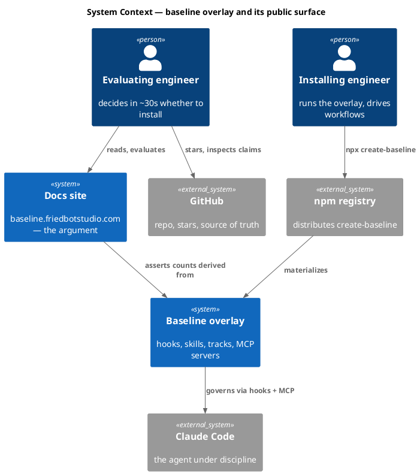

### C4 — Container

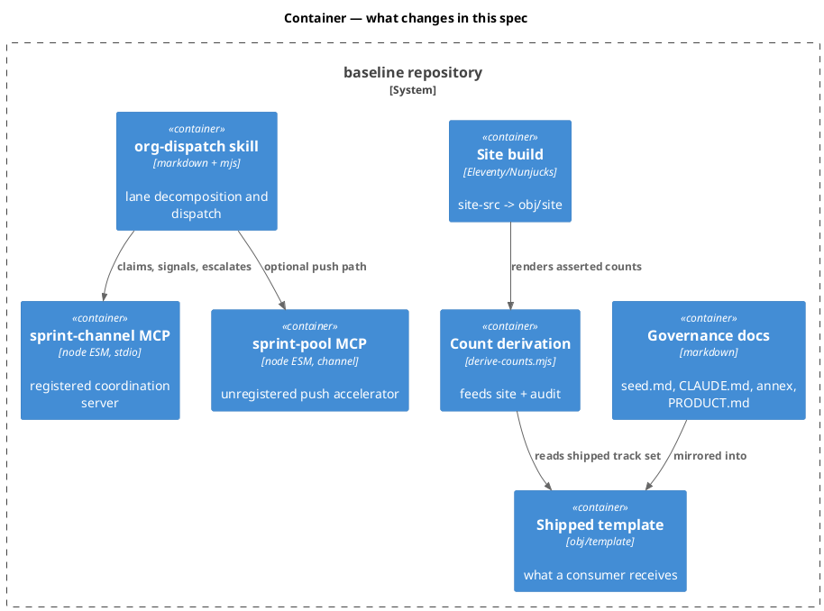

### C4 — Component (changed containers only)

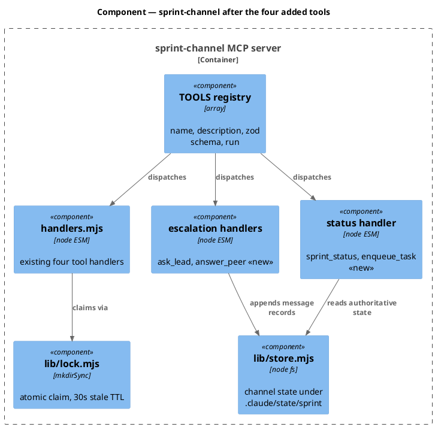

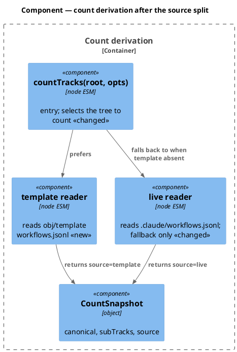

*Containers `gov`, `tmpl`, `siteb` change content, not internals; `pool` and `orgd` are untouched by this spec (`org-dispatch` becomes reachable without its code changing). No Component diagram is drawn for them, per the template's changed-containers-only rule.*

### Data model — class diagram

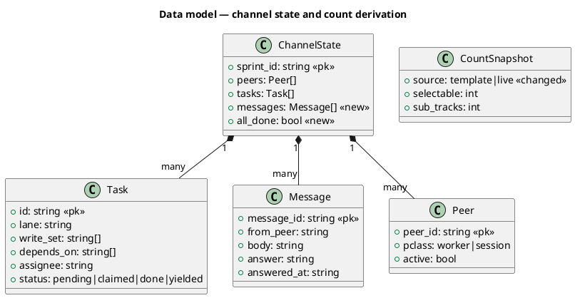

#### Migration DDL

No relational store. Channel state is JSON on disk; the migration is additive and backward-compatible.

```sql
-- forward: additive JSON fields, defaulted on read
-- ChannelState.messages := []      when absent
-- ChannelState.all_done := derived from tasks when absent
-- reverse: drop the fields; readers already default them
```

### Behavior — sequence per AC

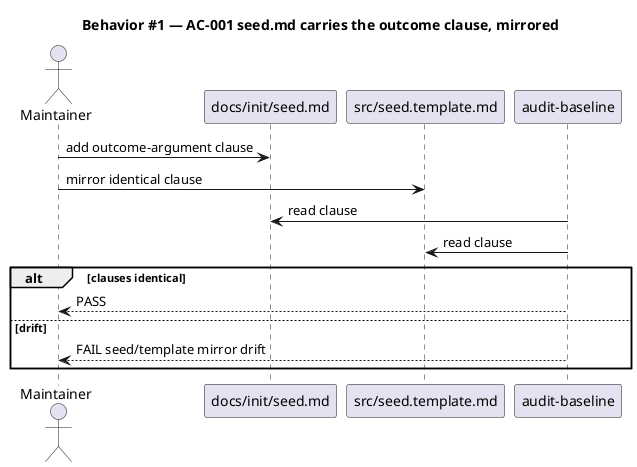

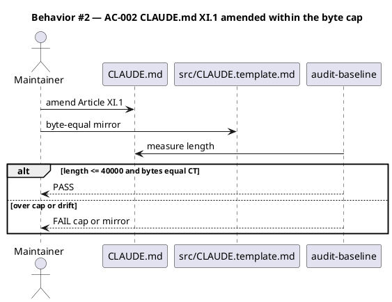

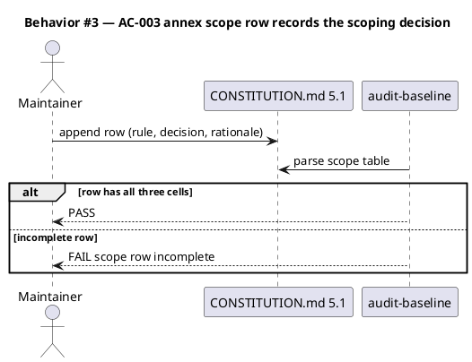

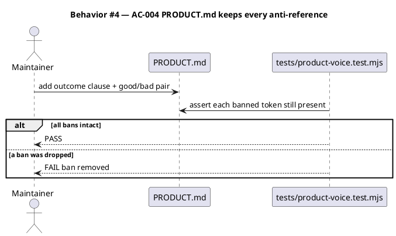

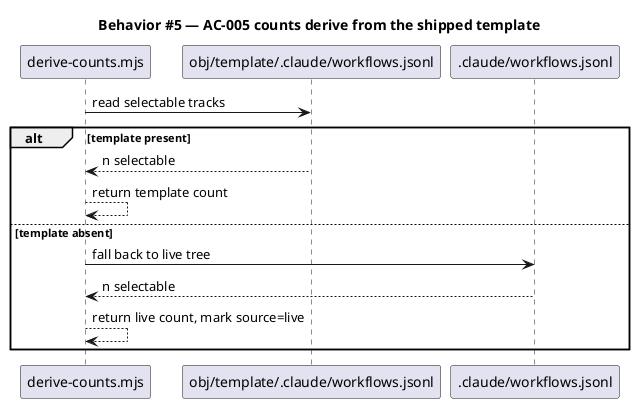

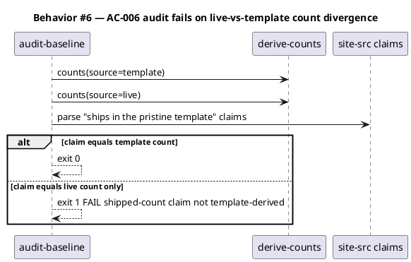

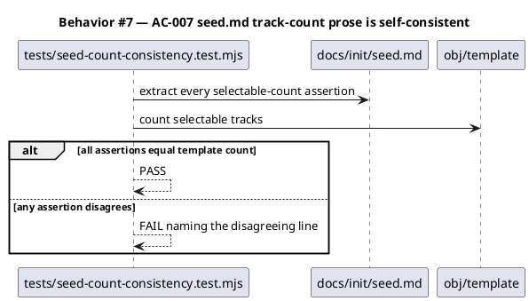

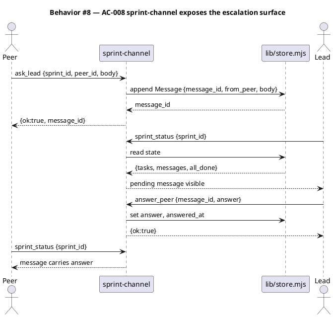

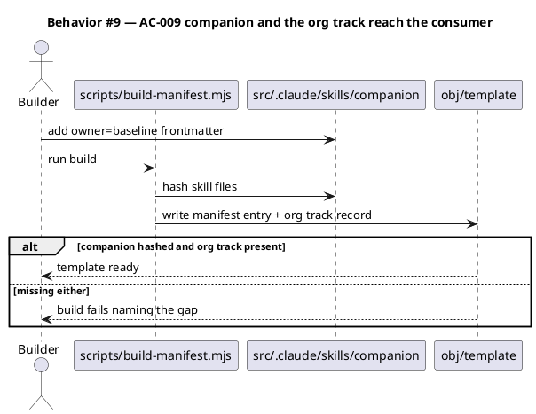

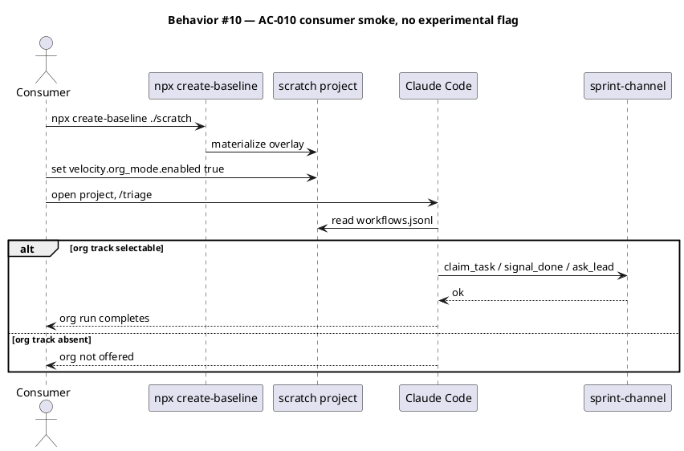

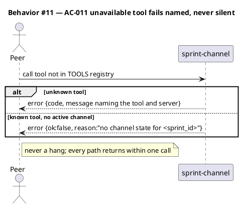

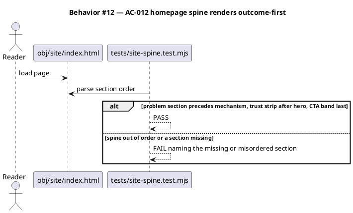

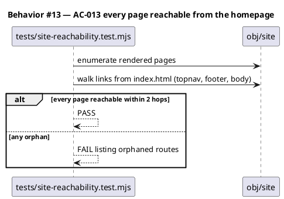

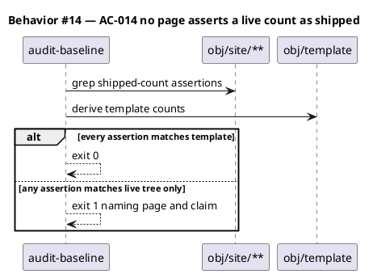

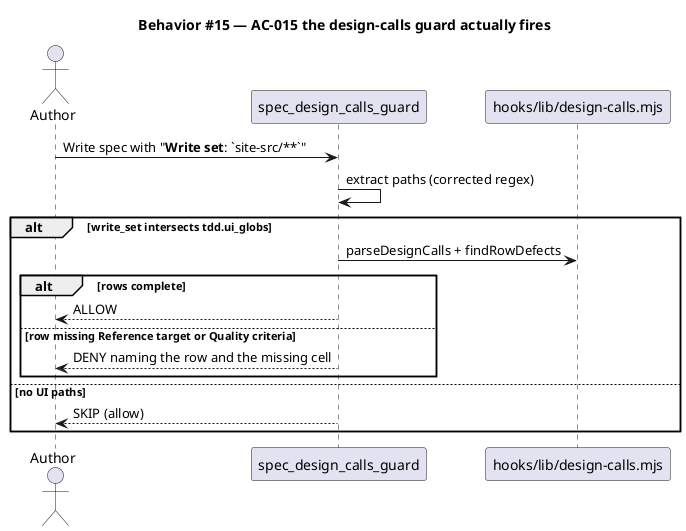

```plantuml
@startuml
title Behavior #16 — AC-016 robots.txt is built and served at the root
actor Crawler
participant "site-src/robots.njk" as Src
participant "Eleventy" as E
participant "obj/site/robots.txt" as Out
E -> Src : render (permalink /robots.txt)
Src -> E : named Allow blocks + absolute Sitemap line
E -> Out : write
Crawler -> Out : GET /robots.txt
alt token is a known training, search, or user-initiated bot
  Out --> Crawler : Allow /
else unknown agent
  Out --> Crawler : User-agent * Allow /
end
@enduml
```

```plantuml
@startuml
title Behavior #17 — AC-017 llms.txt conforms to the llmstxt.org format
actor "Answer engine" as AE
participant "site-src/llms.njk" as Src
participant "obj/site/llms.txt" as Out
participant "tests/llms-format.test.mjs" as T
Src -> Out : render (permalink /llms.txt)
T -> Out : parse
alt exactly one H1, blockquote summary, H2 file lists with [name](url)
  T --> T : PASS
else missing H1 or malformed list entry
  T --> T : FAIL naming the defect
end
AE -> Out : GET /llms.txt
Out --> AE : curated map of what the product is
@enduml
```

```plantuml
@startuml
title Behavior #18 — AC-018 JSON-LD validates and fabricates nothing
participant "tests/structured-data.test.mjs" as T
participant "obj/site/**" as S
T -> S : extract application/ld+json blocks
T -> T : JSON.parse each block
alt parse fails
  T --> T : FAIL naming the page
else parsed
  alt block contains aggregateRating or review
    T --> T : FAIL fabricated claim
  else required props present (name, applicationCategory, operatingSystem)
    T --> T : PASS
  end
end
@enduml
```

### State — core entity

```plantuml
@startuml
title State — channel Task
[*] --> pending : enqueue_task
pending --> claimed : claim_task
claimed --> done : signal_done
claimed --> yielded : yield_fork
yielded --> pending : release_task
claimed --> pending : release_task
done --> [*]
@enduml
```

### Dependencies — graph

```plantuml
@startuml
' @kind dependency-graph
title Dependencies — ticket order
left to right direction
[T4 homepage] --> [T1 governance]
[T4 homepage] --> [T3 org-ship]
[T5 interior] --> [T4 homepage]
[T5 interior] --> [T1 governance]
[T3 org-ship] --> [T2 count-truth]
[T3 org-ship] --> [sprint-channel tools]
[T2 count-truth] --> [derive-counts]
[T1 governance] --> [seed.md]
[T6 guard-regex] --> [write-set-profile]
[T6 guard-regex] --> [design-calls lib]
[sprint-channel tools] --> [lib/store]
[sprint-channel tools] --> [lib/lock]
@enduml
```

### Contracts

| Kind | Name | Input | Output | Errors | Idempotent |
|---|---|---|---|---|---|
| MCP tool | `ask_lead` | `{sprint_id, peer_id, body}` | `{ok, message_id}` | invalid id; no channel state | no (each call is a new message) |
| MCP tool | `answer_peer` | `{sprint_id, message_id, answer}` | `{ok}` | unknown `message_id`; already answered | yes (same answer is a no-op) |
| MCP tool | `sprint_status` | `{sprint_id}` | `{tasks, peers, messages, all_done}` | invalid id; no channel state | yes (read-only) |
| MCP tool | `enqueue_task` | `{sprint_id, task_id, brief, write_set, depends_on?, assignee?}` | `{ok, task_id}` | duplicate `task_id`; invalid id | yes (same payload is a no-op) |
| Function | `countTracks(root, {source})` | `source: "template"\|"live"` | `{canonical, subTracks, source}` | none — returns zeros when file absent | yes |
| CLI | `companion` skill launch | `on <channel> [peer_id]` / `off` / `status` | registration result | invalid peer id; channel absent | `on` is idempotent per peer |
| Static | `GET /robots.txt` | — | named `Allow: /` per D-5 token; `User-agent: *` default; absolute `Sitemap:` | — | yes (static) |
| Static | `GET /llms.txt` | — | llmstxt.org-format markdown: H1, blockquote, H2 file lists | — | yes (static) |
| Embed | `application/ld+json` | — | `SoftwareApplication` (home), `TechArticle` (docs), `Organization` (site-wide) | — | yes (static) |

### Libraries and versions

| Library@version | Purpose | Key APIs | Confirmed against current docs |
|---|---|---|---|
| `@modelcontextprotocol/sdk@1.29.0` | MCP server for the four new tools | `McpServer`, `registerTool(name, {description, inputSchema}, cb)`, `StdioServerTransport` | yes — context7 `/modelcontextprotocol/typescript-sdk/v1.29.0`; config accepts `title/description/inputSchema/outputSchema/annotations/icons/_meta` |
| `zod@4.4.3` | tool input schemas | `z.string()`, `z.array()`, `z.optional()` | yes — matches the shape already used in `sprint-channel/server.mjs` |
| `esbuild@0.28.1` | bundles the MCP servers zero-dep | `build()` via `scripts/bundle-mcp-servers.mjs` | yes — existing pinned devDependency, unchanged |
| `@11ty/eleventy` | site build | Nunjucks templates, `_data` globals | yes — existing build, unchanged |

### Alternatives considered

| Alt | Summary | Rejected because |
|---|---|---|
| A | Register `sprint-pool` in `.mcp.json` as plain stdio | Tools would resolve but channel push would not; `SPRINT_POOL_ACTIVE=1` and the broker socket still assume the launcher, so consumers get a half-wired server — the "broken registration" `seed.md:335` warns about, for real if not for the stated reason |
| B | Ship `launch.sh` and document `--dangerously-load-development-channels` as the consumer path | Hands a governance product's users a `--dangerously-*` flag as the happy path; the channel is not on the Anthropic allowlist, so it can break without notice |
| C | Ship the org track only, document peer attachment as a known gap | The track would be selectable but `org-dispatch` would fail on its first `ask_lead`; shipping a selectable track that cannot run is worse than not shipping it |
| D | Keep org unshipped; market swarm as the parallelism story | Rejected by the maintainer at plan time; also leaves the false "9 tracks ship" claim needing a fix anyway |

## Design calls

| Slug | Intent | Target files | Write set | Register | Reference target | Quality criteria |
|---|---|---|---|---|---|---|
| hero-outcome | Replace the bill-of-materials hero with a falsifiable claim; keep the install pill as evidence, move primary weight to GitHub | `site-src/index.njk` | `site-src/index.njk`, `site-src/assets/site.css` | brand | `DESIGN.md#marketing-surfaces` `.hero` + `.meta-strip` contract; before-state `obj/site/index.html` | headline passes the Descriptive Header Test (names product + outcome in one line); contrast ≥ WCAG AA at 14:1 body / 4.7:1 muted; renders at 360/768/1280 with no horizontal scroll; one H1 terminal accent only; no CLS > 0.1 |
| trust-strip | Post-hero credibility row: stars, licence, alpha label, "every claim points at a file" | `site-src/index.njk` | `site-src/index.njk`, `site-src/assets/site.css` | brand | `DESIGN.md#marketing-surfaces` `.meta-strip` (claim-led form, `PRODUCT.md:40`) | each cell verifiable from the codebase; no vanity hero-metric template; accent used only per the reserved-accent contract; 3-up desktop collapsing to stacked ≤ 640px |
| problem-section | Render the README failure narrative as the first argument after the hero | `site-src/index.njk` | `site-src/index.njk` | brand | `README.md:43-45` verbatim register; `DESIGN.md#marketing-surfaces` `.section`/`.lede` | prose ≤ 90 words; names ≥ 3 concrete failures; zero adjectives from the `PRODUCT.md` banned list; muted body contrast ≥ 4.7:1 |
| parallel-work | Raise swarm + org into the top half as the differentiator, maturity labelled per mode | `site-src/index.njk` | `site-src/index.njk`, `site-src/assets/site.css` | brand | `DESIGN.md#diagrams--figures` hero-symbol vocabulary; existing `_includes/hero-symbols/org.njk` and `swarm.njk` | section begins above 50% scroll depth; each mode carries an explicit maturity chip; reuses existing SVG symbols with no new pattern; ≤ 1 editorial moment consumed |
| cta-band | Full-width closing CTA driving to GitHub, install command secondary | `site-src/index.njk` | `site-src/index.njk`, `site-src/assets/site.css` | brand | `DESIGN.md#buttons--inputs` `.btn-primary`/`.btn-secondary`; existing `.cli-strip` | single primary goal; visually distinct background from the preceding section; both CTAs carry `data-cta` for GA4; focus ring 2px accent at 2px offset |
| nav-ia | Restructure topnav + footer so parallel work is surfaced and no page is orphaned | `site-src/_data/nav.json`, `site-src/_includes/topnav.njk`, `site-src/_includes/footer.njk` | `site-src/_data/**`, `site-src/_includes/**` | product | `DESIGN.md#shell` topnav (60px sticky) + footer three-column contract | every rendered page reachable from `/` within 2 hops; topnav ≤ 8 items at 1280; active state carried by a non-colour cue; drawer behaviour unchanged ≤ 720px |
| interior-leads | Rewrite H1/eyebrow/lead on 17 reference pages so the lead claims before it describes | `site-src/*.njk`, `site-src/*/*.njk` | `site-src/**` | product | `DESIGN.md#docs-surfaces` `.docs-hero` + `.article` `.lead` (21px) | each lead states an outcome in sentence 1; tables and reference bodies unchanged; per-page editorial budget not exceeded; heading hierarchy unbroken for AT |
| notfound-cards | Add the seven missing routes to the 404 recovery grid | `site-src/404.njk` | `site-src/404.njk` | product | `DESIGN.md#components-catalog` `.concepts` grid | every rendered route present; grid reflows 3/2/1 across 1280/768/360; no new component introduced |

## Acceptance criteria

| ID | Criterion (given / when / then) | Kind | Upstream AC | Sequence |
|---|---|---|---|---|
| AC-001 | given the amendment, when `audit-baseline` runs, then `docs/init/seed.md` and `src/seed.template.md` carry an identical outcome-argument clause and the audit passes | behavior | plan Workstream A.1-2 | §Behavior #1 |
| AC-002 | given the amendment, when the audit runs, then `CLAUDE.md` Article XI.1 reflects it, the file is ≤ 40,000 chars, and `src/CLAUDE.template.md` is byte-equal | behavior | plan A.3 | §Behavior #2 |
| AC-003 | given the amendment, when the annex is parsed, then `.claude/CONSTITUTION.md` §5.1 carries a scope row naming the impeccable rule scoped, the decision, and a one-line rationale | behavior | plan A.4 | §Behavior #3 |
| AC-004 | given the revised `PRODUCT.md`, when the voice test runs, then every pre-existing anti-reference token is still present and the outcome clause plus one good/bad pair are added | behavior | plan A.5 | §Behavior #4 |
| AC-005 | given `obj/template/.claude/workflows.jsonl` exists, when `countTracks` runs, then it returns the template's selectable count; when the template is absent it falls back to the live tree and marks `source: "live"` | behavior | plan B.4 | §Behavior #5 |
| AC-006 | given a site page asserting a count "ships in the pristine template", when `audit-baseline` runs, then it exits 0 only if that count equals the template-derived count, else exits 1 naming the page and claim | preflight | plan B.4, Verification 1 | §Behavior #6 |
| AC-007 | given `docs/init/seed.md`, when the consistency test runs, then every selectable-track-count assertion (lines 798, 800, 921) equals the template-derived count | behavior | plan B.5 | §Behavior #7 |
| AC-008 | given a running `sprint-channel`, when a peer calls `ask_lead` and the lead calls `sprint_status` then `answer_peer`, then the message is persisted, visible in status, and the answer is readable by the originating peer | behavior | D-1 | §Behavior #8 |
| AC-009 | given a template build, when `scripts/build-manifest.mjs` runs, then the `companion` skill is `owner: baseline`, hashed in the manifest, and the `org` track record is present in `src/.claude/workflows.template.jsonl` | behavior | plan B.1, B.3 | §Behavior #9 |
| AC-010 | given a fresh `npx` install into an empty git repo with `velocity.org_mode.enabled` true, when a two-lane org run is driven end to end, then it completes without `--dangerously-load-development-channels` and without any file that exists only in this repo | smoke | plan Verification 4 | §Behavior #10 |
| AC-011 | given a peer calling a tool absent from the channel registry, or a known tool with no channel state, then the call returns a named error identifying the tool and server within one call, never a hang | error-mapping | D-1, D-3 | §Behavior #11 |
| AC-012 | given the rendered homepage, when the spine test runs, then the problem section precedes the mechanism section, the trust strip follows the hero, the parallel-work section begins above 50% scroll depth, and a full-width CTA band is last | behavior | plan Workstream C | §Behavior #12 |
| AC-013 | given the rendered site, when the reachability test walks links from `/`, then every rendered page is reachable within 2 hops and the topnav surfaces parallel work | behavior | plan Workstream E | §Behavior #13 |
| AC-014 | given every rendered page, when the audit runs, then no page asserts a live-tree-derived count as a shipped count | behavior | plan B.4, D | §Behavior #14 |
| AC-015 | given a spec whose write set uses the template's bolded `**Write set**:` form and includes a `tdd.ui_globs` path, when `spec_design_calls_guard` runs, then it extracts those paths and DENIES a write whose `## Design calls` rows are missing a Reference target or Quality criteria; `spec-lint` reports the same verdict | preflight | D-4, T6 | §Behavior #15 |
| AC-016 | given a site build, when `obj/site/robots.txt` is read, then it exists at the root, names every crawler token in the D-5 table with `Allow: /`, carries a `User-agent: *` / `Allow: /` default, and ends with an absolute `Sitemap:` line matching `site.url` | behavior | D-5, T7 | §Behavior #16 |
| AC-017 | given a site build, when `obj/site/llms.txt` is parsed, then it has exactly one H1, a blockquote summary, and H2-delimited file lists whose entries are `[name](url)` with optional `: notes`, per the llmstxt.org format | behavior | D-5, T7 | §Behavior #17 |
| AC-018 | given every rendered page, when its `application/ld+json` blocks are parsed, then each parses as valid JSON, carries the required `SoftwareApplication` properties where present, and no block contains `aggregateRating` or `review` | preflight | D-5, T7 | §Behavior #18 |

## Test plan

| Category | Scenario | Expected | Covers |
|---|---|---|---|
| Golden path | `ask_lead` → `sprint_status` → `answer_peer` → peer reads answer | full round trip persists and resolves | AC-008 |
| Golden path | fresh npx install, org flag on, two-lane run to completion | completes with no launch flag | AC-010 |
| Golden path | `countTracks` with template present | returns template count, `source: "template"` | AC-005 |
| Input boundary | `sprint_id` empty / path-traversal (`../`) / 300-char / unicode | rejected by `isSafeId` before any path is built | AC-011 |
| Input boundary | `enqueue_task` with duplicate `task_id` | no-op, returns `{ok:true}`, no duplicate row | AC-008 |
| Contract violation | `answer_peer` with unknown `message_id` | named error, no state mutation | AC-011 |
| Contract violation | `CLAUDE.md` grown past 40,000 chars | audit FAIL on the cap | AC-002 |
| Contract violation | site asserts live count as shipped | audit exit 1 naming page and claim | AC-006, AC-014 |
| Concurrency / ordering | two peers `claim_task` the same lane simultaneously | exactly one winner, one `EEXIST`; lock stale after 30s TTL | AC-008 |
| Concurrency / ordering | `answer_peer` twice with the same answer | idempotent, single `answered_at` | AC-008 |
| Failure mode | channel state directory absent when `sprint_status` called | named error, not a throw or hang | AC-011 |
| Failure mode | `obj/template` missing during count derivation | falls back to live, marks `source: "live"`, never crashes the build | AC-005 |
| Failure mode | peer process dies holding a claim | lock reclaimed after TTL; lane returns to pending | AC-008 |
| Regression trap | existing four `sprint-channel` tools unchanged in name and shape | `TOOL_NAMES` superset, prior four byte-identical behaviour | AC-008 |
| Regression trap | every `PRODUCT.md` anti-reference token still present | unchanged | AC-004 |
| Regression trap | `seed.md` ↔ `src/seed.template.md` mirror | unchanged by the amendment | AC-001 |
| Regression trap | all 26 hooks still wired in `settings.json` | unchanged | AC-009 |
| Regression trap | rendered site has no orphan routes | unchanged after IA edit | AC-013 |
| Golden path | spec with `**Write set**: \`site-src/**\`` and complete Design calls rows | guard ALLOWs, lint PASS with non-zero paths checked | AC-015 |
| Contract violation | same spec with a Design calls row missing Quality criteria | guard DENIES naming row and missing cell | AC-015 |
| Input boundary | write-set line in all three forms: `**Write set**:`, `Write set:`, `The write_set is` | all three extract the same path set | AC-015 |
| Regression trap | `+write_set: string[]` inside a class diagram | contributes zero paths; never the sole match driving a SKIP | AC-015 |
| Regression trap | spec with no UI paths in write_set | guard still SKIPs (allow) | AC-015 |
| Golden path | build the site, fetch `/robots.txt` | every D-5 token present with `Allow: /`; absolute Sitemap line | AC-016 |
| Golden path | build the site, parse `/llms.txt` | one H1, blockquote, well-formed H2 file lists | AC-017 |
| Contract violation | a JSON-LD block carrying `aggregateRating` | test FAILs naming the page | AC-018 |
| Contract violation | `robots.txt` with a bare `Disallow: /` under `User-agent: *` | test FAILs — the site must stay crawlable | AC-016 |
| Input boundary | `site.url` changed via `site-src/CNAME` | Sitemap line in robots.txt follows, no second hardcoded origin | AC-016 |
| Failure mode | a page renders no JSON-LD block | allowed; test asserts validity only where a block exists | AC-018 |
| Regression trap | `/sitemap.xml` still renders and excludes `/404.` | unchanged | AC-016 |

## Observability

| Signal | Name | Shape | Purpose |
|---|---|---|---|
| Log | `sprint-channel.tool` | fields: `tool`, `sprint_id`, `peer_id`, `outcome` | audit the escalation chain during a run |
| Log | `derive-counts.source` | fields: `source`, `canonical`, `subTracks` | prove which tree a rendered count came from |
| Metric | `audit.claim_drift` | counter, labels: `page`, `claim` | count shipped-claim mismatches per audit run |
| Alarm | `audit exit 1` | CI job fails on any non-zero audit exit | blocks a publish asserting an untrue count |

## Rollout

### Prerequisites

| # | Prerequisite | enforced-by |
|---|---|---|
| 1 | The shipped template contains the `org` track and the four added channel tools before any page claims org ships | AC-010 |
| 2 | Every shipped-count claim on the site is verified against `obj/template`, not the live tree, before publish | AC-006 |
| 3 | A peer invoking an unavailable tool receives a named error within one call, never a hang | AC-011 |
| 4 | `spec_design_calls_guard` extracts paths from the template's bolded write-set form before any spec in this batch claims design-call coverage | AC-015 |
| 5 | No structured-data block asserts a rating, review, or offer the project does not have | AC-018 |

- **Feature flag**: `velocity.org_mode.enabled` — default off, unchanged. Shipping the track does not enable it.
- **Migration order**: 1 governance amendment → 2 count-truth fix → 2b guard-regex repair (T6, independent; lands with the count-truth fix as the same claims-vs-enforcement family) → 3 channel tools + companion + track → 4 homepage → 5 interior pages and IA.
- **Canary**: the maintainer's own repo is the canary. A full two-lane org run on a scratch `npx` install must pass before the site copy claiming org ships is published.

## Rollback

- **Kill-switch**: revert per ticket — the commit split keeps T1–T5 independently revertable, closure last. Setting `velocity.org_mode.enabled` false restores prior solo/swarm behaviour with no code change.
- **Signal to roll back**: `audit-baseline` exit 1 on any shipped-count claim, or a failing consumer smoke on a fresh `npx` install. Both surface inside one CI run (< 5 min).

## Archive plan

- Defaults *(automatic)*: spec, spec-rendered/, spec approval, security reports (per ticket, concatenated).
- Extras *(list any non-default files)*:
  - `.config/plans/review-the-whole-website-cozy-quokka.md` — the approved plan, which stands in for the excepted intake/scout/research artifacts and is the only record of the discovery behind this batch.

## Open questions

- **Does `sprint-channel` need push at all for a consumer org run?** D-3 says no (reconcile via `sprint_status`), and the dogfood supports it. If a consumer run shows peers polling too aggressively, a bounded backoff is the fix — not the channel API. Not blocking.
- **Should `sprint-pool` stay in the shipped bundle once the channel carries the full surface?** It ships bundled today (manifest-hashed, ~563 KB) but nothing a consumer can run uses it. Dropping it from the bundle is a size win; keeping it preserves the dogfood path unchanged. Recommend keeping it this cycle and revisiting once the channel path has real consumer mileage. Not blocking.
- **Does the `/why/` page earn its own route?** The plan left this open. Recommend no for this cycle — the homepage problem section covers it, and a thin page would dilute the spine. Not blocking.
