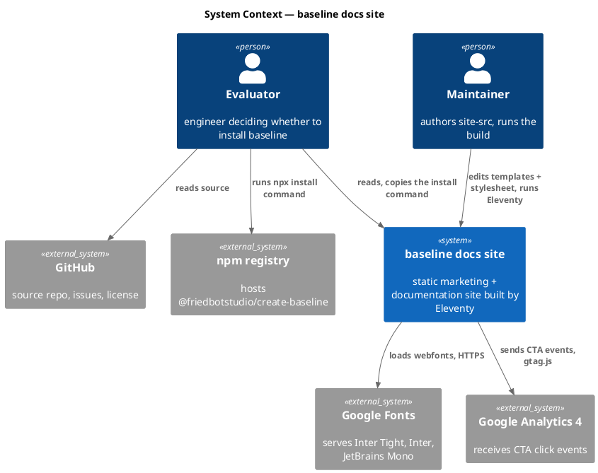
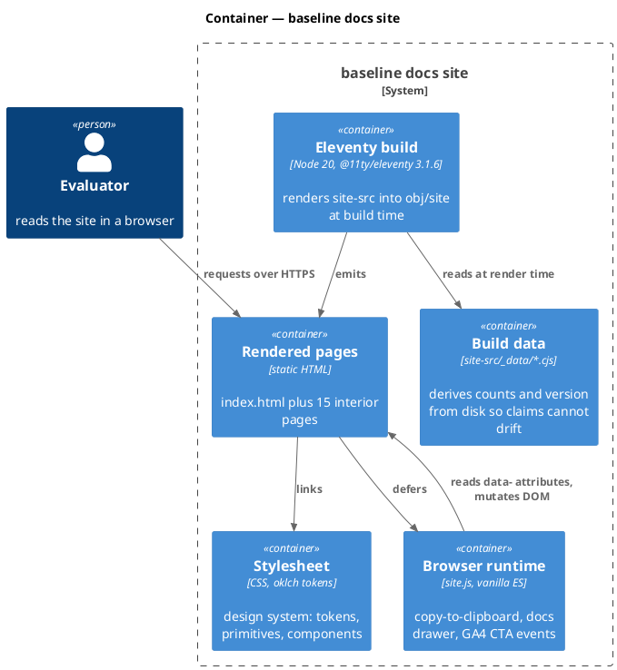
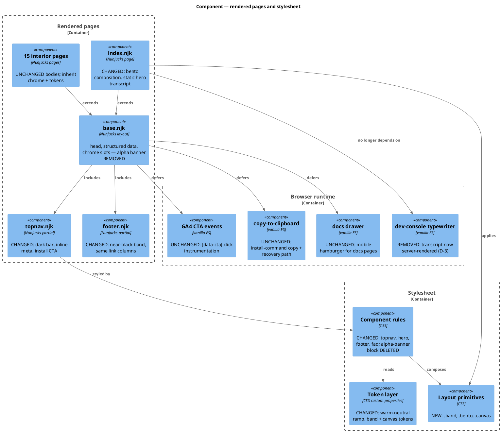
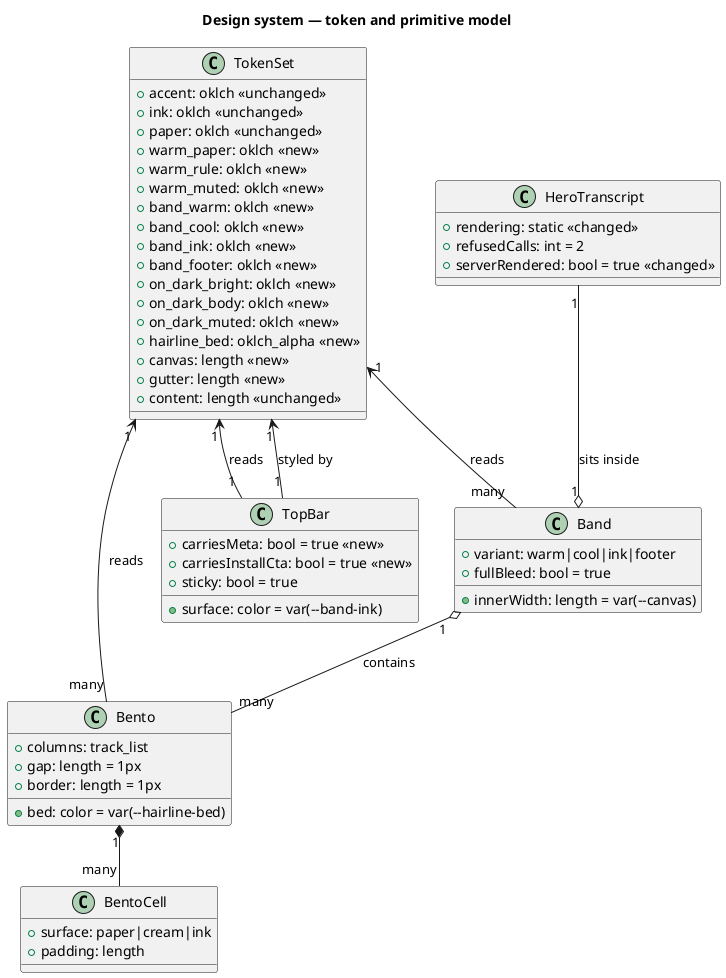
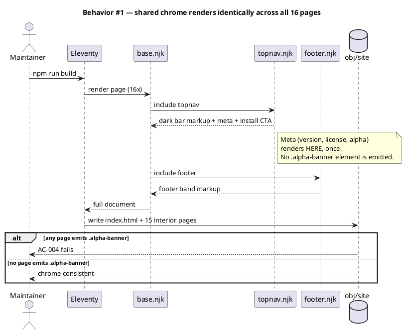
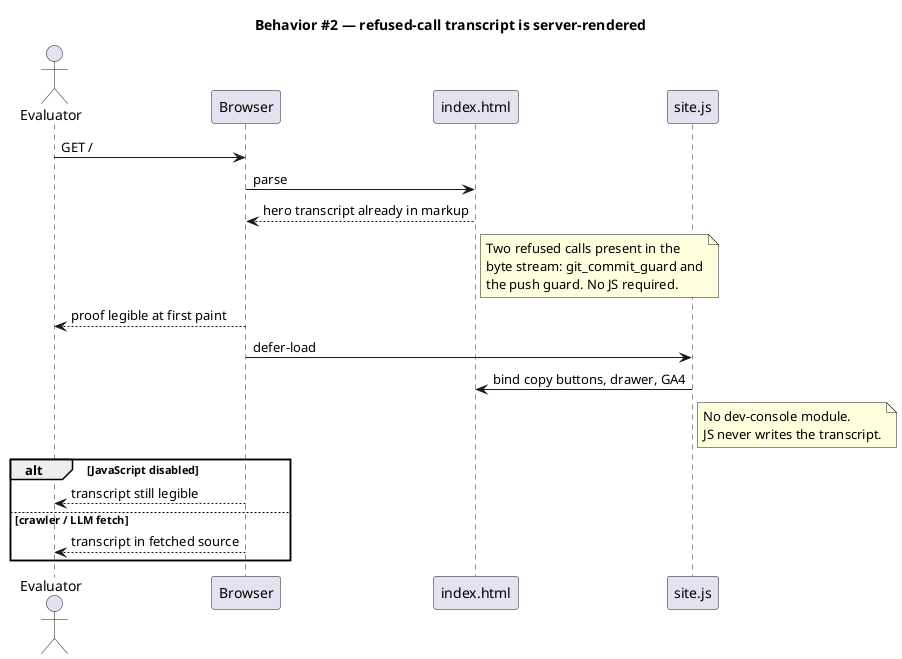
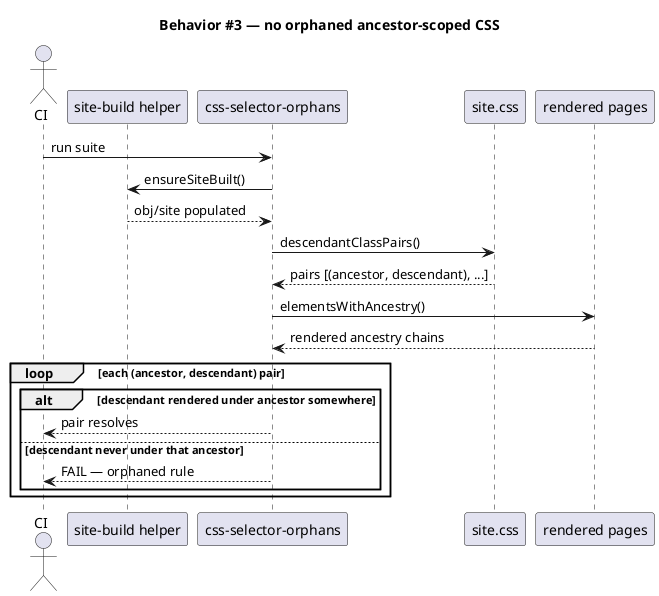
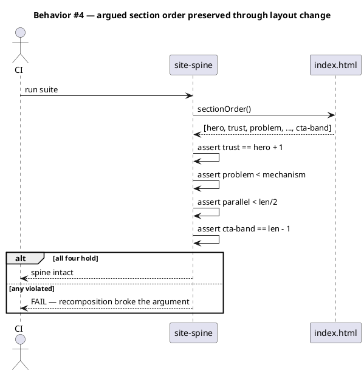
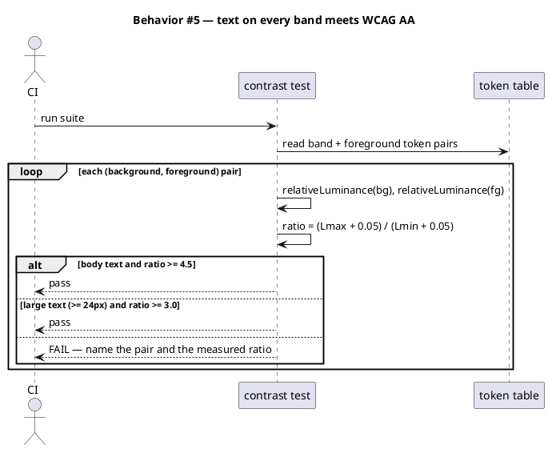
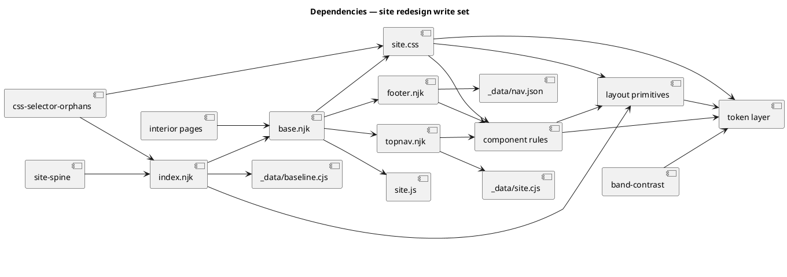

# Site redesign — 1b "Proof grid" homepage and shared chrome

## Context

| Input | Path |
|---|---|
| Intake | *(excepted — spec-entry track; direction decided in-conversation)* |
| BRD *(if any)* | *(none)* |
| Scout *(if any)* | *(excepted — write surface mapped in-conversation)* |
| Research *(if any)* | *(excepted — no library choice to research)* |
| Design reference | `docs/design/site-1b-proof-grid.html` |

**Write set**: `site-src/index.njk`, `site-src/_includes/topnav.njk`, `site-src/_includes/footer.njk`, `site-src/_layouts/base.njk`, `site-src/assets/site.css`, `site-src/assets/site.js`, `tests/**`

Full C4 profile applies: `site-src/**` is not in any `artifacts.diagram_profiles.non-architectural.when` glob.

## Goal

The homepage and the site-wide chrome render in the 1b "Proof grid" composition — one dark bar carrying identity plus the install command, a warm hero band whose terminal shows two refused tool calls, hairline bento evidence grids on a 1280px canvas, and alternating full-bleed bands — with the existing type stack, the existing content spine, and no raw hex in the stylesheet.

## Non-goals

- **Interior page layout.** The 15 interior pages inherit the new chrome (nav, footer, bands, tokens) but keep their current body composition. Their layout pass is a later slice.
- **Content rewriting.** The §I–§VI spine, the headline claims, and the FAQ answers landed in the prior workflow and are carried verbatim. Copy changes are out of scope except where a layout change strands a fragment.
- **Typeface change.** Inter Tight / Inter / JetBrains Mono stay. 1b's IBM Plex is deliberately not adopted (see Decisions D-1).
- **New pages, new nav destinations, or IA changes.**
- **Analytics, structured data, sitemap, or robots changes.**

## Decisions

Routine engineering calls decided in main context and recorded here for gate-A review (CLAUDE.md Art. XI.12). `owner: engineer` on all rows.

**D-1 — Keep Inter Tight / Inter / JetBrains Mono; do not adopt IBM Plex.**
Human-directed. 1b's structure, color and spacing carry the redesign on their own. Plex Mono is metrically wider than JetBrains Mono, and the §II tool-boundary diagram and §III DAG are hand-aligned monospace ASCII whose column alignment would break across every width. Zero webfont-payload change, zero re-measuring.

**D-2 — Map 1b's palette onto the oklch token set; introduce a warm-neutral ramp rather than raw hex.**
Measured: 1b's `#c2440c` is `oklch(55.7% 0.171 39.4)`; the shipped `--accent` is `oklch(55.8% 0.187 41.5)`. That is a 0.1% lightness and 2.1° hue delta — visually the same orange. **The accent does not change.** What 1b actually introduces is a *warm* neutral ramp (hue 76–92) where the current system uses pure grey (hue 0) and cool slate (hue 257). So the change is a new neutral ramp plus four band tokens, not a new palette.

**D-3 — Server-render the hero transcript as static markup; retire the typewriter module.**
The refused-tool-call transcript is the page's single most load-bearing proof, and today it is injected by `site.js` after paint — invisible to crawlers, to LLM retrieval, to a JS-off reader, and to any screenshot taken before the animation settles. Rendering it in the template makes it indexable and instantly legible, and removes ~180 of `site.js`'s 318 lines. The module already contains the exact static-paint code path (its `prefers-reduced-motion` branch), so the rendered end-state is a known quantity, not a new design.

**D-4 — Fold the site-wide alpha banner into the dark top bar and delete its stylesheet block.**
1b's bar carries `v0.20 · Apache 2.0 · public alpha` inline. Keeping a separate `.alpha-banner` strip below it would state the same three facts twice, ~55px apart. The banner element and its ~80-line CSS block are removed together — leaving the CSS behind would trip `css-selector-orphans`, which is precisely the failure that test was written for.

**D-5 — Add `--canvas`/`--gutter`; keep `--content` intact.**
Interior pages read `--content: 856px` as their prose rail and are out of scope. Redefining it would silently re-flow all 15. The wide grid gets new tokens; the prose rail is untouched.

## Design

Diagrams are the contract. Prose is only for what a diagram cannot say.

### C4 — System context

### C4 — Container

### C4 — Component (changed containers only)

Three containers change: the rendered-pages template graph, the stylesheet, and the browser runtime. The Eleventy build and the build-data layer are untouched, so they get no component diagram.

### Data model — class diagram

No persistence layer. The entities are the design-system objects the stylesheet declares; cardinality is "how many of these the page composes". `<<new>>` marks a token or primitive this spec introduces.

#### Migration DDL

*(none — the site has no persistence layer. The class diagram above models CSS design-system objects, which carry no schema and need no migration.)*

### Behavior — sequence per AC

#### §Behavior #1 — Chrome renders once, from one source, on every page

#### §Behavior #2 — The hero proof is in the HTML, not injected

#### §Behavior #3 — Every descendant rule still resolves after restructuring

#### §Behavior #4 — The spine order survives the recomposition

#### §Behavior #5 — Contrast holds on the four band surfaces

### State — core entity

*(omitted by choice — the site is stateless. The only runtime state is the copy-button's transient `is-copied` class, which is an existing component behavior this spec does not touch.)*

### Dependencies — graph

### Contracts

The redesign exposes no API. The contracts are the CSS primitives interior pages will consume in the follow-up slice — pinned here so that slice does not have to invent them.

| Kind | Name | Input | Output | Errors | Idempotent |
|---|---|---|---|---|---|
| CSS class | `.band` | `--band-*` token via variant class | full-bleed background, inner content constrained to `var(--canvas)` | none (presentational) | yes |
| CSS variant | `.band--warm` / `--cool` / `--ink` / `--footer` | — | sets background + matching foreground ramp | unknown variant → transparent background | yes |
| CSS class | `.bento` | `grid-template-columns` set by caller | 1px hairline grid over `var(--hairline-bed)` with 1px outer border | none | yes |
| CSS child | `.bento > *` | — | opaque cell surface (`var(--paper)` default) | none | yes |
| CSS class | `.canvas` | — | `max-width: var(--canvas)`, `padding-inline: var(--gutter)`, centred | none | yes |
| Token | `--canvas` | — | `1280px` | — | yes |
| Token | `--gutter` | — | `48px` | — | yes |
| Nunjucks partial | `topnav.njk` | `site`, `nav`, `active`, `subtitle` | dark bar with brand, primary nav, meta, install CTA | missing `site.version` → renders without meta segment | yes |

### Libraries and versions

This slice writes CSS and Nunjucks templates. It introduces **no new third-party API call**, so there is no new API surface to confirm; the versions below are recorded because the write set's output depends on them.

| Library@version | Purpose | Key APIs | Confirmed against current docs |
|---|---|---|---|
| `@11ty/eleventy@3.1.6` | static build; renders `site-src` → `obj/site` | none new — existing `dir.input`/`dir.output`/`includes` config unchanged | n/a — no new API used |
| `nunjucks@3.2.4` | template language for `.njk` | none new — `include`, `for`, `if`, filters already in use | n/a — no new API used |

**Platform CSS features.** `text-wrap: pretty` appears throughout the 1b reference and is currently unused in the stylesheet (0 occurrences). It is adopted as a **progressive enhancement**: unsupported engines fall back to normal wrapping with no layout break and no fallback rule required. `oklch()` (46 uses), `color-mix()` (2) and `::details-content` (5) are already shipping in the stylesheet, so this spec adds no new baseline requirement.

### Alternatives considered

| Alt | Summary | Rejected because |
|---|---|---|
| A | Adopt 1b wholesale including IBM Plex Sans/Mono | Human-directed against (D-1). Also breaks hand-aligned monospace ASCII in §II and §III at every width. |
| B | Redesign all 16 pages in one pass | Blast radius against 12 site tests in a single diff, and interior bodies need their own composition decisions the homepage does not settle. Deferred to a follow-up slice — `deferred: cost`. |
| C | Keep the light topnav, add the dark bar above it | Two bars stacked costs ~90px of vertical space above the hero and states the same meta twice. 1b merges them for exactly this reason. |
| D | Redefine `--content` from 856px to 1280px | Silently re-flows all 15 interior prose pages, which are explicitly out of scope. New tokens instead (D-5). |
| E | Keep the typewriter and re-script it to the refusal transcript | Leaves the page's core proof invisible to crawlers, LLM retrieval and JS-off readers, and delays it behind an animation (D-3). |

## Design calls

Every row's write set intersects `project.json → tdd.ui_globs` (`site-src/**`, `**/*.css`, `**/*.njk`), so `spec_design_calls_guard` applies. `/tdd` Step 6 invokes `Skill(design-ui, task_brief)` once per row; design-ui routes each through `impeccable`.

The reference target for every row is the committed 1b extract at `docs/design/site-1b-proof-grid.html` (383 lines) — the same artifact the design-judge captures-and-compares against. Each row's Reference target cell carries the line range of its region, verified against the committed file.

| Slug | Intent | Target files | Write set | Register | Reference target | Quality criteria |
|---|---|---|---|---|---|---|
| tokens-warm-ramp | Extend the token layer with the warm-neutral ramp, four band surfaces and the canvas metrics, expressed in oklch — no raw hex enters the stylesheet | `site-src/assets/site.css` | `site-src/assets/site.css` | inherit | `docs/design/site-1b-proof-grid.html` — the six band surfaces at L14 (dark bar), L27 (warm hero), L130 (cool §II), L330 (org dark), L344 (warm CTA), L356 (footer ink) | zero raw hex or `rgb()` literals added outside the existing `--mac-*` cultural-reference block; every new token in `oklch()`; measured ΔE between each new token and its 1b hex ≤ 2.0; `--accent` byte-unchanged |
| chrome-dark-bar | Replace the light sticky topnav plus the separate alpha banner with one dark bar carrying brand, primary nav, version/license/alpha meta and an accent install CTA | `site-src/_includes/topnav.njk`, `site-src/_layouts/base.njk`, `site-src/assets/site.css` | `site-src/_includes/topnav.njk`, `site-src/_layouts/base.njk`, `site-src/assets/site.css` | inherit | `docs/design/site-1b-proof-grid.html` L14–L26 | bar height 44–52px at ≥1024px; nav + meta + CTA on one line down to 1024px, meta drops before nav below it; CTA label text contrast ≥ 4.5:1; keyboard focus ring visible on every interactive child; no `.alpha-banner` element in any rendered page; renders at 360/768/1280/1440 with no horizontal overflow |
| hero-proof-band | Build the warm hero band: eyebrow, 76px display headline, lead, install CTA row, and the static refused-tool-call terminal as its right-hand proof | `site-src/index.njk`, `site-src/assets/site.css`, `site-src/assets/site.js` | `site-src/index.njk`, `site-src/assets/site.css`, `site-src/assets/site.js` | inherit | `docs/design/site-1b-proof-grid.html` L27–L44 (band, headline, CTA row) and L45–L65 (the refused-call terminal) | headline clamps 40px→76px across 360→1440 with `line-height ≤ 1.0` and `letter-spacing ≈ -0.038em` at full size; both refused calls present in server-rendered HTML before any JS runs; terminal body text contrast ≥ 4.5:1 on the dark surface; refusal marker distinguishable without relying on color alone; hero CLS contribution = 0; band spans full bleed with content on the 1280px canvas |
| bento-evidence-grids | Introduce the hairline bento primitive and apply it to the four §I–§V composites: 3-up evidence grid, 320px+1fr strata split, 1fr/200px/1fr subagent split, 2×2 install steps | `site-src/index.njk`, `site-src/assets/site.css` | `site-src/index.njk`, `site-src/assets/site.css` | inherit | `docs/design/site-1b-proof-grid.html` L66–L91 (3-up evidence), L92–L129 (strata split), L200–L237 (subagent split), L238–L264 (install steps) | gaps render as exactly 1px hairlines at 1×, 2× and 3× DPR with no doubled seams; cells collapse to single column below 768px with the hairline bed intact; every `.bento` descendant rule resolves under a rendered `.bento` ancestor (`css-selector-orphans` green); no nested-grid overflow at 360px |
| bands-and-faq | Apply the alternating full-bleed band rhythm across §II/org/CTA/footer and recompose the FAQ accordion into two columns | `site-src/index.njk`, `site-src/_includes/footer.njk`, `site-src/assets/site.css` | `site-src/index.njk`, `site-src/_includes/footer.njk`, `site-src/assets/site.css` | inherit | `docs/design/site-1b-proof-grid.html` L130–L158 (cool §II band), L265–L329 (2-column FAQ), L330–L355 (org + CTA bands), L356–L377 (footer) | four band variants render their specified surface; body text on each meets WCAG AA (≥4.5:1) and headings ≥3.0:1; FAQ is two columns ≥1024px and one below; every `
` remains keyboard-operable with a visible focus ring and correct `aria-expanded` semantics; `cta-band` remains the final `<section>` in document order |

## Acceptance criteria

| ID | Criterion (given / when / then) | Kind | Upstream AC | Sequence |
|---|---|---|---|---|
| AC-001 | given the stylesheet after this change, when scanned for color literals, then no raw hex or `rgb()`/`rgba()` value has been added outside the pre-existing `--mac-*` cultural-reference block, and every newly-declared color token uses `oklch()` | behavior | D-2 | §Behavior #1 |
| AC-002 | given `--accent`, when compared byte-for-byte against its pre-change declaration, then it is unchanged | behavior | D-2 | §Behavior #1 |
| AC-003 | given `--content`, when compared byte-for-byte against its pre-change declaration, then it is unchanged, and `--canvas: 1280px` and `--gutter: 48px` exist alongside it | behavior | D-5 | §Behavior #1 |
| AC-004 | given any of the 16 rendered pages, when parsed, then it contains exactly one top-bar element, that bar carries the version, license and alpha-status text, and no element carrying class `alpha-banner` is present anywhere | behavior | D-4 | §Behavior #1 |
| AC-005 | given the rendered `index.html`, when read as raw bytes with no JavaScript executed, then the hero transcript is present and contains both refused tool calls naming `git_commit_guard` and the push guard | behavior | D-3 | §Behavior #2 |
| AC-006 | given `site-src/assets/site.js`, when loaded, then it registers no element with id `dc-stream` and defines no typewriter interval, while the copy-to-clipboard, docs-drawer and GA4 CTA behaviors continue to work | behavior | D-3 | §Behavior #2 |
| AC-007 | given the built site, when every `.a .b` descendant pair in the stylesheet is checked against rendered ancestry, then each pair resolves on at least one page | preflight | Art. VI.2 | §Behavior #3 |
| AC-008 | given the rendered `index.html`, when section classes are read in document order, then `trust` is immediately after `hero`, `problem` precedes `mechanism`, `parallel` sits in the first half, and `cta-band` is last | preflight | site-spine | §Behavior #4 |
| AC-009 | given each of the four band variants, when its background and foreground token pair is measured, then body-size text meets ≥4.5:1 and text ≥24px meets ≥3.0:1 | smoke | WCAG 1.4.3 | §Behavior #5 |
| AC-010 | given the homepage at viewport widths 360, 768, 1024, 1280 and 1440, when rendered, then no horizontal overflow occurs and the top bar, hero and every bento remain readable | smoke | 1b responsive | §Behavior #1 |
| AC-011 | given a `.bento` container, when rendered, then its cell seams compute to 1px, its cells sit on an opaque surface over `var(--hairline-bed)`, and it collapses to a single column below 768px | behavior | bento-evidence-grids | §Behavior #3 |
| AC-012 | given the 15 interior pages, when rendered, then each inherits the new chrome and tokens and none regresses on the existing reachability, sitemap, relative-path, structured-data or shipped-claims suites | behavior | Non-goals | §Behavior #1 |
| AC-013 | given the follow-up interior-page layout pass, when this slice ships, then it is not attempted here — `deferred: cost` (blast radius against 12 site tests in one diff; interior bodies need composition decisions the homepage does not settle) | behavior | Alternatives B | §Behavior #1 |

## Test plan

| Category | Scenario | Expected | Covers |
|---|---|---|---|
| Golden path | Build the site; read `index.html` | Renders; spine order holds; hero transcript present in bytes | AC-005, AC-008 |
| Golden path | Scan `site.css` for added color literals | Zero raw hex/rgb outside the `--mac-*` block; new tokens all `oklch()` | AC-001 |
| Regression trap | Diff `--accent` and `--content` declarations against `HEAD` | Byte-identical | AC-002, AC-003 |
| Contract violation | Grep every rendered page for `class="alpha-banner"` / `alpha-banner` | Zero matches across all 16 pages | AC-004 |
| Contract violation | Parse `site.js` for `dc-stream` and interval-driven typing | Neither present; other three modules intact | AC-006 |
| Input boundary | Render at 360 / 768 / 1024 / 1280 / 1440 | No horizontal overflow at any width | AC-010 |
| Input boundary | Bento at 360px with the longest track-chip label | Single column, no overflow, hairline bed intact | AC-011 |
| Failure mode | Compute contrast for all four band foreground/background pairs | Every pair meets its AA bar; failures name the pair and ratio | AC-009 |
| Failure mode | Load `index.html` with JavaScript disabled | Transcript legible; copy button degrades to selectable text | AC-005 |
| Regression trap | `css-selector-orphans` over the restructured markup | Every descendant pair resolves | AC-007 |
| Regression trap | Existing site suites: reachability, sitemap, relative-paths, structured-data, shipped-claims, ga4-built-site, build-id | All green | AC-012 |
| Concurrency / ordering | Rebuild twice from a clean `obj/` | Byte-identical output apart from `build_id` | AC-012 |

## Observability

Static site; no server telemetry. The signals that exist are build-time and analytics.

| Signal | Name | Shape | Purpose |
|---|---|---|---|
| Build | Eleventy page count | integer, expected 16 | a dropped page means a template broke |
| Build | `build.build_id` | string, stamped into footer | ties a deployed page to a commit |
| Metric | GA4 `[data-cta]` click events | event, label = CTA name | confirms the relocated install CTA is still reachable and used |
| Test | `css-selector-orphans` pair count | integer, asserted > 50 | guards the guard against a parser change silently matching nothing |

## Rollout

### Prerequisites

| # | Prerequisite | enforced-by |
|---|---|---|
| 1 | No orphaned ancestor-scoped CSS survives the restructuring | AC-007 |
| 2 | The argued section spine is intact after recomposition | AC-008 |
| 3 | Every band surface meets its WCAG AA contrast bar | AC-009 |
| 4 | The homepage renders without horizontal overflow at all five target widths | AC-010 |

- **Feature flag**: none. A static-site visual change behind a flag would mean shipping two stylesheets and two chromes; the rollback below is cheaper and complete.
- **Migration order**: 1 token layer → 2 layout primitives (`.band`, `.bento`, `.canvas`) → 3 shared chrome (topnav, base, footer) → 4 homepage composition → 5 delete the alpha-banner block and the dev-console module. Steps 1–2 are additive and green on their own; the deletions in step 5 come last so `css-selector-orphans` can only go red once the markup that replaces them exists.
- **Canary**: none — single static deploy, no traffic split available.

## Rollback

- **Kill-switch**: `git revert` of the single landing commit. The write set is six files with no data, no migration and no persisted state, so revert is total and immediate.
- **Signal to roll back**: any of — CI red on the site suites; a WCAG AA contrast failure reported on a deployed band; horizontal overflow observed at ≤768px. All three are detectable at build time before deploy, so the practical detection window is the CI run rather than post-deploy minutes.

## Archive plan

- Defaults *(automatic)*: spec, spec-rendered/, spec approval, security report, timing.
- Extras *(list any non-default files)*:
  - `docs/design/site-1b-proof-grid.html` — the 1b reference extract. Keep it with the bundle; it is the rubric anchor every Design calls row cites, and the follow-up interior-page slice will cite it again.

## Open questions

- *(none — the direction, typeface, scope and palette mapping were all settled before drafting. The follow-up interior-page slice is scoped out explicitly under Non-goals and tagged `deferred: cost` at AC-013, not left open.)*
