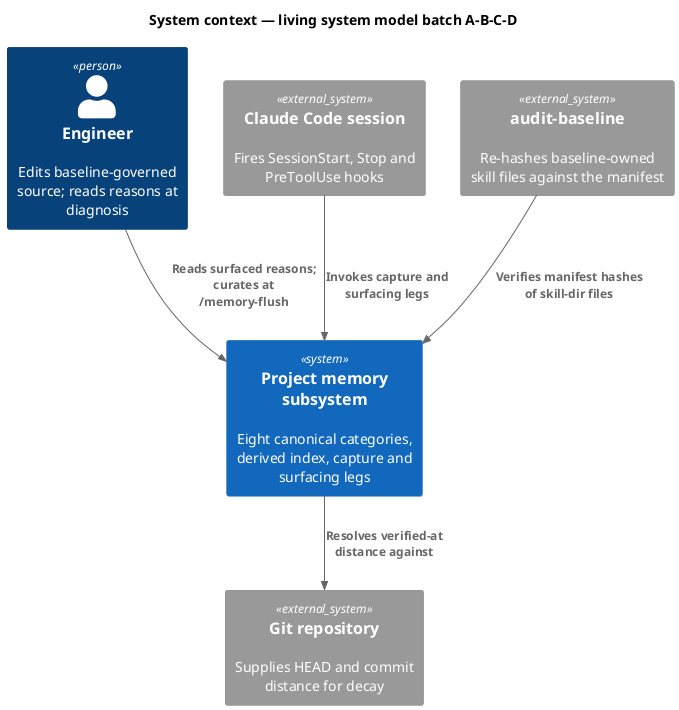
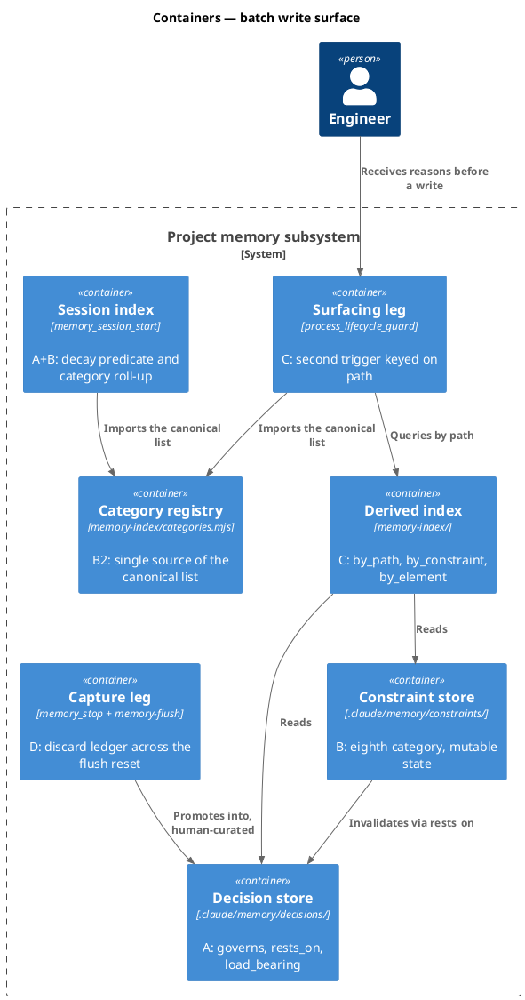
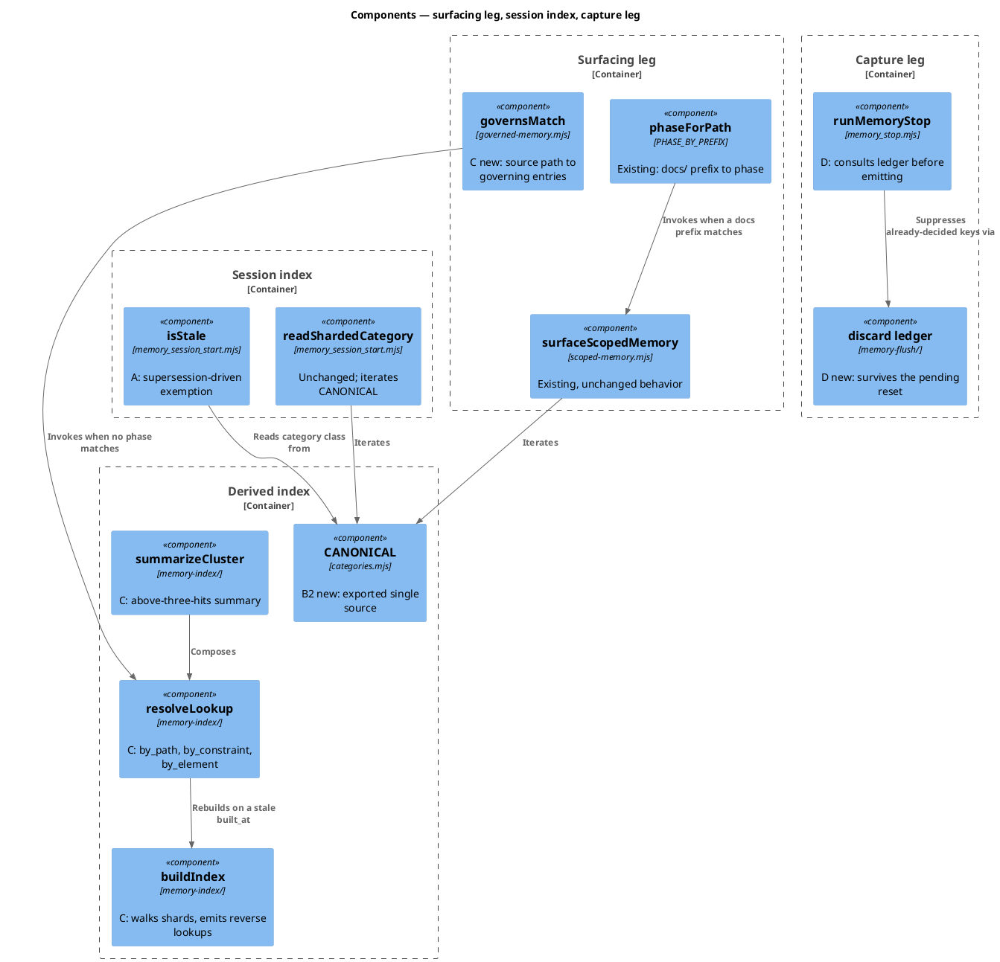
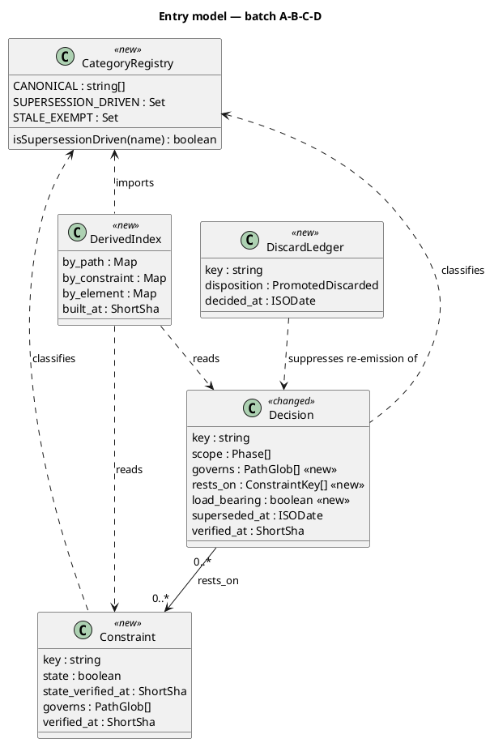
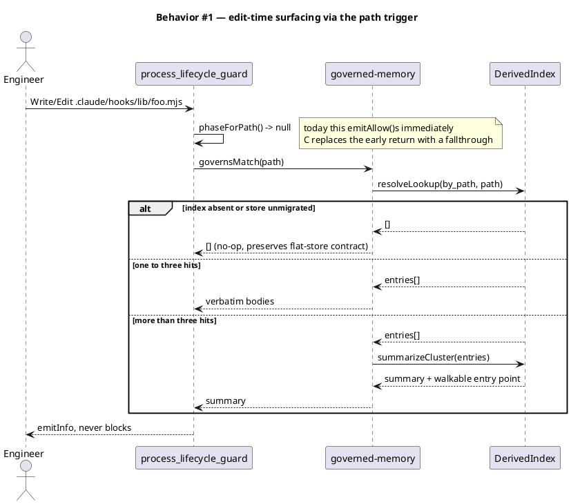
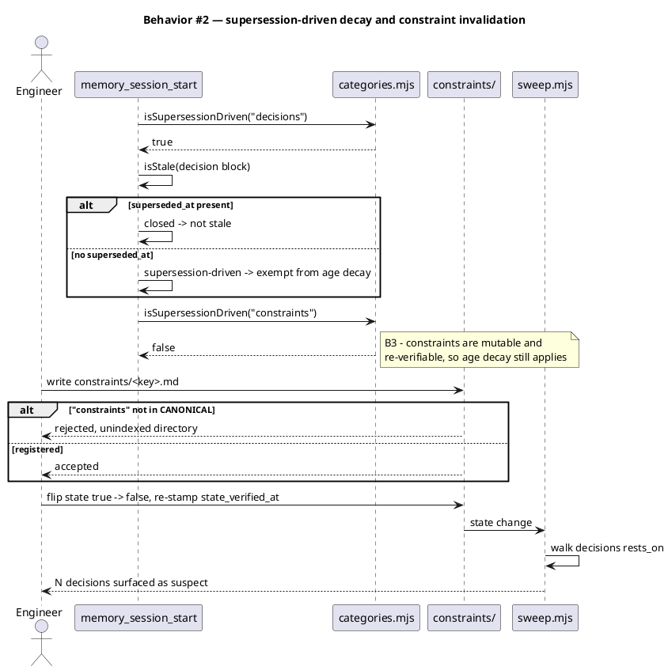
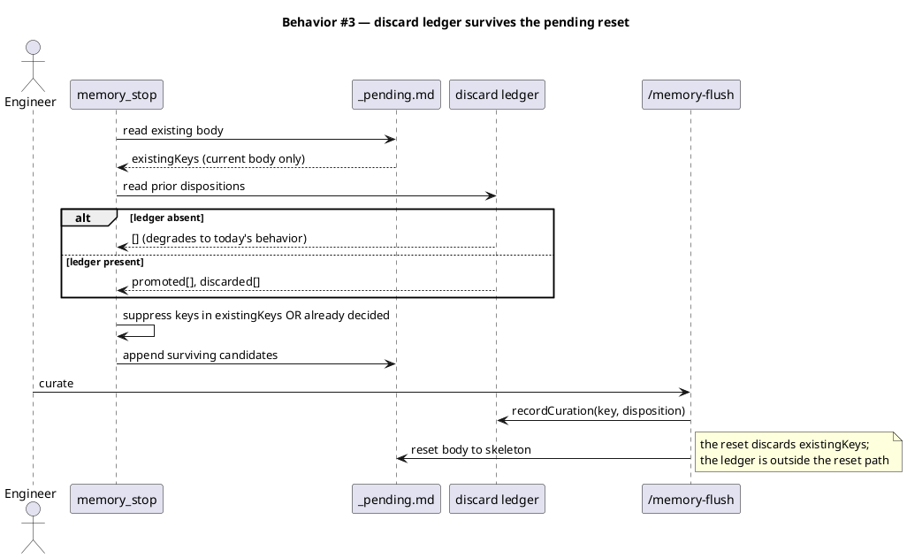
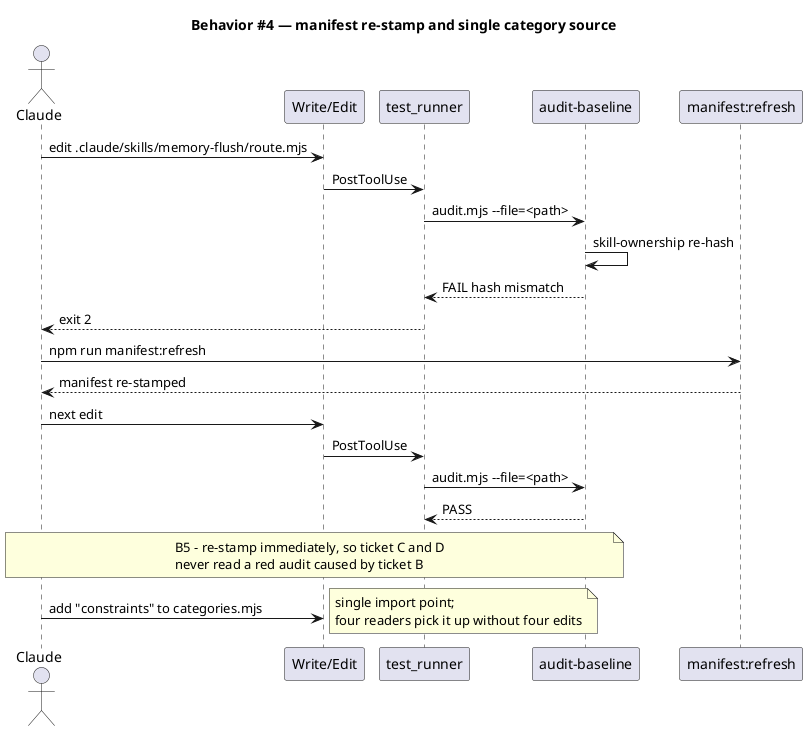
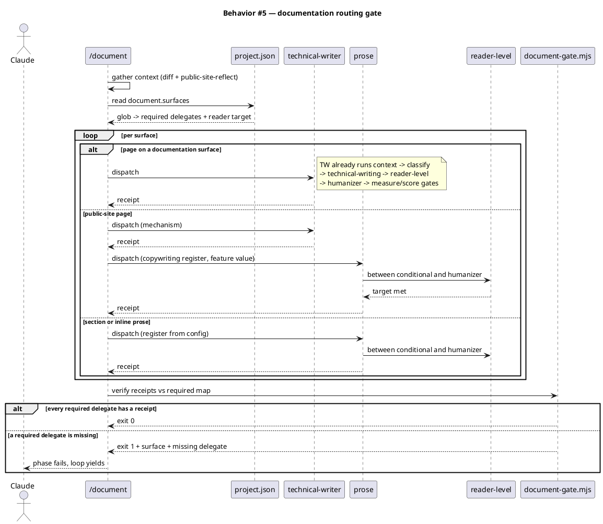
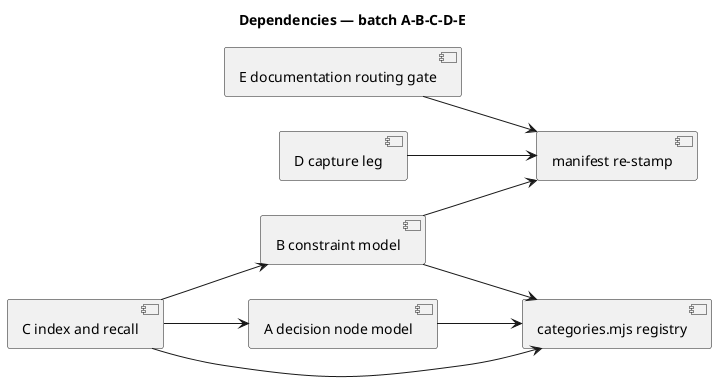

# Spec — living system model, batch A·B·C·D

<!--
Power batch-sprint spec (track_id `power`). One `## Ticket <id>` per entry in
.claude/state/workflow.json → tickets[]. Behavior is inherited from the approved
epic spec docs/specs/living-system-model.md (#slice-a .. #slice-d); this spec adds
the intra-batch ordering, the shared-write-surface resolution, and the batch
integrity criteria that four separate epic-child cycles would not have needed.
-->

## Context

| Input | Path |
|---|---|
| Epic spec *(approved, upstream)* | `docs/specs/living-system-model.md` |
| Epic intake | `docs/intake/living-system-model.md` |
| Epic scout | `docs/scout/living-system-model.md` |
| Epic research | `docs/research/living-system-model.md` |
| Epic state *(slices, risk flags)* | `.claude/state/epic/living-system-model.json` |
| Batch ticket set | `.claude/state/workflow.json → tickets[]` |

**Write set**: `.claude/hooks/lib/memory_session_start.mjs`, `.claude/hooks/lib/scoped-memory.mjs`, `.claude/hooks/lib/memory_stop.mjs`, `.claude/hooks/lib/governed-memory.mjs`, `.claude/hooks/process_lifecycle_guard.mjs`, `.claude/skills/memory-index/**`, `.claude/skills/memory-flush/**`, `.claude/skills/audit-baseline/**`, `.claude/skills/document/**`, `.claude/skills/prose/SKILL.md`, `.claude/project.json`, `.claude/memory/constraints/**`, `.claude/memory/README.md`, `tests/**`, `obj/template/.claude/manifest.json` — intersects `security.sensitive_globs` (`.claude/hooks/**`), so the full C4 diagram set applies.

One further file is touched and deliberately **not** listed above: `site-src/_data/memorynotes.json` (surface 9 below). It is a three-string data entry — `owner`, `holds`, `key` — describing the new category on the docs-site Memory page. `project.json → tdd.ui_globs` matches all of `site-src/**`, so listing it would trip `spec_design_calls_guard` and demand a `## Design calls` row with a Reference target and Quality criteria. There is no design surface here to score, and inventing a rubric row to satisfy a glob would be a false entry in a section whose whole purpose is to be checkable. Recorded here instead, in the open. Register for this edit is **copy**, not design (CLAUDE.md XI.1), and the narrowness of `ui_globs` for `_data/*.json` is a separate question this batch does not settle.

The epic spec owns *what each slice does*. This spec exists because four slices are landing in **one tree, one integrate, one commit split** instead of four sequential `epic-child` cycles. That collapses three problems into this document:

- Tickets A and B edit the same file; A, B and C edit the same schema doc.
- C reads frontmatter fields that A and B introduce, so its tests cannot pass before theirs.
- B and D both edit a **baseline-owned, hash-checked** skill directory, which breaks the audit for every ticket that follows until the manifest is re-stamped.

### Canonical-list surfaces

Registering an eighth category touches **nine** surfaces, not the four a first reading suggests. Seven fail *silently* — the reader keeps a correct-looking 7-item literal and simply returns nothing for the new category, with no error anywhere. Two fail *hard*, which is the only reason the true count was discoverable at all.

| # | Surface | Failure mode if missed |
|---|---|---|
| 1 | `.claude/hooks/lib/memory_session_start.mjs` | silent — category absent from the index and the decay sweep |
| 2 | `.claude/hooks/lib/scoped-memory.mjs` | silent — phase-scoped surfacing returns `[]` for the category |
| 3 | `.claude/skills/memory-index/lift-fields.mjs` | silent — the stranded-field census skips the category |
| 4 | `.claude/skills/memory-index/build-index.mjs` | silent — category never indexed |
| 5 | `.claude/skills/memory-index/migrate.mjs` | silent — category not migrated or backfilled |
| 6 | `.claude/skills/audit-baseline/checks/memory.mjs` | silent — the shape check never asserts the category |
| 7 | `tests/helpers/memory-fixtures.mjs` | silent — every fixture in the suite skips the category's shards |
| 8 | `.claude/skills/audit-baseline/memory-shape.mjs` | **hard** — gates on `categories === CANONICAL.length`, so a correctly-registered store reads as an audit FAIL |
| 9 | `site-src/_data/memorynotes.json` | **hard** — the docs-site build throws `memorynotes.json out of sync with the audit's CANONICAL list` and renders nothing |

Surfaces 8 and 9 fall outside the write set a naive reading of ticket B produces, and neither is skippable. They are the concrete argument for B2: nine literals is not a style problem, it is nine chances to ship a half-registered category — and seven of those chances are silent.

## Goal

Land tickets A, B, C and D — decision node model, constraint model, index and recall layer, capture leg — as one ordered batch whose per-ticket security judgment is preserved and whose shared write surfaces are resolved by construction rather than by merge.

## Non-goals

- Slices **E** (workspace structural corpus) and **F** (tracking comments) are out. Their upstream criteria are deferred, not dropped — recorded here rather than in this spec's criteria table, because this spec does not commit to them and an AC row would claim otherwise:

| Upstream AC | Scope | Deferral |
|---|---|---|
| epic AC-008 | Slice E — scout reconciles a durable workspace corpus rather than re-deriving it | `deferred: human-directed` — excluded from the confirmed ticket set. E is flagged OVERSIZED in the epic state and still carries three of the epic's four open questions. Remains committed and open in `docs/specs/living-system-model.md`. |
| epic AC-009 | Slice F — code annotations naming a decision, constraint or research doc resolve under scout | `deferred: dependency` — F gates annotation placement on the `load_bearing:` marker that AC-003 introduces **in this batch**. It becomes buildable once ticket A lands, not before. |
- No re-litigation of the epic's design decisions D1–D8. They were approved at the epic's gate A and are inherited verbatim.
- No epic close. `epic_close.mjs` fires only on an `epic-child` track (`commit/SKILL.md` Step 2.8); this batch leaves `living-system-model` open, which is correct while E and F remain.
- No new hook. Edit-time surfacing extends `process_lifecycle_guard` (epic non-goal, still binding).
- No new dependency. Zero-dep `.mjs` on Node builtins only.
- No relocation of the seven existing categories.

## Decisions

Batch-level engineering calls made in main context and recorded for gate-A review (CLAUDE.md XI.12). These are additive to the epic's D1–D8, which stand unchanged.

| # | Decision | Rationale | Owner |
|---|---|---|---|
| B1 | Implementation order is **A → B → C**, with **D free-floating**. | C's index reads `governs:`/`load_bearing:` (A) and constraint keys (B), so its tests cannot go green before both land. D touches only the capture leg and reads no index — it has no edge to A, B or C. | Claude |
| B2 | The canonical category list becomes a **single exported source** at `.claude/skills/memory-index/categories.mjs`; all **nine** current surfaces read from it. | The list is hardcoded in nine places today (enumerated under §Canonical-list surfaces). Registering an eighth category in one and missing eight is a silent-miss defect, not a hypothetical — `scoped-memory.mjs` would keep returning `[]` for every constraint, and two of the nine fail *hard* instead. Article VI.4 abstracts at the third concrete use; this is the ninth, and the need is present, not anticipated. | Claude |
| B3 | `constraints` is registered in `CANONICAL` but **excluded** from the supersession-driven decay exemption A introduces. | A constraint is mutable and re-verifiable — `state_verified_at:` is exactly the thing that must be re-checked, so age decay is the correct pressure on it. A decision is immutable and superseded, so age decay is wrong for it. Same file, opposite treatment; conflating them would silence the one signal constraints depend on. | Claude |
| B4 | A introduces a **separate named constant** for supersession-driven decay rather than widening `STALE_EXEMPT_FILES`. | `backlog` is exempt because intent does not verify against code. `decisions` would be exempt because expiry is supersession-driven. Two different reasons; one shared set would erase both at the next reader. | Claude |
| B5 | `npm run manifest:refresh` runs **immediately after each edit** under a baseline-owned skill dir, not once at the end of the batch. | `test.cmd` runs the full audit on every `.claude/**` write, and `skill-ownership.mjs:30-37` hash-checks every file under a baseline-owned skill. A deferred re-stamp leaves every subsequent ticket reading a red audit caused by an earlier ticket — the batch would lose its test signal exactly where it is most needed. | Claude |
| B6 | `categories.mjs` lands in `.claude/skills/memory-index/`, which has **no `SKILL.md`**. | memory-index is already the storage-shape module and is already imported by `hooks/lib/scoped-memory.mjs`. It carries no `owner: baseline` frontmatter, so it is outside the hash-drift check (Article XII.5) — the shared module adds no recurring manifest churn to the batch. | Claude |
| B7 | The `.claude/memory/README.md` schema edit is **one combined write at the end**, not three interleaved ones. | The README documents the resulting schema, not the intermediate states. Three interleaved edits produce two transiently-wrong versions of a document that `/memory-flush` and every future contributor read as authoritative. | Claude |

## Design

Diagrams are the contract. Prose covers only what a diagram cannot say.

### C4 — System context



### C4 — Container



### C4 — Component (changed containers only)



### Data model — class diagram



#### Migration — frontmatter fields

There is no database. The equivalent forward/reverse migration is frontmatter-level and mechanical.

```text
# forward
decisions/*.md   + governs: []          (optional, absent reads as "governs nothing")
decisions/*.md   + rests_on: []         (optional, absent reads as "rests on nothing")
decisions/*.md   + load_bearing: false  (optional, absent reads as incidental)
constraints/     + new shard directory, registered in categories.mjs CANONICAL
<all categories> + scope: any           (backfill for migrated facts carrying no scope:)

# reverse
rm -r .claude/memory/constraints/
categories.mjs CANONICAL reverts by one entry
governs:/rests_on:/load_bearing: are optional -> absent reads as today
.claude/skills/memory-index/migrate.mjs --reverse   (store-shape rollback, unchanged)
```

Every added field is optional and absent-reads-as-today, so the batch is additive and each ticket is independently revertible.

### Behavior — sequence per AC

Covers **AC-001, AC-005, AC-007, AC-011** — path-triggered surfacing and lookup (ticket C):



Covers **AC-002, AC-003, AC-004, AC-010** — decay, load-bearing, invalidation, category registration (tickets A and B):



Covers **AC-006, AC-012** — capture idempotence across the flush boundary (ticket D):



Covers **AC-013, AC-014** — batch integrity (this spec's own contribution):



Covers **AC-015, AC-016, AC-017, AC-018** — documentation routing made mechanical (ticket E):



### Dependencies — graph



Edge `A --> B` reads "A depends on B". Acyclic, depth 2. **D has no edge to A, B or C** — its only shared concern is the manifest re-stamp it inherits from editing `memory-flush/`. Build order is A → B → C; D may land at any point.

### Contracts

| Kind | Name | Input | Output | Errors | Idempotent |
|---|---|---|---|---|---|
| Module | `CANONICAL` (categories.mjs) | — | `string[]`, 8 entries | — | yes (frozen) |
| Function | `isSupersessionDriven(name)` | category name | `boolean` | never throws; unknown name → `false` | yes |
| Function | `surfaceGovernedMemory(filePath, {rootDir})` | source path | `Hit[]` | never throws; `[]` on unmigrated store, empty index, or read error | yes |
| Function | `resolveLookup(kind, key)` | `by_path` \| `by_constraint` \| `by_element` | `Entry[]` | never throws; rebuilds on stale `built_at` | yes |
| Function | `summarizeCluster(entries)` | `Entry[]` | `{summary, entryPoint}` | never throws | yes |
| Function | `recordCuration({key, disposition})` | key + `promoted`\|`discarded` | `void` | never throws; append-only | yes, per `key` |
| Function | `readLedger({rootDir})` | — | `{promoted[], discarded[]}` | never throws; `{[],[]}` when absent | yes |
| File | `constraints/<key>.md → state:` | boolean + `state_verified_at:` | — | write rejected when category unregistered | — |

Every new surfacing and capture entry point is **advisory and fail-open**, matching the existing memory-hook contract (`scoped-memory.mjs:62-63` returns `[]` on falsy input; `process_lifecycle_guard` never blocks).

### Libraries and versions

No new dependencies. `package.json → dependencies` stays `["@clack/prompts"]`; all new code is zero-dep `.mjs` on Node builtins, `engines: {"node": ">=18.17.0"}`.

| Library@version | Purpose | Key APIs | Confirmed against current docs |
|---|---|---|---|
| Node builtins (`>=18.17.0`) | fs, path, crypto, child_process | `readFileSync`, `readdirSync`, `join`, `createHash`, `spawnSync` | yes — already in use across the write set |

External semantics adopted without dependency (inherited from the epic spec, re-verified there against current docs): `workspace extends` and `!adrs` from Structurizr; `Superseded by` from MADR. No API surface from either is called.

### Alternatives considered

| Alt | Summary | Rejected because |
|---|---|---|
| Four sequential `epic-child` cycles | The epic spec's own rollout | Re-touches the same four files across four cycles, re-pays four commit-consent gates, and hits the manifest hash-drift trap four times instead of once. Human-directed to batch. |
| Add `constraints` only to `memory_session_start.mjs` CANONICAL | Minimal edit, matches the epic slice's stated write surface | Three other readers keep a 7-entry list; `scoped-memory.mjs` silently returns `[]` for every constraint. This is the defect B2 exists to prevent. |
| Widen `STALE_EXEMPT_FILES` to include `decisions` | One-line change, satisfies AC-002 | Erases why each category is exempt. `backlog` is exempt because intent does not verify against code; `decisions` because expiry is supersession-driven (B4). |
| Re-stamp the manifest once at the end of the batch | Fewer build invocations | Every ticket after the first `memory-flush/` edit reads a red audit it did not cause (B5). |
| Put `categories.mjs` in `.claude/hooks/lib/` | Closer to `memory_session_start.mjs` | `hooks/lib` is imported by skills but is not the storage-shape module; memory-index already is, and is already imported by `scoped-memory.mjs` (B6). |
| Land E and F in the same batch | One cycle for the whole epic | E carries three unresolved open questions and is flagged OVERSIZED in the epic state; F depends on A's `load_bearing:` marker, introduced only in this batch. |

## Design calls

*(none)* — the write set does not intersect `project.json → tdd.ui_globs`; this work has no UI surface.

## Ticket A — Decision node model

**Behavior.** Decision entries gain `governs:` (path globs, epic D5), `rests_on:` (constraint keys) and `load_bearing:` (boolean). `isStale` at `memory_session_start.mjs:109-124` consults the new supersession-driven class instead of applying one age predicate uniformly. `superseded_at:` already exists end to end and is reused, not re-invented.

**ACs**: AC-002, AC-003. **Risk**: `simplify`, `document`.

**Write surface**: `.claude/hooks/lib/memory_session_start.mjs`, `.claude/skills/memory-index/categories.mjs` (created here, consumed by B and C), `tests/memory-session-start-head-decay.test.mjs`.

**Ordering**: first. B and C both import `categories.mjs`.

## Ticket B — Constraint model

**Behavior.** Eighth canonical category at `.claude/memory/constraints/` (epic D2), each entry carrying `state:`, `state_verified_at:` and `governs:`. Registration lands in `categories.mjs` and propagates to all four readers by import. `route.mjs:20-27` gains a `constraint` classification bucket. A state flip walks `rests_on` and surfaces every dependent decision as suspect.

**ACs**: AC-004, AC-010, AC-014. **Risk**: `simplify`, `document`. Satisfies rollout prerequisite **P1**.

**Write surface**: `.claude/memory/constraints/` (new), `.claude/skills/memory-index/categories.mjs`, `.claude/hooks/lib/memory_session_start.mjs`, `.claude/hooks/lib/scoped-memory.mjs`, `.claude/skills/audit-baseline/checks/memory.mjs`, `.claude/skills/memory-index/migrate.mjs`, `.claude/skills/memory-flush/route.mjs`, new tests.

**Ordering**: second. First ticket to edit a hash-checked skill dir — **re-stamp the manifest before ticket C begins** (B5).

## Ticket C — Index and recall layer

**Behavior.** A derived index (epic D8) regenerated from shards, exposing `by_path`, `by_constraint`, `by_element`. A second surfacing trigger keyed on path (epic D3) extends `process_lifecycle_guard` — the early `emitAllow()` at `:49` becomes a fallthrough to `governsMatch`, so no 27th hook is added. Migrated facts backfill to `scope: any` (epic D7). Above three hits a summary plus walkable entry point replaces verbatim bodies, matching the existing `VERBATIM_LIMIT = 3` idiom at `process_lifecycle_guard.mjs:56`.

**ACs**: AC-001, AC-005, AC-007, AC-011. **Risk**: `security`, `simplify`, `document`. Satisfies rollout prerequisite **P2**.

**Write surface**: `.claude/hooks/process_lifecycle_guard.mjs`, `.claude/hooks/lib/governed-memory.mjs` (new), `.claude/skills/memory-index/` (build, resolve, summarize), `tests/memory-scoped-surface.test.mjs`.

**Ordering**: third — reads A's `governs:` and B's constraint keys.

**Security reason**: modifies `.claude/hooks/**`, a `security.sensitive_globs` path. Reviewed per ticket.

## Ticket D — Capture leg

**Behavior.** A discard ledger persists curation dispositions across the `/memory-flush` reset boundary. `memory_stop.mjs:262-274,373` already dedupes against the *current* `_pending.md` body and is guarded by `tests/memory-stop-dedup.test.mjs` — this ticket **extends that lifetime**, it does not add a second dedup. Extraction discipline is governed by `faithful-capture`'s ADR leg: a fork must be quotable, and absence is not a decision.

**ACs**: AC-006, AC-012. **Risk**: `security`, `simplify`, `document`. Satisfies rollout prerequisite **P3**.

**Write surface**: `.claude/hooks/lib/memory_stop.mjs`, `.claude/skills/memory-flush/` (ledger actuator), `tests/memory-stop-dedup.test.mjs`.

**Ordering**: free — no dependency on A, B or C. Shares the manifest re-stamp obligation with B.

**Security reason**: modifies `.claude/hooks/**`, a `security.sensitive_globs` path. Reviewed per ticket.

## Ticket E — Documentation routing gate

**Why this is in a memory-model batch.** It is not memory work. It was added mid-cycle after `/document` (Phase 10 of this very workflow) routed a rewritten public-site paragraph to the `documentation` style guide instead of `technical-writer`, and skipped the two-register rule that CLAUDE.md XI.1 and backlog `7b3e` require for public pages. The routing rule exists, in prose, in `document/SKILL.md`. Prose in a SKILL.md is what a model under load skips. The batch that discovered the hole fixes it.

**Behavior.** `document` stays an orchestrator; the writing pipelines are not inlined. Three changes make its routing mechanical instead of advisory, and close one gap in the prose path.

1. **Config-driven surface map.** `project.json → document.surfaces` maps a glob to the delegates a surface requires, plus its reader-level target. Routing stops being a judgment call restated per run.
2. **Receipts + gate.** Each delegate writes a receipt to `.claude/state/document/<slug>.json`. `document-gate.mjs` recomputes the required map from the diff and exits 1 when a required delegate left no receipt. Same enforcement class as `drift_check.mjs` and `rightsize-gate.mjs` — an exit code, not a sentence.
3. **`prose` gains reader-level.** `prose` runs `draft → conditional → humanizer` today and never invokes `reader-level` (0 references, against 8 in `technical-writer`). Every README section, inline doc and site paragraph on the prose path therefore ships with no reading-level check. The pass is inserted **between the conditional skill and humanizer** — never after. `technical-writer` Step 4 states the reason: simplifying after de-slopping reintroduces phrasing the de-slop pass already removed, so it has to run twice and the second run flattens the prose.

**Explicitly NOT done here**, and why:

- **No `document-chain` sub-track.** The `tdd-worker-chain` precedent is a one-node declarative shim whose real per-tick seeding lives in `tdd/SKILL.md` prose; copying it would reproduce the failure mode this ticket fixes. It also inherits a recorded live defect: `pickDefaultAlternate` selects the first alternate with empty preconditions, so the swarm alternate is unreachable at runtime (`.claude/state/drift/workflow-extension-via-workflows-json.md` SP-014).
- **`prose` is not absorbed into `document`.** It is the only path to the `copywriting` register; `technical-writer` has no persuasive mode. A public page needs both, which is exactly the two-register rule.
- **No seed.md amendment.** No track is added and no Article changes, so the §18 track inventory stays at 11. `workflows.jsonl` is untouched.

**ACs**: AC-015, AC-016, AC-017, AC-018. **Risk**: `simplify`, `document`.

**Write surface**: `.claude/skills/document/SKILL.md`, `.claude/skills/document/document-gate.mjs` (new), `.claude/skills/prose/SKILL.md`, `.claude/project.json`, `.claude/state/document/` (new), `tests/document-routing-gate.test.mjs` (new).

**Ordering**: last. Independent of A–D; shares only the manifest re-stamp obligation, since `document/` and `prose/` are both baseline-owned skill directories.

## Acceptance criteria

Numbered, testable, traced. `Kind` tags enforcement ACs (`preflight`) that Rollout prerequisites bind to via `enforced-by`; every other AC is `behavior`. Upstream IDs refer to the approved epic spec's AC table.

| ID | Criterion (given / when / then) | Kind | Upstream AC | Sequence | Ticket |
|---|---|---|---|---|---|
| AC-001 | Given a decision record whose `governs:` matches a source path, when an engineer edits that path, then the decision surfaces before the edit completes. | behavior | epic AC-001 | §Behavior #1 | C |
| AC-002 | Given a decision entry older than 30 commits with no `superseded_at`, when the staleness predicate runs, then the entry is not reported stale. | behavior | epic AC-002 | §Behavior #2 | A |
| AC-003 | Given a decision record, when it is read, then it states whether the shape it describes is load-bearing or incidental. | behavior | epic AC-003 | §Behavior #2 | A |
| AC-004 | Given a decision whose `rests_on` names a constraint, when that constraint's `state` flips, then the decision is surfaced as suspect. | behavior | epic AC-004 | §Behavior #2 | B |
| AC-005 | Given a structural lookup (`by_element`, `by_path`), when it resolves, then it returns matches without justification semantics. | behavior | epic AC-005 | §Behavior #1 | C |
| AC-006 | Given a candidate promoted or discarded at one `/memory-flush`, when the next turn's capture runs, then that candidate is not re-emitted as fresh. | behavior | epic AC-006 | §Behavior #3 | D |
| AC-007 | Given more than three related decisions matching one lookup, when they surface, then a summary is emitted with a walkable entry point rather than every body. | behavior | epic AC-007 | §Behavior #1 | C |
| AC-010 | Given `constraints` is not yet registered in `CANONICAL`, when a constraint entry write is attempted, then it is rejected rather than written to an unindexed directory. | preflight | epic AC-010 | §Behavior #2 | B |
| AC-011 | Given migrated facts still carrying no `scope:`, when the path trigger is enabled, then the `scope: any` backfill has already run, so no fact is unreachable. | preflight | epic AC-011 | §Behavior #1 | C |
| AC-012 | Given no discard ledger exists yet, when `memory_stop` consults it, then it degrades to current behavior without error. | preflight | epic AC-012 | §Behavior #3 | D |
| AC-013 | Given an edit has landed under a baseline-owned skill directory, when the next phase reads a test verdict, then `audit-baseline` reports no `hash mismatch` — the manifest was re-stamped first. | preflight | batch-local (B5) | §Behavior #4 | batch |
| AC-014 | Given `constraints` is registered once in `categories.mjs`, when each of the nine canonical-list surfaces runs, then all nine observe eight categories with no per-surface literal — including the two that fail hard rather than silently (`memory-shape.mjs`'s count equality and the site's `memorynotes.json` sync gate). | behavior | batch-local (scout risk) | §Behavior #4 | B |
| AC-015 | Given a diff touching a surface listed in `project.json → document.surfaces`, when `/document` classifies it, then the required delegates are read from that config rather than decided per run. | behavior | batch-local (this cycle's `/document` miss) | §Behavior #5 | E |
| AC-016 | Given a required delegate left no receipt in `.claude/state/document/<slug>.json`, when `document-gate.mjs` runs, then it exits 1 and names the surface and the missing delegate. | preflight | batch-local | §Behavior #5 | E |
| AC-017 | Given a public-site page in the diff, when `/document` classifies it, then it requires BOTH `technical-writer` and `prose` with the `copywriting` register, so mechanism and feature value are separate obligations. | behavior | CLAUDE.md XI.1 + backlog 7b3e | §Behavior #5 | E |
| AC-018 | Given `prose` produces a draft, when it completes, then `reader-level` has run between the conditional skill and `humanizer` — in that order, never after. | behavior | batch-local (prose has 0 reader-level refs) | §Behavior #5 | E |

## Test plan

Scenarios by category. Every row references at least one AC or the invariant a regression row defends.

| Category | Scenario | Expected | Covers |
|---|---|---|---|
| Golden path | Decision shard with `governs: ['.claude/hooks/**']`; Edit to `.claude/hooks/lib/foo.mjs` | Entry surfaced via `emitInfo` before the write | AC-001 |
| Golden path | Decision 40 commits old, no `superseded_at` | Not counted stale in the session index | AC-002 |
| Golden path | Decision shard read | `load_bearing:` present and boolean | AC-003 |
| Golden path | Constraint `state: true → false` with two decisions naming it in `rests_on` | Both decisions reported suspect | AC-004 |
| Golden path | `resolveLookup('by_path', p)` and `resolveLookup('by_element', e)` | Matches returned; no justification fields in the result | AC-005 |
| Golden path | Candidate discarded at flush; next turn's `memory_stop` | Candidate absent from `_pending.md` | AC-006 |
| Input boundary | Lookup returning exactly 3, then exactly 4 entries | 3 → verbatim bodies; 4 → summary + walkable entry point | AC-007 |
| Input boundary | Decision with `governs: []` and with `governs:` absent | Both treated as governing nothing; no surfacing | AC-001 |
| Input boundary | Empty `constraints/` directory | Registered category, zero entries, no error in the index | AC-010, AC-014 |
| Contract violation | Constraint write attempted with `constraints` absent from `CANONICAL` | Rejected; nothing written to an unindexed directory | AC-010 |
| Contract violation | `resolveLookup('by_bogus', k)` | Returns `[]`; never throws | AC-005 |
| Failure mode | Unmigrated flat store; path trigger fires | `surfaceGovernedMemory` returns `[]`; guard emits allow | AC-001, AC-011 |
| Failure mode | Discard ledger file absent | `readLedger` returns `{promoted:[],discarded:[]}`; capture unchanged | AC-012 |
| Failure mode | Index `built_at` stale relative to HEAD | Index rebuilt on read, not served stale | AC-005 |
| Failure mode | Corrupt shard frontmatter inside a governed category | Skipped, not fatal; remaining entries still surface | AC-001 |
| Concurrency / ordering | Ticket B lands, then ticket C's tests run before `manifest:refresh` | Audit FAILs on `hash mismatch` — the condition AC-013 forbids reaching the next phase | AC-013 |
| Regression trap | `tests/memory-stop-dedup.test.mjs` cross-invocation dedup | Unchanged — ledger extends lifetime, adds no second dedup | AC-006 |
| Regression trap | `tests/memory-scoped-surface.test.mjs` phase-scoped surfacing | Unchanged — `scope:` keeps meaning workflow phases | AC-001 |
| Regression trap | Migrated facts with no `scope:` after backfill | Reachable as `scope: any`; none unreachable | AC-011 |
| Regression trap | Constraint entry 40 commits old | **Reported stale** — constraints keep age decay (B3) | AC-002 |
| Regression trap | `backlog` category decay | Unchanged — still exempt for its own reason (B4) | AC-002 |

## Observability

| Signal | Name | Shape | Purpose |
|---|---|---|---|
| Log | `process_lifecycle_guard` path-trigger line | `surfaced N governed entr(y\|ies) for <path>` via `logLine` | Confirms the path trigger fires; distinguishes it from the phase trigger |
| Log | `memory_stop` ledger suppression | `suppressed N already-decided candidate(s)` to stderr | Shows the ledger is doing work rather than silently no-opping |
| Index | Session-start stale table | Existing per-category `stale` column | The 173-entry stale reading is the observable AC-002 moves |
| Exit code | `audit-baseline` | `0` PASS / `1` FAIL with `hash mismatch at <path>` | The AC-013 signal |

The memory subsystem has no metrics or alarm surface — it is a local, file-backed, advisory system with no runtime service. Adding one would be speculation (Article VI.4).

## Rollout

### Prerequisites

| # | Prerequisite | enforced-by |
|---|---|---|
| P1 | Eighth category registered in `CANONICAL` — via `categories.mjs`, observed by all four readers — before any constraint entry is written | AC-010 |
| P2 | `scope: any` backfill applied before the path trigger goes live, so migrated facts are reachable | AC-011 |
| P3 | Discard ledger present, or its absence degrades cleanly, before `memory_stop` consults it | AC-012 |
| P4 | Manifest re-stamped after each edit under a baseline-owned skill directory, before the next ticket reads a test verdict | AC-013 |

- **Feature flag**: none. Every change is additive and absent-reads-as-today; a flag would gate behavior that is already inert without its data.
- **Order**: A → B (→ `manifest:refresh`) → C; D at any point (→ `manifest:refresh` after its `memory-flush/` edit).
- **Canary**: not applicable — local developer tooling, no deployment surface.

## Rollback

- **Kill-switch**: delete `.claude/memory/constraints/`, revert `categories.mjs` `CANONICAL` by one entry, and re-stamp the manifest. `governs:`/`rests_on:`/`load_bearing:` are optional fields that read as absent.
- **Per-ticket**: each ticket is a separate commit in the split, so `git revert` of any one is clean provided the order A → B → C is respected in reverse.
- **Signal to roll back**: `audit-baseline` exits `1`, or the session-start index reports a category count other than 8, or `tests/memory-stop-dedup.test.mjs` regresses.
- **Store-shape rollback** (unchanged): `.claude/skills/memory-index/migrate.mjs --reverse`.

## Archive plan

- Defaults *(automatic)*: this spec, the shippability + checker verdicts, the four per-ticket security reports (concatenated), and the spec approval token, into `docs/archive/<date>/living-system-model-abcd/`.
- Extras *(non-default)*:
  - *(none)* — the parent epic's discovery bundle (`docs/intake|scout|research/living-system-model.md` and `docs/specs/living-system-model.md`) **stays live**. Slices E and F still read it, and `epic_close.mjs` will move it when the last child lands.

## Open questions

- **`load_bearing:` has no oracle.** It is a human judgment recorded per decision. Whether Claude may set it unaided or it requires engineer confirmation is unresolved, and this batch introduces the field. Interim position: Claude sets it, and gate A review is the check — but this needs an explicit call before ticket F consumes it for annotation placement.
- **Index rebuild cost is unmeasured.** The corpus is 228 entries, so it is very likely negligible, but nothing has been measured. Measure during ticket C before choosing between build-on-demand and build-at-session-start.
- **Does the `scope: any` backfill belong to this batch or to the migration tooling?** P2 requires it before the path trigger goes live. Ticket C is where it is scheduled, but it mutates every existing shard, which is a wider blast radius than the rest of C. Split it into its own commit within the batch split.
