# Living system model E+F — workspace structural corpus and tracking comments

## Context

| Input | Path |
|---|---|
| Intake | *(inherited — epic discovery)* |
| BRD *(if any)* | *(none)* |
| Scout *(if any)* | `docs/scout/living-system-model.md` |
| Research *(if any)* | `docs/research/living-system-model.md` |
| Epic sliced spec | `docs/specs/living-system-model.md` (`#slice-e`, `#slice-f`) |
| Sprint proposal | `.claude/state/sprint/living-system-model-ef/proposal.json` |

**Write set**: `.claude/memory/workspace/**`, `.claude/skills/workspace/**`, `.claude/skills/scout/SKILL.md`, `.claude/skills/spec/SKILL.md`, `.claude/skills/spec/template.md`, `.claude/skills/code-structure/SKILL.md`, `.claude/project.json`, `tests/**`, `docs/references/annotations.md`

This batch is the tail of Epic 7. Slices A–D landed as `e7f00de..6464a58`; this spec covers the two
remaining slices. Slice E arrived flagged **OVERSIZED** at epic triage with a binding instruction —
*"Revisit at /spec; if it does not fit one child, split before approval"* — so §Ticket split below
executes that instruction, and §Decisions resolves the two open questions the epic deferred to this
cycle.

## Goal

A durable structural corpus at `.claude/memory/workspace/` that each cycle extends rather than
re-derives, reconciled by `scout` as a delta, plus code annotations that resolve to the decisions and
constraints governing the code they sit in.

## Non-goals

- **No Structurizr dependency.** The `workspace extends` *semantics* are borrowed; the Java tool is not.
  `plantuml_syntax_guard` is already advisory-by-default in this repo because there is no JVM, and the
  `zero-runtime-dependencies` constraint holds.
- **No replacement of the per-spec diagram set.** Specs keep drawing their own diagrams; the corpus is
  what they reference instead of re-deriving. `artifacts.required_diagrams.spec` is untouched.
- **No automatic conflict resolution.** Conflicts are detected and reported. Merging two contributors'
  intent is a human judgment.
- **No annotation backfill.** Annotations are placed as code is touched, gated on `load_bearing:`. A
  sweep that annotates the existing tree broadly is explicitly out of scope (it is the failure mode
  slice F exists to avoid).
- **No 27th hook.** Settled in research: extending an existing seam beats a new hook file.

## Ticket split

Slice E does not fit one implementable unit. It decomposes into three, which with slice F makes a
four-ticket batch:

| Ticket | Title | ACs | Why it is its own unit |
|---|---|---|---|
| E1 | Workspace store and element schema | AC-001, AC-002, AC-012 | The store has no existing surface to extend (scout §Risks). Schema + IO is Foundation; everything else composes it. |
| E2 | Contribution and merge semantics | AC-003, AC-004, AC-005 | The epic's undesigned open question. Independently testable against a fixture corpus with no scout involvement. |
| E3 | Scout reconciliation | AC-006, AC-007 | The only part that is literally upstream AC-008. Consumes E1+E2; changes a skill's method, not a store. |
| F | Tracking comments | AC-008, AC-009, AC-010, AC-011 | Independent of E — depends on slice A's `load_bearing:` and slice B's constraints, both landed. |

**Honest sizing note.** E1+E2+E3 is a substantial subsystem, and epic triage flagged E as a candidate
to promote to its own epic. It is being built here because the human confirmed the batch at triage
with the split scheduled for this phase. The size is surfaced rather than hidden: see §Open questions
for the one condition under which this should still be split into its own epic before implementation.

## Decisions

Load-bearing forks settled before implementation. Engineer verbatim is canonical where it appears.

| # | Decision | Rationale | Owner |
|---|---|---|---|
| D1 | **Element identity is a declared `id:`.** A contribution is a set of typed operations (`add` / `update` / `remove`) against ids, never a whole-file rewrite. | Makes `workspace extends` mechanical instead of textual. Two disjoint contributions touch disjoint ids and both survive with no merge logic at all — the common case costs nothing. | Claude |
| D2 | **Conflicts are REPORTED, never auto-resolved.** Two distinct ids sharing one `anchor:` is a `duplicate-anchor` conflict; an `update`/`remove` against an absent id is an `unknown-id` conflict. Both surface; neither is repaired. | Resolves the epic's *workspace merge semantics* open question. Matches the store's existing discipline — `assertSafeSlug`, `assertSafeFactKey`, `writeConstraint`'s `UnregisteredCategoryError` all reject rather than normalize. Auto-merging two contributors' structural intent is exactly the semantic conflict git already commits happily; doing it silently in our own format would not be an improvement. | Claude |
| D3 | **Diagram authority is split by question, and the split is written down.** `project.json → artifacts.required_diagrams.spec` is authoritative for *which diagram kinds a spec must contain* (the guard reads it). `.claude/skills/spec/template.md` is **non-authoritative** — skeletons and examples only, demoted explicitly in its own header. `.claude/memory/workspace/` is authoritative for *the system's structural model*. | Resolves the epic's *diagram authority* open question. Scout flagged a three-way drift; the actual finding is that the three locations answer three different questions and nobody had said so. Naming one "the" authority would force the other two to lie. The fix is the explicit demotion of `template.md`, which is the only one whose role was genuinely ambiguous. | Claude |
| D4 | **An element references decisions and constraints by key, never by copy.** | Slice A/B keys are already stable and re-verified; copying rationale into the corpus creates a second thing to keep true. Epic decision D4, inherited. | Claude |
| D5 | **`load_bearing:` requires engineer confirmation; Claude proposes, the engineer confirms.** Claude may propose `load_bearing: true` with cited rationale, but the marker does not stick until the engineer confirms. | Human-confirmed at triage. The marker gates where annotations land in source, so an unaided wrong call either scatters comments or hides the ones that matter. Keeping it conservative is slice F's whole design intent — annotations go where a maintainer would otherwise confidently break something, not broadly. | **engineer** |
| D6 | **The corpus is derived-checkable but authored, not generated.** No step infers elements from code. | Symmetric to epic decision D8 on the index: a derived index cannot drift because it re-reads its source, but a *guessed* model has no source to re-read. An element is a claim a human or a spec made, and it is re-verified like any other memory entry. | Claude |

## Design

Diagrams are the contract. Prose is only for what a diagram cannot say.

### C4 — System context

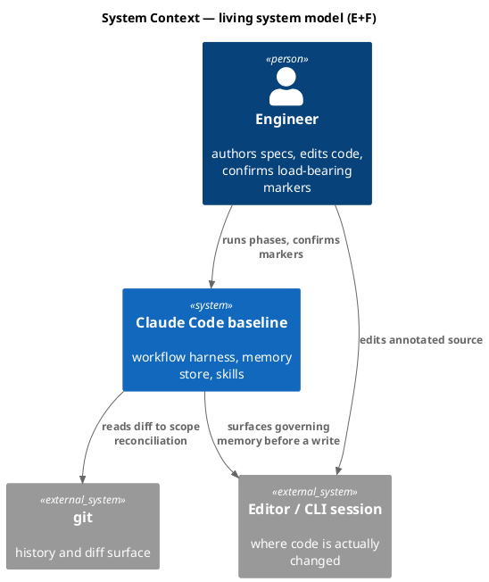

### C4 — Container

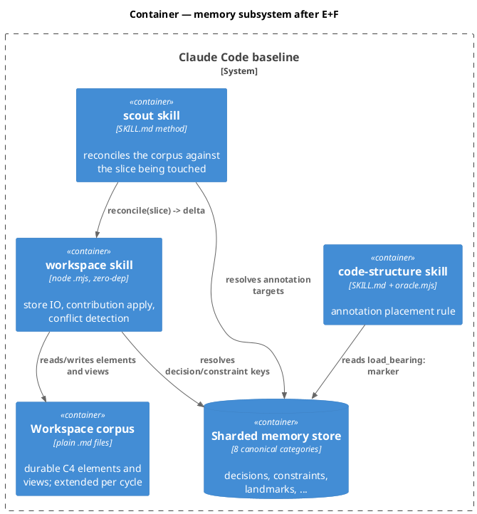

### C4 — Component (workspace skill)

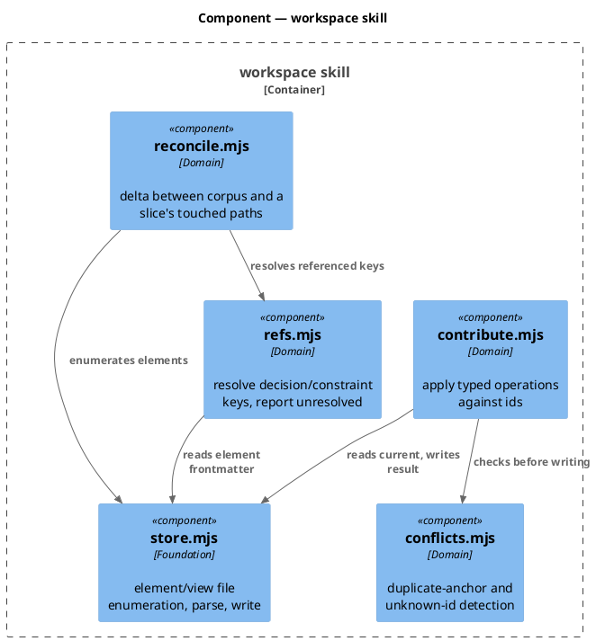

### Data model — class diagram

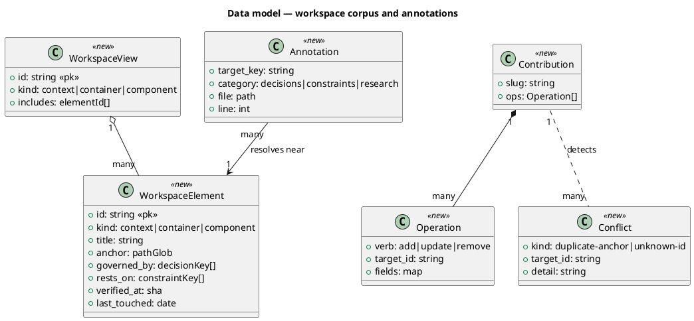

#### Migration — file layout, not DDL

There is no relational store; the migration is a directory shape.

```
# forward
.claude/memory/workspace/
  elements/<id>.md        # frontmatter: id, kind, title, anchor, governed_by, rests_on, verified-at
  views/<id>.md           # frontmatter: id, kind, includes
# reverse
rm -rf .claude/memory/workspace/   # flag off restores prior behavior; no other file references it
```

The directory is **not** a ninth memory category. `CANONICAL` in
`.claude/skills/memory-index/categories.mjs` is untouched, so no reader that walks canonical categories
sees it and the eighth-category invariant holds.

### Behavior — sequence per AC

#### §Behavior #1 — element write and key resolution (AC-001, AC-002, AC-012)

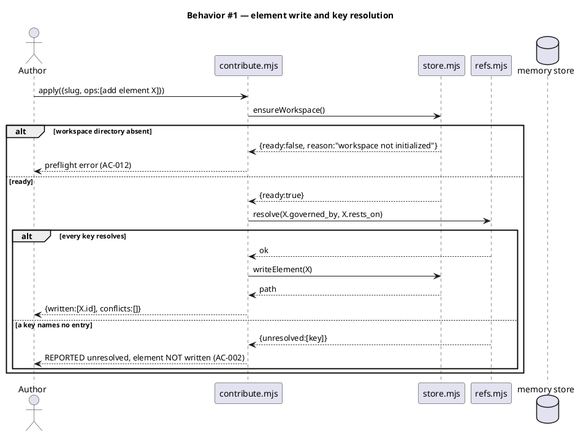

#### §Behavior #2 — two disjoint contributions both survive (AC-003)

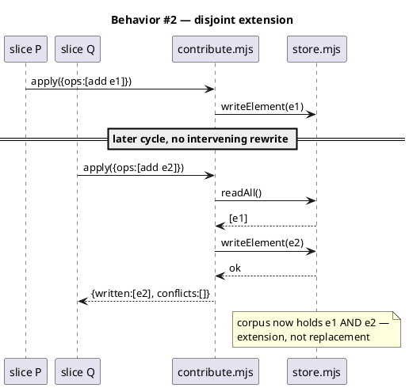

#### §Behavior #3 — conflict detection (AC-004, AC-005)

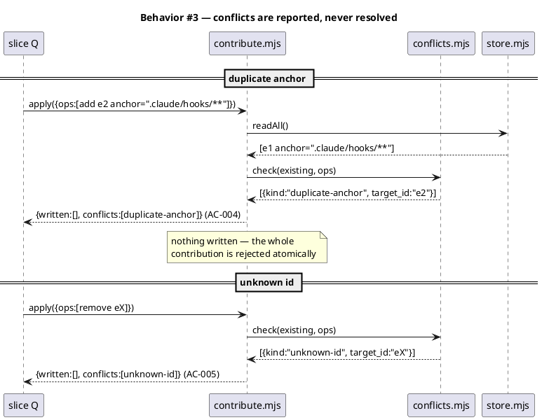

#### §Behavior #4 — scout reconciles as a delta (AC-006, AC-007)

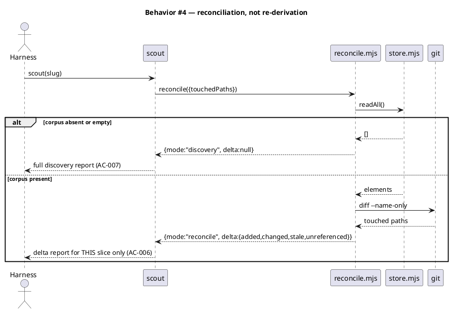

#### §Behavior #5 — annotation resolves (AC-008, AC-009)

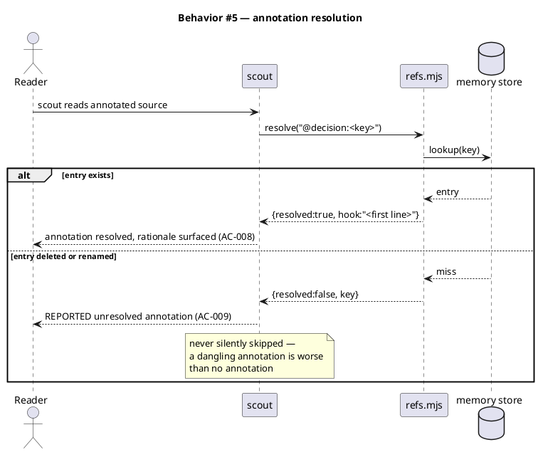

#### §Behavior #6 — placement gated on load_bearing (AC-010, AC-011)

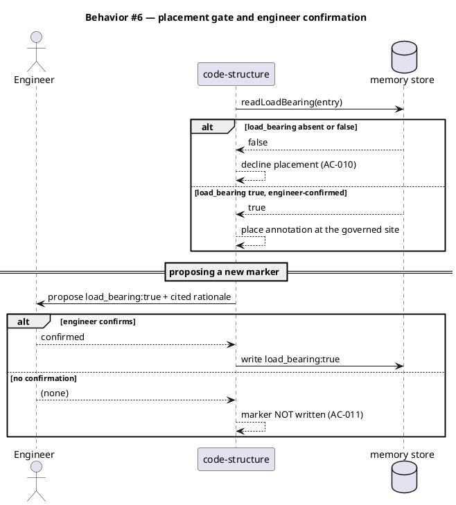

### State — corpus element

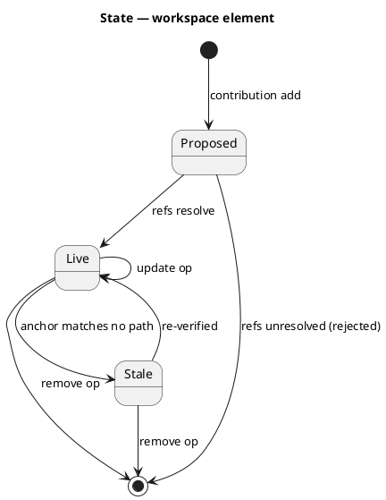

### Dependencies — graph

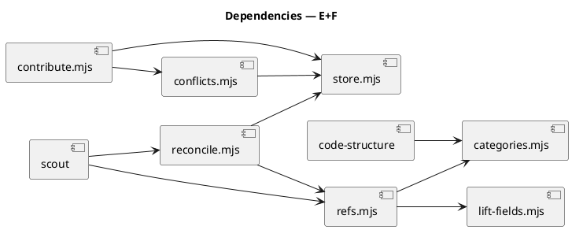

### Contracts

| Kind | Name | Input | Output | Errors | Idempotent |
|---|---|---|---|---|---|
| Node API | `readAll(memDir)` | `memDir` | `{elements[], views[]}` | none — absent dir → `{elements:[],views:[]}` | yes |
| Node API | `writeElement(memDir, element)` | element object | written path | throws on unsafe id (`assertSafeFactKey`) | yes (same content → same file) |
| Node API | `applyContribution({memDir, slug, ops})` | typed ops | `{written[], conflicts[]}` | throws on unsafe slug (`assertSafeSlug`) | yes — re-apply of an applied op is a no-op |
| Node API | `detectConflicts(existing, ops)` | corpus + ops | `Conflict[]` | none | yes (pure) |
| Node API | `reconcile({memDir, touchedPaths})` | path list | `{mode, delta}` | none — fail-open to `{mode:"discovery"}` | yes |
| Node API | `resolveAnnotation(memDir, ref)` | `@decision:<key>` | `{resolved, hook?}` | none — miss → `{resolved:false}` | yes |
| CLI | `node .claude/skills/workspace/cli.mjs reconcile --slug <s>` | slug | delta JSON on stdout | exit 1 on unsafe slug | yes |
| Annotation | `@decision:<key>` / `@constraint:<key>` / `@research:<path>` | source comment | resolution via scout | unresolved → reported | yes |

### Libraries and versions

No new runtime dependency. The `zero-runtime-dependencies` constraint is load-bearing here and was
re-verified for this spec.

| Library@version | Purpose | Key APIs | Confirmed against current docs |
|---|---|---|---|
| Node.js stdlib | file IO, path | `node:fs`, `node:path` | yes — already the store's only dependency |
| Structurizr *(pattern source, NOT a dependency)* | `workspace extends` semantics only | none called | yes — cited in `docs/research/living-system-model.md` (Structurizr DSL language; workspace-extension cookbook; workspaces recommendations) |

### Alternatives considered

| Alt | Summary | Rejected because |
|---|---|---|
| A | Adopt Structurizr itself | Java + CLI; `plantuml_syntax_guard` is already advisory-by-default in this repo precisely because there is no JVM. Violates the zero-dep constraint (research Candidate B, "Fits: partly"). |
| B | Last-write-wins on contribution | Silently loses a contributor's structural intent — the same failure as textual git merge, which is the thing E exists to improve on. |
| C | Full three-way merge of elements | Real work with no demand behind it; there is not yet a single recorded instance of concurrent corpus contribution. YAGNI: build detection now, resolution when a third concrete case forces it. |
| D | Infer elements from code automatically | A guessed model has no source to re-read, so it cannot self-heal the way the derived index does (D6). |
| E | Make the workspace a ninth memory category | Would change `CANONICAL` and every reader that walks it — the exact nine-surface breakage slice B collapsed. The corpus is not a fact store. |

## Design calls

The write set does not intersect `project.json → tdd.ui_globs` — no UI surface in this batch.

- *(none)*

## Acceptance criteria

| ID | Criterion (given / when / then) | Kind | Upstream AC | Sequence |
|---|---|---|---|---|
| AC-001 | given a contribution adding an element whose `governed_by`/`rests_on` keys all resolve, when applied, then the element file is written and re-reading returns it | behavior | epic AC-008 | §Behavior #1 |
| AC-002 | given an element referencing a decision or constraint key that names no entry, when applied, then the unresolved key is reported and the element is NOT written | error-mapping | epic AC-008 | §Behavior #1 |
| AC-003 | given two contributions from disjoint slices touching disjoint ids, when both are applied in sequence, then both contributions survive in the corpus | behavior | epic AC-008 | §Behavior #2 |
| AC-004 | given two contributions declaring different ids that share one `anchor`, when the second is applied, then a `duplicate-anchor` conflict is reported and nothing is written | behavior | epic AC-008 | §Behavior #3 |
| AC-005 | given an `update` or `remove` op against an id absent from the corpus, when applied, then an `unknown-id` conflict is reported rather than silently no-op'ing | behavior | epic AC-008 | §Behavior #3 |
| AC-006 | given a cycle touching one slice, when `scout` runs, then it reports a delta (added/changed/stale/unreferenced) for that slice rather than a full re-derivation | behavior | **epic AC-008** | §Behavior #4 |
| AC-007 | given an absent or empty corpus, when `scout` runs, then it falls back to discovery mode and never throws | behavior | epic AC-008 | §Behavior #4 |
| AC-008 | given code carrying `@decision:<key>`, when `scout` reads that code, then the named entry resolves and its hook line is surfaced | behavior | **epic AC-009** | §Behavior #5 |
| AC-009 | given an annotation naming a deleted or renamed entry, when `scout` reads it, then the annotation is reported unresolved, not silently skipped | behavior | epic AC-009 | §Behavior #5 |
| AC-010 | given an entry whose `load_bearing:` is absent or false, when `code-structure` considers annotating its governed site, then placement is declined | behavior | epic AC-009 | §Behavior #6 |
| AC-011 | given Claude proposes `load_bearing: true`, when the engineer has not confirmed, then the marker is NOT written | preflight | epic AC-009 | §Behavior #6 |
| AC-012 | given the workspace directory is absent, when a contribution is applied, then a preflight error names it rather than creating a partially-initialized store | preflight | epic AC-008 | §Behavior #1 |

No AC row defers committed scope, so no `deferred:` tag applies (CLAUDE.md VI.4).

## Test plan

No mocks of internal modules. Tests operate on real workspace directories in temp dirs, matching the
28 existing memory test files.

| Category | Scenario | Expected | Covers |
|---|---|---|---|
| Golden path | Add an element with resolving refs; re-read the corpus | element present with frontmatter intact | AC-001 |
| Golden path | Two disjoint slices contribute elements in sequence | both survive the extension | AC-003 |
| Golden path | Slice touches 2 of 20 anchored paths; run reconcile | delta names only those 2, mode `reconcile` | AC-006 |
| Golden path | Annotated source read by scout | entry resolves, hook surfaced | AC-008 |
| Input boundary | Element id with `../`, empty string, and unicode | rejected by `assertSafeFactKey`, no path escape | AC-001 |
| Input boundary | Corpus with 0 elements vs exactly 1 vs many | discovery / reconcile boundary correct at each | AC-007 |
| Contract violation | Element references a constraint key that does not exist | unresolved reported, element not written | AC-002 |
| Contract violation | `remove` op against an absent id | `unknown-id` conflict, nothing written | AC-005 |
| Contract violation | Two ids sharing one anchor | `duplicate-anchor` conflict, contribution rejected atomically | AC-004 |
| Contract violation | `load_bearing:` proposed but unconfirmed | marker not written | AC-011 |
| Concurrency / ordering | Apply the same contribution twice | second is a no-op; no duplicate element, no spurious conflict | AC-003 |
| Failure mode | Workspace directory absent at apply time | preflight error naming it; no partial store created | AC-012 |
| Failure mode | Malformed element frontmatter mid-corpus | that element skipped per-entry, siblings still read | AC-007 |
| Failure mode | Annotation naming a deleted entry | reported unresolved, not skipped | AC-009 |
| Regression trap | `CANONICAL` still has exactly 8 categories after E1 | unchanged | — |
| Regression trap | `scope:`-keyed phase surfacing still fires on `docs/specs/**` writes | unchanged | — |
| Regression trap | Non-`load_bearing` entry considered for annotation | declined | AC-010 |
| Regression trap | Existing 767-test suite | green | — |

## Observability

| Signal | Name | Shape | Purpose |
|---|---|---|---|
| Log | `workspace.contribution` | fields: `slug`, `written[]`, `conflicts[]` | audit which cycle changed the corpus |
| Log | `workspace.conflict` | fields: `kind`, `target_id`, `slug` | the signal that merge semantics are being exercised |
| Log | `scout.reconcile` | fields: `mode`, `added`, `changed`, `stale`, `unreferenced` | distinguishes reconciliation from re-derivation at a glance |
| Log | `annotation.unresolved` | fields: `key`, `file`, `line` | dangling annotations, the decay signal for slice F |
| Metric | `workspace_elements_total` | counter | corpus growth per cycle |

## Rollout

### Prerequisites

| # | Prerequisite | enforced-by |
|---|---|---|
| 1 | The workspace directory exists and is readable before any contribution is applied | AC-012 |
| 2 | `load_bearing:` engineer-confirmation path is in place before any annotation is placed | AC-011 |
| 3 | Unresolvable decision/constraint references surface rather than silently dropping | AC-002 |

- **Feature flag**: `memory.workspace.enabled` — default **off**; gates E1–E3. `memory.annotations.enabled`
  — default **off**; gates F. Both read via the existing `requires_config_flag` resolver semantics
  (absent key → false, so an un-upgraded consumer install is unaffected).
- **Migration order**: 1 create `.claude/memory/workspace/` → 2 seed elements from this repo's own C4
  diagrams → 3 enable `memory.workspace.enabled` → 4 scout reconciliation live → 5 enable
  `memory.annotations.enabled`.
- **Canary**: this repository is the canary. One full workflow with `memory.workspace.enabled` true;
  success signal is a `scout.reconcile` log line with `mode:"reconcile"` and a non-empty delta.

## Rollback

- **Kill-switch**: set `memory.workspace.enabled` / `memory.annotations.enabled` to `false`. Every
  consumer is flag-gated and fail-open, so scout returns to discovery mode and `code-structure` stops
  placing annotations. `rm -rf .claude/memory/workspace/` is the full reverse; nothing else references it.
- **Signal to roll back**: a `scout.reconcile` delta that reports `unreferenced` greater than half the
  corpus, or any `workspace.conflict` on a single-contributor cycle — either means identity resolution
  is wrong, and both are visible in the first reconcile after enabling.

## Archive plan

- Defaults *(automatic)*: spec, spec-rendered/, spec approval, security reports, timing.
- Extras *(list any non-default files)*:
  - `.claude/state/sprint/living-system-model-ef/proposal.json` — the sprint proposal that composed this batch.

## Open questions

- **Should E1–E3 still be promoted to its own epic?** The split above produced three tickets for what
  the epic carried as one slice, which is itself evidence for the OVERSIZED flag. The batch proceeds
  because the human confirmed it at triage with the split scheduled here. The condition that should
  flip it: if `/tdd` finds E1 and E2 cannot be landed without also designing the seeding step
  (migration order step 2, "seed elements from this repo's own C4 diagrams"), then the corpus needs its
  own discovery cycle and this batch should be reduced to F alone.
- **How does an element become stale?** `anchor` matching no path is the mechanical signal in
  §Behavior State, but the corpus has no verification sweep of its own; it would ride the existing
  `/memory-flush` Step 0c stale sweep, which currently walks `CANONICAL` and would not see the
  workspace (D-note: the workspace is deliberately not a category). Resolve in E1 or accept that
  corpus staleness is only visible through `scout.reconcile`'s `stale` count.
