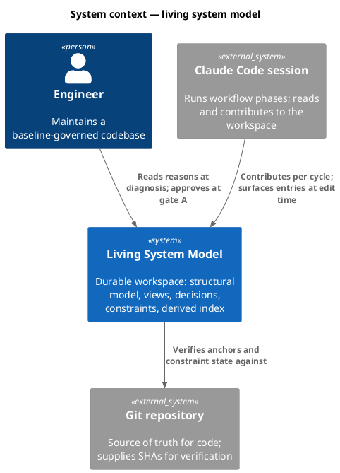
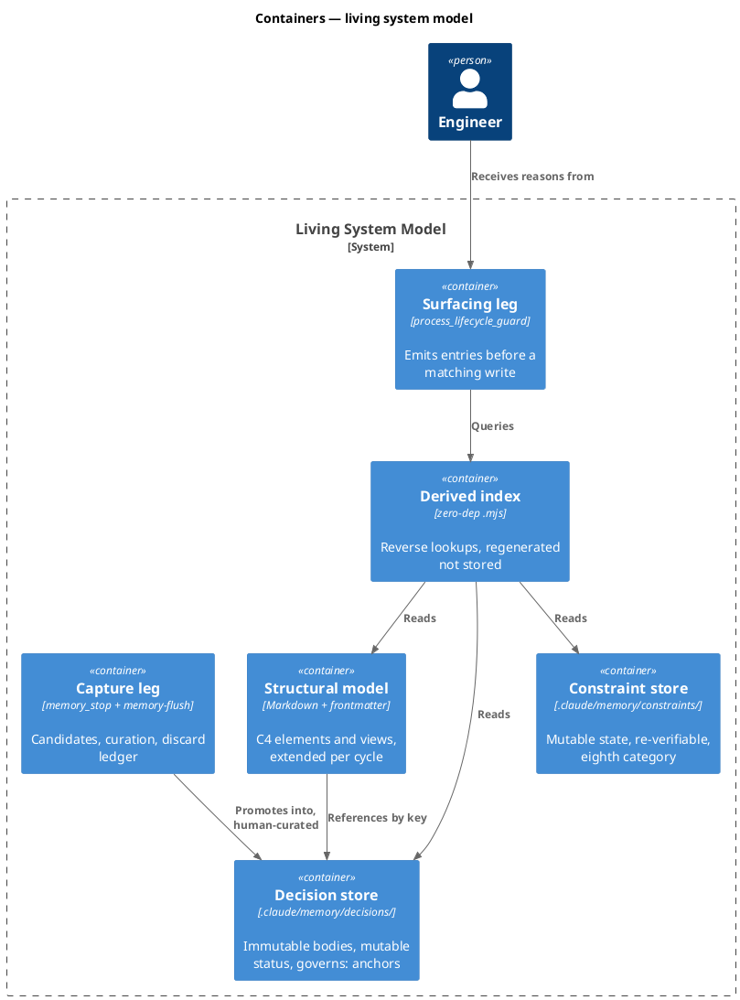
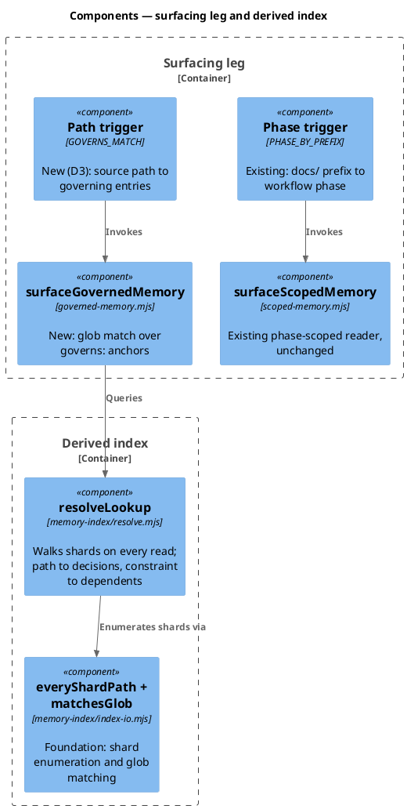
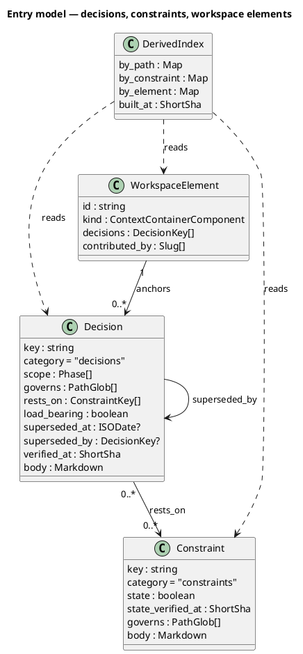
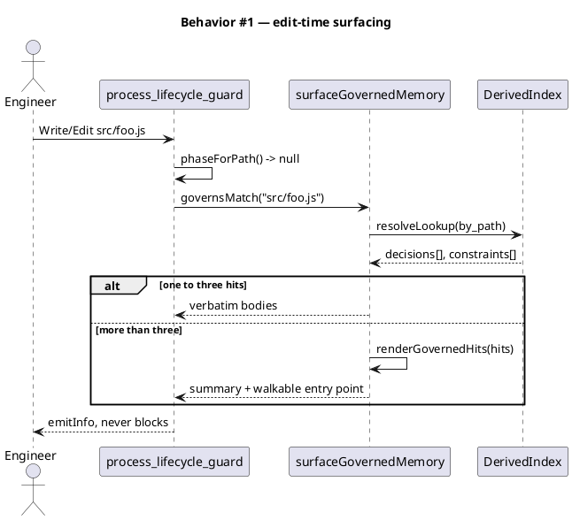
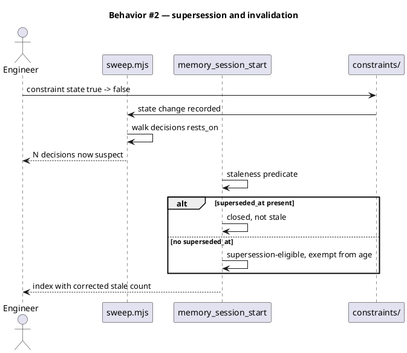
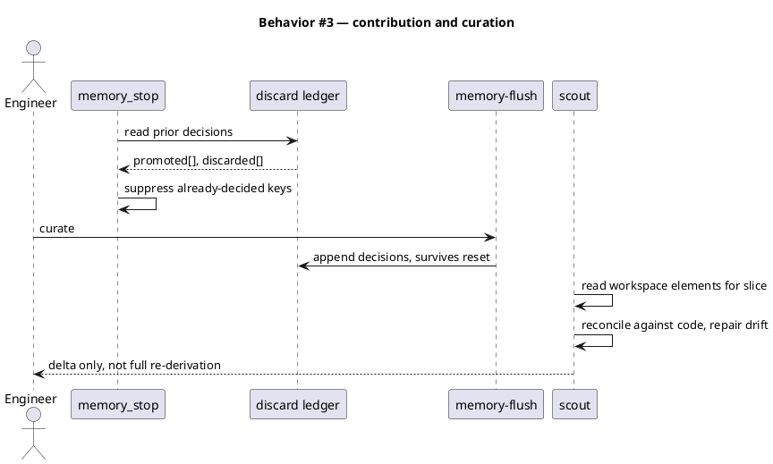
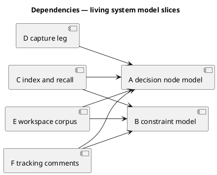

# Spec — living system model: durable architecture memory + decision graph

<!--
Epic sliced spec (track_id `epic`, seed.md §18.9). One `## Slice <id>` per slice in
.claude/state/epic/living-system-model.json. One /approve-direction covers all slices.
Upstream: docs/intake/living-system-model.md · docs/scout/living-system-model.md ·
docs/research/living-system-model.md · docs/brief/living-system-model.md
-->

## Context

Two failures share one cause (intake Problem). At diagnosis time the reason code is shaped a given way is unreachable: the records exist and are well-formed, but they are slug-keyed rather than path-keyed, declare `scope: [spec]` so they surface only when a new spec is written, and expire by age under a predicate built for `path:line` landmarks (26 of 30 read stale). Nothing records constraints at all. Separately, every cycle re-derives the system model and archives it, which is why `scout` exists as a phase.

The predecessor cycle (`docs/archive/2026-07-17/memory-decision-point-redesign/spec.md`) established sharding, the session-start index, and `scope:`-driven surfacing. It deferred one question verbatim to this work: *"Scope-tag backfill — the 191 migrated facts have no `scope:` yet... (resolve before the surfacing slice implements)"*. It also fixed two constraints that bind here: no 27th hook (extend `process_lifecycle_guard`), and no runtime dependency or external graph database.

Structurizr validates the target shape externally — a workspace holds model, views, documentation and decisions together, `workspace extends <file|url>` supports incremental contribution, and `!adrs` anchors decision records to model elements. The semantics are adopted; the tool is not (JVM, and the zero-dep non-goal stands).

## Goal

Make the durable workspace the home of architecture truth — model, views, decisions and constraints — so that a cycle contributes to it instead of re-deriving it, and so the reason a piece of code is shaped a given way reaches whoever edits that code without their going to look for it.

## Non-goals

- No new workflow track (intake Non-goals; vision §1.12).
- No runtime dependency, external graph database, or JVM. Store and index stay plain files generated by zero-dep `.mjs`, Node builtins only (predecessor non-goal, still binding).
- No 27th hook. Edit-time surfacing extends `process_lifecycle_guard` (predecessor D4).
- No migration of the existing seven categories out of `.claude/memory/`. The workspace references them by key; it does not absorb or relocate them.
- No rewriting of existing entry content. Backfill is mechanical.
- `faithful-capture` is not reopened; it is an input to Slice D's extraction discipline.

## Decisions

Engineering calls made in main context and recorded here for gate-A review (CLAUDE.md XI.12). Human's-call forks were asked and are marked `owner: engineer`.

| # | Decision | Rationale | Owner |
|---|---|---|---|
| D1 | Slice E stays in this epic; A and C are designed **inside** the workspace model, not beside it. | Research established that retrofitting A/C into a workspace later is a rewrite, not an extension. If the workspace is the destination, starting there is cheaper. | engineer (asked) |
| D2 | `constraints` becomes an **eighth canonical category** at `.claude/memory/constraints/`. | A constraint is mutable and re-verifiable; a decision is immutable and superseded. Separate lifecycles need separate homes, and the invalidation edge needs one place where "has this flipped?" lives. | engineer (asked) |
| D3 | Edit-time surfacing uses a **second trigger keyed on path** via a new `governs:` field. `scope:` keeps meaning workflow phases, unchanged. | Two clean vocabularies at the cost of one code path, versus one field carrying two kinds of value and every reader discriminating. `scoped-memory.mjs:45` stays a straight membership test. | engineer (asked) |
| D4 | The workspace lives at `.claude/memory/workspace/` and **references** `decisions/` and `constraints/` by key rather than containing them. | Structurizr recommends co-location, but relocating live categories is a migration this epic's non-goals exclude. Reference preserves both. | Claude |
| D5 | `governs:` anchors to **path globs**, not `path:line`. | `landmines.md` uses `path:line` and it drifts on every refactor; the whole point is surviving code motion. Coarser resolution is the accepted cost. | Claude |
| D6 | Only `Superseded` is adopted from MADR's status lifecycle; `Proposed`/`Accepted`/`Deprecated` are not. | `superseded-at:` already exists end-to-end (`closure-check.mjs`, `sweep.mjs --mode auto-close`). The rest is new surface nothing currently needs — YAGNI. | Claude |
| D7 | The scope-tag backfill deferred on 2026-07-17 resolves to **`scope: any`** for migrated facts, not a category-phase default. | The category-default is what produced `scope: [spec]` on decisions and caused the surfacing defect this epic exists to fix. Repeating it would re-create the bug. | Claude |
| D8 | The index is **derived and regenerated**, never stored as truth. | A derived index cannot drift from its source because it re-reads its source. This is the cheapest available answer to the honesty hazard (intake Open questions). | Claude |

## Design

### C4 — System context

### C4 — Container

### C4 — Component (changed containers only)

### Data model — class diagram

### Behavior — sequence per AC

Covers AC-001, AC-005, AC-007, AC-011 (surfacing and lookup):

Covers AC-002, AC-003, AC-004, AC-010 (lifecycle and invalidation):

Covers AC-006, AC-008, AC-009, AC-012 (capture, reconciliation, annotations):

### Dependencies — graph

Edge `A --> B` reads "A depends on B". Acyclic, depth 2. Wave order: `{A, B}` first (mutually independent), then `{C, D, E, F}` — every second-wave slice depends only on A and/or B, so all four are dispatchable together. F resolves annotations by direct shard key, not through C's index, which is why it does not trail C.

### Contracts

- `surfaceGovernedMemory(filePath, {rootDir}) -> Hit[]` — returns `[]` on unmigrated flat stores, on an empty index, and on any read error. Never throws; the guard leg is advisory.
- `resolveLookup(kind, key) -> Entry[]` — `kind` is one of `by_path`, `by_constraint`, `by_element`. Rebuilds on a stale `built_at`.
- `recordCuration({key, decision}) -> void` — appends to the discard ledger; idempotent per `key`.
- Constraint state flip is a write to `constraints/<key>.md → state:` plus a re-stamp of `state_verified_at:`. Nothing else may write that field.

### Libraries and versions

No new dependencies. `package.json → dependencies` stays `["@clack/prompts"]`; all new code is zero-dep `.mjs` on Node builtins, `engines: {"node": ">=18.17.0"}`.

External semantics adopted without dependency, verified against current docs:
- `workspace extends <file|url>` — incremental additions to an existing model — https://docs.structurizr.com/dsl/language
- `!adrs` — decision records attached to workspace, system, or container context — https://docs.structurizr.com/dsl/language
- MADR `Superseded by <id>`, chain traversable forward — https://adr.github.io/madr/

### Alternatives considered

| Alt | Summary | Rejected because |
|---|---|---|
| Extend in place, no workspace (research Candidate A alone) | Add `governs:` + constraints, leave structure in specs | Gives Slice E nothing; research established that retrofitting A/C into a workspace later is a rewrite (D1) |
| Constraint as a property on decisions | No eighth category | A constraint shared by five decisions is written five times, and a state flip has no single home — kills invalidation (D2) |
| Constraint as a derived view | Extract from rationale text | No place to record a flip, so the proof-carrying edge cannot exist (D2) |
| Extend `scope:` with path globs | One field, two value kinds | Every reader must discriminate; `scoped-memory.mjs:45` stops being a membership test (D3) |
| Adopt Structurizr as a dependency | Use the real tool | JVM plus runtime dependency; violates the predecessor's standing non-goal |
| Stored (not derived) index | Persist the reverse lookups | A stored index can drift from its source, which is the honesty hazard the intake names (D8) |

## Design calls

*(none)* — the write surface does not intersect `project.json → tdd.ui_globs`; this work has no UI.

## Acceptance criteria

Each traces to an intake AC and is assigned to exactly one slice. `Kind` tags enforcement ACs (`preflight` / `smoke` / `error-mapping`) that Rollout prerequisites bind to via `enforced-by`; every other AC is `behavior`.

| ID | Criterion (given / when / then) | Kind | Upstream AC | Sequence | Slice |
|---|---|---|---|---|---|
| AC-001 | Given a decision record whose `governs:` matches a source path, when an engineer edits that path, then the decision surfaces before the edit completes. | behavior | intake AC 1 | §Behavior #1 | C |
| AC-002 | Given a decision entry older than 30 commits with no `superseded_at`, when the staleness predicate runs, then the entry is not reported stale. | behavior | intake AC 2 | §Behavior #2 | A |
| AC-003 | Given a decision record, when it is read, then it states whether the shape it describes is load-bearing or incidental. | behavior | intake AC 3 | §Behavior #2 | A |
| AC-004 | Given a decision whose `rests_on` names a constraint, when that constraint's `state` flips, then the decision is surfaced as suspect. | behavior | intake AC 4 | §Behavior #2 | B |
| AC-005 | Given a structural lookup (`by_element`, `by_path`), when it resolves, then it returns matches without justification semantics. | behavior | intake AC 5 | §Behavior #1 | C |
| AC-006 | Given a candidate promoted or discarded at one `/memory-flush`, when the next turn's capture runs, then that candidate is not re-emitted as fresh. | behavior | intake AC 6 | §Behavior #3 | D |
| AC-007 | Given more than three related decisions matching one lookup, when they surface, then a summary is emitted with a walkable entry point rather than every body. | behavior | intake AC 7 | §Behavior #1 | C |
| AC-008 | Given a cycle touching one slice of the system, when `scout` runs, then it reconciles workspace elements for that slice and reports a delta rather than a full re-derivation. | behavior | intake AC 8 | §Behavior #3 | E |
| AC-009 | Given code carrying an annotation naming a decision, constraint, or research doc, when `scout` reads that code, then the named entry resolves. | behavior | intake AC 9 | §Behavior #3 | F |
| AC-010 | Given `constraints` is not yet registered in `CANONICAL`, when a constraint entry write is attempted, then it is rejected rather than written to an unindexed directory. | preflight | intake AC 4 | §Behavior #2 | B |
| AC-011 | Given migrated facts still carrying no `scope:`, when the path trigger is enabled, then the `scope: any` backfill has already run, so no fact is unreachable. | preflight | intake AC 1 | §Behavior #1 | C |
| AC-012 | Given no discard ledger exists yet, when `memory_stop` consults it, then it degrades to current behavior without error. | preflight | intake AC 6 | §Behavior #3 | D |

## Slice A — Decision node model

**Behavior.** Decision entries gain `governs:` (path globs, D5), `rests_on:` (constraint keys), and `load_bearing:` (boolean). The staleness predicate at `.claude/hooks/lib/memory_session_start.mjs:19-20` stops aging supersession-eligible categories by time; `STALE_EXEMPT_FILES` at `:18` is the extension point. `superseded_at:` already exists end-to-end and is reused, not re-invented.

**ACs**: AC-2, AC-3.

**Write surface**: `.claude/hooks/lib/memory_session_start.mjs`, `.claude/memory/README.md` (schema), decision shard frontmatter, `tests/memory-session-start-head-decay.test.mjs`.

## Slice B — Constraint model

**Behavior.** New eighth canonical category at `.claude/memory/constraints/` (D2). Each constraint carries `state:` (boolean), `state_verified_at:`, and `governs:`. `CANONICAL` at `memory_session_start.mjs:16` gains the category, and `route.mjs:22-26` gains a `constraint` classification bucket. A state flip walks `rests_on` and surfaces every dependent decision as suspect.

**ACs**: AC-4.

**Write surface**: `.claude/memory/constraints/` (new), `.claude/hooks/lib/memory_session_start.mjs`, `.claude/skills/memory-flush/route.mjs`, `.claude/memory/README.md`, new tests.

## Slice C — Index and recall layer

**Behavior.** A derived index (D8) regenerated from shards, exposing `by_path`, `by_constraint`, `by_element`. A second surfacing trigger keyed on path (D3) extends `process_lifecycle_guard` — no 27th hook. Migrated facts backfill to `scope: any` (D7). Above three hits, a summary plus walkable entry point replaces verbatim bodies.

**ACs**: AC-1, AC-5, AC-7.

**Write surface**: `.claude/hooks/process_lifecycle_guard.mjs`, `.claude/hooks/lib/governed-memory.mjs` (new), `.claude/skills/memory-index/` (`resolve.mjs` rebuilt-on-read + `index-io.mjs`; summarization is inlined as `renderGovernedHits` in `governed-memory.mjs`), `tests/memory-scoped-surface.test.mjs`.

**Risk**: `security` — touches `.claude/hooks/**`, in `security.sensitive_globs`.

## Slice D — Capture leg

**Behavior.** A discard ledger persists curation decisions across the `/memory-flush` reset boundary. Scout established that `memory_stop.mjs:262-274,373` already dedupes against the *current* `_pending.md` body and is guarded by `tests/memory-stop-dedup.test.mjs` — this slice must extend that lifetime, not add a second dedup. Fork detection beyond intent-line heuristics, and an extraction step governed by `faithful-capture`'s ADR leg (a fork must be quotable; absence is not a decision).

**ACs**: AC-6.

**Write surface**: `.claude/hooks/lib/memory_stop.mjs`, `.claude/skills/memory-flush/` (ledger actuator), `tests/memory-stop-dedup.test.mjs`.

**Risk**: `security` — touches `.claude/hooks/**`.

## Slice E — Workspace structural corpus

**Behavior.** A durable workspace at `.claude/memory/workspace/` holding C4 elements and views as plain files, referencing `decisions/` and `constraints/` by key (D4). Each cycle *extends* it — add, remove, update — rather than rewriting, following Structurizr's `workspace extends` semantics without the dependency. `scout` shifts from discovery to reconciliation. Concurrent contributions need merge semantics beyond textual git merge.

**ACs**: AC-8.

**Write surface**: `.claude/memory/workspace/` (new), `.claude/skills/scout/SKILL.md`, `.claude/skills/spec/SKILL.md` (contribute rather than re-derive), `.claude/project.json → artifacts.required_diagrams.spec`.

## Slice F — Tracking comments

**Behavior.** Code annotations naming a decision, constraint, or research doc, resolvable by `scout`. Placement is gated on Slice A's `load_bearing:` marker — annotations go where a maintainer would otherwise confidently break something, not broadly.

**ACs**: AC-9.

**Write surface**: `.claude/skills/scout/SKILL.md` (resolution), `.claude/skills/code-structure/SKILL.md` (placement rule), annotation format docs.

## Test plan

| Kind | Case | AC |
|---|---|---|
| Golden path | Edit a source path matching a decision's `governs:` glob; assert the decision body is emitted before the write | AC-1 |
| Golden path | Decision 40 commits old, no `superseded_at`; assert not counted stale | AC-2 |
| Golden path | Flip a constraint's `state`; assert every `rests_on` dependent is listed | AC-4 |
| Golden path | Run `/memory-flush` twice with no intervening work; assert no candidate re-emits | AC-6 |
| Golden path | Two disjoint slices contribute elements; assert both survive the extension | AC-8 |
| Boundary | Exactly 3 vs 4 matching decisions; assert verbatim below, summary at and above the threshold | AC-7 |
| Boundary | Structural lookup on an element with zero decisions; assert empty, not error | AC-5 |
| Input boundary | `governs:` glob with `../` traversal; assert rejected, no path escape | AC-1 |
| Regression | Unmigrated flat store; assert `surfaceGovernedMemory` returns `[]` and never throws | AC-1 |
| Regression | Existing `scope: [spec]` phase surfacing still fires on `docs/specs/**` writes | AC-1 |
| Regression | `tests/memory-stop-dedup.test.mjs` cross-invocation dedup still passes | AC-6 |
| Regression | Annotation naming a deleted entry; assert reported unresolved, not silently skipped | AC-9 |

No mocks of internal modules; tests operate on real shard directories in temp dirs, matching the 28 existing memory test files.

## Observability

- `memory_session_start` index gains a constraints row and reports supersession-eligible-but-open counts separately from stale.
- `process_lifecycle_guard` logs `surfaced N governed entries for <path>` alongside its existing phase line.
- Index rebuilds log `built_at` and entry count; a rebuild triggered by a stale `built_at` is logged distinctly from a cold build.

## Rollout

### Prerequisites

| # | Prerequisite | enforced-by |
|---|---|---|
| P1 | Eighth category registered in `CANONICAL` before any constraint entry is written | AC-010 |
| P2 | `scope: any` backfill applied before the path trigger goes live, so migrated facts are reachable | AC-011 |
| P3 | Discard ledger present, or its absence degrades cleanly, before `memory_stop` consults it | AC-012 |

Slice ordering is structural rather than an enforcement AC: A and B land before C, D, E, and F per the §Dependencies graph. Slices land as separate `epic-child` workflows in wave order `{A, B}` → `{C, D, E, F}`. Per-slice deployment preflight beyond P1–P3 belongs to each child's own spec, since the child owns the code that would enforce it.

## Rollback

Every slice is additive. `governs:`, `rests_on:`, `load_bearing:` are new optional frontmatter — absent fields read as today. The constraints directory can be deleted; `CANONICAL` reverts by one entry. The derived index is regenerable and holds no truth, so deleting it loses nothing. The path trigger is a separate code path from the phase trigger and can be removed without touching `scope:` behavior. `.claude/skills/memory-index/migrate.mjs --reverse` remains the store-shape rollback.

## Archive plan

`docs/archive/<date>/living-system-model/` receives intake, brief, scout, research, this spec, and the approval token. `workflow.json` archives as the first step of `/commit`. Slice children archive under their own slugs and reference this spec by its `#slice-<id>` anchors.

## Open questions

- **Workspace merge semantics** are named in Slice E but not designed. Two slices adding the same element under different names is a semantic conflict git will commit happily. Resolve inside Slice E's own child cycle.
- **Index rebuild cost** is unmeasured. The corpus is 226 entries so it is very likely negligible, but no measurement exists. Measure before choosing between build-on-demand and build-at-session-start.
- **Diagram authority** is currently split between `.claude/project.json → artifacts.required_diagrams.spec` and `.claude/skills/spec/template.md`. The workspace creates a third location. Slice E must name which is authoritative or this drifts.
- **`load_bearing:` classification** has no oracle — it is a human judgment recorded per decision. Whether Claude may set it unaided, or it requires engineer confirmation, is unresolved.
