# Tracking annotations — make Epic 7 slice F deliver

## Context

| Input | Path |
|---|---|
| Intake | *(none — `spec-entry` track; `intake` is excepted)* |
| BRD *(if any)* | *(none)* |
| Scout *(if any)* | *(none — `scout` is excepted; the corpus reconcile leg replaces it, see D5)* |
| Research *(if any)* | *(none)* |
| Upstream spec | `docs/archive/2026-08-04/living-system-model-ef/spec.md` (ticket F, AC-008..AC-011) |
| Epic spec | `docs/specs/living-system-model.md` (slice F) |
| Epic state | `.claude/state/epic/living-system-model.json` — slice F, `approved: true` |

**Write set**: `.claude/skills/workspace/**`, `.claude/skills/scout/SKILL.md`, `.claude/skills/code-structure/SKILL.md`, `.claude/skills/memory-index/categories.mjs`, `.claude/hooks/lib/memory_session_start.mjs`, `.claude/project.json`, `docs/annotations.md`, `tests/**` — includes `.claude/hooks/**`, a `security.sensitive_globs` path, so the full C4 set applies rather than the non-architectural profile.

## Goal

`scout` resolves the tracking annotations carried in source and reports the dangling ones, the `load_bearing:` gate honours the marker in every canonical category rather than only `decisions`, and the annotations exist in this repository's own tree — so slice F reaches a reader instead of sitting built and inert.

## Non-goals

- **No new hook.** The annotation leg extends `scout`, the way slice C's path trigger extended `process_lifecycle_guard` rather than adding a 27th hook.
- **No blocking gate.** A dangling annotation is *reported*; it fails no phase and exits 0. Making it a gate is a separate decision with its own blast radius.
- **No `@research:<path>` support.** Deliberately unsupported (`refs.mjs:11-14`) — a research doc is addressed by path, not by key, so routing it through the key resolver would mark every one dangling. Fixing `code-structure/SKILL.md`'s stale promise of it is in scope; implementing it is not.
- **No template/consumer rollout.** The flag flips in this repository only (D7).
- **No change to `assertSafeFactKey`.** The path-shaped-key rejection is the F-1 CWE-22 fix; D4 records the asymmetry it causes rather than weakening it.
- **No `detectConflicts` sibling-op fix.** A separable defect carried from `6fc019d`, recorded in the corpus-seed workflow. Out of scope here.

## Decisions

| # | Decision | Owner | Rationale |
|---|---|---|---|
| D1 | The `load_bearing:` read gate widens beyond `decisions` to every canonical category. | **engineer** | > "Defect — widen to all categories." The marker means the same thing wherever it sits, and a landmine marked `load_bearing` is precisely where a maintainer would confidently break something. Measured: 23 markers on disk — 3 `decisions`, 9 `landmines`, 11 `landmarks` — so 20 of 23 are unreachable by `annotationPlacementAllowed` today. |
| D2 | The annotation **verb set** widens in lockstep with D1, derived from `CANONICAL` with an explicit irregular-plural table and a module-load totality assertion. | claude | Widening the read gate alone is incoherent: `refs.mjs:15-16` parses only `@decision:`/`@constraint:`, so 20 markers would be gate-approved and still unwritable. Deriving the map from `CANONICAL` (rather than a second hardcoded list) is the same collapse slice B made; the totality assertion is what makes adding a ninth category fail loudly, answering landmine `canonical-category-list-spans-nine-surfaces` where seven of nine surfaces failed silently. |
| D3 | `proposeLoadBearing` writes to the **resolved entry's** category directory, not a hardcoded `decisions/`. | claude | Derived defect of D1. `placement.mjs:56` builds `join(memDir, 'decisions', key + '.md')` unconditionally; under a widened read gate a confirmed landmine marker would create a bogus `decisions/` shard. A widened read with an unwidened write silently mis-targets. |
| D4 | The propose→confirm path stays unavailable for **path-shaped keys**; those markers arrive via `/memory-flush`. Recorded, not repaired. | claude | Landmark keys are paths (`.claude/skills/workspace/placement.mjs:1`) and REJECT under `assertSafeFactKey` (measured). Reading is unaffected — `annotationPlacementAllowed` does no path construction. Weakening the guard would reopen F-1 (CWE-22), so the asymmetry is documented instead. |
| D5 | Discovery scans **tracked files repo-wide**, minus `docs/**`, minus `project.json → tdd.test_globs`, minus keys containing `<`/`>`. | claude | Measured 110 ms over 2110 tracked files across 3 runs — the same order as the 17.5 ms index build that settled slice C's build-on-demand question, so scoping to the touched slice buys nothing and would leave a dangling annotation in an untouched file silent forever. The three exclusions are each proven necessary by a real false positive: `docs/annotations.md:18` (syntax table), `docs/archive/.../spec.md:414` (`@decision:<key>` placeholder), `tests/annotations-resolve.test.mjs:42` (`was-deleted`, dangling on purpose). |
| D6 | Placement targets only entries whose `governs:` names a **specific file**, never a `**` glob. | claude | The gate constrains *where*; something still has to choose, and this is the mechanical rule that keeps the set small. `a-cycle-that-adds-a-gate-must-assert-the-consumer-calls-it` governs `.claude/skills/**,tests/**` — annotating every file it covers is the scatter the marker exists to prevent. |
| D7 | `memory.annotations.enabled` flips **in this repository only**; `src/project.template.json` stays without the key. | claude | Precedent: `workspace-corpus-seed` rollout step 4 did exactly this for `memory.workspace.enabled`, and the fail-safe default holds by key absence — `flagAt` reads `=== true`, so an absent key is `false` for every consumer. |
| D8 | The flag flips **before** annotations are placed, not after. | **engineer** | > "flip the flag first, then place". Caught at the scenario tick: the draft rollout ordered placement at step 5 and the flip at step 6, but `code-structure/SKILL.md` gates placement on the flag reading `true`, so every placement at step 5 would have run against a shut gate. The end state is identical either way; doing it in this order means the gate is actually honoured rather than stepped around by the one cycle that introduces it. |

## Design

Diagrams are the contract. Prose is only for what a diagram cannot say.

### C4 — System context

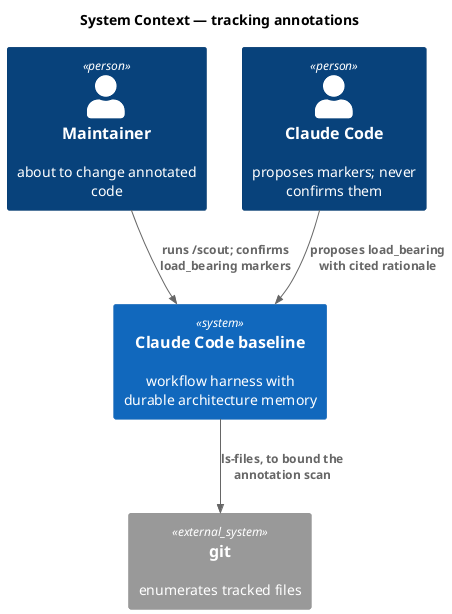

### C4 — Container

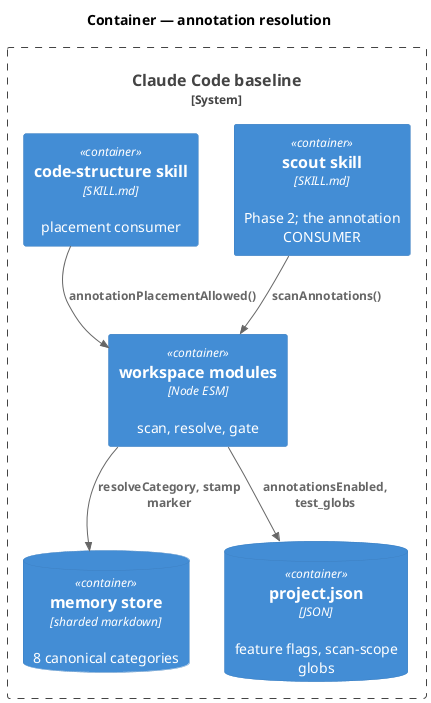

### C4 — Component (changed containers only)

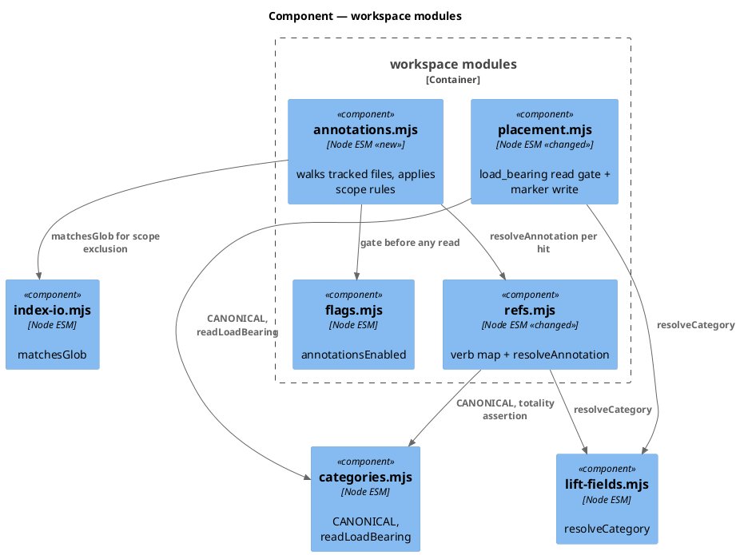

### Data model — class diagram

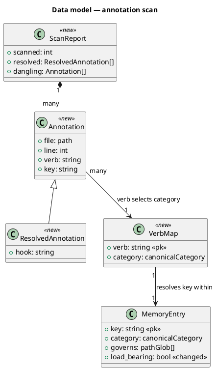

#### Migration — file layout and config, not DDL

There is no relational store; the migration is a config flip plus comment lines in source.

```
# forward
.claude/project.json          memory.annotations.enabled: false -> true   (this repo only)
<governed source files>       add one `@<verb>:<key>` comment at the governed site
# reverse
.claude/project.json          memory.annotations.enabled: true -> false
```

Flag off restores prior behaviour exactly: `scout` skips the scan, `code-structure` places nothing, and the comment lines already in source become inert text that nothing reads. `load_bearing:` markers already on disk are untouched by either direction.

`CANONICAL` gains no ninth entry. D1/D2 widen who *reads* the eight; they add none.

### Behavior — sequence per AC

#### §Behavior #1 — scout resolves an annotation and surfaces its hook (AC-001, AC-003)

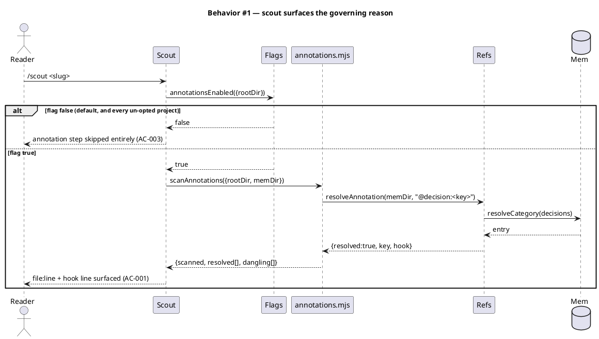

The flag check precedes the scan and is asserted in that order — an ordering the wiring test pins, because a scan that runs before its gate has no gate.

#### §Behavior #2 — a dangling annotation is reported, never skipped (AC-002)

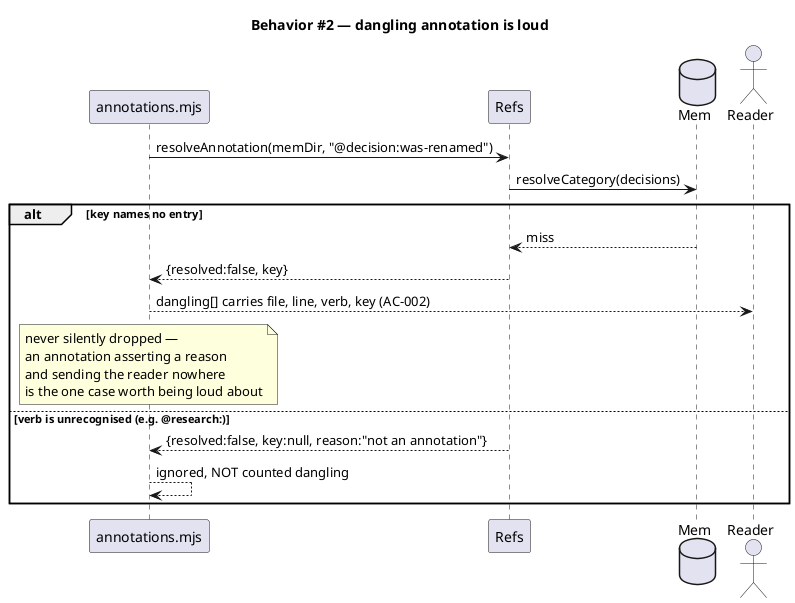

An unrecognised verb is not a broken annotation — it is not an annotation. Counting `@research:` as dangling would report every one of them forever, which is why `refs.mjs` narrowed to what is implemented.

#### §Behavior #3 — scan scope excludes docs, tests and placeholders (AC-009)

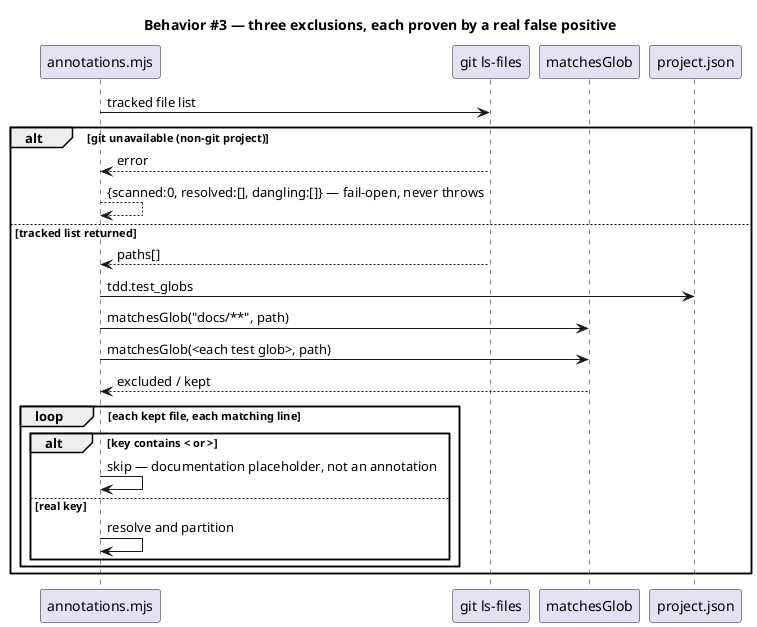

#### §Behavior #4 — the widened gate and the widened verb set (AC-004, AC-005)

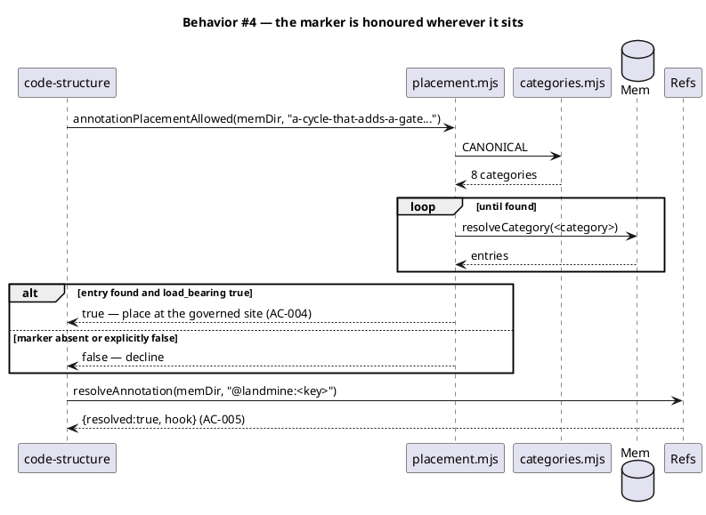

#### §Behavior #5 — the verb map is total over CANONICAL (AC-006)

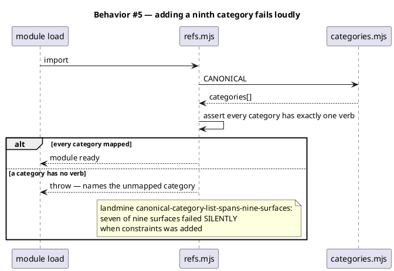

#### §Behavior #6 — marker writes land in the resolved category, and unsafe keys reject (AC-007, AC-008)

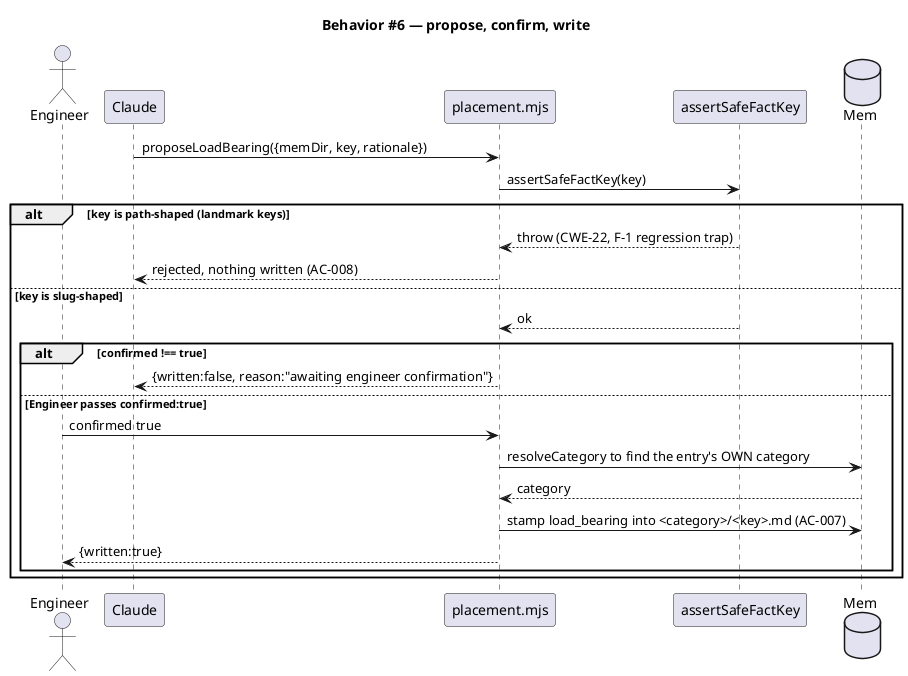

#### §Behavior #7 — rollout proves the live tree, not a temp dir (AC-010)

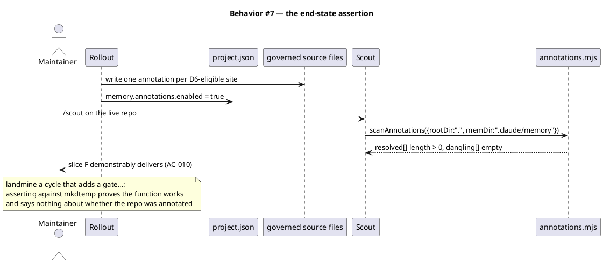

### State — core entity *(only if stateful)*

Omitted deliberately. An annotation has no lifecycle of its own — it is a comment that either resolves or does not, evaluated fresh on every scan. The `load_bearing:` marker's own two states (absent/false, true) are covered by §Behavior #6 rather than a separate machine.

### Dependencies — graph

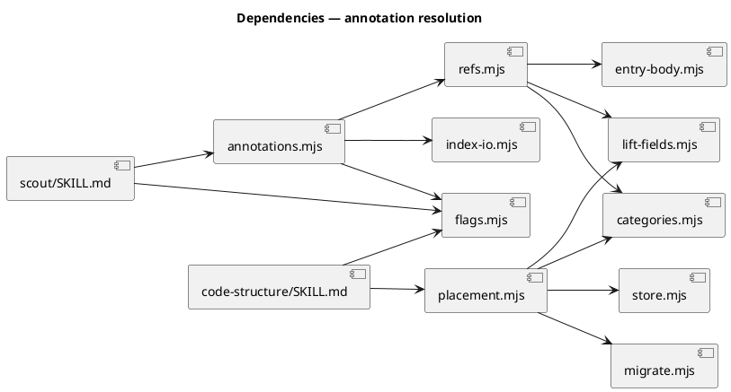

### Contracts

| Kind | Name | Input | Output | Errors | Idempotent |
|---|---|---|---|---|---|
| Node API | `scanAnnotations({rootDir, memDir, files?})` | roots; optional explicit file list | `{scanned:int, resolved:[{file,line,verb,key,hook}], dangling:[{file,line,verb,key}]}` | none — git absent / unreadable file → that file contributes nothing | yes |
| CLI | `node .claude/skills/workspace/annotations.mjs [--root <dir>] [--mem <dir>]` | flags | the scan report as JSON on stdout | exit 0 always; advisory, never a gate | yes |
| Node API | `resolveAnnotation(memDir, ref)` *(changed)* | `@<verb>:<key>` for any canonical verb | `{resolved, key, hook?}` / `{resolved:false, key:null, reason}` | none — never throws | yes |
| Node API | `annotationPlacementAllowed(memDir, key)` *(changed)* | entry key, any canonical category | `bool` | none — unresolvable key → `false` | yes |
| Node API | `proposeLoadBearing({memDir, key, rationale, confirmed})` *(changed)* | key + rationale | `{written, key, rationale, reason?}` | throws on an unsafe key (REJECT, never normalize) | yes |
| Annotation | `@<verb>:<key>` | source comment, any language | resolution via `scout` | unresolved → reported in `dangling[]` | yes |

`@research:<path>` remains outside the verb set; an unrecognised verb resolves to `{resolved:false, key:null, reason:"not an annotation"}` and is ignored by the scan.

### Libraries and versions

| Library@version | Purpose | Key APIs | Confirmed against current docs |
|---|---|---|---|
| Node.js stdlib (`node:fs`, `node:path`, `node:child_process`) | file reads, path joins, `git ls-files` | `readFileSync`, `join`, `execFileSync` | yes — no third-party library is added; constraint `zero-runtime-dependencies` holds |

No third-party API is introduced, so the current-docs rule (Art. VI.5) is satisfied vacuously rather than by a lookup.

### Alternatives considered

| Alt | Summary | Rejected because |
|---|---|---|
| A | Scope the scan to the reconcile delta's touched paths | A dangling annotation in an untouched file would stay silent forever, and the measured repo-wide cost (110 ms) makes the saving imaginary. |
| B | Have `scout` grep inline per its SKILL.md prose, with no scanner module | The scope rules are policy. Prose instructions are exactly what got skipped four times this epic; a module with a deterministic CLI is testable and a prose paragraph is not. |
| C | Widen `annotationPlacementAllowed` only, leaving the verb set at two | 20 of 23 markers would pass a gate that authorises an annotation no parser can read. |
| D | Relax `assertSafeFactKey` so landmark keys become confirmable | Reopens the F-1 CWE-22 traversal the last cycle closed. D4 records the asymmetry instead. |
| E | Exit non-zero on a dangling annotation | Turns a report into a gate that can fail `/scout`. A new blocking gate deserves its own decision and blast-radius review, not a side effect of wiring. |

## Design calls

The write set does not intersect `project.json → tdd.ui_globs` (`site-src/**`, `**/*.html`, `**/*.css`, `**/*.njk`, and the JSX/Vue/Svelte globs). No UI surface changes.

- *(none)*

## Acceptance criteria

| ID | Criterion (given / when / then) | Kind | Upstream AC | Sequence |
|---|---|---|---|---|
| AC-001 | given `memory.annotations.enabled` is true and a tracked source file carries a resolvable `@decision:<key>`, when `scout` runs its annotation step, then that file, line and the entry's hook line are surfaced | behavior | ef AC-008 / epic AC-009 | §Behavior #1 |
| AC-002 | given a tracked source file carries an annotation naming no entry, when the scan runs, then it appears in `dangling[]` with its file, line, verb and key rather than being dropped | behavior | ef AC-009 | §Behavior #2 |
| AC-003 | given `memory.annotations.enabled` is absent or not the boolean `true`, when `scout` runs, then the flag check precedes any scan call and no annotation work occurs | preflight | ef AC-008 | §Behavior #1 |
| AC-004 | given an entry outside `decisions` (a landmine) carrying `load_bearing: true`, when `annotationPlacementAllowed` is asked about its key, then it returns true | behavior | ef AC-010 | §Behavior #4 |
| AC-005 | given a source comment `@landmine:<key>` naming a live landmine, when `resolveAnnotation` parses it, then it resolves and carries the entry's hook | behavior | ef AC-008 | §Behavior #4 |
| AC-006 | given a canonical category with no verb in the map, when `refs.mjs` is imported, then the import throws naming the unmapped category | preflight | *(new — landmine `canonical-category-list-spans-nine-surfaces`)* | §Behavior #5 |
| AC-007 | given an engineer confirms `load_bearing` on a landmine key, when `proposeLoadBearing` writes, then the marker lands in `landmines/<key>.md` and no `decisions/<key>.md` is created | behavior | ef AC-011 | §Behavior #6 |
| AC-008 | given a path-shaped key such as `.claude/skills/workspace/placement.mjs:1`, when `proposeLoadBearing` is called, then it throws before any path is constructed and nothing is written | preflight | ef AC-011 | §Behavior #6 |
| AC-009 | given annotation-shaped tokens under `docs/**`, under a `tdd.test_globs` path, or carrying a `<key>` placeholder, when the scan runs, then none is reported resolved or dangling | behavior | *(new — D5)* | §Behavior #3 |
| AC-010 | given the live repository after rollout, when `scanAnnotations` runs against `.` and `.claude/memory`, then `resolved[]` is non-empty and `dangling[]` is empty | smoke | ef AC-008 | §Behavior #7 |

No AC row defers committed scope, so no `deferred:` tag applies (CLAUDE.md VI.4).

## Test plan

| Category | Scenario | Expected | Covers |
|---|---|---|---|
| Golden path | fixture file carries `@decision:<live key>`; scan runs | `resolved[]` carries file, line, key and the hook line | AC-001 |
| Golden path | fixture carries `@landmine:<live key>` | resolves with hook — the widened verb set works end to end | AC-005 |
| Wiring (consumer) | grep `scout/SKILL.md` for `annotationsEnabled` and `scanAnnotations`, asserting the flag check appears at a lower line number than the scan call | both present, in that order; mutation-proven by reordering and by deleting each call | AC-001, AC-003 |
| Contract violation | annotation names a deleted entry | reported in `dangling[]`, not dropped | AC-002 |
| Contract violation | `@research:docs/x.md` and `@bogus:key` | ignored entirely — absent from both `resolved[]` and `dangling[]` | AC-002 |
| Input boundary | tokens in `docs/annotations.md`, `tests/**`, and a `@decision:<key>` placeholder | all three excluded from the report | AC-009 |
| Contract violation | a canonical category is added with no verb | import of `refs.mjs` throws naming it | AC-006 |
| Golden path | engineer confirms a landmine marker | written to `landmines/<key>.md`; `decisions/<key>.md` does not exist | AC-007 |
| Regression trap | `proposeLoadBearing` with `.claude/skills/workspace/placement.mjs:1` | throws; no file written anywhere (F-1 CWE-22 stays closed) | AC-008 |
| Regression trap | `confirmed: 1`, `confirmed: "true"`, `confirmed: {}` | each refused — the gate tests `=== true` | AC-007 |
| Failure mode | `rootDir` is not a git work tree | `{scanned:0, resolved:[], dangling:[]}`; never throws | AC-009 |
| Failure mode | a tracked file is unreadable mid-scan | that file contributes nothing; the scan completes | AC-009 |
| Smoke (live tree) | `scanAnnotations` against the real repo after rollout | `resolved[].length > 0` and `dangling[].length === 0` | AC-010 |
| Regression trap | `memory.workspace.enabled` behaviour and the 14-element corpus | unchanged — this cycle touches neither | — |

## Observability

| Signal | Name | Shape | Purpose |
|---|---|---|---|
| Report | scan report | `{scanned, resolved[], dangling[]}` on stdout as JSON | what `scout` surfaces to the reader; the only output surface |
| Report | `dangling[]` non-empty | file, line, verb, key per entry | the stale-reference signal — loud by content, non-blocking by exit code (Alt E) |

No metric or alarm: this is a developer-tool code path with no runtime service, and inventing an SLO for it would be the pre-optimisation the spec skill warns against.

## Rollout

### Prerequisites

| # | Prerequisite | enforced-by |
|---|---|---|
| 1 | The flag gate precedes every scan, so a project that never opted in is unaffected | AC-003 |
| 2 | The `assertSafeFactKey` rejection still fires before any path construction | AC-008 |
| 3 | The verb map covers every canonical category before the widened gate is relied on | AC-006 |
| 4 | Annotations exist in the live tree and resolve — not merely in a temp-dir fixture | AC-010 |

- **Feature flag**: `memory.annotations.enabled` — ships absent (reads `false`); set `true` in `.claude/project.json` for this repository only (D7).
- **Migration order**: 1 widen `refs.mjs` verb map + totality assertion → 2 widen `placement.mjs` read gate and write target → 3 add `annotations.mjs` → 4 wire `scout/SKILL.md` → 5 flip the flag → 6 place annotations at D6-eligible sites → 7 assert the live-tree end state (AC-010). The flip precedes placement per **D8**: `code-structure` gates placement on the flag, so placing first would step around the gate this cycle introduces.
- **Canary**: this repository is the canary, as it was for `memory.workspace.enabled`. Success signal is AC-010 on the live tree; consumers stay dark because the template carries no key.

## Rollback

- **Kill-switch**: set `memory.annotations.enabled` to `false` in `.claude/project.json`. `scout` skips the step, `code-structure` places nothing, and annotation comments already in source become inert text.
- **Signal to roll back**: `scanAnnotations` against the live tree reports any `dangling[]` entry, or `/scout` fails on a tree where it previously passed. Both are observable on the next `/scout` run, which is the first use after the flip — inside the 5-minute bar without needing a timer.

## Archive plan

- Defaults *(automatic)*: spec, spec approval, security report, timing.
- Extras *(list any non-default files)*:
  - *(none)*

## Open questions

- *(none — the four decisions parked at triage are resolved above as D2, D5, D6 and D7; D1 carries the engineer's verbatim ruling, and D3/D4 are the defects derived from it.)*
