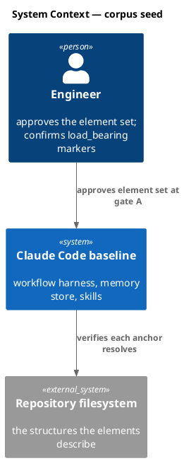
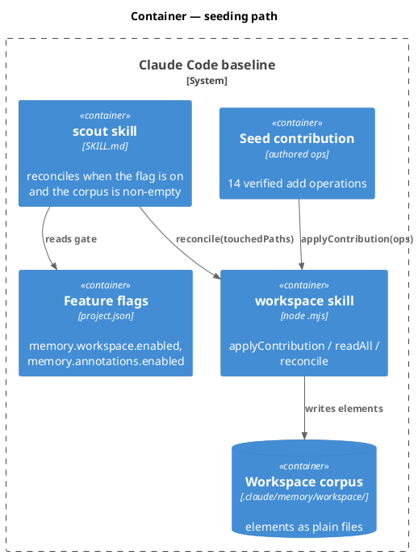
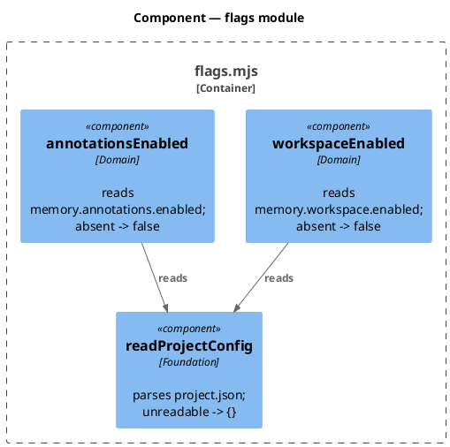
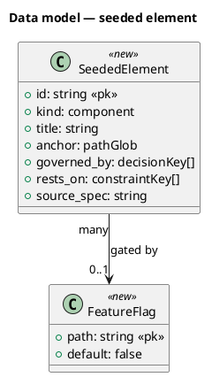
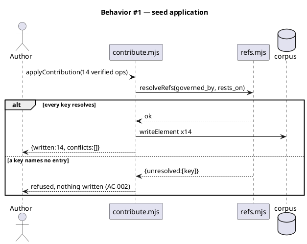
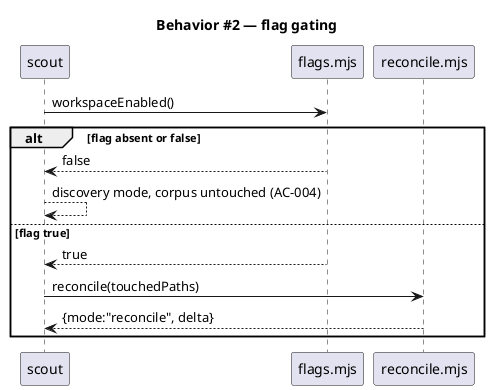
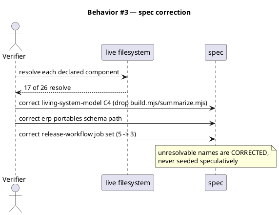
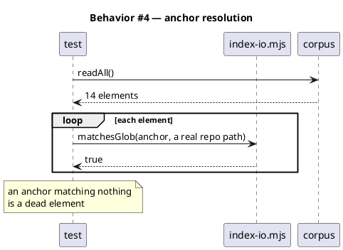
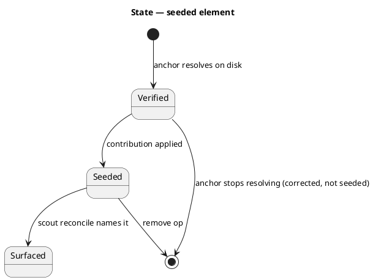
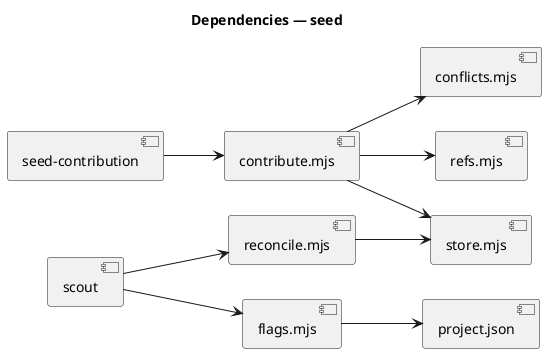

# Workspace corpus seed — Epic 7 slice E

## Context

| Input | Path |
|---|---|
| Intake | *(inherited — epic discovery)* |
| BRD *(if any)* | *(none)* |
| Scout *(if any)* | `docs/scout/living-system-model.md` |
| Research *(if any)* | `docs/research/living-system-model.md` |
| Parent epic spec | `docs/specs/living-system-model.md` (`#slice-E`) |
| Prior cycle | `docs/archive/2026-08-04/living-system-model-ef/spec.md` |

**Write set**: `.claude/memory/workspace/**`, `.claude/project.json`, `.claude/skills/workspace/flags.mjs`, `docs/specs/living-system-model.md`, `docs/specs/erp-portables.md`, `docs/specs/release-workflow.md`, `tests/**`

Slice E shipped its machinery in `6fc019d..7f89385` and then delivered nothing, because no
step ever wrote a first element. `scout` still resolves to `mode: "discovery"` on this
repository. This spec supplies the missing seed.

The machinery is proven, not assumed: a probe on a throwaway copy of the live store applied
three `add` ops and `reconcile` flipped to `mode: "reconcile"`, naming only the touched
element. So the code surface here is two feature flags. The bulk is authored data and the
repair of the spec drift that verification exposed.

## Goal

`.claude/memory/workspace/elements/` holds a verified element set describing the parts of this
system that actually exist, so `scout` reconciles against it instead of rediscovering, and the
three specs whose C4 diagrams contradict the live system are corrected.

## Non-goals

- **No archived-spec import.** 618 of 644 repo-wide `Component(` declarations live in archived
  specs. They describe designs that were superseded, and importing them would build a corpus
  that is mostly wrong about the present.
- **No inference from code.** Epic decision D6 stands: elements are authored. Nothing walks the
  filesystem to guess at structure.
- **No `WorkspaceView` writes.** See D3.
- **No seeding of unverified names.** A spec component with no live counterpart is omitted and
  the spec is corrected, never seeded speculatively.
- **No new runtime dependency.**

## Decisions

| # | Decision | Rationale | Owner |
|---|---|---|---|
| D1 | **Component-level granularity, anchored to the smallest path that owns the behavior.** Hierarchy is permitted. | `detectConflicts` raises `duplicate-anchor` only on **exact** string equality, so `.claude/skills/**` and `.claude/skills/workspace/**` coexist. Hierarchy therefore costs nothing, and component-level is what `scout` needs: a delta naming "the skills layer" is not a delta. | Claude |
| D2 | **Anchor convention: every element anchors to a real path glob. An element's identity in the corpus IS its anchor — declarations that resolve to the same path merge into ONE element whose `title` names everything it covers.** | Superseded the original D2, which said colliding units stay separate and are "distinguished by `title`". That was written against a mechanism that does not exist: `detectConflicts` reads `anchor`, never `title`. Two elements sharing an anchor are, to the corpus, two names for one thing — which is exactly the `duplicate-anchor` condition. Merging is the honest model; the check was right and the decision was wrong. | Claude |
| D7 | **The corpus addresses things at path granularity, and specs describe them more finely. The gap is recorded, not papered over.** | 17 resolving declarations collapse to **14** addressable elements. That is a finding about the relationship between specs and the corpus, not an accounting error: a spec can name three CI jobs inside one file, and the corpus can only point at the file. Elements merged this way say so in their title. | Claude |
| D3 | **`WorkspaceView` is out of scope.** `readAll` keeps returning `{elements, views}` and `views` stays empty. | Nothing writes views, no AC covers them, and the corpus has no reader that consumes them. Writing view files now would be scaffold. When a real consumer appears it brings its own AC. | Claude |
| D4 | **`governed_by` / `rests_on` carry only keys that resolve today.** An element with no governing decision carries none. | Epic D4 says reference by key, never by copy. A key that resolves to nothing is worse than an absent one: `resolveRefs` reports it unresolved and the element is refused, so an invented key would block its own write. | Claude |
| D5 | **Ship `memory.workspace.enabled` and `memory.annotations.enabled` now, both default `false`.** | Seeding makes the corpus non-empty, and at that instant every `scout` run switches from discovery to reconcile — for consumers too, with no opt-out. The flags make that a deliberate per-project choice. | **engineer** |
| D6 | **Spec drift found during verification is repaired in this cycle, not filed.** | The corpus is seeded *from* these specs. Seeding first and correcting later would bake the drift into the model the corpus exists to keep honest. | Claude |

## Verification result

Every one of the 26 live-spec declarations was checked against the filesystem. 17 resolve.

| Spec | Declared | Verified live | Finding |
|---|---|---|---|
| `erp-portables` | 7 | 7 | **no drift** — all seven resolve, and the schema is already cited at `.claude/schemas/` |
| `living-system-model` | 7 | 5 | `index/build.mjs` and `index/summarize.mjs` **were never built** |
| `release-workflow` | 7 | 3 | jobs consolidated 5 → 3; `build-verify`, `publish-npm`, `push-bump`, `install-smoke` do not exist |
| `mvp-sprint-parallel-cycles` | 5 | 2 | the 5 named internals live inside `server.mjs` + `handlers.mjs`, not 5 modules |

**Correction (post-approval).** An earlier revision of this table claimed `erp-portables` cited the
schema at `src/schemas/`. It does not, and never did — that path came from the verification probe's
own assumption rather than from the spec. Two specs drifted, not three. AC-006 is therefore a
**regression trap** that is green from the first run, defending a path that is already correct,
rather than a repair.

### 17 declarations, 14 elements

The 17 resolving declarations claim only **14 distinct anchors**. Two groups collide:

| Anchor | Declarations claiming it | Merged element |
|---|---|---|
| `.github/workflows/release.yml` | `pre-publish-checks`, `release`, `deploy-pages` | one element titled for all three jobs |
| `.claude/hooks/process_lifecycle_guard.mjs` | phase trigger, path trigger | one element titled for both triggers |

Found by the idempotence test, not by review. `detectConflicts` compares each op against the
**pre-existing corpus**, never against sibling ops in the same contribution — so same-anchor siblings
write cleanly on first apply and then all raise `duplicate-anchor` on the second, where atomic
rejection means the whole contribution writes nothing. A seed built at 17 would have looked
successful and permanently broken its own re-application.

Merging is the correct fix rather than a workaround: `duplicate-anchor` exists to catch two
contributors describing one thing under different names, and that is precisely what these are.

**Separable defect, not fixed here.** A single contribution can create a duplicate-anchor state that
the same contribution would reject on re-apply. `detectConflicts` arguably should compare ops against
each other, not only against the corpus. That is shipped behavior from `6fc019d` and wants its own
cycle; this spec works within it.

`living-system-model` is the pointed one: the spec that proposed a durable corpus to stop drift
had itself drifted, naming two modules that were never written. Slice C shipped
`memory-index/resolve.mjs` with the index rebuilt on every read, and summarization inlined as
`renderGovernedHits` in `governed-memory.mjs`.

## Design

### C4 — System context



### C4 — Container



### C4 — Component (flags)



### Data model — class diagram



#### Migration — file layout

```
# forward
.claude/memory/workspace/elements/<id>.md   x14
.claude/project.json  +memory.workspace.enabled=false  +memory.annotations.enabled=false
# reverse
rm -rf .claude/memory/workspace/elements/   # flags already default false
```

### Behavior — sequence per AC

#### §Behavior #1 — verified seed applies, unverified is refused (AC-001, AC-002)



#### §Behavior #2 — flags gate the behavior switch (AC-003, AC-004)



#### §Behavior #3 — drift repair (AC-005, AC-006, AC-007)



#### §Behavior #4 — anchors resolve (AC-008)



### State — element lifecycle



### Dependencies — graph



### Contracts

| Kind | Name | Input | Output | Errors | Idempotent |
|---|---|---|---|---|---|
| Node API | `workspaceEnabled({rootDir})` | rootDir | boolean | none — unreadable config → `false` | yes |
| Node API | `annotationsEnabled({rootDir})` | rootDir | boolean | none — unreadable config → `false` | yes |
| Data | `.claude/memory/workspace/elements/<id>.md` | — | frontmatter element | — | yes |
| Config | `memory.workspace.enabled` | — | boolean, default `false` | absent → `false` | — |
| Config | `memory.annotations.enabled` | — | boolean, default `false` | absent → `false` | — |

### Libraries and versions

| Library@version | Purpose | Key APIs | Confirmed against current docs |
|---|---|---|---|
| Node.js stdlib | file IO, JSON | `node:fs`, `node:path` | yes — the store's only dependency |

No new dependency. The `zero-runtime-dependencies` constraint was re-verified for this spec.

### Alternatives considered

| Alt | Summary | Rejected because |
|---|---|---|
| A | Seed from all 644 declarations | 618 are archived history; the corpus would describe superseded designs |
| B | Derive elements from the filesystem | Violates epic D6 — a guessed model has no source to re-verify against |
| C | Seed first, repair specs later | Bakes the drift into the model whose purpose is to prevent drift |
| D | Skip the flags, gate on corpus emptiness | A consumer pulling the template gets changed `scout` behavior with no opt-out |
| E | Seed the 9 unverified names anyway | Produces elements whose anchors match nothing — dead weight that `scout` would report forever |

## Design calls

The write set does not intersect `project.json → tdd.ui_globs`.

- *(none)*

## Acceptance criteria

| ID | Criterion (given / when / then) | Kind | Upstream AC | Sequence |
|---|---|---|---|---|
| AC-001 | given the 14 verified ops, when applied, then 14 elements exist, `readAll` returns them, and every anchor is unique | behavior | epic AC-008 | §Behavior #1 |
| AC-002 | given an op naming a `governed_by` key that resolves to no entry, when applied, then it is refused and nothing is written | error-mapping | epic AC-008 | §Behavior #1 |
| AC-003 | given `memory.workspace.enabled` true and a non-empty corpus, when scout runs, then it reconciles | behavior | epic AC-008 | §Behavior #2 |
| AC-004 | given the flag absent or false, when scout runs, then it stays in discovery regardless of corpus contents | preflight | epic AC-008 | §Behavior #2 |
| AC-005 | given `living-system-model.md`, when read after this cycle, then it names no `index/build.mjs` or `index/summarize.mjs` | behavior | (none) | §Behavior #3 |
| AC-006 | given `erp-portables.md`, when read, then `workflow-track.v1.json` is cited at `.claude/schemas/` and never at `src/schemas/` — a regression trap, green from the first run | behavior | (none) | §Behavior #3 |
| AC-007 | given `release-workflow.md`, when read, then its job set matches the three jobs in `.github/workflows/release.yml` | behavior | (none) | §Behavior #3 |
| AC-008 | given every seeded element, when its `anchor` is matched against the repo, then at least one real path matches | behavior | epic AC-008 | §Behavior #4 |
| AC-009 | given the seeded corpus, when `CANONICAL` is read, then it still has exactly 8 entries and excludes `workspace` | behavior | (none) | §Behavior #1 |
| AC-010 | given a `remove` op for a seeded id, when applied, then the element is gone and the corpus still reads cleanly | behavior | epic AC-008 | §Behavior #1 |

No AC row defers committed scope, so no `deferred:` tag applies.

## Test plan

| Category | Scenario | Expected | Covers |
|---|---|---|---|
| Golden path | Apply the 14-op seed contribution | 14 written, 0 conflicts | AC-001 |
| Golden path | Flag on + non-empty corpus, scout reconciles | `mode: "reconcile"` | AC-003 |
| Contract violation | Op with an unresolvable `governed_by` key | refused, nothing written | AC-002 |
| Boundary | Flag absent vs false vs true | discovery / discovery / reconcile | AC-004 |
| Failure mode | Flag true but corpus empty | discovery, never throws | AC-004 |
| Regression trap | `CANONICAL` after seeding | still 8, no `workspace` | AC-009 |
| Regression trap | Every seeded anchor matched against the repo | each matches ≥ 1 real path | AC-008 |
| Regression trap | `living-system-model.md` contains no `index/build.mjs` | absent | AC-005 |
| Regression trap | `erp-portables.md` schema path | `.claude/schemas/` | AC-006 |
| Regression trap | `release-workflow.md` job set | matches the live 3 | AC-007 |
| Concurrency / ordering | Apply the seed twice | idempotent; no duplicates, no conflicts | AC-001 |
| Failure mode | `remove` a seeded id, then `readAll` | element gone, corpus reads cleanly | AC-010 |
| Regression trap | Existing suite | green | — |

## Observability

| Signal | Name | Shape | Purpose |
|---|---|---|---|
| Log | `workspace.seed` | fields: `written`, `conflicts`, `source_spec` | what the seed applied |
| Log | `scout.reconcile` | fields: `mode`, `changed`, `unreferenced` | the switch from discovery becoming visible |
| Metric | `workspace_elements_total` | counter | corpus size after seeding (expect 14) |

## Rollout

### Prerequisites

| # | Prerequisite | enforced-by |
|---|---|---|
| 1 | Every seeded element's `governed_by`/`rests_on` key resolves before any write | AC-002 |
| 2 | `memory.workspace.enabled` gates the behavior switch, default false | AC-004 |

- **Feature flag**: `memory.workspace.enabled` (default **false**) gates scout reconciliation;
  `memory.annotations.enabled` (default **false**) gates annotation placement.
- **Migration order**: 1 add flags default-false → 2 repair the three drifted specs → 3 apply the
  14-op seed → 4 flip `memory.workspace.enabled` true in this repo only.
- **Canary**: this repository. Success signal is a `scout.reconcile` line with `mode: "reconcile"`
  and a delta smaller than the corpus.

## Rollback

- **Kill-switch**: set `memory.workspace.enabled` false. Scout returns to discovery immediately;
  the corpus stays on disk and is inert.
- **Signal to roll back**: a `scout.reconcile` delta naming more than half the corpus for a
  single-slice change — that means anchors are too coarse and the delta is a re-derivation.

## Archive plan

- Defaults *(automatic)*: spec, spec-rendered/, spec approval, security reports, timing.
- Extras *(list any non-default files)*:
  - *(none)*

## Open questions

- **Do the three spec repairs belong in this cycle's diff or their own?** They are recorded here
  as D6 and the ACs cover them, but each touches a spec owned by a different epic. If a reviewer
  wants them split, AC-005..AC-007 move to a follow-up and the seed proceeds on the 14 verified
  elements regardless — the seed does not depend on the repair landing.
- **Should `mvp-sprint-parallel-cycles` contribute 2 elements or 0?** Its five declared components
  are concepts inside `server.mjs` and `handlers.mjs`. Seeding two file-level elements is
  defensible; seeding five would invent module boundaries that do not exist. This spec assumes
  two, and the count is the reviewer's call at gate A.
