# Architecture map — a multi-resolution model over the workspace corpus

## Context

| Input | Path |
|---|---|
| Intake | *(excepted — `power` track starts at `/spec`)* |
| BRD *(if any)* | *(none)* |
| Scout *(if any)* | *(excepted — see Discovery evidence below)* |
| Research *(if any)* | *(excepted — see Discovery evidence below)* |
| Vision note | `docs/vision/living-system-model.md` (§3.3, §3.5 — the open questions this spec closes) |
| Parent epic (closed) | `docs/archive/2026-08-04/living-system-model/spec.md` (Slice E shipped the corpus this extends) |
| Prior cycle | `docs/archive/2026-08-04/workspace-corpus-seed/spec.md` (seeded the 14 elements; decision D3 deferred views) |
| External prior art | `../baseline-v2/docs/thought-compiler/memory/` (AIG/CIG model, reviewed 2026-08-05) |

**Write set**: `.claude/memory/workspace/**`, `.claude/skills/workspace/**`, `.claude/skills/memory-index/resolve.mjs`, `.claude/hooks/lib/memory_session_start.mjs`, `.claude/skills/scout/SKILL.md`, `.claude/memory/README.md`, `.claude/project.json`, `tests/**`

### Discovery evidence (inline — this track excepts scout and research)

`workflow.json → track_reason` records why discovery is inline rather than in `docs/scout/` and `docs/research/`. The load-bearing measurements, so gate A reviews numbers rather than assertions:

| Finding | Measurement |
|---|---|
| The corpus is a node list, not a model | 14 elements, 3,019 chars, **0 element→element edges**, 0 non-empty bodies |
| C4 density is good; retrieval granularity was the problem | 9 C4 blocks, 8,833 chars, 52 entities + 43 relations = **~26 tok/fact**, 7% notation overhead |
| Behavior diagrams dominate volume | **35 of 44** blocks in live specs are non-C4 (mostly sequence) |
| A monolithic view is O(system); a shard is O(1) | 1,276 chars (~355 tok) vs 330 chars (~92 tok) for the same question |
| C4 labels cannot carry anchors | Only **37%** of 52 declarations have a path-like label; 27% external, 46% subsystem groupings |
| Concept count saturates | `.claude/` files 273 → 695 (**2.5×**) across v0.15→v0.21; top-level areas 11 → 12 (**+1**) |
| Cross-cutting concepts have no single glob | `consent` spans 29 files across 3 top-level areas (8 hooks, 4 commands, 17 skills) |
| The authored partition matches real coupling | 228 files mapped: **175 intra-concept (77%)** vs 45 cross-concept imports |
| Edges are derivable, not assertable | 8 element edges from imports alone; state literals (`state/workflow` ×35), config keys, `Skill()` (`humanizer` ×11) light up the rest |
| PlantUML composition works here today | `!includesub` verified against current docs (context7, 2026-08-05) **and** end-to-end: `-checkonly` PASS, `-tsvg` PASS (7,984-byte SVG) |

## Goal

`.claude/memory/workspace/` holds a system model readable at three resolutions — authored concepts, glob-anchored subsystems, file-anchored components — whose edges are derived from code rather than authored, whose diagrams are generated on demand rather than stored, and whose staleness is decided by content digest rather than by clock.

## Non-goals

- **No model-proposed edges.** The reviewed prior art gates model-asserted correlations behind human ratification and marks that gate's viability *unproven* at 500–4000 edges. Every edge here is either compiler-derivable or human-authored; there is no third, asserted class.
- **No stored views.** Epic decision D3 stands: `readAll` keeps returning `{elements, views}` and `views` stays empty. Views are generated output.
- **No context-loadable top level beyond the concept map.** No further `roll()` above concepts; the prior art's saturation assumption is verified here only for the ~15-node scale.
- **No inference of concept membership.** Concepts are authored (D6 of the seed cycle stands for the new layer too); only *edges* are derived.
- **No archived-spec import.** 618 of 644 `Component(` declarations live in archived specs describing superseded designs.
- **No new runtime dependency.**
- **No re-authoring of the 14 existing elements.** They gain fields; they are not rewritten.

## Decisions

Recorded per Article XI.12 — routine engineering choices decided in main context, reviewed at gate A rather than asked.

| # | Decision | Rationale | Owner |
|---|---|---|---|
| D1 | **Granularity is derived from anchor shape; only the concept layer is authored.** No anchor → concept; glob anchor → subsystem; file anchor → component. | Altitude becomes a function, not a field. `reconcile.mjs` already keys on `anchor` and `matchesGlob` already handles both shapes, so two of three levels cost no new classification. | Claude |
| D2 | **The core/tail split is decided by anchor-verifiability, not by diagram taste.** Structure and validator-backed data shapes are core; sequence, activity, BPMN, timing and use-case are the per-cycle tail that stays in the spec and archives. | A diagram the reconcile pass can check against code can be kept honest; one it cannot is a claim nobody can falsify. This keeps ~80% of diagram volume out of the durable corpus, which is what makes the corpus cheap enough to keep true. | Claude |
| D3 | **Protocol is a decision/constraint entry, not a diagram kind and not a new category.** | Closes vision §3.4, which listed three candidate homes and picked none. A sequence diagram *illustrates* a protocol; the durable claim is the decision record, which already exists. | Claude |
| D4 | **Edges carry `provenance: derived \| authored`, and nothing may be authored that a scanner could derive.** | Keeps the two classes structurally distinguishable — the prior art's rule that a model-proposed edge must never impersonate a human-authored one, applied to our cheaper split. An authored edge that a scanner could have produced is drift waiting to happen. | Claude |
| D5 | **Four derivation classes ship together: imports, state-path literals, config keys, `Skill()` invocations.** | Imports alone left `build-distribution`, `project-config` and `design-routing` with zero edges — an artifact of one scanner, not a property of those concepts. Shipping one class would bake that artifact into the model. | Claude |
| D6 | **The join between a shard and its element is the `!startsub` section name, not a parsed C4 declaration.** | Only 37% of C4 labels are path-like, so the label cannot carry the anchor. A section-name join needs no PlantUML parser and makes drift detectable in both directions: a `!startsub` with no element is an orphan, an element with no shard is unillustrated. | Claude |
| D7 | **Staleness is three-case (moved / dangling / stale) and the digest covers the exported symbol surface, not the whole file.** | Whole-file digests would demote every diagram on a comment edit; the prior art carries exactly this as an open question (`#R4`) because prose has no parseable surface. Code does, so we can scope the digest precisely instead of accepting the churn. | Claude |
| D8 | **A diagram routes; the code at the anchor witnesses. No generated view is ever cited as evidence.** | Adopted from the prior art's sharpest invariant. It bounds the honesty hazard structurally: the worst a wrong diagram can do is misroute, which is a recall miss, never a fabrication. | Claude |
| D9 | **Ship behind `memory.architecture_map.enabled`, default false, ABSENT from the shipped template.** | Same rollout shape as `memory.workspace.enabled`: this repo is the canary. A consumer whose corpus has no concept layer must not have scout's descent path change under them. | **engineer** |
| D10 | **The concept set ships at 15 nodes; all three flagged splits are resolved as "no split".** Settled at gate A, 2026-08-05. (a) `memory-model` stays ONE node — the import coupling across the proposed store/surfacing boundary is real (`governed-memory` imports `memory-index/resolve`) and Epic 7's own slices crossed that line, so the partition-quality evidence for splitting is not in hand; revisit when the locality measure is recomputed with the concept layer live. (b) `design-routing` stays its own node — Articles XI.1 and XI.2 already separate design from copy, and folding it would make the model contradict the constitution that governs it. (c) `guard-substrate` plus per-domain guards stays split — Article VIII's table maps each hook to the Article it enforces, which is domain assignment, and merging all 26 would collapse the degree-26 hub's edges into intra-node invisibility. | **engineer** |
| D11 | **Non-code anchors digest their structural interface, not their bytes.** `.json` digests sorted key paths and ignores values; `.md` digests heading structure and ignores body prose. | The direct generalization of D7's "exported symbol surface" to file types that have no symbols: a file's interface is what other things depend on. It also matches how the reviewed prior art anchors prose — by heading, recomputed structurally. Without it a typo fix in a README demotes every element anchored to it, which is the churn D7 exists to prevent. | **engineer** |
| D12 | **Concept-level edge weight is persisted, and view ordering is its named consumer.** `roll` sums crossing-edge weight; `generateView` orders elements by descending weight so a generated view leads with the strongest coupling. | `.claude/memory/README.md`'s extension rule requires a field's mechanical consumer to be named in the same commit. Ticket C is that consumer, and it ships in this batch — so the field is not speculative under Article VI.4. If ticket C ships without consuming it, the field SHALL be removed rather than carried. | **engineer** |

## Design

Diagrams are the contract. Prose is only for what a diagram cannot say.

### C4 — System context

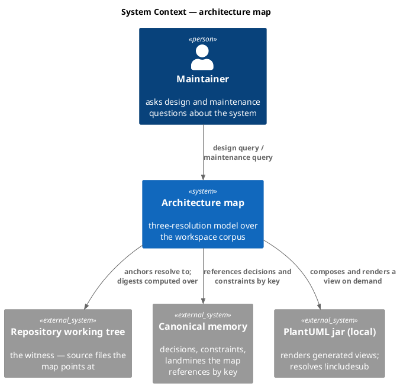

### C4 — Container

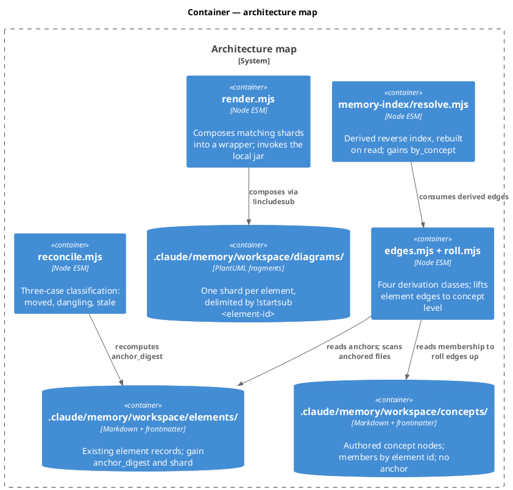

### C4 — Component (changed containers only)

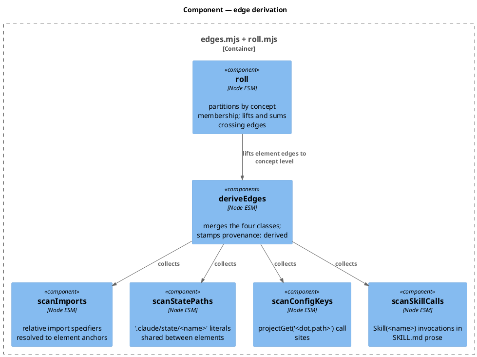

### Data model — class diagram

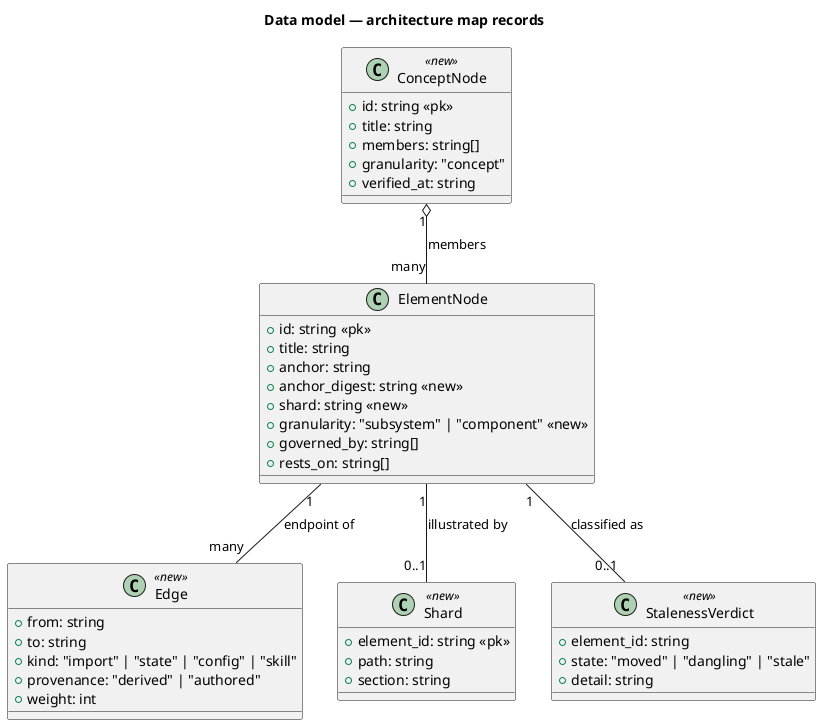

#### Migration

There is no SQL store; the migration is additive frontmatter over the file-backed corpus.

```text
-- forward
1. add .claude/memory/workspace/concepts/<id>.md            (15 new records)
2. add field  anchor_digest: <sha256-12 of exported surface>  to each elements/<id>.md
3. add field  shard: diagrams/<id>.puml                       to each elements/<id>.md that has one
4. add field  granularity: subsystem|component                to each elements/<id>.md (derived from anchor shape)
5. add .claude/memory/workspace/diagrams/<id>.puml           (one per element, !startsub <id>)

-- reverse
5..1 delete the added directories and strip the three added fields; the 14 pre-existing
     element records return byte-identical to their pre-migration form.
```

### Behavior — sequence per AC

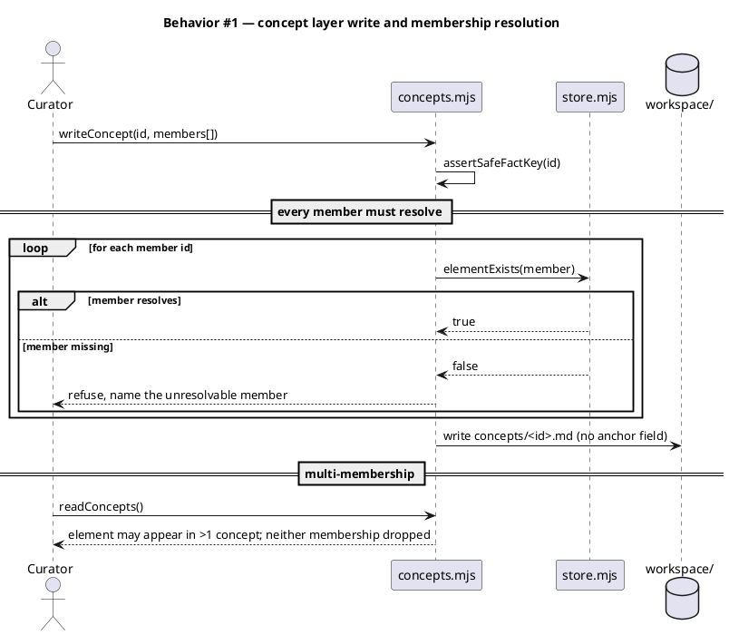

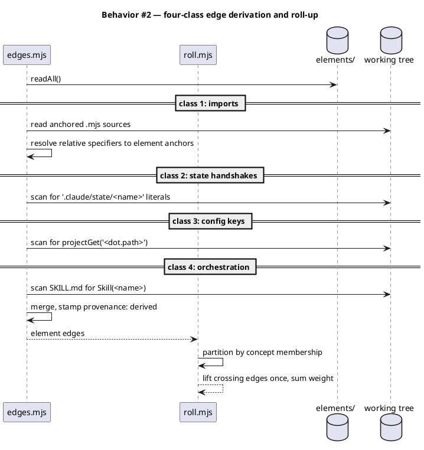

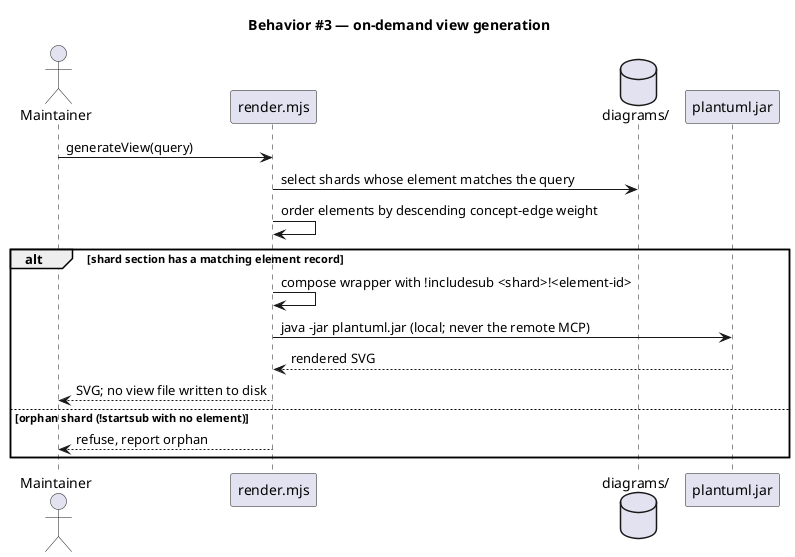

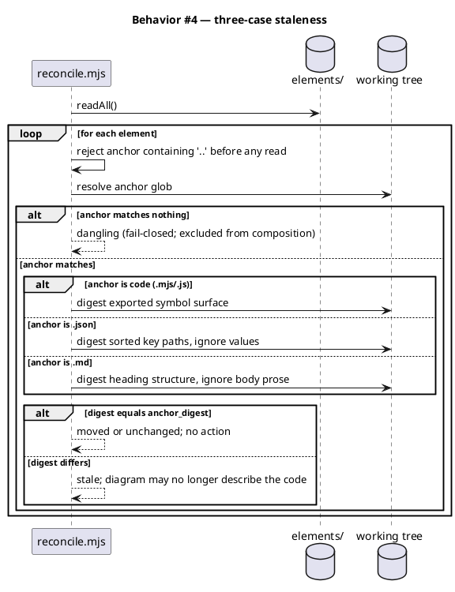

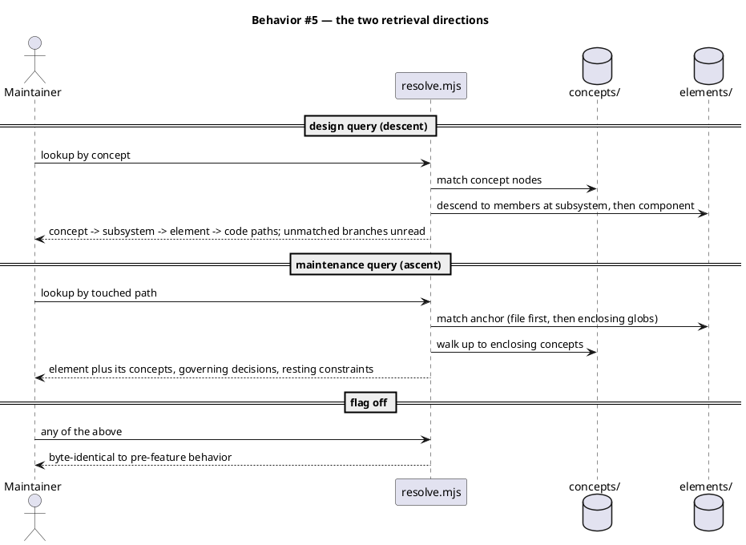

### State — core entity

An element's honesty state is the only non-trivial state machine.

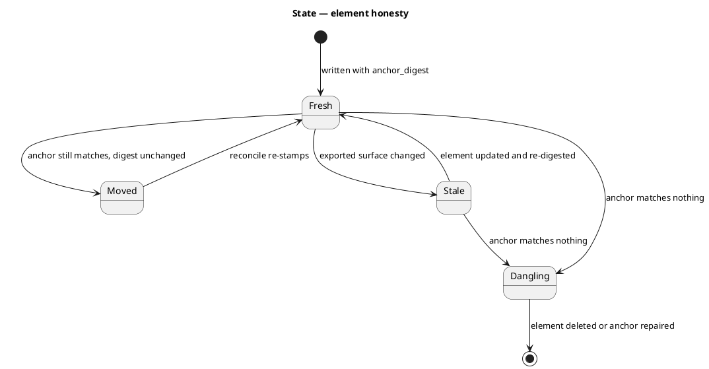

### Dependencies — graph

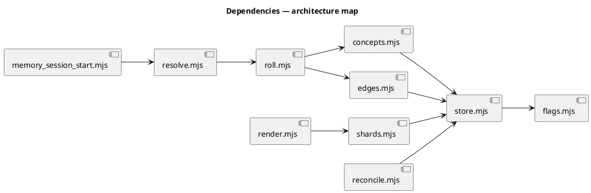

### Contracts

| Kind | Name | Input | Output | Errors | Idempotent |
|---|---|---|---|---|---|
| Module | `concepts.writeConcept(memDir, id, {title, members[]})` | id, member element ids | `{written: true, id}` | throws on unsafe id; refuses on unresolvable member | yes |
| Module | `concepts.readConcepts(memDir)` | — | `ConceptNode[]` | `[]` when the directory is absent | yes |
| Module | `edges.deriveEdges(rootDir, elements)` | element records | `Edge[]` with `provenance: "derived"` | `[]` on unreadable source; never throws | yes |
| Module | `roll.roll(edges, concepts)` | element edges, concept membership | concept-level `Edge[]`, `weight` summed over crossing edges (consumed by `generateView` ordering — D12) | `[]` when membership is empty | yes |
| Module | `shards.readShard(memDir, elementId)` | element id | `{path, section, body}` or `null` | `null` when no shard exists | yes |
| Module | `render.generateView(memDir, query, {jarPath})` | selector over elements | rendered SVG bytes; elements ordered by descending concept-edge weight | refuses orphan section; non-zero jar exit surfaces as an error | yes |
| Module | `reconcile.classify(memDir, {touchedPaths})` | touched paths | `StalenessVerdict[]` | rejects `..` in an anchor before any read | yes |
| Module | `reconcile.digestFor(path)` | anchored file path | sha256-12 over the file's structural interface — exported symbols (`.mjs`/`.js`), sorted key paths (`.json`), heading structure (`.md`), whole file otherwise | throws on traversal; `null` when the path does not resolve | yes |
| Module | `resolve.resolveLookup('by_concept', needle, {rootDir})` | concept id or path | matching elements + enclosing concepts | `[]` on miss, never throws | yes |
| Module | `concepts.conceptsFor(memDir, elementId)` | element id | `ConceptNode[]` — every concept whose `members` names it | `[]` on miss, never throws | yes |
| Module | `render.composeView(memDir, query)` | selector over elements, optional `weights` | the composed wrapper TEXT (`@startuml … !includesub … @enduml`) | refuses an orphan section; `[]`-empty query yields an empty diagram | yes |
| Module | `render.findOrphanShards(memDir)` | — | shard sections whose `!startsub` name resolves to no element | `[]` when none | yes |
| Module | `shards.findUnillustrated(memDir)` | — | element ids carrying no shard (advisory, never an error) | `[]` when none | yes |
| Module | `reconcile.composableElements(memDir, {rootDir})` | — | element ids eligible for composition, `dangling` excluded | `[]` when the corpus is empty | yes |
| Module | `memory_session_start.renderConceptMap(memDir, {rootDir})` | — | the concept-map block injected at session start | `''` when `memory.architecture_map.enabled` is false or absent | yes |

**No CLI surface.** An earlier draft pinned `node .claude/skills/workspace/render.mjs <query>`. It is dropped: no AC covers it and no scenario drives it, and Article VI.4 is explicit that code without a test exercising it shall not exist. View generation is reachable through `generateView`; a CLI arrives when something needs to call it from a shell, with its own AC.

**Why `composeView` is separate from `generateView`.** Composition is pure and rendering spawns a JVM. Splitting them is the Domain/Foundation boundary (`code-structure`), and it is also what keeps AC-009 provable in the default test suite: the render is opt-in behind `PLANTUML_TESTS`, so if composition were only reachable through `generateView` its sole coverage would be a skipped test. `generateView` is `composeView` plus the jar invocation.

### Libraries and versions

| Library@version | Purpose | Key APIs | Confirmed against current docs |
|---|---|---|---|
| `plantuml@1.2026.2` | compose and render generated views | `!include`, `!startsub NAME` / `!endsub`, `!includesub <file>!NAME`, `-checkonly`, `-tsvg` | yes — context7 2026-08-05, plus local end-to-end verification (`-checkonly` PASS, `-tsvg` PASS) |
| `node@25.8.1` built-ins | fs, path, crypto (sha256), child_process | `readFileSync`, `createHash`, `spawnSync` | yes — existing pinned entry `node-test-node-25-8-1` |

No new runtime dependency. Rendering requires a JVM: OpenJDK 17.0.17 (Zulu) is present at `/Library/Java/JavaVirtualMachines/zulu-17.jdk`, and the jar is vendored at `.claude/bin/plantuml.jar`.

### Alternatives considered

| Alt | Summary | Rejected because |
|---|---|---|
| A | Keep records only; no diagrams at all | The record format costs ~60 tok/node against C4's ~26 tok/fact and carries no edges. It is not cheaper, only emptier. |
| B | Store monolithic C4 views per subsystem | Retrieval becomes O(system size) per query. Measured: 355 tok to answer what a shard answers in 92, and the gap widens every cycle. |
| C | Model-proposes / human-ratifies edges (the prior art's D1) | Correct for prose correlations, wrong here: our edges have a parser. Adopting it would import a ratification cost the source marks *unproven* at realistic corpus size, to gate facts a scanner can verify. |
| D | Derive concept membership by clustering the import graph | The concepts that matter most are cross-cutting and import-poor — `consent-gates` spans 29 files that barely import each other. Clustering would produce the filesystem, relabelled. |
| E | Add a fourth `roll()` level above concepts | The prior art's own register marks concept-count saturation unverified. Measured here at 15 nodes ≈ 1k tokens, a further roll-up buys nothing and inherits the risk. |
| F | Parse C4 declarations to recover anchors | Only 37% of labels are path-like; the rest are external actors or subsystem groupings. The parse would silently mis-anchor 63% of declarations. |

## Design calls

The write set does not intersect `project.json → tdd.ui_globs` (no `site-src/**`, no `.html`/`.css`/`.njk`, no component sources). No UI surface.

- *(none)*

## Acceptance criteria

| ID | Criterion (given / when / then) | Kind | Upstream AC | Sequence | Ticket |
|---|---|---|---|---|---|
| AC-001 | Given a concept record naming a member that does not resolve to an element, when the concept is written, then the write is refused and the response names the unresolvable member. | preflight | vision §3.3 | §Behavior #1 | A |
| AC-002 | Given a file that belongs to two concepts, when the concept layer is read, then both memberships resolve and neither is dropped. | behavior | vision §3.3 | §Behavior #1 | A |
| AC-003 | Given a concept record, when it is read, then it carries no `anchor` field and reports `granularity: concept`. | behavior | vision §3.3 | §Behavior #1 | A |
| AC-004 | Given an element whose anchored source imports another element's anchor, when derivation runs, then an edge exists from the first to the second with `kind: import` and `provenance: derived`. | behavior | vision §3.5 | §Behavior #2 | B |
| AC-005 | Given two elements referencing the same `.claude/state/<name>` literal, when derivation runs, then a `kind: state` edge links them with `provenance: derived`. | behavior | vision §3.5 | §Behavior #2 | B |
| AC-006 | Given an element whose source calls `projectGet('<dot.path>')`, when derivation runs, then a `kind: config` edge records that dependency. | behavior | vision §3.5 | §Behavior #2 | B |
| AC-007 | Given a SKILL.md containing `Skill(<name>)`, when derivation runs, then a `kind: skill` edge links the invoking element to the invoked one. | behavior | vision §3.5 | §Behavior #2 | B |
| AC-008 | Given derived element edges and concept membership, when `roll` runs, then every edge crossing a concept boundary appears exactly once at concept level with its weight summed. | behavior | vision §3.5 | §Behavior #2 | B |
| AC-009 | Given a shard delimited by `!startsub <element-id>`, when a view is generated whose query matches that element, then the composed document includes the section via `!includesub` and renders without error. | behavior | vision §3.3 | §Behavior #3 | C |
| AC-010 | Given a completed view generation, when the workspace is listed, then no file was created under `workspace/diagrams/` for the view itself and `readAll().views` is still empty. | behavior | epic D3 | §Behavior #3 | C |
| AC-011 | Given a shard whose `!startsub` name matches no element record, when composition runs, then it is refused and reported as an orphan rather than silently included. | error-mapping | vision §3.5 | §Behavior #3 | C |
| AC-012 | Given a view generation request, when rendering occurs, then it invokes the local jar and issues no network call to the remote PlantUML server. | smoke | vision §3.3 | §Behavior #3 | C |
| AC-013 | Given an element whose anchored file changed only in comments, when reconcile runs, then the element is not classified `stale`. | behavior | prior art #R4 | §Behavior #4 | D |
| AC-014 | Given an element whose anchor matches nothing on disk, when reconcile runs, then it is classified `dangling` and excluded from view composition. | behavior | prior art A2 | §Behavior #4 | D |
| AC-015 | Given an element whose anchored file's exported symbol surface changed, when reconcile runs, then it is classified `stale`. | behavior | prior art A2 | §Behavior #4 | D |
| AC-016 | Given an anchor glob containing a `..` traversal segment, when it is resolved, then it is rejected before any filesystem read occurs. | preflight | CWE-22 | §Behavior #4 | D |
| AC-017 | Given a design query naming a concept, when descent runs, then it returns concept → subsystem → element → code paths and reads no unmatched branch. | behavior | vision §1.2 | §Behavior #5 | E |
| AC-018 | Given a touched path, when the maintenance query runs, then it returns the matching element plus its enclosing concepts, governing decisions and resting constraints. | behavior | vision §1.1 | §Behavior #5 | E |
| AC-019 | Given a seeded concept layer, when a session starts, then the injected memory index includes the concept map and the injected block stays within the configured token budget. | behavior | vision §1.11 | §Behavior #5 | E |
| AC-020 | Given `memory.architecture_map.enabled` is false or absent, when any consumer runs, then behavior is byte-identical to the pre-feature baseline. | preflight | D9 | §Behavior #5 | E |
| AC-021 | Given a `.json` anchor whose values changed but whose sorted key paths did not, when reconcile runs, then the element is not classified `stale`. | behavior | D11 | §Behavior #4 | D |
| AC-022 | Given a `.md` anchor whose body prose changed but whose heading structure did not, when reconcile runs, then the element is not classified `stale`. | behavior | D11 | §Behavior #4 | D |
| AC-023 | Given a view spanning concept edges of differing weight, when it is composed, then its elements are ordered by descending concept-edge weight. | behavior | D12 | §Behavior #3 | C |

## Ticket A — Concept layer

**Behavior.** A new authored layer at `.claude/memory/workspace/concepts/`, 15 records, each naming its members by element id. A concept carries no `anchor` — it is the one level whose granularity is authored rather than derived (D1). `writeConcept` refuses any record naming a member that does not resolve, so an invented membership cannot reach disk. Membership is a set and is many-to-many: `git_commit_guard` belongs to both `consent-gates` and `git-policy`, and both memberships survive a read.

**ACs**: AC-001, AC-002, AC-003.

**Write surface**: `.claude/memory/workspace/concepts/`, `.claude/skills/workspace/concepts.mjs`, `.claude/memory/README.md`, `tests/workspace-concepts.test.mjs`.

**Done record**: the 15 nodes exist with verified membership; an unresolvable member refuses the write and is named; multi-membership round-trips; concepts report `granularity: concept` and carry no anchor.

## Ticket B — Edge derivation

**Behavior.** Four scanners over the anchored working tree — relative imports, `.claude/state/<name>` literals, `projectGet('<dot.path>')` call sites, and `Skill(<name>)` in SKILL.md prose — merged into one edge set stamped `provenance: derived`. `roll` partitions by concept membership and lifts each crossing edge exactly once, summing weight (consumed by ticket C per D12). All four classes ship together (D5): imports alone leave `build-distribution`, `project-config` and `design-routing` edgeless, which is an artifact of one scanner rather than a property of those concepts.

**ACs**: AC-004, AC-005, AC-006, AC-007, AC-008.

**Write surface**: `.claude/skills/workspace/edges.mjs`, `.claude/skills/workspace/roll.mjs`, `tests/workspace-edges.test.mjs`.

**Done record**: the 8 import edges measured on the seeded corpus reproduce; each of the other three classes produces at least one edge; every derived edge carries `provenance: derived`; a crossing edge appears once at concept level with summed weight; nothing is authored that a scanner could derive (D4).

## Ticket C — Shards and views

**Behavior.** One PlantUML shard per element at `.claude/memory/workspace/diagrams/<id>.puml`, its model delimited by `!startsub <element-id>`. A view is a query result: select matching elements, order by descending concept-edge weight (D12), compose a wrapper that pulls each shard in via `!includesub`, and render with the local jar. No view file is ever written — epic D3 stands and `readAll().views` stays empty. The remote MCP server is not on the composition path because it cannot resolve local includes.

**ACs**: AC-009, AC-010, AC-011, AC-012, AC-023.

**Write surface**: `.claude/memory/workspace/diagrams/`, `.claude/skills/workspace/shards.mjs`, `.claude/skills/workspace/render.mjs`, `tests/workspace-shards.test.mjs`.

**Done record**: a composed view renders through the local jar; an orphan `!startsub` is refused and reported rather than silently included; no view file lands on disk; element order follows descending weight.

**Risk**: `security` — composes shard files into a generated document and shells out to `java -jar`.

## Ticket D — Staleness

**Behavior.** Elements gain `anchor_digest` over their file's *structural interface*: exported symbols for `.mjs`/`.js`, sorted key paths for `.json`, heading structure for `.md` (D7, D11). `reconcile` classifies three cases — `moved` (anchor matches, digest unchanged; no action), `dangling` (anchor matches nothing; fail-closed, excluded from composition), `stale` (anchor matches, digest moved). Anchors containing a `..` traversal segment are rejected before any filesystem read.

**ACs**: AC-013, AC-014, AC-015, AC-016, AC-021, AC-022.

**Write surface**: `.claude/skills/workspace/reconcile.mjs`, `.claude/skills/workspace/store.mjs`, `tests/workspace-staleness.test.mjs`.

**Done record**: a comment-only code edit, a `.json` value change, and a `.md` prose rewrite all leave the element non-stale; a renamed export, an added `.json` key, and a renamed heading all mark it stale; a vanished anchor is `dangling` and excluded; a traversal anchor is rejected with no filesystem access.

**Risk**: `security` — resolves caller-influenced anchor globs against the filesystem; the path-traversal and ReDoS surface already fixed once in `be48ab9` for this subsystem.

## Ticket E — Retrieval

**Behavior.** Two directions over one structure. A **design query** enters at the concept layer, matches, and descends only matched branches to subsystem, element, then code — this is what replaces re-scouting the codebase. A **maintenance query** enters at a touched path, matches the anchor file-first then by enclosing globs, and walks *up* to the enclosing concepts, their governing decisions and resting constraints. The concept map is injected at session start in place of the stale-count table. Per D8 the map routes and the code witnesses: no generated view is ever cited as evidence.

**ACs**: AC-017, AC-018, AC-019, AC-020.

**Write surface**: `.claude/hooks/lib/memory_session_start.mjs`, `.claude/skills/memory-index/resolve.mjs`, `.claude/skills/scout/SKILL.md`, `tests/workspace-retrieval.test.mjs`.

**Done record**: a design query returns the descent path without reading unmatched branches; a maintenance query returns the element plus its concepts; session start carries the concept map within budget; with the flag off every path is byte-identical to the pre-feature baseline.

**Risk**: `security` — touches `.claude/hooks/**` (`security.sensitive_globs`).

## Test plan

| Category | Scenario | Expected | Covers |
|---|---|---|---|
| Golden path | Write a concept whose 5 members all resolve | written; readable; `granularity: concept` | AC-001, AC-003 |
| Golden path | Derive edges over the seeded corpus | ≥ 8 import edges reproduced, all `provenance: derived` | AC-004 |
| Golden path | Two elements share `.claude/state/workflow` | state edge present | AC-005 |
| Golden path | Element calls `projectGet('git.workflow_model')` | config edge present | AC-006 |
| Golden path | `document/SKILL.md` invokes `Skill(humanizer)` | skill edge present | AC-007 |
| Golden path | Compose a view from two element shards and render | SVG bytes returned; exit 0 | AC-009, AC-012 |
| Golden path | Touch `hooks/lib/common.mjs`; run the maintenance query | returns the element plus `guard-substrate` | AC-018 |
| Boundary | A file listed in two concepts | both memberships returned, order-stable | AC-002 |
| Boundary | Edge crossing a concept boundary twice at element level | one concept edge, weight 2 | AC-008 |
| Boundary | Element with an anchor but no shard | reported unillustrated (advisory), not an error | AC-011 |
| Input boundary | Concept member id with `../` | refused before any read | AC-001, AC-016 |
| Input boundary | Anchor glob `.claude/../../etc/**` | rejected, no filesystem access | AC-016 |
| Contract violation | Shard `!startsub` naming a deleted element | refused; reported orphan | AC-011 |
| Contract violation | Concept naming a member that never existed | write refused, member named | AC-001 |
| Failure mode | `plantuml.jar` absent | non-zero exit surfaced as an error, no silent fallback to the remote server | AC-012 |
| Failure mode | Anchored file deleted between derivation and reconcile | classified `dangling`, excluded from composition | AC-014 |
| Concurrency / ordering | Two contributions add elements to the same concept | both survive; membership is a set | AC-002 |
| Regression trap | Comment-only edit to an anchored file | not `stale` | AC-013 |
| Regression trap | Exported symbol renamed | `stale` | AC-015 |
| Regression trap | `.json` anchor: a value changes, key paths unchanged | not `stale` | AC-021 |
| Regression trap | `.json` anchor: a key is added | `stale` | AC-021 |
| Regression trap | `.md` anchor: body prose rewritten, headings unchanged | not `stale` | AC-022 |
| Regression trap | `.md` anchor: a `##` heading renamed | `stale` | AC-022 |
| Boundary | View over edges of weight 3, 1, 2 | element order is 3, 2, 1 | AC-023 |
| Regression trap | Flag off — full workspace + session-start suite | byte-identical to baseline | AC-020 |
| Regression trap | `readAll()` after a view generation | `views` still empty | AC-010 |
| Regression trap | Existing `tests/workspace-*.test.mjs` suite | unchanged and passing | — |
| Regression trap | Session-start injection with flag off | current payload unchanged | AC-019, AC-020 |

## Observability

| Signal | Name | Shape | Purpose |
|---|---|---|---|
| Log | `workspace.derive` | fields: `elements`, `edges_by_kind{}`, `unresolved`, `ms` | see derivation coverage change over cycles |
| Log | `workspace.reconcile` | fields: `moved`, `dangling`, `stale`, `unillustrated` | the honesty reading for the cycle |
| Log | `workspace.view` | fields: `query`, `shards`, `jar_exit`, `ms` | prove the local-jar path and catch render regressions |
| Metric | `workspace_concept_count` | gauge | saturation check: this is the number that must not grow with the corpus |
| Metric | `workspace_stale_ratio` | gauge (`stale / elements`) | the model-rot signal D8 exists to bound |

## Rollout

### Prerequisites

| # | Prerequisite | enforced-by |
|---|---|---|
| 1 | Concept membership is verified against disk before any consumer reads the map | AC-001 |
| 2 | Orphan shards are refused before view generation is offered to a consumer | AC-011 |
| 3 | Anchor and member ids reject `..` traversal before any filesystem read | AC-016 |
| 4 | The feature flag off-path is proven byte-identical before the flag ships enabled anywhere | AC-020 |
| 5 | The local-jar render path is proven, with no remote-server fallback | AC-012 |

- **Feature flag**: `memory.architecture_map.enabled` — default **false**, and **absent** from `src/project.template.json` so every consumer reads false. Enabled in this repository only (canary), matching how `memory.workspace.enabled` shipped.
- **Migration order**: 1 concepts written and verified → 2 element fields backfilled (`granularity`, `anchor_digest`) → 3 shards authored → 4 derivation + roll wired → 5 retrieval and session-start surfacing enabled last.
- **Canary**: this repository, one full workflow cycle. Success signal is `workspace_stale_ratio` reading a real number and `scout` reporting a delta naming only touched elements.

## Rollback

- **Kill-switch**: set `memory.architecture_map.enabled` to `false`. Scout returns to its current reconcile path, session-start returns to the current payload, and the corpus stays on disk, inert — the same rollback shape `memory.workspace.enabled` already carries.
- **Signal to roll back**: `workspace_stale_ratio` above 0.3 at any reconcile, or `scout` reporting a delta naming every element (a delta that names everything is a re-derivation wearing a delta's clothes). Either trips within one cycle.

## Archive plan

- Defaults *(automatic)*: spec, spec approval, security reports (per ticket, concatenated), timing, workflow.json.
- Extras *(list any non-default files)*:
  - *(none)*

## Open questions

The five questions this spec opened were settled at gate A on 2026-08-05 and are recorded as D10, D11 and D12. What remains open is evidence quality, not design:

- **The saturation measure is a proxy.** Concept-count boundedness rests on top-level directory count (11 → 12 while files went 273 → 695). Directories approximate concepts; they are not concepts. The measure supports the ~15-node bound but does not prove it, and the reviewed prior art carries the same assumption unverified (its L14). Falsified by: the concept set needing a 16th and 17th node within two cycles.
- **The 77% locality figure was measured on imports alone.** Ticket B adds three more edge classes, and state/config/skill edges are exactly the cross-cutting kind that may lower intra-concept locality. The partition-quality claim should be recomputed after B lands, and D10(a) — keeping `memory-model` merged — is explicitly waiting on that number.
- **Deferred by dependency, not open:** splitting `memory-model` into store and surfacing. `deferred: dependency` — it depends on the recomputed locality measure above. Splitting later is a membership edit, not a schema change, so nothing in this spec forecloses it.
