# Spec — central system spec: a diagram-driven source of truth that per-work specs diff against

## Context

| Input | Path |
|---|---|
| Intake | *(excepted — `power` DAG has no `intake` node)* |
| BRD | *(none)* |
| Scout | *(excepted — `power` DAG has no `scout` node)* |
| Research | *(excepted — `power` DAG has no `research` node)* |
| Approved plan | `.config/plans/very-well-i-accept-sprightly-clover.md` |
| Predecessor spec (machinery) | `docs/archive/2026-08-05/architecture-map/spec.md` |
| Predecessor spec (coverage + curation) | `docs/archive/2026-08-06/workspace-corpus-backfill/spec.md` |
| Epic that produced the corpus | `docs/archive/2026-08-04/living-system-model/spec.md` |

**Write set**: `docs/init/seed.md`, `src/seed.template.md`, `CLAUDE.md`, `src/CLAUDE.template.md`, `.claude/CONSTITUTION.md`, `.claude/memory/decisions/**`, `.claude/memory/workspace/**`, `.claude/memory/README.md`, `docs/system/**`, `.claude/hooks/lib/write-set-profile.mjs`, `.claude/hooks/lib/memory_session_start.mjs`, `.claude/hooks/spec_diagram_presence_guard.mjs`, `.claude/skills/workspace/*.mjs`, `.claude/skills/memory-index/resolve.mjs`, `.claude/skills/scout/SKILL.md`, `.claude/skills/spec/SKILL.md`, `.claude/skills/spec/template.md`, `.claude/skills/memory-flush/SKILL.md`, `.claude/skills/code-structure/SKILL.md`, `.claude/skills/archive/SKILL.md`, `.claude/commands/spec-sync.md`, `.claude/project.json`, `scripts/build-manifest.mjs`, `tests/**` — touches `.claude/hooks/**` (a `security.sensitive_globs` path) and `src/**`, so the `non-architectural` profile does not cover it and the **full** C4 set is required.

### Blast-radius evidence

Discovery phases are excepted on this track, so the evidence they would have produced is recorded here. Every row was measured against `HEAD` = `d4e6216` on 2026-08-06.

| Finding | Measurement | Consequence for this spec |
|---|---|---|
| Archived specs cannot source a system model | 359 of 526 governed files (**68%**) appear in no spec, archived or live — including `env_guard`, `destructive_cmd_guard`, `memory_stop`, `memory_session_start`, `memory_pre_compact`, `harness_continuation`, `plantuml_syntax_guard`, `artifact_template_guard`, `gitignore_leak_guard`, the thread-shelving lib, and the consent commands | Non-goal: no archived-spec import. The corpus is rebuilt from code and grown forward |
| The gap is structural, not accidental | `chore`, `freeform` and `tdd`-entry tracks have no `spec` node; work predating Phase 4 never had one | A bulk migration's hole is invisible from inside the migration |
| Even covered specs yield unanchored nodes | 37% of C4 labels are path-like (27% external, 46% subsystem groupings); 1,158 `Component(`/`Container(`/`System(` declarations across 108 point-in-time documents | Migrated nodes would carry no anchor, so nothing could witness them |
| Baseline ships its own model to consumers | `obj/template/.claude/memory/workspace/` carries 15 concepts + 112 elements + 112 diagrams of baseline internals. Elements ship tier `MECHANICAL` (silently overwritten on upgrade); diagrams ship tier `BINARY_PROMPT` → **112 interactive prompts per upgrade**. Canonical memory ships pristine from `src/memory/*.template.md`; `workspace/` has no template mirror | Slice A2 fixes this as a side effect of relocation |
| Consumers cannot declare their own surface | `GOVERNED_SURFACE` and `CONCEPT_ANCHORS` are hardcoded in `.claude/skills/workspace/seed-map.mjs`, a baseline-owned manifest-hashed file. A consumer edit trips Article XII hash drift, which has no opt-out | Slice B moves both out of shipped code |
| One authored file is the git conflict hot spot | Every cycle that adds an element edits `seed-map.mjs`. Records are already one-file-per-entity with no on-disk aggregate index (the derived index is rebuilt on read: 17.5 ms over 239 entries) | Slice B's per-concept split is also the merge fix |
| The genesis doc never learned about the corpus | `docs/init/seed.md` matches zero of `architecture_map|workspace/|corpus|concept layer|anchor_digest|seed-map`. §4 lists hooks, subagents, skills, commands, MCP servers, state files and required diagram kinds — the 239-file corpus, its three flags and its 20 helpers appear nowhere | Article I.1/I.4 make slice A1 blocking |
| The write leg was never wired | `.claude/skills/workspace/contribute.mjs → applyContribution` exists with a test suite and **zero callers**; `.claude/skills/spec/SKILL.md` contains no reference to the corpus | Slices D and E |

## Goal

The system's structural model lives at `docs/system/` as a committed, diagram-driven spec that `scout` and `research` read instead of the source tree; a per-work spec satisfies a required diagram kind by referencing that model rather than re-deriving it; `/archive` folds each landed change back into the model; and a project that is not this repository can build and own the same model for its own surface.

## Non-goals

- **No archived-spec import.** Carried forward from the architecture-map spec and re-justified by the 68% coverage measurement above.
- **No model-proposed edges.** Every edge stays compiler-derivable or human-authored; there is no third, asserted class.
- **No inference of concept membership.** Concepts stay authored (seed-cycle D6). Slice B changes the *file layout* of the authored map, never its authorship.
- **No rendered-view artifact.** `readAll().views` stays empty and composed views stay generated on demand. This spec relocates *authored records*; it does not introduce a stored render.
- **No new runtime dependency.** Constraint `zero-runtime-dependencies` holds.
- **No JVM-backed diagram validation.** Constraint `no-jvm-available` holds; `plantuml_syntax_guard` stays advisory.
- **No change to the default-off shipping posture.** Every flag ships absent or false; consumer installs are inert until they opt in.

## Decisions

Recorded per Article XI.12 — routine engineering choices decided in main context and reviewed at gate A rather than asked. Rows D1–D3 supersede ratified decisions and are the reason slice A1 must land first.

| # | Decision | Rationale | Owner |
|---|---|---|---|
| D1 | **Supersedes architecture-map D2.** The durable-diagram restriction changes from a *kind whitelist* (structure and validator-backed data shapes only) to a **witness rule**: a durable diagram declares a witness, which may be an `anchor-digest`, a named `test`, or `none`. | D2's stated rationale is falsifiability — "a diagram the reconcile pass can check against code can be kept honest; one it cannot is a claim nobody can falsify." The kind exclusion was a proxy for that property, forced by `anchor_digest` covering only an exported-symbol surface. Tests supply the missing surface for behavioral diagrams, so the property can be enforced directly instead of approximated by kind. This is what lets a consumer model a domain baseline does not have. | **engineer** |
| D2 | **Clarifies architecture-map D3.** "No stored views" governs *composed* views (`readAll().views` stays empty, `generateView` output is never written). Authored records are not views, so relocating them to `docs/system/` does not engage D3. | D3's rationale was preventing a second source that can disagree with the first. A moved record is the same single source at a different path; a rendered composition would be the second source D3 forbids, and this spec does not create one. Stating it explicitly stops the next reader re-deriving the distinction. | Claude |
| D3 | **Narrows architecture-map D8.** "No generated view is ever cited as evidence" becomes: a diagram whose witness is `none` is never citable. A diagram with a resolvable `anchor-digest` or `test` witness may be cited. | D8 bounded the honesty hazard by assuming nothing could falsify a diagram. Once a witness exists and is checked, the assumption no longer holds for that diagram. The bound is preserved exactly where it still applies — the unwitnessed tier — and the routing-not-evidence rule stays the default for anything unwitnessed. | **engineer** |
| D4 | **The corpus moves to `docs/system/` and stops being memory.** `CANONICAL` stays at eight categories; the memory README's corpus section moves with it. | A source of truth that per-work specs diff against is a reviewed spec artifact, not a self-healing memory register. Article IX memory "accelerates triage; it NEVER authorizes a skip" — a model that substitutes for reading code does exactly what that clause forbids of memory. Relocation also drops the corpus from the shipped manifest, because `obj/template/docs/` ships only `init/`. | **engineer** |
| D5 | **The relocation is the consumer fix; no template mirror is added.** `docs/system/` is simply absent from the shipped template. | The alternative — a `src/system.template/` pristine mirror alongside `src/memory/*.template.md` — would ship an empty scaffold a consumer still cannot populate without slice B. Shipping nothing is both smaller and more honest: a consumer's `docs/system/` is created by `/spec-sync`, from their own tree. | Claude |
| D6 | **`GOVERNED_SURFACE` absent from config is an error, not a default.** `coverage`/`materialize` refuse with a named error naming the config key. | REJECT-never-guess, consistent with `assertNoTraversal` and `conflicts.duplicateAnchor`. Falling back to baseline's own roots would silently model a consumer's `.claude/` and report total coverage over a surface that is not theirs — a wrong answer that looks like a right one. | **engineer** |
| D7 | **Element ids are derived from the anchor, not authored.** A stable slug function over the anchor path replaces the hand-written `id:` in the concept→anchor map. | Two branches deriving the same anchor must produce the same filename, or a merge yields two records for one anchor — which `conflicts.duplicateAnchor` then rejects, turning a mechanical merge into manual repair. Derivation is also what makes `/spec-sync` possible at all: it materializes from a scan, where no human has authored ids. | **engineer** |
| D8 | **Corpus writes route through `/archive` on the primary tree; swarm workers never write the corpus.** | One writer removes wave races by construction rather than by lock. `swarm_boundary_guard` already enforces `write_set` discipline, so a worker attempting a corpus write is denied — this decision makes that denial correct-by-design instead of an obstacle to work around. | Claude |
| D9 | **`/spec-sync` step 2 (human confirms the concept map) is unconditional.** No `--yes`, no non-interactive path. | Seed-cycle D6 and backfill D5 both hold that concept membership is authored. An unattended `/spec-sync` would infer it, which is the one thing every prior decision in this lineage refuses. The human authors ~15 rows; the machine materializes ~110 records from them. | **engineer** |

## Design

Diagrams are the contract. Prose is only for what a diagram cannot say.

### C4 — System context

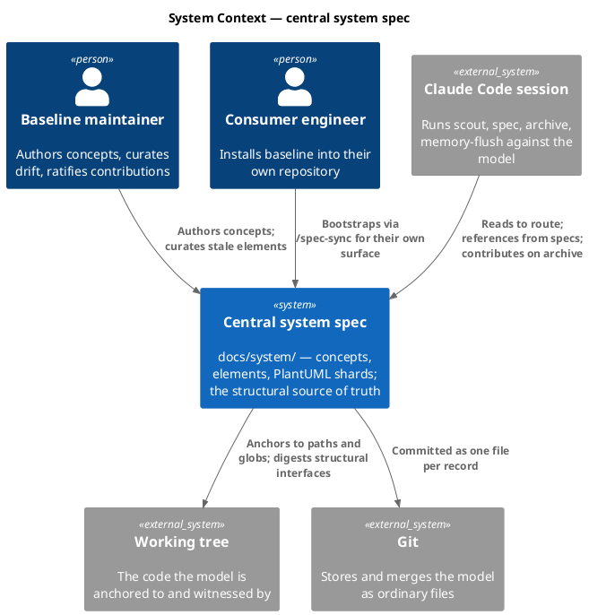

### C4 — Container

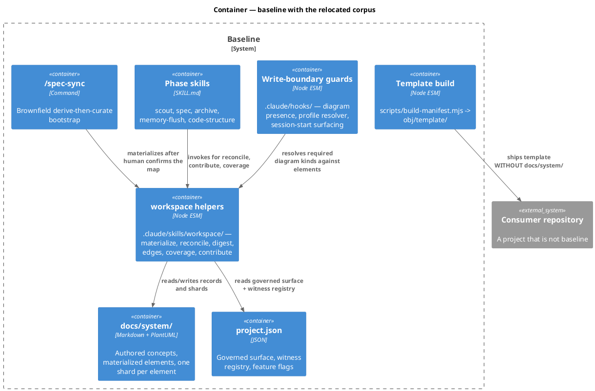

### C4 — Component (changed container: workspace helpers)

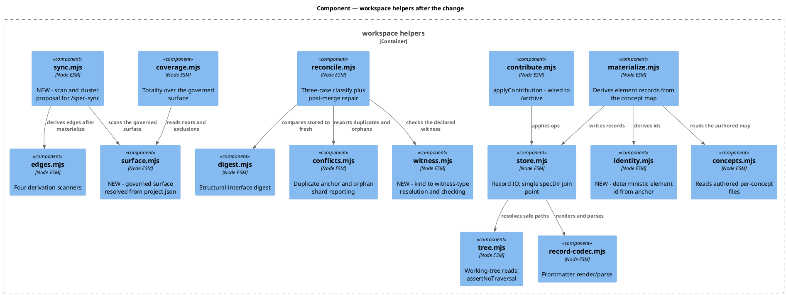

### Data model — class diagram

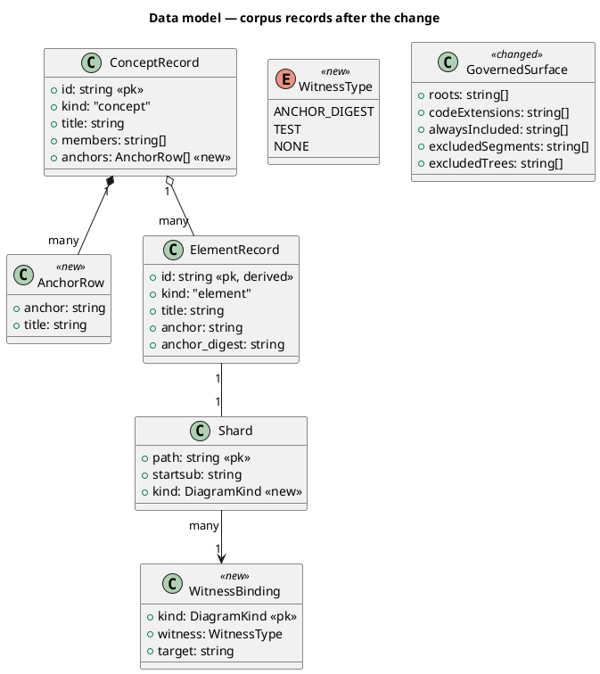

#### Migration DDL

There is no SQL store. The migration is a file move plus additive frontmatter over the file-backed corpus, and it is reversible by inverting each step.

```sql
-- forward (file-level; executed by the slice A2 and B implementations)
-- 1. git mv .claude/memory/workspace/{concepts,elements,diagrams} docs/system/
-- 2. ALTER ConceptRecord ADD COLUMN anchors      -- authored rows lifted out of seed-map.mjs
-- 3. ALTER Shard         ADD COLUMN kind         -- defaults to c4_component for existing shards
-- 4. CREATE WitnessBinding                       -- project.json -> memory.architecture_map.witnesses
-- 5. MOVE GovernedSurface FROM seed-map.mjs TO project.json
-- 6. DROP seed-map.mjs
-- 7. DELETE FROM shipped_manifest WHERE path LIKE '.claude/memory/workspace/%'

-- reverse
-- 7'. rebuild the template; the manifest regenerates from disk
-- 6'..5'. restore seed-map.mjs from git history with GOVERNED_SURFACE inlined
-- 4'..3'. drop the witness registry key and the shard kind field (readers default to anchor-digest)
-- 2'. drop the anchors column (materialize falls back to CONCEPT_ANCHORS)
-- 1'. git mv docs/system/{concepts,elements,diagrams} .claude/memory/workspace/
```

### Behavior — sequence per AC

Each slice has one sequence; `==` dividers separate the acceptance criteria inside it. The AC table names both the section and its divider.

#### §Behavior #1 — slice A1, genesis amendment

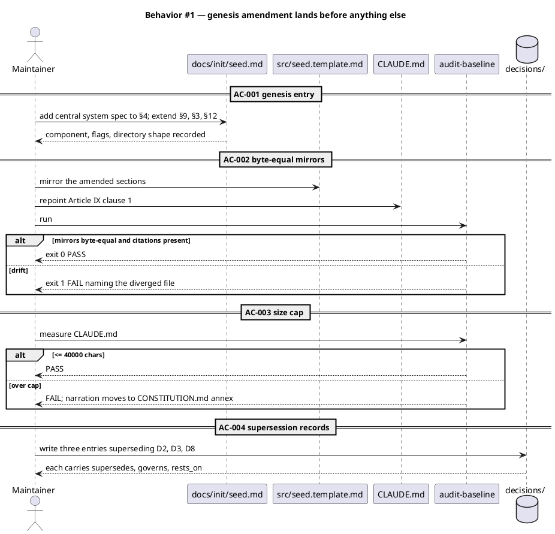

#### §Behavior #2 — slice A2, relocation

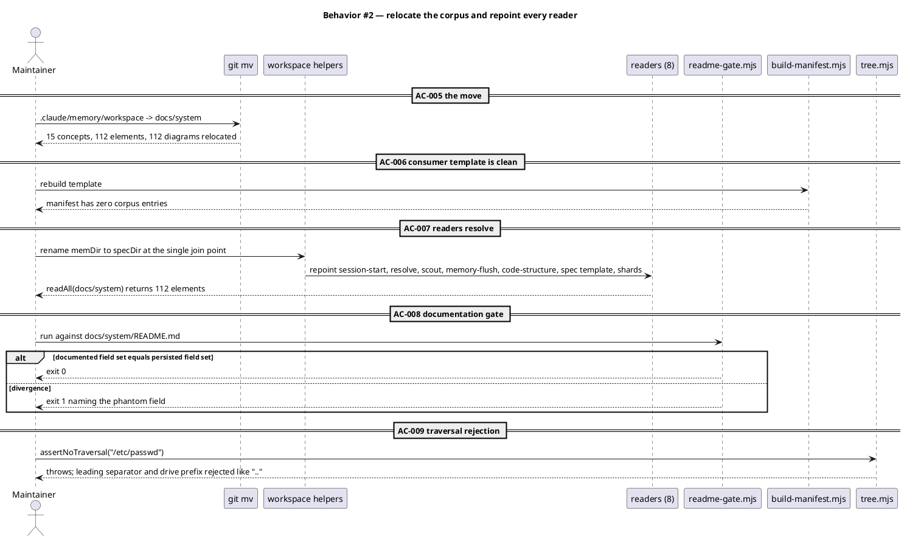

#### §Behavior #3 — slice B, consumer-general authoring surface

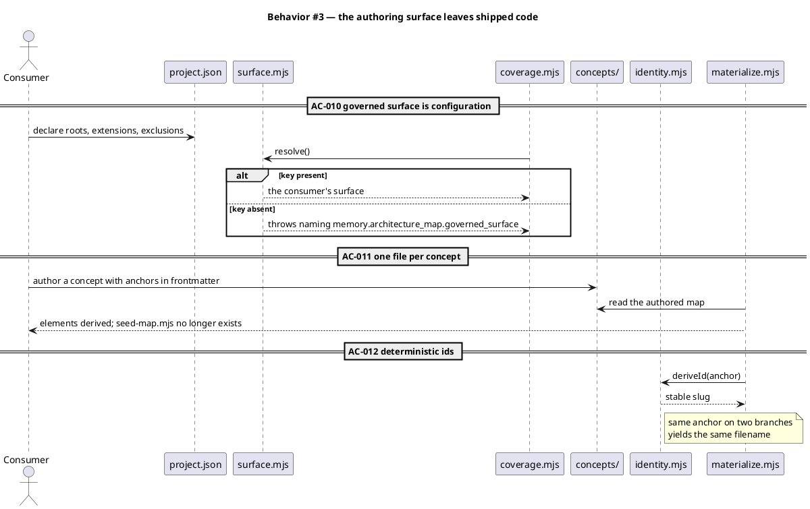

#### §Behavior #4 — slice C, diagram-kind and witness registry

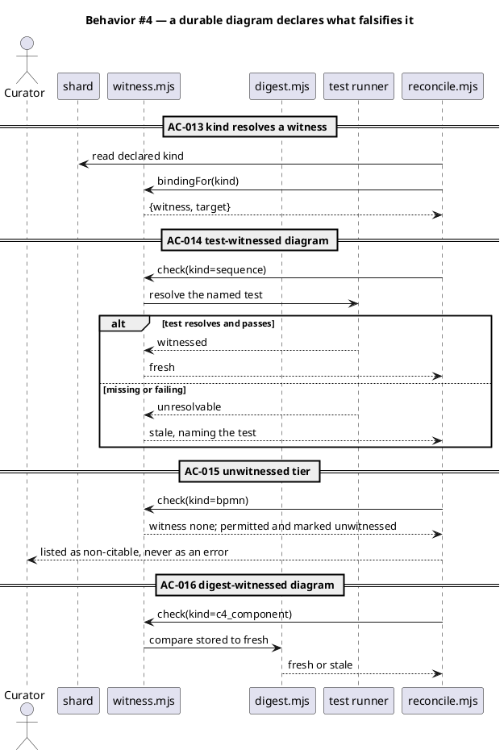

#### §Behavior #5 — slice D, spec-as-diff

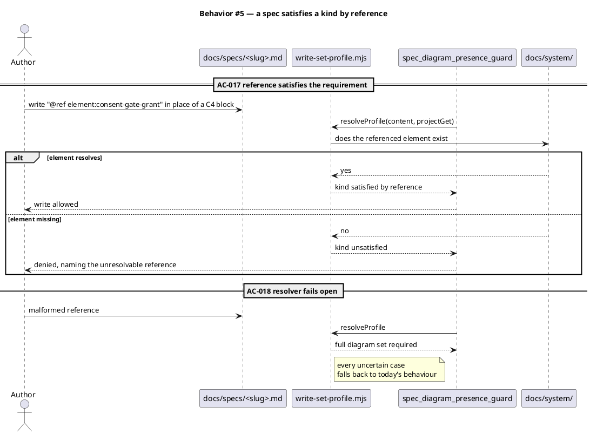

#### §Behavior #6 — slice E, `/archive` sync-back

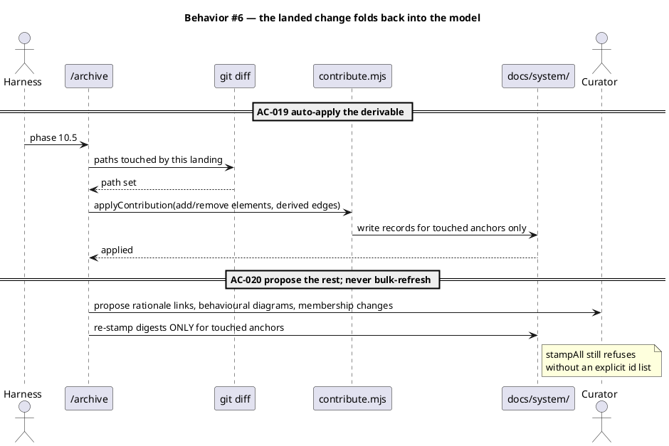

#### §Behavior #7 — slice F, `/spec-sync` and merge semantics

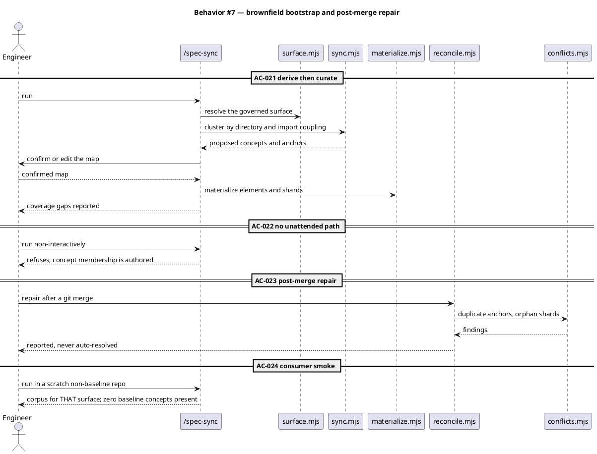

### State — element freshness

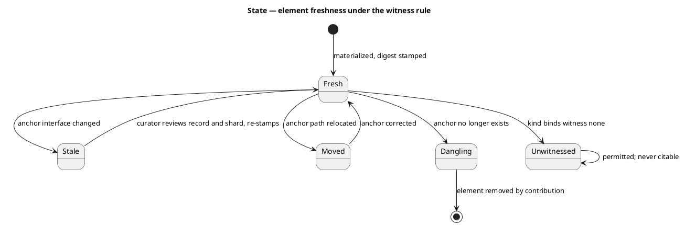

A glob-anchored element names a family rather than a file, so it has no single interface to digest and reconciliation reports it as `Moved` rather than `Stale`. That behaviour is unchanged by this spec.

### Dependencies — graph

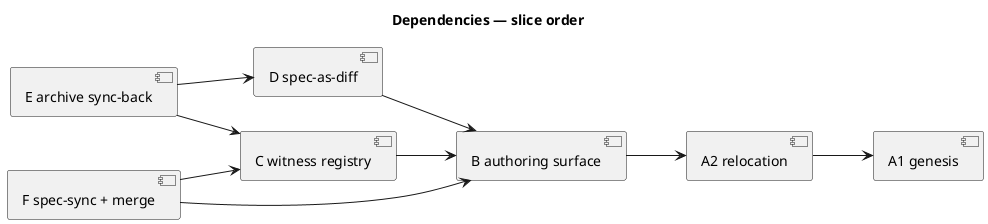

Wave order follows the graph: `A1 → A2 → B → {C, D} → {E, F}`.

### Contracts

| Kind | Name | Input | Output | Errors | Idempotent |
|---|---|---|---|---|---|
| Module | `surface.resolve({rootDir})` | project root | `GovernedSurface` | throws `governed-surface-unconfigured` naming the key | yes |
| Module | `identity.deriveId(anchor)` | anchor path or glob | stable slug string | throws on empty or traversing anchor | yes |
| Module | `witness.bindingFor(kind, {projectGet})` | diagram kind | `{witness, target}` | unknown kind → `{witness: "none"}` | yes |
| Module | `witness.check(element, shard, {rootDir})` | element + shard | `fresh \| stale \| unwitnessed` | resolution failure → `stale` with reason | yes |
| Module | `reconcile.repairAfterMerge({specDir})` | corpus dir | `{duplicateAnchors[], orphanShards[]}` | never throws on findings; reports | yes |
| Module | `contribute.applyContribution({specDir, slug, ops})` | op list | applied op count | absent workspace → `{ready:false}` preflight | yes |
| CLI | `/spec-sync` | none | materialized corpus + coverage report | refuses non-interactively | yes (re-runnable) |
| CLI | `readme-gate.mjs` | none | exit 0 / 1 | exit 1 names the phantom field | yes |
| Config | `memory.architecture_map.governed_surface` | — | `GovernedSurface` | absent → helpers throw (D6) | — |
| Config | `memory.architecture_map.witnesses` | — | `WitnessBinding[]` | absent → every kind binds `none` | — |

### Libraries and versions

| Library@version | Purpose | Key APIs | Confirmed against current docs |
|---|---|---|---|
| Node.js builtins @ `>=18.17.0` | All helper IO, hashing, path handling | `node:fs`, `node:path`, `node:crypto.createHash`, `node:test` | yes — `engines` pin in `package.json`; no third-party runtime dependency is added, per constraint `zero-runtime-dependencies` |
| PlantUML C4 stdlib | Diagram includes in shards and this spec | `!include <C4/C4_Context|C4_Container|C4_Component>`, `!startsub` / `!includesub` | yes — `!includesub` verified end-to-end during the architecture-map cycle (2026-08-05, `-checkonly` PASS, `-tsvg` PASS) |

No new third-party library is introduced, so there is no new API surface to confirm.

### Alternatives considered

| Alt | Summary | Rejected because |
|---|---|---|
| A | Migrate the 108 archived specs into the corpus as the first draft, then validate against code | 68% of governed files appear in no spec, so validation becomes authoring for two thirds of the system — option B wearing A's clothes, after paying for A. The hole is also invisible from inside the migration |
| B | Keep the corpus under `.claude/memory/workspace/` and publish a rendered spec into `docs/` | Creates the second source D3 forbids: a committed render that can disagree with the records it came from |
| C | Ship a pristine `src/system.template/` mirror so consumers get an empty scaffold | An empty scaffold is unusable without slice B, and shipping nothing achieves the same outcome with fewer moving parts (D5) |
| D | Add a git merge driver for the corpus | Records are already one file per entity with no shared index; slice B removes the last shared file. A driver would add machinery for a conflict class the layout already prevents |
| E | Keep D2's kind whitelist and exclude behavioural diagrams permanently | Forecloses every project type whose domain is behavioural rather than structural, which is most of them. D2's own rationale is falsifiability, and tests supply it |

## Slice A1 — Genesis amendment

**Behavior.** `docs/init/seed.md` gains the central system spec as a §4 component and extends §9, §3 and §12; `src/seed.template.md` mirrors it byte-for-byte. `CLAUDE.md` Article IX repoints away from `.claude/memory/workspace/`, with `src/CLAUDE.template.md` mirroring and narration pushed into the annex to hold the 40,000-char cap. Three superseding decision entries record D1–D3 above.

**ACs**: AC-001, AC-002, AC-003, AC-004.

**Write surface**: `docs/init/seed.md`, `src/seed.template.md`, `CLAUDE.md`, `src/CLAUDE.template.md`, `.claude/CONSTITUTION.md`, `.claude/memory/decisions/**`.

**Blocks**: every other slice. Article I.4 forbids implementation ahead of the genesis amendment that sanctions it.

## Slice A2 — Relocation and consumer template

**Behavior.** The corpus moves to `docs/system/`. All eight readers repoint; the 13 helpers taking `memDir` take `specDir`, threaded through the single join point in `store.mjs`. `assertSafeFactKey` is hoisted out of `memory-index/migrate.mjs` so a docs-sited corpus does not import a memory helper. The corpus section moves from `.claude/memory/README.md` to `docs/system/README.md` and `readme-gate.mjs` repoints. The shipped manifest loses all 239 corpus entries because `obj/template/docs/` ships only `init/`. `assertNoTraversal` gains leading-separator and drive-prefix rejection (backlog `-7e51`).

**ACs**: AC-005, AC-006, AC-007, AC-008, AC-009.

**Write surface**: `docs/system/**`, `.claude/memory/workspace/**`, `.claude/memory/README.md`, `.claude/hooks/lib/memory_session_start.mjs`, `.claude/skills/memory-index/resolve.mjs`, `.claude/skills/workspace/*.mjs`, `.claude/skills/scout/SKILL.md`, `.claude/skills/memory-flush/SKILL.md`, `.claude/skills/code-structure/SKILL.md`, `.claude/skills/spec/template.md`, `scripts/build-manifest.mjs`, `tests/workspace-*.test.mjs`.

## Slice B — Consumer-general authoring surface

**Behavior.** `GOVERNED_SURFACE` moves to `project.json`; absent is an error naming the key (D6). `CONCEPT_ANCHORS` becomes one authored file per concept under `docs/system/concepts/`, with anchors in frontmatter, and `seed-map.mjs` is deleted — removing both the Article XII hash blocker and the single git conflict hot spot. Element ids derive from the anchor (D7).

**ACs**: AC-010, AC-011, AC-012.

**Write surface**: `.claude/project.json`, `.claude/skills/workspace/{seed-map,coverage,materialize,concepts}.mjs`, new `surface.mjs` and `identity.mjs`, `docs/system/concepts/**`, `tests/workspace-*.test.mjs`.

## Slice C — Diagram-kind and witness registry

**Behavior.** A shard declares a `kind`; the registry binds each kind to a witness type. `anchor-digest` covers C4 component/container, class and dependency graph; `test` covers sequence, activity and state machine; `none` covers anything else a project needs. An unwitnessed diagram is permitted, marked, and never citable (D3).

**ACs**: AC-013, AC-014, AC-015, AC-016.

**Write surface**: `.claude/project.json`, new `.claude/skills/workspace/witness.mjs`, `.claude/skills/workspace/{digest,shards,reconcile}.mjs`, `tests/workspace-*.test.mjs`.

## Slice D — Spec-as-diff

**Behavior.** A spec satisfies a required diagram kind by referencing a corpus element instead of re-declaring it. `resolveProfile` in `write-set-profile.mjs` is extended rather than the guard, preserving its fail-open contract. `spec/SKILL.md` gains the corpus read it has never had, making good on the intent already stated at `template.md:10-11`.

**ACs**: AC-017, AC-018.

**Write surface**: `.claude/hooks/lib/write-set-profile.mjs`, `.claude/hooks/spec_diagram_presence_guard.mjs`, `.claude/skills/spec/SKILL.md`, `.claude/skills/spec/template.md`, `tests/**`.

## Slice E — `/archive` sync-back

**Behavior.** `/archive` calls `applyContribution`, which has had zero callers since it was written. Derivable changes for anchors the landing actually touched are auto-applied; everything else is proposed for curation. Bulk refresh stays impossible.

**ACs**: AC-019, AC-020.

**Write surface**: `.claude/skills/archive/SKILL.md`, `.claude/skills/workspace/{contribute,reconcile}.mjs`, `tests/workspace-contribute.test.mjs`.

## Slice F — `/spec-sync` and merge semantics

**Behavior.** A re-runnable command scans the governed surface, clusters by directory and import coupling, and proposes a concept map the human always confirms (D9). Materialization, edge derivation and digest stamping follow. `reconcile.repairAfterMerge` reports duplicate anchors and orphan shards after a git merge without auto-resolving. Corpus writes route through `/archive` on the primary tree, so swarm waves never race (D8).

**ACs**: AC-021, AC-022, AC-023, AC-024.

**Write surface**: `.claude/commands/spec-sync.md`, new `.claude/skills/workspace/sync.mjs`, `.claude/skills/workspace/{materialize,reconcile,conflicts,edges}.mjs`, `tests/**`.

## Design calls

*(none)* — the write set does not intersect `project.json → tdd.ui_globs`.

## Acceptance criteria

| ID | Criterion (given / when / then) | Kind | Upstream AC | Sequence |
|---|---|---|---|---|
| AC-001 | given `seed.md` with no corpus entry, when A1 lands, then §4 names the central system spec with its helpers, flags and directory shape, and §9/§3/§12 reference it | behavior | plan §Governance path 1 | §Behavior #1 |
| AC-002 | given the amended `seed.md` and `CLAUDE.md`, when `audit-baseline` runs, then it exits 0 with both byte-equal mirrors verified and the Article XII citations present | preflight | plan §Governance path 1–2 | §Behavior #1 |
| AC-003 | given the amended `CLAUDE.md`, when its length is measured, then it is at most 40,000 characters | preflight | CLAUDE.md Art. I.6 | §Behavior #1 |
| AC-004 | given architecture-map D2/D3/D8, when A1 lands, then three decision entries exist naming each superseded decision, its replacement, and the `governs:` paths affected | behavior | plan §Governance path 3 | §Behavior #1 |
| AC-005 | given the corpus at `.claude/memory/workspace/`, when A2 lands, then `docs/system/` holds 15 concepts, 112 elements and 112 shards and the old path does not exist | behavior | plan slice A | §Behavior #2 |
| AC-006 | given a rebuilt template, when the shipped manifest is read, then it contains zero paths under `.claude/memory/workspace/` and zero under `docs/system/` | preflight | plan §Verification | §Behavior #2 |
| AC-007 | given the relocated corpus, when each of the eight readers runs, then every one resolves and `readAll` returns 112 elements with no path referencing `memory/workspace` | behavior | plan slice A | §Behavior #2 |
| AC-008 | given `docs/system/README.md`, when `readme-gate.mjs` runs, then the documented field set equals the persisted field set and it exits 0 | behavior | plan slice A | §Behavior #2 |
| AC-009 | given an anchor of `/etc/passwd` or `C:\x`, when `assertNoTraversal` evaluates it, then it throws in the same register as `..` rather than normalizing | error-mapping | backlog `-7e51` | §Behavior #2 |
| AC-010 | given `memory.architecture_map.governed_surface` absent from `project.json`, when `coverage` or `materialize` runs, then it throws a named error citing that key and never falls back to baseline's roots | behavior | plan slice B | §Behavior #3 |
| AC-011 | given concepts authored one per file with anchors in frontmatter, when `materialize` runs, then element records are derived from those files and `seed-map.mjs` no longer exists | behavior | plan slice B | §Behavior #3 |
| AC-012 | given one anchor materialized on two independent branches, when both run `deriveId`, then both produce the same element id and therefore the same filename | behavior | plan slice B | §Behavior #3 |
| AC-013 | given a shard declaring a kind, when `reconcile` runs, then the witness binding for that kind is resolved from the registry | behavior | plan slice C | §Behavior #4 |
| AC-014 | given a sequence shard whose named test does not resolve or does not pass, when `witness.check` runs, then the element is reported stale naming that test | behavior | plan slice C | §Behavior #4 |
| AC-015 | given a shard whose kind binds witness `none`, when `reconcile` runs, then it is permitted, marked unwitnessed, excluded from citation, and never reported as an error | behavior | plan slice C | §Behavior #4 |
| AC-016 | given a C4 component shard whose anchor interface changed, when `witness.check` runs, then it is reported stale via the digest comparison | behavior | plan slice C | §Behavior #4 |
| AC-017 | given a spec referencing a corpus element in place of a required diagram kind, when `spec_diagram_presence_guard` evaluates it, then the write is allowed if the element resolves and denied naming the reference if it does not | behavior | plan slice D | §Behavior #5 |
| AC-018 | given a malformed or unparseable corpus reference, when `resolveProfile` runs, then it returns the full required diagram set rather than throwing | behavior | plan slice D | §Behavior #5 |
| AC-019 | given a landing that touched three anchors, when `/archive` runs, then `applyContribution` writes records for exactly those anchors and re-stamps no others | behavior | plan slice E | §Behavior #6 |
| AC-020 | given non-derivable changes in the same landing, when `/archive` runs, then they are proposed for curation and `stampAll` still refuses to run without an explicit id list | behavior | plan slice E | §Behavior #6 |
| AC-021 | given a repository with no corpus, when `/spec-sync` runs, then it proposes concepts and anchors, requires human confirmation, then materializes elements, derives edges, stamps digests and reports coverage gaps | behavior | plan slice F | §Behavior #7 |
| AC-022 | given `/spec-sync` invoked without an interactive confirmation path, when it reaches the map-confirmation step, then it refuses rather than inferring concept membership | behavior | plan slice F, D9 | §Behavior #7 |
| AC-023 | given a git merge that produced two records for one anchor, when `repairAfterMerge` runs, then duplicate anchors and orphan shards are reported and nothing is auto-resolved | behavior | plan slice F | §Behavior #7 |
| AC-024 | given baseline installed into a scratch non-baseline repository, when `/spec-sync` runs there, then a corpus materializes for that project's governed surface containing zero baseline concepts | smoke | plan §Verification | §Behavior #7 |

No scope committed by this spec is deferred, so no row carries a `deferred:` tag.

## Test plan

| Category | Scenario | Expected | Covers |
|---|---|---|---|
| Golden path | Amend seed.md + CLAUDE.md and both mirrors, run `audit-baseline` | exit 0 | AC-001, AC-002 |
| Golden path | Relocate the corpus, run the full `workspace-*` suite | all green against `docs/system/` | AC-005, AC-007 |
| Golden path | Author a concept file with two anchors, run `materialize` | two elements, membership from the declaring concept | AC-011 |
| Golden path | Reference an existing element in a spec in place of a C4 block | guard allows the write | AC-017 |
| Golden path | Land a diff touching two anchors, run `/archive` | exactly two records written | AC-019 |
| Golden path | Run `/spec-sync` in a fixture repo, confirm the proposed map | corpus materializes; coverage reported | AC-021 |
| Input boundary | `CLAUDE.md` at exactly 40,000 and at 40,001 chars | PASS then FAIL | AC-003 |
| Input boundary | Anchors `..`, `/etc/passwd`, `C:\x`, empty string | all rejected in one register | AC-009 |
| Input boundary | Element id derivation for a glob anchor and a deep path | stable, collision-free slugs | AC-012 |
| Contract violation | `governed_surface` key absent, then present but wrong type | named error both times; no baseline fallback | AC-010 |
| Contract violation | Spec references an element id that does not exist | write denied naming the reference | AC-017 |
| Contract violation | `/spec-sync` invoked non-interactively | refuses | AC-022 |
| Contract violation | `stampAll` called with no id list after `/archive` | refuses | AC-020 |
| Concurrency / ordering | Two branches each materialize the same new anchor, then merge | one record, identical bytes, no conflict | AC-012, AC-023 |
| Concurrency / ordering | Merge producing two ids for one anchor | reported, not auto-resolved | AC-023 |
| Failure mode | Named test for a sequence shard deleted | element reported stale naming the test | AC-014 |
| Failure mode | Malformed corpus reference in a spec | full diagram set required; no throw | AC-018 |
| Failure mode | `readme-gate` run when README documents a field no element carries | exit 1 naming the field | AC-008 |
| Failure mode | Build the template, grep the manifest for corpus paths | zero matches | AC-006 |
| Failure mode | Install into a scratch repo and run `/spec-sync` | zero baseline concepts present | AC-024 |
| Regression trap | `CANONICAL` category count | unchanged at eight | AC-005 |
| Regression trap | `readAll().views` | still empty | AC-005 |
| Regression trap | All three flags absent from `src/project.template.json` | consumer reads false; corpus inert | AC-006 |
| Regression trap | Unwitnessed shard present in the corpus | never reported as an error | AC-015 |

## Observability

| Signal | Name | Shape | Purpose |
|---|---|---|---|
| Log | `spec_sync_proposed` | fields: `concepts`, `anchors`, `coverage_gaps` | audit what the human confirmed |
| Log | `archive_contribution` | fields: `slug`, `applied`, `proposed`, `touched_anchors` | prove no untouched anchor was re-stamped |
| Metric | `corpus_elements_total` | gauge, labels: `granularity` | detect a corpus that stopped growing with the code |
| Metric | `corpus_unwitnessed_total` | gauge, labels: `kind` | track how much of the model nothing falsifies |
| Alarm | `corpus_stale_ratio` | stale elements / total > 0.25 sustained across 3 consecutive `/memory-flush` runs | curation has fallen behind the code |

## Rollout

### Prerequisites

| # | Prerequisite | enforced-by |
|---|---|---|
| 1 | The genesis amendment is on disk and both byte-equal mirrors verify before any implementation slice lands | AC-002 |
| 2 | `CLAUDE.md` remains within its constitutional size cap after the Article IX repoint | AC-003 |
| 3 | The shipped template carries no corpus content before any release is cut | AC-006 |
| 4 | Anchor inputs are rejected rather than normalized before `/spec-sync` derives anchors from an untrusted tree | AC-009 |
| 5 | A non-baseline repository can materialize its own corpus before the feature is announced to consumers | AC-024 |

- **Feature flags**: `memory.architecture_map.enabled`, `memory.workspace.enabled`, `memory.annotations.enabled` — all three already exist and stay `true` in this repository, absent or `false` in `src/project.template.json`. No new flag is introduced; the witness registry and governed surface are configuration under the existing `memory.architecture_map` key, inert while the flag is false.
- **Migration order**: 1 A1 genesis → 2 A2 relocation → 3 B authoring surface → 4 C witness registry and D spec-as-diff → 5 E archive sync-back and F `/spec-sync`.
- **Canary**: this repository is the canary, as it was for the corpus itself. Consumers are unaffected until they opt in, because the flags ship off and `docs/system/` ships absent.

## Rollback

- **Kill-switch**: set `memory.architecture_map.enabled` to `false`. `by_concept` lookups return `[]`, `renderConceptMap` returns `''`, spec-as-diff reverts to the full diagram set via the resolver's fail-open path, and `/archive` stops contributing. The corpus stays on disk, inert.
- **Full reversal**: invert the migration block above — the file move is a `git mv` in both directions and every schema change is additive.
- **Signal to roll back**: any of — `audit-baseline` exits non-zero on a released build; the shipped manifest contains a `docs/system/` path; a consumer upgrade prompts more than zero times for a corpus file. Each is detectable within one build, well inside a 5-minute window.

## Archive plan

- Defaults *(automatic)*: spec, spec-rendered/, spec approval, security reports (one per ticket, concatenated), timing.
- Extras *(list any non-default files)*:
  - `.config/plans/very-well-i-accept-sprightly-clover.md` — the approved plan this spec was drafted from; belongs with the bundle because discovery phases were excepted and it carries the pre-spec reasoning.

## Open questions

- *(none — D6, D7, D8 and D9 were the four open forks and all four are settled above with `owner: engineer` for gate-A review.)*
