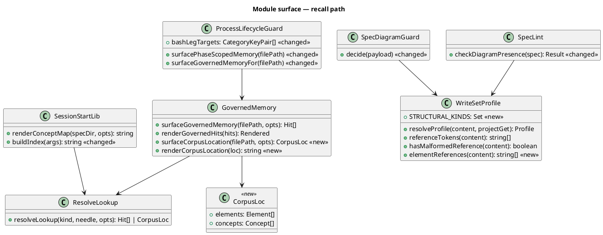
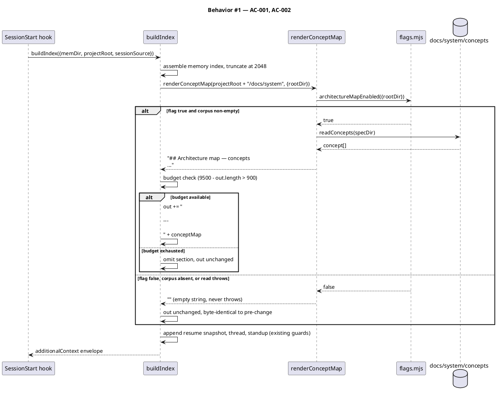
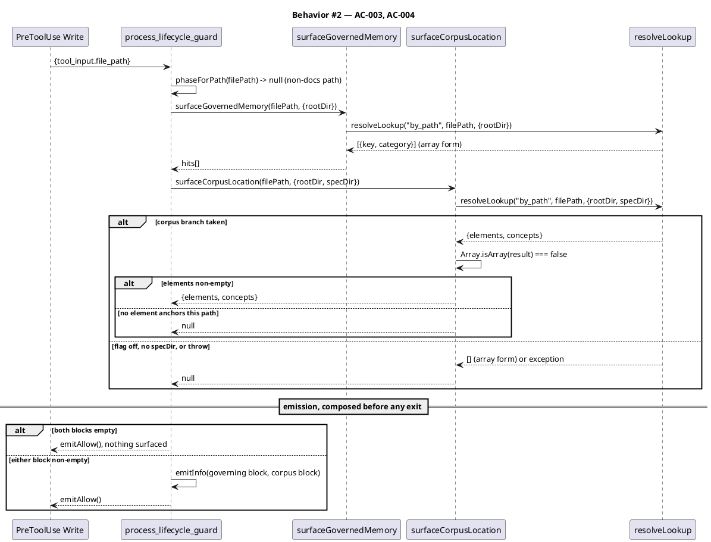
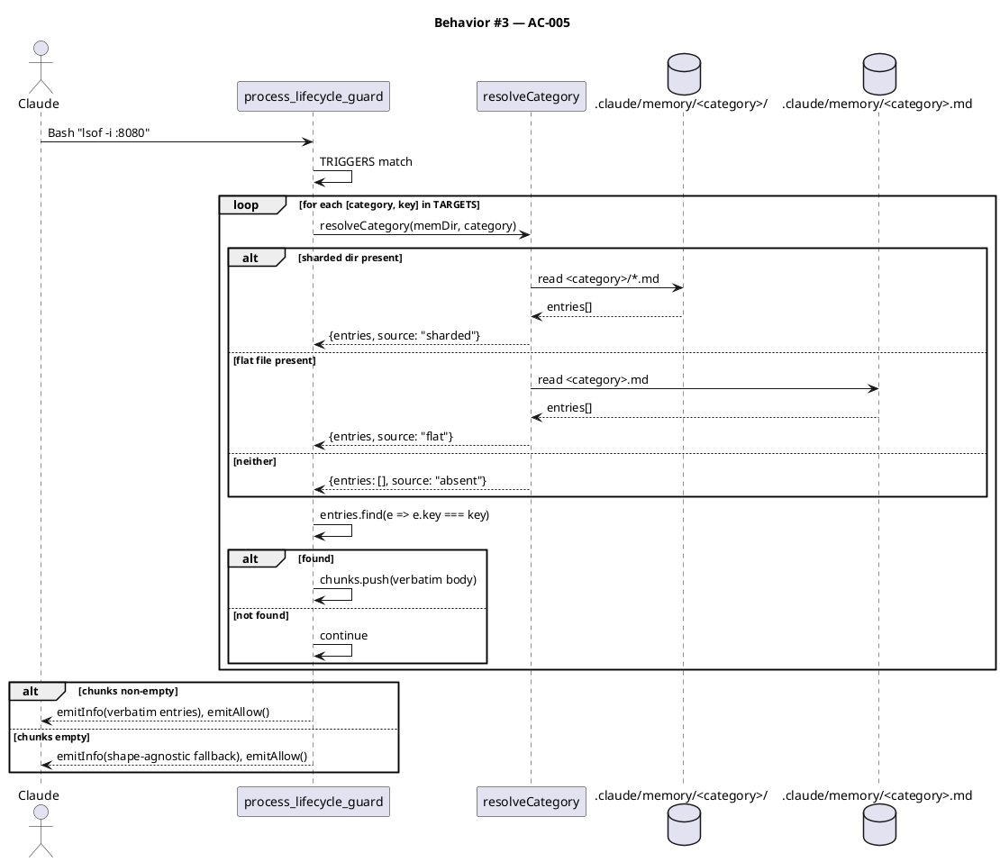
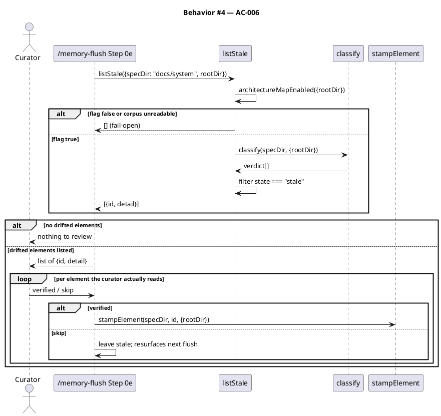
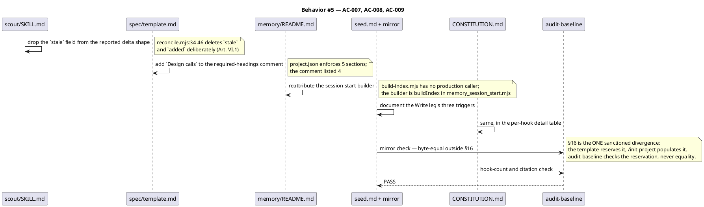
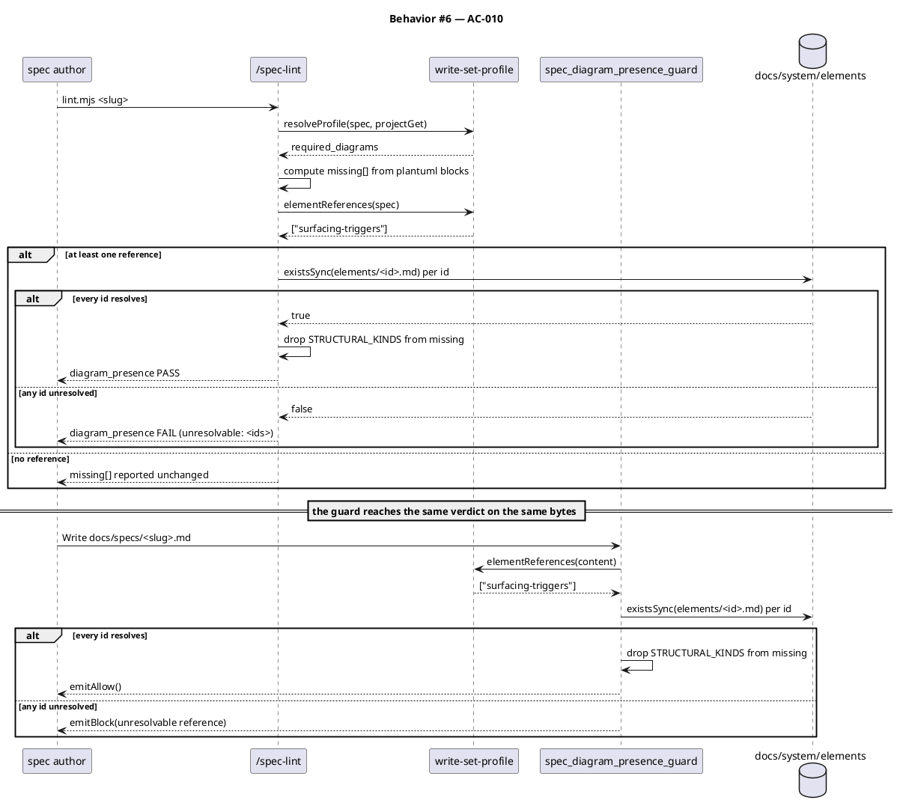
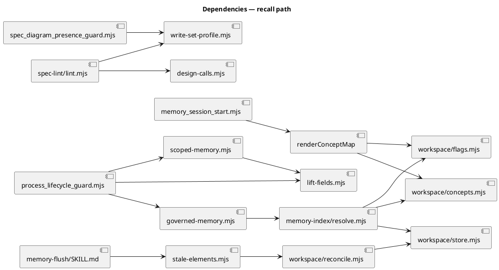

# Corpus recall reachability — wire the central system spec into the recall path

## Context

| Input | Path |
|---|---|
| Plan (upstream, approved) | `.config/plans/i-guess-earlier-we-synthetic-moth.md` §Cycle 1 |
| Intake | *(excepted — `spec-entry` track)* |
| Scout | *(excepted)* |
| Research | *(excepted)* |

**Write set**: `.claude/hooks/lib/memory_session_start.mjs`, `.claude/hooks/lib/governed-memory.mjs`, `.claude/hooks/lib/write-set-profile.mjs`, `.claude/hooks/process_lifecycle_guard.mjs`, `.claude/hooks/spec_diagram_presence_guard.mjs`, `.claude/skills/spec-lint/lint.mjs`, `.claude/skills/memory-flush/SKILL.md`, `.claude/skills/scout/SKILL.md`, `.claude/skills/spec/template.md`, `.claude/memory/README.md`, `docs/init/seed.md`, `src/seed.template.md`, `.claude/CONSTITUTION.md`, `tests/corpus-recall-reachability.test.mjs` — touches `.claude/hooks/**`, a `security.sensitive_globs` path, so the **full** six-kind diagram profile applies (CWE-693 defense-in-depth in `write-set-profile.mjs:105`), not the reduced one.

`docs/system/` holds 112 elements across 15 concepts with zero coverage gaps and zero stale verdicts. Two of the three ways that model was meant to reach Claude are dead code, and the one hook the constitution names by name reads a file shape this repo stopped using on 2026-07-17.

| Defect | Evidence | This spec |
|---|---|---|
| Concept map never injected | `renderConceptMap` (`memory_session_start.mjs:229`) has no caller but `tests/workspace-retrieval.test.mjs`; `buildIndex` (line 247) never invokes it. `seed.md:383` and `project.json:257` both claim it ships. | AC-001, AC-002 |
| Corpus unreachable from a touched path | `governed-memory.mjs:57` omits `specDir`, so `resolveTouchedPath` never runs outside tests | AC-003, AC-004 |
| Bash leg reads a shape that no longer exists | `process_lifecycle_guard.mjs:129-137` reads flat `conventions.md` / `landmines.md`; the store is sharded, so every match emits the "no memory entries were found" fallback | AC-005 |
| Corpus drift detected, never shown | `memory-flush/stale-elements.mjs → listStale` has no caller | AC-006 |
| Three prose claims contradict the code | `scout/SKILL.md:44`, `spec/template.md:18-19`, `memory/README.md:137` | AC-007 |
| The write leg is undocumented governance | `seed.md:168` and `.claude/CONSTITUTION.md` §2 describe only the Bash registration; this spec adds a third write-leg block | AC-008 |
| `/spec-lint` contradicts the guard it mirrors | `spec_diagram_presence_guard.mjs:73-106` strips the structural kinds when a spec carries a resolvable `@ref`; `lint.mjs` never implements that carve-out. Measured on this spec: guard exit 0, lint exit 1 | AC-010 |

## Goal

The structural model at `docs/system/` reaches Claude at session start and at the moment a governed file is edited; the memory-surfacing hook reads the store shape this repo actually uses; and the spec preflight agrees with the guard it mirrors, so a spec may reference the model without its own tooling calling that a failure.

## Non-goals

- **No stored or cached index.** `resolve.mjs:24` records the measurement that settled this: a HEAD-keyed cache cost ~29 ms against 17.5 ms for a full walk *and* was wrong on non-git trees, where `gitHead()` returns `''` forever so the index never rebuilt. Derived-on-read stays.
- **No corpus growth.** A landing that adds a governed file still opens a coverage gap; `coverage.findGaps` still has no production caller. That is Cycle 2.
- **No witness annotations.** All 112 shards still bind `witness: none`. Cycle 2.
- **No composed view written to disk.** `readAll().views` stays empty per `authored-records-are-not-stored-views-2026-08-06`.
- **No new hook.** All three changes land in existing hooks; the count stays 26.

## Design

Diagrams are the contract.

### C4 — structural kinds by reference

The system's standing structural shape is already modelled. Per `seed.md` §9 and `spec/SKILL.md` Step 2.5, this spec references it rather than redrawing it:

```
@ref element:surfacing-triggers
```

`surfacing-triggers` anchors `.claude/hooks/process_lifecycle_guard.mjs` and belongs to the `memory-model` concept, alongside every other element this change touches — `memory-hook-libs`, `governed-memory`, `memory-index-resolve`, `memory-index-helpers`, `memory-flush-helpers`. One resolvable reference satisfies `c4_context`, `c4_container` and `c4_component`.

### Data model — module surface

No persistent store is involved. The "entities" here are the module surfaces whose exports change.



#### Migration DDL

```sql
-- none: this change adds no persistent store, no table and no column.
-- The class diagram above models module exports, so no ALTER corresponds to it.
```

`spec-diagram-review` raises `class_ddl_consistency` ADVISORY findings against the `<<new>>` / `<<changed>>` stereotypes here (`bashLegTargets`, `STRUCTURAL_KINDS`). Accepted deliberately: the rule assumes the class diagram models a schema, and this one models a module surface. Dropping the stereotypes would satisfy the checker by deleting the only signal in the diagram that says which exports are new — the reviewer needs that more than the checker needs silence. No persisted field is marked, so nothing here can drift from a DDL that does not exist.

### Behavior #1 — the concept map reaches session start

`buildIndex` assembles the memory index into `lines`, truncates that at 2048 chars, then appends `---`-delimited sections each behind its own budget guard against the ~9500-char envelope. The concept map becomes one more such section, inserted **before** the resume snapshot: it is routing information, not continuity, and the reader needs it before deciding where to look.

`renderConceptMap` is already fail-open and flag-gated — it returns `''` on an absent flag, an absent corpus, or any read error — and accepts an absolute or a relative `specDir` (both measured at 881 chars against the live corpus). No new error handling is introduced.



### Behavior #2 — the corpus is reachable from a touched path

`resolveLookup('by_path', …)` answers two different questions and returns two different shapes. Without `specDir` it returns `[{key, category}]` — the memory entries whose `governs:` globs match. With `specDir` it returns `{elements, concepts}` — the corpus ascent. Threading `specDir` into the existing call at `governed-memory.mjs:57` would swap one answer for the other and break `hydrate()`, which iterates the array form.

So the corpus ascent gets its own function. `Array.isArray` is the discriminator, verified against the live tree: with `specDir` the return has keys `['elements','concepts']`; without, it is an array of 6 for this very file.

The second load-bearing detail: `surfaceGovernedMemoryFor` is **terminal** — `emitAllow()` exits the process, and line 58 exits early when no memory entry governs the path. Composing the corpus block after that early exit would mean a file with a resolving element but no `governs:` entry surfaces nothing, which is the same defect class the governed-memory leg was built to close. Both blocks are therefore composed **before** any exit, and the hook allows only when both are empty.



### Behavior #3 — the Bash leg reads the store shape in use

The leg hardcodes `conventions.md` and `landmines.md` and `continue`s past each missing file, so on a sharded store `chunks` is always empty and the fallback fires on every match. Both anchors exist today as shards. Routing through `resolveCategory` — the shape-agnostic, shard-first reader every other consumer already uses — makes the leg correct on both shapes. `TARGETS` becomes `[category, key]` pairs rather than `[filename, anchor]`, and the fallback message names the entries shape-agnostically.



### Behavior #4 — corpus drift surfaces to the curator

`listStale` exists, is flag-gated, fails open to `[]`, and nothing calls it. `/memory-flush` gains a Step 0e that lists drifted elements. Detection stays mechanical and re-stamping stays manual: the curator reads each element against the code at its anchor and stamps only what they verified. `digest.stampAll` already refuses without an explicit id list, and that refusal is the mechanism — a bulk refresh would make every element permanently fresh and launder the drift the digest exists to catch.



### Behavior #5 — prose stops contradicting the code

Three claims are corrected, and the governance record catches up with the write leg. `process_lifecycle_guard` is registered on both `Bash` and `Write|Edit|MultiEdit|NotebookEdit` (`settings.json:18` and `:38`), but `seed.md:168` and `.claude/CONSTITUTION.md` §2 describe only the Bash registration. This spec adds a third write-leg block, so documenting the leg is committed scope, not a follow-up.



### Behavior #6 — the preflight agrees with the guard

`/spec-lint` advertises itself as running "the same three checks as the write-boundary hooks". For diagram presence it does not: `spec_diagram_presence_guard.mjs:73-106` drops the three structural kinds from `missing` when the spec carries at least one resolvable `@ref element:<id>`, and `lint.mjs` has no equivalent. This spec measured the divergence directly — guard exit 0, lint exit 1, same bytes.

The precedent for the fix is already in the tree. `hooks/lib/design-calls.mjs` exists so the design-calls rule cannot drift between `spec_design_calls_guard` and `/spec-lint`, and `lint.mjs` already imports it. The `@ref` rule got no such module and drifted on first use.

The shared part must stay **content-only**. `write-set-profile.mjs:74-76` states the constraint explicitly — "resolving the id needs the corpus, and this module is deliberately stdlib-only" — so the shared module exports the pure half (`STRUCTURAL_KINDS`, `elementReferences`) and each caller resolves ids against `docs/system/elements/` itself. That keeps the parse in one place, which is where the drift was, without pulling corpus IO into a stdlib-only foundation module.

The two callers then differ only in what they do with an unresolvable id, which is correct: the guard blocks the write, the lint reports a failing row.



### Dependencies — graph



Acyclic. `lift-fields.mjs`, `workspace/store.mjs`, `workspace/concepts.mjs`, `workspace/flags.mjs` and `write-set-profile.mjs` are the shared leaves; no edge runs back up. The two new edges into `write-set-profile.mjs` are what makes the guard and the lint read one rule instead of two — the same shape `design-calls.mjs` already gives the design-calls check.

### Contracts

| Kind | Name | Input | Output | Errors | Idempotent |
|---|---|---|---|---|---|
| Function | `surfaceCorpusLocation` | `(filePath: string, {rootDir, specDir})` | `{elements, concepts}` \| `null` | none — every failure path returns `null` | yes (pure read) |
| Function | `renderCorpusLocation` | `(loc: {elements, concepts})` | `string` | none | yes |
| Function | `buildIndex` *(changed)* | `{memDir, projectRoot, sessionSource}` | envelope JSON string | unchanged | yes |
| Module const | `TARGETS` *(changed)* | — | `[category, key][]` | — | — |
| SOP step | `/memory-flush` Step 0e | `{specDir, rootDir}` | drifted element list | fail-open to `[]` | yes (lists only) |
| Function | `elementReferences` *(new)* | `(content: string)` | `string[]` — well-formed element ids only | none — a malformed token yields no id | yes (pure) |
| Module const | `STRUCTURAL_KINDS` *(new)* | — | `Set<'c4_context'\|'c4_container'\|'c4_component'>` | — | — |

`surfaceCorpusLocation` returns `null` rather than an empty object on every negative path — no element anchors the file, the flag is off, `specDir` absent, or the lookup throws — so the caller has one falsy check instead of four shape checks.

### Libraries and versions

| Library@version | Purpose | Key APIs | Confirmed against current docs |
|---|---|---|---|
| *(none)* | Node stdlib only (`node:fs`, `node:path`, `node:crypto`) | — | n/a — no third-party API is introduced |

The repo's `zero-runtime-dependencies` constraint holds; every module touched already imports stdlib only.

### Alternatives considered

| Alt | Summary | Rejected because |
|---|---|---|
| A | Thread `specDir` into the existing `resolveLookup('by_path')` call | Swaps memory surfacing for corpus surfacing. `hydrate()` iterates the array form and would break; the two vocabularies (`scope:` phases, `governs:` globs, corpus anchors) were deliberately kept separate at `governed-memory.mjs:9-13` |
| B | Put the concept map inside the 2048-char index block | The index would truncate the read-order footer to fit, and the map is not memory — `CANONICAL` never walks `docs/system/` |
| C | Have Step 0e stamp every drifted element automatically | Closes the loop with no human in it. `stale-elements.mjs:5-8` and `stampAll`'s refusal exist precisely to prevent this |
| D | Add a 27th hook for corpus surfacing | The write leg already runs on every `Write|Edit`; a second hook on the same event duplicates the trigger and cascades the hook count through six governance surfaces |
| E | Copy the guard's `@ref` carve-out into `lint.mjs` | Two copies of one rule is what produced the divergence. `write-set-profile.mjs` already owns the reference regex (`REF_WELL_FORMED`) for `hasMalformedReference`; `elementReferences` reuses that same constant rather than restating it |
| F | Move corpus resolution into `write-set-profile.mjs` so the whole rule is shared | Violates the module's stated constraint at lines 74-76 — it is stdlib-only and content-only by design, and a hook lib never imports another hook. The parse is shared; the IO stays with each caller, which is also where the two correctly differ (block vs. report) |

## Design calls

The write set intersects no path in `project.json → tdd.ui_globs` — there is no UI surface in this change.

- *(none)*

## Acceptance criteria

| ID | Criterion (given / when / then) | Kind | Upstream AC | Sequence |
|---|---|---|---|---|
| AC-001 | given `memory.architecture_map.enabled` is true and `docs/system/concepts/` is non-empty, when `buildIndex` runs, then its output contains the heading `## Architecture map — concepts` and one row per concept | behavior | plan §C1-1 | §Behavior #1 |
| AC-002 | given the flag is false or the corpus is absent or unreadable, when `buildIndex` runs, then its output is byte-identical to the pre-change output and no exception escapes | preflight | plan §C1-1 | §Behavior #1 |
| AC-003 | given a Write to a path an element anchors, when the write leg runs, then a corpus-location block naming the element and its owning concepts is emitted alongside any governing-memory block | behavior | plan §C1-2 | §Behavior #2 |
| AC-004 | given a path with a resolving element but zero governing memory entries, when the write leg runs, then the corpus block still surfaces; and given any lookup throw or absent flag, then the hook emits allow and never blocks | error-mapping | plan §C1-2 | §Behavior #2 |
| AC-005 | given a sharded store and a Bash command matching `TRIGGERS`, when the Bash leg runs, then both target entries surface verbatim instead of the "no memory entries were found" fallback; and given a flat store, the same two entries still surface | behavior | plan §C1-3 | §Behavior #3 |
| AC-006 | given at least one element whose `classify` state is `stale`, when `/memory-flush` Step 0e runs, then each is listed with its detail, and no `anchor_digest` is written except by an explicit per-element curator decision | behavior | plan §C1-4 | §Behavior #4 |
| AC-007 | given the three drifted prose claims, when the files are read after this change, then `scout/SKILL.md` no longer names a `stale` field, `spec/template.md` lists all five guard-required headings, and `memory/README.md` attributes the session-start builder to the module that actually builds it | behavior | plan §C1-5 | §Behavior #5 |
| AC-008 | given `process_lifecycle_guard` is registered on both events, when `seed.md` and `.claude/CONSTITUTION.md` are read, then both describe the Write leg's three surfacing triggers, and `src/seed.template.md` stays byte-equal to `docs/init/seed.md` **outside §16**, which the template reserves for `/init-project` to populate per install | behavior | plan §C1-2 governance note | §Behavior #5 |
| AC-009 | when `npm test` and `node .claude/skills/audit-baseline/audit.mjs` run on the landed tree, then both exit 0, and `CLAUDE.md` stays within both test ceilings (≤ 38,800 chars and ≤ 39,000 bytes) | smoke | plan §Verification | §Behavior #5 |
| AC-010 | given a spec carrying a resolvable `@ref element:<id>`, when `/spec-lint` and `spec_diagram_presence_guard` each run on the same bytes, then both reach the same verdict on the structural kinds; and given an unresolvable id, the lint reports a failing row naming it while the guard blocks | behavior | discovered in §Behavior #6 during this spec's own preflight | §Behavior #6 |

No row defers spec-committed scope, so no `deferred:` tag applies. AC-010 was not in the approved plan — it was found when this spec's own `/spec-lint` run contradicted the write guard, and folded in on the engineer's call because it would false-FAIL every Cycle 2 spec.

## Test plan

| Category | Scenario | Expected | Covers |
|---|---|---|---|
| Golden path | `buildIndex` on the live tree with the flag on | output contains `## Architecture map — concepts` and 15 concept rows | AC-001 |
| Golden path | write leg on `.claude/hooks/track_guard.mjs` | corpus block names element `track-guard` and concept `workflow-tracks` | AC-003 |
| Golden path | Bash leg on `lsof -i :8080` against the sharded store | both entries surface verbatim; fallback string absent | AC-005 |
| Input boundary | `buildIndex` when the concept map would exceed the remaining envelope budget | section omitted; resume/thread/standup sections unaffected | AC-002 |
| Input boundary | `surfaceCorpusLocation` on a path no anchor matches | returns `null`, not `{elements: [], concepts: []}` | AC-003 |
| Contract violation | `surfaceCorpusLocation` called without `specDir` | returns `null`; the array form is never treated as a corpus result | AC-004 |
| Contract violation | `surfaceCorpusLocation` on a traversal path (`../../etc/passwd`) | returns `null`; no read outside the corpus root | AC-004 |
| Failure mode | flag false, then corpus directory removed, then a shard made unreadable | `buildIndex` byte-identical each time; write leg emits allow | AC-002, AC-004 |
| Failure mode | write leg on a path with an element but no governing entry | corpus block still emitted — the early `emitAllow` no longer suppresses it | AC-004 |
| Failure mode | Bash leg against a flat-shaped store fixture | both entries still surface via `resolveCategory`'s flat branch | AC-005 |
| Concurrency / ordering | `buildIndex` section order | concept map precedes the resume snapshot; both present when budget allows | AC-001 |
| Regression trap | `CANONICAL` category count | stays 8; never gains a corpus category | AC-002 |
| Regression trap | live corpus coverage and staleness | `findGaps` returns 0; `classify` yields 0 `stale`, 0 `dangling` | AC-006 |
| Regression trap | `stampAll` without an explicit id list | still throws | AC-006 |
| Regression trap | hook count | stays 26; `settings.json` registrations unchanged | AC-008 |
| Regression trap | `CLAUDE.md` size | ≤ 38,800 chars and ≤ 39,000 bytes | AC-009 |
| Golden path | `/spec-lint` on this very spec (carries a resolvable `@ref`) | `diagram_presence` PASS; overall PASS | AC-010 |
| Contract violation | a spec fixture whose `@ref` names a non-existent element | lint reports FAIL naming the id; guard blocks with the same id | AC-010 |
| Contract violation | a spec fixture with a malformed ref (`@ref element:Bad_Id`) | `elementReferences` yields no id; full six-kind set required by both | AC-010 |
| Regression trap | guard and lint verdicts on a corpus of spec fixtures | identical structural-kind verdict for every fixture | AC-010 |

## Observability

| Signal | Name | Shape | Purpose |
|---|---|---|---|
| Log | `process_lifecycle_guard` | existing `logLine`, extended with `surfaced corpus location for <path>` | confirm the corpus leg fires in real sessions |
| Log | `process_lifecycle_guard` | `surfaced <n> entr(y\|ies) via <sharded\|flat>` | prove the Bash leg stopped hitting the fallback |
| Inspection | session-start payload | presence of `## Architecture map — concepts` | the only observable for AC-001 — hooks have no metric sink |

This repo ships no metrics backend; the hook log at `.claude/state/logs/` is the observability surface.

## Rollout

### Prerequisites

| # | Prerequisite | enforced-by |
|---|---|---|
| 1 | The corpus layer stays inert for any project that has not opted in — absent flag, absent corpus, or unreadable shard produces the pre-change payload exactly | AC-002 |
| 2 | Every new lookup path degrades to allow; no surfacing failure can block a write | AC-004 |
| 3 | The full suite and `audit-baseline` are green, and `CLAUDE.md` is inside both test ceilings, before the commit gate | AC-009 |

- **Feature flag**: none added. The change rides the existing `memory.architecture_map.enabled` (already `true` here, absent in `src/project.template.json` so every consumer reads false).
- **Migration order**: no migration. Each change is independent and can land in any order.
- **Canary**: this repository is the canary, as it was for the corpus itself.

## Rollback

- **Kill-switch**: set `memory.architecture_map.enabled` to `false` in `.claude/project.json`. `renderConceptMap` returns `''` and `surfaceCorpusLocation` returns `null`, restoring pre-change behavior for C1-1 and C1-2 with no code revert. C1-3 and C1-6 have no flag — both are correctness fixes with no behavior to gate (one reads the store shape in use, the other makes two checkers agree); revert the commit if either misbehaves.
- **Signal to roll back**: the write leg emitting on every Write with no useful content, or session-start context exceeding the ~9500-char envelope and truncating the standup section. Both are visible in the first session after landing — inspect the payload directly, since there is no metric sink.

## Archive plan

- Defaults *(automatic)*: spec, spec-rendered/, spec approval, security report.
- Extras *(list any non-default files)*:
  - *(none)*

## Open questions

- *(none)* — the plan resolved the four design forks (sequencing, delta authority, repair home, recall-rule strength) before this spec was drafted, and Cycle 1 carries none of them.
