# Workspace corpus backfill — turning the map on

## Context

| Input | Path |
|---|---|
| Intake | *(excepted — `spec-entry` track)* |
| BRD *(if any)* | *(none)* |
| Scout *(if any)* | *(excepted — discovery inline below)* |
| Research *(if any)* | *(excepted — discovery inline below)* |
| Prior cycle (the machinery) | `docs/archive/2026-08-05/architecture-map/spec.md` |
| Prior cycle (the seed) | `docs/archive/2026-08-04/workspace-corpus-seed/spec.md` |
| Vision note | `docs/vision/living-system-model.md` §2.3 (the honesty hazard) |

**Write set**: `.claude/memory/workspace/**`, `.claude/skills/workspace/**`, `.claude/skills/memory-flush/**`, `.claude/memory/README.md`, `tests/**` — `.claude/memory/**` falls outside the `non-architectural` profile globs, so the full C4 set applies.

### Discovery evidence (inline — this track excepts scout and research)

Measured at `571b6a3`, 2026-08-06. Gate A reviews numbers, not assertions.

| Finding | Measurement |
|---|---|
| The migration the prior spec specified never ran | **0 of 14** elements carry `anchor_digest`, `shard`, or `granularity` |
| Staleness is therefore structurally inert | `classify()` returns `moved: "interface unchanged"` for **14 of 14**; the `stale` branch at `reconcile.mjs:123` guards on `element.anchor_digest &&` and is unreachable corpus-wide |
| The concept layer is half-empty | **8 of 15** concepts have zero members (`consent-gates`, `constitution-chain`, `design-routing`, `docs-pipeline`, `harness-loop`, `planning-release`, `project-config`, `review-fanout`) |
| Multi-membership is claimed but unrealized | 14 member links over 14 elements, each element claimed **exactly once**; ticket A's own done_record cites `git_commit_guard` in both `consent-gates` and `git-policy` — it is not an element at all |
| Roll-up is starved by coverage, not by design | 24 element edges collapse to **3** concept edges |
| Coverage is ~7% of the governed surface | 14 elements against **192** code modules (26 hooks, 24 hook libs, 116 skill helpers, 26 `src/cli`) |
| The map does not model itself | The prior cycle shipped 7 `skills/workspace/*.mjs` modules; **0** entered the corpus |
| The README asserts the migration landed | `.claude/memory/README.md:159` — "Elements gained three fields" — describes disk state that does not exist |
| `shard` would be a second source of truth | `shards.readShard` derives the path by convention (`workspace/diagrams/<id>.puml`); a stored field duplicates it |
| `granularity` would be a second source of truth | `concepts.mjs:20` derives it at read; the prior spec's own D1 says "altitude becomes a function, not a field" |
| Anchors are unique-by-construction | `conflicts.duplicateAnchor` rejects two ids claiming one anchor — so multi-membership must live at the concept level, never by cloning an element |

## Goal

The architecture map detects its own drift and answers a question about any part of the governed surface: every element carries a stored interface digest so `classify()` can return `stale`, every concept resolves to at least one member, and every file under the governed surface routes to at least one element.

## Non-goals

- **No archived-spec import.** The prior spec's non-goal stands: 630 `Component(` declarations across `docs/archive/**` describe superseded designs.
- **No new diagram kinds in the corpus.** D2 of the prior cycle stands — structure and validator-backed data shapes are durable; sequence, activity, BPMN, timing and use-case stay in the spec and archives.
- **No automatic digest refresh.** See D3. Detection is mechanical; re-stamping is a curation act.
- **No model-proposed edges.** Unchanged: every edge is derived or authored, never asserted.
- **No new hook.** The detection surfaces ride existing phases; adding a 27th hook would trigger a count cascade and a `seed.md` §4.1 amendment for a reporting convenience.
- **No coverage of `docs/**` or `tests/**`.** The governed surface is executable code and its schemas. Prose has no exported interface to digest, and tests are the witness, not the subject.

## Decisions

Recorded per Article XI.12 — routine engineering choices decided in main context, reviewed at gate A rather than asked.

| # | Decision | Rationale | Owner |
|---|---|---|---|
| D1 | **Only `anchor_digest` is persisted. `shard` and `granularity` are dropped from the migration.** | The prior spec's Migration steps 3–4 contradict its own D1 ("altitude becomes a function, not a field"). `readShard` already derives the shard path by convention and `concepts.mjs:20` already derives granularity at read, so persisting either creates a second source of truth that can disagree with the first. A digest is different in kind: its whole purpose is to compare a *stored* value against a *fresh* one, so it cannot be derived at read. This shrinks the migration from three fields to one and removes two drift surfaces before they exist. | Claude |
| D2 | **Coverage is total over the governed surface; granularity is the coarsest anchor that still routes.** The governed surface is `.claude/hooks/**`, `.claude/skills/**` (helper modules), `.claude/commands/**`, `.claude/schemas/**`, `.claude/mcp/**`, `.github/workflows/**`, `src/**`. A family gets one glob-anchored subsystem when its members are interchangeable for routing; a module gets a file anchor when it answers a question no sibling answers. | This is the stopping rule the prior cycle lacked, and it is mechanical: "every governed file resolves to ≥1 element" is a test (AC-004), not a judgment call re-litigated each cycle. Coarsest-that-routes keeps the corpus from becoming the filesystem relabelled — the failure mode alternative D of the prior spec rejected for edges, applied here to nodes. | Claude |
| D3 | **Re-stamping is a curation act, never a mechanical refresh.** Detection is automatic (`/memory-flush` Step 0c and session start report stale elements); the digest is re-stamped only for an element whose record and shard were actually reviewed in that pass. | This is the load-bearing decision and it inverts the naive framing. A pipeline point that re-stamps every element on every commit would make `classify()` permanently green and launder exactly the drift the digest exists to catch — the decay-evasion hatch pattern this memory system has already removed once (`memory-flush/SKILL.md` Step 3 records removing "HEAD is permanently fresh on git"; open question Q-002 is the same class). Auto-refresh would satisfy the letter of "staleness works" while destroying its purpose. | **engineer** |
| D4 | **The detection surface is `/memory-flush`, not `/scout`.** | Scout is the intuitive home and it is wrong here: `spec-entry` — this repository's most-used track, including this very workflow — carries `scout` in `exceptions`, so a scout-sited check would rarely fire. `/memory-flush` runs on every committing track as Phase 10.7 and is already the curation phase with a stale-sweep step (Step 0c) to extend. | Claude |
| D5 | **Concept membership is authored as a concept→anchor map; element records are materialized from it.** Each concept declares its anchors (file or glob); the seeder derives one element per anchor and sets membership from which concept declared it. | D6 of the seed cycle ("no inference of concept membership") is honored — a human authors and reviews 15 anchor rows at gate A. What it avoids is hand-transcribing ~50 element records, which is how `seed-elements.mjs` became a frozen snapshot that never learned about the 7 modules the last cycle shipped. Authoring the map rather than the records is what makes the corpus re-derivable. | **engineer** |
| D6 | **An anchor declared by two concepts yields ONE element in two concepts.** | `conflicts.duplicateAnchor` rejects two ids claiming one anchor, so the alternative — cloning the element per concept — is structurally impossible, and correctly so. This is what finally realizes ticket A's `git_commit_guard` example: one element, members of both `consent-gates` and `git-policy`. | Claude |
| D7 | **The README is corrected in this cycle, and a preflight AC keeps it correct.** | `.claude/memory/README.md:159` currently documents three fields that no element carries. A docs claim that outruns disk is the same honesty hazard as a wrong diagram, one level up. AC-008 asserts the documented field set equals the persisted field set, so the next divergence fails a test rather than misleading a reader. | Claude |

## Design

Diagrams are the contract. Prose is only for what a diagram cannot say.

### C4 — System context

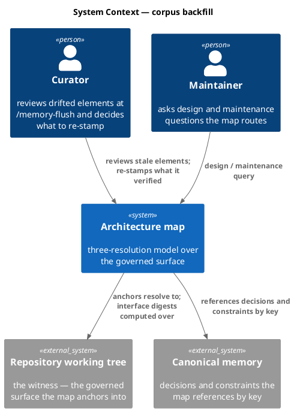

### C4 — Container

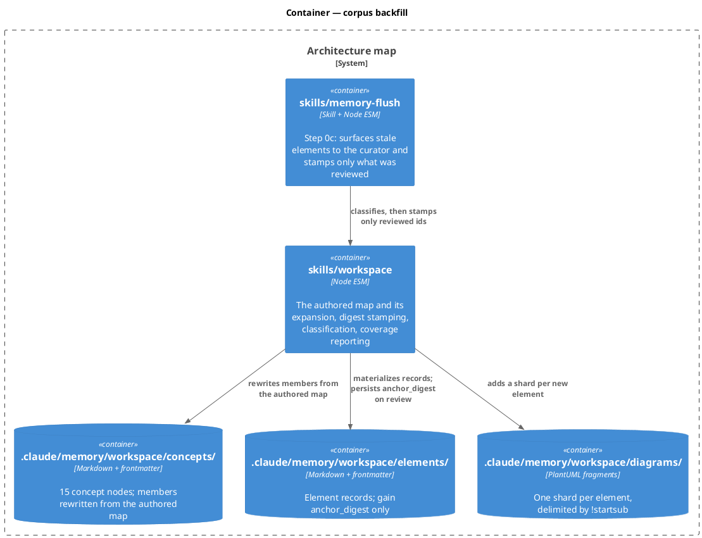

### C4 — Component (changed containers only)

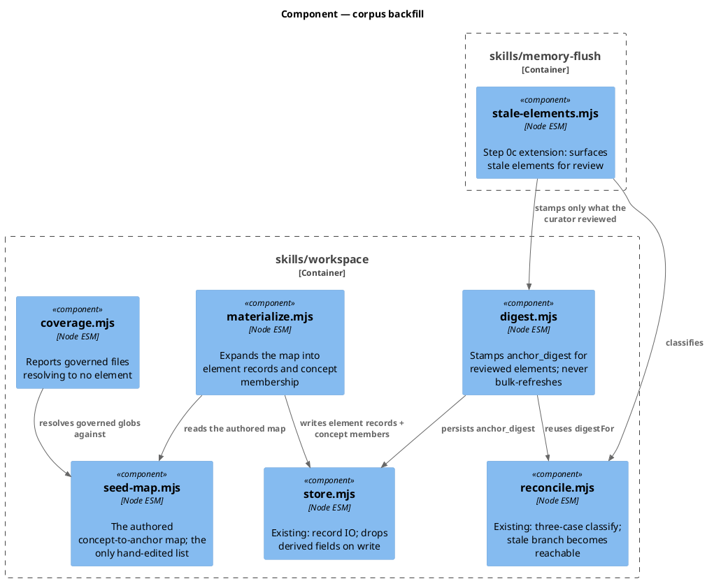

### Data model — class diagram

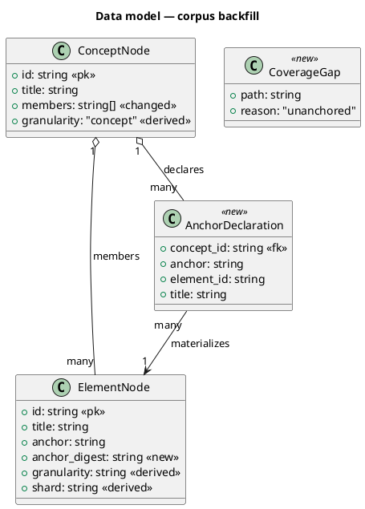

#### Migration

There is no SQL store; the migration is additive frontmatter over the file-backed corpus.

```text
-- forward
1. add field  anchor_digest: <sha256-12 of exported surface>  to each elements/<id>.md
     whose anchor resolves (dangling anchors get no digest — AC-001)
2. add elements/<id>.md for each anchor in the authored map not already present
3. rewrite concepts/<id>.md `members:` from the authored map (every id resolves)
4. add diagrams/<id>.puml for each new element (!startsub <id>)

-- reverse
4..1 delete the added files and strip anchor_digest; the 14 pre-existing element
     records return byte-identical to their pre-migration form, and classify()
     returns to reporting `moved` for every element.
```

Note what is absent: no `shard:` and no `granularity:` step. D1 supersedes Migration steps 3–4 of `docs/archive/2026-08-05/architecture-map/spec.md`.

### Behavior — sequence per AC

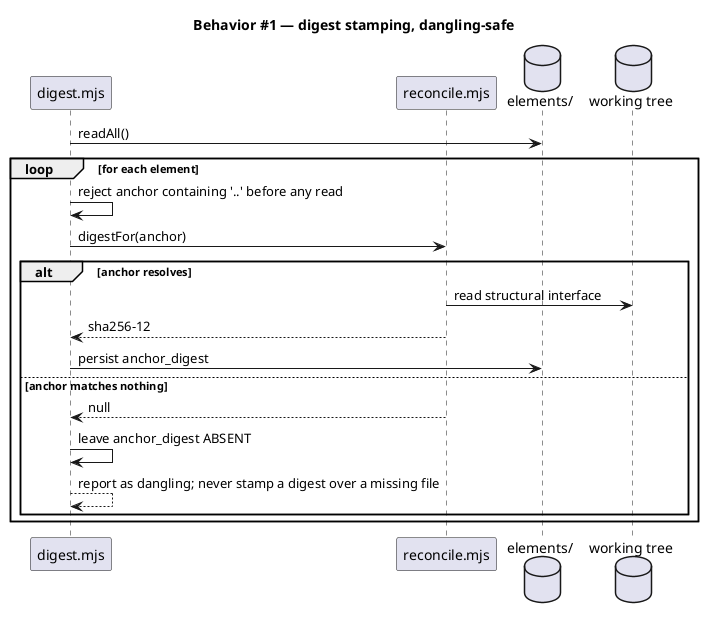

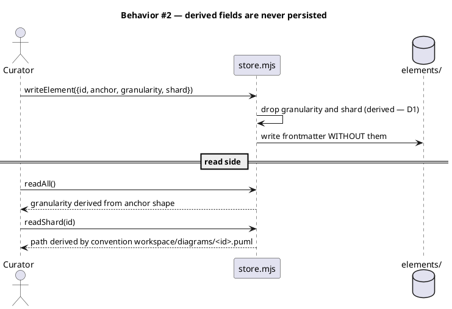

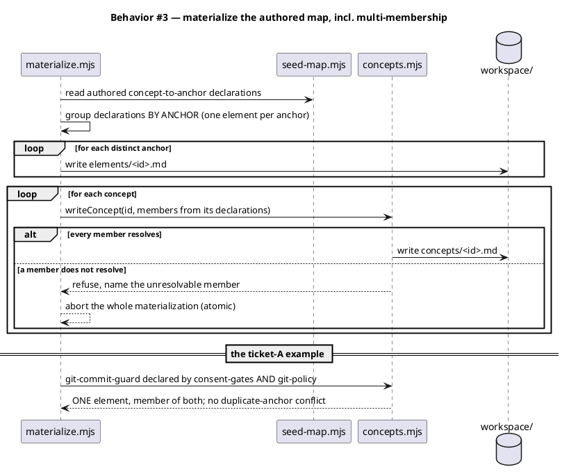

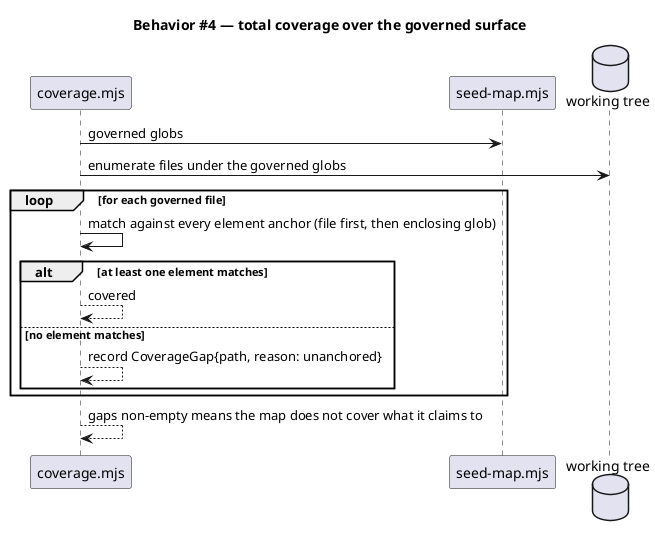

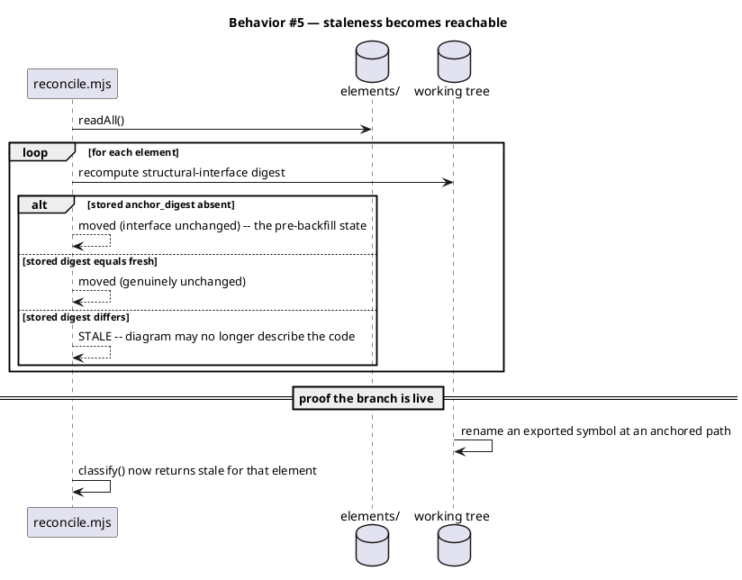

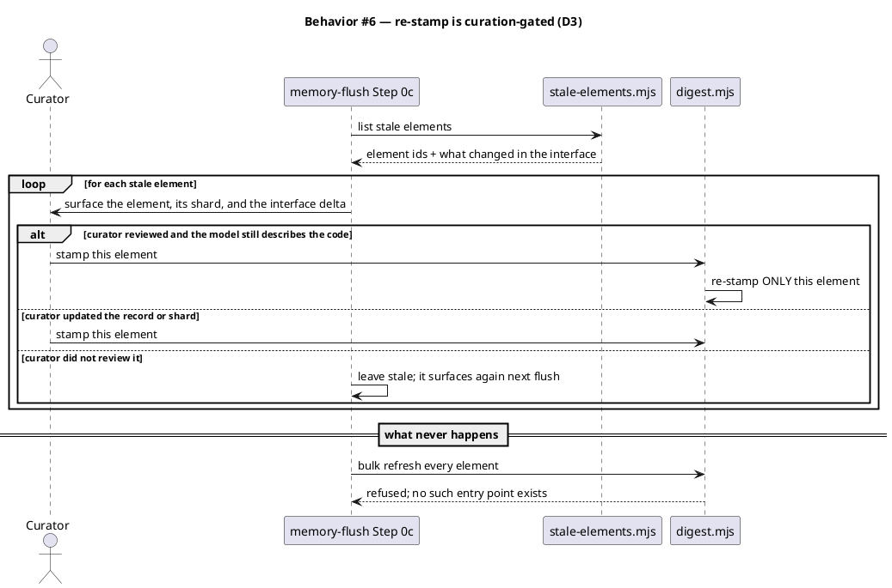

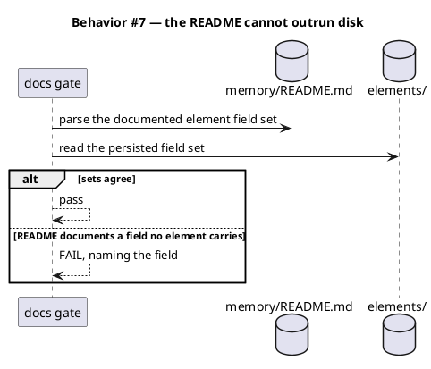

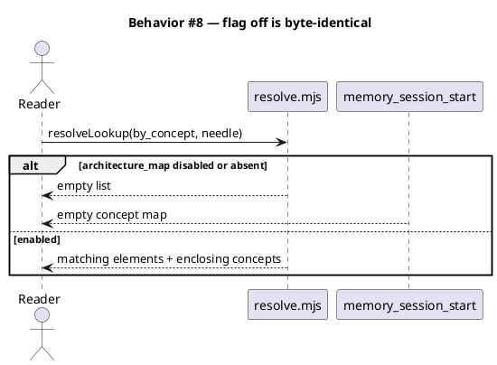

### State — core entity

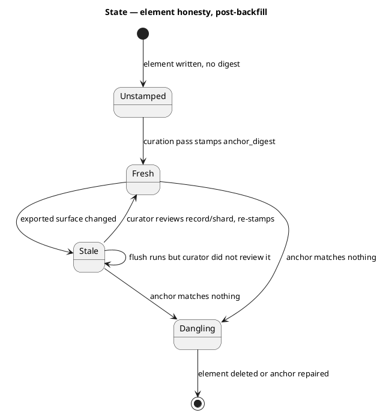

Note the absent transition: nothing moves `Stale --> Fresh` without a curator. That absence is D3.

### Dependencies — graph

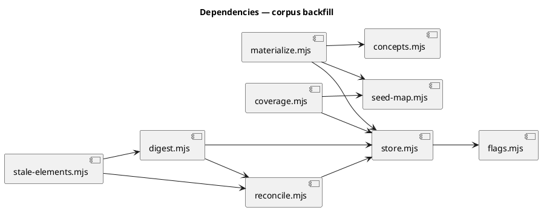

### Contracts

| Kind | Name | Input | Output | Errors | Idempotent |
|---|---|---|---|---|---|
| Module | `seed-map.CONCEPT_ANCHORS` | — | `AnchorDeclaration[]` — the authored map, 15 concepts | — | n/a (constant) |
| Module | `seed-map.GOVERNED_GLOBS` | — | `string[]` — the governed surface (D2) | — | n/a (constant) |
| Module | `materialize.materialize({memDir, rootDir, map?})` | optional `map` overrides `seed-map.CONCEPT_ANCHORS` (test seam; production passes none) | `{elements: n, concepts: n, written: string[]}` | refuses atomically on an unresolvable member or a duplicate-anchor conflict; throws on an unsafe id | yes |
| Module | `readme-gate.checkReadmeFields({memDir})` | — | `{ok, overclaimed: string[]}` — fields the README documents that no element persists | `{ok: true, overclaimed: []}` when the README is absent (fail-open) | yes |
| Module | `coverage.governedFiles({rootDir})` | — | repo-relative paths in the governed surface (D2), third-party trees excluded | `[]` on an unreadable root | yes |
| Module | `coverage.anchorMatches(anchor, path)` | anchor glob or file path | boolean | re-exports `memory-index/index-io.matchesGlob` so one glob semantics serves tests and production | yes |
| Module | `digest.stampElement(memDir, id, {rootDir})` | one element id | `{id, digest}` or `{id, digest: null, state: "dangling"}` | throws on traversal in the anchor; never stamps over an unresolved anchor | yes |
| Module | `digest.stampAll(memDir, ids, {rootDir})` | an EXPLICIT id list | `{stamped: string[], dangling: string[]}` | throws when `ids` is absent — there is no stamp-everything default (D3) | yes |
| Module | `coverage.findGaps({memDir, rootDir})` | — | `CoverageGap[]` — governed files matching no element | `[]` when the corpus is empty (fail-open, matches `reconcile`) | yes |
| Module | `stale-elements.listStale({memDir, rootDir})` | — | `{id, detail}[]` for elements classifying `stale` | `[]` when the flag is off or the corpus is absent | yes |
| Module | `store.writeElement(memDir, element)` *(changed)* | element record | path written; `granularity` and `shard` dropped if present (D1) | throws on an unsafe id | yes |

### Libraries and versions

| Library@version | Purpose | Key APIs | Confirmed against current docs |
|---|---|---|---|
| `node@25.8.1` built-ins | fs, path, crypto (sha256) | `readFileSync`, `createHash`, `readdirSync` | yes — existing pinned entry `node-test-node-25-8-1` |
| `plantuml@1.2026.2` | shard fragments for new elements | `!startsub NAME` / `!endsub`, `-checkonly` | yes — pinned and verified end-to-end in the prior cycle (2026-08-05) |

No new runtime dependency.

### Alternatives considered

| Alt | Summary | Rejected because |
|---|---|---|
| A | Re-stamp digests automatically at `/integrate` or in a PostToolUse hook | Makes `classify()` permanently green and launders the drift the digest exists to catch. This is the decay-evasion hatch the memory system already removed once (D3). |
| B | Site the stale check in `/scout` | `spec-entry` — the most-used track here, including this workflow — excepts `scout`, so the check would almost never fire (D4). |
| C | Hand-author ~50 element records, extending `seed-elements.mjs` | That is exactly how the current corpus froze: `seed-elements.mjs` is a hand-transcribed snapshot that never learned about the 7 modules the last cycle shipped (D5). |
| D | One element per governed file (~192 elements) | Produces the filesystem relabelled — the failure alternative D of the prior spec rejected for edges. Routing does not need a node per file where siblings are interchangeable (D2). |
| E | Persist `shard` and `granularity` as the prior Migration specified | Both are already derived at read; persisting creates a second source of truth that can disagree with the first, and contradicts the prior spec's own D1 (D1). |

## Design calls

The write set does not intersect `project.json → tdd.ui_globs`. No UI surface.

- *(none)*

## Acceptance criteria

| ID | Criterion (given / when / then) | Kind | Upstream AC | Sequence |
|---|---|---|---|---|
| AC-001 | given an element whose anchor resolves, when `stampElement` runs, then `anchor_digest` is persisted as sha256-12 of the structural interface; given an anchor matching nothing, then no digest is written and the element is reported `dangling` | behavior | prior spec Migration step 2 | §Behavior #1 |
| AC-002 | given a `writeElement` call carrying `granularity` or `shard`, when it is written, then neither field appears in the frontmatter, and readers derive both (granularity from anchor shape, shard path by convention) | behavior | prior spec D1 | §Behavior #2 |
| AC-003 | given the authored concept-to-anchor map, when `materialize` runs, then every one of the 15 concepts has at least one member, every member resolves to an element on disk, and an unresolvable member aborts the whole materialization atomically | behavior | ticket A done_record | §Behavior #3 |
| AC-004 | given the governed globs of D2, when `findGaps` runs after materialization, then it returns an empty list — every governed file resolves to at least one element by file anchor or enclosing glob | behavior | D2 | §Behavior #4 |
| AC-005 | given an anchor declared by two concepts, when materialization runs, then exactly ONE element exists for it and it is a member of both concepts; `git-commit-guard` is the asserted case | behavior | ticket A done_record | §Behavior #3 |
| AC-006 | given a stamped element, when an exported symbol at its anchor is renamed, then `classify()` returns `stale` for that element, and `moved` when the interface is untouched | behavior | prior spec D7 | §Behavior #5 |
| AC-007 | given stale elements at `/memory-flush` Step 0c, when the flush runs, then each is surfaced individually and only explicitly-reviewed ids are re-stamped; `stampAll` throws when called without an explicit id list, so no bulk-refresh entry point exists | behavior | D3 | §Behavior #6 |
| AC-008 | given `.claude/memory/README.md`, when the docs gate runs, then the element field set it documents equals the field set persisted on disk, failing by name on divergence | preflight | D7 | §Behavior #7 |
| AC-009 | given `memory.architecture_map.enabled` false or absent, when any of the above runs, then behavior is byte-identical to pre-backfill: `by_concept` returns an empty list and the session-start concept map is empty | behavior | prior spec D9 | §Behavior #8 |
| AC-010 | given the corpus immediately after materialization, when `classify()` runs over it, then zero elements report `dangling` | smoke | D2 | §Behavior #1 |

## Test plan

| Category | Scenario | Expected | Covers |
|---|---|---|---|
| Golden path | stamp an element whose anchor resolves | `anchor_digest` present, 12 hex chars | AC-001 |
| Golden path | materialize the authored map into an empty corpus | 15 concepts, all with at least one member | AC-003 |
| Golden path | `findGaps` over the governed surface post-materialization | empty | AC-004 |
| Input boundary | anchor containing `..` | throws before any filesystem read | AC-001 |
| Input boundary | anchor matching nothing | no digest written; reported `dangling` | AC-001, AC-010 |
| Input boundary | glob anchor (no single file) | digest skipped; classified `moved`, never `stale` | AC-006 |
| Contract violation | `writeElement` given `granularity` + `shard` | frontmatter carries neither | AC-002 |
| Contract violation | `stampAll` called with no id list | throws; no element stamped | AC-007 |
| Contract violation | map naming a member that resolves to no element | whole materialization aborts; corpus unchanged | AC-003 |
| Contract violation | two concepts declaring one anchor | one element, two memberships, no duplicate-anchor conflict | AC-005 |
| Concurrency / ordering | materialize twice in a row | second run is a no-op; byte-identical corpus | AC-003 |
| Failure mode | unreadable source at an anchored path | reported, never a thrown build break | AC-001 |
| Failure mode | README documents a field disk does not carry | docs gate fails, naming the field | AC-008 |
| Regression trap | rename an exported symbol at an anchored path | `classify()` flips `moved` to `stale` | AC-006 |
| Regression trap | flag off | `by_concept` empty, concept map empty | AC-009 |
| Regression trap | the 14 pre-existing element records | gain only `anchor_digest`; every other byte unchanged | AC-001, AC-002 |

## Observability

| Signal | Name | Shape | Purpose |
|---|---|---|---|
| Log | `workspace.materialize` | fields: `elements`, `concepts`, `written[]` | audit what the map produced |
| Log | `workspace.stale` | fields: `id`, `detail` | what the curator was shown at flush |
| Metric | `workspace.coverage_gaps` | gauge, emitted by `findGaps` | governed files routing nowhere; target 0 |
| Metric | `workspace.stale_elements` | gauge, emitted at session start | unreviewed drift; a rising number is the signal D3 exists to preserve |

## Rollout

### Prerequisites

| # | Prerequisite | enforced-by |
|---|---|---|
| 1 | The corpus contains no dangling anchor before the concept layer is read by any consumer | AC-010 |
| 2 | `.claude/memory/README.md` describes the field set that is actually persisted | AC-008 |

- **Feature flag**: `memory.architecture_map.enabled` — already `true` in this repo (canary), absent from `src/project.template.json` so consumers read false. No new flag.
- **Migration order**: 1 stamp existing digests, 2 materialize new elements, 3 rewrite concept members, 4 add shards, 5 correct README.
- **Canary**: this repository. Consumers are unaffected while the flag is absent from the template.

## Rollback

- **Kill-switch**: set `memory.architecture_map.enabled` false. `by_concept` returns empty, the session-start map returns empty, and the corpus stays on disk, inert.
- **Signal to roll back**: `findGaps` non-empty, or `classify()` reporting any `dangling`, on the first `/memory-flush` after landing — both are read at the flush that immediately follows the commit, well inside 5 minutes of the landing.

## Archive plan

- Defaults *(automatic)*: spec, spec approval, security report, workflow.json, timing.
- Extras *(list any non-default files)*:
  - *(none)*

## Open questions

- *(none — D3 and D5 were the two open forks; both are settled above and carry `owner: engineer` for gate-A review.)*
