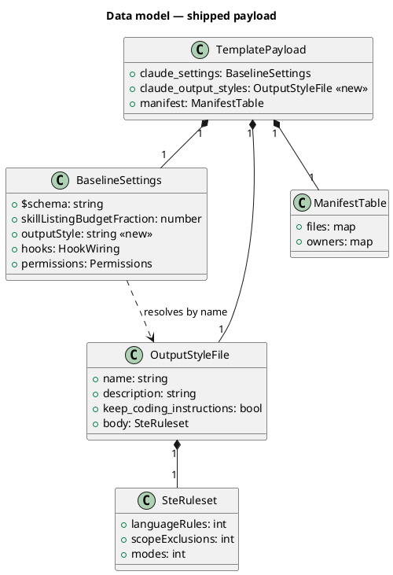
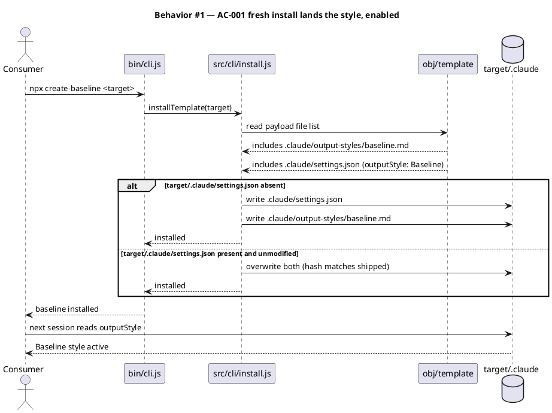
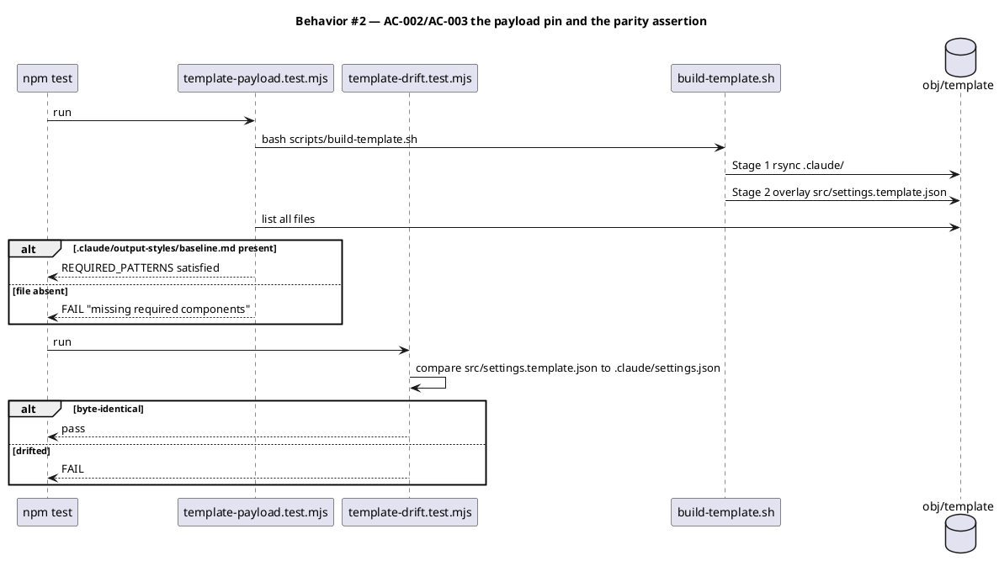
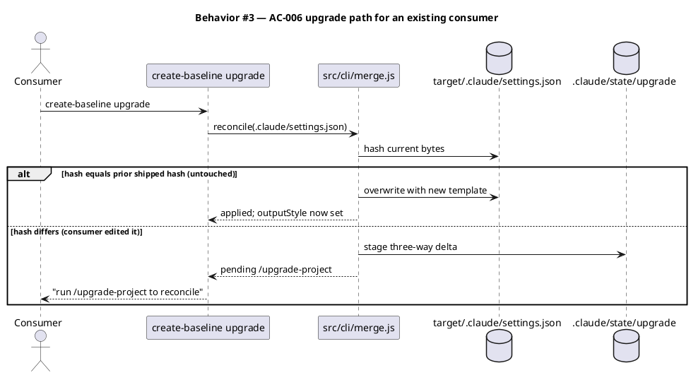
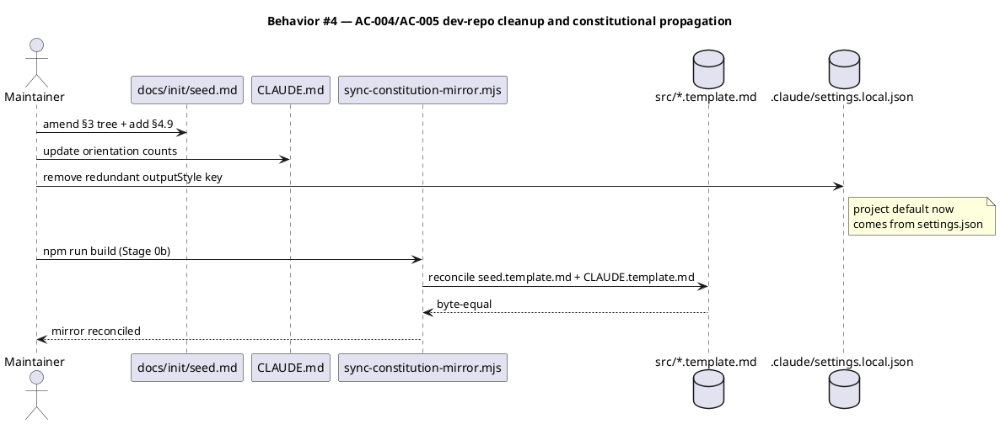
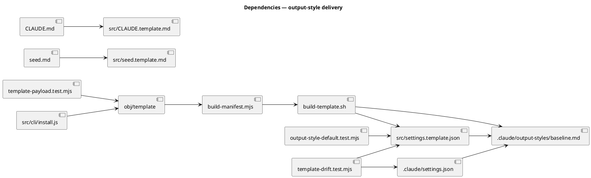

# Ship the Baseline output style as an installed default

## Context

| Input | Path |
|---|---|
| Intake | *(excepted — `spec-entry` track)* |
| BRD *(if any)* | *(none)* |
| Scout *(if any)* | *(excepted)* |
| Research *(if any)* | *(excepted)* |

**Write set**: `src/settings.template.json`, `.claude/settings.json`, `.claude/settings.local.json`, `.claude/output-styles/baseline.md`, `tests/template-payload.test.mjs`, `tests/output-style-default.test.mjs`, `docs/init/seed.md`, `src/seed.template.md`, `src/CLAUDE.template.md`, `CLAUDE.md`

`src/settings.template.json` falls outside every `diagram_profiles` entry, so the full architectural set applies. The three structural kinds are satisfied by reference (see Design); the behavioural kinds are drawn.

## Goal

A fresh `npx @friedbotstudio/create-baseline` install speaks in the Baseline ASD-STE100 voice with no further action, because the shipped `.claude/settings.json` sets `outputStyle: "Baseline"` and the style file is pinned into the payload.

## Non-goals

- **No CLI opt-out flag.** No `--no-output-style` is added to the installer (see Alternatives considered).
- **No change to `prose`, `humanizer`, `technical-writer`, `documentation`, or `copywriting`.** The style scopes itself out of the files those skills own; their register is untouched.
- **No third mode.** The shipped style carries Engineer and Analyst only. Quirky Mode is deliberately excluded.
- **No new corpus element for the style file.** Its anchor sits outside `memory.architecture_map.governed_surface` (see Open questions).
- **No auto-merge of `.claude/settings.json` on upgrade.** Existing consumers are handled by the documented staging path, not by a new special merger.

## Design

Diagrams are the contract. Prose is only for what a diagram cannot say.

### C4 — structural kinds by reference

The payload's standing shape is already modelled. This spec is a diff against it.

```
@ref element:src-templates
```

### Data model — class diagram

The shipped settings object gains one key. The style file is a new payload member with its own frontmatter contract.



#### Migration DDL

*(none — no datastore. The class diagram models a JSON config object and a markdown payload file, both versioned by git and hashed into `manifest.json`.)*

### Behavior — sequence per AC









### State — core entity

*(omitted — the change introduces no state machine. A settings key is either present or absent; the style file is either in the payload or not. Both are covered by the sequences above.)*

### Dependencies — graph



### Contracts

| Kind | Name | Input | Output | Errors | Idempotent |
|---|---|---|---|---|---|
| Config key | `.claude/settings.json → outputStyle` | `"Baseline"` | style resolved by name at session start | unknown name → Claude Code falls back to default style | yes |
| Payload file | `.claude/output-styles/baseline.md` | — | frontmatter (`name`, `description`, `keep-coding-instructions`) + body | absent → `outputStyle` unresolvable | yes |
| Test assertion | `REQUIRED_PATTERNS` row | built `obj/template` file list | pass / `missing required components` | — | yes |
| Test assertion | `outputStyle` default check | `src/settings.template.json` bytes | pass / fail | — | yes |
| Override | consumer `.claude/settings.local.json → outputStyle` | any style name | takes precedence over `settings.json` | — | yes |

### Libraries and versions

| Library@version | Purpose | Key APIs | Confirmed against current docs |
|---|---|---|---|
| *(none)* | No third-party dependency is added. The change touches shipped JSON, a markdown payload file, two Node test files, and governance prose. | — | n/a |

The `outputStyle` settings key and the `.claude/output-styles/<name>.md` layout are Claude Code platform surface, not a third-party library. Both are already exercised in this repository: `.claude/settings.local.json:54` carries `outputStyle` today, and the style file at `.claude/output-styles/baseline.md` is what the running session resolves. The seed §2.5 current-docs rule is satisfied by that live, on-disk evidence rather than by recall.

### Alternatives considered

| Alt | Summary | Rejected because |
|---|---|---|
| A | Opt-in: ship the file, leave `outputStyle` unset. Consumer runs `/output-style Baseline`. | The style then sits in every payload as dead weight until a consumer discovers a command nothing points them to. Shipping an opinion and disabling it by default is the worst of both: the payload cost with none of the benefit. |
| B | Default-on with a CLI opt-out flag (`--no-output-style`), full parity with the J2 CI-posture precedent. | J2 needed a flag because CI posture writes files OUTSIDE `.claude/` — `.githooks/`, `scripts/ci/`, `.github/` — into the consumer's own repo, which a settings key cannot undo. This change is one key inside `.claude/`, and an escape hatch already exists: a consumer's `settings.local.json` overrides it, or they delete one line. Adding installer surface for an opt-out that already works is the abstraction YAGNI (Art. VI.4) exists to stop. |
| C | Add `.claude/settings.json` to `SPECIAL_MERGE` so upgrading consumers get the key auto-merged. | `settings.json` carries the wiring for all 26 hooks. A silent structural merge there can reorder or drop a guard without the consumer seeing it. The staging path (Behavior #3) is the safer default; the cost is one reconciliation prompt on upgrade, which is exactly the moment a consumer should look. |
| D | Ship the style globally to `~/.claude/output-styles/`. | The installer must not write outside its target directory. Non-starter. |

**Chosen: default-on, no new installer surface.** The opt-out is `settings.local.json`, documented in Rollback.

## Design calls

The write set does not intersect `project.json → tdd.ui_globs`. No UI surface is produced.

- *(none)*

## System delta

| Verb | Element | Anchor | Concept | Kind |
|---|---|---|---|---|
| change | src-templates | `src/*.json` | build-distribution | c4_component |

`src-templates` already anchors `src/*.json`, which covers `src/settings.template.json`. Its shape changes: the shipped settings object gains the `outputStyle` key, so the payload it produces now carries a resolved output style. No `add` row is written — see Open questions for why the style file itself gets no element.

## Acceptance criteria

| ID | Criterion (given / when / then) | Kind | Upstream AC | Sequence |
|---|---|---|---|---|
| AC-001 | given a target directory with no `.claude/`, when `create-baseline` installs, then `<target>/.claude/output-styles/baseline.md` exists AND `<target>/.claude/settings.json` parses with `outputStyle === "Baseline"` | behavior | request ¶1 | §Behavior #1 |
| AC-002 | given a built `obj/template`, when `tests/template-payload.test.mjs` runs, then a `REQUIRED_PATTERNS` row matches exactly `.claude/output-styles/baseline.md`; deleting that file from the built tree fails the test with `missing required components` | preflight | request ¶1 | §Behavior #2 |
| AC-003 | given the repo, when `tests/template-drift.test.mjs` runs, then `src/settings.template.json` and `.claude/settings.json` are byte-identical and both parse with `outputStyle === "Baseline"` | preflight | request ¶1 | §Behavior #2 |
| AC-004 | given `.claude/settings.local.json` carries `outputStyle` today, when this work lands, then that key is absent from `settings.local.json` and the active style still resolves to `Baseline` from `settings.json` | behavior | request ¶1 | §Behavior #4 |
| AC-005 | given `docs/init/seed.md`, when this work lands, then §3's tree lists `output-styles/`, a `§4.9 Output styles (1)` section exists, `CLAUDE.md`'s quick-orientation line names the output style, and `src/seed.template.md` + `src/CLAUDE.template.md` are byte-equal mirrors | behavior | Art. I.4 | §Behavior #4 |
| AC-006 | given an existing consumer whose `.claude/settings.json` hash differs from the prior shipped hash, when `create-baseline upgrade` runs, then the file is staged for `/upgrade-project` and NOT silently overwritten | error-mapping | request ¶3 | §Behavior #3 |
| AC-007 | given a clean tree, when `npm run build` runs, then it exits 0 and `obj/template/.claude/output-styles/baseline.md` exists AND `obj/template/.claude/settings.json` carries `outputStyle === "Baseline"` AND `obj/template/.claude/manifest.json → files` contains a sha256 entry for the style file | smoke | request ¶1 | §Behavior #2 |
| AC-008 | given the shipped `.claude/output-styles/baseline.md`, when its body is read, then it declares exactly two modes (Engineer, Analyst) and carries a `## Scope` section excluding code, skill-owned files, governance documents, and direct quotes | behavior | user decision | §Behavior #1 |

## Test plan

| Category | Scenario | Expected | Covers |
|---|---|---|---|
| Golden path | Build the template, list payload paths | `.claude/output-styles/baseline.md` present; `settings.json` carries `outputStyle` | AC-002, AC-007 |
| Golden path | Parse `src/settings.template.json` | `outputStyle === "Baseline"` | AC-003 |
| Input boundary | Delete the style file from a built tree, re-run the payload test | test fails naming the missing required component | AC-002 |
| Contract violation | `settings.template.json` and `.claude/settings.json` differ by one byte | `template-drift.test.mjs` fails | AC-003 |
| Contract violation | Style file frontmatter missing `name:` | style unresolvable; assertion on frontmatter keys fails | AC-008 |
| Failure mode | Consumer `settings.json` edited before upgrade | staged for `/upgrade-project`, original bytes preserved on disk | AC-006 |
| Concurrency / ordering | Two `npm pack` runs race the `prepack` build | build lock serializes; both produce identical payload including the style file | AC-007 |
| Regression trap | All 26 hooks still wired in `settings.json` after the key is added | hook arrays unchanged; count unchanged | AC-003 |
| Regression trap | `.claude/settings.local.json` still parses as valid JSON after the key is removed | parses; no trailing-comma damage | AC-004 |
| Regression trap | `audit-baseline` after the seed/CLAUDE amendment | exit 0; CLAUDE.md still under the 40,000-char cap | AC-005 |

## Observability

| Signal | Name | Shape | Purpose |
|---|---|---|---|
| Test | `template-payload` REQUIRED_PATTERNS | pass/fail in CI | the style file silently falling out of the payload is caught at build |
| Test | `template-drift` parity | pass/fail in CI | template and live settings cannot diverge |
| Build | `build-template.sh` Stage 4 `audit-baseline` | exit 0 / 1 | governance counts and the CLAUDE.md size cap stay honest |
| Manifest | `obj/template/.claude/manifest.json → files` | sha256 entry per payload file | the style file is hash-tracked, so consumer drift is detectable |

This change ships no runtime code, so there is no metric or alarm. The signals are build-time and test-time, which is where a payload regression actually surfaces.

## Rollout

### Prerequisites

| # | Prerequisite | enforced-by |
|---|---|---|
| 1 | The built payload contains `.claude/output-styles/baseline.md` | AC-002 |
| 2 | `src/settings.template.json` and `.claude/settings.json` stay byte-identical, both carrying `outputStyle` | AC-003 |
| 3 | A full `npm run build` completes and hashes the style file into the shipped manifest | AC-007 |
| 4 | An upgrading consumer with a modified `settings.json` is staged, never overwritten | AC-006 |

- **Feature flag**: none. The change is a shipped default, and its opt-out is a consumer settings key (see Rollback). Adding a flag was rejected as Alternative B.
- **Migration order**: 1 amend `seed.md` + `CLAUDE.md` (Art. I.4 precedence) → 2 add the failing tests → 3 wire `outputStyle` into both settings files → 4 remove the `settings.local.json` key → 5 rebuild and reconcile mirrors.
- **Canary**: none applicable — the artifact is an npm tarball, not a running service. `npm run publish:smoke` installs the built tarball into a scratch directory and is the pre-publish check.

## Rollback

- **Kill-switch**: a consumer sets `outputStyle` to any other style name in their own `.claude/settings.local.json`, which takes precedence over the shipped `settings.json`. No reinstall needed. To disable at the project level, delete the one `outputStyle` line from `.claude/settings.json`.
- **Maintainer revert**: `git revert` the landing commit. The style file leaves the payload, the key leaves both settings files, and the `REQUIRED_PATTERNS` row leaves the test in the same commit, so no half-wired state is reachable.
- **Signal to roll back**: `npm test` red on `template-payload`, `template-drift`, or `audit-baseline`, or `npm run publish:smoke` failing to resolve the style in a scratch install. All three run in CI on the landing commit, so a bad rollout surfaces before publish rather than within a time window.

## Archive plan

- Defaults *(automatic)*: spec, spec approval, security report (if produced).
- Extras *(list any non-default files)*:
  - *(none)*

## Open questions

- **The style file gets no corpus element, and that is a gap worth naming.** `.claude/output-styles/` sits outside `memory.architecture_map.governed_surface.roots`, and `.md` is not in `codeExtensions`, so an `add` row would fail `/spec-lint`'s governed-surface check. The delta therefore records only the `src-templates` change. This is correct under today's config but means the shipped style is not witnessed by the corpus. Widening `governed_surface` to cover payload assets is a separate decision with its own blast radius — flagged here, not resolved here. Reviewer: accept the gap, or send this back to widen the surface first?
