# Spec — a spec declares its delta against `docs/system/`; archive verifies it against the landed diff

## Context

| Input | Path |
|---|---|
| Intake | `docs/intake/system-spec-delta.md` |
| BRD *(if any)* | *(none)* |
| Scout *(if any)* | `docs/scout/system-spec-delta.md` |
| Research *(if any)* | `docs/research/system-spec-delta.md` |
| Plan (requester-authored) | `.config/plans/i-guess-earlier-we-synthetic-moth.md` §§ C2-1…C2-6 |
| Epic state | `.claude/state/epic/system-spec-delta.json` |

**Write set**: `.claude/project.json`, `.claude/skills/**`, `docs/system/diagrams/**`, `docs/init/seed.md`, `CLAUDE.md`, `.claude/CONSTITUTION.md`, `src/*.template.md`, `tests/**`, `obj/**` — non-architectural profile (reduced diagram set: c4_component, class, sequence, dependency_graph).

## Goal

A spec declares what it changes in the standing model, `/archive` applies only the rows the landed diff confirms, `/system-reconcile` reports corpus damage without repairing it unattended, and every shard carries a witness kind so the corpus can be cited as evidence.

## Non-goals

- No stored or cached index. Derived-on-read stays (`resolve.mjs:24` — a HEAD-keyed cache measured 29 ms against 17.5 ms and was wrong on non-git trees).
- No composed view on disk. `readAll(specDir).views` stays an empty array.
- No bulk digest refresh. `digest.stampAll` keeps throwing without an explicit id list.
- No second corpus writer. `/archive` Step 5 on the primary tree stays the sole writer; `/system-reconcile` has no apply path reachable from a workflow phase.
- `spec-sync`'s bootstrap path (`workspace/sync.mjs`) is untouched.
- `contribute.syncBack`'s receipt defect (backlog `syncback-applied-overstates-what-it-stamped-8e21`) is **not** fixed here — see D7. `deferred: cost`.
- No asserted test ceiling is raised.

## Decisions

Recorded in main context per CLAUDE.md Article XI.12; reviewed at gate A rather than asked.

| # | Decision | Owner | Rationale |
|---|---|---|---|
| D1 | Verification lives in a **new** `workspace/delta.mjs`, and `/archive` calls **one** entry point `verifyAndApplyDelta`. | engineer | Research Candidate A. Extending `contribute.syncBack` (Candidate B) builds the new receipt on `applied[]`, measured wrong by 2.7× and unfalsifiable on empty input. A single entry point keeps archive's `SKILL.md` to one `node -e` invocation and avoids a second site for the zsh word-splitting landmine. |
| D2 | The delta table has **no Witness column**. A row authors `Kind`; the witness is derived by `witness.bindingFor(kind)`. | engineer | An authored Witness restates config that can disagree with it, or overrides it and becomes a second source of truth. Deriving keeps `project.json → memory.architecture_map.witnesses` the single authority. Narrows the plan's proposed shape. |
| D3 | `' @kind` and `' @witness` are written **inside** the `!startsub` block, immediately after the directive. | engineer | `!includesub file.puml!NAME` pulls in only the block's content (verified: https://plantuml.com/en/preprocessing), so an annotation outside it does not survive extraction. `shards.mjs:19` is line-anchored and matches at any depth. |
| D4 | `*(none)*` is the **sole** legal empty delta body. | engineer | An exact literal is greppable and cannot be confused with a section an author left blank. Matches the existing `## Design calls` empty convention. |
| D5 | Structural retrieval is a **labelled lane ranked above** term overlap, not a replacement. | engineer | Only 14 of 112 elements carry `source_spec:` (12.5%), so structural alone answers 1 question in 8. The measured 91% term-overlap hit rate argues for labelling provenance, not for deleting the fallback. |
| D6 | The new writer is `writeDiagramShard`, not `writeShard`. | engineer | `tests/helpers/memory-fixtures.mjs` already exports `writeShard(memDir, category, …)` for **memory** shards. Two subsystems, one verb, plausibly imported by one test file. |
| D7 | `syncBack`'s partition fix (`8e21`) stays out of scope, recorded. | engineer | Cycle 2 is already six slices. D1 routes around the defect rather than through it, so the debt does not compound. `deferred: cost`. |
| D8 | The amendment is slice **F**, matching the requester's C2-6 ordering; Art. I.4 ordering is **intra-slice** (seed.md → CLAUDE.md → mirrors). | engineer | Slice A is additive to `project.json`'s required-section list, which `seed.md` does not enumerate, so it contradicts nothing standing. The amendment **records** doctrine Cycle 1 already made true rather than authorizing new behaviour. |
| D9 | `/system-reconcile` exposes **no** apply path callable from a workflow phase. Repairs require a human-confirmed invocation. | engineer | Preserves `corpus-has-one-writer-archive-on-the-primary-tree-2026-08-06`, whose re-verification clause turns on exactly whether a corpus write is wired into a phase other than the single writer. Enforcing by construction beats enforcing by a mode flag. |

## Design

Diagrams are the contract. Prose is only for what a diagram cannot say.

### C4 — Component (changed containers only)

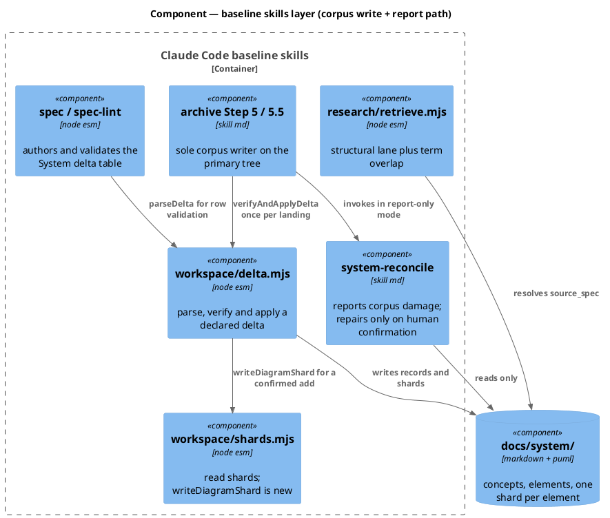

### Data model — class diagram

No database. This system's persistence is plain files under `docs/system/`, so there is no migration DDL; the class diagram models the in-memory records the new modules exchange.

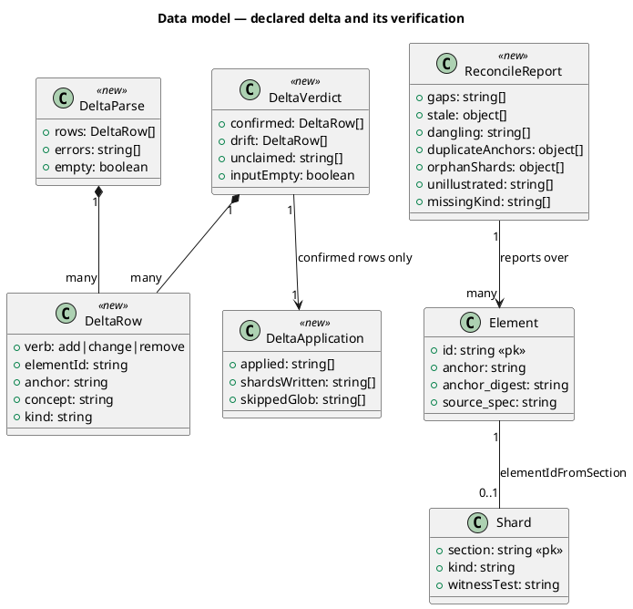

`Shard.kind` and `Shard.witnessTest` carry no `<<new>>` / `<<changed>>` stereotype on purpose: both fields already exist in the reader (`shards.mjs:19-20`) and their shape does not change. They are `null` for every shard the shard writer did not author, and slice D populates the data. **No reader change is required.**

### Behavior — sequence per AC

#### Behavior #1

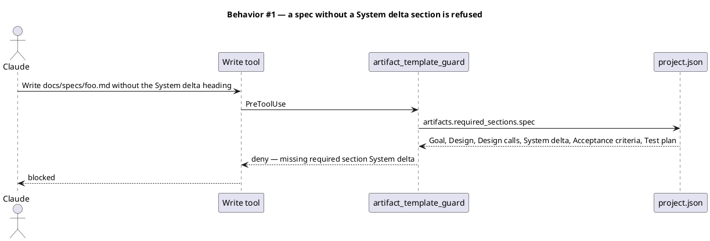

#### Behavior #2

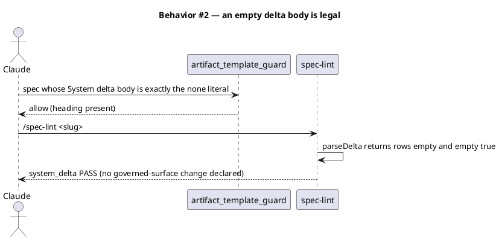

#### Behavior #3

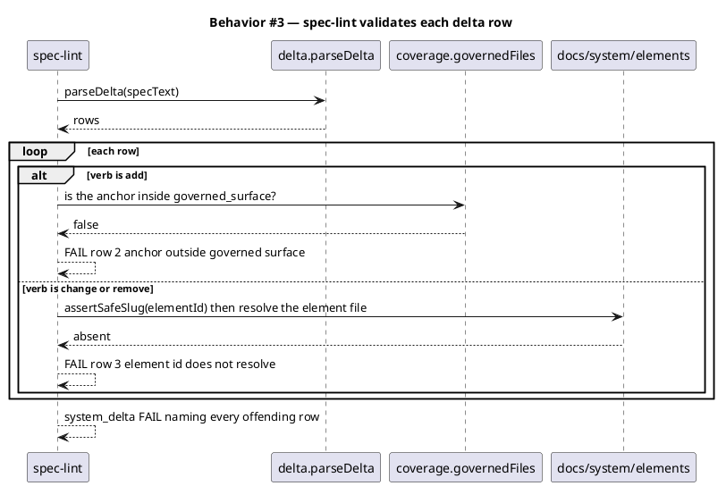

#### Behavior #4

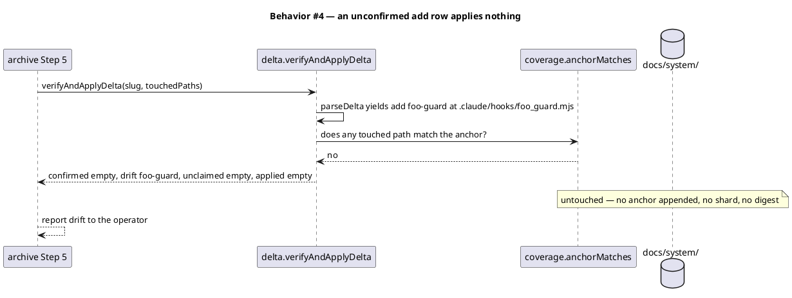

#### Behavior #5

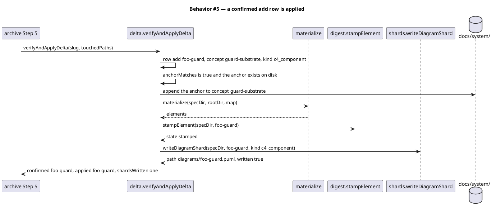

#### Behavior #6

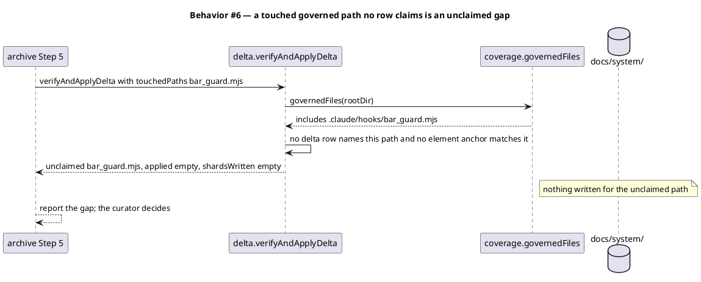

#### Behavior #7

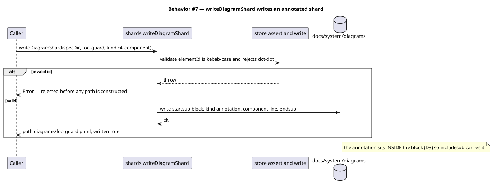

#### Behavior #8

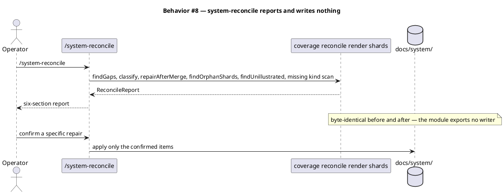

#### Behavior #9

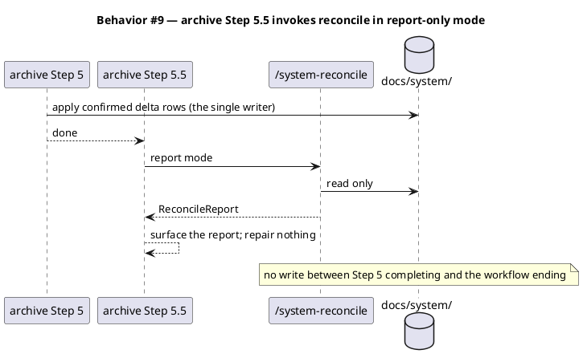

#### Behavior #10

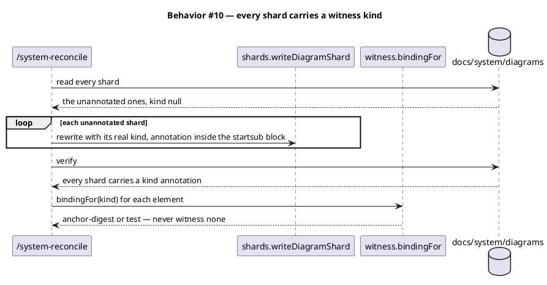

#### Behavior #11

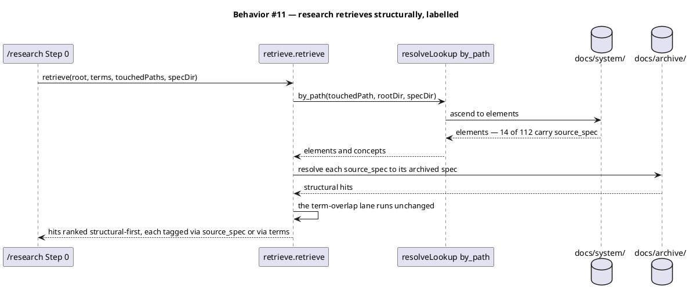

#### Behavior #12

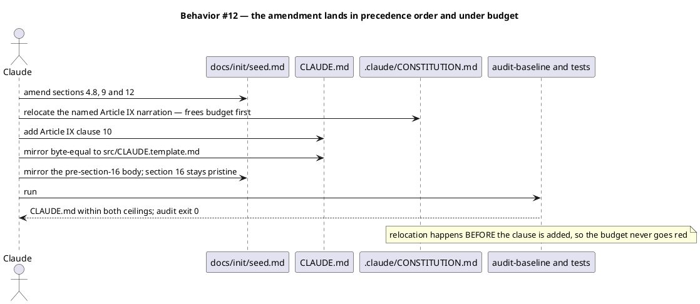

#### Behavior #13

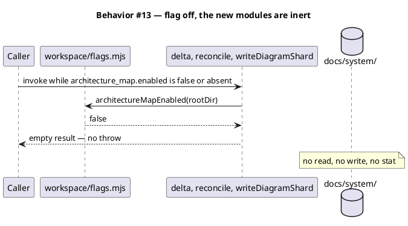

#### Behavior #14

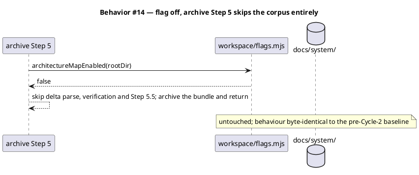

### State — core entity

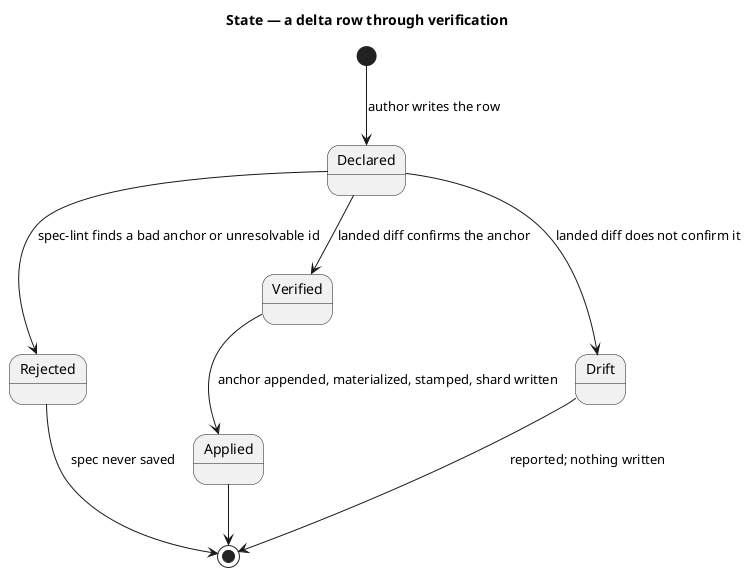

There is no `Drift --> Applied` transition. Adding one would let an unverified declaration write the corpus, which is the property slice C exists to create.

### Dependencies — graph

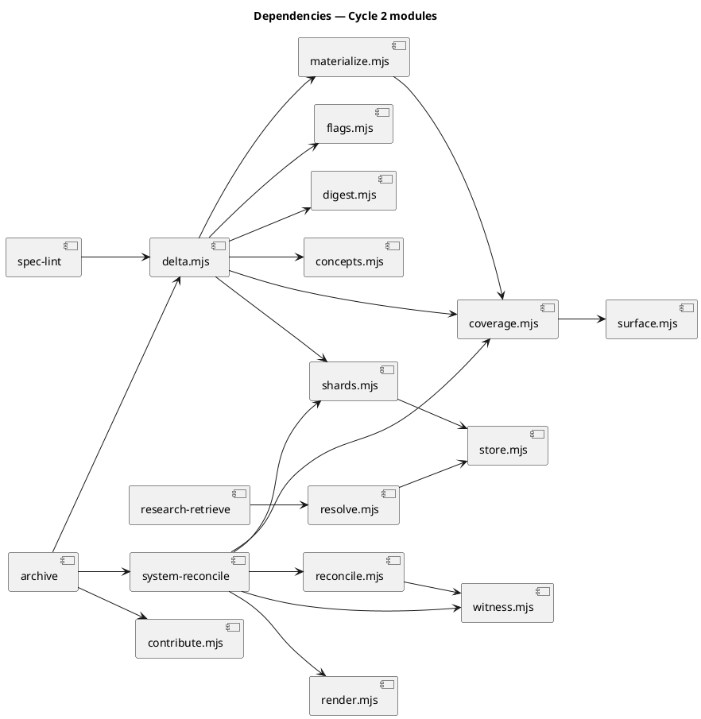

Acyclic. `spec-lint → delta.mjs` is a read-only use of `parseDelta`; the lint never reaches `verifyDelta` or any writer.

### Contracts

| Kind | Name | Input | Output | Errors | Idempotent |
|---|---|---|---|---|---|
| Function | `delta.parseDelta(specText)` | spec markdown | `{rows: DeltaRow[], errors: string[], empty: boolean}` | never throws; malformed rows land in `errors` | yes (pure) |
| Function | `delta.verifyDelta({rows, touchedPaths, specDir, rootDir})` | parsed rows + landed paths | `{confirmed, drift, unclaimed, inputEmpty}` | throws on a slug or anchor containing `..`, before any read | yes (pure over the same tree) |
| Function | `delta.applyDelta({confirmed, specDir, rootDir})` | confirmed rows only | `{applied: string[], shardsWritten: string[], skippedGlob: string[]}` | throws on write failure | yes — re-running applies nothing new |
| Function | `delta.verifyAndApplyDelta({slug, specDir, memDir, rootDir, touchedPaths})` | the archive entry point | `{confirmed, drift, unclaimed, applied, shardsWritten, skippedGlob, inputEmpty}` | returns `inputEmpty: true` when `touchedPaths` is empty — never the same shape as "nothing matched" | yes |
| Function | `shards.writeDiagramShard(specDir, elementId, {kind, witnessTest, label})` | element id + annotations | `{path: string, written: boolean}` | throws on a non-kebab id or a traversal attempt, before constructing a path | yes — same input rewrites identical bytes |
| Function | `reconcile-report.runReconcile({specDir, rootDir})` | corpus root | `ReconcileReport` (seven arrays) | never throws; an unreadable corpus yields empty arrays | yes (read-only) |
| Function | `retrieve.retrieve({root, slug, terms, touchedPaths, specDir})` | existing args plus two optional | existing hits, each gaining `via: "source_spec"` or `via: "terms"` | never throws; absent `specDir` degrades to term overlap only | yes |
| CLI | `node .claude/skills/spec-lint/lint.mjs <slug>` | slug | table gains a `system_delta` row | exit 2 on a missing spec (unchanged) | yes |
| Skill | `/system-reconcile` | none | seven-section report; repairs only on confirmation | — | yes in report mode |

**Return-shape rule** (from `zsh-does-not-word-split-…` and `8e21`): every new function distinguishes "you passed me nothing" (`inputEmpty: true`) from "nothing matched" (`inputEmpty: false` with empty arrays). No new function may return one shape for both.

### Libraries and versions

| Library@version | Purpose | Key APIs | Confirmed against current docs |
|---|---|---|---|
| *(none added)* | This change adds no dependency; all helpers are zero-dep `.mjs` on Node builtins. | — | n/a |
| PlantUML *(format, not a dependency)* | Shard annotation syntax written by `writeDiagramShard`. | line comment `'` **at line start**; block comment `/' … '/`; `!startsub NAME` / `!endsub`, where content inside the block is what `!includesub` pulls in | yes — context7 `/websites/plantuml` → https://plantuml.com/en/commons, https://plantuml.com/en/preprocessing |

`plantuml -checkonly` is advisory-by-default in this repo (no JVM), so the kind annotation is parsed by `shards.mjs:19`, never by PlantUML. That regex is already line-anchored and matches the verified rule; slice D changes data only.

### Alternatives considered

| Alt | Summary | Rejected because |
|---|---|---|
| B | Extend `contribute.syncBack` in place with delta rows. | Builds the new receipt on `applied[]`, measured wrong by 2.7× (`8e21`), and on a return shape that cannot distinguish empty input from no match. Forces the `8e21` fix into scope or ships knowingly on top of it. |
| C | `/system-reconcile` owns verification; archive calls its apply mode. | Makes the report-only rule a convention rather than a property, and trips the re-verification clause of `corpus-has-one-writer-archive-on-the-primary-tree-2026-08-06`. Also inverts the epic's dependency order, putting the most coupling in the slice that should be smallest. |
| D | Author the Witness column per row (the plan's original table shape). | Restates `project.json → witnesses` where it agrees, and becomes a second source of truth where it does not. Superseded by D2. |

## Design calls

*(none)*

## System delta

Added 2026-08-07, mid-epic. Slice A made this heading a required spec section, and this spec predates
slice A — so `artifact_template_guard` denied every write to it from the moment slice A landed. The
epic's own spec became the first artifact its first slice locked out, and slices D–F would each have
hit the same wall. The section is filled in retroactively with what the epic has actually added to the
model, which is one element.

| Verb | Element | Anchor | Concept | Kind |
|---|---|---|---|---|
| add | system-reconcile-report | .claude/skills/system-reconcile/*.mjs | memory-model | c4_component |

Slices A and C add no row: `workspace/delta.mjs` (A) and `workspace/record-codec.mjs` (C) both fall
under the `workspace-corpus` element's existing glob anchor, so the model already routes to them and
coverage stays total. Slice D writes shard annotations, not elements; E touches `research/retrieve.mjs`,
already anchored; F is governance prose outside the governed surface.

## Acceptance criteria

| ID | Criterion (given / when / then) | Kind | Upstream AC | Sequence |
|---|---|---|---|---|
| AC-001 | given `artifacts.required_sections.spec` includes `System delta`, when a spec is written without that heading, then `artifact_template_guard` denies the write naming that section | behavior | intake AC 1 | §Behavior #1 |
| AC-002 | given a spec whose System delta body is exactly the `*(none)*` literal, when the guard and `/spec-lint` run, then both pass and `parseDelta` reports `empty: true` | behavior | intake AC 2 | §Behavior #2 |
| AC-003 | given a delta row whose verb is `add` and whose anchor falls outside `memory.architecture_map.governed_surface`, or whose verb is `change`/`remove` and whose element id does not resolve under `docs/system/elements/`, when `/spec-lint` runs, then the `system_delta` check FAILs naming each offending row, and id validation calls `assertSafeSlug` before any path is built | preflight | intake AC 3 | §Behavior #3 |
| AC-004 | given an `add` row whose anchor the landed diff does not confirm, when `/archive` Step 5 runs, then no anchor is appended, no shard is written, no digest is stamped, and the row is returned in `drift` | behavior | intake AC 4 | §Behavior #4 |
| AC-005 | given an `add` row whose anchor exists on disk and appears in the landed diff, when `/archive` Step 5 runs, then the anchor is appended to the named concept, `materialize` re-runs, `stampElement` stamps the element, and a shard is written | behavior | intake AC 5 | §Behavior #5 |
| AC-006 | given a landing that touches a governed-surface path no delta row claims and no element anchors, when `/archive` Step 5 runs, then the path is returned in `unclaimed` and nothing is written for it | behavior | intake AC 6 | §Behavior #6 |
| AC-007 | given `writeDiagramShard(specDir, elementId, {kind, witnessTest, label})` called with a valid id, then a `.puml` shard is written whose kind annotation sits inside the `!startsub` block; and given a non-kebab id or one containing `..`, then it throws before constructing a path | behavior | intake AC 7 | §Behavior #7 |
| AC-008 | given the live corpus, when `/system-reconcile` runs without human confirmation, then `docs/system/` is byte-identical afterwards and the report covers all seven checks (gaps, stale, dangling, duplicate anchors, orphan shards, unillustrated, missing kind annotation) | preflight | intake AC 8 | §Behavior #8 |
| AC-009 | given `/archive` Step 5.5, when it invokes `/system-reconcile`, then the invocation is report-only and `docs/system/` is unchanged between Step 5 completing and the workflow ending | smoke | intake AC 9 | §Behavior #9 |
| AC-010 | given the backfill has run, when `docs/system/diagrams/` is scanned for the kind annotation, then every shard in it carries one, and `witness.bindingFor` returns a binding other than `witness: none` for every element | behavior | intake AC 10 | §Behavior #10 |
| AC-011 | given a scout-touched path resolving to an element that carries `source_spec:`, when `/research` Step 0 runs, then the archived spec named by `source_spec:` appears in the hits tagged `via: "source_spec"`, ranked above term-overlap hits, and the term lane still returns its own hits tagged `via: "terms"` | behavior | intake AC 11 | §Behavior #11 |
| AC-012 | given the amendment, when the tree is inspected, then `seed.md` §4.8/§9/§12 and `CLAUDE.md` Article IX clause 10 carry the recall rule, `src/CLAUDE.template.md` is byte-equal to `CLAUDE.md`, `src/seed.template.md`'s pre-§16 body mirrors `seed.md` with §16 pristine, `audit-baseline` exits 0, and `CLAUDE.md` is at most 38,800 chars and at most 39,000 bytes with no asserted ceiling raised | preflight | intake AC 12 | §Behavior #12 |
| AC-013 | given `memory.architecture_map.enabled` is false or absent, when any `delta` export, `runReconcile`, or `writeDiagramShard` is invoked, then each returns an empty result without throwing and performs no read or write under `docs/system/` | preflight | intake AC 13 | §Behavior #13 |
| AC-014 | given `memory.architecture_map.enabled` is false or absent, when `/archive` Step 5 runs, then it skips delta parsing, verification and Step 5.5 entirely and `docs/system/` is untouched | preflight | intake AC 13 | §Behavior #14 |

## Test plan

| Category | Scenario | Expected | Covers |
|---|---|---|---|
| Golden path | Spec with a well-formed 3-row delta; landed diff confirms all three | 3 confirmed, 0 drift, 0 unclaimed; 3 anchors appended, 3 shards written | AC-005 |
| Golden path | `writeDiagramShard` on a fresh element id | shard at `diagrams/<id>.puml`; `readShard(...).kind` round-trips the written kind | AC-007 |
| Golden path | `/system-reconcile` over a temp corpus with one seeded gap and one orphan shard | report names both; tree hash unchanged | AC-008 |
| Golden path | `retrieve` with a touched path resolving to an element carrying `source_spec` | that archived spec present, `via: "source_spec"`, ranked above every `via: "terms"` hit | AC-011 |
| Input boundary | Delta body exactly `*(none)*`; also empty, whitespace-only, and `(none)` without asterisks | the literal → `empty: true` PASS; the other three → FAIL naming the required literal | AC-002 |
| Input boundary | `writeDiagramShard` with id `..`, `a/b`, `A_B`, and a 5,000-char id | throws in every case, before any path is constructed | AC-007 |
| Input boundary | Delta table with 0 rows, 1 row, and 50 rows | parses in all three; no row cap | AC-002, AC-003 |
| Contract violation | `add` row anchoring `node_modules/x.mjs`, outside `governed_surface` | `spec-lint` `system_delta` FAIL naming the row index | AC-003 |
| Contract violation | `change` row naming element id `no-such-element` | `spec-lint` FAIL; `assertSafeSlug` runs first on a hostile id | AC-003 |
| Contract violation | Spec written with no System delta heading | `artifact_template_guard` denies; message names the section | AC-001 |
| Concurrency / ordering | Snapshot the corpus at the Step 5 and Step 5.5 boundaries | bytes differ across Step 5, identical across Step 5.5 | AC-009 |
| Failure mode | `add` row whose anchor is absent from the landed diff | `drift` non-empty, `applied` empty, corpus byte-identical | AC-004 |
| Failure mode | `verifyAndApplyDelta` called with an empty `touchedPaths` | `inputEmpty: true` — distinguishable from a no-match result | AC-004, AC-006 |
| Failure mode | Governed path touched that no row claims | present in `unclaimed`; nothing written | AC-006 |
| Failure mode | Corpus directory unreadable while the flag is on | every new function returns empty; no throw reaches the caller | AC-013 |
| Regression trap | `findGaps` over the live repo | still empty (`workspace-coverage.test.mjs`) | — |
| Regression trap | `readAll('docs/system').views` | still empty (`system-spec-sync.test.mjs`) | — |
| Regression trap | README gate — the delta adds no element field | `workspace-readme-gate.test.mjs` unchanged | — |
| Regression trap | `stampAll` without an explicit id list | still throws | — |
| Regression trap | Flag off — snapshot `docs/system/` and every Cycle-2 path's output | byte-identical to the pre-Cycle-2 baseline | AC-013, AC-014 |
| Regression trap | `CLAUDE.md` size and both mirrors after slice F | within both ceilings, mirrors intact, audit exit 0 | AC-012 |
| Regression trap | Every shard in `docs/system/diagrams/` after slice D | every one carries a kind annotation; the `elementIdFromSection` join stays total both ways | AC-010 |

## Observability

| Signal | Name | Shape | Purpose |
|---|---|---|---|
| Log | archive Step 5 receipt | `{confirmed, drift, unclaimed, applied, shardsWritten, skippedGlob, inputEmpty}` printed to the operator | the receipt an operator reads to decide the fold-back worked; `inputEmpty` makes a zero result falsifiable |
| Log | `/system-reconcile` report | seven named arrays with counts | corpus health at a glance |
| Log | `spec-lint` `system_delta` row | PASS/FAIL plus offending row indices | preflight before the guard bites |
| Metric | count of shards carrying a kind annotation | integer, target every shard in `docs/system/diagrams/` | citability of the corpus |
| Alarm | `findGaps(...)` non-empty after a landing | asserted in `workspace-coverage.test.mjs`; a non-empty result fails CI | detects corpus decay within one commit |

## Rollout

### Prerequisites

| # | Prerequisite | enforced-by |
|---|---|---|
| 1 | `CLAUDE.md` stays within both ceilings with mirrors intact and `audit-baseline` at exit 0; the budget is paid by relocating the Article IX clause 3 and clause 5 narration (the `_pending.md` inbox mechanics and the flat-shape size-cap rationale) to `.claude/CONSTITUTION.md` **before** clause 10 is added | AC-012 |
| 2 | With the architecture-map flag false or absent, every new module is inert — no read, no write, no throw | AC-013 |
| 3 | With the flag off, `/archive` Step 5 skips the corpus path entirely and `docs/system/` is untouched | AC-014 |
| 4 | `/spec-lint` validates every delta row, calling `assertSafeSlug` before constructing any element path | AC-003 |
| 5 | `/system-reconcile` leaves `docs/system/` byte-identical when run without human confirmation | AC-008 |
| 6 | Archive Step 5.5's invocation is report-only; the corpus does not change after Step 5 completes | AC-009 |

- **Feature flag**: `memory.architecture_map.enabled` — already present, `true` in this repository (the canary), absent from `src/project.template.json` so every consumer reads `false`. No new flag is introduced.
- **Migration order**: slice A (delta section) → slice B (shard writer + reconcile) → slice C (archive verify; needs A and B) → slice D (backfill; needs B) → slice E (research) → slice F (amendment). D and E are independent of C and may land in either order once their prerequisites hold.
- **Canary**: this repository is the only consumer with the flag on. Slice C's first real execution is the landing of slice D — verify the receipt's `inputEmpty` is false and the counts are non-zero before trusting an empty result (landmine `zsh-does-not-word-split-…`).

## Rollback

- **Kill-switch**: set `memory.architecture_map.enabled` to `false` in `.claude/project.json`. Every Cycle-2 path goes inert; `docs/system/` stays on disk, unread. Slice A's required-section entry is removed from `artifacts.required_sections.spec` in the same edit — it is the only change the flag does not gate.
- **Signal to roll back**: `workspace-coverage.test.mjs` reporting a non-empty `findGaps`, or `/archive` Step 5 writing to `docs/system/` for a row that landed in `drift`. Both are asserted in CI and surface on the run that introduces them, well inside 5 minutes.
- Slice F is reverted by `git revert` of its commit; `audit-baseline` re-verifies both mirrors and the size ceilings on the next run.

## Slice A

**C2-1 — the System delta section becomes required.**

A spec states its design intent against the standing model in a table whose verbs are the corpus's existing op vocabulary (`add` / `change` / `remove`, per `conflicts-are-reported-never-auto-resolved-2026-08-04`). The section composes with the element-reference affordance documented at `spec/SKILL.md:35` rather than replacing it: the reference satisfies the structural diagram kinds, and the delta states what changes. Per D2 the table carries no Witness column — `Kind` is authored, the witness is derived by `witness.bindingFor(kind)`. Per D4 `*(none)*` is the sole legal empty body.

Row shape: `| Verb | Element | Anchor | Concept | Kind |`.

- **ACs**: AC-001, AC-002, AC-003
- **Write surface**: `.claude/project.json` (`artifacts.required_sections.spec`), `.claude/skills/spec/template.md`, `.claude/skills/spec/SKILL.md`, `.claude/skills/spec-lint/lint.mjs`, `.claude/skills/spec-lint/SKILL.md`, `.claude/skills/workspace/delta.mjs` (`parseDelta` only), `tests/`
- **Depends on**: nothing
- **Notes**: `artifact_template_guard` needs no code change — it reads the config key (`artifact_template_guard.mjs:44`). `spec-lint/SKILL.md` claims "three checks" while `lint.mjs` already wires four plus a conditional fifth; correct that prose here.

## Slice B

**C2-3 — diagram shard writer plus the `/system-reconcile` skill.**

`shards.mjs` is read-only today and nothing in the codebase writes a `.puml`. Add `writeDiagramShard` (D6), placing the kind annotation inside the `!startsub` block (D3). Add `/system-reconcile`, which composes the orphaned corpus APIs into one seven-section report and repairs only what a human confirms. Per D9 it exports no writer reachable from a workflow phase, which is what preserves the one-writer decision.

- **ACs**: AC-007, AC-008, AC-013
- **Write surface**: `.claude/skills/workspace/shards.mjs`, `.claude/skills/system-reconcile/SKILL.md`, `.claude/skills/system-reconcile/reconcile-report.mjs`, `.claude/project.json` (skill count), `CLAUDE.md` + `src/CLAUDE.template.md` + `docs/init/seed.md` + `src/seed.template.md` + `README.md` + the docs site (57 → 58 skills), `obj/template/.claude/manifest.json`, `tests/`
- **Depends on**: nothing
- **Notes**: the new skill declares `owner: baseline` (Art. XII) and lands in `owners.skills` with a sha256. Report sources: `coverage.findGaps`, `reconcile.classify`, `reconcile.repairAfterMerge`, `render.findOrphanShards`, `shards.findUnillustrated`, and a new missing-kind scan. Do **not** duplicate `listStale` — Cycle 1 already wired it at `memory-flush/SKILL.md:106`.

## Slice C

**C2-2 — archive verifies the declared delta against the landed diff.**

Step 5 today calls `syncBack`, which re-stamps and nothing else, so a landing that adds a governed file silently opens a coverage gap. Replace it with verify-then-apply through one entry point (D1): parse the delta, confirm each row against the landed diff scoped to the governed surface, apply only confirmed rows, and report drift and unclaimed gaps without writing. Step 5.5 invokes `/system-reconcile` report-only.

- **ACs**: AC-004, AC-005, AC-006, AC-009, AC-014
- **Write surface**: `.claude/skills/workspace/delta.mjs` (`verifyDelta`, `applyDelta`, `verifyAndApplyDelta`), `.claude/skills/workspace/record-codec.mjs` (`renderRecord` body framing), `.claude/skills/archive/SKILL.md` (Steps 5 and 5.5), `tests/`
- **Depends on**: slice A (`parseDelta` and the section it parses), slice B (`writeDiagramShard`)
- **Notes**: `contribute.syncBack` stays in place for re-stamping; `delta.mjs` owns growth. Pass touched paths as **one quoted JSON array** — zsh does not word-split, and that ambiguity already caused one silent no-op. Every return distinguishes `inputEmpty` from no-match.
- **Amended 2026-08-07, during implementation.** `record-codec.mjs` joined the write surface. AC-005's idempotence criterion is byte-identity on a re-run, and that could not hold while `renderRecord` re-framed an already-framed body — every `materialize` appended two blank lines to every element it rewrote (landmine `materialize-appends-blank-lines-every-run`, measured at 224 whitespace insertions across 112 untouched files in a single run). The landmine's own recorded fix is the round-trip test this slice wrote, so the two land together. Inside the epic's approved write set (`.claude/skills/**`, §Context), so gate A already covers it; recorded here because the slice's line did not.

## Slice D

**C2-4 — backfill the kind annotation across every shard.**

Every shard the shard writer did not author carries no annotation, so `witness.bindingFor` returns `witness: none` for those elements and the 8-kind witnesses block is effectively inert. Run `/system-reconcile`'s missing-kind report to name the backfill set — the shards `writeDiagramShard` has authored since slice B are annotated at birth and are not in it — then write each named shard's real kind through `writeDiagramShard`. This is a data backfill against an already-correct reader (`shards.mjs:19` is line-anchored and matches PlantUML's verified rule); **no reader change**.

- **ACs**: AC-010
- **Write surface**: `.claude/skills/workspace/shards.mjs`, `docs/system/diagrams/**`, `tests/`
- **Depends on**: slice B (`writeDiagramShard`)
- **Amended 2026-08-07, during implementation.** `.claude/skills/workspace/shards.mjs` joined the write surface. The slice's line assumed `writeDiagramShard` could rewrite a legacy shard losslessly, and it could not: it emits `Component(alias, label, kind)` — C4's *technology* argument filled with the *diagram kind*, and no `descr` argument at all. Measured across the 112-shard backfill set, C4 argument two equals the element record's `anchor` in 112/112 cases and argument four equals its `title` in 112/112, so both are derivable — but argument three is not. 61 shards declare `component` there and **51 declare `subsystem`**, while every element record reads `kind: component`. That distinction exists nowhere else on disk, so writing the three-argument form over those files would have erased it irrecoverably in 51 shards and dropped every human description. The writer therefore takes two optional fields — `technology`, defaulting to `kind`, and `description`, omitted when absent — so the two shards slice B already wrote stay byte-identical and the legacy form round-trips. Both fields go through `quotedArgument`, inheriting the REJECT-never-normalize guard. Inside the epic's approved write set (`.claude/skills/**`, §Context), so gate A already covers it; recorded here because the slice's line did not. Same pattern as slice C's `record-codec.mjs` amendment.
- **Amended 2026-08-07, before slice D opened** (workflow `readme-count-gate`, human-approved). Every live shard-count claim in this spec is now a quantifier rather than a number. The spec was written against a 112-shard corpus; slices B and `1db3b6c` each added one, so ten statements — AC-010, the §Test plan regression trap, the C4 `ComponentDb` label, the §Behavior #10 sequence, the observability target, this slice's heading, scope paragraph, write surface and note — had drifted to false. The scoping sentence was the load-bearing one: it read "Zero of 112 shards carry an annotation" against a disk holding 2 of 114, which would have sent the backfill over shards that were already annotated at birth. Counts stated as *measurements* (the `source_spec:` coverage in D5 and §Behavior #11, the whitespace-insertion figure in slice C's amendment) are deliberately untouched — rewriting an observation would falsify it. The gate that makes this class of drift detectable rather than discoverable-by-grep landed in the same workflow: `readme-gate.checkReadmeCounts`.
- **Notes**: each element's kind comes from what its shard already declares structurally (a `Component(...)` line → `c4_component`, and so on). Where a shard's kind is genuinely ambiguous, leave it unannotated and report it rather than guessing — an unwitnessed shard routes and is never evidence, which is a legal state (`unwitnessed-diagrams-are-the-only-noncitable-ones-2026-08-06`). AC-010 targets every shard rather than a fixed count, so a corpus that grew since this spec was written needs no amendment to stay satisfiable. Ambiguous shards are the one sanctioned shortfall: if any are found, the slice reports them and the unannotated remainder is recorded in the slice's commit message. **Measured at implementation: zero.** Every shard in the corpus declares exactly one `Component(` line and nothing else, so the structural derivation is total — 112 rewritten, the 2 already annotated at birth came back byte-identical, and the sanctioned shortfall is empty.

## Slice E

**C2-5 — research retrieves structurally over the corpus.**

Step 0 scores term overlap across `docs/archive/**` and the `decisions` / `libraries` categories — measured at 182 hits over 199 sources for this workflow's own terms, a 91% hit rate. Add a precise lane: each scout-touched path → `resolveLookup('by_path', …)` with a `specDir` → elements → `source_spec:` → the archived spec that authored them. Per D5 this is a labelled lane ranked above term overlap, not a replacement — only 14 of 112 elements carry `source_spec:`.

- **ACs**: AC-011
- **Write surface**: `.claude/skills/research/retrieve.mjs`, `.claude/skills/research/SKILL.md`, `tests/`
- **Depends on**: nothing
- **Notes**: `retrieve.mjs` currently emits JSON containing unescaped control characters from excerpt text, so its stdout does not always survive `JSON.parse` (observed on this workflow's own Step 0). Fix that here — a retrieval helper whose output cannot be parsed has no consumer.

## Slice F

**C2-6 — constitutional amendment.**

Records the recall rule now that Cycle 1 made it true, promotes the delta from a reference affordance to a required section, and states that archive verifies a declared delta rather than only re-stamping. Per D8 the Art. I.4 ordering is intra-slice: `seed.md` first, then `CLAUDE.md`, then the mirrors.

- `seed.md` §4.8 — the recall clause; the session-start concept map claim is now true.
- `seed.md` §9 (line 524) — the delta is a required spec section, not only a reference affordance.
- `seed.md` §12 (line 631) — archive verifies a declared delta rather than only re-stamping.
- `CLAUDE.md` Article IX, new clause 10 — before scouting or specifying, descend by concept or walk up from the touched paths before rediscovering; the map routes, the code witnesses; an unwitnessed shard routes and is never evidence.

- **ACs**: AC-012
- **Write surface**: `docs/init/seed.md`, `src/seed.template.md`, `CLAUDE.md`, `src/CLAUDE.template.md`, `.claude/CONSTITUTION.md`, `tests/`
- **Depends on**: nothing — it records doctrine rather than authorizing new behaviour (D8)
- **Notes**: **relocate before adding.** 84 chars and 57 bytes of slack; the trap has fired twice, the second time with the landmine already on disk. Rollout prerequisite 1 names the exact relocation source. An em dash is 1 char and 3 bytes — the two ceilings do not move together.

## Archive plan

- Defaults *(automatic)*: intake, scout, research, spec, spec approval, security reports (if any).
- Extras *(list any non-default files)*:
  - `.claude/state/epic/system-spec-delta.json` — archived by `epic_close.mjs` when the last child commits, not by this discovery workflow.

## Open questions

- **Was the `epic` track's state file meant to be missing?** `/triage` selected `epic` (`track_id: "epic"`, with a `track_reason` naming six slices) but did not write `.claude/state/epic/system-spec-delta.json`, which `triage/SKILL.md:111` and `seed.md:982` make its job. This spec created it with `approved: false` and the six slices above rather than restarting the workflow and discarding three completed phases. If the decomposition here differs from what was intended at triage, correct it before approving — the epic's children read that file as their contract.
