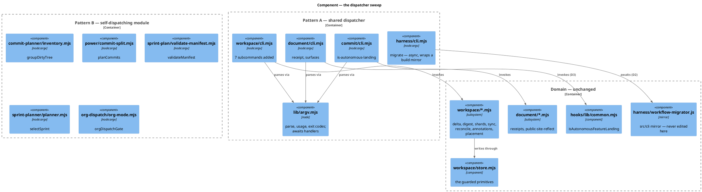
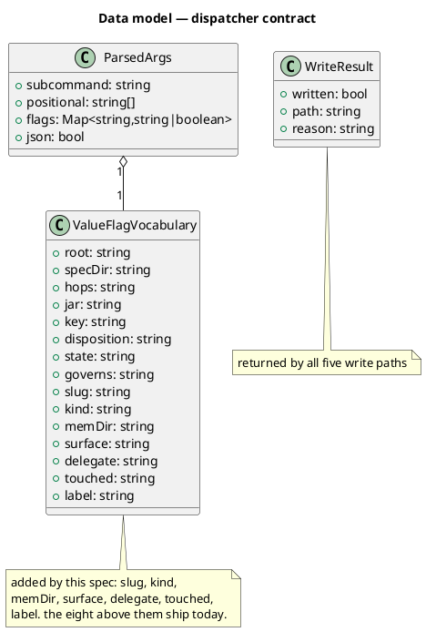
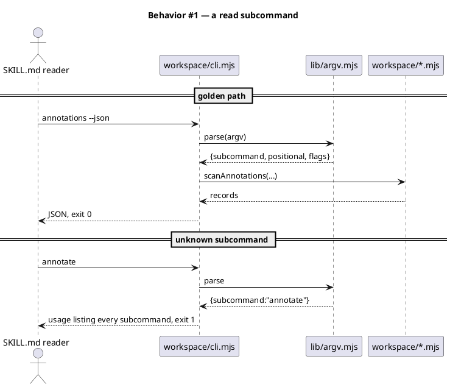
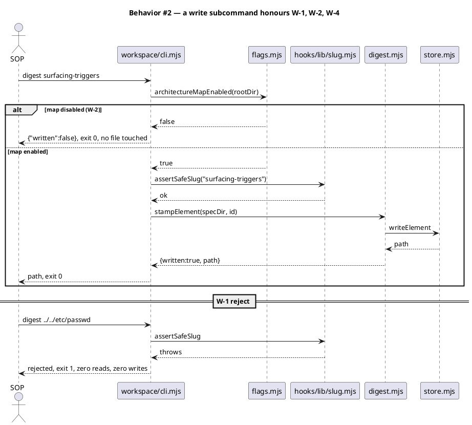
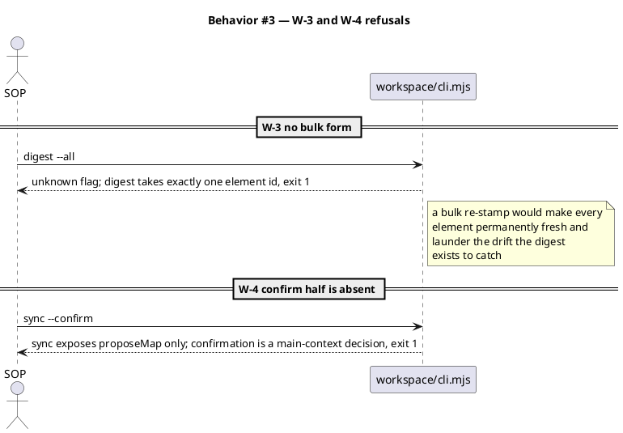
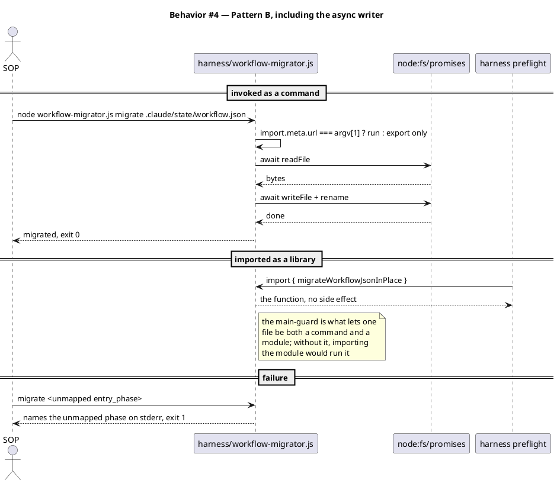
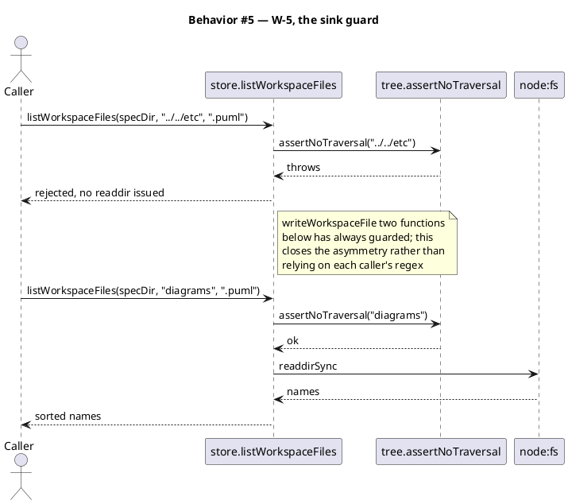
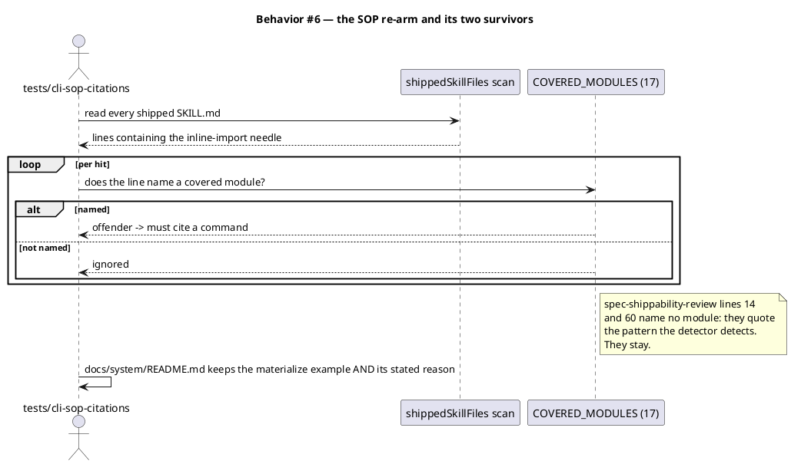
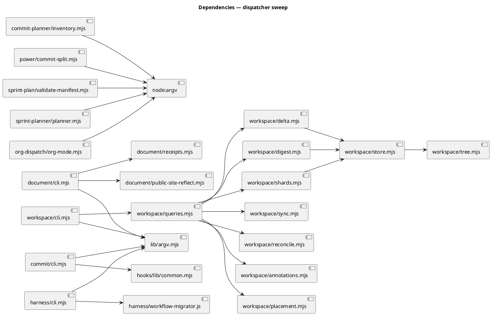

# Dispatcher sweep — a front door for the remaining call sites

## Context

| Input | Path |
|---|---|
| Intake | *(excepted — `spec-entry` track)* |
| BRD *(if any)* | *(none)* |
| Scout *(if any)* | *(excepted — evidence gathered in this phase, enumerated below)* |
| Research *(if any)* | *(excepted — `spec-derived`; the precedent is in-repo)* |

Upstream: backlog `finish-the-dispatcher-sweep`, and `docs/archive/2026-08-08/skill-helper-cli-dispatchers/spec.md → ## Non-goals`, which records this remainder as deliberate follow-on scope.

**Write set**: `.claude/skills/lib/argv.mjs`, `.claude/skills/workspace/cli.mjs`, `.claude/skills/workspace/queries.mjs`, `.claude/skills/workspace/store.mjs`, `.claude/skills/document/cli.mjs`, `.claude/skills/commit/cli.mjs`, `.claude/skills/commit-planner/inventory.mjs`, `.claude/skills/power/commit-split.mjs`, `.claude/skills/sprint-plan/validate-manifest.mjs`, `.claude/skills/sprint-planner/planner.mjs`, `.claude/skills/org-dispatch/org-mode.mjs`, `.claude/skills/harness/cli.mjs`, `.claude/skills/*/SKILL.md`, `tests/**`, `tests/helpers/cli-runner.mjs` — non-architectural profile (reduced diagram set).

### The measured call-site census

Enumerated at this phase against HEAD `9179afd`. `grep -rn 'node -e "import('` over shipped `SKILL.md` returns **19 hits in 15 files**. Two are not call sites:

| File | Line | Why it is not a call site |
|---|---|---|
| `spec-shippability-review/SKILL.md` | 14 | Prose quoting the v0.8.1 marker-import bug this skill exists to catch. |
| `spec-shippability-review/SKILL.md` | 60 | The detector's own definition of "runtime invocation". |

Rewriting either would delete the detector's description of what it detects. They survive, and AC-018 locks that.

The **17 real call sites** and their targets:

| # | Call site | Target | Access |
|---|---|---|---|
| 1 | `archive/SKILL.md:31` | `workspace/delta.mjs → verifyAndApplyDelta` | write |
| 2 | `code-structure/SKILL.md:240` | `workspace/placement.mjs → annotationPlacementAllowed` | read |
| 3 | `memory-flush/SKILL.md:114` | `workspace/digest.mjs → stampElement` | write |
| 4 | `scout/SKILL.md:41` | `workspace/reconcile.mjs → reconcile` | read |
| 5 | `scout/SKILL.md:71` | `workspace/annotations.mjs → scanAnnotations` | read |
| 6 | `spec-sync/SKILL.md:41` | `workspace/sync.mjs → proposeMap` | read |
| 7 | `system-reconcile/SKILL.md:71` | `workspace/shards.mjs → writeDiagramShard` | write |
| 8 | `document/SKILL.md:52` | `document/receipts.mjs → recordReceipt` | write |
| 9 | `document/SKILL.md:68` | `document/public-site-reflect.mjs → findDescribedSurfaces` | read |
| 10 | `commit/SKILL.md:36` | `hooks/lib/common.mjs → isAutonomousFeatureLanding` | read |
| 11 | `commit/SKILL.md:26` | `power/commit-split.mjs → planCommits` | read |
| 12 | `power/SKILL.md:42` | `power/commit-split.mjs → planCommits` | read |
| 13 | `commit-planner/SKILL.md:24` | `commit-planner/inventory.mjs → groupDirtyTree` | read |
| 14 | `sprint-plan/SKILL.md:53` | `sprint-plan/validate-manifest.mjs → validateManifest` | read |
| 15 | `sprint-planner/SKILL.md:47` | `sprint-planner/planner.mjs → selectSprint` | read |
| 16 | `org-dispatch/SKILL.md:16` | `org-dispatch/org-mode.mjs → orgDispatchGate` | read |
| 17 | `harness/SKILL.md:91` | `harness/workflow-migrator.js → migrateWorkflowJsonInPlace` | write, **async**, **build mirror** |

**Two corrections to the intake framing, both verified against source.** `sync.proposeMap` is read-only — it returns `{concepts}` and writes nothing; the writer in that module is `runSync`. `placement.annotationPlacementAllowed` is likewise a three-line predicate; the writer is `proposeLoadBearing`. The writers are instead **five**: `verifyAndApplyDelta`, `stampElement`, `writeDiagramShard`, `recordReceipt`, and `migrateWorkflowJsonInPlace`.

## Goal

Every one of the 17 inline-import call sites invokes a named command, the five write paths reach disk only through a single stated guard contract, and `COVERED_MODULES` names all 17 targets so AC-012 of the prior spec is armed against the whole set.

## Non-goals

- **No new query or write logic.** Every function exposed already exists, is tested, and is governed. This adds Orchestration over an existing Domain layer.
- **No change to the sync/confirm split.** `sync` exposes `proposeMap`; `runSync` gets no front door. `placement` exposes `annotationPlacementAllowed`; `proposeLoadBearing` gets none. Confirmation is a main-context decision (Article II) and does not move behind a flag.
- **No bulk re-stamp.** `digest` takes exactly one element id. `memory-flush/SKILL.md` Step 0e states the reason: a bulk path would make every element permanently fresh and launder the drift the digest exists to catch.
- **No `.claude/hooks/lib/cli.mjs`.** `hooks-common-lib` is anchored at the FILE `.claude/hooks/lib/common.mjs`, not a glob, so a new sibling there would be an uncovered governed path needing its own element — a disproportionate cost for one read-only predicate. Site 10 routes through `commit/cli.mjs` instead (D3).
- **No edit to `workflow-migrator.js`, in either tree.** It is a build mirror; the `.claude` copy is reverted by the next build and the `src/cli` copy would pull the write_set into `src/**`. Its front door is a wrapper at `.claude/skills/harness/cli.mjs` that imports it (D2). `src/cli/**` is therefore NOT in the write set, and the non-architectural diagram profile still applies.
- **No retrofit of the 40 existing self-dispatching helpers.** They already have front doors. Only the 17 cited sites are in scope.
- **No new dispatcher for `scout`, `archive`, `spec-sync`, `code-structure`, `system-reconcile`.** None contains a `.mjs` helper; each is a consumer of `workspace/` and changes only as a caller. This continues the prior spec's "No `scout` dispatcher" rule.

## Decisions

Recorded per Article XI.12: routine engineering forks are decided in main context with rationale and reviewed at gate A, not asked.

| # | Decision | Owner | Rationale |
|---|---|---|---|
| D1 | Two front-door patterns are sanctioned, and the module's shape picks which. **Pattern A** (a `cli.mjs` dispatching over `lib/argv.mjs`) for a directory with several related functions, **or for a module that cannot host its own entry point**; **Pattern B** (a `process.argv` entry point guarded by an `import.meta.url` main check, inside the module itself) for a single-purpose helper. | engineer | Measured: **40** skill-helper modules already self-dispatch on `process.argv` against **4** using Pattern A — including every `harness/` helper but `workflow-migrator.js`. Forcing Pattern A everywhere would build 7 dispatchers to wrap single-function modules and put a second, competing front door beside 17 harness helpers that already have one. Final split: **3 new Pattern A dispatchers** (`document`, `commit`, `harness`) and **5 Pattern B entry points**. Both patterns satisfy AC-012: neither leaves a `node -e "import(` behind. |
| D2 | ~~`lib/argv.mjs` keeps its **synchronous** `dispatch`.~~ **Corrected at implement time: `dispatch` is now `async` and awaits the handler.** | engineer | The original reasoning was that the one async target (`migrateWorkflowJsonInPlace`) could carry its own Pattern B entry point, so the Foundation module need not change. That premise was false. `.claude/skills/harness/workflow-migrator.js` is a **byte-for-byte build mirror** of `src/cli/workflow-migrator.js` (`scripts/build-template.sh` Stage 0b, guarded by `tests/vendored-mirror-bytes.test.mjs`, and recorded in two landmines). An entry point written into the mirror is reverted by the next `npm run build`; written into the source, it drags the write_set into `src/**`, which matches no `diagram_profiles` entry and would demand the full C4 set for a main-guard. The migrator therefore gets a Pattern A front door at `.claude/skills/harness/cli.mjs`, and `dispatch` awaits. Awaiting costs the synchronous handlers nothing (`await` on a non-promise emits the identical value), and AC-016's regression row is the guard. |
| D3 | Site 10 (`isAutonomousFeatureLanding`) is exposed as a `commit/cli.mjs` subcommand that imports from `../../hooks/lib/common.mjs`. | engineer | `commit-helpers` is glob-anchored at `.claude/skills/commit/*.mjs`, so the new file is already covered and adds no System delta row. A skills→hooks import is established precedent, not new: `workspace/delta.mjs` already imports `../../hooks/lib/slug.mjs`. The alternative — a CLI under `.claude/hooks/lib/` — creates an uncovered governed path (see Non-goals). |
| D4 | The five write paths share **one** guard contract, stated once here as W-1..W-5 and applied identically by every write subcommand. | engineer | This is the gap the prior pass deferred. Deciding it per-subcommand at implement time is what produces five slightly different validations, of which the weakest is the real one. |
| D5 | `listWorkspaceFiles` gets `assertNoTraversal(kind)` at the sink, closing backlog `listworkspacefiles-lacks-traversal-guard-3529` in this workflow. | engineer | The entry deferred it at LOW on the stated ground that the only taint source was a regex-constrained capture (`[a-z0-9_-]+`) that cannot express `..`. This spec adds argv-fed subcommands to the same module family, which removes that argument. One line at the sink, plus a rejection test. |
| D6 | Human-readable output is the default; `--json` is opt-in. Exit codes stay `0` ok / `1` usage or validation / `2` not found. | engineer | Inherits the prior spec's D6 and shared conventions verbatim. A second convention would make the two dispatcher generations disagree. |

### The writer contract (W-1..W-5)

Binding on all five write paths. D4 fixes it once so no subcommand invents its own.

| # | Rule | Applied by |
|---|---|---|
| W-1 | Every argv-supplied identifier is validated by the validator the Domain module already trusts — `assertSafeSlug` for element ids and slugs, `assertNoTraversal` for path segments — **before any path is constructed**. REJECT, never normalize: no subcommand "repairs" a bad id, because a repaired id writes confidently to the wrong place. | every write subcommand |
| W-2 | A corpus writer no-ops when `architectureMapEnabled({rootDir})` is false, returning `written: false` and exit 0. | `delta`, `digest`, `shards` |
| W-3 | No write subcommand accepts an `--all`, glob, or multi-id form. One invocation writes one thing. | every write subcommand |
| W-4 | Where the Domain module splits propose from confirm, only the propose half is exposed. | `sync`, `placement` |
| W-5 | A directory segment reaching a filesystem primitive is guarded at that primitive, not by its caller's regex. | `store.listWorkspaceFiles` |

W-1 and W-2 restate what `writeDiagramShard` already does in its first two lines. The contract's value is that `recordReceipt` and `verifyAndApplyDelta` are held to the same bar rather than to whatever their call site happened to pass.

## Design

Diagrams are the contract. Prose covers only what a diagram cannot say.

The standing structural model is referenced rather than redrawn:

```
@ref element:workspace-corpus
```

### C4 — Component

Two front-door patterns over Domain modules that already exist. No new Domain logic; no dispatcher imports across a skill boundary except the one D3 sanctions.



### Data model — class diagram

No persisted entity is added. `ParsedArgs` gains no field; its `flags` map gains keys, which is why the declared flag vocabulary is the thing that changes.



#### Migration DDL

*(none)* — no datastore. The corpus is plain files (constraint `zero-runtime-dependencies`). No field above carries a `<<new>>` stereotype for that reason: the stereotype means "needs an ALTER", and nothing here has a table behind it. Additions are named in the note instead.

**Why the vocabulary is a `<<changed>>` shape and not an implementation detail.** `lib/argv.mjs` declares `VALUE_FLAGS` as one shared union because under `strict: false` an undeclared `--kind sequence` parses as `kind: true` and leaks `sequence` into positionals, silently discarding the value. A new value-taking flag that is not declared there fails quietly, not loudly. Six flags are added; AC-016 asserts each parses its value.

### Behavior — sequence per AC













### State — core entity

*(none)* — every subcommand is single-shot. No entity carries a lifecycle.

### Dependencies — graph



Acyclic. Every edge runs Orchestration → Domain or Domain → Foundation. No Domain module imports a dispatcher, and no Pattern B module gains an import.

### Contracts

Every command string is pinned: 15 SOP files will cite them.

| Kind | Name | Input | Output | Errors | Idempotent |
|---|---|---|---|---|---|
| CLI | `workspace/cli.mjs delta --slug <slug> [--touched <csv>]` | slug, touched paths | verified + applied delta rows | 1 bad slug / unverified row, 2 spec absent | yes |
| CLI | `workspace/cli.mjs digest <element-id>` | one element id | `{written, path}` | 1 bad id, 2 element absent | yes |
| CLI | `workspace/cli.mjs shards <element-id> --kind <kind> [--label <text>]` | element id, diagram kind, optional label | `{written, path}` | 1 bad id or **missing** kind | yes |
| CLI | `workspace/cli.mjs placement <key> [--mem-dir <dir>]` | memory entry key | `true` / `false` | 1 bad key | yes |
| CLI | `workspace/cli.mjs reconcile [--touched <csv>]` | touched paths | the seven-check drift report | — | yes |
| CLI | `workspace/cli.mjs annotations` | — | scanned annotation records | — | yes |
| CLI | `workspace/cli.mjs sync` | — | the proposed concept map | — | yes |
| CLI | `document/cli.mjs receipt --slug <s> --surface <s> --delegate <d>` | receipt fields | append confirmation | 1 bad slug or missing field | no (appends) |
| CLI | `document/cli.mjs receipts --slug <slug>` | slug | the receipts recorded so far | 1 bad slug | yes |
| CLI | `document/cli.mjs surfaces --touched <csv>` | changed paths | described site surfaces naming their tokens | 1 empty/missing `--touched` | yes |
| CLI | `harness/cli.mjs migrate <path>` | workflow.json path | migrated in place (async) | 1 unmapped `entry_phase`, 2 file absent | yes |
| CLI | `commit/cli.mjs is-autonomous-landing` | — | `true` / `false` | — | yes |
| CLI | `commit-planner/inventory.mjs group` | — | dirty tree grouped by concern | — | yes |
| CLI | `power/commit-split.mjs plan` | — | ordered Conventional Commit plan | — | yes |
| CLI | `sprint-plan/validate-manifest.mjs validate <path>` | manifest path | validation result | 1 malformed manifest, 2 absent | yes |
| CLI | `sprint-planner/planner.mjs select <input-json>` | `{tasks,statusById,capacity}` | proposed sprint task-set | 1 malformed JSON | yes |
| CLI | `org-dispatch/org-mode.mjs gate` | — | the org-dispatch gate verdict | — | yes |


**Shared conventions.** Unchanged from the prior spec: `--root` (default cwd), `--spec-dir` (default `docs/system`), `--json` on every read subcommand, exit `0` / `1` / `2`. Pattern B modules honour the same exit codes and the same `--json`, but do not import `lib/argv.mjs` — a single-subcommand module parsing one positional does not need a dispatcher, and importing one would add the cross-directory dependency D1 exists to avoid.

### Libraries and versions

| Library@version | Purpose | Key APIs | Confirmed against current docs |
|---|---|---|---|
| `node@>=18.17.0` (builtin) | argv parsing, fs, path | `process.argv`, `node:util parseArgs`, `node:fs`, `node:fs/promises`, `import.meta.url` | yes — engines pin in `package.json`; no third-party API involved |

No third-party library is added. Constraint `zero-runtime-dependencies` holds.

### Alternatives considered

| Alt | Summary | Rejected because |
|---|---|---|
| A | Pattern A everywhere — 7 new `cli.mjs` dispatchers | Builds 7 dispatchers to wrap 6 single-function modules, and puts a competing front door beside 17 `harness/` helpers that already self-dispatch. Contradicts the larger in-repo precedent (40 vs 4). |
| B | Pattern B everywhere — retire `lib/argv.mjs` | Discards four shipped dispatchers and the shared exit-code contract 16 SOPs already cite. A directory with 7 related subcommands genuinely needs a table of contents. |
| C | Make `dispatch` async so `workflow-migrator` can be a subcommand | Changes a Foundation module four dispatchers depend on, to serve one caller that D1 already routes elsewhere. |
| D | Defer the five writers; ship the 12 read sites only | This IS the deferral. The prior pass took it once; taking it twice leaves the guard analysis permanently unowned, which is the condition the backlog entry was filed to end. |
| E | Fix `listWorkspaceFiles` in a separate workflow | The entry's own deferral rationale is that the taint source cannot express traversal. This spec puts argv into that module family, so the rationale expires here — deferring again would leave a stated-stale justification on disk. |
| F | Give `workflow-migrator.js` a Pattern B entry point (the original D1 routing) | Discovered false at implement time: the file is a build mirror, so the entry point is reverted by the next `npm run build`. Two landmines and `tests/vendored-mirror-bytes.test.mjs` already record this trap. |
| G | Add the entry point to `src/cli/workflow-migrator.js` instead | Correct in mechanism, wrong in cost: it pulls `src/**` into the write_set, which matches no `diagram_profiles` entry, so a one-line main-guard would demand the full C4 set. The wrapper at `harness/cli.mjs` buys the same front door for neither cost. |

## Design calls

*(none)* — the write set intersects no path in `project.json → tdd.ui_globs`.

## System delta

Every new file falls inside an existing element's glob anchor, verified against `docs/system/elements/`:

- `.claude/skills/document/cli.mjs` → `document-helpers` (`.claude/skills/document/*.mjs`)
- `.claude/skills/commit/cli.mjs` → `commit-helpers` (`.claude/skills/commit/*.mjs`)
- `.claude/skills/harness/cli.mjs` → `harness-helpers` (`.claude/skills/harness/*.mjs`)

No file is added under `.claude/hooks/lib/`, whose element `hooks-common-lib` is FILE-anchored and would leave a sibling uncovered (D3, Non-goals). `workspace/cli.mjs`, `store.mjs` and `queries.mjs` are existing members of the `workspace-corpus` glob. The six Pattern B modules are edited, not created. `node .claude/skills/workspace/cli.mjs coverage` reports no uncovered governed path at HEAD `9179afd`, and this write set adds none.

Two elements change shape rather than membership: `workspace-corpus` gains seven subcommands on its front door and a guard at `listWorkspaceFiles`, and `harness-helpers` gains its first shared dispatcher (`cli.mjs`) beside the seventeen helpers that already self-dispatch.

| Verb | Element | Anchor | Concept | Kind |
|---|---|---|---|---|
| change | workspace-corpus | `.claude/skills/workspace/*.mjs` | memory-model | c4_component |
| change | harness-helpers | `.claude/skills/harness/*.mjs` | harness-loop | c4_component |

## Acceptance criteria

| ID | Criterion (given / when / then) | Kind | Upstream AC | Sequence |
|---|---|---|---|---|
| AC-001 | given `workspace/cli.mjs --help`, when it runs, then it lists all 16 subcommands (9 existing + 7 added) with one-line summaries, exit 0 | behavior | backlog `finish-the-dispatcher-sweep` | §Behavior #1 |
| AC-002 | given a slug whose spec declares a confirmed delta row, when `workspace/cli.mjs delta --slug <slug>` runs, then it verifies then applies the row and reports what it wrote, exit 0 | behavior | site 1 | §Behavior #2 |
| AC-003 | given one element id, when `workspace/cli.mjs digest <id>` runs, then exactly that element is re-stamped and the reported path names it, exit 0 | behavior | site 3 | §Behavior #2 |
| AC-004 | given an element id and `--kind sequence`, when `workspace/cli.mjs shards <id> --kind sequence` runs, then one `.puml` shard is written for that element, exit 0; an **unregistered** kind is likewise written and binds `none`, while a **missing** kind is refused, exit 1 | behavior | site 7 | §Behavior #2 |
| AC-005 | given a memory entry key, when `workspace/cli.mjs placement <key>` runs, then it prints the load-bearing predicate and writes nothing, exit 0 | behavior | site 2 | §Behavior #1 |
| AC-006 | given the corpus, when `reconcile`, `annotations` and `sync` each run, then each returns its Domain function's result unchanged and writes nothing, exit 0 | behavior | sites 4,5,6 | §Behavior #1 |
| AC-007 | given an id containing a traversal segment or an absolute prefix, when any of the five write subcommands receives it, then it is rejected before any path is constructed, exit 1, and no file is read or written | error-mapping | W-1 | §Behavior #2 |
| AC-008 | given `memory.architecture_map.enabled` is not true, when `delta`, `digest` or `shards` runs, then each returns `written: false`, exit 0, and touches no file | preflight | W-2 | §Behavior #2 |
| AC-009 | given `--all` or a second positional id, when any write subcommand receives it, then it is rejected naming the one-per-invocation rule, exit 1 | error-mapping | W-3 | §Behavior #3 |
| AC-010 | given `sync` or `placement`, when any flag attempts the confirm half, then it is rejected and neither `runSync` nor `proposeLoadBearing` is reachable from any CLI path | error-mapping | W-4 | §Behavior #3 |
| AC-011 | given a `kind` segment containing `..` or an absolute prefix, when `store.listWorkspaceFiles` receives it, then it throws before `readdirSync` is issued | error-mapping | W-5, backlog `-3529` | §Behavior #5 |
| AC-012 | given `document/cli.mjs`, when `receipt` and `surfaces` run with valid arguments, then each invokes its Domain function and reports the result, exit 0 | behavior | sites 8,9 | §Behavior #1 |
| AC-013 | given `commit/cli.mjs is-autonomous-landing`, when it runs, then it prints the live predicate from `hooks/lib/common.mjs`, exit 0 | behavior | site 10 | §Behavior #1 |
| AC-014 | given each of the 5 Pattern B modules, when invoked as a command, then it runs its subcommand and its `--help` names it; when imported, then it produces no side effect and does not exit | behavior | sites 11–16 | §Behavior #4 |
| AC-015 | given `harness/cli.mjs migrate <path>`, when it runs, then the awaited write completes before the process exits, an unmapped `entry_phase` exits 1 naming the phase, and an absent path exits 2 | error-mapping | site 17, D2 | §Behavior #4 |
| AC-016 | given each of the seven added value flags (`slug`, `kind`, `mem-dir`, `surface`, `delegate`, `touched`, `label`), when passed with a value, then the value lands in `flags` and no positional is polluted; and the eight pre-existing flags plus the four shipped dispatchers behave unchanged after `dispatch` becomes async | behavior | D1, D2, the `strict:false` trap | §Behavior #1 |
| AC-017 | given a shipped SKILL.md, when scanned, then no `node -e "import(` remains for any of the 17 covered targets, and `COVERED_MODULES` names all 17 | behavior | prior AC-012 re-arm | §Behavior #6 |
| AC-018 | given `spec-shippability-review/SKILL.md`, when the work lands, then lines 14 and 60 still describe the inline-import pattern the skill detects | behavior | census correction | §Behavior #6 |
| AC-019 | given `docs/system/README.md`, when the work lands, then the `materialize` example and its stated reason both survive | behavior | prior AC-013 | §Behavior #6 |
| AC-020 | given the template build, when `scripts/build-template.sh` runs, then every new and edited file appears in `obj/template/.claude/manifest.json` with a sha256, and `audit-baseline` exits 0 | smoke | Article XII | §Behavior #4 |

## Test plan

| Category | Scenario | Expected | Covers |
|---|---|---|---|
| Golden path | `workspace/cli.mjs --help` | 16 subcommands listed | AC-001 |
| Golden path | `digest surfacing-triggers` on a fixture corpus | that element re-stamped, path reported | AC-003 |
| Golden path | `shards <id> --kind sequence` | one `.puml` written, `written:true` | AC-004 |
| Golden path | `placement <key>` | predicate printed, corpus byte-identical after | AC-005 |
| Golden path | `reconcile`, `annotations`, `sync` | each equals its Domain function's return | AC-006 |
| Golden path | `document/cli.mjs surfaces --slug <s>` | `findDescribedSurfaces` result | AC-012 |
| Golden path | `commit/cli.mjs is-autonomous-landing` | matches `isAutonomousFeatureLanding()` directly called | AC-013 |
| Golden path | each argument-free Pattern B module invoked as a command | subcommand result, exit 0 | AC-014 |
| Golden path | every Pattern B module's `--help` | names its own subcommand | AC-014 |
| Contract violation | an argument-taking Pattern B module invoked with no argument | usage error, exit 1 | AC-014 |
| Input boundary | `--kind` with an unregistered diagram kind | written, and `bindingFor` reports witness `none` | AC-004 |
| Input boundary | `shards` with no `--kind` | rejected, exit 1, nothing written | AC-004 |
| Input boundary | empty, max-length and unicode element ids | rejected, exit 1 | AC-007 |
| Input boundary | each added value flag passed with a value | value in `flags`, positionals unpolluted | AC-016 |
| Input boundary | an added value flag passed with no value | usage error, exit 1, not silently `true` | AC-016 |
| Contract violation | `digest ../../etc/passwd`, `shards a/../../b` | rejected pre-path-construction, exit 1, zero fs calls | AC-007 |
| Contract violation | `digest --all`, `digest id1 id2` | rejected naming the one-per-invocation rule | AC-009 |
| Contract violation | `sync --confirm`, `placement --confirm` | rejected; `runSync`/`proposeLoadBearing` unreachable from CLI | AC-010 |
| Contract violation | `listWorkspaceFiles(specDir, "../../etc", ".puml")` | throws before `readdirSync` | AC-011 |
| Contract violation | `sprint-planner/planner.mjs select '{bad json'` | rejected, exit 1 | AC-014 |
| Failure mode | `architecture_map.enabled` false, then `delta`/`digest`/`shards` | `written:false`, exit 0, tree byte-identical | AC-008 |
| Failure mode | `workflow-migrator.js migrate` on an unmapped `entry_phase` | exit 1 naming the phase, file unchanged | AC-015 |
| Failure mode | `workflow-migrator.js migrate` on an absent path | exit 2, no partial write | AC-015 |
| Concurrency / ordering | `migrate` process exits only after the awaited write lands | re-read shows migrated content, never truncated | AC-015 |
| Concurrency / ordering | two `reconcile` runs over an unchanged tree | byte-identical output | AC-006 |
| Regression trap | importing each Pattern B module | no side effect, no process exit | AC-014 |
| Regression trap | every existing `workspace/` and `document/` export still importable | unchanged | AC-001 |
| Regression trap | the 4 pre-existing dispatchers' subcommands | unchanged behavior and exit codes | AC-016 |
| Regression trap | scan shipped SKILL.md for the inline-import needle | zero hits naming a covered module; `COVERED_MODULES.length === 17` | AC-017 |
| Regression trap | `spec-shippability-review/SKILL.md` lines 14 and 60 | still present | AC-018 |
| Regression trap | `docs/system/README.md` | `materialize` example and its reason both present | AC-019 |
| Regression trap | `audit-baseline` after `scripts/build-template.sh` | exit 0, every new file hashed in the manifest | AC-020 |

## Observability

| Signal | Name | Shape | Purpose |
|---|---|---|---|
| Exit code | command exit | `0` ok, `1` usage/validation, `2` not found | the SOP's and CI's only branch signal |
| Stderr | rejection reason | one line naming the rejected input and the rule that rejected it | makes a REJECT diagnosable without a stack trace |
| Stdout | `written` field | `{written, path}` on every write subcommand | distinguishes "flag off, did nothing" from "wrote" — the W-2 no-op must not look like success |

No metric or alarm: single-shot CLI invocations in a developer tree.

## Rollout

### Prerequisites

| # | Prerequisite | enforced-by |
|---|---|---|
| 1 | No write subcommand constructs a path from unvalidated argv | AC-007 |
| 2 | A project that never opted into the architecture map is untouched by every corpus writer | AC-008 |
| 3 | No CLI path reaches a confirm-half function or a bulk write | AC-009 |
| 4 | The `listWorkspaceFiles` sink rejects traversal before issuing a directory read | AC-011 |
| 5 | The async migrator's write completes before its process exits | AC-015 |
| 6 | Every new and edited file reaches consumer installs through the manifest | AC-020 |

- **Feature flag**: none. The commands are inert without call sites, and the corpus subcommands respect `memory.architecture_map.enabled` through `flags.mjs` (W-2).
- **Migration order**: 1 `lib/argv.mjs` flag vocabulary → 2 `store.mjs` sink guard (W-5) → 3 `workspace/queries.mjs` + `cli.mjs` subcommands → 4 `document/cli.mjs` and `commit/cli.mjs` → 5 the six Pattern B entry points → 6 the 17 SOP rewrites → 7 `COVERED_MODULES` re-arm → 8 `scripts/build-template.sh` → 9 `audit-baseline`.
- **Canary**: none — a developer-tree CLI with no runtime surface.

## Rollback

- **Kill-switch**: `git revert` of the landing commit. No state, no flag, no data migration; the Domain modules are untouched except for the one-line `store.mjs` guard, which reverts with it.
- **Signal to roll back**: `audit-baseline` exits non-zero, or any SOP cites a command that exits 1 on a clean tree. Both surface on the next workflow that runs the affected phase.

## Archive plan

- Defaults *(automatic)*: spec, spec approval, security report.
- Extras *(list any non-default files)*:
  - *(none)*

## Open questions

- *(none)* — D1–D6 close every fork, and W-1..W-5 close the guard contract the prior pass deferred. One scope risk is recorded rather than left implicit: this spec is roughly triple the change that shipped as `4cc46e0`, and that workflow was split mid-flight when it outgrew its spec. The mitigation is that the census here is measured (17 sites, named individually) rather than estimated, and the migration order above is sequenced so steps 1–5 land the mechanism and step 6 is repetitive rewriting that can be verified per file.
